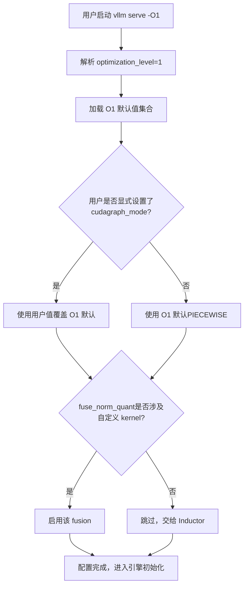
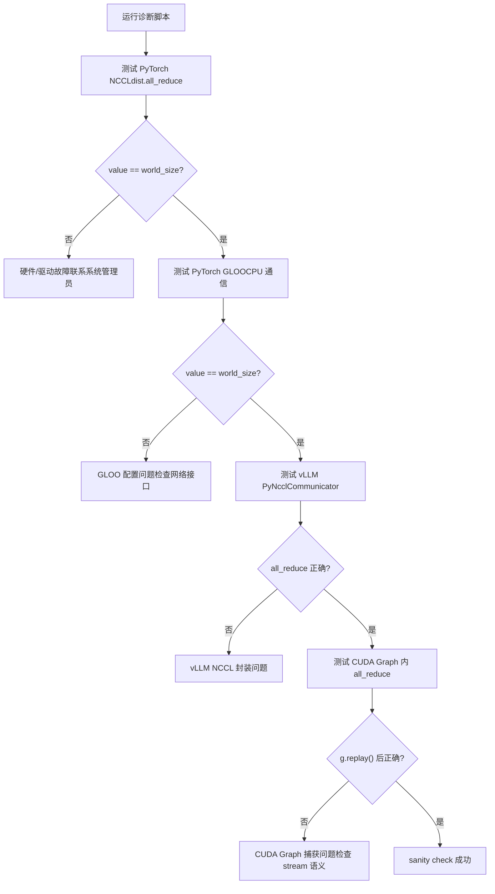
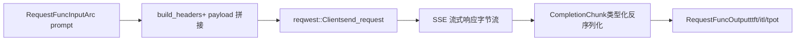

# Chapitre 14 : Compromis architecturaux, pièges en production et évolution future

Dans le chapitre précédent, nous avons décomposé le mécanisme d'extension par plugins de vLLM, en voyant comment les plugins de plateforme, les plugins IO processor et les plugins endpoint permettent au moteur de s'adapter à de nouveaux matériels, de nouveaux modalités et de nouvelles API sans modifier le code cœur. Cette extensibilité permet à vLLM d'embrasser rapidement le changement, mais plus les points d'extension sont nombreux, plus les chemins d'interaction en production deviennent complexes. Lorsque la fragmentation de la mémoire GPU, les échecs de handshake NCCL, l'invalidation du cache de compilation et la gigue réseau surviennent simultanément, les mécanismes présentés dans les treize chapitres précédents s'entrechoquent et révèlent des tensions invisibles en environnement idéal. Ce chapitre n'introduit pas de nouveau mécanisme cœur, mais rassemble ces mécanismes, en s'appuyant sur la documentation officielle de troubleshooting comme point d'ancrage, et en combinant la conception de l'outil de bench du frontend Rust, pour examiner les arbitrages entre performance et opérabilité, et fournir un parcours de diagnostic actionnable.

# I. Niveaux d'optimisation : un contrat explicite entre temps de démarrage et performance d'exécution

## Modèle intuitif

Les niveaux d'optimisation ressemblent aux « modes de scène » d'un appareil photo : le mode automatique (`-O2`) convient à la plupart des situations, mais lorsque vous devez capturer rapidement (débogage), passer en mode manuel (`-O0`) permet une réponse immédiate, au prix d'une baisse de qualité d'image (performance). vLLM fait de cet arbitrage un contrat explicite à quatre niveaux, plutôt que de le cacher dans des dizaines de flags booléens que l'utilisateur doit assembler lui-même.

## Disposition des champs des quatre niveaux

vLLM fournit`-O0`à`-O3`quatre niveaux[FACT:docs/design/optimization_levels.md:5-5]. Le principe de conception fondamental est :**les flags explicitement définis par l'utilisateur ont priorité sur les valeurs par défaut du niveau d'optimisation** [FACT:docs/design/optimization_levels.md:5-5]. Cela signifie que le niveau d'optimisation n'est qu'un ensemble de valeurs par défaut, et non une contrainte stricte.

`-O0`désactive tout : pas d'autotuning, pas de compilation, pas de cudagraph[FACT:docs/design/optimization_levels.md:32-33]. Concrètement, cela se traduit par quatre interrupteurs :`cudagraph_mode=NONE`、`mode=NONE`, toutes les fusions désactivées,`enable_flashinfer_autotune=False` [FACT:docs/design/optimization_levels.md:37-40]。

`-O1`est le point d'équilibre pour les scénarios de développement : activation de`PIECEWISE`cudagraph et du mode`VLLM_COMPILE`. Notez un détail subtil :[FACT:docs/design/optimization_levels.md:50-51]et`fuse_norm_quant`ne sont activés que lorsqu'un des opérateurs utilise un kernel personnalisé, sinon l'auto-fusion d'Inductor donne de meilleurs résultats`fuse_act_quant`. C'est un jugement de conception typique de « ne pas empiéter sur le travail du compilateur ».[FACT:docs/design/optimization_levels.md:61]est la valeur par défaut, orientée production

`-O2`. Elle ajoute à[FACT:docs/design/optimization_levels.md:66-67]les`-O1`cudagraph et`FULL_AND_PIECEWISE`actuellement équivalent à`fuse_allreduce_rms` [FACT:docs/design/optimization_levels.md:72-73]。`-O3`, réservant`-O2`pour des optimisations expérimentales plus agressives à l'avenir[FACT:docs/design/optimization_levels.md:80-81]。

## Processus de sélection piloté par le scénario

Lorsqu'un utilisateur exécute`vllm serve model -O1`, que se passe-t-il en interne ? Le diagramme de flux ci-dessous montre comment le niveau d'optimisation interagit avec les flags utilisateur :

La clé de ce processus réside dans la branche`check_user`: un paramètre explicitement défini par l'utilisateur a toujours priorité[FACT:docs/design/optimization_levels.md:5-5]. Cela évite des problèmes difficiles à diagnostiquer tels que « le niveau d'optimisation a silencieusement écrasé mon flag de débogage ».

## Réflexions de conception et pièges

Le piège de production le plus courant lié aux niveaux d'optimisation est**un temps de démarrage trop long**. La documentation recommande explicitement : en cas de temps de démarrage trop long, utiliser`-O0`ou`-O1` [FACT:docs/design/optimization_levels.md:87]. Mais il y a un coût caché —`-O0`sans cudagraph, le surcoût de lancement CPU de chaque kernel devient visible, et le débit peut chuter de plusieurs facteurs dans des scénarios à forte concurrence.

Un autre piège est**les erreurs de compilation**。`-O2`: les`FULL_AND_PIECEWISE`cudagraph de`-O2`imposent des hypothèses plus fortes sur la structure du modèle ; certains modèles personnalisés échouent à la compilation sous`-O1`mais fonctionnent normalement sous`debug_dump_path`. La documentation recommande d'utiliser[FACT:docs/design/optimization_levels.md:88]pour obtenir plus d'informations de débogage`-O0`. Le parcours de diagnostic devrait être : d'abord utiliser`-O1`、`-O2`pour confirmer la correction fonctionnelle, puis monter progressivement jusqu'à

> **[Design Inference & Architectural Trade-offs]**
> 〔Inférence de conception et compromis architecturaux〕`--enforce-eager`C'est la même méthodologie : d'abord confirmer la justesse avec la configuration la plus conservatrice, puis activer progressivement les optimisations, en isolant le problème sur la plus petite différence de configuration.

---

# II. Liste des pièges en production : chemin de diagnostic du symptôme à la cause racine

## Modèle intuitif

Le dépannage en production ressemble au triage aux urgences : vous ne pouvez pas faire passer une batterie complète d'examens à tous les patients, vous devez d'abord réduire rapidement le périmètre selon les symptômes (OOM, hang, crash), puis approfondir de manière ciblée. La documentation de troubleshooting de vLLM est essentiellement un manuel de triage.

## Classification des symptômes et outils de diagnostic

La documentation classe les problèmes courants en plusieurs grandes catégories ; nous les présentons par difficulté de diagnostic croissante.

**Première catégorie : blocage lors du téléchargement/chargement du modèle.**Le symptôme est une absence de réponse prolongée après le démarrage. La cause racine est généralement un réseau lent ou un système de fichiers partagé lent[FACT:docs/usage/troubleshooting.md:11-11]. Le moyen de diagnostic est`--load-format dummy`de sauter le chargement des poids, pour isoler s'il s'agit d'une lenteur de téléchargement ou de chargement[FACT:docs/usage/troubleshooting.md:23-23]. C'est une technique typique d'« isolation par dichotomie ».

**Deuxième catégorie : OOM de mémoire GPU.**La documentation pointe directement vers la documentation de configuration conserving_memory[FACT:docs/usage/troubleshooting.md:23]. Mais en production, l'OOM n'est souvent pas dû à un modèle trop grand, mais à la fragmentation du KV cache ou à un nombre de requêtes concurrentes supérieur aux attentes.

**Troisième catégorie : changement de la qualité de génération.**C'est un piège facile à négliger. La v0.8.0 a changé la source des paramètres d'échantillonnage par défaut : des valeurs neutres par défaut de vLLM vers celles de l'auteur du modèle`generation_config.json` [FACT:docs/usage/troubleshooting.md:23-23]. Dans la plupart des cas, cela améliore la qualité, mais pour certains modèles, la configuration est au contraire moins bonne[FACT:docs/usage/troubleshooting.md:23-23]. La méthode de diagnostic consiste à revenir à`--generation-config vllm`pour comparer[FACT:docs/usage/troubleshooting.md:23-23]。

**Quatrième catégorie : blocage (hang).**C'est la catégorie la plus difficile à diagnostiquer. La documentation fournit un ensemble progressif de variables d'environnement de débogage[FACT:docs/usage/troubleshooting.md:41-41]：

- `VLLM_LOGGING_LEVEL=DEBUG`: activer les logs détaillés
- `VLLM_LOG_STATS_INTERVAL=1.`: sortie à haute fréquence de l'état de la file d'attente et des hits de cache
- `CUDA_LAUNCH_BLOCKING=1`: localiser quel CUDA kernel pose problème
- `NCCL_DEBUG=TRACE`: activer les logs détaillés NCCL
- `VLLM_TRACE_FUNCTION=1`: enregistrer tous les appels de fonction, mais ralentit de plus de 100 fois[FACT:docs/usage/troubleshooting.md:41]

Il y a ici une discipline d'exploitation importante : après le débogage, il faut impérativement désactiver ces variables d'environnement, ou ouvrir directement un nouveau shell, sinon la configuration de débogage résiduelle continuera de ralentir le système[FACT:docs/usage/troubleshooting.md:11-11]。

## Le piège des frontières de processus dans le débogage par points d'arrêt

L'architecture multiprocessus de vLLM rend les points d'arrêt classiques`pdb`inefficaces — si un point d'arrêt s'exécute dans un sous-processus, il lève`BdbQuit` [FACT:docs/usage/troubleshooting.md:45-54]. Deux solutions : utiliser`forked-pdb` [FACT:docs/usage/troubleshooting.md:57-61], ou définir`VLLM_ENABLE_V1_MULTIPROCESSING=0`pour garder le scheduler dans le même processus[FACT:docs/usage/troubleshooting.md:63-68]。

> **[Design Inference & Architectural Trade-offs]**
> La seconde méthode est certes pratique, mais elle modifie le modèle d'exécution — en mode monoprocessus, EngineCore et API Server ne communiquent plus via des files d'attente, et certains bugs de concurrence peuvent ne plus être reproductibles. Elle convient donc pour localiser des erreurs logiques, mais pas pour reproduire des problèmes de concurrence.

## Diagnostic de la communication distribuée

Le déploiement distribué dispose d'une documentation de diagnostic dédiée. La recommandation centrale est :**définir les variables d'environnement lors de la création du cluster**, car les variables se propagent à tous les nœuds ; tandis que les définir dans le shell n'affecte que le nœud local[FACT:docs/serving/distributed_troubleshooting.md:16-16]。

Un problème fréquent est`No available node types can fulfill resource request`, qui apparaît même si le cluster dispose de suffisamment de GPU[FACT:docs/serving/distributed_troubleshooting.md:16-16]. La cause racine est généralement que le nœud possède plusieurs IP et que vLLM en choisit une mauvaise. La solution est d'utiliser`VLLM_HOST_IP`pour spécifier explicitement, et`ray status`pour vérifier[FACT:docs/serving/distributed_troubleshooting.md:16-16]。

## Script de diagnostic en cas d'échec d'initialisation NCCL

La documentation fournit un script de diagnostic complet, qui valide la pile de communication couche par couche[FACT:docs/usage/troubleshooting.md:89-150]. Sa conception est très hiérarchisée :

La subtilité de ce script réside dans son isolation couche par couche : il valide d'abord le NCCL PyTorch le plus bas niveau, puis le GLOO côté CPU, puis l'encapsulation PyNcclCommunicator propre à vLLM, et enfin la communication au sein du CUDA Graph[FACT:docs/usage/troubleshooting.md:90-146]. Chaque échec de couche pointe vers une cause racine différente.

Un détail notable dans le script :`pynccl.disabled = False`est destiné à la rétrocompatibilité avec les versions 0.6.4 et inférieures[FACT:docs/usage/troubleshooting.md:121-125]. La 0.6.5+ l'active par défaut, mais conserver cette ligne évite de perdre les utilisateurs qui lisent la documentation la plus récente.

Lors des tests multi-nœuds, la documentation utilise délibérément`--rdzv_backend=static`plutôt que`c10d`, car`c10d`échoue en multi-nœuds à cause d'un échec de résolution DNS[FACT:docs/usage/troubleshooting.md:168-168]. C'est une configuration typique que l'on ne connaît qu'après avoir « trébuché ».

## Réflexions de conception et pièges rencontrés

**Échec d'initialisation NCCL**（`ncclCommInitRank`signale une unhandled system error) pointe généralement vers deux causes racines : absence de`IPC_LOCK`capability ou`/dev/shm`non monté[FACT:docs/usage/troubleshooting.md:311-311]. Ce sont deux pièges classiques du déploiement conteneurisé.

**Incompatibilité de la chaîne d'outils CUDA PTX**（`the provided PTX was compiled with an unsupported toolchain`) indique que le PTX dans le wheel a été compilé avec une version plus récente du CUDA toolkit[FACT:docs/usage/troubleshooting.md:325-327]. La solution est d'activer la compatibilité ascendante CUDA : sous Docker, ajouter`-e VLLM_ENABLE_CUDA_COMPATIBILITY=1` [FACT:docs/usage/troubleshooting.md:325-327], en bare metal, installer le paquet`cuda-compat`et définir`VLLM_CUDA_COMPATIBILITY_PATH` [FACT:docs/usage/troubleshooting.md:325-327]。

**Problème connu de surcoût mémoire NCCL**：vLLM `>= 0.4.3, <= 0.10.1.1`définit`NCCL_CUMEM_ENABLE=0`pour contourner un bug NCCL ; les processus externes se connectant à vLLM doivent aussi définir cette variable, sinon ils se bloquent ou plantent[FACT:docs/usage/troubleshooting.md:375]. Après correction dans NCCL 2.22.3, les nouvelles versions ont supprimé cette surcharge pour permettre l'optimisation des performances[FACT:docs/usage/troubleshooting.md:375]. Ce cas montre que :**le contrat de variables d'environnement inter-processus est une dépendance implicite des systèmes distribués**, et doit être synchronisé lors des mises à niveau.

---

# III. Frontend Rust : la philosophie de conception zéro-copie de l'outil bench

## Modèle intuitif

Si le frontend Python est un couteau suisse « complet mais lourd », l'outil bench Rust est un scalpel « conçu uniquement pour les tests de charge ». Son objectif de conception n'est pas la couverture fonctionnelle, mais de réduire au minimum le surcoût du client lui-même sous forte concurrence, afin que les chiffres mesurés reflètent réellement les performances du serveur.

## Structures de données et disposition mémoire

La structure de données centrale de l'outil bench est`RequestFuncInput` [FACT:rust/src/bench/src/backends/mod.rs:59-89]. Il utilise massivement`Arc<str>`et`Arc<[u32]>`plutôt que`String`/`Vec`, ce qui constitue le cœur de la conception zéro-copie.

Examinons quelques champs clés :`prompt: Arc<str>` [FACT:rust/src/bench/src/backends/mod.rs:50-52]——plusieurs requêtes concurrentes peuvent partager la même chaîne prompt, évitant ainsi de cloner une copie pour chaque requête.`prompt_token_ids: Option<Arc<[u32]>>` [FACT:rust/src/bench/src/backends/mod.rs:77]——les token ID précalculés sont envoyés directement au serveur, contournant la tokenization côté serveur[FACT:rust/src/bench/src/backends/mod.rs:74-76]。

Le plus ingénieux est`multi_modal_content: Option<Arc<[Arc<str>]>>` [FACT:rust/src/bench/src/backends/mod.rs:81]. Le commentaire explique : le contenu multimodal est traité comme un fragment JSON pré-sérialisé, que le chat backend concatène directement dans le flux d'octets du payload, évitant toute analyse ou copie profonde des données d'image base64[FACT:rust/src/bench/src/backends/mod.rs:78-80]. Il s'agit d'une structure à double niveau`Arc`: le niveau externe`Arc<[...]>`partage l'ensemble du tableau, le niveau interne`Arc<str>`partage un fragment individuel.

`chat_messages_json: Option<Arc<str>>`a la priorité la plus élevée, il est concaténé tel quel directement dans le payload[FACT:rust/src/bench/src/backends/mod.rs:82-85]。

## Désérialisation sans allocation

L'analyse des réponses en streaming SSE est un autre point critique de performance. Le commentaire indique explicitement : utiliser la désérialisation typée pour éviter de construire un arbre complet`serde_json::Value`, en n'extrayant que les champs nécessaires[FACT:rust/src/bench/src/backends/mod.rs:20-24]。

`CompletionChunk`ne conserve que`choices`et`usage`deux champs[FACT:rust/src/bench/src/backends/mod.rs:20-24]，`ChatChunk`De même[FACT:rust/src/bench/src/backends/mod.rs:33-37]。`#[serde(default)]`fait que le champ`choices`manquant prend par défaut un tableau vide[FACT:rust/src/bench/src/backends/mod.rs:20-24], ce qui est le cas courant pour les réponses en streaming.

## Flux de requêtes piloté par les scénarios

Lorsqu'une requête de test de charge est émise, comment les données circulent-elles ? Le diagramme de flux de données ci-dessous illustre la transformation de l'entrée vers la sortie :

`Backend`L'énumération utilise la répartition statique pour éviter le problème des async trait object[FACT:rust/src/bench/src/backends/mod.rs:150-154]。`send_request`via`match`est réparti vers l'implémentation concrète[FACT:rust/src/bench/src/backends/mod.rs:158-168]。`get_backend`en fonction de`BackendKind`retourne le backend correspondant[FACT:rust/src/bench/src/backends/mod.rs:172-181]。

Un détail :`API_KEY`utilise`OnceLock`pour la mise en cache, évitant un appel système de variable d'environnement à chaque requête[FACT:rust/src/bench/src/backends/mod.rs:186-188]。`build_headers`insère successivement Content-Type, Authorization, extra headers, request-id[FACT:rust/src/bench/src/backends/mod.rs:191-215]。

## Réflexions de conception et pièges rencontrés

> **[Design Inference & Architectural Trade-offs]**
> La conception zéro-copie de l'outil bench Rust reflète un jugement important :**la surcharge côté client de l'outil de test de charge devient une source d'erreur de mesure**. Si chaque requête clone le prompt, analyse le JSON complet et copie profondément les images base64, alors la latence mesurée intègre la surcharge client et ne peut pas refléter fidèlement les performances du serveur. Utiliser`Arc`pour partager des données immuables et la désérialisation typée pour ignorer les champs non pertinents revient essentiellement à réduire la surcharge client à presque zéro.

`RequestFuncOutput`La conception des champs de`ttft`（time to first token）、`itl`(tableau inter-token latency),`tpot`（time per output token）[FACT:rust/src/bench/src/backends/mod.rs:93-105]. Ces trois métriques correspondent à différentes dimensions de performance : TTFT reflète le prefill et la latence de mise en file d'attente, ITL reflète la stabilité du decode, TPOT reflète le débit global. Lors d'un test de charge, ne regarder que la latence moyenne masquerait la gigue de l'ITL.

---

# Réflexion de conception : la logique sous-jacente des compromis architecturaux

En mettant côte à côte les mécanismes de ce chapitre et des treize précédents, on distingue plusieurs axes de compromis fondamentaux de vLLM.

> **[Design Inference & Architectural Trade-offs]**
> **Continuous batching vs fragmentation de la mémoire vidéo.**Le continuous batching permet de recombiner le lot à chaque étape, augmentant considérablement le débit, mais au prix d'allocations et libérations extrêmement fréquentes du KV cache. Le mécanisme de table de blocs de PagedAttention vise précisément à gérer cette allocation à haute fréquence——des blocs de taille fixe éliminent la fragmentation externe, mais introduisent la surcharge d'adressage indirect de la table de blocs et la fragmentation interne (le dernier bloc pouvant être incomplet). C'est un compromis typique « échanger le taux de fragmentation contre une couche d'indirection », dans le même esprit que la pagination de la mémoire virtuelle des systèmes d'exploitation.

**CUDA Graph vs formes dynamiques.**CUDA Graph exige des formes statiques, mais la taille de lot du continuous batching change à chaque étape. La solution de vLLM est`PIECEWISE`et le mode`FULL_AND_PIECEWISE`[FACT:docs/design/optimization_levels.md:50,72]——capturer en graphe les parties staticisables, et garder les parties dynamiques en eager.`-O0`désactiver complètement cudagraph sert au débogage,`-O2`tout activer sert à la production, et`-O1`au milieu est un compromis.

**Déploiement dissocié vs surcharge réseau.**KV Connector permet de séparer prefill et decode sur différentes instances, mais le transfert du KV cache entre instances introduit de la latence réseau. Les exigences de configuration de GPUDirect RDMA dans la documentation (`IPC_LOCK`、`/dev/shm`）[FACT:docs/usage/troubleshooting.md:311-311]) montrent que ce chemin impose des contraintes matérielles strictes sur l'infrastructure. La gigue réseau peut provoquer un timeout du transfert KV, déclenchant alors des retentatives ou une dégradation.

**Opérabilité vs performance.**Les niveaux d'optimisation, les variables d'environnement de débogage, les scripts de diagnostic, tout cela représente un coût payé pour l'opérabilité.`VLLM_TRACE_FUNCTION=1`ralentit 100 fois[FACT:docs/usage/troubleshooting.md:41], mais c'est le dernier recours pour localiser un problème de hang. Un moteur mature doit fournir ces outils « lents mais qui permettent de voir clair ».

---

# Résumé de ce chapitre

Ce chapitre clôture l'ouvrage, en réexaminant sous l'angle de la production les mécanismes des treize chapitres précédents.

Les niveaux d'optimisation (`-O0`à`-O3`) constituent un contrat explicite entre temps de démarrage et performance d'exécution, les flags utilisateur ayant toujours priorité sur les valeurs par défaut des niveaux[FACT:docs/design/optimization_levels.md:5-5]. La liste des pièges en production couvre le chemin de diagnostic complet, du chargement du modèle, de l'OOM de mémoire vidéo, des changements de qualité de génération jusqu'aux échecs de communication distribuée, la méthodologie centrale étant « l'isolation par dichotomie » et « la validation couche par couche ». L'outil bench Rust utilise`Arc`le partage et la désérialisation typée pour réduire la surcharge client à presque zéro, garantissant que les chiffres du test de charge reflètent fidèlement les performances du serveur.

Trois axes de compromis fondamentaux traversent tout l'ouvrage : le continuous batching face à la fragmentation de la mémoire GPU, les CUDA Graphs face aux formes dynamiques, et le déploiement disaggregated face aux surcoûts réseau. Comprendre ces tensions est plus important que de mémoriser n'importe quel mécanisme pris isolément — car chaque optimisation en production consiste essentiellement à trouver un point d'équilibre entre ces tensions.

# Réflexions et auto-évaluation de ce chapitre

Q1 : Si l'on remplace le`-O2`de`FULL_AND_PIECEWISE`cudagraph par le`-O1`de`PIECEWISE`, dans quels scénarios déclencherait-on une régression de performance ? Pourquoi ?

**Analyse de référence**：`-O2`En complément de`-O1`, on ajoute`FULL_AND_PIECEWISE`le mode cudagraph[FACT:docs/design/optimization_levels.md:72]。`FULL`Le mode capture l'intégralité de la propagation avant en un seul graphe, tandis que`PIECEWISE`ne capture que les fragments statiquement déterminables. Dans un scénario de production où la forme des lots est stable,`FULL`le mode élimine davantage de surcoûts de lancement de kernels, offrant un débit plus élevé. Mais si le modèle contient un flux de contrôle dynamique (comme le routage de tokens d'un MoE),`FULL`le mode peut ne pas parvenir à capturer, ou présenter un comportement anormal après capture ; dans ce cas,`PIECEWISE`s'avère plus stable. La régression de performance apparaît lorsque : la taille de lot change fréquemment, empêchant`FULL`le graphe d'être atteint, ou lorsque la structure du modèle déclenche`FULL`le chemin de fallback du mode. La méthode de diagnostic consiste d'abord à utiliser`-O1`pour confirmer la ligne de base, puis à monter vers`-O2`pour comparer, et à utiliser`VLLM_LOG_STATS_INTERVAL=1.`pour observer l'état de la file[FACT:docs/usage/troubleshooting.md:41-41]。

Q2 : Dans le script de diagnostic, pourquoi faut-il tester PyTorch GLOO avant de tester le vLLM PyNcclCommunicator ? Que manquerait-on si l'on sautait le test GLOO pour tester directement PyNccl ?

**Analyse de référence**: L'ordre d'exécution du script est PyTorch NCCL → PyTorch GLOO → vLLM PyNccl → CUDA Graph[FACT:docs/usage/troubleshooting.md:90-146]. GLOO teste la communication côté CPU[FACT:docs/usage/troubleshooting.md:106-112], tandis que le`PyNcclCommunicator`de vLLM nécessite un groupe GLOO comme bootstrap[FACT:docs/usage/troubleshooting.md:120]. Si l'on saute le test GLOO, lorsque l'initialisation de PyNccl échoue, on ne peut pas distinguer s'il s'agit d'un problème de NCCL lui-même ou d'un problème de bootstrap GLOO. GLOO dépend de la configuration de l'interface réseau (`GLOO_SOCKET_IFNAME`）[FACT:docs/usage/troubleshooting.md:81-81], ce qui constitue un point de défaillance fréquent dans les environnements réseau complexes. La valeur du test couche par couche réside dans l'isolation de la défaillance au plus petit écart de configuration.

Q3 : L'outil de bench Rust utilise`Arc<str>`pour partager le prompt. Si le scénario de stress test nécessite d'envoyer un prompt différent pour chaque requête, cette conception devient-elle caduque ? Pourquoi ?

**Analyse de référence**：`Arc<str>`L'objectif de conception de[FACT:rust/src/bench/src/backends/mod.rs:50-52]est de permettre à plusieurs requêtes concurrentes de partager la même chaîne immuable`Arc`. Si le prompt de chaque requête est différent,`Arc<str>`l'avantage du partage de`Arc<str>`disparaît effectivement — chaque requête doit construire son propre`String`. Mais la conception n'est pas caduque :`prompt_token_ids: Option<Arc<[u32]>>` [FACT:rust/src/bench/src/backends/mod.rs:77]par rapport à`Arc`évite toujours les clonages multiples lors du cheminement de la requête (par exemple de la file d'entrée vers le backend, puis vers la construction du payload). La véritable optimisation zero-copy réside dans`Arc<str>`— même si le texte du prompt diffère, le tableau de token IDs précalculé peut toujours être partagé via`Arc<[u32]>`pendant le cycle de vie de la requête, évitant les allocations répétées. L'hypothèse de conception de l'outil de stress test est « même prompt à haute concurrence » ou « token IDs précalculés » ; le premier utilise

---

pour partager le texte, le second utilise

pour partager la séquence de tokens.
