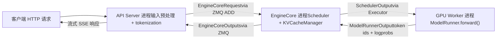
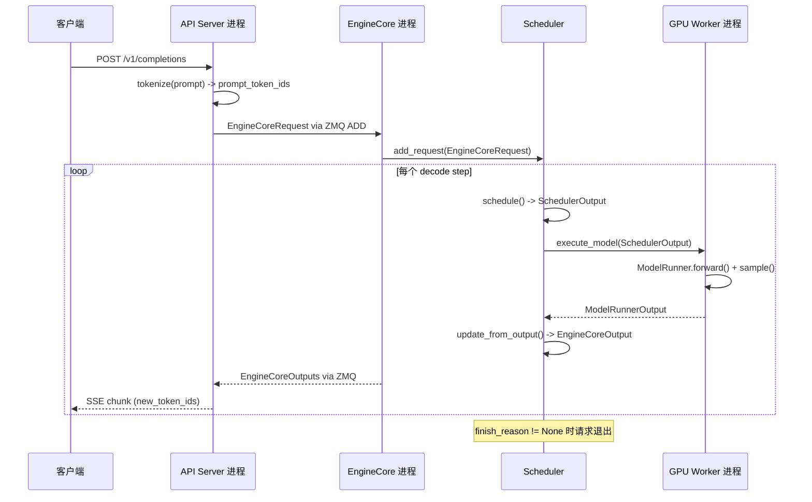

# 第 1 章：vLLM の設計哲学と全体アーキテクチャ概観

手元に A100 が 1 枚あり、LLaMA-7B でオンライン推論サービスを提供したいと仮定しよう。最も素朴な方法は：リクエストが来たら model.generate() を 1 回実行し、結果を返す。この方案は並行数が上がると即座に破綻する——GPU の演算能力が足りないからではなく、2 つの理由による：第一に、VRAM が断片化に食われる。自己回帰生成では各層の Key/Value テンソル（KV Cache）をキャッシュする必要がある。もし各リクエストが max_model_len に従って連続した VRAM ブロックを事前確保すると、4096 token のリクエストは数十 MB を占有するが、実際に生成されるシーケンスは 200 token しかないかもしれない。さらに悪いことに、異なる長さのリクエストが交互に出入りすると、連続 VRAM ブロックが細切れに分割され、最終的に総量は足りているのに十分な大きさの連続空間が見つからない——これが古典的な VRAM 断片化問題である。第二に、バッチ処理効率が低い。従来の静的バッチ処理では、1 つのバッチ内の全リクエストが同時に開始し同時に終了することを要求する。しかし生成タスクの出力長は本質的に予測不可能である：あるリクエストは 10 token で停止するかもしれず、別のリクエストは 2000 生成する必要がある。短いリクエストが終了すると、その占有していたバッチスロットは長いリクエストが完了するまで空待ちするしかなく、GPU 利用率が崖のように急落する。vLLM の 2 つの設計基盤はまさにこの 2 つの痛点に対処している：PagedAttention はページング機構で VRAM 断片化を解消し、Continuous Batching はイテレーションレベルスケジューリングでバッチ処理の空転を解消する。本章ではこの 2 つの機構の実装詳細には深入りせず（それは第 2、4 章のテーマである）、まず全体地図を構築する：vLLM v1 のプロセスアーキテクチャはどのようなものか、各層の責務はどう分担されるか、1 回のリクエストがシステムに入ってから token を吐き出すまでにどのコンポーネントを通過するか。この地図を理解すれば、以降の各章のソースコード解説に足がかりができる。

# プロセスアーキテクチャ：なぜ vLLM はシングルプロセスプログラムではないのか

## 直感的モデル

vLLM をレストランに例えよう。フロント（API Server）は客の接待と注文の記録を担当し、厨房の中核（EngineCore）はどの料理を先に作るか、どのコンロを使うかを決定し、各コンロ（GPU Worker）は 1 人のシェフが独占的に操作する。もし 1 人に接待と調理の両方をさせたら、ピーク時には必ず手忙脚乱になる——これが vLLM がこれらの役割を独立プロセスに分割する理由である。

> **[Design Inference & Architectural Trade-offs]**
> このマルチプロセス分割の核心的動機は**関心の分離**である：HTTP 解析、tokenization、マルチモーダルデータ読み込みは CPU 集約的でブロッキングの可能性がある操作であり、モデルフォワードは GPU 集約的である。もし同一プロセスに置くと、Python の GIL が両者を互いに足を引っ張り合う。独立プロセスに分割すれば、API Server は継続的に新リクエストを受信でき、EngineCore は継続的にスケジューリングでき、GPU Worker は継続的に計算でき、三者は ZMQ メッセージキューで疎結合される。

## プロセストポロジーと数量関係

vLLM v1 のプロセスアーキテクチャは 1 つの公式で要約できる。`N`枚の GPU、テンソル並列度`TP`、パイプライン並列度`PP`、データ並列度`DP`、API Server 数`A`のデプロイに対して：

| プロセス種別 | 数量 | 責務 |
| --- | --- | --- |
| API Server | `A`（デフォルトは`DP`） | HTTP リクエスト処理、入力前処理、結果ストリーミング返却 |
| EngineCore | `DP`（デフォルト 1） | スケジューリング、KV Cache 管理、GPU Worker の調整 |
| GPU Worker | `N`（= `DP × PP × TP`） | 重み読み込み、フォワード実行、VRAM 管理 |
| DP Coordinator | `DP > 1`のとき 1、それ以外は 0 | DPランク間の負荷分散とMoEウェーブ調整 |

[FACT:docs/design/arch_overview.md:113-113]がこの表の権威ある定義を示している。典型的なシングルマシン4GPU構成（`vllm serve -tp=4`）では、1つのAPI Server + 1つのEngineCore + 4つのGPU Worker = 6プロセスが生成される[FACT:docs/design/arch_overview.md:115-115]。一方、8GPU TP=2/DP=4の構成では4 + 4 + 8 + 1 = 17プロセスに膨れ上がる[FACT:docs/design/arch_overview.md:123-123]。

ここに見落とされがちな詳細がある：**API Serverの数はデフォルトでDPサイズに追随する**。`--data-parallel-size 4`の場合、自動的に4つのAPI Serverが起動し、それぞれがZMQを介して多対多トポロジで全てのEngineCoreに接続される[FACT:docs/design/arch_overview.md:73-73]。これは、どのAPI Serverも任意のEngineCoreにリクエストをルーティングできることを意味し、単一障害点を回避している。

## データフロー

以下の図は、1回のリクエストがプロセス間を流れる完全な経路を示している。各ノードに実際のクラス名とデータ構造が注記されている点に注意：



この図の要点は：**API ServerとEngineCore間は非同期メッセージパッシング**であり、関数呼び出しではない。リクエストは`EngineCoreRequest`構造体（`msgspec.Struct`、[FACT:vllm/v1/engine/__init__.py:109-113]参照）にシリアライズされ、ZMQの`ADD`メッセージタイプで送信される[FACT:vllm/v1/engine/__init__.py:287-299]。EngineCoreが処理を完了すると、結果を`EngineCoreOutputs`にパッケージして返す[FACT:vllm/v1/engine/__init__.py:256-260]。

> **[Design Inference & Architectural Trade-offs]**
> gRPCや共有メモリではなくZMQを選択した理由は、ZMQがプロセス間通信シナリオにおいて極めて低いレイテンシ（マイクロ秒レベル）を持ち、多対多トポロジとメッセージキューのセマンティクスをネイティブにサポートしているためである。初回トークンレイテンシに敏感な推論サービスのようなシナリオでは、通信オーバーヘッドは可能な限り小さくする必要がある。

## 設計上の考察：なぜEngineCoreはスレッドではなく独立プロセスなのか

自然な疑問は：EngineCoreとAPI Serverが同じマシン上にあるなら、なぜ同一プロセス内でスレッド通信にしないのか？

答えはEngineCoreの動作モードに隠されている。EngineCoreが実行しているのは**ビジーループ**（busy loop）であり、継続的にリクエストをスケジュールし、GPU Workerに作業を分配している[FACT:docs/design/arch_overview.md:73-73]。このループは中断できな��——HTTP解析やトークナイゼーションでブロックされると、推論パイプライン全体にバブルが発生する。独立プロセスはEngineCoreのCPUタイムスライスがフロントエンドロジックに横取りされないことを保証する。

さらに、独立プロセスは**障害分離**ももたらす：API Serverが不正なリクエストでクラッシュしても、EngineCoreとGPU Workerは影響を受けず、他のAPI Serverから転送されたリクエストを処理し続けられる。

# 階層的メンタルモデル：エントリポイントからGPUまでの責務境界

## 直感的モデル

プロセスアーキテクチャが「誰がどこで働くか」だとすれば、階層モデルは「各層が何を決定するか」である。vLLMのコード構成は明確な階層原則に従っている：**上位層が何をするかを決め、下位層がどうやるかを決める**。エントリ層はどのリクエストを受け付けるかを決め、エンジンコア層は誰を先に処理するかを決め、エグゼキュータ層はどの並列戦略を使うかを決め、Worker層は具体的なハードウェア上でどう結果を出すかを決める。

## 4層構造

**エントリ層（Entrypoints）**は2つのインタラクション方式を提供する：オフライン推論の`LLM`クラスとオンラインサービスの`vllm serve`コマンド[FACT:docs/design/arch_overview.md:16-16][FACT:docs/design/arch_overview.md:56-56]。この層の核心的責務は入力前処理——トークナイゼーション、マルチモーダルデータ読み込み、サンプリングパラメータ解析——および出力の逆トークナイゼーションとストリーミング返却である。スケジューリング戦略には関与せず、GPUにも触れない。

**エンジンコア層（EngineCore）**はシステム全体の頭脳である。Scheduler（各decode stepでどのリクエストを処理するかを決定）とKV Cache Manager（ページングされたVRAMを管理）を保持し、Executor抽象を介してGPU Workerと通信する[FACT:docs/design/arch_overview.md:79-85]。この層の鍵となる設計は**スケジューリングと実行の分離**である：Schedulerは「このステップでどのトークンを実行するか」の決定（`SchedulerOutput`）のみを生成し、具体的にGPU上でどう実行するかはWorkerの仕事である。

**エグゼキュータ層（Executor）**はEngineCoreとWorkerの間の橋渡しである。分散実行戦略をカプセル化する——単一プロセスでは`UniProcExecutor`、マルチプロセスでは`MultiprocExecutor`、Rayクラスタでは`RayDistributedExecutor`。Executorの抽象インターフェースにより、EngineCoreは基盤がシングルGPUか8GPU TPかを知る必要がない。

**Worker層**各GPUに1つのWorkerプロセスがあり、内部にModelRunnerと実際の`torch.nn.Module`モデルオブジェクトを保持する[FACT:docs/design/arch_overview.md:171-191]。ModelRunnerは入力テンソルの準備、CUDA Graphのキャプチャ、フォワード計算の実行を担当する。この層はGPU VRAMとCUDAストリームを直接操作する唯一の場所である。

## 設定オブジェクト：全層を貫くグローバル状態

4層間で情報は何を介して伝達されるのか？答えは`VllmConfig`——全ての設定を含む巨大なdataclass[FACT:vllm/config/vllm.py:357-357]。

```python
@config(config=ConfigDict(arbitrary_types_allowed=True))
class VllmConfig:
    """Dataclass which contains all vllm-related configuration."""
    model_config: ModelConfig = None
    cache_config: CacheConfig = Field(default_factory=CacheConfig)
    parallel_config: ParallelConfig = Field(default_factory=ParallelConfig)
    scheduler_config: SchedulerConfig = Field(default_factory=SchedulerConfig.default_factory)
    # ... 还有 20+ 个子配置
```

[FACT:vllm/config/vllm.py:363-371]が核心フィールドを示している。この設計選択の背後にある論理は詳しく展開する価値がある。

> **[Design Inference & Architectural Trade-offs]**
> ドキュメントでは、なぜ分散したパラメータ渡しではなく1つの大きな設定オブジェクトを使うのかが明確に説明されています：**拡張性**。ModelRunner にのみ影響する新機能を追加したいとします。その場合、`VllmConfig`にフィールドを1つ追加するだけで、ModelRunner が直接読み取ればよく、Engine、Worker、Model のコンストラクタシグネチャを変更する必要はありません[FACT:docs/design/arch_overview.md:203-203]。急速に進化する推論フレームワークにおいて、この「フィールドを追加してもインターフェースを変更しない」能力は開発上の摩擦を大幅に軽減します。

その代償は、`VllmConfig`が極めて巨大になることです——[FACT:vllm/config/vllm.py:356-3509]から分かるように、このクラスは3000行を超えるコードにまたがり、数十のフィールドと検証メソッドを含んでいます。`__post_init__`メソッド[FACT:vllm/config/vllm.py:1405-2317]はさらに900行以上に及び、すべての設定項目間のクロスバリデーションとデフォルト値の導出を担っています。

## 設定のハッシュとキャッシュ

`VllmConfig`には、見落とされがちですが非常に重要な機能がもう1つあります：`compute_hash()` [FACT:vllm/config/vllm.py:464-580]。これは計算グラフ構造に影響するすべての設定項目に対して短いハッシュを生成します。

```python
def compute_hash(self, include_version: bool = True) -> str:
    factors: list[Any] = []
    vllm_factors: list[Any] = []
    if include_version:
        from vllm import __version__
        vllm_factors.append(__version__)
    if self.model_config:
        vllm_factors.append(self.model_config.compute_hash())
    # ... 逐个追加各子配置的哈希
    hash_str = safe_hash(str(factors).encode(), usedforsecurity=False).hexdigest()[:10]
    return hash_str
```

[FACT:vllm/config/vllm.py:479-580]は完全なハッシュ計算フローを示しています。コメント内の警告に注意してください：「Whenever a new field is added to this config, ensure that it is included in the factors list if it affects the computation graph」[FACT:vllm/config/vllm.py:465-467]。

> **[Design Inference & Architectural Trade-offs]**
> このハッシュの用途は**torch.compile のキャッシュキー**です。vLLM は`torch.compile`を使ってモデルのフォワードグラフをコンパイルし、コンパイル結果はディスクにキャッシュされます。次回起動時に設定ハッシュが同じであれば、コンパイルキャッシュを直接再利用でき、時間のかかるコンパイル処理をスキップできます。計算グラフに影響する設定項目がハッシュに含まれていない場合、キャッシュヒットの誤りが発生します——古い設定でコンパイルされたグラフを新しい設定で実行してしまい、結果としてサイレントエラーになります。これが、コメントで「計算グラフに影響するフィールドは必ずハッシュに含める」と繰り返し強調されている理由です。

# リクエストライフサイクル Walkthrough：HTTP から Token まで

## シナリオ設定

クライアントが`vllm serve`で起動したサービスに OpenAI 互換の`/v1/completions`リクエストを送信し、prompt が "The capital of France is" で、16 トークンの生成を要求するとします。このリクエストの完全な旅をソースコードに沿って追跡します。

## Step 1：API Server の受信と前処理

API Server プロセスは HTTP リクエストを受信すると、トークナイゼーションとサンプリングパラメータの解析を行い、その後`EngineCoreRequest`：

```python
class EngineCoreRequest(
    msgspec.Struct,
    array_like=True,
    omit_defaults=True,
    gc=False,
):
    request_id: str
    prompt_token_ids: list[int] | None
    mm_features: list[MultiModalFeatureSpec] | None
    sampling_params: SamplingParams | None
    pooling_params: PoolingParams | None
    arrival_time: float
    lora_request: LoRARequest | None
    cache_salt: str | None
    data_parallel_rank: int | None
    prompt_embeds: torch.Tensor | None = None
    # ... 更多字段
```

[FACT:vllm/v1/engine/__init__.py:109-124]はリクエストのコア構造を定義しています。注目すべきは`msgspec.Struct`が`array_like=True`と`omit_defaults=True`を組み合わせた[FACT:vllm/v1/engine/__init__.py:109-113]です——これは**シリアライゼーション性能**。`array_like`のために、msgspec が辞書ではなく位置配列でエンコードし、`omit_defaults`デフォルト値フィールドをスキップするようにするものです。両者を組み合わせることで ZMQ メッセージのサイズが大幅に削減されます。

> **[Design Inference & Architectural Trade-offs]**
> `gc=False`は msgspec に対して、この構造体の GC トレースコードを生成しないよう指示します[FACT:vllm/v1/engine/__init__.py:109-113]。頻繁に生成・破棄されるメッセージオブジェクトでは、GC トレースを無効にすることで Python ガベージコレクタの負荷を軽減でき、毎秒数千リクエストを処理するシナリオでは必要な最適化です。

## Step 2：EngineCore のスケジューリング

EngineCore がリクエストを受信すると、Scheduler がそれを待機キューに入れます。各スケジューリングステップで、Scheduler はこのリクエストを現在のバッチに含めるかどうかを決定します。含める場合、KV Cache Manager が物理ブロックを割り当てます（PagedAttention の中核操作、詳細は第2章参照）。

スケジューリング結果は`SchedulerOutput`としてカプセル化され、Executor を通じて GPU Worker に送信されます。

## Step 3：GPU Worker のフォワード実行

Worker の ModelRunner は`SchedulerOutput`を受信し、入力テンソル（block table、slot mapping などの attention metadata を含む）を準備し、モデルのフォワードを実行して次のトークンをサンプリングします。

## Step 4：結果の返送

Worker が生成したトークンは`EngineCoreOutput`：

```python
class EngineCoreOutput(
    msgspec.Struct,
    array_like=True,
    omit_defaults=True,
    gc=False,
):
    request_id: str
    new_token_ids: list[int]
    new_logprobs: LogprobsLists | None = None
    finish_reason: FinishReason | None = None
    stop_reason: int | str | None = None
    # ...
```

[FACT:vllm/v1/engine/__init__.py:199-217]コピー`finish_reason`は出力構造を定義しています。`IntEnum`は`STOP`、`LENGTH`、`ABORT`、`ERROR`、`REPETITION` [FACT:vllm/v1/engine/__init__.py:68-69]であり、取り得る値には`Int`が含まれます。コメントではなぜ`Str`：「Int rather than Str for more compact serialization」[FACT:vllm/v1/engine/__init__.py:56-57]ではなく

を使うのかが説明されています——これもまたシリアライゼーションサイズの最適化です。`EngineCoreOutput`複数の`EngineCoreOutputs`が[FACT:vllm/v1/engine/__init__.py:256-260]。

## にパッケージされ、ZMQ を通じて API Server に返されます

Step 5：API Server のストリーミング返送`EngineCoreOutputs`API Server は`EngineCoreOutput`を受信すると、各

## に対して逆トークナイゼーションを行い、SSE（Server-Sent Events）を通じてクライアントにストリーミング配信します。

完全なシーケンス



コピー**この図の重要な情報：`EngineCoreOutputs`各 decode step ごとに**の返送が発生し

# 、シーケンス全体の生成が完了するまで待つのではありません。これこそが Continuous Batching の体现です——完了したシーケンスは即座に退出し、新しいリクエストは即座に参加し、出力はクライアントにストリーミング返送されます。

## 設計上の考察と本番環境での落とし穴

`VllmConfig.__post_init__`は設定システム全体の中核である。これは単純なフィールドへの値の代入ではなく、**多段階検証パイプライン**：

1. まずマルチモーダルエンコーダモードを解析する[FACT:vllm/config/vllm.py:1416-1416]

2. 次に`try_verify_and_update_config()`を呼び出し、モデル固有の設定フックが設定を変更する機会を与える[FACT:vllm/config/vllm.py:1434-1434]

3. 続いて並列設定、量子化設定、LoRA 設定間の整合性を検証する[FACT:vllm/config/vllm.py:1442-1444]

4. 最後に非同期スケジューリング、CUDA Graph、KV Transfer などのランタイム機能の互換性チェックを処理する[FACT:vllm/config/vllm.py:1544-1635]

> **[Design Inference & Architectural Trade-offs]**
> この「後置初期化」パターンは、ある根本的な矛盾を解決している：**設定項目間に依存関係が存在するが、ユーザーは任意の順序でそれらを設定する可能性がある**。例えば、`async_scheduling`を有効にするかどうかは、speculative_config のメソッドタイプ、executor バックエンドがサポートしているか、pipeline parallelism を使用しているかなど、複数の条件に依存する[FACT:vllm/config/vllm.py:1544-1575]。これらのロジックをフィールドの`__set__`に置くと、複雑な循環依存が形成される。統一的に`__post_init__`に置いて順序通りに処理すれば、ロジックが明確でデバッグも容易になる。

## 落とし穴：KV Connector と expandable_segments の衝突

[FACT:vllm/config/vllm.py:1219-1260]における`_verify_kv_transfer_compat`は、非常に隠れた本番環境の罠を明らかにしている。

KV Connector（NIXL、Mooncake など）を使って PD 分離デプロイを行う場合、これらの connector は`ibv_reg_mr`などのメカニズムを通じて**KV cache の物理メモリページを固定（pin）する**。しかし同時に`PYTORCH_CUDA_ALLOC_CONF=expandable_segments:True`を設定すると、PyTorch の CUDA VMM アロケータが実行時に同じ仮想アドレスを異なる物理ページに再マッピングする可能性がある[FACT:vllm/config/vllm.py:1227-1233]。

結果はどうなるか？Connector が登録した RDMA メモリ領域が、すでに無効になった物理ページを指すことになる。最初のクロスノード KV 転送で`IBV_WC_REM_ACCESS_ERR`または`NIXL_ERR_REMOTE_DISCONNECT` [FACT:vllm/config/vllm.py:1232-1233]。

が報告される。vLLM の対応戦略は**保守的拒否**である：`expandable_segments:True`が検出され、かつ任意の KV connector が設定されている場合、直ちに例外をスローする[FACT:vllm/config/vllm.py:1249-1260]。唯一の免除は`enable_cumem_allocator`が有効な場合である——CuMem アロケータは自身のメモリプール周辺で`expandable_segments` [FACT:vllm/config/vllm.py:1238-1241]。

> **[Design Inference & Architectural Trade-offs]**
> 〔設計上の推論とアーキテクチャのトレードオフ〕**このケースの教訓は：**RDMA メモリ登録と仮想メモリ再マッピングは意味論的に互換性がない`PYTORCH_CUDA_ALLOC_CONF`。

## 。GPU メモリの pin に関わるあらゆる機能（KV 転送、NCCL 登録バッファなど）は、基盤となる物理ページがアロケータによって密かに移動されないことを保証しなければならない。この種の問題を調査する際、RDMA 転送が最初のクロスノード通信で失敗するのを見たら、最初に確認すべきは

`__post_init__`落とし穴：非同期スケジューリングの自動降格チェーン`async_scheduling`における[FACT:vllm/config/vllm.py:1544-1635]の処理ロジック**は、綿密に設計された**。

自動降格チェーン`async_scheduling`を示している`None`ユーザーが

- を明示的に設定していない場合（値が[FACT:vllm/config/vllm.py:1578-1587]
- ）、vLLM は自動的に有効化を試みるが、一連の非互換条件を順にチェックする必要がある：[FACT:vllm/config/vllm.py:1588-1601]
- pooling モデルの場合、`disable_padded_drafter_batch=True`を無効化する[FACT:vllm/config/vllm.py:1602-1610]
- speculative メソッドがサポートリストにない場合、[FACT:vllm/config/vllm.py:1611-1617]
- を無効化する[FACT:vllm/config/vllm.py:1618-1624]
- もし[FACT:vllm/config/vllm.py:1625-1633]

なら、[FACT:vllm/config/vllm.py:1639-1640]。

> **[Design Inference & Architectural Trade-offs]**
> executor バックエンドがサポートしていない場合、**を無効化する**ROCm DeepEP 高スループット DBO の場合、

# を無効化する

PP > 1 かつ V1 Model Runner を使用している場合、

1. **を無効化する**すべてのチェックを通過した場合のみ、最終的に

2. **を有効化する**〔設計上の推論とアーキテクチャのトレードオフ〕`A + DP + N`この降格チェーンの設計哲学は：

3. **デフォルトで最適な設定を有効にし、非互換に遭遇したら静かに降格して警告を記録する**。これはユーザーに各互換性スイッチを手動で設定させるよりもはるかに親切である。しかし代償として——性能が期待に達しない場合、ユーザーはログを遡って非同期スケジューリングが自動的に無効化されたことを発見する必要がある。本番環境でスループットの異常を発見した場合、起動ログに「Async scheduling will be disabled」という警告がないか確認することを推奨する。

4. **本章のまとめ**本章では vLLM v1 のグローバルなメンタルモデルを確立した。核心的なポイント：`compute_hash()`vLLM が解決する二つの根本問題`__post_init__`：メモリ断片化（PagedAttention によるページ管理）とバッチ処理の空回り（Continuous Batching によるイテレーションレベルスケジューリング）。

5. **マルチプロセスアーキテクチャ**：HTTP → tokenize → `EngineCoreRequest` → Scheduler → Worker forward → `EngineCoreOutput`：API Server（エントリ）→ EngineCore（スケジューリング）→ GPU Worker（実行）の三層プロセスで、ZMQ を介した非同期通信。プロセス数は

# の公式に従う。

四層階層モデル`EngineCoreRequest`：エントリ層が前処理を担当し、エンジンコア層がスケジューリング決定を担当し、エグゼキュータ層が分散戦略を担当し、Worker 層が GPU 計算を担当する。`msgspec.Struct`VllmConfig は全層を貫くグローバル状態`array_like=True, omit_defaults=True`であり、`array_like=False, omit_defaults=False`を通じてコンパイルキャッシュをサポートし、[FACT:vllm/v1/engine/__init__.py:109-113]を通じて設定項目間の検証とデフォルト値の導出を実現する。[FACT:vllm/v1/engine/__init__.py:256-260]リクエストライフサイクル

**→ SSE ストリーミング返却。**：`array_like=True`本章の考察とセルフチェック`omit_defaults=True`Q1: もし`EngineCoreRequest`は全フィールド名を含む辞書構造にエンコードされ、サイズが2〜3倍に膨張する可能性がある。高並行シナリオ（毎秒数千リクエスト）では、API ServerとEngineCore間のZMQメッセージ量が著しく増加し、シリアライズ/デシリアライズのCPUオーバーヘッド増大とネットワーク帯域の浪費を引き起こす。`EngineCoreOutputs`同様にこれら2つのパラメータを使用している[FACT:vllm/v1/engine/__init__.py:256-260]、そしてそれは各decode stepごとに生成されるため、影響はより大きい。さらに`gc=False`はGCトラッキングを無効化し、高頻度で短命なオブジェクトに対してPython GCの負荷を軽減できる。

Q2:`VllmConfig.__post_init__`において、`async_scheduling`の自動有効化ロジック（[FACT:vllm/config/vllm.py:1576-1635]）は「互換性のない条件を順にチェックし、すべて通過した場合のみ有効化する」という戦略を採用している。非同期スケジューリングと互換性のない機能を新たに追加したが、開発者がこのチェックチェーンに対応する分岐の追加を忘れた場合、どのような問題が発生するか？システム動作の観点から分析せよ。

**参考解析**：チェック分岐の追加を忘れると、非同期スケジューリングが誤って有効化される。非同期スケジューリングの核心的な前提は「現在のstepのスケジューリング決定が前のstepの出力に依存しない」ことであり、これによりEngineCoreは前のstepのGPU計算がまだ完了していない段階で次のstepをスケジューリングできる。新機能がこの前提に違反する場合（例えば前のstepのlogitsを読み取る必要がある後処理ロジックなど）、非同期スケジューリングはデータ競合や結果の誤りを引き起こす。さらに隠蔽性が高いのは、この種のバグが特定の並行タイミングでのみ発生し、再現が困難なことである。これこそが[FACT:vllm/config/vllm.py:1549-1552]において明示的な有効化パスが「hard fail」戦略を採用している理由である——ユーザーが能動的に有効化した場合は静かに降格するのではなく直接エラーを出し、開発者に互換性問題と向き合わせる。

Q3: `VllmConfig.compute_hash()`のコメントは「計算グラフに影響するフィールドは必ずfactorsリストに追加すること」（[FACT:vllm/config/vllm.py:465-467]）と警告している。新フィールド`attention_sink_tokens`がattention計算ロジックに影響するがハッシュから漏れた場合、本番環境でどのような種類の障害が発生するか？なぜこの種の障害は特に危険なのか？

**参考解析**：`compute_hash()`の出力はtorch.compileコンパイルキャッシュのキーとして使用される。もし`attention_sink_tokens`が計算グラフ構造に影響するのにハッシュに含まれていない場合、ユーザーが`attention_sink_tokens=0`から`attention_sink_tokens=4`に変更してもハッシュ値は変わらず、vLLMは以前にコンパイルされたグラフ（sink tokenロジックを含まない）を再利用する。結果としてモデルは静かに誤った出力を生成する——エラーも出ず、クラッシュもせず、ただ結果が正しくないだけである。この種の障害が特に危険な理由は：(1) いかなる例外やログ警告もトリガーしない；(2) 出力は依然として「もっともらしい」テキストであり、品質低下や動作異常があるだけである；(3) 調査にはコンパイルキャッシュのヒット状況と実際の設定差異を比較する必要があり、特定コストが極めて高い。これこそがコメントで新フィールドは計算グラフに影響するか評価すべきと繰り返し強調されている理由である。

本章は素朴な推論リクエストのクラッシュ現場から出発し、vLLMが解決しなければならない2つの根本的矛盾——VRAM断片化とバッチ処理の空転——を明らかにし、PagedAttentionとContinuous Batchingという2つの鍵を示した。その後vLLM v1の全体アーキテクチャを俯瞰し、プロセスモデル、コンポーネントの階層化、リクエストの完全なライフサイクルを整理した。この全体マップを得たことで、次章ではvLLMの最も核心的なデータ構造——Request、Sequence、KV Cacheのblock管理メカニズム——に深く入り、PagedAttentionがコードレベルで「論理的に連続、物理的に離散」なVRAMマッピングをいかに実現するかを明らかにする。
