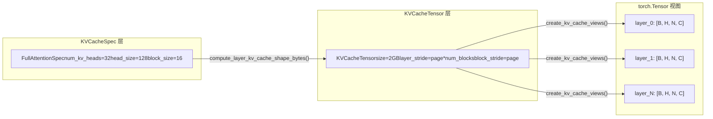

# 第 2 章：核心抽象：Request、Sequence、KV Cacheデータ構造

前章で我々はvLLM v1の階層的なメンタルモデルを構築し、リクエストがAPI Serverから出発し、EngineCoreを通過し、最終的にWorkerに到達して実行されることを理解した。しかしHTTPリクエストボディ内のJSON文字列は、どのようにしてエンジン内部でスケジューリング可能、追跡可能、中断可能なオブジェクトになるのか？これがRequestクラスが答えるべき問題である。

# KV Cacheの仕様体系：KVCacheSpecからレジストリまで

Requestは「誰が計算するか」の問題を解決し、`KVCacheSpec`は「どこで計算するか」の問題を解決する。PagedAttentionの世界では、各モデル層のKV cacheは正確に記述される必要がある：ヘッドがいくつあるか、各ヘッドのサイズはいくらか、1つのblockに何トークン格納できるか、量子化が必要か。これらの情報は`KVCacheSpec`の継承体系にエンコードされている。

## 直感モデル：KVCacheSpecはVRAMの「間取り図」

> **[Design Inference & Architectural Trade-offs]**
> GPU VRAMを開発予定の土地と想像すると、`KVCacheSpec`は各建物（各cache group）の間取り図である：各階（各block）にいくつの部屋（head slot）があるか、各部屋の広さ（head_size）、何人住めるか（block_sizeトークン）を規定する。そして`KVCacheConfig`それは小区全体の計画案である——総棟数、各棟の敷地面積、どの棟が同じ基礎（block table）を共有するか。

この仕様体系がなければ、KV cacheの割り当てはハードコードされた仮定に頼るしかなく、標準MHAからMLA、全注意力からスライディングウィンドウ、FP16からFP8量子化まで、多様なモデル要件をサポートできない。

## データ構造：KVCacheSpecの継承ツリーと主要フィールド

`KVCacheSpec`はすべての仕様の基底クラスであり、それは`@dataclass(frozen=True)` [FACT:vllm/v1/kv_cache_interface.py:150-152]である。frozenとは、仕様オブジェクトが一度作成されると不変であることを意味する——これにより複数のコンポーネント（スケジューラ、Worker、KV Cache Manager）が同一の仕様を参照し、どこかで変更されて不整合が生じることがない。

基底クラスはサブクラスが実装しなければならない3つの抽象プロパティを定義する：`num_heads`、`tokens_per_state`、`state_content_size_bytes` [FACT:vllm/v1/kv_cache_interface.py:182-183]。これら3つのプロパティが共同で`page_size_bytes`——すなわち1つのblockが占めるバイト数を決定する。

`AttentionSpec`は最も核心的なサブクラスであり、`num_kv_heads`、`head_size`、`dtype`、`kv_quant_mode`などのフィールドを導入する[FACT:vllm/v1/kv_cache_interface.py:485-498]。そのうち`tokens_per_state`フィールドの設計は特に巧妙である：デフォルト値は1で、1つのstateが1つのtokenに対応することを示す。しかし1より大きい整数（DeepSeek-V4のスパースMLAのように複数のtokenを1つのstateに圧縮する場合）や、1より小さい分数（Whisperのblock poolingのように`Fraction(1, block_pool_size)`で1つのtokenが複数のstateに対応することを示す場合）に設定できる。[FACT:vllm/v1/kv_cache_interface.py:501-501]。

`FullAttentionSpec`は`AttentionSpec`を基に`sliding_window`と`attention_chunk_size` [FACT:vllm/v1/kv_cache_interface.py:566-566]を追加する。そのdocstringが重要な設計判断を説明していることに注意：混合アロケータが無効な場合、スライディングウィンドウ注意力層はKV Cache Manager内で全注意力として扱われ（すべてのtokenにblockを割り当てる）、モデル実行時にはスライディングウィンドウに従って計算される[FACT:vllm/v1/kv_cache_interface.py:540-545]。これは**保守的に割り当て、正確に計算する**戦略である。

`MLAAttentionSpec`はDeepSeekシリーズモデルの鍵となる仕様である。それは`head_size_v`をデフォルトで0に設定する[FACT:vllm/v1/kv_cache_interface.py:670]。MLAは1つのlatent vectorのみを保存し、独立したVを持たないためである。`alignment`フィールドはページアライメントパディングに用いられ[FACT:vllm/v1/kv_cache_interface.py:646-652]、これはFlashMLAなど特定のアライメントを必要とするバックエンドにとって極めて重要である。

`MambaSpec`は完全にattentionの路線を取らない。それは`shapes`と`dtypes`のタプルで状態テンソルの形状を記述する[FACT:vllm/v1/kv_cache_interface.py:1027-1028]，`state_content_size_bytes`はすべての状態テンソルサイズの総和である[FACT:vllm/v1/kv_cache_interface.py:1048-1052]。Mambaの`max_memory_usage_bytes`は`mamba_cache_mode`に応じて3つの異なる計算方法を持つ[FACT:vllm/v1/kv_cache_interface.py:1073-1084]。これはMambaの状態管理の複雑さを反映している——attentionのように線形に増加するのではなく、固定の状態サイズを持つ。

## シナリオ駆動：仕様からVRAMレイアウトへの変換

エンジン起動時、すべての層の`KVCacheSpec`を実際のVRAMレイアウトに変換する必要がある。このプロセスは`KVCacheTensor`と`create_kv_cache_views`によって行われる。

`KVCacheTensor`は同形状の層のグループがKV cache割り当てにおいて占める位置を記述する[FACT:vllm/v1/kv_cache_interface.py:1406-1427]。その核心フィールドは`layer_stride`と`block_stride`である：前者は隣接層間のバイト距離、後者は隣接block間のバイト距離である。docstringは2つのレイアウトモードを詳細に説明している：層最外レイアウト（layer-outermost）は各層に連続領域を与え、ブロック最外レイアウト（block-outermost）は各blockがすべての層のpageを含むようにする[FACT:vllm/v1/kv_cache_interface.py:1416-1416]。

`create_kv_cache_views`関数はこのプロセスの核心である[FACT:vllm/v1/kv_cache_interface.py:353-417]。それはフラットなint8バッファを受け取り、`torch.as_strided`を通じて各層に4Dビューを作成する`[B, H, N, C]`。重要なパラメータは`strides`であり、それは`compute_layout_strides`によって計算される[FACT:vllm/v1/kv_cache_interface.py:314-350]。この関数は`layout.stride_order`で指定された次元順序に従い、最内次元から逆方向に各次元のバイトストライドを計算する。

ここで注目すべき境界チェックがある：kernel_block_sizeがspec.block_sizeより小さい場合（つまり1つのmanager blockが複数のkernel blockに分割される場合）、コードはblock_strideがdense_page_sizeに等しいか検証する[FACT:vllm/v1/kv_cache_interface.py:381-382]。等しくない場合、レイアウトにpaddingが存在し均等に分割できないことを示し、明確な修正提案を含むValueErrorをスローする。

## 設計考察：レジストリパターンと拡張性

`KVCacheSpecRegistry`はvLLMの拡張性における鍵となる設計である[FACT:vllm/v1/kv_cache_spec_registry.py:39-40]。それは2つのグローバル辞書を維持する：`_REGISTRY_KVCACHESPEC_LIST`はspecクラスからメタデータへのマッピングを格納し、`_REGISTRY_ROLE_MANAGERS`はロールからマネージャへのマッピングを格納する[FACT:vllm/v1/kv_cache_spec_registry.py:35-36]。

`get_manager_class`メソッドはレジストリの核心的な検索ロジックを示す：specクラスのMRO（メソッド解決順序）を辿って最初に登録された基底クラスを見つける[FACT:vllm/v1/kv_cache_spec_registry.py:129-130]。これは、カスタムの`CustomFullAttentionSpec`が個別に登録されていない場合、自動的に`FullAttentionSpec`のマネージャを継承することを意味する。この**継承ベースの検索**により、新しいspecタイプを追加する際に差分部分のみを登録すればよい。

`check_kv_cache_spec_registry`メソッドは起動時にすべての層のspecが登録済みであることを検証する[FACT:vllm/v1/kv_cache_spec_registry.py:165-174]。それが`raise ValueError`ではなく`assert`を使用していることに注意。コメントはこれが本番環境でも有効にするためであると明記している[FACT:vllm/v1/kv_cache_spec_registry.py:165-174]。これは重要なエンジニアリング判断である：Pythonの`-O`フラグはassertを除去するが、本番環境の設定エラーは起動時に露呈しなければならず、実行時に初めてクラッシュしてはならない。

> **[Design Inference & Architectural Trade-offs]**
> レジストリの遅延初期化設計（`_ensure_registered`）は循環依存問題を解決する：`kv_cache_interface.py`はspecタイプをチェックするためにレジストリを参照する必要があり、レジストリはインポートする必要がある`single_type_kv_cache_manager`マネージャークラスを取得し、それはさらに依存する`kv_cache_interface`。実際の登録を最初のクエリ時まで遅延させることで、この循環を断ち切っている。

# 本章のまとめ

本章では vLLM v1 の二つの中核データ構造を分析した。`Request`はエンジン内部におけるリクエストのライフサイクルキャリアであり、二重トークンリスト、非同期スケジューリングカウンタ、block hash メカニズムを通じて、連続バッチ処理とプレフィックスキャッシュという二大中核機能を支えている。`KVCacheSpec`およびその継承体系は KV cache の VRAM レイアウト仕様を定義し、標準的な`FullAttentionSpec`から`MLAAttentionSpec`、`MambaSpec`まで、多様なモデルアーキテクチャの要件をカバーしている。レジストリパターンにより、新しい spec タイプの追加時にコアコードを変更する必要がなくなり、システムの拡張性が保証されている。

ここまでで、Request が EngineCoreRequest からどのように変換されるか、そして状態カウンタや block hash などのメカニズムを通じてどのようにスケジューリング決定を支えるかを明らかにした。しかし、外部リクエストは一体どのように API Server、chat template、マルチモーダル処理を経て、最終的に EngineCoreRequest になるのか？次章ではリクエストエントリ層に入り、この HTTP/CLI から EngineCore への経路を完全に追跡する。
