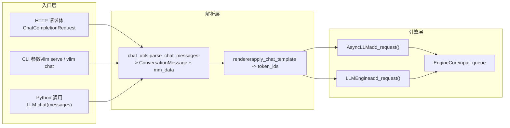

# 第 3 章：リクエストエントリ：HTTP/CLI から EngineCore への完全な経路

前章では Request と KVCacheSpec というエンジン内部の二つの中核データ構造を分析し、論理シーケンスと物理 VRAM ブロックがどのように分離されているかを理解した。しかし、HTTP リクエストボディや Python 文字列は、一体どのように API Server、chat template、マルチモーダル処理を経て、最終的に EngineCoreRequest になるのか？本章ではこの経路を完全に追跡し、同期 CLI、非同期 API、オフライン LLM クラスという三つのエントリパスがどのように同一のエンジンコアに収束するかを明らかにする。

# 3.1 三つのエントリパスの収束点：AsyncLLMEngine と LLMEngine

リクエスト解析を深掘りする前に、まず三つのエントリパスのトポロジー構造を明確にする必要がある。vLLM は三つの使用方法を提供している：`vllm serve`で起動する OpenAI 互換 HTTP サービス、コマンドライン`vllm`ツール、そして Python で直接インスタンス化する`LLM`クラスによるオフライン推論。これらは一見独立しているが、実際には同一のエンジンコアを共有している。

まず非同期 API パスのエイリアスメカニズムを見る。

[FACT:vllm/engine/async_llm_engine.py:7-7]

このファイルはモジュールとは思えないほど短い——それはただ一つのことだけを行っている：`AsyncLLMEngine`エイリアスを`vllm.v1.engine.async_llm.AsyncLLM`に指し示すことだ。これは典型的なアーキテクチャ移行の痕跡である。vLLM v0 時代の`AsyncLLMEngine`は巨大で複雑なクラスであり、v1 アーキテクチャの書き直し後、新しい`AsyncLLM`が同じ責務を担っている。既存のユーザーコードを壊さないために、vLLM は旧モジュールパスを互換層として保持している。

> **[Design Inference & Architectural Trade-offs]**
> この「旧パスのエイリアスが新実装を指す」パターンは vLLM で繰り返し現れており（例えば`api_server.py`の deprecation warning など）、プロジェクトが v0 から v1 への移行において漸進的戦略を取ったことを示している：新コードは新パスを使用し、旧コードはエラーにならないが警告を受け取り、ユーザーに十分な移行期間を与える。

次にオフラインパスのエントリを見る。

[FACT:vllm/entrypoints/llm.py:344-346]

`LLM.__init__`は最終的に`LLMEngine.from_engine_args`を呼び出し、`UsageContext.LLM_CLASS`を渡す。この`UsageContext`列挙型はエントリパスを区別する鍵である——エンジンがオフラインバッチ処理モードで動作しているかオンラインサービスモードで動作しているかを知らせ、それに応じてログ、メトリクス、リソース管理戦略を調整する。

[FACT:vllm/entrypoints/llm.py:357-359]

ここで`self.renderer = self.llm_engine.renderer`と`self.input_processor = self.llm_engine.input_processor`の代入に注意。オフライン`LLM`クラスは chat template レンダリングを自ら実装せず、エンジン内部の`renderer`を再利用している。これは chat template の解析ロジックがオフラインとオンラインパスで同一のコードであり、呼び出しタイミングが異なるだけであることを意味する。

三つのパスの収束関係は以下のデータフロー図で表せる。

この図は重要な設計を明らかにしている：リクエストが HTTP、CLI、Python のいずれから来ても、`chat_utils`はマルチモーダルと chat template 処理の唯一のエントリである。異種の入力フォーマットを`ConversationMessage`リストと`MultiModalDataDict`に統一し、それを renderer に渡してトークンシーケンスを生成する。

# 3.2 chat_utils：異種メッセージから統一対話構造へ

`chat_utils.py`はリクエストエントリ層全体で最も複雑なモジュールであり、2264 行のコードで OpenAI 互換フォーマット、カスタム拡張、マルチモーダル埋め込み、ツール呼び出しなどすべての入力形態を処理している。その中核的責務は一文で要約できる：ユーザーから渡された任意のメッセージリストを、chat template が理解できる`ConversationMessage`リストに正規化し、同時にマルチモーダルデータを独立した`MultiModalDataDict`に抽出することである。

## 直感モデル：翻訳者と手荷物仕分け係

を`chat_utils`空港の翻訳者兼手荷物仕分け係と想像してほしい。旅客（ユーザー）は異なる国（OpenAI フォーマット、カスタムフォーマット、Harmony フォーマット）から来て、異なる言語を話している。翻訳者はまず全員の話を統一された作業言語（`ConversationMessage`）、同時に旅客が預けた手荷物（画像、音声、動画）を独立したベルトコンベアに仕分けし（`MultiModalDataDict`）、タグ（UUID）を貼り、最後に人と荷物をそれぞれ同じ飛行機（エンジン）に搭載する。

この層がなければ、エンジンはあらゆる入力形式の詳細を理解しなければならず、マルチモーダルデータの抽出ロジックが各エントリポイントに散在し、新しい形式を追加するたびにエンジンコアを変更する必要が生じる。

## データ構造：トラッカーとパーサーの二クラス協調

`chat_utils`の核心は二組のクラスの協調である：`BaseMultiModalItemTracker`およびそのサブクラスがマルチモーダル項目を「追跡」し、`BaseMultiModalContentParser`およびそのサブクラスがコンテンツ部分を「解析」する。

まずトラッカーのフィールドレイアウトを見る。

[FACT:vllm/entrypoints/chat_utils.py:598-601]

`_items_by_modality`は`defaultdict[str, list[_T]]`であり、モダリティ（image、audio、video など）ごとに処理待ちの項目をグループ化して格納する。`_modality_order`は専ら`vision_chunk`モダリティのために各 chunk の元のモダリティ（image か video か）を記録する。統一視覚 chunk モデルは両方を`vision_chunk`にマッピングするが、後続の処理では元の型を知る必要があるからである。

[FACT:vllm/entrypoints/chat_utils.py:613-615]

`use_unified_vision_chunk_modality`は`cached_property`であり、HuggingFace 設定から`use_unified_vision_chunk`フラグを読み取る。`cached_property`ではなく通常の属性を使用するのは、このチェックが毎回の`add`呼び出しで発火するため、キャッシュにより繰り返しの`getattr`オーバーヘッドを避けられるからである。

トラッカーの`add`メソッドが核心のエントリポイントである。

[FACT:vllm/entrypoints/chat_utils.py:656-684]

`add`メソッドはまず`_validate_add`を呼び出して検証を行い、次に統一視覚 chunk モダリティを使用するかどうかに応じて、項目を異なるキーの下に格納する。`prompt_embeds`の特別な処理に注意：これは直接`_items_by_modality["prompt_embeds"]`に追加し、`None`を返す。事前計算された埋め込みは HF processor を経由せず、プレースホルダー文字列を持たないからである。

`_validate_add`内の検証ロジックは詳しく見る価値がある。

[FACT:vllm/entrypoints/chat_utils.py:686-721]

ここには微妙な分岐がある：`enable_mm_embeds=True`かつそのモダリティのプロンプトごとの制限が 0 で、元のモダリティが`_embeds`で終わる場合、数量検証をスキップする。これは埋め込み入力が元のモダリティの数量制限を迂回できるようにするためである——埋め込みは事前計算済みで、元のモダリティの処理リソースを消費しない。

## シナリオ駆動：画像付きの chat リクエストがどのように解析されるか

ユーザーが画像 URL とテキストを含む chat リクエストを送信すると仮定する。`parse_chat_messages`は同期パスのエントリポイントである。

[FACT:vllm/entrypoints/chat_utils.py:2161-2197]

`parse_chat_messages`は`MultiModalItemTracker`を作成し、各メッセージを走査して`_parse_chat_message_content`を呼び出し、最後に`_postprocess_messages`を呼び出してツール呼び出しパラメータを処理し、さらに`mm_tracker.resolve_items()`を通じてマルチモーダルデータを実体化する。

`_parse_chat_message_content`は単一メッセージの解析を担当する。

[FACT:vllm/entrypoints/chat_utils.py:2007-2029]

まず content を正規化する：`None`は空リストになり、文字列は単一のテキスト part になる。次に`_parse_chat_message_content_parts`を呼び出す。ここで`wrap_dicts`パラメータは`content_format == "openai"`によって決定される——これが出力を構造化辞書リストにするか、連結後の文字列にするかを決める。

`_parse_chat_message_content_parts`は各 part を走査する。

[FACT:vllm/entrypoints/chat_utils.py:1814-1853]

各 part は`_parse_chat_message_content_part`によって処理される。もし`wrap_dicts=False`なら、最終的にテキストとプレースホルダーを単一の文字列に連結する。もし`wrap_dicts=True`なら、構造化辞書リストを返す。

`_parse_chat_message_content_part`はディスパッチの核心である。

[FACT:vllm/entrypoints/chat_utils.py:1875-1884]

純粋なテキスト part に対しては、まずプレースホルダー保持チェックを行い、次に`wrap_dicts`に基づいて返却形式を決定する。構造化 part に対しては、`_parse_chat_message_content_mm_part`を呼び出して型と内容を抽出する。

[FACT:vllm/entrypoints/chat_utils.py:1690-1723]

`_parse_chat_message_content_mm_part`は`MM_PARSER_MAP`を通じて対応する解析関数を検索する。`uuid is None`の条件に注意——ユーザーが UUID を提供した場合、メディアデータがリクエストボディにない可能性がある（別の方法でアップロード済み）ことを示し、この場合は以下の直接 URL フィールド分岐に進む。

[FACT:vllm/entrypoints/chat_utils.py:1731-1733]

が`part_type is None`または`uuid is not None`の場合、コードは part から直接 URL フィールドを抽出しようとする。この「寛容な解析」は、OpenAI 形式に厳密に従わないクライアントとの互換性のためである。

に戻ると、`_parse_chat_message_content_part`メディアタイプの part は対応する`mm_parser`メソッドにディスパッチされる。

[FACT:vllm/entrypoints/chat_utils.py:1923-1968]

各メディアタイプは対応する`parse_*`メソッドを呼び出し、これらのメソッド内部で`tracker.add`を呼び出して項目をトラッカーに追加し、プレースホルダー文字列を返す。最後に`interleave_strings`に基づいてプレースホルダーを返すか`None`。

[FACT:vllm/entrypoints/chat_utils.py:1984-1999]

`prompt_embeds`の処理は特殊である：`interleave_strings`がどうであれ、`PROMPT_EMBEDS_PLACEHOLDER_TOKEN`を返す。コメントが理由を説明している——prompt_embeds は token オフセット位置で連結され、位置が重要であり、もし`missing_placeholders`の前置パディングロジックを通ると順序が乱れるからである。

## 非同期パスの差異

非同期パスは`AsyncMultiModalItemTracker`と`AsyncMultiModalContentParser`を使用する。核心的な差異は`resolve_items`。

[FACT:vllm/entrypoints/chat_utils.py:906-952]

にあり、非同期版は`asyncio.gather`で全てのモダリティ項目を並行して待機する。コメントが明確に指摘している：各追跡項目は既に独立した awaitable であり、非同期コネクタはブロッキングなデコード作業をスレッドプールにオフロードするため、あるモダリティを直列に待ってから次を待つと無駄にレイテンシが増加する。`return_exceptions=True`は全てのタスクが完了または失敗してから統一的にスローし、最初の失敗でまだ進行中のネットワークリクエストを放棄することを避ける。

## 設計思考：なぜトラッカーとパーサーを分離するのか

> **[Design Inference & Architectural Trade-offs]**
> トラッカーとパーサーの分離は興味深い設計である。トラッカーは「状態管理」を担当する——各モダリティに何項目あるかを記録し、数量制限を検証し、vision_chunk の元のモダリティ順序を維持する。パーサーは「コンテンツ抽出」を担当する——URL から画像を取得し、base64 から埋め込みをデコードし、音声形式変換を処理する。この分離により、同期と非同期のパスが追跡ロジックを共有でき（`BaseMultiModalItemTracker`は抽象基底クラス）、パーサーレベルでのみ分岐する。もし一つのクラスに統合すると、同期と非同期の差異が追跡ロジックに浸透し、コードの重複と状態管理の複雑化を招く。

# 3.3 メッセージから token へ：renderer と EngineCore の引き継ぎ

`chat_utils`が生成する`ConversationMessage`リストと`MultiModalDataDict`は、chat template でレンダリングされて初めて token シーケンスになる。このステップは renderer が行い、その後リクエストが実際にエンジンに入る。

## シナリオ駆動：chat template レンダリングとリクエスト投入

`parse_chat_messages`戻った後、呼び出し元（例えば`OpenAIServingChat`）は`conversation`と`mm_data`を renderer に渡します。renderer は chat template を適用し、`ConversationMessage`リストをテキストにレンダリングしてから、token ID シーケンスに tokenize します。マルチモーダルプレースホルダー（例えば`<##IMAGE##>`）は tokenize 後にモデル固有のプレースホルダー token に置換されます。

レンダリング完了後、リクエストは`EngineCoreRequest`としてカプセル化され、`AsyncLLM.add_request()`または`LLMEngine.add_request()`を通じて EngineCore の入力キューに投入されます。

[FACT:vllm/entrypoints/llm.py:420-484]

オフラインの`LLM.generate`メソッドはこのチェーンを示しています。まず`runner_type`を検証し、デフォルトのサンプリングパラメータを取得してから`_run_completion`。`_run_completion`を呼び出します。内部的には renderer を呼び出して prompt をレンダリングし、`llm_engine`を通じてリクエストを投入します。

[FACT:vllm/entrypoints/llm.py:615-708]

`LLM.chat`メソッドは chat パスを示しています。`messages`リストを受け取り、`_run_chat`を呼び出し、その後内部で`parse_chat_messages`と renderer を呼び出します。

## 設計上の考察：なぜ renderer はエンジン内部にあるのか

> **[Design Inference & Architectural Trade-offs]**
> `LLM.__init__`における`self.renderer = self.llm_engine.renderer`という行は重要な設計判断を明らかにしています。renderer はエントリ層ではなくエンジンに属するということです。これは、chat template の読み込み、キャッシュ、ウォームアップ（`self.renderer.warmup(ChatParams(...))`）がすべてエンジン初期化時に行われ、エントリ層は単なる呼び出し元であることを意味します。この利点は、オフラインの`LLM`とオンラインの`AsyncLLM`が同一の renderer 実装とキャッシュを共有し、tokenizer と chat template の重複読み込みを避けられることです。同時に、renderer のウォームアップをエンジン起動時に完了できるため、最初のリクエストのコールドスタート遅延を回避できます。

## エラー回復と本番環境の落とし穴

`_postprocess_messages`におけるツール呼び出しパラメータの処理は、典型的な本番環境の罠です。

[FACT:vllm/entrypoints/chat_utils.py:2118-2158]

assistant メッセージが`tool_calls`を含む場合、`arguments`フィールドは JSON 文字列、辞書、または無効な JSON である可能性があります。コードは JSON 文字列のパースを試み、失敗した場合は警告を記録して強制的に空オブジェクトに変換します。コメントには理由が説明されています：不正な形式の`arguments`が会話履歴に存在する場合、ここでリクエストを失敗させると、以降の毎ターンが失敗し、会話が回復不能になります。これは熟慮されたフォールトトレラント設計です——モデルに空のツールパラメータを見せる方が、会話全体がスタックするよりもましです。

もう一つの罠は、予約プレースホルダーの注入防御です。

[FACT:vllm/entrypoints/chat_utils.py:1856-1872]

が有効な場合、`enable_prompt_embeds`が分割不可能な特殊 token として登録されます。ユーザーテキストにこのリテラルシーケンスが偶然含まれていると、tokenizer はそれを同じ token ID にエンコードし、renderer はそれを連結点と誤認して、呼び出し元がプレーンテキストコンテンツを通じて連結位置を移動または注入できるようになります。`PROMPT_EMBEDS_PLACEHOLDER_TOKEN`はテキスト part の解析時にこのような入力を拒否し、このセキュリティホールを塞いでいます。`_reject_reserved_placeholder_in_text`このチェックは

[FACT:vllm/entrypoints/chat_utils.py:1889-1892]

ブランチと構造化テキストブランチの両方で呼び出されており、すべてのテキストパスが防御を経由することを保証しています。`isinstance(part, str)`本章のまとめ

# 本章では、リクエストが外部からシステムに入る最初のチェーンを追跡しました。三つのエントリパス——HTTP API、CLI、オフラインの

クラス——は最終的に`LLM`のマルチモーダル解析層に収束します。`chat_utils`が状態管理を担当し、`BaseMultiModalItemTracker`がコンテンツ抽出を担当し、両者を分離することで同期・非同期パスが追跡ロジックを共有できます。`BaseMultiModalContentParser`は異種メッセージを`parse_chat_messages`リストと`ConversationMessage`に正規化し、エンジン内部の renderer に渡して chat template レンダリングと tokenize を完了します。最終的に、リクエストは`MultiModalDataDict`としてカプセル化され、EngineCore の入力キューに投入されます。`EngineCoreRequest`本章の考察とセルフチェック

# Q1:

において、`_parse_chat_message_content_mm_part`という条件を削除した場合（つまり`uuid is None`に変更した場合）、どのようなシナリオで問題が発生するか？`if isinstance(part_type, str) and part_type in MM_PARSER_MAP:`参考解析

**この条件の存在は「ユーザーが UUID を提供したが、メディアデータがリクエストボディにない」シナリオを処理するためです。ユーザーが UUID を提供する場合、メディアデータは他の方法（例えばメディアキャッシュへの事前アップロード）で既にアップロードされている可能性があり、リクエストボディの part には実際の URL やデータではなく UUID のみが含まれることがあります。この条件を削除すると、コードは**：`uuid is None`を通じて解析を試みますが、part に対応するデータフィールドがない可能性があり（例えば`MM_PARSER_MAP[part_type](part)`が空）、`image_url`コンテンツが解析されます。さらに深刻なのは、後続の`None`が`parse_image(None, uuid)`を呼び出し、不要なネットワークリクエストや例外を引き起こす可能性があることです。`_connector.fetch_image(None)`ブランチは直接フィールド抽出パスを通り、「UUID ありデータなし」のケースを正しく処理します。`uuid is not None`および[FACT:vllm/entrypoints/chat_utils.py:1713-1723]を参照。[FACT:vllm/entrypoints/chat_utils.py:1731-1733]。

Q2: `AsyncMultiModalItemTracker.resolve_items`デフォルトの`asyncio.gather(..., return_exceptions=True)`ではなく`return_exceptions=False`を使用しています。`False`に変更した場合、どのような並行シナリオでリソースリークが発生するか？

**参考解析**：`return_exceptions=False`の場合、`asyncio.gather`は最初の例外がスローされた時点で即座に戻りますが、他の進行中のタスクはキャンセルされません——それらはバックグラウンドで実行し続けます。これらのタスクはネットワーク接続、スレッドプールのワークアイテム、またはファイルハンドルを保持している可能性があります。これらのタスクが最終的に失敗した場合、例外はサイレントに破棄され（gather が既に戻っているため）、リソースリークと特定困難なエラーを引き起こします。`return_exceptions=True`すべてのタスクが完了または失敗するまで統一してから検査し、どのタスクも放棄されないことを保証する。コメントはこの点を明確に説明している：「Gathering with return_exceptions=True lets every task finish (or itself fail) before we raise, instead of abandoning still-in-flight fetches (real network/thread-pool work) the moment the first one fails.」参照[FACT:vllm/entrypoints/chat_utils.py:924-931]。

Q3: `_postprocess_messages`において、`arguments`が無効な JSON である場合、コードは例外を投げるのではなく強制的に空オブジェクトに変換することを選択する。もし例外を投げるように変更した場合、どのような本番シナリオで回復不能な対話状態が発生するか？

**参考解析**：`arguments`フィールドが対話履歴に存在する（assistant メッセージの`tool_calls`）。もしあるターンの対話でモデルが不正な形式の`arguments`を生成した場合、このエラーは対話履歴に保存される。もし`_postprocess_messages`が履歴を解析する際に例外を投げると、以降の毎ターンのリクエストが履歴内のこのエラーによって失敗する——たとえ現在のターンの入力が完全に正しくても。ユーザーはこの対話を続けることができず、会話全体を諦めて最初からやり直すしかない。強制的に空オブジェクトに変換することで対話を継続でき、モデルは空のツール引数を見て正しい呼び出しを再生成する。コメントはこの点を説明している：「A malformed arguments string lives in conversation history, so failing the request here would fail every subsequent turn too and leave the conversation unrecoverable.」参照[FACT:vllm/entrypoints/chat_utils.py:2124-2139]。

次の章ではスケジューラに入り、EngineCore が連続バッチ処理と VRAM 認識戦略でこれらのリクエストをどのように編成するかを見る。

ここまでで、リクエストは外部入力から EngineCoreRequest への正規化変換を完了し、エンジンコアの入口に到達した。しかしリクエストは入った後すぐに実行されるわけではない——エンジンは各ステップでどのリクエストを処理するか、限られた VRAM リソースをどのように配分するかを決定する必要がある。次の章では EngineCore のスケジューリングループを深く掘り下げ、Scheduler が連続バッチ処理においてスループットとレイテンシをどのようにトレードオフするか、また chunked prefill、prefix caching、KV block 割り当てがどのように協調して動作するかを分析する。
