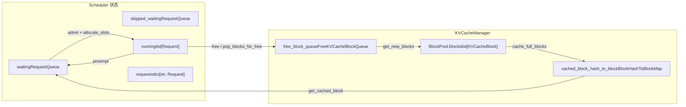
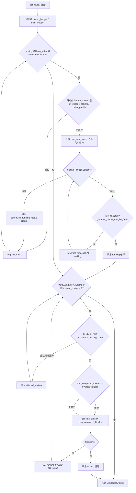

# 第 4 章：スケジューラ：連続バッチ処理と VRAM 認識のリクエスト編成

リクエストが EngineCore の入力キューに入った後、すぐに実行されるわけではない。各ステップでどのリクエストを処理するか、各リクエストにどれだけの token 予算を割り当てるか、VRAM 不足時に誰を優先的に犠牲にするか、これらの決定はすべて`Scheduler.schedule()`メソッドに集中している。本章ではスケジューラのデータ構造から始め、1 回の`schedule()`呼び出しが waiting キュー、running リスト、KV cache プールをどのように実行可能なバッチに組織するかを追跡する。

# 4.1 スケジューラのデータ構造：3 つのキューと 1 つの VRAM プール

スケジューラが答えるべき核心的な問いは：**限られた token 予算と KV block 予算の下で、このステップでどのリクエストをどれだけ前進させるべきか？**これを理解するには、まずそれが手にしている状態を明確にする必要がある。

スケジューラは 3 種類のリクエストコンテナを維持する。`self.requests`はグローバル辞書であり、`req_id -> Request`、すべてのアクティブなリクエストの唯一の真実の源である[FACT:vllm/v1/core/sched/scheduler.py:208-209]。`self.waiting`と`self.skipped_waiting`は 2 つの優先度キューであり、前者は正常にスケジューリングを待つリクエストを入れ、後者は非同期依存や制約により一時的にスケジューリングできないリクエスト（リモート KV の待機、構造化出力文法のコンパイル待ちなど）を入れる[FACT:vllm/v1/core/sched/scheduler.py:208-209]。`self.running`は通常のリストであり、すでに実行状態に入り KV block を保持しているリクエストを格納する[FACT:vllm/v1/core/sched/scheduler.py:208-209]。

ここに見落とされがちな設計がある：`max_num_running_reqs`と`max_num_active_reqs`は 2 つの異なる上限である。前者は`max_num_seqs`に由来し、model runner のスロット数を決定する；後者は`max_num_active_seqs`に由来し、RUNNING に入れるリクエスト数のみを制限し、デフォルトでは前者と等しい[FACT:vllm/v1/core/sched/scheduler.py:123-131]。この分離により、CUDA graph キャプチャ容量を縮小することなく、実際の並行デコードバッチサイズを抑えることが可能になる。

VRAM 側は`KVCacheManager`によって統一的に管理され、その内部は`BlockPool`。`BlockPool`を保持する。`self.blocks`の核心は`KVCacheBlock`（すべての`free_block_queue`のリスト）と[FACT:vllm/v1/core/block_pool.py:171-177]（退避順に並んだ空きブロックの双方向リンクリスト）である`null_block`。注意すべきは`is_null=True`の存在である：それは空きキューの先頭からポップされた最初のブロックであり、[FACT:vllm/v1/core/block_pool.py:183-187]、参照カウントは通常のメンテナンスに関与せず、専らプレースホルダーとして使用される

。リクエストのある token 位置が実際の KV block を必要としない場合（例えばスライディングウィンドウでスキップされた位置）、block table にはこの null block が埋められる。`BlockHashToBlockMap`プレフィックスキャッシュのインデックス構造は`BlockHashWithGroupId`であり、それは`KVCacheBlock`を`{block_id: KVCacheBlock}`または[FACT:vllm/v1/core/block_pool.py:56-59]。なぜ共用体型を使うのか？コメントが答えを与えている：ほとんどのハッシュは1つのブロックにしか対応せず、辞書を使うと不必要なGCオーバーヘッドが発生する。同じハッシュが複数のブロックで共有される場合にのみ辞書に昇格させる[FACT:vllm/v1/core/block_pool.py:56-59]。これは型の複雑さと引き換えに実行時オーバーヘッドを削減する典型的なトレードオフである。

`KVCacheBlocks`はスケジューラとKV cacheマネージャの間のインターフェースオブジェクトであり、内部データ構造を隠蔽する。その`blocks`フィールドは`tuple[Sequence[KVCacheBlock], ...]`であり、外側の次元はKV cache group、内側はブロックシーケンスである[FACT:vllm/v1/core/kv_cache_manager.py:41-54]。コメントはなぜブロックを外側の次元にしないかを明確に説明している：それはすべてのgroupのブロック数が同じであると仮定することになり、将来的に異なるgroupに異なるblock sizeを設定する可能性があるからだ[FACT:vllm/v1/core/kv_cache_manager.py:43-48]。



この図はスケジューラとVRAMプール間のデータフローを固定する：waitingキューのリクエストは`allocate_slots`を通じてrunningに入り、runningのリクエストがプリエンプトされるとwaitingに戻り、解放されたブロックは空きキューに戻り、プレフィックスキャッシュハッシュテーブルはwaitingリクエストがキャッシュにヒットするための入口である。

# 4.2 schedule() メイン処理：running優先、waiting補充、プリエンプトによるフォールバック

`schedule()`はスケジューラ全体の中核メソッドであり、`SchedulerOutput`を返し、このステップで何を実行するかを記述する。メソッド冒頭のコメントは設計哲学を明示している：スケジューラには「デコード段階」と「プリフィル段階」の区別はなく、各リクエストには`num_computed_tokens`と`num_tokens_with_spec`だけがあり、スケジューラの役割は前者を後者に追いつかせることである[FACT:vllm/v1/core/sched/scheduler.py:559-568]。この統一的な視点がchunked prefill、prefix caching、投機的デコーディングの共存を可能にする基盤である。

## 4.2.1 予算の初期化と閾値の計算

メインループに入る前に、スケジューラはまず2つの予算を設定する：`token_budget`は`max_num_scheduled_tokens`，`input_budget`に初期化され、 は`max_num_batched_tokens` [FACT:vllm/v1/core/sched/scheduler.py:577-580]に初期化される。両者は通常等しいが、モデルがバッチ内でトークンを追加する可能性がある場合（投機的デコーディングなど）、`max_num_scheduled_tokens`は`max_num_batched_tokens`より小さくなり、その差分がdraft token用のスペースとなる。

`long_prefill_token_threshold`の処理は個別に見る価値がある。その役割は長いprefillが他のリクエストを飢餓させるのを防ぐことだが、現在1つのリクエストしかない場合は飢餓になる者がいないため、閾値はゼロに設定される[FACT:vllm/v1/core/sched/scheduler.py:606-616]。`adaptive_long_prefill_threshold`が有効な場合、閾値はさらに`input_budget // num_eligible_reqs`まで引き上げられ、単一リクエストの予算が公平な取り分以下に圧縮されないことが保証される[FACT:vllm/v1/core/sched/scheduler.py:617-622]。

## 4.2.2 runningリクエストのスケジューリングループ

メインループは`self.running`の先頭から走査を開始し、`req_index`はカーソルである[FACT:vllm/v1/core/sched/scheduler.py:624-627]。各リクエストに対して、まず一連のスキップ判定を行う：

- 非同期スケジューリング下で、リクエストの出力プレースホルダが`max_tokens`に達したことを示す場合、余分なステップを実行しないようスキップする[FACT:vllm/v1/core/sched/scheduler.py:631-645]。
- V2 + PP + 非同期のシナリオで、現在のステップがまだ`next_decode_eligible_step`に達していない場合、worker側のサンプリングトークン放送のリズムに合わせるためスキップする[FACT:vllm/v1/core/sched/scheduler.py:647-651]。
- DP prefill均衡が有効な場合、リズム非整合ステップ上のprefill chunkは延期される[FACT:vllm/v1/core/sched/scheduler.py:653-657]。

スキップ判定を通過した後、このリクエストがこのステップで何トークン進めるかを計算する：

```
num_new_tokens = request.num_tokens_with_spec
               + request.num_output_placeholders
               - request.num_computed_tokens
```

その後、順に`long_prefill_token_threshold`、`token_budget`、`input_budget - draft_slots`と`max_model_len`によって制約される[FACT:vllm/v1/core/sched/scheduler.py:670-688]。リクエストにエンコーダ入力がある場合、さらに`_try_schedule_encoder_inputs`による調整を受ける[FACT:vllm/v1/core/sched/scheduler.py:700-712]。

次が最も重要なステップである：KV blockの割り当て。`allocate_slots`は`while True`ループに包まれている[FACT:vllm/v1/core/sched/scheduler.py:742-747]。`None`が返された場合、VRAMが不足していることを示し、スケジューラはプリエンプトを開始する：ポリシーに従って犠牲者を選び（PRIORITYポリシーは優先度が最も低いものを選び、FCFSポリシーはrunningリストの末尾を選ぶ）[FACT:vllm/v1/core/sched/scheduler.py:761-767]、`_preempt_request`を呼び出してwaitingキューに追い戻し、その後割り当てを再試行する[FACT:vllm/v1/core/sched/scheduler.py:801-806]。犠牲者が現在のリクエスト自身である場合、プリエンプト可能な対象がもうないことを示し、ループを抜け、現在のリクエストもスケジュールできない[FACT:vllm/v1/core/sched/scheduler.py:807-813]。

プリエンプトロジックには巧妙な細部がある：PRIORITYポリシー下で、プリエンプトされたリクエストがすでに`scheduled_running_reqs`にある場合（つまりこのステップで既にリソースを割り当てられている場合）、そのトークン予算、block、投機トークン、エンコーダ予算をすべて返却する必要がある[FACT:vllm/v1/core/sched/scheduler.py:779-797]。これにより予算台帳の一貫性が保証される。

割り当て成功後、リクエストは`scheduled_running_reqs`に追加され、blockとトークン数が記録され、予算が差し引かれる[FACT:vllm/v1/core/sched/scheduler.py:815-823]。投機的デコーディング関連のトークンはここでトリミングされ記録される[FACT:vllm/v1/core/sched/scheduler.py:825-841]。

## 4.2.3 waitingリクエストの受け入れ

runningループ終了後、このステップでプリエンプトが発生せず、スケジューラが一時停止していない場合、waitingキューの処理を開始する[FACT:vllm/v1/core/sched/scheduler.py:868-872]。受け入れ前に2つの上限をチェックする：`max_num_active_reqs`と`input_budget` [FACT:vllm/v1/core/sched/scheduler.py:873-879]。

waitingリクエストのスケジューリングはrunningよりプレフィックスキャッシュ検索ステップが1つ多い。`request.num_computed_tokens == 0`のとき、`_get_local_prefix_cache_hit`を呼び出してローカルキャッシュヒットを検索する[FACT:vllm/v1/core/sched/scheduler.py:932-939]。KV connectorが設定されている場合、リモートキャッシュヒットも照会する[FACT:vllm/v1/core/sched/scheduler.py:942-954]。

ここにはローカルとリモートのヒット競合を処理する精細なロジックがある。ローカルヒットはブロック整列していない可能性があり（`partial_tail`）、リモートヒットがローカルの完全ヒットを厳密に超える場合、ローカルのサブブロック末尾を破棄し、リモートロードでそれを上書きさせ、コピーオンライトを回避する[FACT:vllm/v1/core/sched/scheduler.py:977-988]。逆の場合はローカル末尾を保持し、外部をロードしない[FACT:vllm/v1/core/sched/scheduler.py:989-995]。

受け入れ成功後、リクエストはwaitingキューからポップされ、状態はRUNNINGに設定され、runningリストに追加される[FACT:vllm/v1/core/sched/scheduler.py:1263-1319]。このステップの後もまだprefill中である場合（`num_computed_tokens + num_new_tokens < request.num_tokens`）、`_inflight_prefills`集合に追加される[FACT:vllm/v1/core/sched/scheduler.py:1326-1328]。



この制御フロー図は`schedule()`の2大ループとプリエンプト分岐をカバーしている。runningループにおける`allocate_slots`失敗後のプリエンプト再試行パス、およびwaitingループにおけるblocked状態リクエストの移動に注意`skipped_waiting`のバイパス。

# 4.3 メモリ認識の中核：allocate_slots とプリエンプション

`allocate_slots`はスケジューラとメモリの間のゲートである。その引数リスト自体がメモリの台帳である：`num_new_tokens`は新たに計算する token 数、`num_new_computed_tokens`はプレフィックスキャッシュで新たにヒットした token 数、`num_external_computed_tokens`は connector が提供する外部ヒット数、`num_lookahead_tokens`は投機的デコーディング用に予約されたスロット[FACT:vllm/v1/core/kv_cache_manager.py:371-383]。

メソッド冒頭のコメントは ASCII 図でブロックレイアウトを正確に記述している[FACT:vllm/v1/core/kv_cache_manager.py:417-438]：

```
|  |  |   |   |  |
                                          |        |
                        |                       |
```

`comp`は計算済み token、`new_comp`はプレフィックスキャッシュヒット、`ext_comp`は外部ヒット、`new`は本ステップの新規計算、`lookahead`は投機的予約。割り当ては3段階に分かれる：まず不要なブロックを解放し十分な空きブロックがあるか確認し、次にプレフィックス token を処理し、最後に新規計算 token にブロックを割り当てる[FACT:vllm/v1/core/kv_cache_manager.py:458-461]。

## 4.3.1 ウォーターマークとアドミッション制御

`allocate_slots`には2つのアドミッションゲートがある。1つ目は`full_sequence_must_fit`：有効時、リクエストシーケンス全体（最初の chunk だけでなく）が収まるか先に確認し、収まらなければ直接`None` [FACT:vllm/v1/core/kv_cache_manager.py:515-531]を返す。これにより chunked prefill 下での過剰なアドミッションによる KV cache の揺れを防ぐ。

2つ目はウォーターマークである。`watermark_blocks`はリクエスト状態が WAITING または PREEMPTED で、かつ既にリクエストがスケジュールされている場合のみ有効になる[FACT:vllm/v1/core/kv_cache_manager.py:506-513]。割り当て後に一定割合の空きブロックを少なくとも保持することを要求し、頻繁な追い出しとプリエンプションを避ける。`reserved_blocks`は非同期 KV ロードのシナリオで用いられ、in-flight な prefill の予約ブロックが新規リクエストに食われないことを保証する[FACT:vllm/v1/core/kv_cache_manager.py:564-570]。

## 4.3.2 プリエンプションのコストと回復

> **[Design Inference & Architectural Trade-offs]**
> `_preempt_request`は一見乱暴だが必然なことを行う：リクエストの`num_computed_tokens`を 0 にリセットする[FACT:vllm/v1/core/sched/scheduler.py:1560-1561]。これはプリエンプトされたリクエストが次回スケジュール時に最初から prefill し直すことを意味する。なぜこう設計したか？ vLLM の KV block はリクエスト専有であり、プリエンプト時には全ブロックを解放する必要があり、解放後に再割り当てで同じブロックを取得できる保証がないため、最初から計算し直すしかない。プレフィックスキャッシュの存在がこのコストを部分的に相殺する：プリエンプトされたリクエストのプレフィックスが既にキャッシュされていれば、再スケジュール時にキャッシュヒットし、実際に再計算する必要はない。

プリエンプションは非同期スケジューリング下の「陳腐化した出力」問題にも対処する。`num_stale_output_tokens`は`num_in_flight_tokens`に設定され、全ての in-flight 出力を陳腐化としてマークする[FACT:vllm/v1/core/sched/scheduler.py:1571-1574]。これらの token は依然として配信される（破棄すると投機的デコーディングの受理率を乱すため）が、リセット後のカウンタは変更しない。`drop_stale_output`フラグは破棄か配信かを決定する[FACT:vllm/v1/core/sched/scheduler.py:1539-1547]。

## 4.3.3 遅延解放：非同期コネクタの write-after-read リスク

KV connector を使用し、複数の in-flight バッチが存在する場合、`defer_block_free`は`True` [FACT:vllm/v1/core/sched/scheduler.py:175-181]に設定される。理由：あるステップが解放済みリクエストの KV ブロックにまだ書き込んでいる可能性があり、コンシューマ connector がその書き込みと順序付けされていないロードによってこれらのブロックを再割り当てして埋める可能性があるため。

遅延解放は`deferred_frees`両端キューで実装され、各エントリは`(fence_seq, blocks)` [FACT:vllm/v1/core/sched/scheduler.py:388-390]。`_free_request_blocks`が`_request_blocks_can_be_freed`をチェックし、リクエストの最終スケジュールステップがまだ処理し終わっていなければ、ブロックを遅延キューに入れる[FACT:vllm/v1/core/sched/scheduler.py:2679-2688]。`_drain_deferred_frees`は`update_from_output`で`processed_step_seq`を進めた後に呼ばれ、fence が満たされたブロックを解放する[FACT:vllm/v1/core/sched/scheduler.py:2701-2706]。

# 4.4 プレフィックスキャッシュのヒット判定とブロックのライフサイクル

プレフィックスキャッシュの検索入口は`KVCacheManager.get_computed_blocks`である。まずキャッシュが有効でリクエストが読み取りスキップとマークされていないか確認する[FACT:vllm/v1/core/kv_cache_manager.py:286-287]。次に`coordinator.find_longest_cache_hit`を呼び、`request.block_hashes`と`max_cache_hit_length = request.num_tokens - 1` [FACT:vllm/v1/core/kv_cache_manager.py:295-300]。

なぜ`num_tokens - 1`か？コメントが説明している：全 token がキャッシュヒットした場合、logits を得るために最後の token を再計算しなければならない[FACT:vllm/v1/core/kv_cache_manager.py:289-294]。これは見落とされがちな境界である：プレフィックスが完全にヒットしても、少なくとも1つの token は計算する必要がある。

ブロックのライフサイクルは`BlockPool`が管理する。`get_new_blocks`は空きキューの先頭からブロックをポップし、キャッシュが有効なら先に`_maybe_evict_cached_block`を呼びそのハッシュメタデータをクリアし、その後参照カウントを増やす[FACT:vllm/v1/core/block_pool.py:683-702]。`free_blocks`はブロックにハッシュがあるか否かでキューの先頭か末尾に戻すかを決める：ハッシュなしのブロックは LIFO で再利用（より良い GPU 局所性）、ハッシュありのブロックは FIFO で再利用（LRU 追い出し挙動）[FACT:vllm/v1/core/block_pool.py:785-805]。

`cache_full_blocks`はブロックがプレフィックスキャッシュのハッシュテーブルに書き込まれる瞬間である。新たに満杯になったブロックを走査し、null ブロックとマスクされたブロックをスキップし、各ブロックのハッシュを計算して`cached_block_hash_to_block` [FACT:vllm/v1/core/block_pool.py:272-300]に挿入する。ブロックに既にハッシュがある場合（部分ブロックが満杯ブロックに昇格するシナリオ）、先に旧ハッシュを削除してから新ハッシュを挿入する[FACT:vllm/v1/core/block_pool.py:285-293]。

`touch`メソッドはキャッシュヒット時の参照カウントを処理する：ブロックが空きキューにある場合（`ref_cnt == 0`）、まずキューから取り除き、その後参照カウントを増やす[FACT:vllm/v1/core/block_pool.py:754-770]。これによりヒットしたブロックが追い出されないことを保証する。

# 設計上の考察

> **[Design Inference & Architectural Trade-offs]**
> **なぜプリエンプションは「最初から再計算」を選び「部分保持」ではないのか？**部分保持には、プリエンプション時の各リクエストのブロックの物理位置を記録し、再スケジュール時にマッピングの復元を試みる必要がある。しかしブロックプールはグローバル共有であり、他のリクエストが既にそれらのブロックを占有している可能性がある。このマッピングの維持にかかる複雑さとメモリオーバーヘッドは再計算のコストを上回る。特にプレフィックスキャッシュがプレフィックスの大部分をヒットできる場合には。

> **[Design Inference & Architectural Trade-offs]**
> **ウォーターマークのデフォルトがなぜ 0 なのか？**ウォーターマークは頻繁なプリエンプションを防ぐ保険だが、メモリ利用率を犠牲にする。デフォルト無効は vLLM が安定性よりもスループットを優先することを意味し、ユーザーは負荷特性に応じて自ら有効化する必要がある。

> **[Design Inference & Architectural Trade-offs]**
> **`skipped_waiting`キューの存在意義。**このキューがなければ、ブロックされたリクエストはwaitingキューの先頭を占め続け、後続のリクエストがスケジュールできなくなる（FCFS戦略の場合）。これを分離することで、スケジューラはブロックされたリクエストをスキップして後続を処理しつつ、ブロックされたリクエストの状態を保持して後で昇格できる。

# 本章のまとめ

スケジューラの核心は`schedule()`メソッド内の2つのループである：runningループは既に実行中のリクエストの前進を優先し、waitingループは予算が許す限り新規リクエストを准入する。VRAM不足時にはrunningリスト内で最も優先度の低いリクエストをプリエンプトして空間を空け、プリエンプトされたリクエストの`num_computed_tokens`は0にリセットされるが、プレフィックスキャッシュが再計算コストの一部を相殺する。`allocate_slots`はVRAMゲートであり、`full_sequence_must_fit`、水位線、`reserved_blocks`の3層准入制御により過剰割り当てを防ぐ。プレフィックスキャッシュはブロックハッシュインデックスによるリクエスト間共有を実現し、ヒット判定は`num_tokens - 1`を上限として少なくとも1トークンを計算してlogitsを得ることを保証する。

# 本章の考察とセルフチェック

Q1:`schedule()`のrunningループにおいて、もし`allocate_slots`が`None`を返し、かつ`_request_blocks_can_be_freed`が犠牲者に対して`False`を返した場合、コードは`break`ループを抜ける。このチェックを外して直接`_preempt_request`を呼び出すと、どのようなシナリオで状態の不整合が生じるか？

**参考解説**：`_request_blocks_can_be_freed`チェック`request.last_sched_seq <= self.processed_step_seq` [FACT:vllm/v1/core/sched/scheduler.py:2672-2677]。`defer_block_free`が有効な場合、犠牲者の最後のスケジュールステップがまだ処理されていなければ、そのブロックはまだin-flightのGPUステップによって書き込まれている可能性がある。直接プリエンプトすると`_free_request_blocks`が呼ばれ、後者は`_request_blocks_can_be_freed`が`False`のときにブロックを`deferred_frees`に入れるが即座には解放しない[FACT:vllm/v1/core/sched/scheduler.py:2679-2688]。しかしプリエンプトの意味は「現在のリクエストのために即座にブロックを空ける」ことであり、遅延解放ではこの要求を満たせず、`allocate_slots`が再び失敗し、無限ループとなる。さらに深刻なのは、犠牲者のブロックが遅延解放された後に現在のリクエストに割り当てられ、GPUがまだ犠牲者のブロックに書き込んでいる場合、データ競合が発生する。

Q2: `get_computed_blocks`において`max_cache_hit_length = request.num_tokens - 1`。もし`request.num_tokens`に変更した場合、どのような状況で出力エラーが生じるか？

**参考解説**：リクエストのすべてのトークンがキャッシュにヒットした場合、`num_computed_tokens`は`num_tokens`と等しくなる。このときスケジューラは新しいトークンを計算する必要がないと判断するが、サンプリングlogitsには最後の位置の隠れ状態が必要であり、隠れ状態はフォワードパスから得られる。どのトークンも計算されなければ、サンプリングできるlogitsがなく、リクエストはスタックするか誤った出力を生成する。コメントがこの点を明確に説明している[FACT:vllm/v1/core/kv_cache_manager.py:289-294]。さらに、`allocate_slots`は`num_computed_tokens`がブロックサイズに整列していることを要求し、最後のトークンの再計算がブロック全体の再計算を引き起こす可能性があり、これは現在の実装の既知の制限である。

Q3: `_preempt_request`は`num_computed_tokens`を0にリセットするが、`request.num_tokens`（prompt + 生成済みトークン）は保持する。プリエンプトされたリクエストが再スケジュールされたときにプレフィックスキャッシュがミスした場合、何トークンを再計算する必要があるか？ヒットした場合、どれだけ節約できるか？

**参考解説**：`num_computed_tokens = 0`は再スケジュール時に最初のトークンから開始することを意味する[FACT:vllm/v1/core/sched/scheduler.py:1561]。`request.num_tokens`は変わらず、元のpromptと生成済みの出力トークンを含む。プレフィックスキャッシュがミスした場合、すべての`num_tokens`トークンのprefillを再計算する必要がある。ヒットした場合、`get_computed_blocks`はヒットしたブロックを返し、`num_computed_tokens`はヒット位置から[FACT:vllm/v1/core/kv_cache_manager.py:296-300]。プリエンプトされたリクエストの出力トークンも`num_tokens`に含まれ、それらのプレフィックスハッシュは生成時にキャッシュされている（有効な場合）ため、再スケジュール時にこれらの出力トークンのプレフィックスもヒットする可能性がある。しかし`max_cache_hit_length = num_tokens - 1`は最後のトークンが常に再計算されることを意味する。

スケジューラが出力する`SchedulerOutput`はこのステップの実行内容を明確にする：新規リクエストのブロックID、キャッシュされたリクエストのトークン数、投機トークン、エンコーダ入力など。次章ではこの出力がModelRunnerにどのように消費されるかを追跡し、`SchedulerOutput`からGPUフォワードパスまでを辿る。
