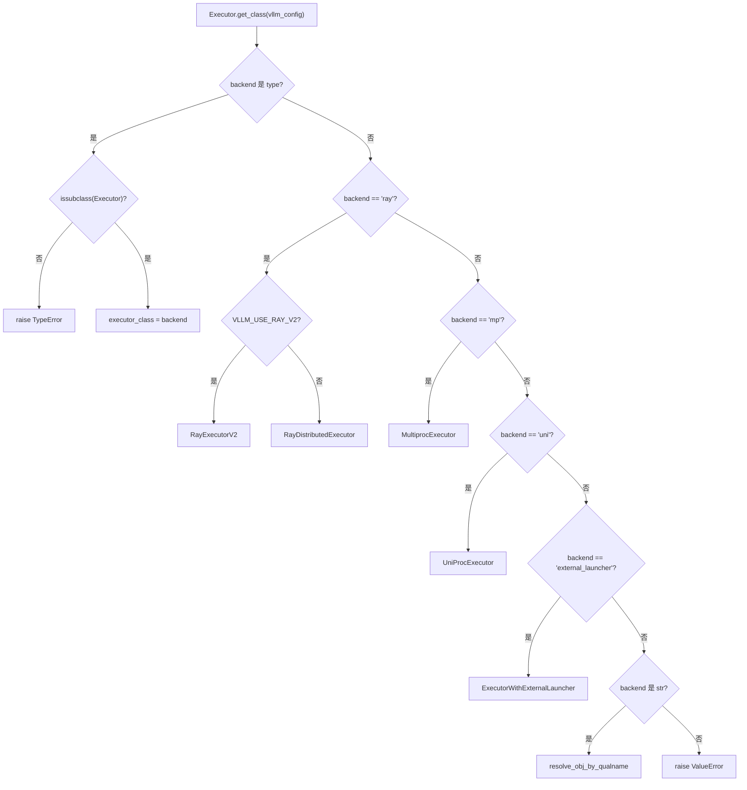
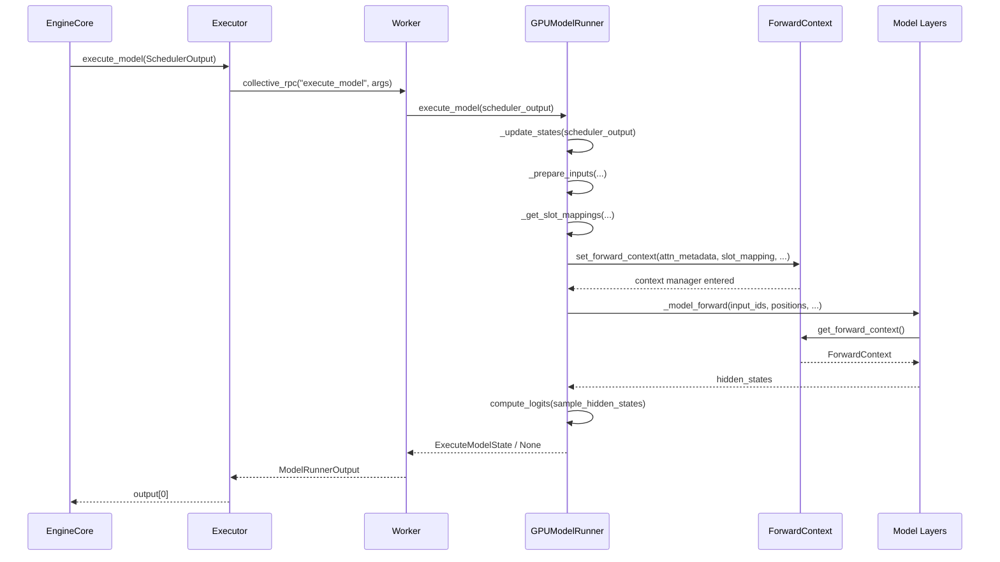

# 第 5 章：モデル実行の幹：SchedulerOutputからGPUフォワードパスまで

前章では、Schedulerが各ステップのスケジューリングループでどのリクエストがrunningキューに入り、どれがプリエンプトされ、どれがVRAM不足で待機するかを決定し、最終的にSchedulerOutputを生成することを見た——それはこのステップで何を計算すべきかを記述する：どのリクエスト、それぞれ何トークン、どのKVブロックを使うか。しかしこのリストは論理的な意図に過ぎず、GPUが必要とするのは物理テンソルである。本章ではSchedulerOutputがExecutorによってWorkerに配布され、GPUModelRunnerによってinput_ids、positions、slot_mapping、block tableなどのGPU実行可能な入力に翻訳され、最終的にforward_contextを通じて層間共有のバッチ記述をモデルの各層に注入し、スケジューリング決定からフォワードパスへの飛躍を完成させる過程を追跡する。

# 5.1 Executor：スケジューリング結果を各カードに送る

## 直感モデル

`Executor`はEngineCoreとGPU Workerの間の「伝令官」である。これがなければ、EngineCoreはクラスタに何枚のカードがあり、各カードがどのプロセスにあり、どのように`SchedulerOutput`過去のシリアライズ——スケジューリングロジックが分散トポロジーと絡み合ってしまう。`Executor`この責務を抽出する：EngineCore は呼び出しのみを担当し`execute_model(scheduler_output)`、残りの「誰に送るか、どう送るか、いくつの結果を受け取るか」は Executor が決定する。

## クラス階層とフィールド

`Executor`は抽象基底クラスであり、そのクラスレベルフィールドがバックエンド能力を直接エンコードしている[FACT:vllm/v1/executor/abstract.py:48-49]：

```python
uses_ray: bool = False  # whether the executor uses Ray for orchestration.
supports_pp: bool = False  # whether the executor supports PP
```

これら二つのフラグは装飾的ではない——上位層のコードがこれらを読み取り、特定の最適化パスを有効にするかどうかを決定する。`__init__`で初期化される`sleeping_tags`、`kv_output_aggregator`、`ec_output_aggregator`三つの状態フィールド[FACT:vllm/v1/executor/abstract.py:119-120]、それぞれスリープモードラベル追跡、KV コネクタ出力集約、エンコーダコネクタ出力集約に使用される。

## バックエンド選択：`get_class`の分岐ルーティング

`get_class`は静的ファクトリであり、`distributed_executor_backend`設定に基づいて具体的な Executor クラス[FACT:vllm/v1/executor/abstract.py:51-96]を返す。その分岐構造は詳しく見る価値がある：

- 設定自体が`type`の場合、それが`Executor`のサブクラスであるかを検証した後、直接使用する[FACT:vllm/v1/executor/abstract.py:52-61]；
- `"ray"`分岐の下にはさらに二次分岐がある：`VLLM_USE_RAY_V2_EXECUTOR_BACKEND`が真の場合は`RayExecutorV2`を使用し、そうでなければ`RayDistributedExecutor` [FACT:vllm/v1/executor/abstract.py:64-72]；
- `"mp"`は`MultiprocExecutor`，`"uni"`にマッピングされ、`UniProcExecutor` [FACT:vllm/v1/executor/abstract.py:73-80]；
- は`resolve_obj_by_qualname`にマッピングされる[FACT:vllm/v1/executor/abstract.py:85-90]。



## を通じて動的に解決される`execute_model`コピー

ステップバイステップ：一回の`SchedulerOutput`の呼び出しフロー`executor.execute_model(scheduler_output)`。

`Executor.execute_model`シナリオを代入：EngineCore が一步のスケジューリングを完了し、[FACT:vllm/v1/executor/abstract.py:237-238]：

```python
def execute_model(
    self, scheduler_output: SchedulerOutput, non_block: bool = False
) -> ModelRunnerOutput | None | Future[ModelRunnerOutput | None]:
    output = self.collective_rpc(
        "execute_model", args=(scheduler_output,), non_block=non_block
    )
    return output[0]
```

> **[Design Inference & Architectural Trade-offs]**
> の実装は極めて簡潔`collective_rpc`コピー`output[0]`〔設計推論とアーキテクチャトレードオフ〕`output[0]`鍵は`collective_rpc`にある——これはメソッド名と引数をすべての Worker にブロードキャストし、各 Worker の戻り値リストを収集し、そして[FACT:vllm/v1/executor/abstract.py:220-221]は最初のものだけを取る。なぜ最初のものだけを取るのか？ テンソル並列下では、すべての Worker が同じ論理フォワードを実行し、出力は意味的に等価であるため；サンプリング結果は最後の PP ステージまたは rank 0 によって決定され、`SchedulerOutput`を取ることで重複集約を回避する。

`sample_tokens`のドキュメントは明確に「制御メッセージのみを送信し、データプレーン通信は別途確立する」ことを推奨している[FACT:vllm/v1/executor/abstract.py:257-258]、これこそが`None`の位置づけである——これは制御メッセージであり、実際の token データは GPU テンソルを通じて Worker 内部で流れる。`execute_model`は同じパターンに従う`None`、しかし戻り値の型に`ExecuteModelState`を含まない——サンプリングは必然的に結果を産出する。これら二つのメソッドの分業は vLLM v1 の「実行-サンプリング分離」設計に対応する：

## は

`collective_rpc`を返す可能性がある（フォワードがコミットされたがサンプリングが延期されたことを示す）、この場合状態は`@abstractmethod` [FACT:vllm/v1/executor/abstract.py:186-192]に一時保存される。`MultiprocExecutor`設計思考`RayDistributedExecutor`は`UniProcExecutor`として宣言されている、つまり異なるバックエンドが「どのように RPC を Worker に送るか」を自分で実装しなければならない。

は共有メモリキューを使用し、`supported_tasks`は Ray actor 呼び出しを使用し、`@cached_property` [FACT:vllm/v1/executor/abstract.py:306-309]は直接ローカル呼び出しを行う。この抽象化により、上位層のコードは分散の詳細を完全に気にする必要がなくなる。`get_supported_tasks`見落としがちな詳細：

# は

## とマークされ、コメントは「不必要な RPC 呼び出しを避ける」と明言している。なぜなら

`GPUModelRunner`はプロセス間通信を必要とし、タスクリストはモデルのライフサイクル内で不変であるため、キャッシュは正確かつ必要な最適化である。`SchedulerOutput`5.2 GPUModelRunner：SchedulerOutput から入力テンソルへ

## 直感的モデル

`GPUModelRunner`は「翻訳者」である：これは[FACT:vllm/v1/worker/gpu_model_runner.py:479-480]：`LoRAModelRunnerMixin`、`KVConnectorModelRunnerMixin`、`ECConnectorModelRunnerMixin`内の論理記述（リクエスト ID、token 数、ブロック ID）を GPU が直接消費できる物理テンソルに翻訳する。もしこれがなければ、モデル層が「3 番目のリクエストの 7 番目の token はどの KV スロットにあるか」といった問題を自分で処理しなければならない——これは壊滅的な関心の漏洩である。

`__init__`コア状態とメモリレイアウト[FACT:vllm/v1/worker/gpu_model_runner.py:488-498]は三つの Mixin から継承する

- `check_ep_fault`、それぞれ LoRA 適配、KV コネクタ、エンコーダコネクタ能力を提供する。[FACT:vllm/v1/worker/gpu_model_runner.py:507-509]；
- `is_pooling_model`にはすべての設定オブジェクト`runner_type == "pooling"`がキャッシュされ、いくつかの重要なフラグが初期化される：[FACT:vllm/v1/worker/gpu_model_runner.py:515]；
- `enable_prompt_embeds`：データ並列 > 1 かつ MoE モデルの場合のみ、EP all2all マネージャがフォールトトレランスをサポートするかを照会する[FACT:vllm/v1/worker/gpu_model_runner.py:516]。

`ExecuteModelState`：`NamedTuple`によって決定される`execute_model()`：prompt embedding 入力を有効にするかどうか`sample_tokens()`は[FACT:vllm/v1/worker/gpu_model_runner.py:463-476]であり、`logits`、`hidden_states`、`sample_hidden_states`と`spec_decode_metadata`、`slot_mappings`の間の一時状態を保持する[FACT:vllm/v1/worker/gpu_model_runner.py:464-464]。

## Step-by-Step：`_update_states`。そのフィールド設計は実行-サンプリング分離の本質を明らかにする：

はフォワードの産物であり、

**はサンプリング段階でまだ必要なメタデータである。コメントは明確にこれが「execute_model() が None を返した後に渡される一時キャッシュ状態」であると述べている**キャッシュ状態をどのように同期するか`finished_req_ids`シナリオを代入：スケジューラが本ステップでリクエスト A（新規リクエスト）、B（前ステップの decode 継続）、C（プリエンプト後に復帰）を処理し、同時にリクエスト D が完了したと決定する。`self.requests`第一步：完了したリクエストをクリーンアップする。`input_batch`は[FACT:vllm/v1/worker/gpu_model_runner.py:1202-1217]を走査し、`finished_req_ids`から状態をポップし、`scheduled_req_ids`から[FACT:vllm/v1/worker/gpu_model_runner.py:1211-1215]。

**を削除する。コメントが指摘する境界ケースに注意：**と`new_block_ids_to_zero`は重複する可能性がある——リクエストが中止された後に同じ ID で再提出された場合、それらは二つの異なるリクエストとして扱われる`_zero_block_ids`第二步：新しく割り当てられた KV ブロックをゼロクリアする。[FACT:vllm/v1/worker/gpu_model_runner.py:1219-1222]もし

**が空でなければ、**を呼び出して显存をゼロクリアし、古い NaN がアテンションや SSM 計算を汚染するのを防ぐ[FACT:vllm/v1/worker/gpu_model_runner.py:1238-1247]：

```python
scheduled_req_ids = scheduler_output.num_scheduled_tokens.keys()
cached_req_ids = self.input_batch.req_id_to_index.keys()
resumed_req_ids = scheduler_output.scheduled_cached_reqs.resumed_req_ids
unscheduled_req_ids = cached_req_ids - (scheduled_req_ids - resumed_req_ids)
```

第三步：未スケジュールリクエスト集合を計算する。`scheduled_req_ids - resumed_req_ids`これは最も間違いやすいステップである`scheduled_req_ids`コピー`cached_req_ids`コメントはなぜ`resumed_req_ids`であり直接`reset_prefix_cache`ではないかを説明している：通常[FACT:vllm/v1/worker/gpu_model_runner.py:1241-1246]。

**と**は交差しないが、`scheduled_new_reqs`がトリガーする強制プリエンプトシナリオでは、復帰したリクエストはまず永続バッチからクリアしてから再び追加する必要がある`CachedRequestState` [FACT:vllm/v1/worker/gpu_model_runner.py:1295-1308]第四步：新規リクエストを処理する。`RANDOM_SEED`各`torch.Generator` [FACT:vllm/v1/worker/gpu_model_runner.py:1277-1284]に対して、`_init_mrope_positions`を構築する。もしサンプリングタイプが[FACT:vllm/v1/worker/gpu_model_runner.py:1319-1321]。

**なら、シード付きの**を作成する。もしモデルが M-RoPE を使用するなら、`scheduled_cached_reqs`を呼び出して位置を事前計算する`num_computed_tokens` [FACT:vllm/v1/worker/gpu_model_runner.py:1402]第五步：実行中リクエストを更新する。[FACT:vllm/v1/worker/gpu_model_runner.py:1437-1448]各`req_index is None`に対して、`reqs_to_add` [FACT:vllm/v1/worker/gpu_model_runner.py:1450-1465]。

**を更新し、ブロック ID の追加または置換を処理する** `condense()`削除リクエストが残した空洞を埋める[FACT:vllm/v1/worker/gpu_model_runner.py:1511-1512]，`_may_reorder_batch`アテンションバックエンドを必要に応じて再配置させる[FACT:vllm/v1/worker/gpu_model_runner.py:1513-1514]，`refresh_metadata()`バッチメタデータを更新する[FACT:vllm/v1/worker/gpu_model_runner.py:1515-1516]。

## 入力テンソルの準備：`_prepare_input_ids`の非同期ファストパス

`_prepare_input_ids`微妙な問題を処理する：非同期スケジューリング下では、前ステップのサンプリングトークンがまだ GPU 上にあり、本ステップの`input_ids`それらを埋め込む必要がある[FACT:vllm/v1/worker/gpu_model_runner.py:1767-1772]。

通常パス（`prev_sampled_token_ids is None`）は CPU テンソルを直接 GPU にコピーする[FACT:vllm/v1/worker/gpu_model_runner.py:1788-1794]。非同期パスはリクエストを走査し、各リクエストの最後のトークンのフラット化された`input_ids`内のインデックスを計算する[FACT:vllm/v1/worker/gpu_model_runner.py:1809-1836]。コメントに具体例が示されている：`cu_num_tokens = [2, 5, 8]`、`draft_tokens = [1, 2, 2]`のとき、`sample_flattened_indices = [0, 2, 5]`，`spec_flattened_indices = [1, 3, 4, 6, 7]` [FACT:vllm/v1/worker/gpu_model_runner.py:1820-1822]。

重要な最適化がある[FACT:vllm/v1/worker/gpu_model_runner.py:1859-1868]：

```python
if common_indices_match and max_flattened_index == (num_common_tokens - 1):
    self.input_ids.gpu[:num_common_tokens].copy_(
        self.input_batch.prev_sampled_token_ids[:num_common_tokens, 0],
        non_blocking=True,
    )
    return
```

バッチが変わらず再配置もない場合、インデックスは`0..N-1`の同一の順列であり、単一のスライスコピーを直接使用でき、scatter のオーバーヘッドを回避できる。これは永続バッチ最適化の直接的な現れである。

## `slot_mapping`と block table

`_get_slot_mappings`は 2 つの形式を返す[FACT:vllm/v1/worker/gpu_model_runner.py:4078-4078]：KV cache group でインデックスされた`dict[int, torch.Tensor]`はアテンションメタデータに使用され、層名でインデックスされた`dict[str, torch.Tensor]`は`ForwardContext`に使用される。encoder-only の KV cache group に対して、slot mapping は全ゼロテンソル[FACT:vllm/v1/worker/gpu_model_runner.py:4096-4115]である；そうでなければ`block_table.slot_mapping.gpu`からスライスする[FACT:vllm/v1/worker/gpu_model_runner.py:4107-4109]。未使用の末尾パディング`-1`、コメントはこれが`reshape_and_cache`の全 CUDA graph モードでの必要性を説明している[FACT:vllm/v1/worker/gpu_model_runner.py:4118-4122]。

`_get_block_table`各 KV cache group に対してデバイステンソルを取得し、[FACT:vllm/v1/worker/gpu_model_runner.py:2319-2335]で CUDAGraph パディング行を埋める——ブロック 0 はパディング用に予約されている`NULL_BLOCK_ID`[FACT:vllm/v1/worker/gpu_model_runner.py:2332-2334]。

# 5.3 forward_context：層をまたいで共有されるバッチ記述

## 直感的モデル

`forward_context`は教室の前に貼られた「統一通知板」である：各モデル層は顔を上げれば本番の試験の座席配置（attention metadata）とルール（slot mapping）が見え、それぞれが問い合わせる必要がない。これがなければ、各アテンション層はパラメータからこれらの情報を受け取らなければならない——そしてモデル層の`forward`シグネチャは固定されており、層ごとに個別にパラメータを渡すことができない。

## データ構造

`ForwardContext`は`@dataclass` [FACT:vllm/forward_context.py:141-202]であり、核心フィールド：

- `no_compile_layers`：`static_forward_context`からコピーされ、コンパイルに参加しない層をマークする[FACT:vllm/forward_context.py:132-137]；
- `attn_metadata`：層名からアテンションメタデータへのマッピング、DBO モードでは長さ 2 のリスト（各 microbatch に 1 つ）[FACT:vllm/forward_context.py:144-152]；
- `slot_mapping`：層名から slot mapping テンソルへのマッピング[FACT:vllm/forward_context.py:145]；
- `cudagraph_runtime_mode`：ランタイム CUDA graph モード、デフォルト`NONE` [FACT:vllm/forward_context.py:155-157]；
- `batch_descriptor`：バッチ記述子、CUDA graph ディスパッチに使用[FACT:vllm/forward_context.py:158]；
- `is_padding`：token 軸上のブールマスク、`True`はパディング行を表す[FACT:vllm/forward_context.py:162-165]。

`BatchDescriptor`はもう一つの`@dataclass(frozen=True)` [FACT:vllm/forward_context.py:30-57]であり、フィールド設計は「記述項目の最小化」原則に従う：`num_tokens`、`num_reqs`（PIECEWISE モードでは None になり得る）、`uniform`（すべてのリクエストのトークン数が同じ）、`has_lora`、`num_active_loras`。コメントは`num_active_loras`の存在理由を説明している：`cudagraph_specialize_lora_count`が有効なとき、各 LoRA 数量値が独立した CUDA graph をキャプチャする。なぜなら`fused_moe_lora`などのカーネルの grid size がこの値に依存するからである[FACT:vllm/forward_context.py:60-64]。

## グローバルシングルトンとコンテキスト管理

`_forward_context`はモジュールレベルのグローバル変数[FACT:vllm/forward_context.py:199-201]であり、`override_forward_context`コンテキストマネージャを通じて進入時に旧値を保存し、退出時に復元する[FACT:vllm/forward_context.py:263-274]。`set_forward_context`はより高レベルのラッパー[FACT:vllm/forward_context.py:277-394]であり、DP メタデータ構築、batch descriptor の自動作成、プラットフォーム固有の kwargs 注入を追加で処理する。

## Step-by-Step：`execute_model`からモデルフォワードまで

シナリオを代入：`GPUModelRunner.execute_model`はすべての入力テンソルを準備済みで、まもなくモデルを呼び出す。

において、`execute_model``set_forward_context`が呼び出される[FACT:vllm/v1/worker/gpu_model_runner.py:4408-4420]：

```python
with (
    set_forward_context(
        attn_metadata,
        self.vllm_config,
        num_tokens=num_tokens_padded,
        num_tokens_across_dp=num_tokens_across_dp,
        cudagraph_runtime_mode=cudagraph_mode,
        batch_descriptor=batch_desc,
        ubatch_slices=ubatch_slices_padded,
        slot_mapping=slot_mappings,
        skip_compiled=has_encoder_input,
        is_padding=is_padding,
    ),
    ...
):
    model_output = self._model_forward(...)
```

`set_forward_context`内部でまず`DPMetadata`を構築し（DP またはシーケンス並列 MoE が有効な場合）[FACT:vllm/forward_context.py:299-328]、次に`create_forward_context`を呼び出して`ForwardContext`インスタンスを構築[FACT:vllm/forward_context.py:347-358]、最後に`override_forward_context`を通じてグローバル変数を設定する[FACT:vllm/forward_context.py:361-362]。

モデル層は`get_forward_context()`を通じて[FACT:vllm/forward_context.py:208-214]を読み取る。設定されていない場合、アサーションが失敗し`set_forward_context`。



## コピー

> **[Design Inference & Architectural Trade-offs]**
> 〔設計推論とアーキテクチャトレードオフ〕`forward`なぜグローバル変数を使い、明示的なパラメータ渡しを使わないのか？ モデル層の`get_forward_context()`シグネチャは HuggingFace の規約で固定されており、層ごとに追加パラメータを注入できないからである。グローバル変数 + コンテキストマネージャは、モデルコードを変更せずに層をまたぐ注入を実現できる唯一の方法である。代償は暗黙的な依存——`set_forward_context`の呼び出し元は自分が

`is_padding`のスコープ内にいることを保証しなければならない。[FACT:vllm/forward_context.py:162-165]フィールドの設計は注目に値する

`all_moe_layers`：コメントは「消費者はこれを使って padding token の作業をスキップできる」と述べている。これは CUDA graph シナリオでの最適化である——padding 行はグラフキャプチャに参加するが、実際の計算を生成すべきではない。`moe_layer_index`[FACT:vllm/forward_context.py:170-195]と`vllm.moe_forward`は巧妙な workaround のペアである`ForwardContext`。コメントは問題を詳細に説明している：[FACT:vllm/forward_context.py:182-184]。

# カスタム演算子は層名文字列をグラフにハードコードし、torch.compile のコールドスタート時間が長くなりすぎる。解決策は層名リストを

**に保存し、カスタム演算子が順番に文字列をポップしてカウンタをインクリメントする。コメントは「カスタム演算子が順番に実行され、torch.compile が再配置しない」という仮定に依存することも率直に認めている** `_update_states`設計思考と本番の落とし穴`output_token_ids`非同期スケジューリングの状態一貫性。[FACT:vllm/v1/worker/gpu_model_runner.py:1376-1384]は非同期投機的デコーディング下で「楽観的仮定」戦略を採用する：前ステップのすべての draft token が受け入れられたと仮定し、まず[FACT:vllm/v1/worker/gpu_model_runner.py:1509-1510]を拡張し、次に遅延修正関数`num_computed_tokens` [FACT:vllm/v1/worker/gpu_model_runner.py:1547-1558]を登録する。修正関数はモデルフォワード起動後に

**`_may_reorder_batch`を呼び出し、GPU から実際の受け入れ数を読み取り**をロールバックする。この設計の巧妙さは：修正が「バッチ起動済み」の後に発生し、フォワードをブロックせず、非同期パイプラインの連続性を保つことにある。`kv_cache_groups`のトリガ条件。[FACT:vllm/v1/worker/gpu_model_runner.py:1131-1132]このメソッドはまず`is_attention_free`：Mamba モデルも attention-free だが、KV cache で内部状態を保存する[FACT:vllm/v1/worker/gpu_model_runner.py:1116-1139]。真に KV cache group を持たないモデルのみが再配置をスキップする。

**`_prepare_input_ids`のインデックス計算の落とし穴。**バッチ内に前ステップの decode リクエストと新規リクエストが混在する場合、`num_common_tokens < total_without_spec`、まず CPU テンソルをコピーしてから scatter する必要がある[FACT:vllm/v1/worker/gpu_model_runner.py:1849-1854]。もし`num_common_tokens == 0`、前ステップと重複するリクエストが存在しないことを示し、直接返す[FACT:vllm/v1/worker/gpu_model_runner.py:1855-1858]。この二つの分岐の区別は極めて重要である——どちらかを見落とすと`input_ids`の一部が未初期化になる。

**`AsyncGPUModelRunnerOutput`のストリーム同期。**出力コピーは独立した CUDA stream 上で実行され[FACT:vllm/v1/worker/gpu_model_runner.py:308-328]、`blocking=True`の Event を使用して CUDA ドライバロックのビジーループを回避する[FACT:vllm/v1/worker/gpu_model_runner.py:296-298]。`get_output()`では先に synchronize してからデバイステンソル参照を解放する[FACT:vllm/v1/worker/gpu_model_runner.py:336-340]、順序を逆にしてはならない——そうでなければテンソルがコピー完了前に回収される可能性がある。

# 本章のまとめ

本章では`SchedulerOutput`EngineCore から GPU フォワードまでの完全なパスを追跡した。`Executor``collective_rpc`を通じてスケジューリング結果をすべての Worker にブロードキャストし、`GPUModelRunner`の`_update_states`がキャッシュ状態を同期し、`_prepare_inputs`入力テンソルを構築し、`_get_slot_mappings`KV スロットマッピングを生成し、最後に`set_forward_context`がバッチ記述をグローバルコンテキストに注入してモデルの各層が消費できるようにする。非同期スケジューリングパスは楽観的仮定 + 遅延修正によりパイプラインの連続性を維持し、`ForwardContext`のグローバルシングルトン設計がモデル層のシグネチャ固定と層間メタデータ注入の矛盾を解決した。

# 本章の考察とセルフチェック

Q1: `_update_states`の`unscheduled_req_ids = cached_req_ids - (scheduled_req_ids - resumed_req_ids)`という式で、もし`resumed_req_ids`を減算から取り除いて`cached_req_ids - scheduled_req_ids`にした場合、どのようなシナリオで状態の不整合が発生するか？

**参考解析**：コメントは[FACT:vllm/v1/worker/gpu_model_runner.py:1241-1246]，`cached_req_ids`と`resumed_req_ids`は通常交差しないことを明示しているが、`reset_prefix_cache`がトリガーする強制プリエンプションのシナリオでは、一つのリクエストが同時に`cached_req_ids`と`resumed_req_ids`に現れる可能性がある。このとき`scheduled_req_ids - resumed_req_ids`はこのリクエストを「スケジュール済み」集合から除外し、`unscheduled_req_ids`に落とし込み、まず永続バッチから除去してから通常の resumed パスで再参加させる。もし`resumed_req_ids`を取り除くと、このリクエストは「スケジュール済み」と見なされてバッチに残るが、そのブロック ID は既に置き換えられており（`req_state.block_ids = new_block_ids` [FACT:vllm/v1/worker/gpu_model_runner.py:1448]）、block table の古い行と新しいブロック ID が一致しなくなり、アテンション計算が誤った KV 位置を読み取ることになる。

Q2: `_prepare_input_ids`のファストパス[FACT:vllm/v1/worker/gpu_model_runner.py:1859-1868]は`common_indices_match and max_flattened_index == (num_common_tokens - 1)`を条件として使用する。もしバッチ内のリクエスト順序が変化した場合（例えばアテンションバックエンドがバッチを再配置した）、しかし`common_indices_match`が依然として True である場合、何が起こるか？

**参考解析**：`common_indices_match`はループ内で`prev_index == flattened_index`を通じて[FACT:vllm/v1/worker/gpu_model_runner.py:1835]。`prev_index`を累積し`prev_positions`、現在のバッチ位置を前ステップのバッチ位置にマッピングする；`flattened_index`は現在のバッチにおけるそのリクエストの最後の token のフラットインデックスである。もしバッチが再配置されると、`prev_index`と`flattened_index`の対応関係が変わり、`common_indices_match`は False になり、ファストパスはトリガーされない。しかし、もし再配置が偶然`prev_index == flattened_index`をすべてのリクエストに対して成立させる場合（例えば同じ token 数を持つ二つのリクエストを交換した場合）、ファストパスは誤って`prev_sampled_token_ids[:num_common_tokens, 0]`を直接スライスコピーしてしまう——これによりリクエスト A のサンプリング token がリクエスト B の位置に書き込まれる。`max_flattened_index == num_common_tokens - 1`この追加条件はまさにこの退化ケースを防ぐためのものである：フラットインデックスが正確に`0..N-1`の順列であることを要求し、いかなる非自明な再配置も排除する。

Q3: `ForwardContext`はモジュールレベルのグローバル変数`_forward_context`を使用し、スレッドローカル変数ではない。`execute_model`と`sample_tokens`が分離された非同期スケジューリング下で、もし`sample_tokens`がフォワード完了前に呼び出された場合、`get_forward_context()`は何を返すか？これはどのような問題を引き起こすか？

**参考解析**：`set_forward_context`はコンテキストマネージャ[FACT:vllm/forward_context.py:278-288]であり、`with`ブロックの終了時に`override_forward_context`の`finally`を通じて古い値を復元する[FACT:vllm/forward_context.py:263-274]。`execute_model`では、`set_forward_context`の`with`ブロックは`_model_forward`呼び出しのみをラップし[FACT:vllm/v1/worker/gpu_model_runner.py:4408-4433]、フォワードが戻るとコンテキストは復元される。もし`sample_tokens`がフォワード完了後に呼び出された場合、`get_forward_context()`はアサーション失敗する[FACT:vllm/forward_context.py:208-214]、なぜなら`_forward_context`は既に`None`（または外側の値）にリセットされているからである。これこそが`ExecuteModelState`が存在する理由である[FACT:vllm/v1/worker/gpu_model_runner.py:463-476]：サンプリングに必要な状態（`logits`、`hidden_states`、`slot_mappings`）は NamedTuple に明示的に保存され、`ForwardContext`の暗黙的な伝達に依存しない。もし誤って`ForwardContext`が`sample_tokens`内で依然として利用可能だと思うと、アサーションエラーが発生するか、誤ったメタデータを読み取ることになる。

ここまでで、SchedulerOutput から GPU フォワード伝播までの完全なパスを歩み終えた：Executor のディスパッチ、Worker の実行、GPUModelRunner が論理マニフェストを物理テンソルに変換し、forward_context を通じてバッチ記述を各層に注入する。しかし、モデルフォワード伝播で最も時間のかかる部分——アテンション計算——はまだ展開されていない。次章ではアテンションバックエンドに深く入り、attn_metadata 内の block table と slot mapping が PagedAttention カーネルによってどのように消費されるか、そして FlashAttention、FlashInfer、Triton などの異なるバックエンドが統一インターフェースを通じてどのように選択・スケジューリングされるかを見ていく。
