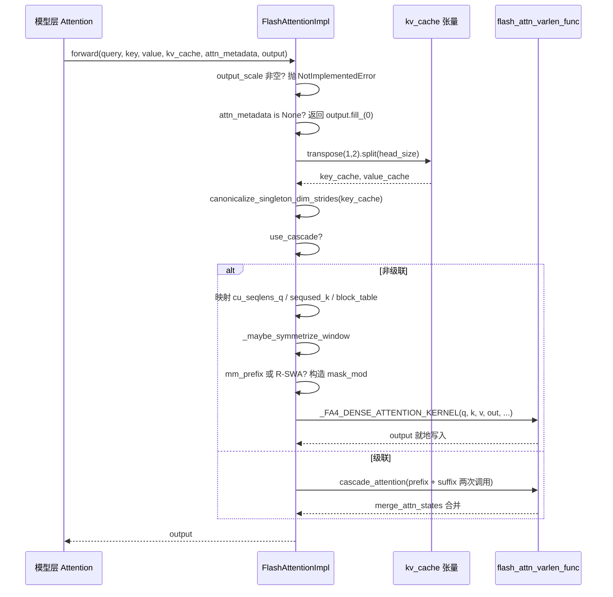

# 第 6 章：アテンションバックエンドと PagedAttention カーネル実装

前章では、GPUModelRunner がスケジューリング結果を input_ids、slot_mapping、block_table などの物理テンソルに変換し、forward_context を通じて各層に注入する方法を見ました。しかし、実際に GPU 時間を大きく消費する部分——アテンション計算——はまだ宙に浮いたままです。attn_metadata 内のテンソルは一体誰が消費するのか？FlashAttention、FlashInfer、Triton といった実装が、同じモデルコードの下で互換可能なのはなぜか？その答えは AttentionBackend 抽象層にあります。これは「アテンションをどう計算するか」と「モデルがどう呼び出すか」を分離します。モデル層は AttentionImpl 参照のみを保持し、統一された forward(query, key, value, kv_cache, attn_metadata, output) を呼び出します。一方、具体的なバックエンドは block_table、slot_mapping、seq_lens を自身のカーネルが消費できるパラメータに変換する責任を負います。本章では FlashAttentionBackend を主軸とします。なぜなら、それは PagedAttention の gather セマンティクス、CUDA Graph 互換性、カスケードアテンション、DCP 分散コンテキストなど、最も豊富な分岐を同時にカバーしているからです。これを読み解けば、他のバックエンドは単なるパラメータマッピングの変種に過ぎません。この「バックエンド登録 + 統一インターフェース」という設計の動機は非常に直接的です：アテンションカーネルの進化は極めて速く（FA2→FA3→FA4、FlashInfer のイテレーション、Triton の自社開発）、モデル層が特定のカーネルに直接依存していると、カーネルがアップグレードするたびにモデルコードを変更する必要があります。抽象層は変化を get_impl_cls() という一つのファクトリメソッドの背後に隔離します。

# バックエンド選択：能力宣言とメタデータ構築

## 直感的モデル

を`AttentionBackend`採用通知と考えてください：それは実際の作業は行わず、「どの dtype、どの head_size、どの KV cache 量子化フォーマット、どの attention タイプを処理できるか」を宣言するだけです。スケジューラはモデル設定を持ってマッチングを行い、マッチングに失敗すれば次の候補に切り替えます。この宣言層がなければ、システムは実行時に「この head_size はカーネルがサポートしていない」と初めて気づき、直接クラッシュします。

## 能力マトリクス：フィールドは契約

`FlashAttentionBackend`のクラス属性がその能力の境界です。`supported_dtypes`は fp16/bf16 に限定[FACT:vllm/v1/attention/backends/flash_attn.py:287-287]；`supported_kv_cache_dtypes`は追加で fp8 シリーズを許可[FACT:vllm/v1/attention/backends/flash_attn.py:298-299]。しかし「サポートを宣言」は「無条件サポート」と等しくありません——`supports_kv_cache_dtype`は量子化 KV に対してさらに`flash_attn_supports_kv_cache_dtype`に委譲してデバイス依存の判断を行います[FACT:vllm/v1/attention/backends/flash_attn.py:431-438]。

さらに精細なのは`supports_combination`です：これは head_size、dtype、block_size、use_mla、has_sink などの一連の組み合わせパラメータを受け取り、`None`を返せば利用可能、文字列を返せば拒否理由を示します[FACT:vllm/v1/attention/backends/flash_attn.py:454-507]。例えば sink は計算能力 < 9.0 で拒否され[FACT:vllm/v1/attention/backends/flash_attn.py:467-468]、SM90 では FP8 KV と mm_prefix の組み合わせは Triton を経由しなければなりません[FACT:vllm/v1/attention/backends/flash_attn.py:472-472]。この「理由文字列を返す」設計により、上位層は静かなフォールバックではなく、診断可能なエラーを出せます。

block_size の選択も同様に能力によって駆動されます。デフォルトでは`MultipleOf(16)`を返しますが、SM90 FP8-KV では 64 が強制され[FACT:vllm/v1/attention/backends/flash_attn.py:297-324]、FA4 の head_size=256 カーネルでは`FA4_HD256_PAGE_SIZE` [FACT:vllm/v1/attention/backends/flash_attn.py:326-352]が強制されます。これは KV cache のブロックサイズが適当に決められるものではない理由を説明します——それはカーネルの TMA タイルサイズによって逆に制約されるのです。

## メタデータ構造：FlashAttentionMetadata のフィールドレイアウト

`FlashAttentionMetadata`は dataclass であり、フィールドは4つのグループに分かれます[FACT:vllm/v1/attention/backends/flash_attn.py:511-566]：

第一グループは基本的なバッチ記述です：`num_actual_tokens`（パディングを除いた実際のトークン数）、`max_query_len`、`query_start_loc`（プレフィックスサム、varlen カーネルが各シーケンスの開始と終了を特定するために使用）、`seq_lens`、`block_table`、`slot_mapping` [FACT:vllm/v1/attention/backends/flash_attn.py:520-526]。ソースコードのコメントにある ASCII 図[FACT:vllm/v1/attention/backends/flash_attn.py:512-518]に注意してください。これは`context_len`（履歴 KV）、`query_len`（今回新規追加）、`seq_len`（両者の合計）を正確に区別しています——これは varlen カーネルパラメータを理解する鍵です。

第二グループはカスケードアテンションフィールドです：`use_cascade`、`common_prefix_len`、`cu_prefix_query_lens`など[FACT:vllm/v1/attention/backends/flash_attn.py:528-533]。

第三グループは DCP（Decode Context Parallel）フィールドです：`max_dcp_context_kv_len`、`dcp_context_kv_lens`、および decode/prefill リクエスト数を区別するカウンタ[FACT:vllm/v1/attention/backends/flash_attn.py:535-544]。

第四グループはオプションのスケジューリングと特殊マスクです：`scheduler_metadata`（FA3 AOT スケジューリング用）、`causal`（bool またはテンソルで、シーケンスごとの因果をサポート）、`mm_prefix_query_range_tensor`（マルチモーダル双方向範囲）、R-SWA 関連フィールド[FACT:vllm/v1/attention/backends/flash_attn.py:546-566]。

> **[Design Inference & Architectural Trade-offs]**
> `causal`フィールドタイプは`bool | torch.Tensor`であり、純粋な bool ではありません。これは「同一バッチ内で一部のシーケンスが因果的、一部が非因果的」というシナリオ（例：PrefixLM）をサポートするためです。これがテンソルの場合、FA4 の`dynamic_causal`パラメータが引き継ぎ、FA2/FA3 は直接 NotImplementedError を投げます[FACT:vllm/v1/attention/backends/flash_attn.py:1429-1433]。

## build() のステップバイステップ

シナリオを想定：混合バッチ、3つの decode シーケンス + 2つの prefill シーケンス、カスケードなし、DCP なし。

第一步、`common_attn_metadata`から基礎テンソルをアンパック[FACT:vllm/v1/attention/backends/flash_attn.py:824-832]。第二ステップでは、AOT スケジューリングを有効にするかどうかを決定します：`aot_schedule = self.aot_schedule and not fast_build and not envs.VLLM_BATCH_INVARIANT` [FACT:vllm/v1/attention/backends/flash_attn.py:836-838]。`self.aot_schedule`において`__init__`によって`get_flash_attn_version() == 3`が決定します[FACT:vllm/v1/attention/backends/flash_attn.py:709-709]——FA3 のみがスケジューリングメタデータの事前計算をサポートします。第三ステップでは、初回 build 時に遅延的に`aot_sliding_window`を埋めます：すべての`FlashAttentionImpl`層を走査してスライディングウィンドウ設定を収集し、設定が一意であればそれを採用し、複数ある場合は AOT を無効化します[FACT:vllm/v1/attention/backends/flash_attn.py:848-851]。

第四ステップでは、`max_num_splits`を計算します。デフォルトは 0（FA3 にヒューリスティックを使わせる）で、full CUDA graph が有効かつトークン数がキャプチャ範囲内にある場合にのみ`self.max_num_splits` [FACT:vllm/v1/attention/backends/flash_attn.py:856-866]に設定します。コメントには理由が説明されています：`num_splits > 1`は`[num_splits, num_heads, num_tokens, head_size]`の中間バッファを割り当て、VRAM コストが高いため、CUDA graph のシナリオでのみ[FACT:vllm/v1/attention/backends/flash_attn.py:862-865]。

だけの価値があります`_get_scheduler_metadata`第五ステップでは、非カスケード非 DCP ブランチを通り、[FACT:vllm/v1/attention/backends/flash_attn.py:976-986]を呼び出して FA3 のスケジューリングメタデータを生成します`_store_scheduler_metadata`。第六ステップでは、[FACT:vllm/v1/attention/backends/flash_attn.py:671-684]が CUDA graph シナリオを処理します：新しいメタデータを事前割り当てバッファにコピーし、残りの部分をゼロクリアします[FACT:vllm/v1/attention/backends/flash_attn.py:671-672]。

。このゼロクリアのステップは極めて重要です——コメントは明確に指摘しています。そうでなければ一部の thread block が無効なメタデータを読み取り、出力バッファを上書きしてしまいます`FlashAttentionMetadata`第七ステップでは、[FACT:vllm/v1/attention/backends/flash_attn.py:992-1015]。

```mermaid
flowchart TD
    start["build(common_prefix_len, common_attn_metadata)"] --> unpack["解包 query_start_loc / seq_lens / block_table / slot_mapping"]
    unpack --> aot{"aot_schedule 且非 fast_build 且非 BATCH_INVARIANT?"}
    aot -->|是| sw_check{"aot_sliding_window 已初始化?"}
    aot -->|否| maxsplit
    sw_check -->|否, 首次| collect["_get_sliding_window_configs 收集层滑窗"]
    collect --> sw_unique{"配置数量 == 1?"}
    sw_unique -->|是| set_sw["设置 aot_sliding_window"]
    sw_unique -->|否, >1| disable_aot["self.aot_schedule = False"]
    set_sw --> maxsplit
    disable_aot --> maxsplit
    sw_check -->|是| maxsplit["计算 max_num_splits"]
    maxsplit --> cg_check{"use_full_cuda_graph 且 tokens |是| set_splits["max_num_splits = self.max_num_splits"]
    cg_check -->|否| zero_splits["max_num_splits = 0"]
    set_splits --> branch
    zero_splits --> branch
    branch{"dcp_world_size > 1?"}
    branch -->|是| dcp_path["计算 dcp_context_kv_lens, 可能 skip"]
    branch -->|否| cascade_check{"common_prefix_len > 0?"}
    cascade_check -->|是| cascade_path["构造 prefix/suffix 双份 scheduler_metadata"]
    cascade_check -->|否| normal_path["_get_scheduler_metadata 单份"]
    dcp_path --> store
    cascade_path --> store
    normal_path --> store
    store["_store_scheduler_metadata: CUDA graph 时拷入预分配缓冲并清零尾部"] --> build_meta["构造 FlashAttentionMetadata"]
    build_meta --> mm_check{"mm_req_doc_ranges 非空?"}
    mm_check -->|是| fill_mm["fill_mm_prefix_query_ranges + 拷贝到 GPU"]
    mm_check -->|否| rswa_check
    fill_mm --> rswa_check{"rswa_window 非空?"}
    rswa_check -->|是| copy_rswa["拷贝 prefix_lens 到持久缓冲"]
    rswa_check -->|否| done
    copy_rswa --> done["返回 attn_metadata"]
```

---

# を返します

## コピー

`forward()`forward()：メタデータからカーネル呼び出しまでの完全な経路

## 直感的モデル

はバックエンドの「最終組み立て工場」です：モデル層が計算した Q/K/V、KV cache テンソル、および前のステップで構築されたメタデータを受け取り、KV cache の物理レイアウトをカーネルが期待する形状に調整し、その後具体的なカーネルにディスパッチします。このステップがなければ、カーネルは誤ったメモリレイアウトを読み取り、出力はサイレントに誤ります——クラッシュよりも発見が困難です。`[num_blocks, num_kv_heads, block_size, 2 * head_size]`KV cache のメモリレイアウト変換[FACT:vllm/v1/attention/backends/flash_attn.py:1246-1247]vLLM の KV cache の物理形状は`[num_blocks, block_size, num_kv_heads, head_size]`。

——K と V が最後の次元に連結されています`forward()`。しかし FlashAttention カーネルは K と V が分離されており、レイアウトが`kv_cache.transpose(1, 2).split(self.head_size, dim=-1)` [FACT:vllm/v1/attention/backends/flash_attn.py:1310-1310]。`transpose(1,2)`であることを期待します`[blocks, heads, block_size, 2D]`変換は`[blocks, block_size, heads, 2D]`，`split`の冒頭で行われます：`transpose`が

を`canonicalize_singleton_dim_strides` [FACT:vllm/v1/attention/backends/flash_attn.py:1310-1310]に変え、最後の次元に沿って K と V に分割します。注意：`num_kv_heads=1`は stride のみを変更しデータを移動しないため、後続のカーネルは非連続アクセスをサポートする必要があります。[FACT:vllm/v1/attention/backends/flash_attn.py:1310-1310]直後に

## が続きます。コメントは動機を明示しています：

（TP シナリオで一般的）の場合、size-1 次元の stride は退化しており、FA3/FA4 は H100+ で TMA を使用するため、stride が少なくとも 16 バイトにアラインされている必要があります`if not attn_metadata.use_cascade`。これは典型的な「論理的には等価だが物理的には不正」という罠です。[FACT:vllm/v1/attention/backends/flash_attn.py:1326-1342]：`cu_seqlens_q = query_start_loc`，`seqused_k = seq_lens`，`block_table = attn_metadata.block_table`。`descale_shape`非カスケードパスのパラメータフロー`(batch_size, num_kv_heads)``(num_sequences, num_kv_heads)`ブランチに入った後、パラメータは一つずつマッピングされます`.expand()`は[FACT:vllm/v1/attention/backends/flash_attn.py:1258-1258]。

を取得し、FP8 量子化の scale ブロードキャストに使用されます——コメントは flash-attn が期待する descale 形状は`_maybe_symmetrize_window`であり、`(w, 0)`を使ってコピーを回避すると説明しています`(w, w)`次にスライディングウィンドウの対称化処理です。[FACT:vllm/v1/attention/backends/flash_attn.py:587-589]のロジック：因果スライディングウィンドウ[FACT:vllm/v1/attention/backends/flash_attn.py:1362-1365]。

## は非因果シナリオでは

に変わり、双方向クエリが両方向を見られるようにします`mm_prefix_query_ranges`。コメントはさらに「層自身の window が group の window より優先される」と強調しています。なぜなら一つの KV cache group が同時にウィンドウ層とグローバル層を収容する可能性があるからです（例：Gemma-3 で hybrid KV cache manager を無効にした場合）`mask_mod` [FACT:vllm/v1/attention/backends/flash_attn.py:1374-1407]マスク分岐：mm_prefix と R-SWA`causal = False``sliding_window_size = None` [FACT:vllm/v1/attention/backends/flash_attn.py:1406-1407]が非空かつ FA4 + 静的因果条件を満たす場合、コードは CuTE-DSL の`(causal ∧ window) ∨ bidirectional-range`を構築します。重要なアクションは[FACT:vllm/v1/attention/backends/flash_attn.py:1402-1405]。

`_make_mm_prefix_mask_mod`と`functools.cache`です。コメントは理由を説明しています：mm_prefix の意味は[FACT:vllm/v1/attention/backends/flash_attn.py:1793-1802]であり、causal の部分集合ではありません；FA #155 以降、mask_mod を設定しても causal/local が自動クリアされなくなり、呼び出し側が明示的に無効化する必要があります。そうでなければ組み込み causal パスが mask_mod をショートカットします`hash_callable`は`repr()`を使って`_load_q_range`をキャッシュします[FACT:vllm/v1/attention/backends/flash_attn.py:1793-1802]。コメントは核心的な理由を示しています：FA4 の

はクロージャユニットの`q_idx`をコンパイルキーに混入させ、ネストされた`kv_idx`は呼び出しごとにアドレスが異なるため、毎回の forward で完全な JIT 再コンパイルがトリガーされます`q_abs = q_idx + seqlen_k - seqlen_q`。これは本番環境のパフォーマンス罠の典型的なサンプルです。[FACT:vllm/v1/attention/backends/flash_attn.py:1859-1865]。`__vec_size__ = 1`マスク内部には座標変換の詳細があります：FA4 が渡すのはローカルな`_load_q_range`（現在の prefill chunk 内の 0-based）であり、[FACT:vllm/v1/attention/backends/flash_attn.py:1897-1897]。

は絶対位置です。コードは`causal & (in_prefix | in_window)` [FACT:vllm/v1/attention/backends/flash_attn.py:1945-1948]を使って絶対位置を復元します`use_fast_sampling = True`の設定にもこだわりがあります：[FACT:vllm/v1/attention/backends/flash_attn.py:1950-1950]。

## は lane 0 を読み取り、一度の呼び出しで query 行を跨ぐことはできません

R-SWA の mask_mod も類似していますが、意味は`self.fa4_hd256`であり、かつ`num_pages = cdiv(max_seqlen_k, FA4_HD256_PAGE_SIZE)`，`max_seqlen_k`により FA4 が完全にマスクされた KV block をスキップし、そのデータをロードしません`block_table`FA4 hd256 の特殊処理`num_splits = 1` [FACT:vllm/v1/attention/backends/flash_attn.py:1442-1448]

が真の場合、コードは page アラインメントを強制します：`_FA4_DENSE_ATTENTION_KERNEL(...)`はページ境界に切り上げ、[FACT:vllm/v1/attention/backends/flash_attn.py:1450-1475]。

## は正確なページ数に切り捨て、

`forward()`。コメントは hd256 カーネルがページアラインされた長さ、正確な幅の block table を要求し、SplitKV をサポートしないと説明しています。`do_kv_cache_update`最終的に`reshape_and_cache_flash`を呼び出し、q、k、v、out、cu_seqlens_q、seqused_k、block_table、softcap、mask_mod、aux_tensors などを一括して渡します`slot_mapping`KV cache 書き込み：do_kv_cache_update[FACT:vllm/v1/attention/backends/flash_attn.py:1532-1541]`key`/`value`は KV cache を読み取るのみで、書き込みは`slot_mapping`いいえ、ただし手動でのスライスは不要です。なぜなら op が`slot_mapping`の shape で実際の token 数を決定するからです[FACT:vllm/v1/attention/backends/flash_attn.py:1527-1531]。ここでは stride の正規化は行いません。TMA カーネルが関与していないためです[FACT:vllm/v1/attention/backends/flash_attn.py:1520-1521]。



---

# 設計上の考察：なぜこのように書くのか

> **[Design Inference & Architectural Trade-offs]**
> **能力宣言と実装の分離**。`supports_combination`bool ではなく理由文字列を返すのは、上位層が他のバックエンドにフォールバックする際に「なぜ FA を使わなかったのか」を記録できるようにするためであり、オンラインでの調査コストを大幅に削減します。サイレントフォールバックと比べて、この設計は意思決定の根拠を明示化します。

**CUDA Graph 互換性はメタデータ設計の暗黙の制約**。`_store_scheduler_metadata`の「コピーイン＋末尾クリア」パターン[FACT:vllm/v1/attention/backends/flash_attn.py:671-684]は R-SWA 永続バッファ[FACT:vllm/v1/attention/backends/flash_attn.py:787-798]と mm_prefix 一時退避領域[FACT:vllm/v1/attention/backends/flash_attn.py:800-813]に繰り返し現れます。共通パターンは：`__init__`で最大サイズの永続バッファを事前確保し、`build()`ではコピーのみを行い確保は行わない、というものです。その理由はコメントに明記されています——CUDA graph のキャプチャ中には確保操作を行えないためです[FACT:vllm/v1/attention/backends/flash_attn.py:1044-1046]。

**DCP と fused draft decode の相互排他**。`supports_draft_decode_metadata_update = self.dcp_world_size == 1` [FACT:vllm/v1/attention/backends/flash_attn.py:742-742]。コメントの説明：fused draft decode は draft ステップをまたいでキャプチャ済みのメタデータオブジェクトを再利用しますが、DCP の build-time ホスト側の決定（例えば`skip_dcp_context_attention()`）はメタデータの形状を変えてしまい、これらの Python フィールドは graph replay 間でインプレースに更新されません[FACT:vllm/v1/attention/backends/flash_attn.py:736-741]。これは「性能最適化と正確性が衝突したときは正確性を選ぶ」という典型的なトレードオフです。

**カスケードアテンションのヒューリスティックなしきい値**。`use_cascade_attention`は一連のしきい値でフィルタリングします：common_prefix_len < 256 は即座に拒否[FACT:vllm/v1/attention/backends/flash_attn.py:1967-1967]、alibi/sliding_window/local_attention は非対応[FACT:vllm/v1/attention/backends/flash_attn.py:1978-1979]、リクエスト数 < 8 は拒否[FACT:vllm/v1/attention/backends/flash_attn.py:1982-1984]、DCP シナリオでは無効化[FACT:vllm/v1/attention/backends/flash_attn.py:1985-1987]。通過後さらに粗い性能モデルで cascade と FlashDecoding の CTA 数と wave 数を比較します[FACT:vllm/v1/attention/backends/flash_attn.py:2011-2029]。コメントはこのモデルが「very rough」であると率直に認めています[FACT:vllm/v1/attention/backends/flash_attn.py:2009-2010]。

**本番での落とし穴**：`forward()`には目立つコメントがあり、piece-wise CUDA graph 下ではこのメソッドが eager モードで実行されること、`view`/`slice`など一見 GPU 操作がなさそうなメソッドが実際には非常に遅く、変更時には必ず benchmark が必要であることを警告しています[FACT:vllm/v1/attention/backends/flash_attn.py:1277-1284]。これはコード内で`[:num_actual_tokens]`スライスが多用され、より「エレガント」な書き方がされていない理由を説明しています——その一つ一つが性能トレードオフの結果なのです。

---

# 本章のまとめ

本章では`FlashAttentionBackend`に沿ってアテンションバックエンドの完全なライフサイクルを辿りました：能力宣言（`supports_*`シリーズ）→ メタデータ構築（`build()`が`CommonAttentionMetadata`を`FlashAttentionMetadata`に変換）→ カーネル呼び出し（`forward()`が KV cache レイアウトを変換し、マスクを構築し、FA カーネルにディスパッチ）。核心的な仕組みには以下が含まれます：KV cache の`transpose+split`レイアウト変換、退化した stride の正規化、CUDA graph 下での永続バッファパターン、mm_prefix/R-SWA の CuTE-DSL マスク構築、そしてカスケードアテンションのヒューリスティックな意思決定。

重要な設計原則：能力宣言と実装の分離、CUDA graph 互換性が駆動するメタデータの事前確保、性能最適化と正確性が衝突したときは正確性を優先（DCP は fused draft decode を無効化）。

次章ではサンプリングと出力に移ります：`logits`がどのようにプロセッサチェーン（温度、top-p、ペナルティ項）を経て token になるのか、構造化出力がどのようにデコードを制約するのか、そしてストリーミング返却がどのようにスケジューラと協調するのかを見ていきます。

# 本章の考察とセルフチェック

Q1: もし`_store_scheduler_metadata`の`self.scheduler_metadata[n:] = 0`クリア操作を削除した場合、どのようなシナリオで出力エラーが発生するでしょうか？なぜコメントが特にこれを強調しているのでしょうか？

**参考解説**：`_store_scheduler_metadata`は CUDA graph シナリオで新しいメタデータを事前確保バッファの先頭 n 個の位置にコピーします[FACT:vllm/v1/attention/backends/flash_attn.py:671-684]。末尾をクリアしない場合、前回の build で残ったスケジューラメタデータが今回のカーネルに読み込まれてしまいます。コメントは「some thread blocks may use the invalid scheduler metadata and overwrite the output buffer」と明確に指摘しています[FACT:vllm/v1/attention/backends/flash_attn.py:671-672]。発生シナリオ：バッチサイズが大きい方から小さい方へ変わる場合（例えば 8 シーケンスから 3 シーケンスに減る）、バッファの先頭 3 位置は新しいデータですが、4〜8 番目の位置はまだ旧バッチのデータです。FA3 のスケジューラメタデータには tile 割り当て情報が含まれており、カーネルが batch_size に従って読み込む際に batch_size の計算にずれがあるか、カーネルが固定 stride でスキャンする場合、ダーティデータを読み込んで出力を破壊してしまいます。これは CUDA graph のバッファ再利用における古典的な罠です：バッファのライフサイクルが複数回の replay にまたがるため、明示的にクリアする必要があります。

Q2: `_make_mm_prefix_mask_mod`は`functools.cache`でキャッシュしており、コメントにはそうしないと「force a full JIT recompile every forward」になると書かれています。このキャッシュデコレータを外すと、性能はどれほど劣化するでしょうか？なぜ FA4 のコンパイルキーがクロージャのアドレスに影響されるのでしょうか？

**参考解説**：コメントは FA4 の`hash_callable`がクロージャセルの`repr()`をコンパイルキーに混入させることを説明しています[FACT:vllm/v1/attention/backends/flash_attn.py:1793-1802]。`_make_mm_prefix_mask_mod`の内部でネスト関数`_load_q_range`が定義されており、ファクトリ関数を呼び出すたびに新しい関数オブジェクトが生成され、その`repr()`メモリアドレスを含み、アドレスは毎回異なる → コンパイルキーが毎回異なる → FA4 は再 JIT コンパイルが必要と判断する。キャッシュ後は同一になる`(sliding_window, sliding_window_left)`パラメータは同じ関数オブジェクトを再利用するため、コンパイルキーは安定する。性能劣化の程度は FA4 のコンパイル所要時間に依存するが、「毎回の forward で完全なコンパイルがトリガーされる」ことは確実であり、decode ループ内で毎ステップコンパイルが走るため、レイテンシはミリ秒級から秒級に劣化する。これは「一見無害な Python クロージャ」が JIT キャッシュを無効化する典型例である。

Q3: `supports_draft_decode_metadata_update = self.dcp_world_size == 1`この行のコードは DCP シナリオにおいて fused draft decode を無効化している。仮にこれを強制的に`True`に変更した場合、投機的デコーディング + DCP の組み合わせで具体的にどのようなエラーが発生するか？

**参考解析**：コメントは fused draft decode が draft ステップ間でキャプチャされたメタデータオブジェクトを再利用することを説明しており、DCP の build-time ホスト側の決定（例えば`skip_dcp_context_attention()`）がメタデータの形状/制御パスを変更する。例えば`max_dcp_context_kv_len` [FACT:vllm/v1/attention/backends/flash_attn.py:736-741]。これらの Python フィールドは CUDA graph replay 間でインプレース更新されない。具体的なエラー：draft ステップ間でシーケンス長が増加し、`skip_dcp_context_attention`の判定が True から False（またはその逆）に変わりうるが、再利用されたメタデータオブジェクトは依然として古い値を保持している。もし古い値が`max_dcp_context_kv_len = 0`であれば、カーネルは「DCP context なし」のパスを辿り[FACT:vllm/v1/attention/backends/flash_attn.py:1565-1589]、クロスランクの context アテンションをスキップし、出力にコンテキスト情報が欠落する——サイレントエラーであり、クラッシュはしない。これはまさに「性能最適化と正確性が衝突した際に正確性を選ぶ」ことの表れである。

ここまでで、アテンションバックエンドの抽象インターフェースからカーネル実装までの完全な経路が打通された：モデル層は AttentionImpl を通じて統一的に呼び出し、バックエンドは block_table、slot_mapping などのメタデータを具体的なカーネルパラメータに変換する責務を負い、FlashAttentionBackend の PagedAttention 実装はページング KV Cache 下での gather セマンティクスと CUDA Graph 互換戦略を示している。しかしアテンション計算が産出するのは隠れ状態にすぎず、モデルが最終的に出力するのは次の token である。これらの隠れ状態がどのように logits になり、logits がどのようにサンプリングと後処理を経て、最終的にストリーミングテキストとしてクライアントに返されるのか？次章ではこの最後の一マイルを追跡する。
