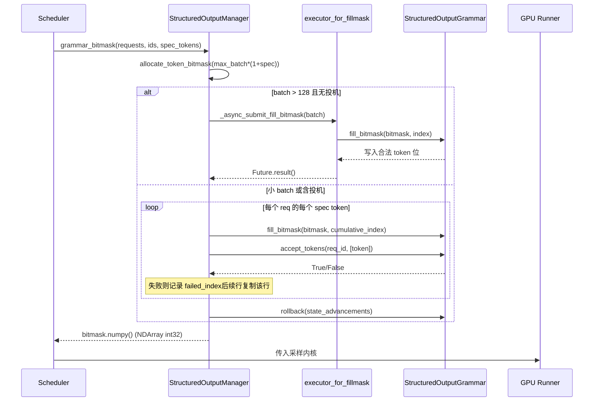

# 第 7 章：サンプリングと出力：Logits 処理、構造化出力、ストリーミング返却

前章では、アテンションバックエンドが block table をカーネルパラメータに変換し、非連続メモリ上で gather 型アテンション計算を完了する方法を追跡した。しかしアテンションが産出するのは隠れ状態にすぎない——モデルが本当にユーザーに届けるのは次の token のテキストである。本章ではこの最後の一マイルを追跡する：隠れ状態が lm_head で logits に射影された後、綿密に順序付けられたプロセッサチェーン（温度、ペナルティ、top-k/top-p、構造化制約）を通過し、token id としてサンプリングされ、detokenizer を経てテキストに復元されストリーミング配信される。この経路上でいずれかのステップの順序が乱れたり状態が漏洩したりすると、出力品質がサイレントに劣化する。

# Sampler：プロセッサチェーンの順序こそが正確性

**直感的モデル**：Sampler は組立ラインのようなもので、logits は加工待ちの素材である。ライン上の各工位（processor）が素材を変更し、工位の順序が完成品を直接決定する——先に削ってから磨くのと先に磨いてから削るのでは別物ができる。このチェーンがなければ、モデルは生の確率分布しか出力できず、ユーザーが得るのは温度制御も重複抑制もフォーマット制約もできない「裸のサンプリング」である。

## データ構造とメモリレイアウト

Sampler 自体は`nn.Module`であるが、その核心状態は極めて薄い：保持するのは`topk_topp_sampler`サブモジュール、`logprobs_mode`と`use_fp64_gumbel`フラグ[FACT:vllm/v1/sample/sampler.py:61-64]のみ。真のバッチレベル状態はすべて`SamplingMetadata`にカプセル化され、forward パラメータとして渡される。この「ステートレス Sampler + 外部メタデータ」設計は意図的である：Sampler インスタンスはエンジンライフサイクル内で一度だけ作成され、各 decode step のバッチ構成は変化するため、状態を外部化することで Sampler が CUDA Graph にキャプチャされた後も安全にリプレイできる。

重要な定数は`_SAMPLING_EPS = 1e-5` [FACT:vllm/v1/sample/sampler.py:18]である。これは同時に二つのセマンティクスを担う：温度がこの値未満なら貪欲とみなす、および`apply_temperature`におけるゼロ除算防止のフォールバック。

## Step-by-Step Walkthrough

シナリオを代入：ある batch に貪欲リクエストとランダムサンプリングリクエストが混在し、一部のリクエストは logprobs も有効にしている。

**第一步、元の logprobs をスナップショットする。**いかなるペナルティや温度を適用する前に、リクエストが logprobs を必要とする場合、`logprobs_mode`に従ってスナップショット内容を決定する[FACT:vllm/v1/sample/sampler.py:84-93]。コメントが V0 との差異を明確に指摘していることに注意：V1 は**元の logits**（ペナルティと温度の前）で top-k logprobs を計算する[FACT:vllm/v1/sample/sampler.py:72-77]。これは意味論的契約である——ユーザーが見る logprob はモデルの真の分布を反映すべきであり、ペナルティによって歪められた分布ではない。

**第二ステップ、float32 に統一する。** [FACT:vllm/v1/sample/sampler.py:95-96]入力が bf16 であれ fp16 であれ、float32 にアップキャストする。理由は、後続の log_softmax、top-k、累積確率が低精度では誤差を蓄積するためであり、特に語彙数が15万に達する場合に顕著である。

**第三ステップ、非 argmax 不変プロセッサチェーン。** `apply_logits_processors`順に適用する：allowed token ホワイトリストマスク、bad words 除外、`non_argmax_invariant`プロセッサ、ペナルティ項[FACT:vllm/v1/sample/sampler.py:391-404]。ここでの分類が核心的な設計である——`non_argmax_invariant`とは**貪欲な結果を変える**プロセッサ（min_tokens、logit_bias など）を指し、これらは貪欲サンプリングの前に適用されなければならない；一方、`argmax_invariant`プロセッサ（min_p など）は argmax を変えないため、温度の後に遅延させることができる。

**第四ステップ、サンプリング。** `sample`メソッドはまず全ランダムかどうかを判断する[FACT:vllm/v1/sample/sampler.py:256-271]：もし`all_greedy`なら、直接 argmax を返す；そうでなければまず貪欲な結果を計算して备用し、次に温度、argmax 不変プロセッサ、top-k/top-p を適用する[FACT:vllm/v1/sample/sampler.py:275-291]。最後に`torch.where`を用いて温度閾値に従い貪欲とランダムな結果の間で選択し[FACT:vllm/v1/sample/sampler.py:305-306]、かつ`greedy_sampled`テンソルを出力バッファとして再利用し、余分な割り当てを避ける。

**第五ステップ、logprobs を収集し出力を封装する。**`num_logprobs`に従い三つのケースに分ける：None は指定トークンの logprobs のみを返す；-1 は全量の未ソート logprobs を返す；それ以外は top-k[FACT:vllm/v1/sample/sampler.py:120-131]。最終的な token id は int32 に変換して体積を圧縮し、`[num_requests, 1]`の二次元テンソルに拡張する[FACT:vllm/v1/sample/sampler.py:138-148]。

```mermaid
flowchart TD
    in_logits["logits (bf16/fp16)"] --> snap{"需要 logprobs?"}
    snap -->|是| raw["compute_logprobs / cloneraw_logprobs 快照"]
    snap -->|否| f32
    raw --> f32["logits.to(float32)"]
    f32 --> proc["apply_logits_processors"]
    proc --> mask{"allowed_token_ids_mask?"}
    mask -->|是| fill["masked_fill_(-inf)"]
    mask -->|否| bad
    fill --> bad{"bad_words_token_ids?"}
    bad -->|是| apply_bad["apply_bad_words"]
    bad -->|否| noninv
    apply_bad --> noninv["non_argmax_invariant 处理器"]
    noninv --> pen["apply_penalties"]
    pen --> sample["sample()"]
    sample --> allg{"all_greedy?"}
    allg -->|是| greedy["greedy_sample (argmax)"]
    allg -->|否| temp["apply_temperature"]
    temp --> arginv["argmax_invariant 处理器"]
    arginv --> topp["topk_topp_sampler"]
    topp --> where["torch.where(temp  out
    where --> out["SamplerOutputsampled_token_ids"]
```

## 設計上の考察と落とし穴

**なぜペナルティ項は温度の前でなければならないのか？**温度は分布のスケーリングであり、ペナルティは特定トークンへの加減点である。もし先にスケーリングしてからペナルティを適用すると、ペナルティの絶対的な振幅が温度によって拡大または縮小され、同じペナルティパラメータのセットが異なる温度で一貫しない挙動を示す。V1 はペナルティを温度の前に固定することで、パラメータの意味論的安定性を保証している。

**`mark_unbacked`のコンパイルの罠。**`gather_logprobs`において、`batched_count_greater_than`はコンパイルされ、batch 次元が 1 から ≥2 に変わると dynamo の 0/1 特化再コンパイルがトリガーされる[FACT:vllm/v1/sample/sampler.py:345-348]。`mark_unbacked`その次元を完全にシンボリック化としてマークし、この再コンパイルを避ける。本番環境で decode の最初のリクエスト後に突然一度スタックするのを見たら、おそらくこの種の再コンパイルである。

**`gpu_sync_allowed`の同期境界。** `batched_count_greater_than`内部で GPU 同期がトリガーされる可能性があり、vLLM は`gpu_sync_allowed(first_only=True)`コンテキストで「ここでは同期を許可するが、最初の一度だけ」と明示的に宣言する[FACT:vllm/v1/sample/sampler.py:345-348]。もし CUDA Graph のキャプチャ領域内で予期せず同期が発生すると、キャプチャが失敗する——これはグラフキャプチャ問題を調査する際の重要な手がかりである。

# 構造化出力：ビットマスクと文法の二重トラック状態機械

**直感的モデル**：構造化出力はサンプラーに「文法メガネ」をかけるようなものである——各ステップで JSON schema や文法に適合するトークンだけが見える。これがなければ、モデルは文法エラーのある JSON を生成し、下流のパーサーが直接クラッシュする可能性がある。vLLM の実装の精髓は：文法状態機械が CPU 側で進み、制約がビットマスク形式で GPU 側のサンプリングに渡されることである。

## データ構造とメモリレイアウト

`StructuredOutputManager`はエンジンレベルのシングルトンであり、`backend`（xgrammar/guidance/outlines/lm-format-enforcer のいずれか）、`reasoner_cls`と二つのスレッドプールを保持する[FACT:vllm/v1/structured_output/__init__.py:39-98]。

ビットマスクは核心的なデータ構造である：`_grammar_bitmask`は形状が`[max_batch_size * (1 + max_num_spec_tokens), vocab_size/32]`の int32 テンソルである[FACT:vllm/v1/structured_output/__init__.py:327-336]。各 bit は一つのトークンが合法かどうかに対応する。`_full_mask = torch.tensor(-1, dtype=torch.int32)`は「全1」を表す——すべてのトークンが合法[FACT:vllm/v1/structured_output/__init__.py:59]。

二つのスレッドプールは役割が明確に分かれている：`executor`は文法コンパイルを担当する（CPU 集約的、ワーカー数は CPU 数の半分）[FACT:vllm/v1/structured_output/__init__.py:71-78]；`executor_for_fillmask`は大バッチのビットマスク並列充填を担当し、batch が 128 を超える場合のみ有効化される[FACT:vllm/v1/structured_output/__init__.py:62-69]。

## Step-by-Step Walkthrough

**文法の初期化。**リクエストが初めて入るとき`grammar_init`が呼び出される[FACT:vllm/v1/structured_output/__init__.py:115-176]。backend が未初期化なら設定に従い実装を選択する[FACT:vllm/v1/structured_output/__init__.py:130-165]。その後コンパイルタスクを提出する：デフォルトでは非同期`executor.submit`だが、`external_launcher`モードでは同期が必須[FACT:vllm/v1/structured_output/__init__.py:167-176]。

**ビットマスク生成。**各 decode step で、`grammar_bitmask`がバッチ内のすべての構造化リクエストに対してマスクを生成する[FACT:vllm/v1/structured_output/__init__.py:314-442]。大バッチは並列パスを通る：16個ずつまとめてスレッドプールに提出する[FACT:vllm/v1/structured_output/__init__.py:346-373]。小バッチは直列パスを通り、トークンごとに文法状態を進める[FACT:vllm/v1/structured_output/__init__.py:374-433]。

**投機的デコーディング下のマスクアライメント。**これが最も精妙な部分である。draft token がある場合、各リクエストは`1 + max_num_spec_tokens`行のマスクを必要とする。直列パスはトークンごとに処理する：ある draft token が文法に拒否された場合、`failed_index`を記録し、後続の行はその行のマスクを直接コピーする[FACT:vllm/v1/structured_output/__init__.py:396-418]。これにより「draft が拒否された後、後続位置の制約状態が拒否点にロールバックする」ことが保証される。

**状態のロールバック。**ビットマスク充填プロセス中に文法状態が`state_advancements`ステップ進められたが、draft token はまだ実際に受け入れられていないため、`grammar.rollback(state_advancements)`ロールバックする必要がある[FACT:vllm/v1/structured_output/__init__.py:422-430]。実際の受け入れは`accept_tokens` [FACT:vllm/v1/structured_output/__init__.py:444-466]。



## 設計上の考察と落とし穴

**なぜ external_launcher は同期コンパイルでなければならないのか？**コメントが正確な理由を与えている：非同期コンパイルでは`WAITING_FOR_STRUCTURED_OUTPUT_GRAMMAR → WAITING`状態遷移が異なる TP rank で異なる時刻に発生し、external_launcher が依存する決定論的仮定を破壊する[FACT:vllm/v1/structured_output/__init__.py:47-56]。これは分散型決定性と非同期最適化が衝突する典型的なケースである。

**推論モデルにおける制約の起点。** `_get_constraint_start`何番目の token から文法制約を適用するかを決定する[FACT:vllm/v1/structured_output/__init__.py:220-292]。思考連鎖を持つモデルでは、reasoning 段階は JSON 制約を受けるべきではなく、reasoning 終了後にのみ起動する。`enable_in_reasoning`True の場合は直接 0 を返す（全行程制約）[FACT:vllm/v1/structured_output/__init__.py:235-236]。reasoner が`find_reasoning_end_offset`をサポートする場合、それを使って[FACT:vllm/v1/structured_output/__init__.py:261-267]を正確に特定する；そうでなければ token ごとの後退探索にフォールバックする[FACT:vllm/v1/structured_output/__init__.py:287-291]。

**`validate_tokens`のプレフィックス意味論。**投機的デコーディング時には draft token が文法に違反する可能性があり、`validate_tokens`「最長の合法プレフィックス」を返す[FACT:vllm/v1/structured_output/__init__.py:294-312]。これはまず投機的パディング（-1）を除去し、次に制約起点を計算し、最後に制約区間内の token のみに対して文法検証を行うことに注意。

# Detokenizer：インクリメンタルデコーディングと stop string の境界闘争

**直感的モデル**：detokenizer は一字ずつ書き写す書記官のように、token id を人間が読めるテキストに翻訳する。難点は、token と文字が一対一対応ではないこと（1つの token が UTF-8 文字の半分にしか対応しない場合がある）、そして stop string が複数の token にまたがる可能性があることだ。インクリメンタルデコーディングがなければ、毎ステップでシーケンス全体を最初からデコードする必要があり、O(n²) のオーバーヘッドがスループットを圧迫する。

## データ構造とメモリレイアウト

`IncrementalDetokenizer`基底クラスは`token_ids`リストのみを保持する[FACT:vllm/v1/engine/detokenizer.py:32-33]。`BaseIncrementalDetokenizer`stop 関連フィールドが追加される：`stop`リスト、`min_tokens`、`include_stop_str_in_output`、`stop_buffer_length`と`_last_output_text_offset` [FACT:vllm/v1/engine/detokenizer.py:70-94]。

`stop_buffer_length`が鍵である：stop string が出力に含まれない場合、それは最長 stop string 長から1を引いた値に等しい[FACT:vllm/v1/engine/detokenizer.py:87-90]。この「後退バッファ」により、ストリーミング出力が stop string のプレフィックスである可能性のある文字を早期に吐き出さないことが保証される。

2つの実装パス：`FastIncrementalDetokenizer`tokenizers ライブラリの`DecodeStream` [FACT:vllm/v1/engine/detokenizer.py:166-246]；`SlowIncrementalDetokenizer`Python 側の`detokenize_incrementally` [FACT:vllm/v1/engine/detokenizer.py:249-305]。選択基準は tokenizers バージョン ≥ 0.22.0 かつ tokenizer タイプが一致すること[FACT:vllm/v1/engine/detokenizer.py:32-33][FACT:vllm/v1/engine/detokenizer.py:61-63]。

## Step-by-Step Walkthrough

**インクリメンタルデコーディング。** `update`新しい token ids と`stop_terminated`フラグを受け取る[FACT:vllm/v1/engine/detokenizer.py:96-142]。stop 終了かつ stop string を含まない場合、最後の token はデコーディングから除外される[FACT:vllm/v1/engine/detokenizer.py:107-111]。その後 token ごとに`decode_next`を呼び出してテキストを累積する[FACT:vllm/v1/engine/detokenizer.py:117-122]。

**stop string 検出。** `check_stop_strings`新規追加文字の範囲内でのみ検索する[FACT:vllm/v1/engine/detokenizer.py:308-360]。検索起点は`1 - new_char_count - stop_string_len` [FACT:vllm/v1/engine/detokenizer.py:338]であり、このオフセットにより token 境界をまたぐ stop string も捕捉できる。複数の stop string が同時にマッチした場合、**最も早く完了する**ものを選択する[FACT:vllm/v1/engine/detokenizer.py:342-347]。

**ストリーミング出力スライス。** `get_next_output_text`は`delta`パラメータに従って全量か増分かを決定する[FACT:vllm/v1/engine/detokenizer.py:148-163]。未完了時は`stop_buffer_length`文字を保持して吐き出さない[FACT:vllm/v1/engine/detokenizer.py:145-146]、`_last_output_text_offset`で送信済み位置を記録する[FACT:vllm/v1/engine/detokenizer.py:148-163]。

**例外回復。** `FastIncrementalDetokenizer._protected_step`2種類の例外を処理する：OverflowError/TypeError はログを記録して None を返す[FACT:vllm/v1/engine/detokenizer.py:225-229]；「Invalid prefix」エラーは**DecodeStream を再構築**してリトライする[FACT:vllm/v1/engine/detokenizer.py:222-246]。後者は tokenizer が非単調な UTF-8 出力を生成する境界ケースに対応する。

## 設計上の考察と落とし穴

**stop_buffer_length のトレードオフ。**バッファが長いほどストリーミング遅延が大きくなる（ユーザーがテキストを見る時間が遅れる）が、token をまたぐ stop string の検出漏れが起きにくくなる。「最長 stop string 長から1を引いた値」を取るのは正確な下限である：どの stop string のプレフィックスも最大でその長さしかない。

**min_tokens と stop_check_offset。**出力 token 数が`min_tokens`に達していない場合、`stop_check_offset`は継続的にテキスト末尾に押し出される[FACT:vllm/v1/engine/detokenizer.py:120-122]、つまりこのテキストは stop 検出されない。これによりモデルが冒頭で stop string にぶつかって空出力になるのを防ぐ。

**Fast パスの added_token_ids キャッシュ。**が False の場合、`spaces_between_special_tokens`特殊 token 間のスペースを抑制する必要がある[FACT:vllm/v1/engine/detokenizer.py:192-207]。コードは`added_token_ids`を tokenizer オブジェクトにキャッシュする[FACT:vllm/v1/engine/detokenizer.py:195-200]、毎回の decode で辞書を再構築するのを避けるため。

# 設計上の考察

3つのモジュールは1つの設計哲学を共有している：**状態推進と制約チェックを分離し、GPU 側ではステートレスなテンソル演算のみを行う**。Sampler はステートレスで、状態は`SamplingMetadata`にある；文法状態機械は CPU 側で推進され、GPU はビットマスクを消費するだけ；detokenizer の`_last_output_text_offset`は唯一のストリーミングカーソルである。この分離により、GPU 側の各コンポーネントが CUDA Graph でキャプチャ可能になる。

もう一つの主軸は**順序即ち意味論**。Sampler のプロセッサチェーン順序、構造化出力の制約起点、detokenizer の stop 検出オフセット、いずれかの順序が誤ってもクラッシュせず、静かに誤った結果を生むだけである——これこそがこの種のコードが最もデバッグしにくい所以である。

# 本章のまとめ

- Sampler のプロセッサチェーンは厳密に順序付けられる：生の logprobs スナップショット → float32 → ホワイトリスト/bad words → non-argmax-invariant → ペナルティ → 温度 → argmax-invariant → top-k/top-p。
- 構造化出力はビットマスクでCPU側の構文状態をGPUに渡し、投機的デコーディング下では`failed_index`コピーと`rollback`により状態の一貫性を保証する。
- Detokenizerは`stop_buffer_length`フォールバックバッファでストリーミング遅延とstop stringのトークン横断検出を両立し、Fastパスはtokenizers ≥ 0.22.0の`DecodeStream`。

# 本章の考察とセルフチェック

Q1: もし`apply_logits_processors`内のペナルティ項（`apply_penalties`）を温度の後に実行するよう移動した場合、temperature=2.0の高温サンプリング場面でどのような具体的な偏差が生じるか？なぜか？

**参考解説**：温度はlogitsベクトル全体のスケーリング（`logits.div_(temp)`）[FACT:vllm/v1/sample/sampler.py:241-242]。ペナルティ項（例：repetition penalty）は特定トークンに対する乗算的/加算的調整である。先にスケーリングしてからペナルティを適用すると、ペナルティの絶対的な振幅が温度によって2倍に拡大され、同じ`repetition_penalty`パラメータが高温下では低温下よりもはるかに強く抑制される。パラメータの意味が温度によってドリフトする。V1はペナルティを温度の前に固定し[FACT:vllm/v1/sample/sampler.py:403-404]、ペナルティの振幅と温度を分離している。さらに、ペナルティは`non_argmax_invariant`カテゴリに属し（貪欲結果に影響する）、貪欲パスは温度の前にすでにリターンしている[FACT:vllm/v1/sample/sampler.py:261-271]。温度の後に移動すると、貪欲リクエストはペナルティを完全に迂回し、動作が不一致になる。

Q2:`grammar_bitmask`の直列パスにおいて、もし`grammar.rollback(state_advancements)` [FACT:vllm/v1/structured_output/__init__.py:422-430]の行を削除した場合、投機的デコーディング＋構造化出力の組み合わせで何が起こるか？`accept_tokens`の呼び出しタイミングを踏まえて分析せよ。

**参考解説**：ビットマスク充填時、コードは各draftトークンに対して`grammar.accept_tokens`を呼び出して構文状態を進め、次の位置のマスクを生成する[FACT:vllm/v1/structured_output/__init__.py:396-418]。しかしこれは「試験的な進行」にすぎない——draftトークンはまだターゲットモデルに検証・受理されていない。もし`rollback`を削除すると、構文状態は「すべてのdraftが受理された」位置に永久に留まる。ターゲットモデルが実際に一部のdraftトークンを拒否した場合、実際に受理されたトークン列と構文状態が一致しなくなる：`accept_tokens` [FACT:vllm/v1/structured_output/__init__.py:444-466]は誤った構文状態に基づいて検証し、正当なトークンが拒否されたり、不正なトークンが通過したりする。結果としてJSON出力が静かに破損し、クラッシュはしないが下流のパースが失敗する。

Q3: `check_stop_strings`の検索開始点は`1 - new_char_count - stop_string_len` [FACT:vllm/v1/engine/detokenizer.py:338]。もし0から全量検索に変更した場合、機能的に正しいか？長い系列のストリーミング場面でどのような性能問題が生じるか？

**参考解説**：機能的には正しい——0から検索すればトークン境界をまたぐものを含めすべてのマッチが見つかる。しかし性能面では、各ステップで`output_text`全体に対して`find`を行い、計算量がO(new_char_count)からO(total_length)に退化し、長い系列ではO(n²)になる。さらに深刻なのは、0からの検索が**すでにユーザーに送信された履歴テキスト**内のstop string部分文字列にマッチする可能性があり、stopの重複トリガーや誤った切り詰めを引き起こす。元の設計のオフセット`1 - new_char_count - stop_string_len`は「新規文字＋境界をまたぐ可能性のあるstop stringプレフィックス」という最小必要ウィンドウを正確にカバーし、検出漏れを防ぎつつ履歴の誤マッチを回避している。

ここまでで、単機上の推論全経路が打通された：アテンション計算からサンプリング出力まで、各环节が最終的に納品されるテキスト品質に直接影響する。しかしモデル規模が単卡の容量を超えると、この経路は複数デバイスの協調によって完成させなければならない。次章では単機を離れ、分散並列に入る：TP、PP、EPがどのようにモデルを分割し、通信プリミティブがrank間でこれらのサンプリング結果をどのように同期するか。
