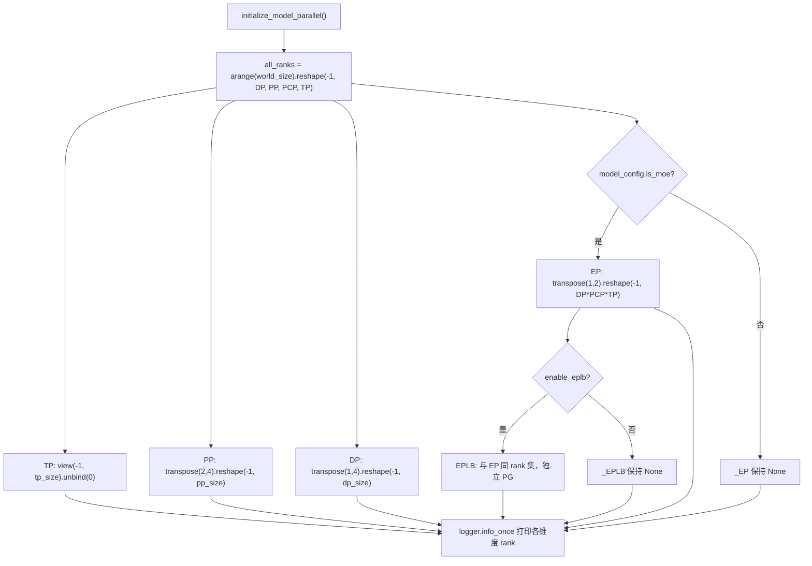
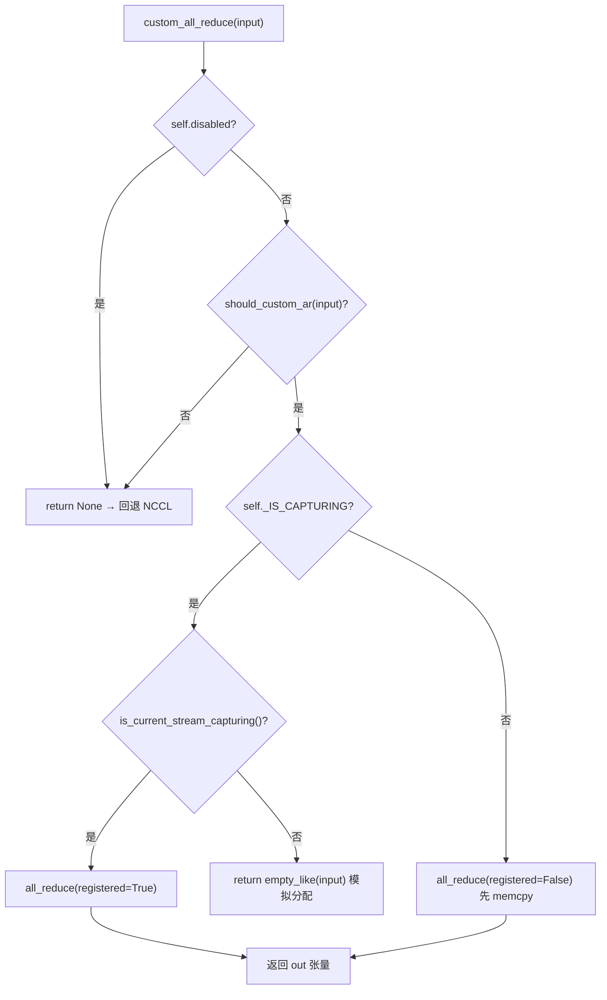

# 第 8 章：分散並列：TP、PP、EPと通信プリミティブ

前章では単一推論ライフサイクルの最後の一マイルを歩み終えた。logitsサンプリングからストリーミング出力まで。しかしモデルが単卡に収まらないほど大きくなると、このパイプラインは複数デバイスに分割して協調実行しなければならない。分散推論の第一の問題は「どうモデルを切るか」ではなく、「切った後、誰が誰と話し、どのように話すか」である。vLLMはこの二つの問題をそれぞれparallel_state.pyのプロセスグループトポロジーとcustom_all_reduce.pyの通信器実装に委ねている。本章は「グループ構築 → 分割 → 通信 → 負荷再均衡」という経路に沿って、TP、PP、EPの並列戦略と低レベル通信プリミティブを層ごとに分解する。

# 8.1 プロセスグループトポロジー：一つのrankグリッドからTP/PP/DP/EPをどう切り出すか

## 直感モデル

8枚のGPUを8席の長テーブルと想像しよう。テンソル並列（Tensor Parallelism、TP）は「同じテーブルの人は同時に杯を挙げなければならない」、パイプライン並列（Pipeline Parallelism、PP）は「隣の席がリレーで料理を運ぶ」、データ並列（Data Parallelism、DP）は「別のテーブルはそれぞれ食べるが最後に照合する」、エキスパート並列（Expert Parallelism、EP）は「トークンを科別にトリアージする」を要求する。統一された席配置がなければ、各モジュールがそれぞれ`new_group`、「TP グループにいると思っていたら、実は DP グループにいた」という通信のズレが生じる——集合通信で rank が1つでも欠けると、NCCL はエラーを出さずにそのままハングする。

## データ構造とメモリレイアウト

`GroupCoordinator`がそのすべての担い手である。そのフィールド設計は「1つのプロセスが複数の並列次元上に持つ多重アイデンティティ」に直接対応している：

- `rank`はグローバル rank、`ranks`は本グループメンバーのグローバル rank リスト、`world_size`はグループサイズ[FACT:vllm/distributed/parallel_state.py:434-436]。
- `local_rank`はデバイスのバインドに使用、`rank_in_group`はグループ内の序番——ソースコードはテーブル1つで両者を正確に区別している：2ノードにまたがる4カードグループで、rank 2 の`local_rank`は 0（ノード1上では最初のカード）、しかし`rank_in_group`は 2[FACT:vllm/distributed/parallel_state.py:437-445]。
- `cpu_group`と`device_group`はペアで存在する：前者は gloo でメタデータ/オブジェクト通信を行い、後者は NCCL でテンソル通信を行う[FACT:vllm/distributed/parallel_state.py:446-447]。

ここに重要な設計がある：**なぜ各グループが CPU グループを1つずつ維持する必要があるのか？**なぜなら`broadcast_object`、`send_object`のような操作が転送するのは Python オブジェクト（シリアライズされたバイト列）であり、NCCL を通すと VRAM を浪費するうえ、現在の CUDA デバイスを汚染する可能性があるからだ。`barrier()`のコメントはこの点を率直に述べている：NCCL の barrier は内部的に broadcast であり、こっそり GPU テンソルを生成し、現在のデバイスを混乱させやすい。だから CPU グループを使わなければならない[FACT:vllm/distributed/parallel_state.py:1355-1362]。

## Step-by-Step：`initialize_model_parallel`グリッドをどう切るか

具体的なシナリオを代入する：8カード、TP=2、PP=4、DP=1。核心は1次元の rank 列を多次元グリッドに reshape し、各次元に沿って分割することである。

第一步、rank グリッドを構築する。レイアウト順序は明示的に`ExternalDP x DP x PP x PCP x TP` [FACT:vllm/distributed/parallel_state.py:2045-2060]：

```python
all_ranks = torch.arange(world_size).reshape(
    -1, data_parallel_size, pipeline_model_parallel_size,
    prefill_context_model_parallel_size, tensor_model_parallel_size,
)
```

第二步、TP グループを切る：グリッドを`(-1, tp_size)`に view してから unbind し、`[g0,g1],[g2,g3],...` [FACT:vllm/distributed/parallel_state.py:2065-2077]を得る。TP グループは追加で`use_message_queue_broadcaster=True`を渡していることに注意。TP グループはメタデータ配布のために共有メモリブロードキャストを必要とするからだ。

第三步、PP グループを切る：`all_ranks.transpose(2, 4)`PP 次元を最後の次元に移動してから切ると、`[g0,g2,g4,g6],[g1,g3,g5,g7]` [FACT:vllm/distributed/parallel_state.py:2175-2188]が得られる。これはまさにドキュメント文字列に示された例である[FACT:vllm/distributed/parallel_state.py:1997-1997]。

第四步、DP グループを切る：`transpose(1, 4)`の後に切る[FACT:vllm/distributed/parallel_state.py:2195-2202]。

第五步、EP グループを切る——ここに見落としやすい細部がある：EP グループは MoE モデルの下でのみ作成され、dense モデルでは直接スキップされる[FACT:vllm/distributed/parallel_state.py:2210-2241]。EP グループの rank 集合は`DP x PCP x TP`の積であり、EP が DP と TP の物理カードを再利用しており、独立した次元ではないことを意味する。



## 設計上の考察と落とし穴

**EPLB はなぜ独立したプロセスグループを必要とするのか？**コメントが答えを与えている：EPLB 通信と MoE フォワードの集合通信を隔離し、「実行期の torch.distributed」と「EPLB の torch.distributed」が互いにデッドロックするのを防ぐ[FACT:vllm/distributed/parallel_state.py:2243-2246]。これは典型的な「独立した通信ドメインで決定性を買う」トレードオフである——PG が1つ増える分の VRAM オーバーヘッドと引き換えに、重みの移動時にフォワードが固まらないことを得る。

**DP グループの同期制約**は本番環境で最もよく踏む落とし穴である：同一 DP グループ内のすべての rank が同時に`generate`を呼び出さなければならない。そうでなければデッドロックする[FACT:vllm/distributed/parallel_state.py:2048-2051]。DP グループ内では勾配/サンプリング結果の all-reduce が行われるため、いずれかの rank が欠けると集合通信が永久にブロックされるからだ。

**破棄順序**にも同様にこだわりがある。`destroy()`まず device communicator を破棄し、次に device_group と cpu_group を破棄する[FACT:vllm/distributed/parallel_state.py:1380-1393]。コメントが理由を説明している：device communicator はこれらの PG に依存する集合通信ワークスペース（FlashInfer PCIe IPC barrier など）を保持している可能性があり、先に解放しなければならない[FACT:vllm/distributed/parallel_state.py:1377-1377]。

# 8.2 通信プリミティブ：カスタム all-reduce がどうやって NCCL を迂回するか

## 直感モデル

NCCL の all-reduce は「汎用トラック」であり、どんな荷物も運べ、どんな道も走れるが、起動オーバーヘッドとプロトコルオーバーヘッドは固定である。8カード NVLink 全相互接続のマシン上で小さなテンソルの all-reduce を繰り返し行う場合（TP の各 attention/MLP 層で毎回行う）、汎用トラックの「通行料」は無視できなくなる。カスタム all-reduce は「専用の小型手押し車」である：同一マシン、NVLink 全相互接続、テンソルサイズが適切なシナリオでのみ有効化され、一度の`cudaMemcpy`で NCCL のハンドシェイクとプロトコルオーバーヘッドを置き換える。

## データ構造とメモリレイアウト

`CustomAllreduce`の初期化は「能力検出 + リソース事前割り当て」の組み合わせである。主要フィールド：

- `_SUPPORTED_WORLD_SIZES = [2, 4, 6, 8, 16]`：これらのグループサイズのみサポート[FACT:vllm/distributed/device_communicators/custom_all_reduce.py:113-129]。
- `meta_ptrs`：メタデータ同期 + 中間結果バッファ、サイズ`ops.meta_size() + max_size` [FACT:vllm/distributed/device_communicators/custom_all_reduce.py:291-294]。
- `buffer_ptrs`：事前登録された IPC バッファ、eager モードでは入力テンソルをまずここにコピーしてから計算する[FACT:vllm/distributed/device_communicators/custom_all_reduce.py:298-305]。
- `rank_data`：8MB の uint8 テンソル、すべての rank の IPC バッファポインタタプルを格納[FACT:vllm/distributed/device_communicators/custom_all_reduce.py:309-315]。

**なぜバッファを事前登録するのか？**CUDA Graph のキャプチャはすべてのアドレスがキャプチャ時に固定されていることを要求するからだ。`register_graph_buffers`キャプチャ終了時に使用したすべてのバッファアドレスをすべての rank にブロードキャストして登録する[FACT:vllm/distributed/device_communicators/custom_all_reduce.py:474-491]。

## Step-by-Step：1回の all-reduce の意思決定フロー

シナリオを代入する：TP グループ内のある層の MLP 出力が all-reduce を必要とし、入力は 4MB の bf16 テンソルである。

第一步、`custom_all_reduce`が無効化されているか、満たしているかをチェックする`should_custom_ar` [FACT:vllm/distributed/device_communicators/custom_all_reduce.py:529-533]。

第二步、`should_custom_ar`一件ずつフィルタリング：world_size > 8 は拒否；dtype は fp32/fp16/bf16 でなければならない；バイト数は 16 の倍数でなければならない；弱連続でなければならない；world_size==2 または全相互接続の場合のみ続行[FACT:vllm/distributed/device_communicators/custom_all_reduce.py:493-508]。

第三步、CUDA Graph キャプチャ中かどうかで分岐：キャプチャ中は`registered=True`（アドレスは既に固定済み）を使用、そうでなければ`registered=False`（先に memcpy で事前登録バッファへコピーする必要がある）[FACT:vllm/distributed/device_communicators/custom_all_reduce.py:529-545]。

第四步、実際に呼び出す`ops.all_reduce`、渡す`buffer_ptrs[rank]`と`max_size` [FACT:vllm/distributed/device_communicators/custom_all_reduce.py:519-527]。



## 設計上の考察と落とし穴

**マルチノードシナリオのフォールバックパス**はこのコードで最も巧妙な部分である。`same_node`が偽のとき、`mnnvl_only`を真に設定[FACT:vllm/distributed/device_communicators/custom_all_reduce.py:198-199]、その後 MNNVL（Multi-Node NVLink）能力をチェックする。グループ内の全カードが MNNVL をサポートしていない場合、カスタム集合通信を直接無効化[FACT:vllm/distributed/device_communicators/custom_all_reduce.py:228-233]。`_group_can_attempt_mnnvl`一度の CPU all-reduce（MIN 操作）で全 rank が同じ制御フローを通ることを保証[FACT:vllm/distributed/device_communicators/custom_all_reduce.py:59-73]——これは異種クラスタで「一部の rank が MNNVL パスに入り、一部が NCCL を通る」ことによるハングを避けるための重要な防御である。

**P2P チェックのコスト**：`_can_p2p`は全 peer を走査して`gpu_p2p_access_check`を行う、コメントには初回計算は高コストだがキャッシュされるとある[FACT:vllm/distributed/device_communicators/custom_all_reduce.py:278-278]。本番環境で起動が遅い場合、`VLLM_SKIP_P2P_CHECK`を設定してスキップし、ドライバの P2P レポートを直接信頼できる[FACT:vllm/distributed/device_communicators/custom_all_reduce.py:86-100]。

**reduce-scatter の三段階バックエンド選択**は個別に見る価値がある：`_select_reduce_scatter_backend`は優先度順に返す`mnnvl_multimem` > `mnnvl_lamport` > `legacy` [FACT:vllm/distributed/device_communicators/custom_all_reduce.py:601-636]。multimem パスは world_size が`(2,4,8)`にあり、かつデバイス能力が (10,0) または (10,3)（Blackwell 級）であることを要求する[FACT:vllm/distributed/device_communicators/custom_all_reduce.py:103-104]。注意`VLLM_BATCH_INVARIANT`は multimem パスを無効化する[FACT:vllm/distributed/device_communicators/custom_all_reduce.py:628]——multimem のリダクション順序は不定であり、バッチ不変性を破壊するため。

# 8.3 EPLB：エキスパート負荷再平衡のスケジューリングロジック

## 直感的モデル

MoE モデルでは、256 個の論理エキスパートが 32 枚のカードに分配され、各カードに 8 個ずつ。しかし実際のトラフィックでは、一部の「人気エキスパート」（例えば一般的な文法構造を処理するもの）に大量の token がルーティングされ、それを保持するカードがボトルネックとなり、他のカードが遊休する。EPLB（Expert Parallel Load Balancer）は「人気エキスパートにレプリカを追加する」：人気エキスパートの重みを空きカードに複製し、token を分流させる。これがなければ、MoE の実効スループットは最も遅いカードに律速される。

## データ構造とメモリレイアウト

`EplbModelState`は三つのマッピングテーブルで「論理エキスパート ↔ 物理エキスパート」の関係を記述する：

- `physical_to_logical_map`：形状`(num_moe_layers, num_physical_experts)`、各物理スロットにそれが担う論理エキスパート id を格納[FACT:vllm/distributed/eplb/eplb_state.py:105-120]。
- `logical_to_physical_map`：形状`(num_moe_layers, num_logical_experts, max_replicas+1)`、疎行列、-1 はマッピングなしを表す[FACT:vllm/distributed/eplb/eplb_state.py:123-146]。
- `logical_replica_count`：各論理エキスパートにいくつのレプリカがあるか[FACT:vllm/distributed/eplb/eplb_state.py:147-161]。

`expert_load_window`はスライディングウィンドウ、形状`(window_size, num_moe_layers, num_physical_experts)` [FACT:vllm/distributed/eplb/eplb_state.py:180-187]。コメントで特に指摘：現在はローカルエキスパートだけでなく全物理エキスパートの負荷を記録し、異なる dispatch 方法（naive all-to-all、DeepEP）で統計が一致するようにしている；naive all-to-all では各 DP rank が同じ token 集合を寄与するため、負荷は dp_size 倍される[FACT:vllm/distributed/eplb/eplb_state.py:180-187]。

## Step-by-Step：一回の再配置の完全な経路

シナリオを代入：`expert_rearrangement_step`が閾値に達し、`rearrange()`。

をトリガー。第一步、物理負荷を論理エキスパートにマッピングし直す。`scatter_add_`を`physical_to_logical_map`で集約、無効スロット（<0）は`invalid_idx`バケットに埋めて最後に破棄[FACT:vllm/distributed/eplb/eplb_state.py:794-816]。

第二步、rank 間 all-reduce でグローバル論理負荷を取得。`_allreduce_list`は複数モデルの負荷を連結して一度 all-reduce してから分割し、複数回の通信を回避[FACT:vllm/distributed/eplb/eplb_state.py:1045-1068]。

第三步、戦略を呼び出して新しいマッピングを計算。`policy.rebalance_experts`は host 上で実行されるため、負荷ウィンドウと現在のマッピングを CPU にコピーし戻す必要がある[FACT:vllm/distributed/eplb/eplb_state.py:859-867]。

第四步、ROCm 特化の「再配置スキップ」判定：新しいマッピングによる rank 負荷不均衡の改善が 5% 未満なら、今回の再配置をスキップ[FACT:vllm/distributed/eplb/eplb_state.py:869-923]。これは実用的な最適化である——再配置自体に通信コストがあり、利益が十分でなければ行わない。

第五步、重みの移動を実行し新しいマッピングをコミット[FACT:vllm/distributed/eplb/eplb_state.py:925-942]。

```mermaid
sequenceDiagram
    participant Main as 主线程 step()
    participant Policy as DefaultEplbPolicy
    participant Comm as EplbCommunicator
    participant Async as async_worker 线程
    Main->>Main: expert_rearrangement_step >= interval
    Main->>Main: scatter_add_ 物理负载→逻辑负载
    Main->>Main: _allreduce_list 跨 rank 聚合
    Main->>Policy: rebalance_experts(load, replicas, groups, nodes, gpus, map)
    Policy-->>Main: new_physical_to_logical_map
    alt 同步模式
        Main->>Comm: rearrange_expert_weights_inplace()
        Comm-->>Main: 权重搬运完成
        Main->>Main: _commit_eplb_maps()
    else 异步模式
        Main->>Main: eplb_stats = EplbStats(...); rebalanced = True
        Main->>Async: rearrange_event.record()
        Async->>Comm: 后台搬运权重到 expert_buffer
        Async-->>Main: pending_result 就绪
        Main->>Main: _move_to_workspace() 提交
    end
```

## 設計上の考察と落とし穴

**非同期モードの同期プリミティブ**はこのコードで最も微妙な部分である。`rebalanced`フラグは GIL に依存してメインスレッドと async worker 間で同期される[FACT:vllm/distributed/eplb/eplb_state.py:194-203]。しかしコメントは警告する：`rebalanced`は全 rank で一致していなければならない、そうでなければ`_all_ranks_result_ready`内の all-reduce がハングする[FACT:vllm/distributed/eplb/eplb_state.py:664-665]。`_all_ranks_result_ready`all-reduce には CPU グループを優先して使う、CPU グループの方が信頼性が高いため[FACT:vllm/distributed/eplb/eplb_state.py:1024-1043]。

**スライディングウィンドウの「事前録画」最適化**：`_should_record_current_step`は次回再配置まで`window_size`ステップ以内のときのみ録画を開始する[FACT:vllm/distributed/eplb/eplb_state.py:689-709]。コメントの説明：各再配置周期の前`step_interval - window_size`ステップのデータはスライディングウィンドウに上書きされるため、録画しても無駄で GPU 計算を浪費する[FACT:vllm/distributed/eplb/eplb_state.py:1196-1199]。`should_record_tensor`は全層で共有される同一のスカラーテンソルであり、一度の`fill_`で全層を更新[FACT:vllm/distributed/eplb/eplb_state.py:272-278]。

**エラスティック EP の容量予約**：`enable_elastic_ep`時、`physical_expert_capacity`は`elastic_ep_max_dp_size`に従って予約し、マッピングテーブルは余分なスロットを -1 で埋める[FACT:vllm/distributed/eplb/eplb_state.py:375-386]。これによりスケールアウト時に VRAM を再割り当てする必要がなく、-1 スロットに実エキスパートを埋めるだけでよい。`reconfigure_physical_expert_slots`はスケールアウト/スケールイン時にビューを更新する責務を負う[FACT:vllm/distributed/eplb/eplb_state.py:1135-1160]。

**`_commit_eplb_maps`の pin memory 処理**：`PIN_MEMORY`が有効かつソースが CPU のとき、まず pinned メモリにコピーしてから`non_blocking=True`非同期で GPU にコピー[FACT:vllm/distributed/eplb/eplb_state.py:1392-1400]。これは H2D コピーがメインスレッドをブロックするのを避けるため——マッピングテーブルは毎層毎ラウンド更新され、同期コピーはボトルネックになる。

# 設計上の考察

3つのコードは1つの設計哲学を共有している：**能力検出で確実なフォールバックを得る**。`GroupCoordinator``world_size == 1`時には全ての集合通信を直接バイパスする[FACT:vllm/distributed/parallel_state.py:736-738]；`CustomAllreduce`いずれかの条件が満たされない場合は`None`呼び出し元がNCCLにフォールバックできるようにする[FACT:vllm/distributed/device_communicators/custom_all_reduce.py:532-533]EPLBは改善が5%未満の場合は再配置をスキップする[FACT:vllm/distributed/eplb/eplb_state.py:916]この「高速失敗＋優雅なフォールバック」パターンにより、同じコードがシングルGPUからマルチノードMNNVLまでの全スペクトラムのハードウェアで動作し、構成ごとに分岐を書く必要がない。

もう一つの共通点は**制御フローの一貫性が性能より優先される**。`_group_can_attempt_mnnvl`CPU all-reduceで全てのrankを同じ分岐に強制する[FACT:vllm/distributed/device_communicators/custom_all_reduce.py:59-73]，`_all_ranks_result_ready`同様に[FACT:vllm/distributed/eplb/eplb_state.py:1024-1043]分散システムでは、「一部のrankが高速パスを通り、一部が低速パスを通る」ことは「全てのrankが低速パスを通る」ことよりもはるかに危険である——前者はハングし、後者は単に遅いだけである。

# 本章のまとめ

- `GroupCoordinator`1次元のrank列を`ExternalDP x DP x PP x PCP x TP`グリッドにreshapeし、各次元に沿ってTP/PP/DP/EP/EPLBプロセスグループを分割する。各グループはCPU（gloo）とdevice（NCCL）の2つのPGを同時に維持する。
- `CustomAllreduce`能力検出（同一マシン、NVLink全相互接続、テンソルサイズ、dtype、16バイトアライメント）によりall-reduceを引き継ぐかどうかを決定し、マルチノードシナリオではMNNVLまたはNCCLにフォールバックする。
- EPLBは3つのマッピングテーブルで論理/物理エキスパート関係を記述し、スライディングウィンドウで負荷を統計し、戦略で新しいマッピングを計算し、コミュニケータで重みを転送し、同期と非同期の2つのモードをサポートする。
- 3者の共通設計原則：能力検出＋確実なフォールバック＋制御フローの一貫性優先。

# 本章の考察とセルフチェック

Q1: `GroupCoordinator.destroy()`先にdevice communicatorを破棄してからprocess groupを破棄する[FACT:vllm/distributed/parallel_state.py:1380-1393]もし順序を逆にして、先にPGを破棄してからcommunicatorを破棄した場合、どのようなシナリオでクラッシュするか？

**参考解析**コメントは、device communicatorがこれらのPGに依存する集合通信ワークスペース（例えばFlashInfer PCIe IPC barrier）を保持している可能性があることを明確に指摘している[FACT:vllm/distributed/parallel_state.py:1377-1377]もし先にPGを破棄すると、communicatorの`destroy()`内部でこれらのPGを使ってbarrierやクリーンアップ通信を行う必要がある場合、既に破棄されたProcessGroupにアクセスし、use-after-freeやNCCL内部アサーション失敗を引き起こす。正しい順序は「依存者が先に死ぬ」：communicatorはPGに依存するので、communicatorが先に破棄される。

Q2: `should_custom_ar``inp_size % 16 == 0` [FACT:vllm/distributed/device_communicators/custom_all_reduce.py:493-508]もしこのチェックを外すと、15バイトのbf16テンソル（例えば7.5要素、実際には不可能だが、8要素＝16バイトの境界ケースと仮定）はどうなるか？なぜカスタムkernelにこのアライメントが必要なのか？

**参考解析**カスタムall-reduce kernelは内部的にベクトル化ロード（例えば128-bit load）を使用し、アドレスとサイズが16バイトアライメントであることを要求する`float4`のようなワイドロード命令を使用するためである。アライメントが合わないと、kernelが範囲外読み取りを行ったり、misaligned address例外を引き起こす。さらに隠蔽的なのは、`buffer_ptrs`事前登録バッファが`max_size`で割り当てられ、入力サイズが16の倍数でない場合、バッファにコピーした後に末尾に残留データが一緒にリダクションされ、サイレントエラーが発生する可能性がある。したがってこのチェックは正確性の保護であると同時に性能の前提でもある。

Q3: EPLB非同期モードでは、`rebalanced`フラグはGIL同期に依存する[FACT:vllm/distributed/eplb/eplb_state.py:194-203]またコメントは、全てのrankが一致していなければall-reduceがハングすると警告している[FACT:vllm/distributed/eplb/eplb_state.py:664-665]仮にネットワークジッターにより、あるrankのasync workerが早まって`rebalanced`をFalseに設定し、他のrankはまだTrueの場合、`_all_ranks_result_ready`何が起こるか？

**参考解析**：`_all_ranks_result_ready``has_result`に対してall-reduceの合計を計算し、グループサイズと等しいかどうかを判定する[FACT:vllm/distributed/eplb/eplb_state.py:1030-1032]もしあるrankの`rebalanced`が早まってFalseになると、その`pending_result`は既に消費されている可能性があり、`has_result`が0になり、合計結果がグループサイズより小さくなり、他のrankは待ち続ける。さらに悪いことに、このrankが既に`while ms.rebalanced`ループを抜けている場合、以降のall-reduceに参加せず、他のrankのall-reduceは永久にブロックされる——これがコメントの言う「hang at collective communication calls」である。防御手段は`_all_ranks_result_ready`をdeviceグループではなくCPUグループで使用し、`drain_async`再配置前に全てのpending resultを明示的にドレインすることである[FACT:vllm/distributed/eplb/eplb_state.py:985-1022]。

ここまでで、カード間通信のグループ構築、分割、負荷再分散の仕組みを整理した。しかし分散推論の通信課題は単一インスタンス内部にとどまらない——prefill と decode が異なるインスタンスに分離されると、KV Cache はノードを跨いで転送される必要がある。次章では「カード間通信」を離れ、「インスタンス間通信」へと進む：KV Cache が分離デプロイされた prefill と decode インスタンス間でどのように転送されるのか、KV Connector 抽象が NIXL、Mooncake などの転送バックエンドをどのように統一するのかを見ていく。
