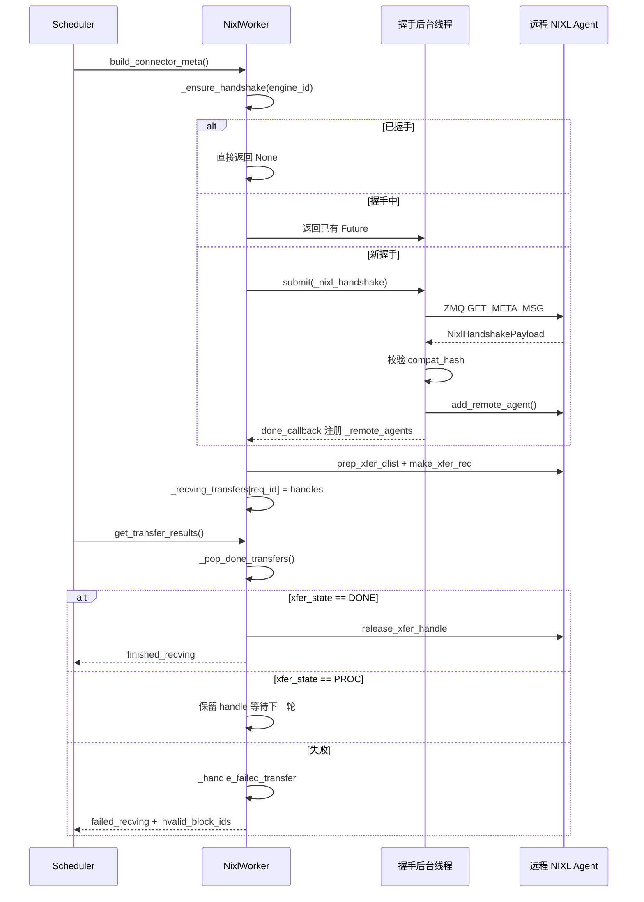

# 第 9 章：KV Cache 転送と分離デプロイ（PD 分離）

前章では、視点を単一の推論インスタンス内部に固定した：TP/PP/DP/EP プロセスグループがどのように構築され、テンソルがカード間でどのように分割され、EPLB が MoE 層でどのようにエキスパート再分散を行うか。しかしこれらの仕組みはすべて同じ前提の上に成り立っている——prefill と decode が同一インスタンスで動作し、KV Cache が最初から最後までローカル VRAM に存在するという前提だ。分離デプロイ（Prefill-Decode Disaggregation、略称 PD 分離）はこの前提を打ち破る。prefill と decode を二つの独立した vLLM インスタンスに分割する：prefill インスタンスはプロンプトの順伝播計算のみを行い、KV Cache を生成して decode インスタンスに渡す。decode インスタンスはその KV Cache を受け取り、自己回帰生成を続ける。この利点は、リソースを段階特性に応じて独立に構成できることだ——prefill は計算集約型で、大 TP・大バッチに適する。decode はメモリアクセス集約型で、小バッチ・低遅延スケジューリングに適する。両者が互いに足を引っ張り合うことがなくなる。代償は：KV Cache がインスタンスを跨いで転送されなければならないことだ。これが本章の主役——KV Connector である。vllm/distributed/kv_transfer/kv_connector/v1/base.py のファイルヘッダコメントには、この抽象全体の核心的原語がすでに列挙されている：Scheduler 側はメタデータのバインド、リモートキャッシュヒットの照会、ブロックを非同期解放するかどうかの決定を担当する。Worker 側は実際の KV ロードと保存を担当する。このインターフェース設計の目標は、上位のスケジューリングロジックと下位の転送バックエンド（NIXL、Mooncake、MoRIIO）を完全に分離することだ。エンジニアリングの観点から見ると、PD 分離の最大のリスクは転送速度の遅さではなく、状態の不整合である：prefill インスタンスは KV を送信済みと認識しているが、decode インスタンスは受信していない。あるいは decode インスタンスが先にブロックを解放したのに、prefill がまだ書き込んでいる。本章で明らかにするのは、まさにこのコネクタ体系がハンドシェイクプロトコル、リース（lease）、ハートビート、障害回復機構を用いてこれらの境界をどのように支えるかである。

# 一、KVConnectorBase_V1：二重ロール抽象とメタデータ契約

## 直感的モデル

KV Connector は二つの支店間の宅配システムのようなものだ。Prefill 店は半製品（KV Cache）を計算し、梱包して Decode 店に送り、加工を続けてもらう。しかし宅配システムは「発送」という一つの動作だけでは成り立たない——何をどこへ送るかを示す送り状（metadata）が必要であり、相手が受け取ったことを確認する受領確認の仕組みが必要であり、荷物が永遠に路上で棚を占領し続けるのを防ぐタイムアウト規則も必要だ。

もしこの抽象がなければ、各転送バックエンド（NIXL、Mooncake）が自前でスケジューリングロジックを実装しなければならず、vLLM の Scheduler はバックエンドごとに适配コードを書く必要があった。KVConnectorBase_V1 の価値は、この契約を固定化することにある。

## 二重ロール：Scheduler 側と Worker 側

[FACT:vllm/distributed/kv_transfer/kv_connector/v1/base.py:137-142]コネクタの二つのロールを定義している：

```python
class KVConnectorRole(enum.Enum):
    # Connector running in the scheduler process
    SCHEDULER = 0
    # Connector running in the worker process
    WORKER = 1
```

この区分は恣意的ではない。Scheduler プロセスはグローバルなスケジューリング決定を担当する——どのリクエストが転送を必要とし、いつブロックを解放できるか。Worker プロセスは実際のデータ搬送を担当する。両者は`KVConnectorMetadata`で通信する。

[FACT:vllm/distributed/kv_transfer/kv_connector/v1/base.py:153-158]Scheduler から Worker 方向のメタデータ基底クラスを定義している：

```python
class KVConnectorMetadata(ABC):  # noqa: B024
    """Abstract Metadata used to communicate
    Scheduler KVConnector -> Worker KVConnector.
    """
    pass
```

逆方向の Worker から Scheduler 方向では、[FACT:vllm/distributed/kv_transfer/kv_connector/v1/base.py:161-176]が`KVConnectorWorkerMetadata`を定義しており、実装に`aggregate`メソッドを要求する——一つの engine step で複数の worker がそれぞれメタデータを返す可能性があるため、集約してから Scheduler に渡す必要があるからだ。

## 核心データ構造：KVConnectorTransferResults

[FACT:vllm/distributed/kv_transfer/kv_connector/v1/base.py:87-96]転送結果のスナップショット構造を定義している：

```python
@dataclass
class KVConnectorTransferResults:
    finished_sending: set[str] = field(default_factory=set)
    finished_recving: set[str] = field(default_factory=set)
    failed_recving: set[str] = field(default_factory=set)
```

コメント内の重要な設計に注意：**失敗した受信も`finished_recving`に現れる**。これは Scheduler がリクエストを「転送待ち」状態から解放できるようにするためである——たとえ転送が失敗しても、リクエストが永遠にスタックしてはいけない。失敗情報は`failed_recving`を通じて別途伝達され、Scheduler はそれに基づいてリトライするかデグレードするかを決定する。

## ライフサイクルフック：リクエストから解放まで

コネクタ全体のライフサイクルは、いくつかの重要なフックを中心に展開する。Scheduler 側：

- `get_num_new_matched_tokens` [FACT:vllm/distributed/kv_transfer/kv_connector/v1/base.py:485-518]：リモートキャッシュがヒットできるトークン数を照会する。コメントでは特に「実際に利用可能な最大プレフィックスのみを考慮すべき」と強調されている。接続問題やエビクションにより一部のトークンが取得できない場合、それはカウントに含めてはならない。
- `update_state_after_alloc` [FACT:vllm/distributed/kv_transfer/kv_connector/v1/base.py:520-544]：block 割り当て後に状態を更新する。コメントには陥りやすい罠がある——ロードすべきかどうかの判断は`num_external_tokens`を見るべきであり、`blocks`が空かどうかではない。なぜなら MultiConnector の非選択サブコネクタも実際の block を受け取るからである。
- `request_finished` [FACT:vllm/distributed/kv_transfer/kv_connector/v1/base.py:579-598]：リクエスト完了時に呼び出され、`True`を返すとコネクタが block の非同期解放責任を引き受けることを示す。

Worker 側：

- `start_load_kv` / `wait_for_layer_load`：レイヤーごとにロードし、パイプラインをサポートする。
- `save_kv_layer` / `wait_for_save`：レイヤーごとに保存する。
- `get_transfer_results` [FACT:vllm/distributed/kv_transfer/kv_connector/v1/base.py:396-397]：非同期転送の完了状況を返す。

[FACT:vllm/distributed/kv_transfer/kv_connector/v1/base.py:192-201]もう一つ、見落とされがちだが非常に重要な設計——`requires_kv_delivery`属性：

```python
@property
def requires_kv_delivery(self) -> bool:
    """Whether this connector hands off KV that must be reliably delivered.
    ...
    """
    return self._kv_transfer_config.is_kv_producer
```

コメントは動機を説明している：KV ハンドオーバーがまだ完了していないうちにリクエストがプリエンプトされた場合、完了させてすでにプリエンプトにより解放された block をハンドオーバーするのではなく、再計算すべきである。信頼性のある配信が必要なのは producer ロールのみであり、best-effort キャッシュが失われても将来の cache miss が一度増えるだけである。

## ハンドシェイクメタデータ

[FACT:vllm/distributed/kv_transfer/kv_connector/v1/base.py:145-150]はハンドシェイクメタデータの基底クラスを定義する：

```python
class KVConnectorHandshakeMetadata(ABC):  # noqa: B024
    """Metadata used for out of band connector handshake between
    P/D workers. This needs to serializable.
    """
    pass
```

「out of band」とは、ハンドシェイクが通常のリクエストパスを通らず、P/D worker 間で直接通信することを意味する。これは NIXL の ZMQ ハンドシェイクプロトコルの伏線となっている。

---

# 二、NIXL コネクタ：ハンドシェイク、登録、ディスクリプタ構築

## 直感的モデル

NIXL（NVIDIA Inference Xfer Library）は NVIDIA が提供する低レベル転送ライブラリであり、UCX、GDS など複数のバックエンドをサポートする。NixlBaseConnectorWorker の役割は、宅配会社の仕分けセンターのようなものである——まず相手の仕分けセンターと専用線を確立し（ハンドシェイク）、自分の棚のレイアウトを登録し（KV Cache メモリ領域の登録）、それから初めてアドレスに従って効率的に荷物を出し入れできる。

もしこの仕組みがなければ、転送のたびにアドレスを再ネゴシエートし、接続を再確立する必要があり、レイテンシは受け入れられないほど高くなる。

## メモリレイアウト：Region と Descriptor

NIXL の核心概念は**region**（メモリ領域）と**descriptor**（ディスクリプタ）である。各 KV Cache レイヤーは NIXL において 1 つ以上の region として登録され、各 region はベースアドレス、ブロック長、ブロックストライドを持つ。

[FACT:vllm/distributed/kv_transfer/kv_connector/v1/nixl/base_worker.py:740-751]は region 関連の核心フィールドを列挙している：

```python
# Number of NIXL regions. Currently one region per cache
# (so 1 per layer for MLA, otherwise 2 per layer)
self.num_regions = 0
self.region_mem_types: list[str] = []
self.region_group_ids: list[int] = []
self._uses_region_group_mapping = False
self.region_names: list[str] = []
self.region_num_blocks: list[int] = []
self._mixed_mem_types = False
```

[FACT:vllm/distributed/kv_transfer/kv_connector/v1/nixl/base_worker.py:897-900]はブロックストライドの由来をさらに説明している：

```python
# Per-region block stride in bytes. Taken from the registered tensor's
# stride(0) so it stays correct under layouts that interleave layers
# within a block (BLHNC/BHLNC), where stride > block_len.
self.block_stride_per_layer = list[int]()
```

ここでの重要な洞察は：**block_stride は block_len と等しくない**。BLHNC/BHLNC のようなレイヤー間インターリーブレイアウトでは、1 つの block の実際のスパンはその有効データ長より大きくなる可能性がある。もし直接 block_len をストライドとして使うと、誤ったアドレスを読むことになる。

## ハンドシェイクプロトコル：ZMQ + 互換性ハッシュ

ハンドシェイクは NIXL コネクタで最も複雑な部分である。[FACT:vllm/distributed/kv_transfer/kv_connector/v1/nixl/base_worker.py:974-1128]の`_nixl_handshake`メソッドがこのプロセスを完全に示している。

最初のステップは CUDA デバイスコンテキストの設定である。[FACT:vllm/distributed/kv_transfer/kv_connector/v1/nixl/base_worker.py:988-998]のコメントがその理由を説明している：

```python
# the first time we connect to a remote agent.
# be careful, the handshake happens in a background thread.
# it does not have an active cuda context until any cuda runtime
# call is made. when UCX fails to find a valid cuda context, it will
# disable any cuda ipc communication, essentially disabling any NVLink
# communication.
if not self.use_host_buffer:
    current_platform.set_device(self.device_id)
```

これは非常に隠れた罠である：ハンドシェイクはバックグラウンドスレッドで実行されるため、デバイスを明示的に設定しないと、UCX は有効な CUDA コンテキストを見つけられず、NVLink 通信をサイレントに無効化し、低速パスに退化する。

第二のステップは ZMQ によるメタデータクエリの送信である。[FACT:vllm/distributed/kv_transfer/kv_connector/v1/nixl/base_worker.py:1029-1036]：

```python
msg = msgspec.msgpack.encode(
    (GET_META_MSG, remote_pp_rank, remote_rank)
)
# Set receive timeout to 5 seconds to avoid hanging on dead server
sock.setsockopt(zmq.RCVTIMEO, 5000)  # milliseconds
start_time = time.perf_counter()
sock.send(msg)
reply_parts = sock.recv_multipart()
```

5 秒のタイムアウトは、相手が死んだ後に無限に待機するのを防ぐためである。同時に、コードは RTT を用いてクロックオフセット[FACT:vllm/distributed/kv_transfer/kv_connector/v1/nixl/base_worker.py:1042-1045]を推定し、最小 RTT サンプルを保持する——高い RTT は単なるノイズであり、中点推定を歪めるからである。

第三のステップは互換性検証である。[FACT:vllm/distributed/kv_transfer/kv_connector/v1/nixl/base_worker.py:1063-1080]：

```python
assert self.compat_hash is not None
if (
    self.enforce_compat_hash
    and handshake_payload.compatibility_hash != self.compat_hash
):
    raise RuntimeError(
        f"NIXL compatibility hash mismatch. "
        ...
    )
```

互換性ハッシュは[FACT:vllm/distributed/kv_transfer/kv_connector/v1/nixl/base_worker.py:1372-1376]で計算される：

```python
self.compat_hash = compute_nixl_compatibility_hash(
    self.vllm_config,
    self.backend_name,
    transfer_mode=self._TRANSFER_MODE,
)
```

注意：`transfer_mode`もハッシュに参加する——[FACT:vllm/distributed/kv_transfer/kv_connector/v1/nixl/base_worker.py:163-166]のコメントが説明している：push（WRITE）コネクタと pull（READ）コネクタは決してハンドシェイクに成功してはならない。

## 非同期ハンドシェイクスケジューリング

ハンドシェイクは非同期であり、スレッドプールを通じて実行される。[FACT:vllm/distributed/kv_transfer/kv_connector/v1/nixl/base_worker.py:824-835]：

```python
self._handshake_initiation_executor = ThreadPoolExecutor(
    # NIXL is not guaranteed to be thread-safe, limit 1 worker.
    max_workers=1,
    thread_name_prefix="vllm-nixl-handshake-initiator",
)
self._ready_requests = queue.Queue[tuple[ReqId, ReqMeta]]()
self._handshake_futures: dict[
    EngineId, Future[tuple[dict[tuple[int, int], str], float]]
] = {}
# Protects _handshake_futures and _remote_agents.
self._handshake_lock = threading.RLock()
```

`max_workers=1`は NIXL がスレッドセーフを保証しないためである。`_handshake_lock`は`_handshake_futures`と`_remote_agents`の 2 つの辞書を保護する。

`_ensure_handshake` [FACT:vllm/distributed/kv_transfer/kv_connector/v1/nixl/base_worker.py:1257-1317]は冪等なハンドシェイク開始を実装している：すでにハンドシェイク成功なら直接 None を返す；ハンドシェイク中なら既存の Future を返す；そうでなければ新しいタスクを投入しコールバックを登録する。

## ディスクリプタ構築：block ID から NIXL descriptor へ

ハンドシェイク完了後、各リクエストのためにディスクリプタを構築する必要がある。[FACT:vllm/distributed/kv_transfer/kv_connector/v1/nixl/base_worker.py:172-310]の`_compute_desc_ids`が核心である。

純粋な attention モデル（SSM なし）の場合、高速パス[FACT:vllm/distributed/kv_transfer/kv_connector/v1/nixl/base_worker.py:226-262]を通る。コメントが HMA シナリオでの処理を説明している：

```python
# NOTE (NickLucche) With HMA, every kv group has the same number of layers
# and layers from different groups share the same kv tensor.
# eg block_ids=[[1, 2], [3]]->blocks [1, 2] need to be
# read across all regions, same for [3], but group0-group1 blocks will
# always differ (different areas). Therefore we can just flatten the
# block_ids and compute the descs ids for all groups at once.
```

ハイブリッド SSM モデルの場合、ディスクリプタレイアウトはより複雑になる[FACT:vllm/distributed/kv_transfer/kv_connector/v1/nixl/base_worker.py:285-304]：

```python
elif _is_ssm_spec(spec_type):
    # NOTE (NickLucche) SSM and Attention block regions can
    # be exchanged arbitrarily by manager.  Therefore, descs
    # are laid out as:
    #   [descs_fa (all regions) | descs_ssm (all regions)].
    # num_fa_descs offset must be computed per-engine since
    # P and D can have different num_blocks (and thus
    # different FA desc counts).
```

## 転送トポロジーと TP マッピング

異種 TP は NIXL コネクタで最も複雑なシナリオである。[FACT:vllm/distributed/kv_transfer/kv_connector/v1/nixl/base_worker.py:2130-2178]の`add_remote_agent`ドキュメントが各種ケースを詳細に説明している：

D.world_size > P.world_size の場合、複数の D worker が同じ P worker から異なる KV head シャードを読み取ります。ドキュメントには具体的な例が示されています：D TP=4、P TP=2、tp_ratio=2。D-Worker0 は P-Worker0 の前半部分の KV head を読み取り、D-Worker1 は後半部分を読み取ります。

MLA モデルの場合、KV Cache は TP worker 間で複製されるため、rank_offset は常に 0 です。

## リースとハートビート：block の早期解放を防ぐ

これは NIXL コネクタで最も巧妙な設計の一つです。Prefill インスタンスは KV を送信した後、すぐに block を解放できません——decode インスタンスがまだ読み取っている可能性があるからです。しかし、永遠に解放しないと、VRAM がリークします。

解決策はリース（lease）です。[FACT:vllm/distributed/kv_transfer/kv_connector/v1/nixl/base_worker.py:528-528]：

```python
kv_lease_duration: int = vllm_config.kv_transfer_config.get_from_extra_config(
    "kv_lease_duration", 30
)
# NOTE (NickLucche): For now we use a hardcoded value for a simpler interface.
self._lease_extension = kv_lease_duration * 2 // 3
```

デフォルトのリースは 30 秒で、ハートビートごとに 20 秒（2/3）延長されます。

ハートビート処理は[FACT:vllm/distributed/kv_transfer/kv_connector/v1/nixl/base_worker.py:3014-3034]：

```python
def _handle_heartbeat(self, payload: str) -> None:
    new_expiry = time.perf_counter() + self._lease_extension
    for req_id in payload.split(","):
        if req_id in self._reqs_to_send:
            old = self._reqs_to_send[req_id]
            self._reqs_to_send[req_id] = max(old, new_expiry)
```

注意`max(old, new_expiry)`——ハートビートはリースを延長することしかできず、短縮することはできません。

リース期限切れ後の回収は[FACT:vllm/distributed/kv_transfer/kv_connector/v1/nixl/base_worker.py:2986-3012]：

```python
def _reap_expired_send_leases(self, done_sending: set[str]) -> None:
    """Reclaim expired send-side KV leases into ``done_sending``.

    ``_reqs_to_send`` is not ordered by expiry: heartbeats update the
    deadline in place, and mixed TTLs share the map, so a live head
    entry can sit in front of already-expired ones. Scan every entry
    rather than stopping at the first still-live request.
    """
```

コメントは犯しやすい間違いを指摘しています：最初の期限切れでないリクエストに遭遇したからといってスキャンを停止してはいけません。ハートビートがその場で有効期限を更新するため、map は有効期限でソートされていないからです。

## 転送ステートマシンと障害復旧

転送のライフサイクルは`_pop_done_transfers` [FACT:vllm/distributed/kv_transfer/kv_connector/v1/nixl/base_worker.py:3036-3086]で管理されます：

```python
for handle in handles:
    try:
        xfer_state = self.nixl_wrapper.check_xfer_state(handle)
        if xfer_state == "DONE":
            res = self.nixl_wrapper.get_xfer_telemetry(handle)
            self.xfer_stats.record_transfer(res)
            self.nixl_wrapper.release_xfer_handle(handle)
        elif xfer_state == "PROC":
            in_progress.append(handle)
        else:
            self._log_failure(
                failure_type="transfer_failed",
                req_id=req_id,
                xfer_state=xfer_state,
            )
```

NIXL 転送には 3 つの状態があります：`DONE`（完了）、`PROC`（進行中）、その他（失敗）。

失敗処理は[FACT:vllm/distributed/kv_transfer/kv_connector/v1/nixl/base_worker.py:3103-3127]：

```python
def _handle_failed_transfer(
    self,
    req_id: str,
    handle: int | None,
    failed_req_ids: set[str] | None = None,
    record_failed_transfer: bool = True,
) -> bool:
    if record_failed_transfer:
        self.xfer_stats.record_failed_transfer()
    if failed_req_ids is not None:
        failed_req_ids.add(req_id)
    return handle is None or self._try_release_xfer_handle(req_id, handle)
```

`_try_release_xfer_handle` [FACT:vllm/distributed/kv_transfer/kv_connector/v1/nixl/base_worker.py:3088-3101]のコメントが非常に重要です：

```python
except Exception as e:
    # A status error does not guarantee that the backend stopped DMA.
    self._log_failure(
        failure_type="transfer_release_failed",
        msg="Retaining handle and blocks until release succeeds",
        ...
    )
    return False
```

**状態エラーはバックエンドが DMA を停止したことを保証しません**。解放が失敗した場合、解放が成功するまで handle と block を保持しなければなりません。これは典型的な「リークしても誤って使うよりマシ」という設計です。

## 失敗したリクエストの block 処理

受信が失敗した場合、[FACT:vllm/distributed/kv_transfer/kv_connector/v1/nixl/base_worker.py:2876-2891]が処理ロジックを示しています：

```python
for req_id in done_recving:
    meta = self._recving_metadata.pop(req_id, None)
    assert meta is not None, f"{req_id} not found in recving_metadata list"

    # Skip KV sync and post-processing for failed requests
    if req_id in failed_recv_reqs:
        self._pending_recv_notifs.pop(req_id, None)
        # TODO (NickLucche) handle failed transfer for HMA.
        if not self._is_hma_required:
            self._invalid_block_ids.put(set(meta.local_block_ids[0]))
        logger.warning(
            "Skipping KV post-processing for failed request %s",
            req_id,
        )
        continue
```

失敗した block ID は`_invalid_block_ids`キューに入れられ、Scheduler は`get_block_ids_with_load_errors` [FACT:vllm/distributed/kv_transfer/kv_connector/v1/nixl/base_worker.py:3491-3504]を通じて取り出し、リトライするかどうかを決定します。

## リモートエンジンの TTL エビクション

長時間実行されるインスタンスは絶えず新しいリモートエンジンに遭遇し、クリーンアップしないとメモリが無限に増加します。[FACT:vllm/distributed/kv_transfer/kv_connector/v1/nixl/base_worker.py:3506-3532]の`_evict_stale_engines`は TTL エビクションを実装しています：

```python
def _evict_stale_engines(self) -> None:
    """Scan for and evict remote engines that have exceeded their TTL.

    Called from the main thread in when a new remote engine appears.
    We can only go OOM as we discover and register a new remote, therefore we make
    sure we clean up stale engine data structures before then.
    """
    if self._engine_ttl  self._engine_ttl and eid not in busy:
            self._cleanup_remote_engine(eid)
```

重要な制約は`busy`セットです——進行中の転送があるエンジンはエビクトできません。[FACT:vllm/distributed/kv_transfer/kv_connector/v1/nixl/base_worker.py:3534-3546]のコメントが理由を説明しています：

```python
"""Remote engines a transfer is still reading from.

The timestamp is stamped when a read is issued and not refreshed while
it runs, so a transfer that outlives the TTL leaves its engine looking
idle. A peer that has lost its NIC holds one indefinitely.
"""
```

相手の NIC が壊れている場合、転送が永遠にハングし、タイムスタンプが更新されず、エンジンはアイドルに見えます。`busy`セットはこの状況を明示的に保護します。

## ハンドシェイクと転送のタイミング

以下のシーケンス図は、リクエストから転送完了までの核心的なインタラクションを示しています：



---

# 三、設計思考：なぜこのように設計するのか

## なぜハンドシェイクを非同期にするのか？

ハンドシェイクはネットワーク往復を伴い、数十ミリ秒かかる可能性があります。同期的に実行すると、Scheduler のメインループをブロックし、すべてのリクエストのスケジューリングに影響します。非同期ハンドシェイクにより、Scheduler は他のリクエストを先に処理でき、ハンドシェイク完了後にコールバックで通知されます。

しかし非同期は複雑さももたらします：`_handshake_futures`辞書はロックで保護する必要があり、コールバックでは成功と失敗の両方のケースを処理し、重複ハンドシェイクも防がなければなりません。

## なぜリースを使い、参照カウントを使わないのか？

参照カウントでは、decode インスタンスが prefill に「読み終わった」と明示的に通知する必要があります。しかし decode インスタンスがクラッシュすると、通知は永遠に届かず、prefill の block は永遠にリークします。

リースはより堅牢なソリューションです：decode がクラッシュしても、リース期限切れ後に prefill が自動的に回収します。ハートビート機構は通常時のリース更新を保証します。

## なぜ失敗時に handle を保持するのか？

[FACT:vllm/distributed/kv_transfer/kv_connector/v1/nixl/base_worker.py:3088-3101]のコメントが明確に述べています：状態エラーは DMA の停止を保証しません。この時 handle を解放すると、DMA が解放済みメモリにまだ書き込んでいる可能性があり、データ破損やクラッシュを引き起こします。一時的にリークしても、このリスクを冒してはいけません。

## なぜ TTL エビクションで busy をチェックするのか？

[FACT:vllm/distributed/kv_transfer/kv_connector/v1/nixl/base_worker.py:3534-3546]のコメントは隠れたバグシナリオを明らかにしています：タイムスタンプは読み取り開始時に付けられ、読み取り中は更新されません。転送時間が TTL を超えると、エンジンはアイドルに見えますが、実際にはまだ読み取られています。この時エビクトすると、進行中の転送が失敗します。

## 本番環境の落とし穴

1. **CUDA コンテキストの問題**：ハンドシェイクはバックグラウンドスレッドで実行されるため、明示的に`set_device`する必要があります。そうしないと UCX が NVLink をサイレントに無効化します。

2. **互換性ハッシュの不一致**：P/D インスタンスの vLLM バージョン、モデル、dtype、KV layout、attention backend は完全に一致している必要があります。不一致の場合ハンドシェイクが失敗し、エラーメッセージはチェックを無効化する方法を提示します（ただし推奨されません）。

3. **リース期限切れ**：decode インスタンスの負荷が高い場合、ハートビートが遅延し、リースが期限切れになる可能性があります。ログに「Releasing expired KV blocks」警告が表示されます。`kv_lease_duration`。

4. **TP の不一致**：異種 TP には block-contiguous レイアウト（例：LBHNC）が必要です。非連続レイアウトを使用すると、異種 TP は失敗します。

5. **NIXL UAR 枯渇**：[FACT:vllm/distributed/kv_transfer/kv_connector/v1/nixl/base_worker.py:631-636]のコメント警告：各 UCX スレッドは DevX を介して UAR（doorbell pages）を割り当て、過剰な NIXL UAR 使用は NIC UAR 空間を枯渇させ、NVSHMEM（DeepEP カーネルが使用）の RDMA 初期化時の失敗を引き起こす。

---

# 本章のまとめ

本章では KV Connector 体系の核心メカニズムを深く掘り下げた：

1. **KVConnectorBase_V1**Scheduler 側と Worker 側の二重ロール抽象を定義し、`KVConnectorMetadata`と`KVConnectorTransferResults`を通じてメタデータ交換と転送結果のフィードバックを実現する。

2. **NIXL コネクタ**は最も成熟した実装であり、ZMQ ハンドシェイクプロトコルを通じて P/D インスタンス間の接続を確立し、互換性ハッシュで設定の不一致を防ぎ、非同期スレッドプールでメインループのブロッキングを回避する。

3. **リースとハートビート**メカニズムは block 解放のタイミング問題を解決する：prefill は KV 送信後すぐに解放せず、decode のハートビート更新またはリース期限切れを待つ。

4. **障害復旧**は「誤って使うよりリークする方がマシ」の原則に従う：解放失敗時は handle を保持し、失敗した block ID を Scheduler に報告してリトライを判断する。

5. **TTL エビクション**は長期運用時のリモートエンジン状態の無限増殖を防ぐが、進行中の転送があるエンジンは保護しなければならない。

次章では、オーバーヘッドを排除するもう一つの方向性に移る：コンパイル加速と CUDA Graph。PD 分離がリソース利用率の問題を解決した後、単一フォワードパスの起動オーバーヘッドが新たなボトルネックとなる——CUDA Graph を使って数百から数千のカーネル起動を一度のリプレイに圧縮する方法。

# 本章の考察とセルフチェック

Q1: もし`_try_release_xfer_handle`の例外処理を削除し、直接`release_xfer_handle`を呼び出した場合、どのようなシナリオでデータ破損が発生するか？なぜか？

**参考解説**：`_try_release_xfer_handle` [FACT:vllm/distributed/kv_transfer/kv_connector/v1/nixl/base_worker.py:3088-3101]のコメントは明確に指摘している：「A status error does not guarantee that the backend stopped DMA.」例外処理を削除した場合、`release_xfer_handle`が例外をスローしたとき、呼び出し側は解放が成功したと見なし、block の解放を続行する。しかし実際には NIXL バックエンドの DMA がまだ進行中で、このメモリにデータを書き込んでいる可能性がある。block が他のリクエストに再割り当てされると、DMA 書き込みが新しいリクエストの KV Cache を汚染し、出力が文字化けしたり NaN になったりする。さらに悪い場合、block が VRAM プールに解放されて他のテンソルに再利用されると、DMA が不正なアドレスに書き込んでクラッシュする可能性がある。正しい方法は handle と block を保持し、次の`_pop_done_transfers`で解放をリトライすることである。

Q2: `_reap_expired_send_leases`のコメントは「最初の期限切れでないリクエストに遭遇したからといってスキャンを停止してはならない」と述べている。期限切れでない場合に break するように変更した場合、どのようなシナリオで block リークが発生するか？

**参考解説**：`_reqs_to_send`は通常の dict であり、期限切れ時間でソートされた優先度付きキューではない。ハートビート処理`_handle_heartbeat` [FACT:vllm/distributed/kv_transfer/kv_connector/v1/nixl/base_worker.py:3014-3034]は期限切れ時間をその場で更新する：`self._reqs_to_send[req_id] = max(old, new_expiry)`。これは、先に追加されたリクエストが継続的にハートビートを受信することで非常に遅い期限切れ時間を持つ可能性があり、その後に並んでいるリクエストはすでに期限切れになっている可能性があることを意味する。最初の期限切れでないもので break すると、後ろの期限切れリクエストは永遠に回収されず、それらの block が VRAM を占有し続ける。長時間運用でリクエストパターンが混在する場合（頻繁にハートビートで更新されるリクエストもあれば、decode インスタンスがクラッシュしたリクエストもある）、これは深刻な VRAM リークとして蓄積される。

Q3: `_evict_stale_engines`は`_engines_with_inflight_transfers`で進行中の転送があるエンジンを保護する。この保護を削除した場合、どのようなネットワーク障害シナリオで転送失敗が発生するか？

**参考解説**：`_engines_with_inflight_transfers` [FACT:vllm/distributed/kv_transfer/kv_connector/v1/nixl/base_worker.py:3534-3546]のコメントは重要なシナリオを説明している：「The timestamp is stamped when a read is issued and not refreshed while it runs, so a transfer that outlives the TTL leaves its engine looking idle. A peer that has lost its NIC holds one indefinitely.」対向の NIC が故障し、NIXL 読み取り操作が TTL（デフォルト 3600 秒）を超えてハングしたと仮定する。`_engine_last_active`タイムスタンプは読み取り発行時に付与され、読み取り中は更新されないため、エンジンはアイドルに見える。このとき`_evict_stale_engines`がこのエンジンをエビクトすると、`_cleanup_remote_engine`を呼び出して`dst_xfer_side_handles`を解放し、remote agent を削除する。しかし進行中の DMA がまだこれらのリソースを使用しており、解放後に転送失敗やクラッシュを引き起こす。`busy`集合はこの状況を明示的に保護し、進行中の転送があるエンジンがエビクトされないようにする。

ここまでで、KV Connectorがprefillインスタンスとdecodeインスタンスの間に信頼性の高いデータチャネルをどのように確立するか、そしてリース、ハートビート、障害復旧メカニズムを用いてどのように状態の一貫性を守るかを明らかにしてきた。しかし、インスタンス間転送はPD分離の半分の物語にすぎない——KV Cacheがdecodeインスタンスに到達した後も、推論エンジンは単一インスタンス内部で各ステップの順伝播計算を効率的に実行する必要がある。そしてPythonのスケジューリングとカーネル起動のオーバーヘッドこそが、単一ステップのレイテンシを制約する次のボトルネックである。次章ではコンパイル高速化とCUDA Graphに目を向け、vLLMがtorch.compileとpiecewise backendを用いてこれらのオーバーヘッドをどのように解消し、CUDA Graphと動的バッチ処理の形状をいかに調和させ共存させるかを見ていく。
