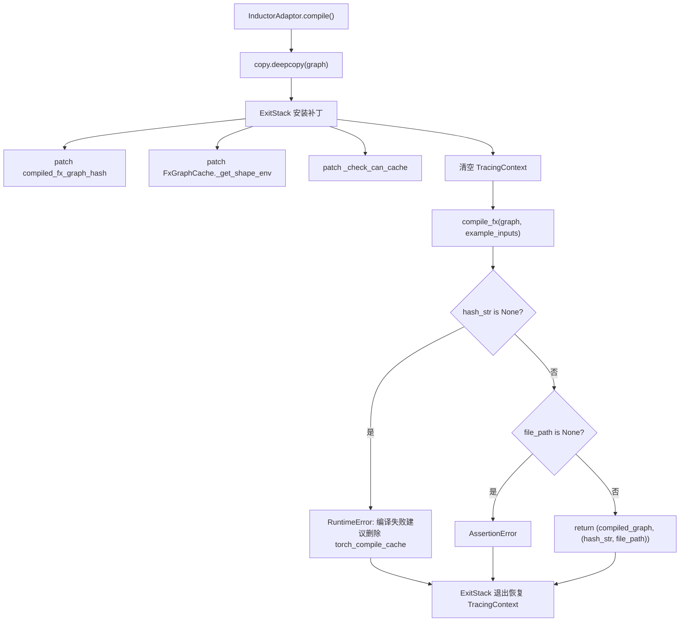
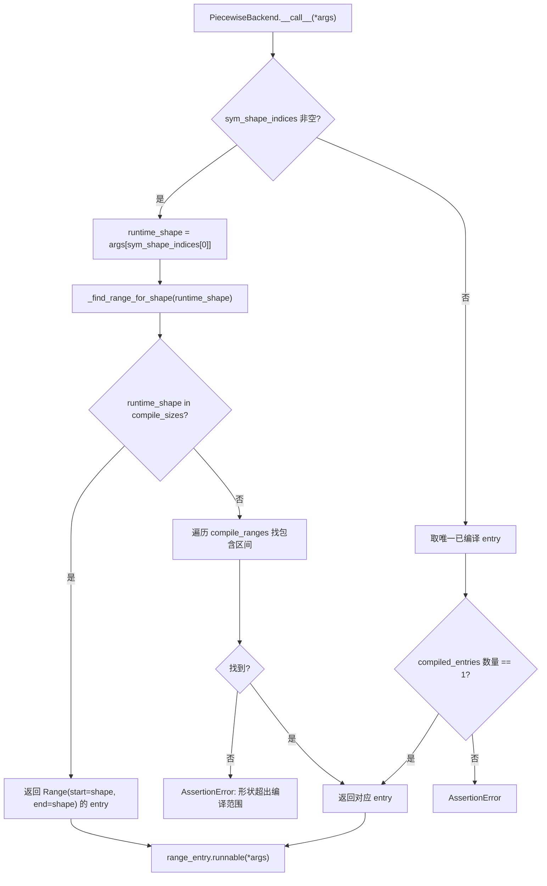

# 第 10 章：コンパイル高速化とCUDA Graph：起動とスケジューリングのオーバーヘッドを解消する

前章では、KV ConnectorがNIXL、Mooncakeなどのコネクタを通じてPrefillエンジンとDecodeエンジンの間でKV cacheを効率的に転送し、分離アーキテクチャがTTFTを削減しつつリソース利用率を向上させることを見た。しかし、転送がどれほど速くても、自己回帰デコードにはアルゴリズムでは解消できない2つの固定コストが依然として存在する：PythonインタプリタのスケジューリングオーバーヘッドとGPUカーネルの起動オーバーヘッドである。モデルの順伝播が数百の演算子に分割され、各演算子が1回のPython関数呼び出しと1回のCUDAカーネル起動を経る必要があるとき、CPU側のオーバーヘッドはGPUを2回の計算の間でアイドル状態にするのに十分である。本章では、vLLMがtorch.compileで演算子を静的グラフに融合し、さらにCUDA Graphでカーネル起動シーケンス全体を1回のリプレイとして記録することで、これら2種類のオーバーヘッドをほぼゼロにまで圧縮する方法を分析する。

# コンパイルキャッシュとコンパイラ適応層：コンパイル結果をプロセス間で再利用する

## 直感的モデル

コンパイル高速化の利点は「一度コンパイルすれば何度も実行できる」ことだが、代償として初回コンパイルに数分かかる場合がある。キャッシュがなければ、サービス再起動のたびに再コンパイルが必要となり、コールドスタート時間は許容できないものになる。`CompilerInterface`この層が解決しようとしているのはまさに「コンパイル成果物をどのようにシリアライズし、どのようにハッシュで識別し、次回起動時に正確にヒットさせるか」という問題である。これがなければ、システムが直面する災難はクラッシュではなく、再起動のたびに「初回実行」に退化することである——自動スケーリングする本番環境では、これはスケールアウトされたインスタンスが数分間にわたって低レイテンシサービスを提供できないことを意味する。

## データ構造とインターフェース契約

`CompilerInterface`コンパイラアダプタの抽象契約を定義しており、核心は4つのメソッドである：`initialize_cache`コンパイラ自身のキャッシュディレクトリをvLLMのキャッシュディレクトリ配下にリダイレクトする責務を負う[FACT:vllm/compilation/compiler_interface.py:36-51]；`compute_hash`コンパイラ関連の設定情報を収集してハッシュを生成する[FACT:vllm/compilation/compiler_interface.py:53-62]；`compile`コンパイルを実行し、呼び出し可能オブジェクトとハンドルを返す[FACT:vllm/compilation/compiler_interface.py:64-95]；`load`ハンドルからコンパイル成果物を復元する[FACT:vllm/compilation/compiler_interface.py:97-103]。

ここでの鍵となる設計は`compile`二要素タプルを返す`(callable, handle)`。`callable`は今回のプロセス内で直接呼び出し可能なコンパイル結果である；`handle`は「次回起動時に復元するための」凭证であり、ドキュメントは明示的にそれが「plain Python object, preferably a string or a file path」であるべきと要求している[FACT:vllm/compilation/compiler_interface.py:81-81]。この分離により、キャッシュヒット経路と初回コンパイル経路は完全に異なるコードを辿ることができる——ヒット時には`compile`は全く不要であり、`load`。

`compile_range`のみが必要である。パラメータは動的形状のセマンティクスを担っている。コメントはそれが「could be concrete size (if compile_sizes is provided), e.g. [4, 4] or a range [5, 8]」であり、かつ「Right now we only support one variable in ranges for all inputs, which is the batchsize (number of tokens) during inference」であると説明している[FACT:vllm/compilation/compiler_interface.py:74-74]。これがvLLMコンパイル戦略の核心的制約である：すべての動的形状は単一変数——トークン数——に帰約される。

## シナリオ駆動：1回のコンパイル要求の完全な流れ

サービスが初回起動し、`InductorAdaptor.compile`が呼び出されると仮定する。それはまずコンパイルカウンタをインクリメントし[FACT:vllm/compilation/compiler_interface.py:477-489]、次に綿密に構成されたパッチスタックに入る。

最初のステップはグラフのディープコピーである。コメントは「inductor can inplace modify the graph, so we need to copy it」と指摘しており[FACT:vllm/compilation/compiler_interface.py:500-502]、これは防御的設計である——コンパイル失敗後も元のグラフをリトライに使用できる。

2番目のステップは一連のmonkey-patchのインストールである。`hijacked_compile_fx_inner`はInductorの内部コンパイル関数をラップし、コンパイル完了後に`inductor_compiled_graph._fx_graph_cache_key`からハッシュを取得する[FACT:vllm/compilation/compiler_interface.py:512-536]。`hijack_compiled_fx_graph_hash`はハッシュ計算関数そのものを傍受する[FACT:vllm/compilation/compiler_interface.py:538-542]。なぜハッシュを「ハイジャック」する必要があるのか？vLLMはDynamoトレースコンテキストの外で個別にコンパイルする必要があり、Inductorのハッシュ計算はそのコンテキストに依存しているからである。

3番目のステップは`_check_can_cache`パッチ、それは直接返し、何のチェックも行わない[FACT:vllm/compilation/compiler_interface.py:544-551]。コメントは動機を説明している：「InductorはDynamoトレーシングコンテキスト外でのグラフのキャッシュを拒否し、また高階演算を持つグラフのキャッシュも無効にする。vLLMの場合、いずれのケースでもグラフをキャッシュしたい」[FACT:vllm/compilation/compiler_interface.py:544-551]。

第四步是清理追踪上下文。这是最微妙的一处：vLLM 从`PiecewiseCompileInterpreter`内部调用`compile_fx`，此时 Dynamo 的`FakeTensorMode`与子图输入的`FakeTensorMode`不一致，`detect_fake_mode()`会断言失败[FACT:vllm/compilation/compiler_interface.py:615-622]。代码保存`TracingContext`后将其置空，并注册回调在退出时恢复[FACT:vllm/compilation/compiler_interface.py:623-630]。

## 设计思考：AlwaysHitShapeEnv 与缓存一致性

`AlwaysHitShapeEnv`这个类值得单独剖析。它的文档字符串直白地说明了动机：vLLM 只运行一次 Dynamo 字节码编译，但要用不同形状加一个通用形状多次运行 Inductor 编译；针对特定形状的编译发生在 Dynamo 上下文之外，此时没有 shape environment 提供给 Inductor，会导致 Inductor 代码缓存查找失败[FACT:vllm/compilation/compiler_interface.py:114-131]。

解决方案是提供一个"永远命中"的假 shape environment：`evaluate_guards_expression`恒返回`True` [FACT:vllm/compilation/compiler_interface.py:144-145]，`get_pruned_guards`返回空列表[FACT:vllm/compilation/compiler_interface.py:144-145]，`produce_guards_expression`返回空字符串[FACT:vllm/compilation/compiler_interface.py:147-159]。注释坦承这些方法是"obtained by trial-and-error until it works"[FACT:vllm/compilation/compiler_interface.py:137-142]——这是与 PyTorch 内部实现耦合的脆弱点，也是升级 PyTorch 时最易出问题的地方。

缓存哈希的构成同样关键。`get_inductor_factors`收集三类因子：系统状态`CacheBase.get_system()`、PyTorch 状态`torch_key()`、以及 Inductor 与 functorch 的配置[FACT:vllm/compilation/compiler_interface.py:165-185]。注意 functorch 配置是在`patch(_get_vllm_functorch_config())`上下文中采集的[FACT:vllm/compilation/compiler_interface.py:188-189]，这保证了"编译时配置与缓存键始终一致"——注释明确说这是为了让`set_functorch_config()`和`get_inductor_factors()`保持一致[FACT:vllm/compilation/compiler_interface.py:147-159]。如果这两处不一致，就会出现"编译时用了配置 A、缓存键按配置 B 计算"的错配，导致缓存命中却加载了错误的产物。

生产踩坑：`_patch_standalone_compile_atomic_save`是针对 torch < 2.10.0 的 backport[FACT:vllm/compilation/compiler_interface.py:205-243]。它把`CompiledArtifact.save()`改为用`write_atomic`写二进制格式，注释说明目的是"preventing corrupt cache files when multiple processes compile concurrently"[FACT:vllm/compilation/compiler_interface.py:208-210]。在多副本同时冷启动的场景下，多个进程会并发写同一个缓存文件，非原子写会产生半截文件，后续进程读到损坏产物后行为不可预测。

# PiecewiseBackend：按形状分档编译与运行时派发

## 直觉模型

`PiecewiseBackend`是编译与执行之间的调度中枢。它把"一个 FX 子图"编译成"多个形状档位的可调用对象"，并在运行时根据实际 token 数选择最合适的那一个。若没有它，要么所有形状都走同一个通用编译（性能次优），要么每个形状都单独编译（编译时间爆炸）。

## 数据结构：RangeEntry 与编译范围

核心数据结构是`RangeEntry`，它把`compile_range`、`compiled`标志和`runnable`绑定在一起[FACT:vllm/compilation/piecewise_backend.py:80-83]。`PiecewiseBackend`维护一个`range_entries: dict[Range, RangeEntry]` [FACT:vllm/compilation/piecewise_backend.py:166-171]。

编译范围的构造分两步。首先处理`compile_sizes`（精确尺寸），每个尺寸生成一个`Range(start=size, end=size)`的单点区间[FACT:vllm/compilation/piecewise_backend.py:166-171]。注意这里对字符串`"cudagraph_capture_sizes"`直接抛`NotImplementedError`，并说明"should be handled in`post_init_cudagraph_sizes`" [FACT:vllm/compilation/piecewise_backend.py:166-171]——这是一个显式的职责边界声明。然后处理`compile_ranges`（区间），每个区间生成一个 entry[FACT:vllm/compilation/piecewise_backend.py:173-173]。

`PiecewiseBackend`支持两种互斥模式，构造函数用异或断言强制这一点[FACT:vllm/compilation/piecewise_backend.py:117-119]：编译模式（有 graph，无 compiled_runnables）走`compile_all_ranges()` [FACT:vllm/compilation/piecewise_backend.py:193-194]；预编译模式（无 graph，有 compiled_runnables）走`load_all_ranges()` [FACT:vllm/compilation/piecewise_backend.py:193-194]。这个设计让冷启动与热启动共享同一个类，只是数据来源不同。

## 场景驱动：从编译到运行时派发

**编译阶段**：`compile_all_ranges`遍历所有 range entry，对每个未编译的 entry 调用`_log_compile_start`记录追踪事件[FACT:vllm/compilation/piecewise_backend.py:252-256]。关键分支在参数构造：如果是单点尺寸，调用`create_concrete_args`生成具体形状的 FakeTensor[FACT:vllm/compilation/piecewise_backend.py:258-261]；否则调用`get_fake_args_from_graph`直接复用图中的 placeholder 元数据[FACT:vllm/compilation/piecewise_backend.py:262-263]。

`create_concrete_args`的实现揭示了符号形状具体化的细节。它构造一个带`ShapeEnv`的`FakeTensorMode` [FACT:vllm/compilation/piecewise_backend.py:54]，然后遍历 placeholder 节点。对`SymInt`类型的输入，用`concretize`把所有自由符号替换为`size` [FACT:vllm/compilation/piecewise_backend.py:47-52]；对`Tensor`类型，则要同时具体化 shape、stride、storage_offset，并用`compute_required_storage_length`算出所需存储长度，再通过`as_strided`重建张量[FACT:vllm/compilation/piecewise_backend.py:64-73]。なぜ shape だけを変更できないのか？なぜなら stride と storage_offset にもシンボルが含まれる可能性があり、かつ三者が整合していなければ、`as_strided`は範囲外アクセスを起こす。

**ランタイムディスパッチ**：`__call__`はホットパスである。もし`sym_shape_indices`が存在する場合、`args`からランタイム形状[FACT:vllm/compilation/piecewise_backend.py:357-362]を取り出し、次に`_find_range_for_shape`を呼び出して検索する。検索ロジックには優先順位がある：まず正確な`compile_sizes`にヒットするか確認し、ヒットすればその単一点区間[FACT:vllm/compilation/piecewise_backend.py:342-355]を返す。そうでなければ`compile_ranges`を走査してその形状を含む区間[FACT:vllm/compilation/piecewise_backend.py:342-355]。

## コピー

> **[Design Inference & Architectural Trade-offs]**
> `to_bytes`〔設計上の推論とアーキテクチャのトレードオフ〕`reducer_override`メソッドはコンパイル成果物をシリアライズし、AOT キャッシュに使用する。ここには巧妙な`CachingAutotuner`がある：pickle が`obj.prepare_for_pickle()`に遭遇すると、まず[FACT:vllm/compilation/piecewise_backend.py:209-218]を呼び出してから`CachingAutotuner`をシリアライズする。なぜこのフックが必要か？`prepare_for_pickle`は内部的に Triton コンパイル成果物とランタイム状態を保持しており、直接 pickle すると失敗するか、再利用不可能なオブジェクトが生成される可能性がある。

は明らかにオブジェクトをシリアライズ可能な純粋な形態に変換するものである。`bundled_autograd_cache` [FACT:vllm/compilation/piecewise_backend.py:222]シリアライズ時には一時的に`_get_vllm_functorch_config`を有効にする。これは`VLLM_USE_MEGA_AOT_ARTIFACT`内のロジックと呼応している——`False` [FACT:vllm/compilation/compiler_interface.py:160-161]が有効でない場合、この設定は`True`であり、シリアライズ時には強制的に

`load_all_ranges`となり、成果物が確実にパッケージ化される。`compiled_runnables`はホットスタートパスであり、各 range が[FACT:vllm/compilation/piecewise_backend.py:329-339]内で対応する key を見つけられることをアサートし、そうでなければ利用可能な key リストを含むエラー

# をスローする。このエラーメッセージは非常に実用的に設計されている——利用可能な key を直接列挙するため、キャッシュバージョンの不一致の調査が容易になる。

## CUDA Graph ラッパー：キャプチャ、リプレイ、ネストディスパッチ

直感的モデル`CUDAGraphWrapper`CUDA Graph は「一連のカーネル起動」を静的なグラフとして記録し、以降のリプレイでは API 呼び出しが一度だけで済む。

## は記録とリプレイの実行者である。直面する核心的な課題は：vLLM のバッチサイズは動的であるが、CUDA Graph は入力アドレスが固定であることを要求する。解決策は「batch descriptor ごとに段階的にキャプチャする」こと——各形状段階ごとにグラフを記録し、ランタイムでは descriptor に基づいてテーブルを引いてリプレイする。

`CUDAGraphEntry`データ構造：CUDAGraphEntry とディスパッチ契約`batch_descriptor`は三つの重要なフィールドを保持する：[FACT:vllm/compilation/cuda_graph.py:128-135]、`cudagraph`はディスパッチキーとして[FACT:vllm/compilation/cuda_graph.py:128-135]、`output`はキャプチャされたグラフオブジェクト[FACT:vllm/compilation/cuda_graph.py:128-135]。`input_addresses`はキャプチャ時の出力（メモリ節約のため弱参照で保存）[FACT:vllm/compilation/cuda_graph.py:128-135]。

`CUDAGraphWrapper`はデバッグモードでのみリプレイ時の入力アドレス一致を検証するために使用[FACT:vllm/compilation/cuda_graph.py:158-158]のクラスドキュメントはディスパッチ契約を正確に記述している：初期化時にランタイムモード（FULL または PIECEWISE）を割り当てる[FACT:vllm/compilation/cuda_graph.py:158-158]；ランタイムでは forward context から runtime_mode と batch_descriptor を受け取り、「blindly trust them」する[FACT:vllm/compilation/cuda_graph.py:158-158]；runtime_mode が NONE または不一致の場合は直接[FACT:vllm/compilation/cuda_graph.py:158-158]。

を呼び出す；そうでなければキャプチャまたはリプレイを実行する[FACT:vllm/compilation/cuda_graph.py:164-164]ドキュメントはさらに一つの境界を特に宣言している：「CUDAGraphWrapper does not store persistent buffers or copy any runtime inputs into that buffers for replay」

## 。これは入力バッファの管理は呼び出し側の責任であることを意味する——wrapper はグラフ自体のみを担当する。

**シナリオ駆動：一回のキャプチャと一回のリプレイ**キャプチャパス`__call__`：[FACT:vllm/compilation/cuda_graph.py:232-233]がトリガーされ、runtime_mode が一致する場合、まず forward context が利用可能か確認する。利用不可の場合（視覚エンコーダのフォワードなど）、直接下位関数

を呼び出す。これはマルチモーダルシナリオの重要な分岐である——ViT フォワードは CUDA Graph を通らない。`batch_descriptor`次に`cudagraph_runtime_mode` [FACT:vllm/compilation/cuda_graph.py:242-244]と[FACT:vllm/compilation/cuda_graph.py:246-256]を取得する。mode が NONE または不一致の場合、直接

を呼び出す。この「不一致なら直通」という設計により、ネストされた wrapper が共存できる：FULL wrapper が外層、PIECEWISE wrapper が内層にあり、ランタイムでは一つだけがアクティブになる。`cudagraph`entry の`validate_cudagraph_capturing_enabled()`が None の場合、キャプチャに入る。まず[FACT:vllm/compilation/cuda_graph.py:279]を呼び出して正当性を検証し[FACT:vllm/compilation/cuda_graph.py:281-284]、次に入力アドレスを記録し`torch.cuda.CUDAGraph()` [FACT:vllm/compilation/cuda_graph.py:285]。

、`gc_disable`を作成する。キャプチャコンテキストにはいくつかの重要な操作がある。もし`gc.collect`が有効なら、`torch.accelerator.empty_cache` [FACT:vllm/compilation/cuda_graph.py:288-303]と[FACT:vllm/compilation/cuda_graph.py:289-294]をパッチする。コメントは理由を説明している：piecewise モードでは各層ごとにグラフをキャプチャする必要があり、繰り返し GC するとキャプチャが極端に遅くなるため、「only run gc for the first graph, and disable gc for the rest」[FACT:vllm/compilation/cuda_graph.py:305-308]。次に graph pool id[FACT:vllm/compilation/cuda_graph.py:310-312]。

を設定し、offloader のコピーストリームを同期する`torch.cuda.graph(cudagraph, pool=..., stream=...)`実際のキャプチャは`self.runnable(*args, **kwargs)` [FACT:vllm/compilation/cuda_graph.py:315-321]コンテキスト内で実行される`get_offloader().join_after_forward()`。キャプチャ後に[FACT:vllm/compilation/cuda_graph.py:322-326]を呼び出して未 join のストリームエラーを回避する`weak_ref_output`。もし[FACT:vllm/compilation/cuda_graph.py:327-334]が有効なら、output を弱参照に変換してメモリを節約する[FACT:vllm/compilation/cuda_graph.py:338-339]。最後に entry は弱参照 output とグラフオブジェクトを保存する**、しかし**返されるのは弱参照ではなく元の output である[FACT:vllm/compilation/cuda_graph.py:343-346]。

**——コメントはこれが PyTorch にキャプチャ期間中のメモリを正しく管理させるためだと強調している**リプレイパス[FACT:vllm/compilation/cuda_graph.py:348-357]：entry に既にグラフがある場合、デバッグモードで入力アドレスの一致を検証し[FACT:vllm/compilation/cuda_graph.py:359-361]、次に offloader を同期し`entry.cudagraph.replay()`、`entry.output` [FACT:vllm/compilation/cuda_graph.py:362-363]。

## 設計思考：なぜ出力は弱参照で、戻り値は強参照なのか

これは`CUDAGraphWrapper`の中で最も直感に反する箇所である。キャプチャ時に`output`は PyTorch の cudagraph pool によって管理される[FACT:vllm/compilation/cuda_graph.py:320]。もし entry が output を強参照すると、このグラフが占有する VRAM は永遠に解放されない。しかしキャプチャ中に弱参照に変換すると、PyTorch がキャプチャ完了前にメモリを回収し、キャプチャが失敗する可能性がある。そのためコードはキャプチャブロック内で弱参照[FACT:vllm/compilation/cuda_graph.py:334]を使い、entry には弱参照[FACT:vllm/compilation/cuda_graph.py:338]を格納するが、関数の戻り値は強参照[FACT:vllm/compilation/cuda_graph.py:346]である。この「三重参照状態」はメモリ安全性と VRAM 効率の精密なバランスである。

もう一つ注目すべき設計は`_all_instances`という`WeakSet` [FACT:vllm/compilation/cuda_graph.py:173-176]である。これにより`clear_all_graphs`はすべての wrapper のグラフを一度にクリアでき[FACT:vllm/compilation/cuda_graph.py:173-176]、VRAM が逼迫した際の緊急回収に使われる。通常の集合ではなく`WeakSet`を使うのは、wrapper が GC されるのを妨げないためである——そうでなければ wrapper 自体がリークする。

本番での落とし穴：`__getattr__`の実装はデバッグモードで存在しない属性に対してコンテキスト付きのエラーを投げる[FACT:vllm/compilation/cuda_graph.py:211-217]。些細なことに見えるが、「なぜあるメソッド呼び出しが失敗するのか」を調査する際、wrapper がラップする runnable の文字列表現が見えることは、裸の`AttributeError`よりもはるかに有用である。

# 設計思考：コンパイルと CUDA Graph の分離

設計ドキュメントはこのリファクタリングの動機を明確に記録している。初期の piecewise コンパイルは piecewise CUDA Graph キャプチャをサポートするためであり、CUDA Graph をサポートしない演算子（主に attention）を除外していた[FACT:docs/design/cuda_graphs.md:25]。後に full CUDA Graph サポートが追加されたが、「this tight coupling between compilation and cudagraph capture led to an all-or-nothing experience with little flexibility」[FACT:docs/design/cuda_graphs.md:25]。

リファクタリング後の目標は四つある：prefill/mixed と uniform-decode バッチを明示的に区別しそれぞれキャプチャする[FACT:docs/design/cuda_graphs.md:25-25]；CUDA Graph キャプチャロジックをコンパイルから分離し、「capturing piecewise and full cudagraphs using the same compiled graph」を可能にする[FACT:docs/design/cuda_graphs.md:25-25]；実行時にバッチ構成に応じてディスパッチする[FACT:docs/design/cuda_graphs.md:25-25]；集中制御により複雑さを低減する[FACT:docs/design/cuda_graphs.md:25-25]。

`BatchDescriptor`はディスパッチキーの中核構造であり、`num_tokens`、`num_reqs`、`uniform`、`has_lora`の四つのフィールドを含む[FACT:docs/design/cuda_graphs.md:86-93]。`uniform`フラグが特に重要である——多くの attention バックエンドはバッチが uniform の場合のみ full CUDA Graph をサポートする[FACT:docs/design/cuda_graphs.md:95-95]。ドキュメントはこの構造が拡張される可能性も予告している。例えば`uniform_query_len`を追加して複数の uniform decode 長をサポートするなど[FACT:docs/design/cuda_graphs.md:95-95]。

ディスパッチ優先度は`FULL > PIECEWISE > None`であり、ディスパッチキーが存在しない場合は NONE モードにフォールバックして eager 実行する[FACT:docs/design/cuda_graphs.md:112-115]。この「エラーではなく降格」戦略により、あらゆるバッチ構成が実行可能となる。性能は異なるだけである。

`AttentionCGSupport`列挙型はバックエンドの CUDA Graph 能力を定量化し、値は`ALWAYS=3 > UNIFORM_BATCH=2 > UNIFORM_SINGLE_TOKEN_DECODE=1 > NEVER=0` [FACT:docs/design/cuda_graphs.md:153-162]。混合 attention モデル（mamba mixer など）は全バックエンド能力の最小値を取り、それに応じて CUDA Graph モードを降格する[FACT:docs/design/cuda_graphs.md:173-175]。この設計により「能力宣言」と「モード選択」が分離される——新しいバックエンドは能力を宣言するだけで、降格戦略が自動的に適用される。

# 本章のまとめ

# 本章の考察とセルフチェック

Q1: もし`_check_can_cache`パッチ（[FACT:vllm/compilation/compiler_interface.py:544-551]）を削除し、Inductor 自身にキャッシュするかどうかを決定させた場合、どのようなシナリオでコンパイルキャッシュが無効になるか？なぜコメントは「Inductor refuses to cache the graph outside of Dynamo tracing context」と述べているのか？

**参考解説**：`_check_can_cache`は直接返し、何もチェックしない。コメントは Inductor が二つの場合にキャッシュを拒否すると説明している：一つは Dynamo トレーシングコンテキスト外、もう一つはグラフが高階演算子を含む場合[FACT:vllm/compilation/compiler_interface.py:544-551]。vLLM のコンパイルフローはまさに Dynamo コンテキスト外にある（`compile_fx`が`PiecewiseCompileInterpreter`によって呼び出され、コードは明示的に`TracingContext` [FACT:vllm/compilation/compiler_interface.py:623-625]をクリアしている）。パッチを削除すると、Inductor は「キャッシュ不可」と判定し、起動のたびに再コンパイルし、コールドスタート時間が秒単位から分単位に退化する。さらに隠蔽的なのは、vLLM が`hijacked_compile_fx_inner`に依存して`hash_str`を取得するため、キャッシュパスがスキップされると`hash_str`が None になり、[FACT:vllm/compilation/compiler_interface.py:640-652]の RuntimeError を引き起こす可能性がある。これがなぜコメントが「vLLM today assumes and requires the monkey-patched functions to get hit」と強調しているかを説明する[FACT:vllm/compilation/compiler_interface.py:596-598]。

Q2: `CUDAGraphWrapper`はキャプチャ時に output を弱参照に変換して entry に格納する（[FACT:vllm/compilation/cuda_graph.py:338]）が、強参照を返す（[FACT:vllm/compilation/cuda_graph.py:346]）。もし戻り値も弱参照に変更した場合、どのようなシナリオでクラッシュするか？

**参考解説**：キャプチャ期間中`output`は PyTorch の cudagraph pool によって管理される[FACT:vllm/compilation/cuda_graph.py:320]。戻り値が弱参照の場合、呼び出し側が受け取るオブジェクトはキャプチャブロックを抜けた直後にGCに回収される可能性がある——この時点でそれを保持する強参照が存在しないためである。PyTorchはキャプチャ期間中、メモリプールのマッピング関係を正しく構築するためにoutputを生存させておく必要がある。一度回収されると、その後のリプレイ時に`entry.output`が指す弱参照は既に無効となり、`replay()`の後に返されるオブジェクトは上書きまたは解放されている可能性がある。コメントには明確に「we need to return the output, rather than the weak ref of the output, so that pytorch can correctly manage the memory during cuda graph capture」と記されている[FACT:vllm/compilation/cuda_graph.py:343-345]。この設計は「キャプチャ期は強参照、保存期は弱参照」という精密なバランスである。

Q3:`PiecewiseBackend._find_range_for_shape`（[FACT:vllm/compilation/piecewise_backend.py:342-355]）において、正確なサイズの検索が区間検索より優先される。仮に`compile_sizes=[8]`、`compile_ranges=[Range(1,16)]`で、実行時shape=8の場合、どのentryにヒットするか？優先順位を逆にした場合、どのような結果になるか？

**参考解析**：現在のロジックはまず`runtime_shape in self.compile_sizes`をチェックし、ヒットすれば`Range(start=8, end=8)`の単一点entry[FACT:vllm/compilation/piecewise_backend.py:342-355]を返す。このentryは`create_concrete_args`でコンパイルされ、形状が完全に具体化されているため、Tritonカーネルは最大限の特化が可能である（例えば`set_inductor_config`では単一点サイズで`max_autotune` [FACT:vllm/compilation/compiler_interface.py:747-754]が有効になる）。優先順位を逆にすると、shape=8は区間`Range(1,16)`のentryにヒットする——それはシンボリック形状でコンパイルされた汎用版であり、性能は次善である。さらに深刻なのは、`compile_sizes`が通常`cudagraph_capture_sizes`に由来し、これらのサイズこそがCUDA Graphがキャプチャすべき档位である点である。実行時に汎用entryへディスパッチされると、CUDA Graphがキャプチャしたグラフとディスパッチされたrunnableが一致せず、リプレイ時に形状の不一致が生じる可能性がある。したがって、正確優先は性能上の選択であるだけでなく、正確性の要件でもある。

次章では量子化とカスタムカーネルに移り、vLLMが重みロード段階から精度制御に介入し、高度に特化した演算子で量子化の利益を真にスループット向上として実現する方法を見る。

本章ではvLLMのコンパイル高速化の二層メカニズムを分析した。第一層はCompilerInterfaceとPiecewiseBackendである。前者はコンパイラ適配契約とキャッシュハッシュ戦略を定義し、AlwaysHitShapeEnvでDynamoコンテキスト欠如の問題を回避する。後者は単一のFXサブグラフを複数の形状档位にコンパイルし、実行時にtoken数に応じてディスパッチする。第二層はCUDAGraphWrapperである。これはBatchDescriptorごとにCUDA Graphをキャプチャし、runtime modeマッチングによるネストディスパッチを実現し、FULLとPIECEWISEの両モードを同一コンパイルグラフ上で共存させる。両者の分離が今回のリファクタリングの核心である——コンパイル成果物は2つのCUDA Graphモードで再利用でき、CUDA Graphもコンパイルから独立して動作できる。ただし、コンパイルとグラフキャプチャが解決するのはスケジューリングオーバーヘッドであり、モデル自体の重み精度と演算子効率は依然として別の最適化主線である。次章では量子化とカスタムカーネルに移り、vLLMが量子化設定を解析し、重みロード時にFP8/INT4/AWQ/GPTQなどのフォーマット変換を完了し、_custom_opsとTritonカーネルによってハードウェア性能をさらに引き出す方法を見る。
