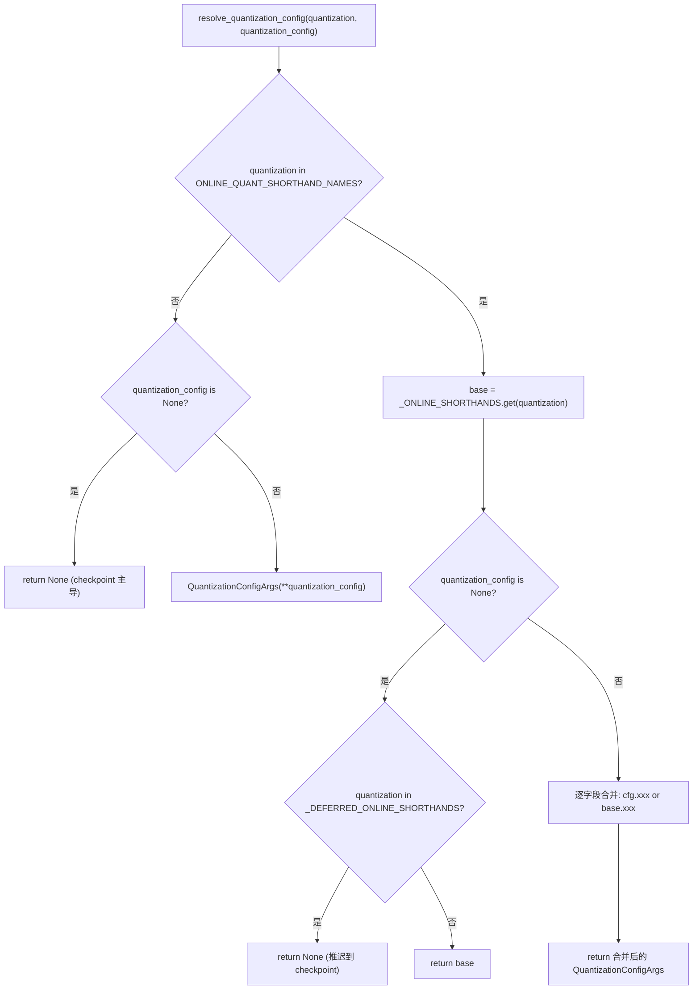
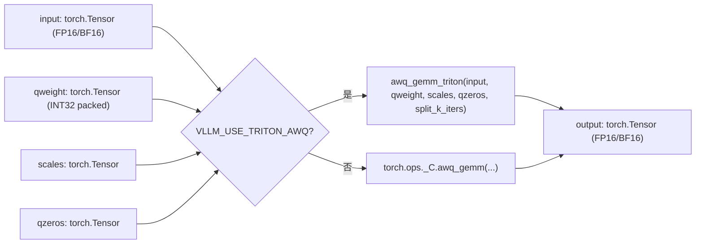
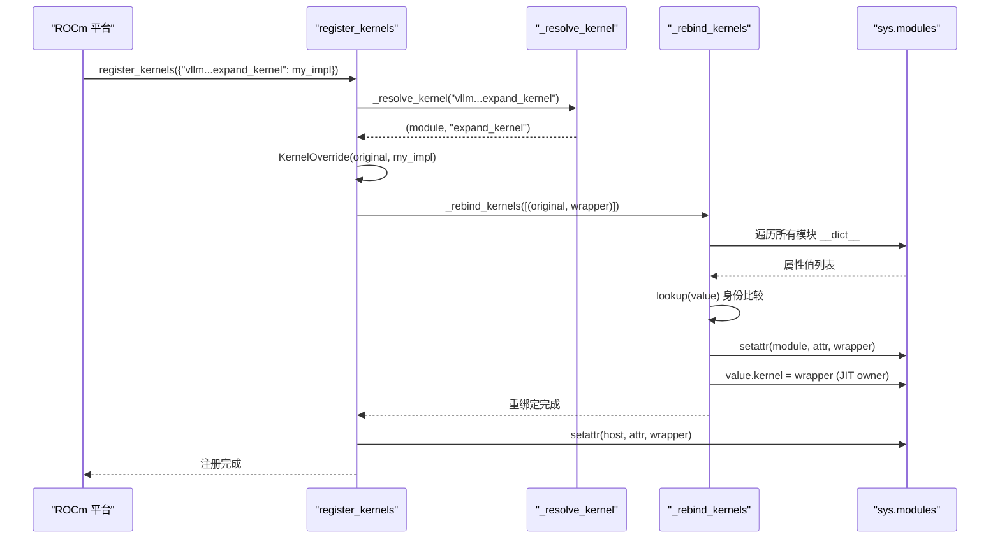

# 第 11 章：量子化とカスタムカーネル：重みロードから高性能演算子まで

前章では、torch.compileとCUDA GraphがPythonスケジューリングとカーネル起動オーバーヘッドを極限まで圧縮することを見た。しかしスケジューリングがどれだけ速くても、重み自体がFP16で行列乗算が汎用GEMMであれば、ハードウェア算力は依然としてメモリ帯域と非効率な演算子に足を引っ張られる。量子化とカスタムカーネルはもう一つの直交する最適化主線である。前者は重みロード段階で精度を圧縮し、後者は量子化の利益を真にスループットとして実現する。本章は量子化設定の解析入口から出発し、_custom_opsの演算子登録とTritonカーネルスケジューリングまでを辿る。

# 11.1 量子化設定：CLI文字列からQuantKeyへ

## 直感モデル

量子化設定モジュールの役割は、レストランの注文メニュー翻訳機のようなものである。ユーザーがフロントで「fp8_per_tensorが欲しい」（CLI文字列）と言い、厨房が必要とするのは正確なレシピ番号（`QuantKey`）である。翻訳機は3種類の入力を処理しなければならない：純粋なCLI簡略表記、checkpoint自带の量子化メタデータ、そして両者が重畳する組み合わせシナリオ。この翻訳層がなければ、厨房は意味の曖昧な文字列の山を受け取り、どのkernelを呼ぶべきか決定できない。

## データ構造とメモリレイアウト

核心的なデータ構造は`QuantSpec`と`QuantizationConfigArgs`である。前者は単一クラス層（linearまたはMoE）の重みと活性化の量子化キーを記述し、後者はユーザーに見えるトップレベル設定である。

[FACT:vllm/config/quantization.py:73-99]

```python
@config
class QuantSpec:
    weight: QuantKeyField = None
    activation: QuantKeyField = None

    def __str__(self) -> str:
        def quant_key_str(quant_key: QuantKey | None) -> str:
            if quant_key is None:
                return "None"
            return next(
                (
                    name
                    for name, known_quant_key in QUANT_KEY_NAMES.items()
                    if known_quant_key == quant_key
                ),
                str(quant_key),
            )
        return quant_key_str(self.weight)
```

`weight`と`activation`はどちらもオプションである`QuantKey`。`None`のセマンティクスは「メソッドクラス自身のデフォルト値にフォールバックする」——通常は checkpoint から継承され、オンライン量子化のシナリオでは量子化しないことを意味する[FACT:vllm/config/quantization.py:74-74]。`QuantKey`自体は以下を含む複雑な型である`NamedTuple`と`ClassVar[GroupShape]`の宣言があり、pydantic はそれを直接内省できないため、作者は`GetPydanticSchema`を使ってカスタムバリデータを注入した`_coerce_quant_key`、文字列または`QuantKey`を統一的に正規化する[FACT:vllm/config/quantization.py:60-69]。

`QuantizationConfigArgs`のフィールドレイアウトは注目に値する[FACT:vllm/config/quantization.py:102-126]：

- `linear` / `moe`：それぞれ`LinearBase`と`FusedMoEFactory`層に作用する；
- `ignore`：量子化をスキップする層名のリスト。オンライン量子化では fnmatch ワイルドカードもサポートする；
- `targets`：層ごとのオンライン量子化オーバーライド。キーは正確な層名、`re:`プレフィックスの正規表現、または fnmatch パターンで、値は`linear`/`moe`と排他的。

`targets`と`linear`/`moe`の排他性は`model_validator`によって強制される[FACT:vllm/config/quantization.py:172-179]。この制約は形式主義ではない：`targets`は層ごとのオーバーライドパスを通り、`linear`/`moe`はグローバルデフォルトパスを通る。両方が同時に存在すると「ある層がどの spec を使うか」が判定不能になる。

## Step-by-Step：一度の`--quantization fp8_per_tensor`の解析

シナリオを代入：ユーザーがコマンドラインで`--quantization fp8_per_tensor`を渡し、同時に`--quantization-config`で MoE 層のアクティベーション量子化を指定した。

第一步、`resolve_quantization_config`が呼び出され、引数は CLI 文字列と設定辞書[FACT:vllm/config/quantization.py:233-235]。まず`quantization`が`ONLINE_QUANT_SHORTHAND_NAMES`に含まれるかチェックする——このタプルはすべての省略名と`"online"` [FACT:vllm/config/quantization.py:216-222]。

を含む`fp8_per_tensor`第二步、`base`が省略名テーブルにヒットし、`_ONLINE_SHORTHANDS["fp8_per_tensor"]`が`kFp8StaticTensorSym` [FACT:vllm/config/quantization.py:188-190]。

に解析される。つまり linear と moe の両方が`quantization_config`を使用する`QuantizationConfigArgs`第三步、[FACT:vllm/config/quantization.py:267-268]が非空の場合、`quantization_config.xxx or base.xxx`オブジェクトとして構築される。その後マージロジックに入る`or`：各フィールドは`if is not None`で決定される——ユーザーが明示的に設定したフィールドが優先され、未設定のものは省略名のデフォルト値を継承する。ここで`QuantSpec`ではなく

を使うのは意図的である：`quantization`と空リストはどちらも falsy であり、意味的には「未設定」と「空」は等価である。`awq`第四步、もし`quantization_config`が省略名テーブルにない場合（例えば checkpoint に付属の`None`）、かつ`None` [FACT:vllm/config/quantization.py:256-257]が

なら、関数は直接`_DEFERRED_ONLINE_SHORTHANDS`を返す。これは「オンライン量子化を重ねない」ことを意味し、checkpoint の量子化メソッドが支配的であり続ける。`mxfp4`見落としがちな分岐がある：`mxfp8` [FACT:vllm/config/quantization.py:233-235]は`--quantization mxfp4`と`quantization_config`を含む。これら二つの名前は CLI 省略名であり、同時に checkpoint 量子化メソッド名でもある。ユーザーが`None`のみを渡し`base` [FACT:vllm/config/quantization.py:267-268]を渡さない場合、関数は



## を返し、決定権を checkpoint メタデータに先送りする——checkpoint に量子化情報がない場合にのみ、オンライン省略名にフォールバックする。

`_coerce_spec`コピー`linear`設計上の考察と落とし穴`moe`バリデータは微妙なシナリオを処理した：`_ONLINE_SHORTHANDS`または`QuantKey`が文字列を受け取った場合、まず[FACT:vllm/config/quantization.py:130-139]を調べ、ヒットすれば対応するフィールドの spec を取り出す；ヒットしなければ単一の`linear="fp8_per_tensor"`名として処理する`linear="fp8_per_tensor_static"`。これは`None`と`int8_per_channel_weight_only`が二つの異なるパスを通ることを意味する——前者は完全な設定省略名、後者は単一の量子化キーである。省略名でそのフィールドが`linear`の場合（例えば`ValueError`に`None` [FACT:vllm/config/quantization.py:130-139]。

フィールドがない）、明確な`targets`をスローし、静かに`_validate_targets`を返さない[FACT:vllm/config/quantization.py:166-167]本番環境でよくある落とし穴：

# 11.2 `_custom_ops`の正規表現キーは

## で事前コンパイル検証される

`_custom_ops.py`が、fnmatch パターンのキーは検証されない。ユーザーがどの層にも永遠にマッチしない fnmatch パターンを書いても、エラーにはならず、その層は未量子化のままである——調査時には層名が本当にマッチするか確認する必要がある。`torch.ops._C`：オペレータ登録と fake 実装`torch.compile`直感的モデル`_custom_ops`は vLLM と基盤の CUDA/C++ オペレータの間の適応層であり、税関のようなものである。PyTorch の

## 名前空間にはコンパイル済みの C++ オペレータが登録されているが、それらを直接呼び出すには三つの問題がある：異なるプラットフォーム（CUDA/ROCm/CPU/XPU）でオペレータセットが異なる、

出力形状を導出するために fake 実装が必要、一部のオペレータは Python 側のパラメータ前処理が必要。`current_platform.import_kernels()` [FACT:vllm/_custom_ops.py:25-26]はこれらの問題を統一的にカプセル化する。`register_fake`データ構造と登録メカニズム`TYPE_CHECKING`モジュールロード時にまず`torch.library`を呼び出し、プラットフォーム層に自身のオペレータライブラリをインポートする機会を与える。その後[FACT:vllm/_custom_ops.py:25-26]。

を定義する——`torch.compile`下では空のデコレータであり、実行時に`scaled_fp4_quant`から

[FACT:vllm/_custom_ops.py:90-100]

```python
if hasattr(torch.ops, "_C") and hasattr(torch.ops._C, "scaled_fp4_quant"):

    @register_fake("_C::scaled_fp4_quant")
    def _scaled_fp4_quant_fake(
        input: torch.Tensor,
        input_scale: torch.Tensor,
        is_sf_swizzled_layout: bool,
    ) -> tuple[torch.Tensor, torch.Tensor]:
        n = input.shape[-1]
        m = input.numel() // n
        return create_fp4_output_tensors(m, n, input.device, is_sf_swizzled_layout)
```

fake 実装の核心的な役割は、`hasattr`がトレース段階でオペレータの出力形状と dtype を知ることである。実際に実行せずに。例えば`_C::scaled_fp4_quant`：

`create_fp4_output_tensors`コピー[FACT:vllm/_custom_ops.py:69-87]注意`is_sf_swizzled_layout=True`ガード：プラットフォームが本当に`n // 16`を登録した場合にのみ、fake 実装が定義される。これにより CPU や古い GPU でモジュールをインポートしても、オペレータの欠如でクラッシュしないことが保証される。[FACT:vllm/_custom_ops.py:55-64]は FP4 量子化出力のメモリレイアウトの詳細を示す[FACT:vllm/_custom_ops.py:60-61]。

## 。

の場合、scale テンソルは Tensor Core が要求する 128x4 タイル配置にする必要がある：行数は 128 の倍数に切り上げ、列数（

）は 4 の倍数に切り上げ、4 つの float8_e4m3 を 1 つの int32 にパックする`awq_gemm` [FACT:vllm/_custom_ops.py:587-592]。コメントは NVFP4 量子化カーネルがすべての padding された scale エントリを明示的にゼロクリアすることを明確に指摘しているため、別途のゼロ初期化 kernel は不要である`VLLM_USE_TRITON_AWQ`Step-by-Step：一度の AWQ GEMM の呼び出しフロー`awq_gemm_triton`シナリオを代入：モデルが AWQ 量子化された重みをロードし、フォワードパスでアクティベーションと量子化重みの行列乗算が必要。

第一步、`torch.ops._C.awq_gemm`を呼び出す。関数はまず環境変数`split_k_iters` [FACT:vllm/_custom_ops.py:598-598]。

をチェックする。真の場合、遅延インポート`torch.ops._C.awq_gemm`存在し、fake 実装が登録されている[FACT:vllm/_custom_ops.py:601-616]。fake が返す形状は`(split_k_iters, num_in_feats, qweight.size(1) * 8)`そして`.sum(0)`——これは split-K の中間結果形状と、リダクション後の最終形状を正確に模擬している。`qweight.size(1) * 8`AWQ からのパッキング方式：各 int32 に 8 個の 4-bit 重みを格納する。

第四ステップ、`awq_dequantize`同様の経路をたどる[FACT:vllm/_custom_ops.py:553-559]、ただし fake 実装の形状推論は異なる：`out_c = qout_c * 8`、逆量子化後に列数が 8 倍に拡張されるため[FACT:vllm/_custom_ops.py:587-592]。

Marlin シリーズの repack 関数は別のパターンを示している。`gptq_marlin_repack`の fake 実装が計算する`pack_factor = 32 // num_bits`、出力形状は`(size_k // 16, size_n * 16 // pack_factor)` [FACT:vllm/_custom_ops.py:1103-1119]。ここでの`16`は Marlin tile size、`size_k // 16`は K 次元が tile で分割されることを示す。MoE 版の`gptq_marlin_moe_repack`は Python 層で各 expert をループして単一 expert の repack を呼び出す[FACT:vllm/_custom_ops.py:1154-1172]、そしてアサートする`size_k % 16 == 0`——これは Marlin フォーマットのハード制約である。



## 設計上の考察と落とし穴

fake 実装は実際の演算子の出力形状と完全に一致しなければならない、そうでなければ`torch.compile`がトレースしたグラフは実行時に形状が一致しなくなる。`create_fp4_output_tensors`のコメントは特に「Must match the C++ scaled_fp4_quant_func allocation exactly when padded_n is None」を強調している[FACT:vllm/_custom_ops.py:69-74]。これは間違いやすいポイントである：C++ 側でアロケーションロジックを変更して fake が同期していない場合、コンパイル済みグラフは CUDA Graph のリプレイ時にクラッシュする。

もう一つの罠は`torch.library.custom_op`のエイリアス規則である。`safeFusedQuantizeNv`のコメントは、torch 2.12+ ではカスタム演算子の出力が入力のいずれかをエイリアスすることを許可しないため、著者は返り値テンソルを in-place パラメータに変更したと指摘している[FACT:vllm/_custom_ops.py:4650-4655]。この「フレームワークの制限を回避するために API 形態を変える」手法は演算子適配層ではよく見られ、調査時には`mutates_args`宣言が実際の動作と一致しているかに注意する必要がある。

`CPUDNNLGEMMHandler`は別のリソース管理パターンを示している：handler ポインタは int64 tensor に格納され、`__del__`時に`release_dnnl_matmul_handler`を呼び出して[FACT:vllm/_custom_ops.py:3708-3717]を解放する。ポインタを tensor に格納するのは、Python の整数インライン最適化によって消されるのを防ぐためである——これは低レベルバインディングの古典的なテクニックである。

# 11.3 Triton カーネルスケジューリング：`KernelOverride`とクロスモジュール再バインディング

## 直感モデル

Triton カーネルスケジューラの役割は、企業の職務代理システムのようなものである。あるプラットフォーム（例えば ROCm）が vLLM コア内の Triton カーネルを独自の実装で置き換える必要がある場合、コアコードを直接変更することはできない——それは上流を汚染してしまう。`dispatcher`はプラットフォームが代理を登録し、元のカーネルを指すすべての参照を密かに代理に置き換えることを可能にする。この仕組みがなければ、各プラットフォームが fork を維持しなければならず、上流の変更をマージする際に絶えずコンフリクトが発生する。

## データ構造とメモリレイアウト

中核となるデータ構造は`_registry`辞書と`KernelOverride`クラス[FACT:vllm/triton_utils/dispatcher.py:29-36]。

`KernelOverride`の主要フィールド[FACT:vllm/triton_utils/dispatcher.py:50-61]：

- `_impl`：プラットフォーム実装関数；
- `arg_names`：元カーネルのパラメータ名タプルをミラーし、launch 時のキーワードバインディングに使用；
- `constexprs`：元カーネルから継承した constexpr 宣言；
- `func`：実装関数を指し、warmup の内省に提供；
- `_forward_by_name`：ブールフラグ、launch 時にキーワードで転送するか位置で転送するかを決定する。

`_forward_by_name`の計算ロジックは：`inspect.signature(impl).parameters`と元カーネルの`arg_names`が完全に等しいか比較する[FACT:vllm/triton_utils/dispatcher.py:50-61]。等しければ、実装のパラメータ名がカーネルと一致しており、安全にキーワード転送できる；そうでなければ元カーネルのパラメータ順序で位置転送しなければならない。

## Step-by-Step：一回の`register_kernels`の再バインディング

シナリオ：ROCm プラットフォームが初期化時に`register_kernels({"vllm.v1.sample.rejection_sampler.expand_kernel": my_expand_impl})`。

を呼び出す`register_kernels`第一ステップ、`_resolve_kernel` [FACT:vllm/triton_utils/dispatcher.py:162-166]。`_resolve_kernel`が overrides を走査し、各名前に対して`.`を呼び出して名前を最後の[FACT:vllm/triton_utils/dispatcher.py:83-94]でモジュール名と属性名に分割する`getattr`。モジュール名の最後のセグメントの頭文字が大文字であれば、カーネルが何らかのクラス（JIT warmup owner）に属することを示し、まず親モジュールをインポートしてから`(类, 属性名)`でクラスを取得し、`(模块, 属性名)`。

を返す；そうでなければモジュール自体をインポートし、`KernelOverride`を返す`_registry` [FACT:vllm/triton_utils/dispatcher.py:167-169]。

第二ステップ、元カーネルオブジェクトを取得した後、`_rebind_kernels`ラッパーを構築し、[FACT:vllm/triton_utils/dispatcher.py:97-144]に記録する`sys.modules`第三ステップ、`__dict__`が全モジュールスキャンを実行する`is`。それは`==`内のすべてのモジュールの`PlaceholderModule`を走査し、各属性値に対して同一性比較を行う——注意すべきは[FACT:vllm/triton_utils/dispatcher.py:116-123]。

であり`setattr`ではない、なぜなら一部の属性値（例えば[FACT:vllm/triton_utils/dispatcher.py:125-135]センチネル）は hash/eq 時にインポートや例外を引き起こすため`kernel`第四ステップ、元カーネルにマッチした属性に対して、直接`value.kernel`を wrapper に置き換える`_kernel_arg_names`。JIT warmup owner（インスタンス属性[FACT:vllm/triton_utils/dispatcher.py:138-139]。

が元カーネルを指すオブジェクト）に対しては、`_rebind_kernels`を置き換え、キャッシュされた[FACT:vllm/triton_utils/dispatcher.py:170-174]をクリアして、launch バインディングが wrapper から再推論されるようにする[FACT:vllm/triton_utils/dispatcher.py:170-171]。



## 完了後に、定義箇所の属性も wrapper に置き換える

`KernelOverride.__getitem__`。コメントは順序の重要性を説明している：先に定義箇所を置き換えると、スキャン時に元カーネルが見つからなくなる`self._launch`コピー`kernel[grid](**kwargs)`設計上の考察と落とし穴[FACT:vllm/triton_utils/dispatcher.py:63-74]。`_launch`が[FACT:vllm/triton_utils/dispatcher.py:63-74]を返すことで、`_forward_by_name`のような Triton 標準 launch 構文が wrapper に対して透過的になる`RuntimeError`の転送ロジックは三つのケースに分かれる

：位置引数がある場合は直接透過；`RuntimeError`これは重要な防御である：プラットフォーム実装のパラメータ名がカーネルと一致せず、呼び出し側が実装の知らないパラメータを渡した場合、黙って無視すると発見困難な誤った結果を招く。明示的なエラー報告により、問題は登録段階で露見する。

本番環境の落とし穴：`_rebind_kernels`のスキャンは O(モジュール数 × 属性数 × カーネル数) である。大規模モデルでは、`sys.modules`は数千のモジュールを持ち、各モジュールに数百の属性がある可能性がある。初期化時に一度だけ実行されるが、登録されるカーネルが多い場合、起動時間が明らかに増加する。`lookup`関数はハッシュ検索ではなく線形スキャンを用いており、コメントでその理由を説明している——一部の属性値はハッシュ化できない[FACT:vllm/triton_utils/dispatcher.py:116-123]。これは典型的な「正確性を性能より優先する」トレードオフである。

もう一つの落とし穴：`_resolve_kernel`は「モジュール名の最後のセグメントの先頭文字が大文字」かどうかでクラス属性かどうかを判断する[FACT:vllm/triton_utils/dispatcher.py:83-94]。もしあるモジュール名がたまたま大文字で始まる場合（Python の命名慣例に反するが構文的には合法）、クラスと誤判定される。これは規約優先設定の設計であり、vLLM 内部の命名規範に依存している。

# 設計上の考察

量子化設定と演算子登録という二層のメカニズムが、共に vLLM の「精度-性能」調整面を構成している。`QuantizationConfigArgs`の設計は「ユーザーの意図」と「メソッドのデフォルト値」の分離を体現している：`None`は「量子化しない」ではなく、「メソッドクラス自身に決めさせる」である。この遅延決定により、同一の設定が checkpoint 量子化とオンライン量子化の両シナリオに適応できる。

`_custom_ops`の fake 実装パターンは`torch.compile`エコシステムの標準であるが、vLLM の独自性は`hasattr`ガードの普遍的な使用にある。これにより同一のモジュールが CUDA、ROCm、CPU、XPU 上でクラッシュせずにインポートできるが、代償として各演算子に三箇所のコードが必要となる：Python ラッパー、fake 実装、そしてプラットフォームガード。

Triton dispatcher のクロスモジュール再バインドは積極的な方案である。Python のインポートフックや`__getattr__`に依存せず、全ての参照を直接スキャンして置換する。この手法の利点は徹底性にある——カーネルが`from mod import kernel`いくつの場所にコピーされても置換できる；欠点は脆弱性である——カーネル参照を保持する新たな方法（例えばクロージャによるキャプチャ）はスキャンを逃れる可能性がある。

# 本章のまとめ

# 本章の考察とセルフチェック

Q1:`resolve_quantization_config`において、もし`_DEFERRED_ONLINE_SHORTHANDS`分岐を除去した場合（すなわち`quantization in _DEFERRED_ONLINE_SHORTHANDS`の時に`base`ではなく`None`を返す）、checkpoint が`quant_method: "mxfp4"`を自带するモデルをロードし、ユーザーが`--quantization mxfp4`のみを渡した場合、何が起こるか？

**参考解析**：`_DEFERRED_ONLINE_SHORTHANDS`の設計意図は checkpoint 量子化メソッドを優先させることである[FACT:vllm/config/quantization.py:233-235]。もしこの分岐を除去すると、`mxfp4`は`_ONLINE_SHORTHANDS`にヒットし`base`を返す（すなわち`QuantSpec(weight=kMxfp4Static)`）[FACT:vllm/config/quantization.py:198-210]。この時、オンライン量子化設定が checkpoint の量子化メソッドを上書きし、checkpoint の重みは`mxfp4`形式で格納されている——もしオンライン設定の`kMxfp4Static`が checkpoint の実際の形式と完全に一致しない場合（例えば scale のレイアウトが異なる）、重みのロードが失敗するか誤った結果を生む。より隠蔽的なケースは：checkpoint の`mxfp4`が異なる group size や scale dtype を使用しており、オンライン設定のデフォルト値と一致せず、推論精度が低下するがエラーは報告されない。

Q2: `KernelOverride._launch`において、もし`_forward_by_name`が`False`であり、呼び出し側が渡した kwargs が元のカーネルの知らないパラメータ名を含む場合、コードは`RuntimeError`をスローする。もしこのチェックを除去し、未知のパラメータを黙って無視するように変更した場合、どのようなシナリオで発見困難な問題を引き起こすか？

**参考解析**：`_forward_by_name`が`False`であることは、プラットフォーム実装のパラメータ名が元のカーネルと一致せず、位置引数で転送する必要があることを意味する[FACT:vllm/triton_utils/dispatcher.py:50-61]。もし呼び出し側が元のカーネルの知らないパラメータを渡した場合（例えば上流が新しいオプションパラメータを追加した）、黙って無視するとそのパラメータの値が失われる。Triton カーネルのシナリオでは、これは通常ある constexpr や grid 次元が渡されていないことを意味し、カーネルはデフォルト値で起動される可能性がある——結果はクラッシュではなく誤った計算結果かもしれない。Triton カーネルの誤った結果は数値偏差として現れることが多く、例外ではないため、発見の難易度は極めて高い。明示的な`RuntimeError`により、問題は最初の launch 時に露見する[FACT:vllm/triton_utils/dispatcher.py:63-74]。

Q3: `_rebind_kernels`JIT warmup owner の`kernel`属性を置換した後、`value.__dict__.pop("_kernel_arg_names", None)`が実行される。もしこの行を除去した場合、どのような状況で launch バインディングエラーが発生するか？

**参考解析**：JIT warmup owner は`_kernel_arg_names`をキャッシュしており、launch 時に kwargs をカーネルパラメータにバインドするために使用する[FACT:vllm/triton_utils/dispatcher.py:138-139]。`kernel`を wrapper に置換した後、wrapper の`arg_names`は元のカーネルと異なる可能性がある（もしプラットフォーム実装のパラメータ名が異なる場合、wrapper の`arg_names`は依然として元のカーネルをミラーするが、`_forward_by_name`は`False`かもしれない）。もしキャッシュをクリアしないと、warmup メカニズムは古いパラメータ名リストでバインディングを続け、wrapper の launch ロジックは異なるバインディング方法を期待するかもしれない。具体的には、`KernelOverride._launch`は`_forward_by_name`が`False`の時に`self.arg_names`の順序で値を抽出する[FACT:vllm/triton_utils/dispatcher.py:79-80]。もしキャッシュされた`_kernel_arg_names`が wrapper の`arg_names`と一致しない場合、抽出されるパラメータの順序が乱れ、カーネルが誤ったパラメータ値を受け取る。

次章では高度な推論機能に移り、プレフィックスキャッシュがどのように KV block を再利用するか、投機的デコーディングがどのように小モデルで大モデルを加速するか、そして LoRA がどのようにベースモデルの重みを変更せずにアダプタを動的に切り替えるかを見る。

本章では、vLLMの量子化とカスタムカーネルの2層インフラストラクチャを分析した。第1層は量子化設定の解析である。QuantSpecとQuantizationConfigArgsは、CLI文字列、チェックポイントメタデータ、層ごとのオーバーライドをQuantKeyへ統一的に正規化し、resolve_quantization_configは省略形の展開とフィールドのマージを処理し、_DEFERRED_ONLINE_SHORTHANDSは名前衝突のシナリオを解決する。第2層は演算子の適配である。_custom_opsはhasattrガードとregister_fakeによりクロスプラットフォームな演算子登録を実現し、fake実装はtorch.compileをサポートするために実演算子の出力形状を正確にミラーリングする。dispatcherはKernelOverrideと全モジュールスキャンによりTritonカーネルのプラットフォーム置換を実現する。両者は共に、重みのロードからフォワード計算までの量子化收益の実現を支えている。次に、スループットを向上させレイテンシを低減する高度な推論機能へと移る。自動プレフィックスキャッシュがリクエストをまたいでKVをどのように再利用するか、投機的デコーディングがドラフトモデルで生成をどのように加速するか、そしてLoRAがアダプタをどのように動的に切り替えるかを見ていく。
