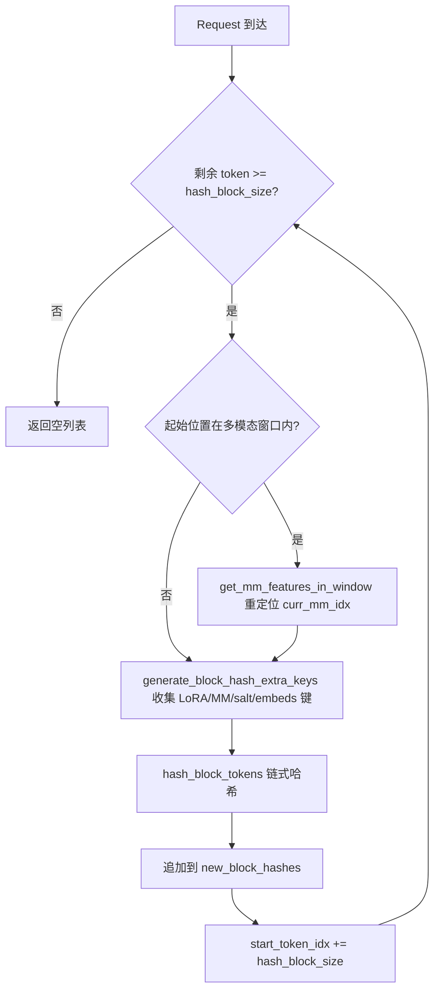
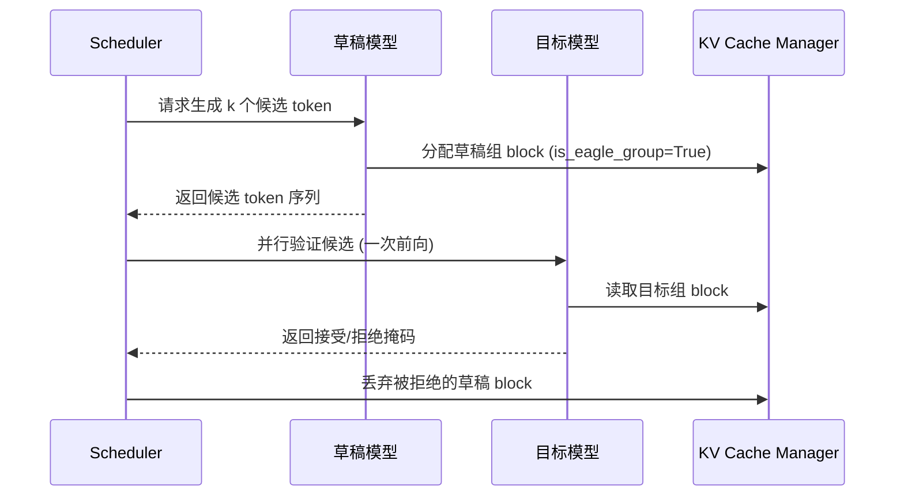

# 第 12 章：高度な推論機能：プレフィックスキャッシュ、投機的デコーディング、LoRA

前章ではvLLMの量子化体系とカスタム演算子インフラストラクチャを深く掘り下げ、量子化設定がどのように解析され対応するkernelが選択されるか、またFP8、INT4、AWQ、GPTQなどの方式が重みロード時にどのように変換を完了するかを見てきた。同時に、_custom_opsがCUDA演算子をどのように登録するか、Tritonカーネルのスケジューリング機構、そしてMoE融合カーネルがどのようにVRAMの往復を削減するかを明らかにした。これらの低レベル能力が、より高度な推論最適化への道を切り開いた。本章ではvLLMの3大高度推論機能、すなわち自動プレフィックスキャッシュ（APC）、投機的デコーディング、LoRAに焦点を当てる。これらは一見独立しているが、実際には同一の低レベルインフラストラクチャを共有している。すなわち、KV blockのハッシュ、スケジューラのslot割り当て、そしてモデル実行時の動的重み注入である。それらを理解する鍵は、PagedAttentionのページングセマンティクスを損なうことなく、「再利用」を極限まで徹底する方法を理解することにある。

# 12.1 プレフィックスキャッシュ：block hashがどのようにプレフィックスを指紋化するか

## 直感モデル

プレフィックスキャッシュは図書館の「共通段落の抜粋ノート」のようなものである。2人の学生が作文を書き、冒頭で同じ古文を引用する場合、先生はその古文の部分を一度だけ添削すればよく、その後ろのそれぞれ異なる部分を別々に見ればよい。これがなければ、各リクエストはプロンプト全体を最初からprefillする必要があり、長文書質疑応答のシナリオでは計算リソースが数倍に重複消費される。

## データ構造：tokenからblock hashへのマッピング

プレフィックスキャッシュの核心は「2つのリクエストのプレフィックスが同一かどうかをどのように判定するか」である。vLLMの答えは、token列をblockごとに分割し、各blockに対してチェーンハッシュを計算するというものである。チェーンとは、N番目のblockのハッシュが前のN-1個のblockのハッシュを含むことを意味し、したがって1つのblock hashが「列の先頭からそのblockの末尾まで」のプレフィックス全体を一意に指紋化する。

ハッシュの担体は`BlockHash`であり、これは`bytes`の`NewType`として定義され、裸の`bytes`ではない。その目的は、型レベルで[FACT:vllm/v1/core/kv_cache_utils.py:59-62]の誤用を防ぐことである。block hashとKV cache group idを組み合わせて辞書キーにする必要がある場合、vLLMはタプルを使わず、4バイトのビッグエンディアンgroup idをhashバイトの末尾に直接連結する[FACT:vllm/v1/core/kv_cache_utils.py:75-76]：

```python
def make_block_hash_with_group_id(block_hash, group_id):
    return BlockHashWithGroupId(block_hash + group_id.to_bytes(4, "big", signed=False))
```

> **[Design Inference & Architectural Trade-offs]**
> これは典型的な「タプル割り当て回避」最適化である。ホットパスでは、各blockの検索ごとにキーを構築する必要があり、タプルは余分なPythonオブジェクト割り当てとハッシュオーバーヘッドをもたらすが、バイト列の連結はC層で完了し、しかもバイト列自体がハッシュ可能である。取り出し時にはスライス`key[:-4]`と`int.from_bytes(key[-4:])`で[FACT:vllm/v1/core/kv_cache_utils.py:87-89]。

を復元する。ハッシュ関数自体は`hash_block_tokens`が担い、親block hash、現在のblockのtoken idタプル、および追加キーをまとめてハッシュ関数に渡す[FACT:vllm/v1/core/kv_cache_utils.py:650-680]。最初のblockの親ハッシュは`None`ではなく、グローバルな`NONE_HASH`：

```python
if not parent_block_hash:
    parent_block_hash = NONE_HASH
```

[FACT:vllm/v1/core/kv_cache_utils.py:674-675]。`NONE_HASH`のシード選択には安全設計が隠されている。SHA-256のような暗号学的ハッシュでは、シードは固定の`"vllm-none-hash"`であり、異なるvLLMプロセスが同じ内容に対して同じハッシュを算出し、ノードをまたいでプレフィックスキャッシュを共有できるようにする。一方、xxhashのような非暗号学的ハッシュでは、シードはプロセスごとにランダムである。予測可能なシードは攻撃者に衝突blockをオフラインで事前計算させるからである[FACT:vllm/v1/core/kv_cache_utils.py:105-126]。`resolve_none_hash_seed`がこの分岐を実装している：`PYTHONHASHSEED`環境変数が優先され、そうでなければ暗号学的ハッシュは固定シード、非暗号学的ハッシュは`os.urandom(32)` [FACT:vllm/v1/core/kv_cache_utils.py:132-145]。

## シナリオ駆動：1回のリクエストにおけるblock hash計算

128個のトークンを持つリクエストが到着し、ブロックサイズが16であると仮定する。`get_request_block_hasher`返されるクロージャは増分計算を担当する[FACT:vllm/v1/core/kv_cache_utils.py:802-861]：

最初のステップは、どこから計算を開始するかを決定することである。`start_token_idx = len(request.block_hashes) * hash_block_size` [FACT:vllm/v1/core/kv_cache_utils.py:812-812]すなわち、既に計算済みのブロック数にブロックサイズを掛けたものである。残りのトークンが1ブロック未満の場合は、直接空を返す[FACT:vllm/v1/core/kv_cache_utils.py:812-812]。

第二のステップは、マルチモーダルオフセットを処理することである。開始位置がマルチモーダル入力の内部にある場合、`get_mm_features_in_window`を用いて再配置する`curr_mm_idx` [FACT:vllm/v1/core/kv_cache_utils.py:823-832]が必要である。これは、マルチモーダル入力のプレースホルダートークン自体が意味を持たないため、mm特徴識別子とそのブロック内でのオフセットを追加キーとしてハッシュに混ぜ込む必要があるからである。

第三のステップは、各ブロックをループで計算することである。`generate_block_hash_extra_keys`すべての追加キーを収集する[FACT:vllm/v1/core/kv_cache_utils.py:611-647]これにはLoRA名、マルチモーダルキー、cache salt、prompt embedsハッシュが含まれる。このうちcache saltは最初のブロックでのみ有効となる[FACT:vllm/v1/core/kv_cache_utils.py:633-635]これは意図的なものである。saltの役割はキャッシュ名前空間全体を分離することであり、チェーンの起点で一度だけ注入すればよい。

第四のステップは、`hash_block_tokens`親ハッシュ、トークンタプル、追加キーをまとめてハッシュ化し、その結果を次のブロックの親ハッシュとする[FACT:vllm/v1/core/kv_cache_utils.py:851-857]これによりチェーン構造が形成される。

## マルチブロックサイズの粒度変換

モデルが複数のKV cache groupを持ち、ブロックサイズが異なる場合、ハッシュ粒度とgroupのブロック粒度が一致しないことがある。`BlockHashListWithBlockSize`この問題を解決する。ハッシュを再計算するのではなく、チェーンハッシュの性質を利用する。すなわち、あるtarget blockのハッシュは、その内部の最後のhash blockのハッシュである[FACT:vllm/v1/core/kv_cache_utils.py:2781-2851]例えば、hash blockが16、target blockが32の場合、トークン0-31のハッシュは2番目の16サイズハッシュである（これは既に0-31をチェーンでカバーしている）[FACT:vllm/v1/core/kv_cache_utils.py:2794-2806]。`_get_value_at`の実装は`self.block_hashes[(idx + 1) * self.scale_factor - 1]` [FACT:vllm/v1/core/kv_cache_utils.py:2848-2851]。



## 設計上の考察と落とし穴

**なぜ独立ハッシュではなくチェーンハッシュを使うのか？**独立ハッシュでは「同じブロックが異なるプレフィックス位置に現れる」ケースを区別できない。チェーンハッシュはブロックハッシュをプレフィックス全体の一意な指紋とする。これこそが`find_longest_cache_hit`がKVを安全に再利用できる前提である。

**非暗号学的ハッシュのプロセス間の罠。**xxhashを使用し、`PYTHONHASHSEED`を設定しない場合、各プロセスの`NONE_HASH`が異なり、インスタンス間のプレフィックスキャッシュが完全に無効になる。`init_none_hash`は警告を出力する[FACT:vllm/v1/core/kv_cache_utils.py:161-169]本番環境で複数インスタンスがキャッシュを共有する場合、明示的に`PYTHONHASHSEED`を設定するか、sha256に切り替える必要がある。

**マルチモーダルオフセットの微妙な点。** `_gen_mm_extra_hash_keys`を`(mm_identifier, offset - start_token_idx)`追加キーとして扱う[FACT:vllm/v1/core/kv_cache_utils.py:552]オフセットはブロックの起点からの相対値であるため、同じmm項目が異なるブロック位置に現れるとハッシュが異なり、誤ヒットを避けられる。

# 12.2 投機的デコーディング：ドラフトと検証の協調

## 直感的モデル

投機的デコーディングは、秘書が先に上司の代わりにいくつかの返答案を起草し、上司はどれが使えるかを素早く選ぶようなものである。ドラフトモデル（drafter）は極めて低コストで複数の候補トークンを予測し、ターゲットモデル（target）は1回のフォワードでこれらの候補を並列検証し、一致する部分を受け入れる。これがなければ、ターゲットモデルはトークンごとに逐次生成するしかなく、decode段階でのGPU利用率は極めて低い。

## データ構造：EAGLE groupの注釈

投機的デコーディングのKV cache管理における核心的な問題は、ドラフトモデルのKV層とターゲットモデルのKV層をどのようにグループ化するかである。`_annotate_eagle_groups`2つのルールでドラフトグループを識別する[FACT:vllm/v1/core/kv_cache_utils.py:2134-2189]：

ルール1はspec駆動である：`non_causal_multi_token_decode`フラグビットは`MLAAttentionSpec`上で宣言され、非因果的多トークンdecodeを実行するドラフトアテンション層によって設定され、`merge`操作を生き延びられる[FACT:vllm/v1/core/kv_cache_utils.py:2175-2177]。

ルール2は位置フォールバックである：MTPドラフター（例：DeepseekV4/V4.1 DSpark）はターゲットモデル自身のdecoder層を再利用し、spec上にマークはないが、それらのドラフトアテンション層は常にすべてのターゲット層の後に登録されるため、最後に登録された層を保持するgroupを注釈する[FACT:vllm/v1/core/kv_cache_utils.py:2183-2184]このルールは、groupがちょうど`kv_cache_spec`すべての層を分割している場合にのみ有効である[FACT:vllm/v1/core/kv_cache_utils.py:2183-2184]。

## シナリオ駆動：投機的デコーディングのKV割り当て

ときに`speculative_config`が有効かつ`use_eagle_block_drop()`が真の場合、`_annotate_eagle_groups`が呼び出される[FACT:vllm/v1/core/kv_cache_utils.py:2175-2177]注釈結果`is_eagle_group`は後続のブロック割り当て戦略に影響する。ドラフトグループのブロックは検証後に破棄できる。

のメインパスでは、注釈はグループ化の後に行われる`get_kv_cache_groups`。どのgroupもドラフトグループとして注釈されなかった場合、[FACT:vllm/v1/core/kv_cache_utils.py:2364-2365]は警告を発する`_warn_if_unannotated_eagle_mamba`コピー[FACT:vllm/v1/core/kv_cache_utils.py:2192-2222]。



## なぜドラフトグループを別途注釈する必要があるのか？

**ドラフトモデルが生成したトークンは検証後に拒否される可能性があり、対応するKVを破棄する必要がある。ドラフトKVとターゲットKVが同じgroupに混在していると、破棄操作がターゲットKVを誤って傷つける。注釈によりスケジューラが正確に回収できる。**位置フォールバックルールの脆弱性。

**ルール2は「ドラフト層が最後に登録される」という約束に依存しており、コメントにはこれがhacky checkであると明記され、FIXMEが残されている**。ドラフトの尾部キャッシュが複数のgroupにまたがる場合、このルールは最後の層を保持するgroupのみを注釈し、一般化が必要である。[FACT:vllm/v1/core/kv_cache_utils.py:2158-2159]Mambaモデルの追加制約。

**Mamba 模型的额外约束。**投機的デコーディングを有効にしているが、ドラフトグループとして認識される group がなく、かつ Mamba group が存在する場合、警告がトリガーされる[FACT:vllm/v1/core/kv_cache_utils.py:2211-2213]。これは通常、ドラフト層の spec とターゲット層が区別できないことを意味し、モデル登録順序を確認する必要がある。

# 12.3 LoRA：ベースを再ロードしない動的アダプタ

## 直感モデル

LoRA は同じスマートフォンに異なるケースを付けるようなものだ。スマートフォン本体（ベースモデル）は変わらず、ケース（アダプタ）を替えることで異なるスタイルになる。これがなければ、各ファインチューニングタスクごとに完全な重みをロードする必要があり、VRAM が耐えられない。

## データ構造：デュアル LRU キャッシュと slot 配列

`LoRAModelManager`2つの LRU キャッシュでアダプタのライフサイクルを管理する[FACT:vllm/lora/model_manager.py:115-120]：

```python
self._registered_adapters: AdapterLRUCache[LoRAModel] = AdapterLRUCache(
    self.capacity, self.deactivate_adapter
)
self._active_adapters: AdapterLRUCache[None] = AdapterLRUCache(
    self.lora_slots, self._deactivate_adapter
)
```

`capacity`CPU 側でキャッシュできるアダプタの総数（`max_cpu_loras`）[FACT:vllm/lora/model_manager.py:340-342]，`lora_slots`GPU 側で同時にアクティブ化できるアダプタ数（`max_loras`）[FACT:vllm/lora/model_manager.py:345-346]。`_registered_adapters`が削除されると`deactivate_adapter`コールバックがトリガーされる[FACT:vllm/lora/model_manager.py:71-74]、CPU キャッシュの淘汰時に GPU 上のコピーもクリーンアップされることを保証する。

`lora_index_to_id`は長さ`lora_slots`の配列で、GPU slot インデックスをアダプタ id にマッピングする[FACT:vllm/lora/model_manager.py:122]。この配列は punica wrapper がバッチ LoRA 計算を行う際の核心的なインデックスである。

## シナリオ駆動：アダプタのアクティブ化

リクエストが LoRA アダプタを伴って入ってくると、`activate_adapter`が呼び出される[FACT:vllm/lora/model_manager.py:352-409]：

第一步，既にアクティブ化されているか確認し、そうであれば直接返す[FACT:vllm/lora/model_manager.py:352-354]。

第二步，空き slot を探す。`lora_index_to_id`を走査して最初の`None` [FACT:vllm/lora/model_manager.py:362-362]を見つける。空き slot がなければ`ValueError("No free lora slots")` [FACT:vllm/lora/model_manager.py:368-368]。

をスローする 第三步，状態を更新し、すべてのラップ済みモジュールを走査して`module.set_lora(index, lora_a, lora_b)`を呼び出し、重みを GPU の stacked buffer にコピーする[FACT:vllm/lora/model_manager.py:377-401]。あるモジュールに対応する LoRA 重みがなければ`reset_lora(index)`を呼び出してゼロクリアする[FACT:vllm/lora/model_manager.py:378-385]。

第四步，いずれの重みも適用されなかった場合、一度だけデバッグログを出力する[FACT:vllm/lora/model_manager.py:411-416]。これはパイプライン並列またはエキスパート並列下では想定される動作である——一部の rank は適応対象の層を保持していない。

## モジュールラッピング：nn.Linear から BaseLayerWithLoRA へ

`_create_lora_modules`モデルのすべての名前付きモジュールを走査する[FACT:vllm/lora/model_manager.py:462-606]。重要なロジック：

- をスキップする`PPMissingLayer` [FACT:vllm/lora/model_manager.py:473-474]。
- 根据`target_modules`でフィルタリング：指定がなければ`is_supported_lora_module`で判断し、そうでなければ`_match_target_modules` [FACT:vllm/lora/model_manager.py:479-493]。
- でエイリアスモジュールを処理する：同じ基盤モジュールが複数のパスからアクセスされる可能性がある（例：MoE gate が block 上にも runner 内にもある）。この場合、エイリアス属性を同じ wrapper にリダイレクトするが、重複登録はしない。そうしないと`activate_adapter`がエイリアスに対して`reset_lora`を呼び出し、設定したばかりの重みをクリアしてしまう[FACT:vllm/lora/model_manager.py:512-527]。
- で`from_layer`wrapper を作成し、元のモジュールを置き換える[FACT:vllm/lora/model_manager.py:546-553]。

## 設計上の考察と落とし穴

**slot レイアウトの変化がマッピング更新をトリガーする。** `set_adapter_mapping`は mapping が変化したかどうかだけでなく、`lora_index_to_id`のタプルスナップショットも比較する[FACT:vllm/lora/model_manager.py:1323-1331]。理由はコメントに明確に書かれている：帯域外の`add_lora()`が LRU 淘汰と slot の再割り当てをトリガーする可能性があるが、実行中の batch とその mapping は変わらない[FACT:vllm/lora/model_manager.py:1323-1331]。mapping だけを見ると、punica metadata は古い slot レイアウトを使用してしまう。

**MoE の EP スライス。**エキスパート並列を有効にすると、checkpoint はすべてのグローバルエキスパートの重みを保持するが、各 rank は`local_num_experts`個のみを所有する。`_stack_moe_lora_weights`まず`global_num_experts`reshape し、次にスライスする`[expert_start:expert_end]` [FACT:vllm/lora/model_manager.py:966-977]。非 EP 時はスライスは no-op。

**pin_memory のタイミング。**重みパッキング（例：`pack_moe`）は pin_memory 割り当てを無効化する可能性があるため、pin_memory はすべての重み統合後に実行される[FACT:vllm/lora/model_manager.py:916-934]。コメントは2つの理由を明確に指摘している：MoE モデルの LoRA 重みの数が多く、早すぎる pin はオーバーヘッドが顕著；パッキングが割り当てを無効化する可能性がある[FACT:vllm/lora/model_manager.py:916-921]。

# 設計上の考察：三者協調のポイント

3つの機能は KV cache 管理層で交差する。プレフィックスキャッシュは block hash で KV を再利用し；投機的デコーディングは`is_eagle_group`注釈でドラフト KV を区別し；LoRA は`_gen_lora_extra_hash_keys`でアダプタ名を block hash に混ぜ込み[FACT:vllm/v1/core/kv_cache_utils.py:568-581]、異なるアダプタの同じ token シーケンスが互いの KV を誤ってヒットしないことを保証する。

`generate_block_hash_extra_keys`は LoRA キーを追加キーリストの先頭に置く[FACT:vllm/v1/core/kv_cache_utils.py:640-642]、マルチモーダルキー、cache salt、prompt embeds キーとともに完全なハッシュ入力を構成する。これにより保証される：2つのリクエストの token が完全に同じでも、LoRA アダプタが異なれば block hash が異なり、KV が混用されない。

# 本章のまとめ

# 本章の考察とセルフチェック

Q1: もし`init_none_hash`における非暗号学的ハッシュのランダムシードロジックを削除し、常に固定シードを使用するように変更した場合、どのようなシナリオでセキュリティリスクが生じるか？なぜソースコードのコメントは xxhash に秘密のシードが必要であると特に強調しているのか？

**参考解析**：ソースコードは`_NON_CRYPTO_HASH_FUNCTIONS`において xxhash と xxhash_cbor を非衝突耐性アルゴリズムとして明確にリストしている[FACT:vllm/v1/core/kv_cache_utils.py:125-126]。`resolve_none_hash_seed`このようなアルゴリズムに対して`os.urandom(32).hex()` [FACT:vllm/v1/core/kv_cache_utils.py:143-144]を返す。固定シードに変更すると、攻撃者はターゲットプレフィックスと衝突する block をオフラインで事前計算し、ハッシュが同じだが内容が異なるリクエストを構築でき、他人の KV cache をヒットして読み取ることができる——これはクロスリクエストの情報漏洩である。SHA-256 の衝突耐性はシードの秘密性に依存しないため、固定シードは再現性にのみ影響しセキュリティには影響しない[FACT:vllm/v1/core/kv_cache_utils.py:97-111]。

Q2: `_create_lora_modules`においてエイリアスモジュールを処理する際、「重複登録しない」ロジックを削除し、エイリアスに対しても直接`register_module`を呼び出すと、`activate_adapter`何が起こるのか？以下を踏まえて`reset_lora`の呼び出しパスを分析せよ。

**参考解析**：`activate_adapter`を走査し`self.modules`を各モジュールに対して呼び出し、`set_lora`または`reset_lora` [FACT:vllm/lora/model_manager.py:377-401]。エイリアスと正規名の両方が登録されている場合、同じ基盤 wrapper が二度アクセスされる。正規名パスでは`_get_lora_layer_weights`が重みを見つけて`set_lora`を呼び出して書き込むが、エイリアスパスでは名前が一致しないため、`_get_lora_layer_weights`は None を返し、`reset_lora(index)` [FACT:vllm/lora/model_manager.py:378-385]が発火して、先ほど書き込まれた重みをゼロクリアする。ソースコードのコメントはこの罠を明確に指摘している[FACT:vllm/lora/model_manager.py:519-523]。正しい方法は、エイリアス属性を同じ wrapper にリダイレクトしつつ、[FACT:vllm/lora/model_manager.py:531-537]。

Q3: `BlockHashListWithBlockSize`の登録を重複させないことである。「target block のハッシュがその内部の最後の hash block のハッシュと等しい」という性質に依存している。ハッシュ関数がチェーン式でない場合（つまり各 block が独立にハッシュされる場合）、このクラスは正しく動作するだろうか？どのような状況で誤ったキャッシュヒットが発生するか？

**参考解析**：できない。`_get_value_at`は直接`self.block_hashes[(idx + 1) * self.scale_factor - 1]` [FACT:vllm/v1/core/kv_cache_utils.py:2848-2851]を返す。この実装の前提は、最後の hash block のハッシュがそれ以前のすべてのトークンをチェーン上でカバーしていることである。ハッシュが独立している場合、この値は最後の hash block の内容のみを指紋化しており、target block 全体ではない。二つの target block は前半部分が異なっていても最後の hash block が同じである可能性があり、ハッシュ衝突が発生して、`find_longest_cache_hit`は不一致の KV を誤って再利用する。ソースコードのコメントは「Each hash_block_size hash is already chained over its entire prefix」と明確に述べている[FACT:vllm/v1/core/kv_cache_utils.py:2787-2792]。

次章ではプラグインシステムと拡張性に移り、vLLM がプラットフォーム抽象化、IO プロセッサ、エンドポイント拡張を通じて多様なデプロイ形態をどのようにサポートするかを見る。

本章では vLLM の三大高度推論機能の基盤メカニズムを分析した。プレフィックスキャッシュの中核はチェーン式 block hash である。hash_block_tokens は親ハッシュ、トークンタプル、追加キーをまとめてハッシュ化し、NONE_HASH のシード戦略はプロセス間共有と衝突安全性の間でトレードオフを行う。投機的デコーディングは is_eagle_group アノテーションでドラフト KV グループを区別する。LoRA は二重 LRU キャッシュと slot 配列でアダプタのライフサイクルを管理し、block hash にアダプタ名を混ぜ込むことでキャッシュ分離を実現する。これらの機能は vLLM の推論最適化における深さと柔軟性を共に示している。次に、vLLM のプラグインシステムと拡張性に移り、プラットフォームプラグインが新しいハードウェアにどのように適応するか、IO processor プラグインがマルチモーダル入力処理にどのように介入するか、エンドポイントプラグインがカスタム API ルートをどのように注入するかを見る。プラグインの登録と検出のロード順序を理解することで、コアコードを変更せずに vLLM の能力を拡張する方法が明らかになる。
