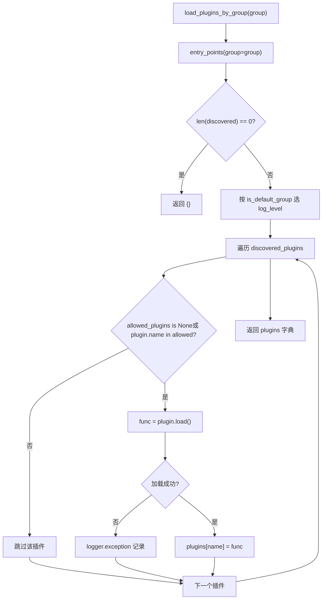
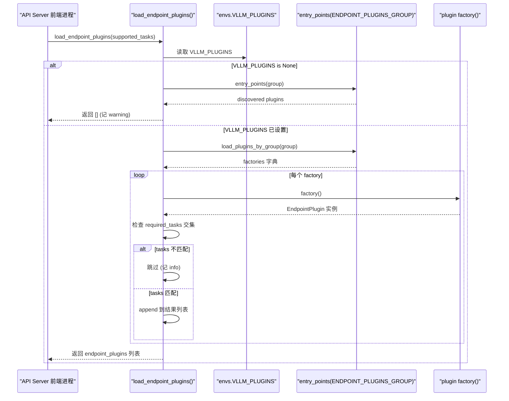

# 第 13 章：プラグインシステムと拡張性：プラットフォーム、IO プロセッサ、エンドポイント拡張

前章では、プレフィックスキャッシュ、投機的デコーディング、LoRA といった高度な機能が、スケジューラ、KV 管理、モデル実行の中核パスに深く結合していることを見た。しかし、推論エンジンが真に本番環境へ進むには、性能だけでは不十分である。より厄介な問題に答えなければならない。コミュニティが新しいハードウェア、新しいマルチモーダル入力形式、またはカスタム HTTP ルートを接続したいとき、コアコードを fork せずにどう実現するか？これこそがプラグインシステムの存在意義である。vLLM のアーキテクチャは本質的にマルチプロセスである。API Server フロントエンドプロセス、EngineCore プロセス、そして各 TP/PP rank に対応する Worker プロセス。もしプラグイン機構が単に「import 時にコードを実行する」だけなら、各プロセスで繰り返し実行されて副作用が積み重なるか、メインプロセスでのみ実行されて Worker が拡張を取得できないかのどちらかになる。本章で解き明かすのは、vLLM が Python 標準の entry_points 機構を、グループ + プロセス境界 + ロードタイミングの三重制約と組み合わせて、すべてのプロセスをカバーしつつ公開範囲を精密に制御できるプラグイン体系をどのように構築しているかである。三つの主線に焦点を当てる。プラットフォームプラグイン（新ハードウェアへの適応）、IO processor プラグイン（マルチモーダル入力処理への介入）、エンドポイントプラグイン（カスタム API ルートの注入）。三者はロード戦略が全く異なり、この差異を理解すれば、vLLM の「拡張能力」と「安全境界」に対するトレードオフの哲学を理解できる。

# 一、プラグインの検出とロード：entry_points のグループ契約

## 直感モデル：プラグインの「放送チャンネル」

vLLM のプラグインシステムを放送チャンネルの集合として想像してみよう。各プラグインパッケージはインストール時に、`setup.py`の`entry_points`を通じてあるチャンネルに自分のコールサイン（plugin name）と応答関数（plugin value）を「登録」する。vLLM は起動時にこれらのチャンネルをスキャンし、どのチャンネルをどのプロセスで「受信」するかを決定する。

この仕組みがなければ、vLLMの拡張はソースコードを変更するしかなく、コミュニティがハードウェアを追加するたびにforkを維持する必要があり、最終的にバージョンが分裂してしまう。グループ化メカニズムの価値は次の点にある：**同じプラグインパッケージを特定のチャンネルにのみ登録でき、それによって特定のプロセスでの読み込みに限定できる**。

## データ構造：5つのグループ定数とグローバルフラグ

vLLMは`vllm/plugins/__init__.py`の先頭で5つのentry point group定数を定義しており、各定数が1つの読み込み戦略に対応する：

[FACT:vllm/plugins/__init__.py:16-30]

```python
DEFAULT_PLUGINS_GROUP = "vllm.general_plugins"
IO_PROCESSOR_PLUGINS_GROUP = "vllm.io_processor_plugins"
PLATFORM_PLUGINS_GROUP = "vllm.platform_plugins"
STAT_LOGGER_PLUGINS_GROUP = "vllm.stat_logger_plugins"
ENDPOINT_PLUGINS_GROUP = "vllm.endpoint_plugins"
```

コメントに重要な情報が隠されている：`DEFAULT_PLUGINS_GROUP`で**すべてのプロセス**読み込み（process0、engine core、worker）；`IO_PROCESSOR_PLUGINS_GROUP` **process0のみで**；`PLATFORM_PLUGINS_GROUP`すべてのプロセスで読み込まれるが、トリガーのタイミングは`current_platform`最初にアクセスされたとき；`STAT_LOGGER_PLUGINS_GROUP`process0のみかつ非同期モードで；`ENDPOINT_PLUGINS_GROUP`API Serverフロントエンドプロセスのみで。

直後にモジュールレベルのグローバル変数`plugins_loaded = False` [FACT:vllm/plugins/__init__.py:32-33]があり、これは冪等読み込みのガードである——コメントには「make sure one process only loads plugins once」と明記されている。

## Step-by-Step：1回の`load_plugins_by_group`の完全な呼び出しフロー

シナリオを当てはめる：ユーザーが`setup.py`に`vllm.general_plugins`の下の`register_dummy_model`を登録し、現在vLLMが起動して、あるプロセスが`load_general_plugins()`。

**を呼び出す** `load_general_plugins`第一步：冪等ガード。`plugins_loaded`まず`True`をチェックし、すでに[FACT:vllm/plugins/__init__.py:77-90]であれば直接**を返す。ここには微妙な点がある：ガードは読み込み**の前に

**セットされる。つまり、後続の読み込みで例外が発生してもリトライされない。これは意図的である——プラグインの読み込み失敗によってプロセスが繰り返し試行すべきではない。**第二步：発見。`load_plugins_by_group`が`importlib.metadata.entry_points(group=group)`に入り、[FACT:vllm/plugins/__init__.py:36-45]を通じてそのグループ下のすべてのインストール済みentry points

**を取得する。空であれば、debugログを記録して空の辞書を返す。**第三步：ログレベル分け。`is_default_group`ソースコードはデフォルトグループと非デフォルトグループのログレベルを区別している：`logger.debug`が真のときは`logger.info` [FACT:vllm/plugins/__init__.py:47-54]を使い、そうでなければ`vllm.general_plugins`を使う。動機は実用的である——

**の下には通常大量のモデル登録プラグインがぶら下がっており、INFOを使うと画面が埋め尽くされる；一方、プラットフォーム/エンドポイントプラグインは数が少なく重要なので、INFOで可視化する価値がある。**第四步：ホワイトリストフィルタリング。`envs.VLLM_PLUGINS`が`None`を読み取り、[FACT:vllm/plugins/__init__.py:62-70]であればすべてを読み込み、そうでなければ名前がリスト内にあるプラグインのみを読み込む`plugin.load()`。なお[FACT:vllm/plugins/__init__.py:68-72]。

**はtry/exceptで包まれており、単一のプラグイン読み込み失敗はexceptionログを記録するだけで、他のプラグインには影響しない**第五步：実行。`load_general_plugins`が`func()` [FACT:vllm/plugins/__init__.py:77-90]に戻り、読み込まれた各関数に対して直接**を呼び出す。これがドキュメントでプラグイン関数が**再入可能（re-entrant）

でなければならないと強調されている理由である——複数のプロセスで複数回呼び出される可能性がある。`load_plugins_by_group`以下のフローチャートは



## コピー

> **[Design Inference & Architectural Trade-offs]**
> 〔設計上の推論とアーキテクチャのトレードオフ〕`entry_points`カスタム設定ファイルではなく**を選んだ核心的な動機は**プラグインをPythonパッケージと一緒に配布できるようにする`pip install vllm-add-dummy-platform`ことである。ユーザーが

---

# した後、プラグインは自動的に対応するグループに現れ、vLLMの設定を手動で編集する必要がない。これはpytest、flake8などのツールのプラグインエコシステムと一脈通じる。代償はプラグイン発見がパッケージのメタデータに依存することであり、プラグインパッケージのインストールが不完全（ソースディレクトリをコピーしただけでpipを通していないなど）だと、entry_pointsはスキャンできない。

## 二、プラットフォームプラグイン：ハードウェア適配の抽象層

`Platform`直感的モデル：プラットフォームは「ハードウェア方言の翻訳者」**クラスはvLLM全体とハードウェアが対話する**唯一の翻訳者`current_platform.get_attn_backend_cls()`、`current_platform.is_cuda_alike()`である。モデルコードは`import torch.cuda`のような抽象メソッドを呼び出すだけで、直接`if device == "xpu"`することは決してない。この抽象層がなければ、新しいハードウェアをサポートするたびにモデルコードに

## の分岐を追加する必要があり、最終的にスパゲッティコードになる。

`Platform`データ構造：Platform基底クラスのフィールドレイアウト`vllm/platforms/interface.py`は純粋クラス（インスタンス化して使用しない）であり、主要なクラス属性は[FACT:vllm/platforms/interface.py:135-179]：

```python
class Platform:
    _enum: PlatformEnum
    device_name: str
    device_type: str
    dispatch_key: str = "CPU"
    ray_device_key: str = ""
    device_control_env_var: str = "VLLM_DEVICE_CONTROL_ENV_VAR_PLACEHOLDER"
    ray_noset_device_env_vars: list[str] = []
    simple_compile_backend: str = "inductor"
    dist_backend: str = ""
    supported_quantization: list[str] = []
    additional_env_vars: list[str] = []
    _global_graph_pool: Any | None = None
```

`_enum`コピー`PlatformEnum`は`is_cuda()`、`is_rocm()`の列挙値であり、[FACT:vllm/platforms/interface.py:69-78]。`device_control_env_var`などの判定を決定する`CUDA_VISIBLE_DEVICES`はプラットフォーム非依存の「デバイス可視性環境変数」抽象である——CUDAは[FACT:vllm/platforms/interface.py:151-152]。`_global_graph_pool`、他のプラットフォームはそれぞれ`get_global_graph_pool`を定義する[FACT:vllm/platforms/interface.py:1210-1215]。

はクラスレベルのCUDA graphメモリプールキャッシュであり、`__getattr__`を通じて遅延初期化される[FACT:vllm/platforms/interface.py:1189-1208]注目すべきは`torch.<device_type>`のフォールバックロジック`current_platform.memory_allocated()`である：Platform上に存在しない属性にアクセスすると、`torch.cuda.memory_allocated()`名前空間から転送を試みる。これによりプラットフォームコードは`__getstate__`と書いて実際には`None`を呼び出せる。しかしソースコードは意図的にdunderメソッドを除外している——そうでなければpickleが[FACT:vllm/platforms/interface.py:1182-1185]。

## をチェックするときに

を取得して呼び出そうとする**Step-by-Step：デバイスIDの3名前空間変換**プラットフォーム抽象で最もつまずきやすいのは[FACT:vllm/platforms/interface.py:275-283]：

- **logical**デバイスID名前空間`_assigned_physical_gpu_ids`
- **visible**である。ソースコードのコメントには3種類の`CUDA_VISIBLE_DEVICES`が明記されている：vLLM内部のlocal rankで、
- **physical**をインデックスする：現在のプロセスが

で再マッピングされた後のtorch/CUDA番号`[4, 5]`：NVMLなどのトポロジAPIが使用するグローバルGPU IDで、環境変数の影響を受けない`CUDA_VISIBLE_DEVICES=4,5`シナリオを当てはめる：あるWorkerプロセスに物理GPU`torch.device("cuda:0")`。

**が割り当てられ、環境変数** `device_id_to_physical_device_id(0)`が設定され、現在local rank 0を`_assigned_physical_gpu_ids`に変換する必要がある`4` [FACT:vllm/platforms/interface.py:296-297]第一步：logical → physical。`device_control_env_var`まず[FACT:vllm/platforms/interface.py:305-311]を調べ、すでに設定されていれば直接インデックスして**を返す。設定されていなければ、**からカンマ区切りリストを分割して0番目の項目[FACT:vllm/platforms/interface.py:296-297]。

**ステップ2：physical → visible。** `logical_device_id_to_visible_device_id(0)`physical`4`を取得した後、環境変数を`[4, 5]`に分割し、`4`のインデックス`0`を見つけて[FACT:vllm/platforms/interface.py:316-339]を返す。physical ID が可視リストにない場合は`RuntimeError`をスローする——これはプロセス間で不可視デバイスが誤用されるのを防ぐハード保護である。

`set_assigned_physical_gpu_ids`の冪等設計も注目に値する：同じ値を繰り返し設定しても何も起こらないが、異なる値を設定すると`RuntimeError` [FACT:vllm/platforms/interface.py:38-56]をスローする。これによりマルチスレッド環境でデバイスマッピングが予期せず上書きされるのを防ぐ。

## プラットフォームプラグインの登録と設定注入

プラットフォームプラグインは`vllm.platform_plugins`グループで登録され、プラグイン関数はプラットフォームクラスの完全修飾名（または`None`で現在の環境が非対応であることを示す）[FACT:docs/design/plugin_system.md:50-50]を返す。ドキュメントに記載された最小実装の要件は[FACT:docs/design/plugin_system.md:100-100]：

- `_enum`通常`PlatformEnum.OOT`（out-of-tree）
- `device_type`に設定され、PyTorch が認識するデバイスタイプ文字列を返す
- `check_and_update_config`は vLLM の初期化の早い段階で呼び出され、**ここで必ず設定する必要がある`worker_cls`**
- `get_attn_backend_cls`アテンションバックエンドのクラス名を返す
- `get_device_communicator_cls`コミュニケータのクラス名を返す

`check_and_update_config`はプラットフォームプラグインで最も重要なフックである[FACT:vllm/platforms/interface.py:583-592]。これは`VllmConfig`参照を受け取りその場で変更し、block size、graph mode などを調整できる。ドキュメントは「最も重要なのは worker_cls をここで設定しなければならないことだ」と強調している[FACT:docs/design/plugin_system.md:105-105]——vLLM はワーカープロセスのインスタンス化にどの Worker クラスを使うかを知る必要があるためである。

## 設計上の考察：block size アラインメントの三段的戦略

プラットフォームインターフェースで最も複雑なロジックは`update_block_size_for_backend` [FACT:vllm/platforms/interface.py:666-708]である。これは三段階に分けて block size とアテンションバックエンドの互換性を確保する：

**Phase 1**：ユーザーが明示的に`--block-size`を指定していない場合、`_preferred_block_size_for_backends`を呼び出してすべてのバックエンドがサポートする最小の block size を選ぶ[FACT:vllm/platforms/interface.py:687-697]。この関数は LCM（最小公倍数）で候補値を列挙する。一部のバックエンド（CPU_MLA など）は倍数ではなく正確なサイズのみを受け入れるためである[FACT:vllm/platforms/interface.py:622-663]。

**Phase 2**：ハイブリッドモデル（attention + mamba）では block と mamba page size をアラインメントする必要がある[FACT:vllm/platforms/interface.py:699-702]。

**Phase 3**：複数の KV dtype が block pool を共有する場合（nvfp4 メイン + 未量子化 skip 層など）、メイン block を最大の padded spec page をカバーできるまで拡大する必要がある[FACT:vllm/platforms/interface.py:704-708]。

> **[Design Inference & Architectural Trade-offs]**
> この段階的設計は vLLM が直面する現実を反映している：異なるハードウェア、異なる量子化スキーム、異なるモデルアーキテクチャが block size に対して課す制約は互いに衝突し、単一の公式では解決できない。段階化により各制約を独立に処理し、最終的にすべての制約を満たす解を取る。

---

# 三、IO Processor とエンドポイントプラグイン：入力処理と API 拡張

## 直感的モデル：IO Processor は「マルチモーダル翻訳層」

マルチモーダルモデル（LLaVA など）の入力は純粋なテキストではなく、テキスト + 画像の混合体である。IO Processor プラグインは生のマルチモーダルデータをモデルが消費できるテンソルに変換し、モデル出力を人間が読める形式に戻す役割を担う。それは税関の通訳者のようなものである：入ってくる外国語（画像/音声）をモデルの母語に翻訳し、出ていくモデルの母語を外国語に翻訳し戻す。

## Step-by-Step：IO Processor の検出とインスタンス化

シナリオ：`io_processor_plugin`フィールドを持つ HF config のモデルをロードする。

**ステップ1：プラグイン名を決定する。** `get_io_processor`明示的に渡された`plugin_from_init`を優先し、そうでなければ`hf_config`の`io_processor_plugin`フィールドから[FACT:vllm/plugins/io_processors/__init__.py:42-50]を読み取る。両方とも空の場合、`None`を返す——このモデルは IO processor を必要としないことを示す[FACT:vllm/plugins/io_processors/__init__.py:52-54]。

**ステップ2：インストール済みのすべてのプラグインをロードする。**を呼び出して`load_plugins_by_group(IO_PROCESSOR_PLUGINS_GROUP)`そのグループ下のすべてのプラグインを取得する[FACT:vllm/plugins/io_processors/__init__.py:59-61]。

**ステップ3：ロード可能なマッピングを構築する。**各プラグインを走査し、その関数を呼び出して`processor_cls_qualname`を取得し、`None`でなければ`loadable_plugins` [FACT:vllm/plugins/io_processors/__init__.py:66-76]に記録する。ここで各プラグインの関数呼び出しも try/except で包まれており、単一の失敗が他に影響しないことに注意。

**ステップ4：検証とインスタンス化。**ロード可能なプラグイン数が 0 の場合、`ValueError`をスローし「IOProcessor プラグインが必要だが一つもインストールされていない」と通知する[FACT:vllm/plugins/io_processors/__init__.py:66-76]。モデルが要求するプラグイン名がロード可能リストにない場合、`ValueError`をスローし利用可能なすべてのプラグイン名を列挙する[FACT:vllm/plugins/io_processors/__init__.py:80-81]。最後に`resolve_obj_by_qualname`を通じてクラス名を解決しインスタンス化する[FACT:vllm/plugins/io_processors/__init__.py:80-81]。

## エンドポイントプラグイン：デフォルト拒否のセキュリティ姿勢

エンドポイントプラグインは本章で最も特殊なカテゴリである。なぜならそれは**デフォルトではロードされない**。`load_endpoint_plugins`のドキュメント文字列がその理由を明確に説明している：エンドポイントプラグインは API Server に HTTP ルートを追加し、ネットワーク露出面を拡大するため、`load_plugins_by_group`よりも厳格な「デフォルト拒否」姿勢を取る[FACT:vllm/plugins/__init__.py:93-94]。

具体的なルールは：プラグイン名が**明示的に`VLLM_PLUGINS`に含まれ**、かつその`required_tasks`が`None`であるか、サーバーがサポートする tasks と交差する場合にのみ、ロードされる[FACT:vllm/plugins/__init__.py:108-108]。

シナリオ：ユーザーがエンドポイントプラグインをインストールしたが`VLLM_PLUGINS`。

**の設定を忘れた**ステップ1：VLLM_PLUGINS が未設定かどうかを確認する。`envs.VLLM_PLUGINS is None`もし[FACT:vllm/plugins/__init__.py:126-126]なら、まずそのグループ下のプラグインを検出し、あれば warning を記録して「明示的な allowlist が必要」と通知する`VLLM_PLUGINS=""`。ソースコードのコメントが特に指摘していることに注意：`[""]`は`None`ではなく[FACT:vllm/plugins/__init__.py:108-108]として解析されるため、「どのプラグインにもマッチしない allowlist」と見なされ、「未設定」とは見なされない`None`。この境界の区別は重要である——空文字列は明示的な「何もロードしない」であり、

**は「未設定」である。**ステップ2：ロードとインスタンス化。`load_plugins_by_group`を通じて`factory()`ファクトリ関数を取得した後、順に[FACT:vllm/plugins/__init__.py:133-141]を呼び出して

**をインスタンス化する**。インスタンス化の失敗は exception を記録して continue する。`plugin.required_tasks`ステップ3：task ゲーティング。`None`をチェックし、`supported_tasks`交差がないため、このプラグインをスキップします[FACT:vllm/plugins/__init__.py:144-145]。これにより、同じプラグインパッケージが異なるタスク（embedding vs generation など）に対して異なるエンドポイントを登録できます。

以下のシーケンス図は、エンドポイントプラグインの発見からロードまでの完全なインタラクションを描写しています：



## 設計上の考察：プロセス境界がロード戦略を決定する

3種類のプラグインのロード戦略の違いは、本質的に**プロセス境界**のマッピングです：

| プラグインタイプ | ロードプロセス | デフォルト動作 | 動機 |
| --- | --- | --- | --- |
| general | すべてのプロセス | すべてロード | モデル登録は各 Worker で可視である必要がある |
| platform | すべてのプロセス | すべてロード | ハードウェア抽象化はすべてのプロセスに依存される |
| io_processor | process0 のみ | すべてロード | 入力処理はフロントエンドでのみ発生する |
| stat_logger | process0 のみ（非同期） | すべてロード | ログはメインプロセスでのみ収集される |
| endpoint | API Server のみ | **デフォルト拒否** | ネットワーク露出面を拡大するため、明示的な認可が必要 |

> **[Design Inference & Architectural Trade-offs]**
> エンドポイントプラグインの「デフォルト拒否」はセキュリティエンジニアリングの標準的な手法です：攻撃面を拡大する拡張はすべて opt-in であるべきです。一方、他のプラグインがデフォルトでロードされるのは、それらがネットワークインターフェースを直接公開せず、コミュニティエコシステムが低摩擦の導入体験を必要としているためです。

## 本番環境の落とし穴：プラグインロード失敗のサイレントデグレード

`load_plugins_by_group`各プラグインの`plugin.load()`を try/except でラップし、失敗時は exception[FACT:vllm/plugins/__init__.py:68-72]のみを記録します。これはつまり**壊れたプラグインが vLLM の起動を妨げることはない**ということですが、明示的なエラーも出ないため——ユーザーは「なぜ自分のプラグインが効かないのか」と困惑する可能性があります。

トラブルシューティングの提案：ログレベルを DEBUG に上げ、`"Failed to load plugin"`を検索してください。プラグインが`vllm.general_plugins`グループにある場合、デフォルトのログレベルは DEBUG であり、ロードの詳細を確認するには明示的に有効化する必要があります[FACT:vllm/plugins/__init__.py:49-50]。

もう一つの落とし穴は`plugins_loaded`ガードのセットタイミング[FACT:vllm/plugins/__init__.py:77-90]です：ロード前に`True`にセットされます。初回ロードが何らかの理由で失敗した場合（entry_points スキャンの異常など）、以降の呼び出しは直接リターンし、リトライされません。これはテスト環境で「プラグインが時々動いたり動かなかったりする」という奇妙な現象を引き起こす可能性があります。

---

# 本章のまとめ

vLLM のプラグインシステムは Python`entry_points`の上に構築されており、**5つのグループ定数**で拡張タイプを分類し、**プロセス境界**でロード範囲を決定し、**`VLLM_PLUGINS`ホワイトリスト**でロードセットを制御します。プラットフォームプラグインは`Platform`基底クラスでハードウェアの差異を抽象化し、そのデバイス ID の3名前空間変換（logical/visible/physical）はプロセス間デバイス管理の核心です；IO processor プラグインは HF config の`io_processor_plugin`フィールドでトリガーされ、マルチモーダル入力の変換を担当します；エンドポイントプラグインは「デフォルト拒否」の姿勢をとり、明示的な allowlist がありかつ task が一致する場合にのみロードされ、ネットワーク露出面を制御します。

3つの主線は同じ発見メカニズムを共有していますが、ロード戦略の違いは vLLM の「拡張の利便性」と「セキュリティ境界」のトレードオフを体現しています：ネットワークを公開しないプラグインはデフォルトでロードされ、ネットワークを公開するプラグインは opt-in でなければなりません。

# 本章の考察とセルフチェック

Q1:`load_plugins_by_group`の`plugin.load()`の try/except を外し、ロード失敗を直接スローさせた場合、vLLM のマルチプロセス起動にどのような影響を与えるか？どのようなシナリオでは、これがむしろより良い設計となるか？

> **[Design Inference & Architectural Trade-offs]**
> **参考解析**：現在の実装では[FACT:vllm/plugins/__init__.py:68-72]単一のプラグインロード失敗がサイレントに飲み込まれ、exception ログのみが記録されます。try/except を外すと、ロード失敗は`load_general_plugins`に伝播し、プロセスの起動を中断します。マルチプロセスシナリオでは、これにより：ある Worker プロセスのプラグインロードが失敗すると、エンジン全体が起動できなくなります——これは良いことかもしれません（高速失敗、一部のプロセスが異常な状態で動作し続けることによる状態の不整合を回避）し、悪いことかもしれません（オプションのプラグインのバグがサービス全体をダウンさせる）。より良い設計は`VLLM_PLUGINS_STRICT`環境変数を導入することかもしれません：デフォルトは寛容（現在の動作）、厳格モードではロード失敗時に例外をスロー。これにより、本番環境では「宣言されたすべてのプラグインが正常にロードされること」を要求でき、開発環境ではフォールトトレランスを維持できます。

Q2: `load_endpoint_plugins`において、`VLLM_PLUGINS=""`と`VLLM_PLUGINS`が未設定（`None`）の場合の動作の違いは何か？ソースコードはなぜこの2つのケースを特意に区別しているのか？

> **[Design Inference & Architectural Trade-offs]**
> **参考解析**：ソースコードのコメントは明確に`VLLM_PLUGINS=""`が`[""]`ではなく`None`として解析されるため、「どのプラグインにもマッチしない allowlist」と見なされる[FACT:vllm/plugins/__init__.py:108-108]と指摘しています。`VLLM_PLUGINS is None`の場合、`load_endpoint_plugins`は直接`[]`を返し warning を記録します[FACT:vllm/plugins/__init__.py:126-126]；一方`VLLM_PLUGINS=""`の場合、コードは`load_plugins_by_group`まで進みますが、空文字列はどのプラグイン名にもマッチしないため、最終的にも空リストを返します。両者の**結果は同じ**（どちらもエンドポイントプラグインをロードしない）ですが、**セマンティクスが異なります**：`None`は「ユーザーが未設定、我々が能動的に拒否し警告する」を意味し、`""`は「ユーザーが明示的に空の allowlist を設定、我々はその意図を尊重し警告しない」を意味します。この区別により、運用担当者は空文字列を設定することで「すべてのエンドポイントプラグインをサイレントに無効化」でき、毎回の起動時の warning ノイズに耐える必要がありません。

Q3: `device_id_to_physical_device_id`において、なぜソースコードは空の`device_control_env_var`を未設定として扱うのか[FACT:vllm/platforms/interface.py:302-308]？この空文字列チェックを外すと、Ray の CPU-only placement group シナリオで何が起こるか？

**参考解析**：ソースコードのコメントは、空の環境変数が Ray が GPU ノード上で CPU-only placement group を起動する際の正当な設定であると説明しています[FACT:vllm/platforms/interface.py:296-297]。もし`!= ""`チェックを外すと、コードは`device_ids = "".split(",")`ブランチに入り、`[""]`を得て、その後`device_ids[device_id]`が空文字列を返し、最終的に`int("")`がスローします`ValueError`。これにより、エンジンは正当な Ray 設定で起動に失敗します。チェックを保持したまま、空の環境変数は`else`分岐へ進み直接`device_id`を返します。つまり、logical ID が physical ID と等しいと仮定します——これは CPU-only のシナリオでは安全です。GPU のマッピングが不要だからです。この事例が示すのは、環境変数の「未設定」と「空に設定」は分散オーケストレーションシステムにおいて意味が異なり、コードは明示的に処理しなければならないということです。

---

次章ではアーキテクチャのトレードオフ、本番環境での落とし穴、そして将来の進化へと移ります。これまでの13章で分解してきたメカニズムを一堂に集め、vLLM が性能、保守性、拡張性の間でどのような取捨選択を行っているかを検証し、推論エンジンの進化の方向性を展望します。

ここまでで、vLLM が entry_points のグループ化メカニズム、プロセス境界を意識したロードタイミング、そしてプラットフォーム、IO processor、エンドポイントという3種類のプラグインの差別化戦略を通じて、コアコードを安定に保ちながら拡張面を開いていることを見てきました。このプラグイン体系により、新しいハードウェア、新しい入力フォーマット、新しい API ルーティングがすべて非侵襲的に接続できますが、拡張性そのものがより多くの权衡すべき次元を意味します。次章では本書を締めくくり、vLLM の主要な設計判断における緊張関係——連続バッチ処理と VRAM 断片化、CUDA Graph と動的シェイプ、分離デプロイとネットワークオーバーヘッド——を体系的に整理し、本番環境での落とし穴リストと診断パスを提示するとともに、Rust フロントエンド、IR 層、異種ハードウェア方向への進化トレンドを展望します。
