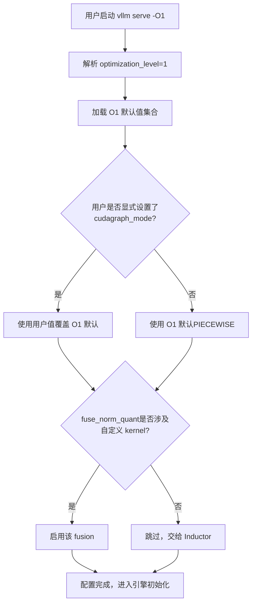
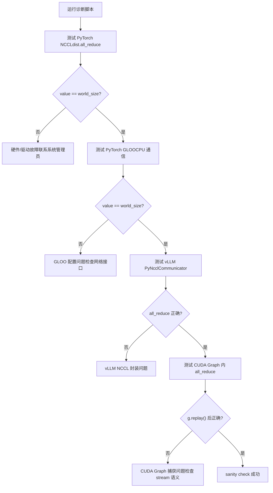
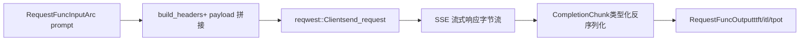

# 第 14 章：アーキテクチャのトレードオフ、本番環境での落とし穴、将来の進化

前章では vLLM のプラグイン化拡張メカニズムを分解し、プラットフォームプラグイン、IO processor プラグイン、エンドポイントプラグインがコアコードを変更せずにエンジンを新しいハードウェア、新しいモダリティ、新しい API に適応させる方法を見てきました。この拡張性により vLLM は変化に迅速に対応できますが、拡張ポイントが増えるほど、本番環境での相互作用パスは複雑になります。VRAM 断片化、NCCL ハンドシェイク失敗、コンパイルキャッシュ無効化、ネットワークジッターといった実際の問題が同時に発生すると、前13章で紹介したメカニズムが互いに引っ張り合い、理想環境では現れなかった緊張関係が露呈します。本章では新しいコアメカニズムを導入せず、これらのメカニズムを一堂に集め、公式 troubleshooting ドキュメントをアンカーとし、Rust フロントエンド bench ツールの設計と組み合わせて、性能と運用性の間の取捨選択を検証し、実行可能な診断パスを提示します。

# 一、最適化レベル：起動時間と実行性能の明示的契約

## 直感的モデル

最適化レベルはカメラの「シーンモード」のようなものです：オートモード（`-O2`）はほとんどのシーンに適していますが、素早くスナップ（デバッグ）したいときはマニュアルモード（`-O0`）に切り替えれば即座に応答します。代償は画質（性能）の低下です。vLLM はこのトレードオフを明示的な4段階の契約とし、数十のブールフラグに隠してユーザーに組み立てさせることはしていません。

## 4段階のフィールドレイアウト

vLLM は`-O0`から`-O3`までの4つのレベルを提供します[FACT:docs/design/optimization_levels.md:5-5]。核心的な設計原則は：**ユーザーが明示的に設定したフラグは最適化レベルのデフォルト値より優先される** [FACT:docs/design/optimization_levels.md:5-5]。つまり、最適化レベルはデフォルト値の集合に過ぎず、ハードな制約ではありません。

`-O0`すべてを無効化：autotuning なし、コンパイルなし、cudagraph なし[FACT:docs/design/optimization_levels.md:32-33]。具体的には4つのスイッチに落とし込まれます：`cudagraph_mode=NONE`、`mode=NONE`、すべての fusion 無効、`enable_flashinfer_autotune=False` [FACT:docs/design/optimization_levels.md:37-40]。

`-O1`は開発シーンのバランスポイント：有効化`PIECEWISE`cudagraph と`VLLM_COMPILE`モード[FACT:docs/design/optimization_levels.md:50-51]。ここに巧妙な細部があります：`fuse_norm_quant`と`fuse_act_quant`はどちらか一方の演算子がカスタム kernel を使用する場合にのみ有効化され、そうでなければ Inductor の自動融合の方が効果的です[FACT:docs/design/optimization_levels.md:61]。これは典型的な「コンパイラと仕事を奪い合わない」という設計判断です。

`-O2`はデフォルト値で、本番向け[FACT:docs/design/optimization_levels.md:66-67]。これは`-O1`をベースに`FULL_AND_PIECEWISE`cudagraph と`fuse_allreduce_rms` [FACT:docs/design/optimization_levels.md:72-73]。`-O3`を追加し、`-O2`現在は[FACT:docs/design/optimization_levels.md:80-81]。

## と同等で、将来のより積極的な実験的最適化のために予約されています

シナリオ駆動の選択フロー`vllm serve model -O1`ユーザーが

コピー`check_user`このフローの鍵は[FACT:docs/design/optimization_levels.md:5-5]分岐にあります：ユーザーの明示的設定が常に優先

## 。これにより「最適化レベルが知らないうちにデバッグフラグを上書きした」といった特定困難な問題を回避できます。

設計上の考察と落とし穴**最適化レベルで最もよくある本番の罠は**起動時間が長すぎる`-O0`ことです。ドキュメントは明確に推奨しています：起動時間が長すぎる場合は`-O1` [FACT:docs/design/optimization_levels.md:87]または`-O0`を使用してください。しかしここには暗黙の代償があります——

では cudagraph がないため、各 kernel の CPU 発行オーバーヘッドが露呈し、高並行シーンではスループットが数倍低下する可能性があります。**もう一つの罠は**。`-O2`コンパイルエラー`FULL_AND_PIECEWISE`です。`-O2`の cudagraph はモデル構造に対してより強い仮定を持ち、一部のカスタムモデルは`-O1`ではコンパイルに失敗しますが`debug_dump_path`では正常です。ドキュメントは[FACT:docs/design/optimization_levels.md:88]を使用してより多くのデバッグ情報を取得することを推奨しています`-O0`。調査パスは次のとおりです：まず`-O1`、`-O2`で機能が正しいことを確認し、段階的に

> **[Design Inference & Architectural Trade-offs]**
> 〔設計推論とアーキテクチャのトレードオフ〕`--enforce-eager`同じ方法論です：まず最も保守的な設定で正確性を確認し、その後段階的に最適化を有効にし、問題を最小の設定差分に切り分けます。

---

# 二、本番環境の落とし穴リスト：症状から根本原因への診断パス

## 直感モデル

本番環境の障害調査は救急トリアージのようなものです：すべての患者に全身検査を行うことはできず、まず症状（OOM、ハング、クラッシュ）に基づいて範囲を素早く絞り込み、その後的を絞って深掘りする必要があります。vLLM のトラブルシューティングドキュメントは本質的にトリアージマニュアルです。

## 症状の分類と診断ツール

ドキュメントでは一般的な問題をいくつかのカテゴリに分類しており、診断難易度の順に整理します。

**第一類：モデルのダウンロード/ロードのハング。**症状は起動後に長時間応答がないことです。根本原因は通常、ネットワークが遅いか共有ファイルシステムが遅いことです[FACT:docs/usage/troubleshooting.md:11-11]。診断手段は`--load-format dummy`重みのロードをスキップし、ダウンロードが遅いのかロードが遅いのかを切り分けることです[FACT:docs/usage/troubleshooting.md:23-23]。これは典型的な「二分法による切り分け」テクニックです。

**第二類：VRAM の OOM。**ドキュメントは直接 conserving_memory 設定ドキュメントを指しています[FACT:docs/usage/troubleshooting.md:23]。しかし本番環境での OOM は多くの場合、モデルが大きすぎるのではなく、KV キャッシュの断片化や同時リクエスト数が想定を超えていることが原因です。

**第三類：生成品質の変化。**これは見落とされがちな落とし穴です。v0.8.0 ではデフォルトのサンプリングパラメータのソースが変更されました：vLLM の中立的なデフォルト値からモデル作者の`generation_config.json` [FACT:docs/usage/troubleshooting.md:23-23]に変更されました。ほとんどの場合これで品質は向上しますが、一部のモデルでは設定がかえって悪化します[FACT:docs/usage/troubleshooting.md:23-23]。診断方法は`--generation-config vllm`にフォールバックして[FACT:docs/usage/troubleshooting.md:23-23]。

**を比較することです**第四類：ハング（hang）。[FACT:docs/usage/troubleshooting.md:41-41]：

- `VLLM_LOGGING_LEVEL=DEBUG`これは最も診断が難しいカテゴリです。ドキュメントでは段階的なデバッグ環境変数のセットが示されています
- `VLLM_LOG_STATS_INTERVAL=1.`：詳細ログを有効化
- `CUDA_LAUNCH_BLOCKING=1`：高頻度出力キューとキャッシュヒット状態
- `NCCL_DEBUG=TRACE`：どの CUDA カーネルで問題が発生しているかを特定
- `VLLM_TRACE_FUNCTION=1`：NCCL 詳細ログを有効化[FACT:docs/usage/troubleshooting.md:41]

：すべての関数呼び出しを記録するが、100 倍以上遅くなる[FACT:docs/usage/troubleshooting.md:11-11]。

## ここで重要な運用規律があります：デバッグ後は必ずこれらの環境変数を無効にするか、新しいシェルを開くことです。そうしないと残留したデバッグ設定がシステムを継続的に遅くします

ブレークポイントデバッグのプロセス境界の罠`pdb`vLLM のマルチプロセスアーキテクチャにより、通常の`BdbQuit` [FACT:docs/usage/troubleshooting.md:45-54]ブレークポイントが機能しなくなります——ブレークポイントが子プロセスで実行されると`forked-pdb` [FACT:docs/usage/troubleshooting.md:57-61]がスローされます。2 つの解決策：`VLLM_ENABLE_V1_MULTIPROCESSING=0`を使用するか、[FACT:docs/usage/troubleshooting.md:63-68]。

> **[Design Inference & Architectural Trade-offs]**
> 〔設計推論とアーキテクチャのトレードオフ〕

## 2 番目の方法は便利ですが、実行モデルが変わります——シングルプロセスモードでは EngineCore と API Server がキューを介して通信しなくなるため、一部の並行バグが再現できなくなる可能性があります。したがって、論理エラーの特定には適していますが、並行問題の再現には適していません。

分散通信の診断**分散デプロイには専用の診断ドキュメントがあります。核心的な推奨事項は：**クラスタ作成時に環境変数を設定する[FACT:docs/serving/distributed_troubleshooting.md:16-16]。

。変数はすべてのノードに伝播するためです。シェルで設定するとローカルノードにのみ影響します`No available node types can fulfill resource request`頻繁に発生する問題は[FACT:docs/serving/distributed_troubleshooting.md:16-16]です。クラスタに十分な GPU があっても`VLLM_HOST_IP`が発生します。根本原因は通常、ノードに複数の IP があり、vLLM が間違ったものを選択していることです。解決策は`ray status`で明示的に指定し、[FACT:docs/serving/distributed_troubleshooting.md:16-16]。

## で検証することです

NCCL 初期化失敗の診断スクリプト[FACT:docs/usage/troubleshooting.md:89-150]ドキュメントでは完全な診断スクリプトが提供されており、通信スタックを層ごとに検証します

コピー[FACT:docs/usage/troubleshooting.md:90-146]このスクリプトの巧妙な点は、層ごとに切り分けることです：まず最下層の PyTorch NCCL を検証し、次に CPU 側の GLOO を検証し、次に vLLM 自身の PyNcclCommunicator ラッパーを検証し、最後に CUDA Graph 内の通信を検証します

。各層の失敗は異なる根本原因を指し示します。`pynccl.disabled = False`スクリプトの中で注目すべき詳細：[FACT:docs/usage/troubleshooting.md:121-125]は 0.6.4 以下との後方互換性のためです

。0.6.5+ ではデフォルトで有効ですが、この行を残すことで最新ドキュメントを読むユーザーが混乱しないようにしています。`--rdzv_backend=static`マルチノードテスト時、ドキュメントでは意図的に`c10d`ではなく`c10d`を使用しています。なぜなら[FACT:docs/usage/troubleshooting.md:168-168]はマルチノード下で DNS 解決失敗により

## になるからです。これは典型的な「経験しないとわからない」設定です。

**設計上の考察と落とし穴**（`ncclCommInitRank`NCCL 初期化失敗`IPC_LOCK`は unhandled system error を報告）は通常 2 つの根本原因を指します：`/dev/shm`capability の欠如または[FACT:docs/usage/troubleshooting.md:311-311]がマウントされていないこと

**。これらはどちらもコンテナ化デプロイの典型的な罠です。**（`the provided PTX was compiled with an unsupported toolchain`CUDA PTX ツールチェーンの不一致[FACT:docs/usage/troubleshooting.md:325-327]）は、wheel 内の PTX がより高いバージョンの CUDA toolkit でコンパイルされていることを示します`-e VLLM_ENABLE_CUDA_COMPATIBILITY=1` [FACT:docs/usage/troubleshooting.md:325-327]。解決策は CUDA forward compatibility を有効にすることです：Docker では`cuda-compat`を追加し、ベアメタルでは`VLLM_CUDA_COMPATIBILITY_PATH` [FACT:docs/usage/troubleshooting.md:325-327]。

**パッケージをインストールして**：vLLM `>= 0.4.3, <= 0.10.1.1`を設定します`NCCL_CUMEM_ENABLE=0`既知の NCCL メモリオーバーヘッド問題[FACT:docs/usage/troubleshooting.md:375]は[FACT:docs/usage/troubleshooting.md:375]を設定して NCCL バグを回避します。外部プロセスが vLLM に接続する際もこの変数を設定する必要があり、そうしないとハングまたはクラッシュします**。NCCL 2.22.3 で修正された後、新しいバージョンではパフォーマンス最適化を可能にするためこのオーバーライドが削除されました**。このケースが示すのは：

---

# プロセス間の環境変数契約は分散システムの暗黙的な依存関係である

## ということです。アップグレード時には同期する必要があります。

三、Rust フロントエンド：bench ツールのゼロコピー設計哲学

## 直感モデル

bench ツールの核心的なデータ構造は`RequestFuncInput` [FACT:rust/src/bench/src/backends/mod.rs:59-89]です。これは`Arc<str>`と`Arc<[u32]>`を多用し、`String`/`Vec`ではなく、これがゼロコピー設計の核心です。

いくつかの重要なフィールドを見てみましょう：`prompt: Arc<str>` [FACT:rust/src/bench/src/backends/mod.rs:50-52]——複数の並行リクエストが同じ prompt 文字列を共有でき、各リクエストがクローンするのを避けます。`prompt_token_ids: Option<Arc<[u32]>>` [FACT:rust/src/bench/src/backends/mod.rs:77]——事前計算された token ID を直接サーバーに送信し、サーバー側の tokenization をスキップします[FACT:rust/src/bench/src/backends/mod.rs:74-76]。

最も巧妙なのは`multi_modal_content: Option<Arc<[Arc<str>]>>` [FACT:rust/src/bench/src/backends/mod.rs:81]です。コメントの説明：マルチモーダルコンテンツは事前シリアライズされた JSON フラグメントとして、chat backend が直接 payload バイトストリームに結合し、base64 画像データの解析や深いコピーを一切避けます[FACT:rust/src/bench/src/backends/mod.rs:78-80]。これは二層の`Arc`構造です：外層は`Arc<[...]>`で配列全体を共有し、内層は`Arc<str>`で個々のフラグメントを共有します。

`chat_messages_json: Option<Arc<str>>`は最優先で、そのまま payload に結合されます[FACT:rust/src/bench/src/backends/mod.rs:82-85]。

## ゼロアロケーション逆シリアライズ

SSE ストリーミングレスポンスの解析はもう一つのパフォーマンスの鍵です。コメントは明確に指摘しています：型付き逆シリアライズを使用して完全な`serde_json::Value`ツリーの構築を避け、必要なフィールドのみを抽出します[FACT:rust/src/bench/src/backends/mod.rs:20-24]。

`CompletionChunk`は`choices`と`usage`の二つのフィールドのみを保持します[FACT:rust/src/bench/src/backends/mod.rs:20-24]，`ChatChunk`同様に[FACT:rust/src/bench/src/backends/mod.rs:33-37]。`#[serde(default)]`は欠落した`choices`フィールドをデフォルトで空の配列にします[FACT:rust/src/bench/src/backends/mod.rs:20-24]、これはストリーミングレスポンスでよくあるケースです。

## シナリオ駆動のリクエストフロー

ベンチマークリクエストが送信されると、データはどのように流れるのか？以下のデータフロー図は入力から出力への変換を示しています：

`Backend`列挙型は静的ディスパッチを使用して async trait object の問題を回避します[FACT:rust/src/bench/src/backends/mod.rs:150-154]。`send_request``match`を通じて具体的な実装にディスパッチします[FACT:rust/src/bench/src/backends/mod.rs:158-168]。`get_backend``BackendKind`に基づいて対応するバックエンドを返します[FACT:rust/src/bench/src/backends/mod.rs:172-181]。

一つの詳細：`API_KEY`は`OnceLock`でキャッシュし、各リクエストが環境変数の syscall を行うのを避けます[FACT:rust/src/bench/src/backends/mod.rs:186-188]。`build_headers`順に Content-Type、Authorization、extra headers、request-id を挿入します[FACT:rust/src/bench/src/backends/mod.rs:191-215]。

## 設計上の考察と落とし穴

> **[Design Inference & Architectural Trade-offs]**
> Rust bench ツールのゼロコピー設計は重要な判断を反映しています：**ベンチマークツールのクライアントオーバーヘッドが測定誤差の源になる**。もし各リクエストが prompt をクローンし、完全な JSON を解析し、base64 画像を深くコピーするなら、測定されたレイテンシにクライアントオーバーヘッドが混入し、サーバーのパフォーマンスを真に反映できません。`Arc`で不変データを共有し、型付き逆シリアライズで無関係なフィールドをスキップすることは、本質的にクライアントオーバーヘッドをほぼゼロに抑えることです。

`RequestFuncOutput`のフィールド設計も注目に値します：`ttft`（time to first token）、`itl`（inter-token latency 配列）、`tpot`（time per output token）[FACT:rust/src/bench/src/backends/mod.rs:93-105]。これら三つの指標はそれぞれ異なるパフォーマンス次元に対応します：TTFT は prefill とキューイング遅延を反映し、ITL は decode の安定性を反映し、TPOT は全体的なスループットを反映します。ベンチマーク時に平均レイテンシだけを見ると、ITL のジッターが隠蔽されます。

---

# 設計思考：アーキテクチャトレードオフの根本的な論理

本章と前の十三章のメカニズムを一緒にすると、vLLM のいくつかの核心的なトレードオフラインが見えてきます。

> **[Design Inference & Architectural Trade-offs]**
> **連続バッチ処理 vs メモリ断片化。**連続バッチ処理はバッチを各ステップで再編成し、スループットを大幅に向上させますが、代償として KV cache の割り当てと解放が極めて頻繁になります。PagedAttention のブロックテーブルメカニズムはまさにこの高頻度割り当てに対応するためのものです——固定サイズのブロックは外部断片化を排除しますが、ブロックテーブルの間接アドレッシングオーバーヘッドと内部断片化（最後のブロックが埋まらない可能性）を導入します。これは典型的な「間接層で断片化率を交換する」トレードオフであり、OS の仮想メモリページングと同じ考え方です。

**CUDA Graph vs 動的形状。**CUDA Graph は静的形状を要求しますが、連続バッチ処理のバッチサイズは各ステップで変わります。vLLM の解決策は`PIECEWISE`と`FULL_AND_PIECEWISE`モードです[FACT:docs/design/optimization_levels.md:50,72]——静的にできる部分をグラフとしてキャプチャし、動的部分は eager のままにします。`-O0`cudagraph を完全に無効にするのはデバッグ用で、`-O2`全開は本番用、中間の`-O1`は折衷案です。

**分離デプロイ vs ネットワークオーバーヘッド。**KV Connector により prefill と decode を異なるインスタンスに分離できますが、KV cache のインスタンス間転送はネットワーク遅延を導入します。ドキュメントの GPUDirect RDMA の設定要件（`IPC_LOCK`、`/dev/shm`）[FACT:docs/usage/troubleshooting.md:311-311]はこのパスがインフラに厳格な要件を持つことを示しています。ネットワークジッターは KV 転送のタイムアウトを引き起こし、再試行や降格をトリガーします。

**運用性 vs パフォーマンス。**最適化レベル、デバッグ環境変数、診断スクリプト、これらは運用性のために支払うコストです。`VLLM_TRACE_FUNCTION=1`は 100 倍遅くなります[FACT:docs/usage/troubleshooting.md:41]が、ハング問題を特定する最後の手段です。成熟したエンジンはこれらの「遅いが明確に見える」ツールを提供する必要があります。

---

# 本章のまとめ

本章は本書を締めくくり、前の十三章のメカニズムを本番の視点で再検討します。

最適化レベル（`-O0`から`-O3`）は起動時間と実行パフォーマンスの明示的な契約であり、ユーザーフラグは常にレベルのデフォルト値より優先されます[FACT:docs/design/optimization_levels.md:5-5]。本番の落とし穴チェックリストは、モデルロード、メモリ OOM、生成品質の変化から分散通信の失敗までの完全な診断パスをカバーし、核心的な方法論は「二分法による分離」と「層ごとの検証」です。Rust bench ツールは`Arc`共有と型付き逆シリアライズでクライアントオーバーヘッドをほぼゼロに抑え、ベンチマーク数値がサーバーのパフォーマンスを真に反映することを保証します。

三つの核心的なトレードオフの線が全書を貫いている：連続バッチ処理とVRAM断片化、CUDA Graphと動的形状、分離型デプロイとネットワークオーバーヘッド。これらの緊張関係を理解することは、いかなる単一のメカニズムを覚えるよりも重要である——なぜなら、本番環境でのあらゆるチューニングは、本質的にこれらの緊張関係の間でバランスポイントを見つけることだからである。

# 本章の考察とセルフチェック

Q1: もし`-O2`の`FULL_AND_PIECEWISE`cudagraphを`-O1`の`PIECEWISE`に変更した場合、どのようなシナリオで性能回退が発生するか？なぜか？

**参考解説**：`-O2`は`-O1`を基に`FULL_AND_PIECEWISE`cudagraphモード[FACT:docs/design/optimization_levels.md:72]。`FULL`モードはフォワードパス全体を一つのグラフとしてキャプチャするが、`PIECEWISE`は静的にできる部分のみをキャプチャする。バッチ形状が安定した本番シナリオでは、`FULL`モードはより多くのkernel発射オーバーヘッドを排除でき、スループットが高い。しかし、モデルに動的制御フロー（MoEのtokenルーティングなど）が含まれる場合、`FULL`モードはキャプチャできないか、キャプチャ後に異常な動作をする可能性があり、その場合は`PIECEWISE`の方がむしろ安定している。性能回退が発生するのは：バッチサイズが頻繁に変化して`FULL`グラフがヒットしない場合、またはモデル構造が`FULL`モードのフォールバックパスをトリガーする場合である。調査方法は、まず`-O1`でベースラインを確認し、次に`-O2`に上げて比較し、`VLLM_LOG_STATS_INTERVAL=1.`でキューの状態を観察する[FACT:docs/usage/troubleshooting.md:41-41]。

Q2: 診断スクリプトにおいて、vLLM PyNcclCommunicatorをテストする前にPyTorch GLOOを先にテストするのはなぜか？GLOOテストをスキップして直接PyNcclをテストすると何を見落とすか？

**参考解説**：スクリプトの実行順序はPyTorch NCCL → PyTorch GLOO → vLLM PyNccl → CUDA Graph[FACT:docs/usage/troubleshooting.md:90-146]である。GLOOはCPU側の通信をテストし[FACT:docs/usage/troubleshooting.md:106-112]、vLLMの`PyNcclCommunicator`はbootstrapとしてGLOO groupを必要とする[FACT:docs/usage/troubleshooting.md:120]。GLOOテストをスキップすると、PyNcclの初期化が失敗した場合に、NCCL自体の問題なのかGLOO bootstrapの問題なのかを区別できない。GLOOはネットワークインターフェース設定（`GLOO_SOCKET_IFNAME`）[FACT:docs/usage/troubleshooting.md:81-81]に依存し、複雑なネットワーク環境ではこれが高頻度の障害点となる。層ごとにテストする価値は、障害を最小の設定差異に隔離できることにある。

Q3: Rust benchツールが`Arc<str>`でpromptを共有しているが、負荷テストシナリオで各リクエストが異なるpromptを送信する必要がある場合、この設計は無効になるか？なぜか？

**参考解説**：`Arc<str>`の設計目標は、複数の並行リクエストが同一の不変文字列[FACT:rust/src/bench/src/backends/mod.rs:50-52]を共有することである。各リクエストのpromptが異なる場合、`Arc`の共有優位性は確かに消失する——各リクエストが自身の`Arc<str>`を構築する必要がある。しかし設計は無効ではない：`Arc<str>`は`String`と比較して、リクエストの流転過程における複数回のクローン（入力キューからbackendへ、さらにpayload構築へ渡すなど）を依然として回避している。真のゼロコピー最適化は`prompt_token_ids: Option<Arc<[u32]>>` [FACT:rust/src/bench/src/backends/mod.rs:77]にある——promptテキストが異なっても、事前計算されたtoken ID配列は`Arc`を通じてリクエストライフサイクル内で共有でき、重複割り当てを回避できる。負荷テストツールの設計前提は「同一promptの高並行」または「事前計算token ID」であり、前者は`Arc<str>`でテキストを共有し、後者は`Arc<[u32]>`でtokenシーケンスを共有する。

---

ここに至り、全書十四章のソースコード解説は一区切りとなる。我々は一度のAPI呼び出しから出発し、スケジューラ、KV cacheマネージャ、アテンションバックエンド、分散通信層を経て、最終的にGPU kernelの発射点に到達し、そして本番運用の診断台に戻ってきた。vLLMのあらゆる設計決定の背後には明確なトレードオフがあり、これらのトレードオフを理解してこそ、新しいハードウェア、新しいモデル、新しい負荷に直面したときに正しいエンジニアリング判断ができる。推論エンジンの進化は止まらない——Rustフロントエンド、IR層、異種ハードウェアサポートが急速に進んでいる——しかし、底層のトレードオフの論理は安定しており、これこそが本書が伝えたい核心的な能力である。

ここに至り、我々はリクエストの入口からGPU Kernelまでの完全な旅を歩み終え、また本番環境においてシステムを「動く」から「安定して動く」に変えるトレードオフと落とし穴も明らかにした。vLLMの進化は現在のアーキテクチャで止まることはなく、より効率的なアテンション実装、よりスマートなスケジューリング戦略、よりシームレスな異種サポートが進行中である。しかし未来がどう変わろうとも、これらのメカニズム間の緊張関係と取捨選択を理解することが、常に推論エンジンを操る鍵である。
