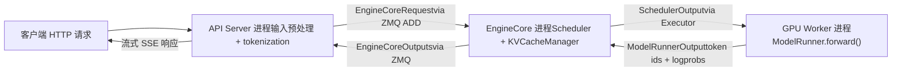
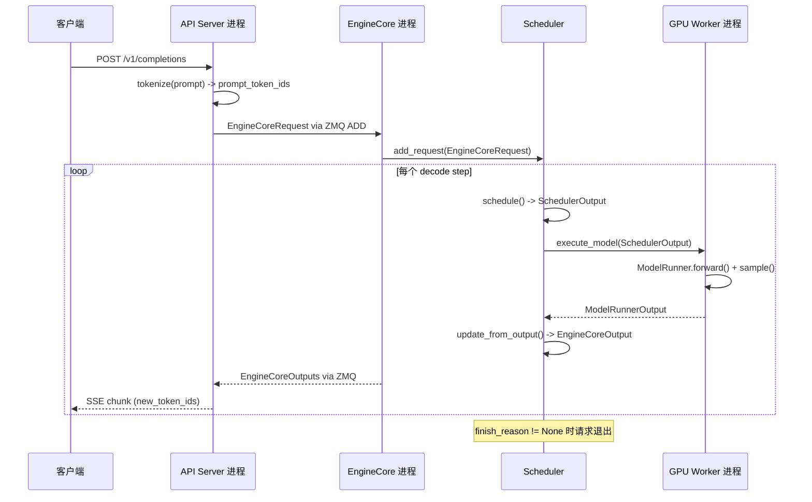

# 제 1 장: vLLM의 설계 철학과 전체 아키텍처 조감

A100 한 장을 가지고 LLaMA-7B로 온라인 추론 서비스를 제공하려 한다고 가정하자. 가장 단순한 방법은: 요청이 오면 model.generate()를 한 번 실행하고 결과를 반환하는 것이다. 이 방식은 동시성이 올라가면 즉시 무너진다 — GPU 연산 능력이 부족해서가 아니라 두 가지 이유 때문이다: 첫째, VRAM이 파편화로 소모된다. 자기회귀 생성은 각 레이어의 Key/Value 텐서(KV Cache)를 캐싱해야 한다. 만약 각 요청이 max_model_len에 따라 연속된 VRAM 블록 전체를 사전 할당한다면, 4096 token 요청 하나가 수십 MB를 차지하게 되지만 실제 생성되는 시퀀스는 200 token에 불과할 수 있다. 더 나쁜 것은, 서로 다른 길이의 요청이 교차로 드나들면서 연속 VRAM 블록이 조각조각 잘려나가, 최종적으로 총량은 충분한데 충분히 큰 연속 공간을 찾지 못하는 상황이 발생한다 — 이것이 전형적인 VRAM 파편화 문제다. 둘째, 배치 처리 효율이 낮다. 전통적인 정적 배치 처리는 하나의 batch 안의 모든 요청이 동시에 시작하고 동시에 끝나야 한다. 하지만 생성 작업의 출력 길이는 본질적으로 예측 불가능하다: 어떤 요청은 10개 token에서 멈추고, 다른 요청은 2000개를 생성해야 할 수 있다. 짧은 요청이 끝나면, 그것이 차지한 batch 슬롯은 긴 요청이 끝날 때까지 빈 채로 기다릴 수밖에 없고, GPU 활용률은 절벽처럼 떨어진다. vLLM의 두 가지 설계 초석은 바로 이 두 가지痛点을 겨냥한다: PagedAttention은 페이징 메커니즘으로 VRAM 파편화를 제거하고, Continuous Batching은 반복 수준 스케줄링으로 배치 처리 공회전을 제거한다. 이 장에서는 이 두 메커니즘의 구현 세부사항을 깊이 다루지 않고(그것은 제 2, 4장의 주제다), 먼저 전체 지도를 구축한다: vLLM v1의 프로세스 아키텍처는 어떤 모습인지, 각 계층의 책임은 어떻게 나뉘는지, 하나의 요청이 시스템에 들어와 token을 토해내기까지 어떤 컴포넌트를 통과하는지. 이 지도를 이해해야 이후 각 장의 소스코드 해설이 발판을 가질 수 있다.

# 프로세스 아키텍처: 왜 vLLM은 단일 프로세스 프로그램이 아닌가

## 직관적 모델

vLLM을 식당이라고 상상해 보자. 프런트(API Server)는 손님을 맞이하고 주문을 기록하며, 주방 핵심(EngineCore)은 어떤 요리를 먼저 만들지, 어느 화구를 사용할지 결정하고, 각 화구(GPU Worker)는 한 명의 요리사가 독점적으로 조작한다. 한 사람이 접객과 요리를 동시에 한다면, 피크 시간에는 반드시 손이 꼬이게 된다 — 이것이 vLLM이 이러한 역할을 독립 프로세스로 분리하는 이유다.

> **[Design Inference & Architectural Trade-offs]**
> 이러한 다중 프로세스 분리의 핵심 동기는**관심사 분리**다: HTTP 파싱, tokenization, 멀티모달 데이터 로딩은 CPU 집약적이고 블로킹될 수 있는 작업인 반면, 모델 순전파는 GPU 집약적이다. 만약 같은 프로세스에 둔다면, Python의 GIL이 둘을 서로 끌어내리게 할 것이다. 독립 프로세스로 분리하면, API Server는 지속적으로 새 요청을 받고, EngineCore는 지속적으로 스케줄링하며, GPU Worker는 지속적으로 연산할 수 있고, 셋은 ZMQ 메시지 큐를 통해 디커플링된다.

## 프로세스 토폴로지와 수량 관계

vLLM v1의 프로세스 아키텍처는 하나의 공식으로 요약할 수 있다.`N`개의 GPU, 텐서 병렬도`TP`, 파이프라인 병렬도`PP`, 데이터 병렬도`DP`, API Server 수`A`인 배포에 대해:

| 프로세스 유형 | 수량 | 책임 |
| --- | --- | --- |
| API Server | `A`(기본값은`DP`） | HTTP 요청 처리, 입력 전처리, 결과 스트리밍 반환 |
| EngineCore | `DP`(기본값 1) | 스케줄링, KV Cache 관리, GPU Worker 조정 |
| GPU Worker | `N`（= `DP × PP × TP`） | 가중치 로딩, 순전파 실행, VRAM 관리 |
| DP Coordinator | `DP > 1`일 때 1, 그렇지 않으면 0 | DP 랭크 간 로드 밸런싱과 MoE 웨이브 조정 |

[FACT:docs/design/arch_overview.md:113-113]이 표의 권위 있는 정의를 제시한다. 전형적인 단일 머신 4-GPU 배포(`vllm serve -tp=4`)는 1개의 API Server + 1개의 EngineCore + 4개의 GPU Worker = 6개의 프로세스를 생성한다[FACT:docs/design/arch_overview.md:115-115]. 반면 8-GPU TP=2/DP=4 배포는 4 + 4 + 8 + 1 = 17개의 프로세스로 팽창한다[FACT:docs/design/arch_overview.md:123-123]。

여기서 간과하기 쉬운 세부 사항이 있다:**API Server의 수는 기본적으로 DP 크기를 따른다**.`--data-parallel-size 4`일 때 4개의 API Server가 자동으로 시작되며, 각각은 ZMQ를 통해 다대다 토폴로지로 모든 EngineCore에 연결된다[FACT:docs/design/arch_overview.md:73-73]. 이는 어떤 API Server든 어떤 EngineCore로든 요청을 라우팅할 수 있음을 의미하며, 단일 지점 병목을 방지한다.

## 데이터 흐름

아래 그림은 하나의 요청이 프로세스 간에 흐르는 전체 경로를 보여준다. 각 노드에 표시된 것은 실제 클래스 이름과 데이터 구조임에 주목하라:



이 그림의 핵심은:**API Server와 EngineCore 사이는 비동기 메시지 전달**이며, 함수 호출이 아니다. 요청은`EngineCoreRequest`구조체(`msgspec.Struct`,[FACT:vllm/v1/engine/__init__.py:109-113]참조)로 직렬화되어 ZMQ의`ADD`메시지 타입을 통해 전송된다[FACT:vllm/v1/engine/__init__.py:287-299]. EngineCore가 처리를 마치면 결과를`EngineCoreOutputs`로 패키징하여 반환한다[FACT:vllm/v1/engine/__init__.py:256-260]。

> **[Design Inference & Architectural Trade-offs]**
> gRPC나 공유 메모리 대신 ZMQ를 선택한 이유는 ZMQ가 프로세스 간 통신 시나리오에서 지연이 극히 낮고(마이크로초 수준), 다대다 토폴로지와 메시지 큐 의미론을 자연스럽게 지원하기 때문이다. 첫 토큰 지연에 민감한 추론 서비스 시나리오에서는 통신 오버헤드가 가능한 한 작아야 한다.

## 설계 고찰: EngineCore가 스레드가 아닌 독립 프로세스인 이유

자연스러운 질문이 하나 있다: EngineCore와 API Server가 같은 머신에 있으니, 왜 같은 프로세스에 두고 스레드로 통신하지 않는가?

답은 EngineCore의 작업 모드에 숨어 있다. EngineCore는**바쁜 루프**(busy loop)를 실행하며, 지속적으로 요청을 스케줄링하고 GPU Worker에 작업을 분배한다[FACT:docs/design/arch_overview.md:73-73]. 이 루프는 중단될 수 없다——HTTP 파싱이나 토큰화에 의해 블로킹되면 전체 추론 파이프라인에 버블이 발생한다. 독립 프로세스는 EngineCore의 CPU 시간 슬라이스가 프런트엔드 로직에 의해 선점되지 않도록 보장한다.

또한 독립 프로세스는**장애 격리**를 제공한다: API Server가 어떤 잘못된 요청 때문에 크래시하더라도 EngineCore와 GPU Worker는 영향을 받지 않고, 다른 API Server가 전달한 요청을 계속 서비스할 수 있다.

# 계층적 멘탈 모델: 진입점에서 GPU까지의 책임 경계

## 직관적 모델

프로세스 아키텍처가 "누가 어디서 일하는가"라면, 계층 모델은 "각 계층이 어떤 결정을 담당하는가"이다. vLLM의 코드 구성은 명확한 계층 원칙을 따른다:**상위 계층은 무엇을 할지 결정하고, 하위 계층은 어떻게 할지 결정한다**. 진입 계층은 어떤 요청을 받을지 결정하고, 엔진 코어 계층은 누구를 먼저 처리할지 결정하며, 실행기 계층은 어떤 병렬 전략을 사용할지 결정하고, Worker 계층은 구체적 하드웨어에서 어떻게 결과를 낼지 결정한다.

## 4계층 구조

**진입 계층(Entrypoints)**은 두 가지 상호작용 방식을 제공한다: 오프라인 추론의`LLM`클래스와 온라인 서비스의`vllm serve`명령[FACT:docs/design/arch_overview.md:16-16][FACT:docs/design/arch_overview.md:56-56]. 이 계층의 핵심 책임은 입력 전처리——토큰화, 멀티모달 데이터 로딩, 샘플링 파라미터 파싱——그리고 출력의 역토큰화와 스트리밍 반환이다. 스케줄링 전략에는 관심이 없고 GPU도 건드리지 않는다.

**엔진 코어 계층(EngineCore)**은 전체 시스템의 두뇌이다. Scheduler(각 decode step에서 어떤 요청을 처리할지 결정)와 KV Cache Manager(페이지드 VRAM 관리)를 보유하며, Executor 추상을 통해 GPU Worker와 통신한다[FACT:docs/design/arch_overview.md:79-85]. 이 계층의 핵심 설계는**스케줄링과 실행의 분리**이다: Scheduler는 "이 단계에서 어떤 토큰을 실행할지"에 대한 결정(`SchedulerOutput`)만 산출하고, 구체적으로 GPU에서 어떻게 실행할지는 Worker의 몫이다.

**실행기 계층(Executor)**은 EngineCore와 Worker 사이의 다리이다. 분산 실행 전략을 캡슐화한다——단일 프로세스는`UniProcExecutor`, 다중 프로세스는`MultiprocExecutor`, Ray 클러스터는`RayDistributedExecutor`. Executor의 추상 인터페이스 덕분에 EngineCore는 하위가 단일 GPU인지 8-GPU TP인지 알 필요가 없다.

**Worker 계층**은 GPU마다 하나의 Worker 프로세스이며, 내부에 ModelRunner와 실제`torch.nn.Module`모델 객체를 보유한다[FACT:docs/design/arch_overview.md:171-191]. ModelRunner는 입력 텐서 준비, CUDA Graph 캡처, 순전파 계산 실행을 담당한다. 이 계층은 GPU VRAM과 CUDA 스트림을 직접 조작하는 유일한 곳이다.

## 구성 객체: 모든 계층을 관통하는 전역 상태

4계층 사이에서 정보는 무엇으로 전달되는가? 답은`VllmConfig`——모든 구성을 담은 거대한 dataclass이다[FACT:vllm/config/vllm.py:357-357]。

```python
@config(config=ConfigDict(arbitrary_types_allowed=True))
class VllmConfig:
    """Dataclass which contains all vllm-related configuration."""
    model_config: ModelConfig = None
    cache_config: CacheConfig = Field(default_factory=CacheConfig)
    parallel_config: ParallelConfig = Field(default_factory=ParallelConfig)
    scheduler_config: SchedulerConfig = Field(default_factory=SchedulerConfig.default_factory)
    # ... 还有 20+ 个子配置
```

[FACT:vllm/config/vllm.py:363-371]는 핵심 필드를 보여준다. 이 설계 선택의 배경 논리는 더 자세히 살펴볼 가치가 있다.

> **[Design Inference & Architectural Trade-offs]**
> 문서에서 왜 분산된 매개변수 전달 대신 하나의 큰 구성 객체를 사용하는지 명확히 설명합니다:**확장성**. ModelRunner에만 영향을 주는 새로운 기능을 추가한다고 가정하면,`VllmConfig`에 필드 하나만 추가하면 되고, ModelRunner가 직접 읽으면 되므로 Engine, Worker, Model의 생성자 시그니처를 수정할 필요가 없습니다[FACT:docs/design/arch_overview.md:203-203]. 빠르게 진화하는 추론 프레임워크에서 이러한 「필드 추가 시 인터페이스 불변」 능력은 개발 마찰을 크게 줄여줍니다.

대가는`VllmConfig`이 극도로 거대해진다는 것입니다——[FACT:vllm/config/vllm.py:356-3509]에서 볼 수 있듯이, 이 클래스는 3000줄이 넘는 코드에 걸쳐 있으며 수십 개의 필드와 검증 메서드를 포함합니다.`__post_init__`메서드[FACT:vllm/config/vllm.py:1405-2317]은 900줄이 넘으며, 모든 구성 항목 간의 교차 검증과 기본값 도출을 담당합니다.

## 구성의 해시와 캐싱

`VllmConfig`에는 간과하기 쉽지만 매우 중요한 능력이 하나 더 있습니다:`compute_hash()` [FACT:vllm/config/vllm.py:464-580]. 이는 계산 그래프 구조에 영향을 주는 모든 구성 항목에 대해 짧은 해시를 생성합니다.

```python
def compute_hash(self, include_version: bool = True) -> str:
    factors: list[Any] = []
    vllm_factors: list[Any] = []
    if include_version:
        from vllm import __version__
        vllm_factors.append(__version__)
    if self.model_config:
        vllm_factors.append(self.model_config.compute_hash())
    # ... 逐个追加各子配置的哈希
    hash_str = safe_hash(str(factors).encode(), usedforsecurity=False).hexdigest()[:10]
    return hash_str
```

[FACT:vllm/config/vllm.py:479-580]은 전체 해시 계산 흐름을 보여줍니다. 주석의 경고에 주목하세요: 「Whenever a new field is added to this config, ensure that it is included in the factors list if it affects the computation graph」[FACT:vllm/config/vllm.py:465-467]。

> **[Design Inference & Architectural Trade-offs]**
> 이 해시의 용도는**torch.compile 캐시 키**입니다. vLLM은`torch.compile`으로 모델 전방 그래프를 컴파일하고, 컴파일 결과는 디스크에 캐시됩니다. 다음 시작 시 구성 해시가 동일하면 컴파일 캐시를 직접 재사용하여 시간이 많이 걸리는 컴파일 과정을 건너뛸 수 있습니다. 계산 그래프에 영향을 주는 구성 항목이 해시에 포함되지 않으면 캐시 히트 오류가 발생합니다——이전 구성으로 컴파일된 그래프를 새 구성으로 실행하여 결과가 조용히 잘못됩니다. 이것이 주석에서 「계산 그래프에 영향을 주는 필드는 반드시 해시에 포함해야 한다」고 반복 강조하는 이유입니다.

# 요청 라이프사이클 Walkthrough: HTTP에서 Token까지

## 시나리오 설정

클라이언트가`vllm serve`으로 시작된 서비스에 OpenAI 호환`/v1/completions`요청을 보낸다고 가정합니다. prompt는 "The capital of France is"이고, 16개의 token 생성을 요구합니다. 소스 코드를 따라 이 요청의 전체 여정을 추적해 봅시다.

## Step 1: API Server 수신 및 전처리

API Server 프로세스가 HTTP 요청을 받으면 tokenization과 샘플링 매개변수 파싱을 수행한 후`EngineCoreRequest`：

```python
class EngineCoreRequest(
    msgspec.Struct,
    array_like=True,
    omit_defaults=True,
    gc=False,
):
    request_id: str
    prompt_token_ids: list[int] | None
    mm_features: list[MultiModalFeatureSpec] | None
    sampling_params: SamplingParams | None
    pooling_params: PoolingParams | None
    arrival_time: float
    lora_request: LoRARequest | None
    cache_salt: str | None
    data_parallel_rank: int | None
    prompt_embeds: torch.Tensor | None = None
    # ... 更多字段
```

[FACT:vllm/v1/engine/__init__.py:109-124]을 구성합니다.`msgspec.Struct`이`array_like=True`과`omit_defaults=True`의 조합과 함께[FACT:vllm/v1/engine/__init__.py:109-113]——이것은**직렬화 성능**。`array_like`을 위한 것으로, msgspec이 딕셔너리 대신 위치 배열로 인코딩하게 하고,`omit_defaults`기본값 필드를 건너뛰게 하여, 둘을 결합하면 ZMQ 메시지 크기를 크게 줄입니다.

> **[Design Inference & Architectural Trade-offs]**
> `gc=False`은 msgspec에게 이 구조체에 대해 GC 추적 코드를 생성하지 말라고 지시합니다[FACT:vllm/v1/engine/__init__.py:109-113].  고빈도로 생성/소멸되는 메시지 객체의 경우, GC 추적을 끄면 Python 가비지 컬렉터의 부담을 줄일 수 있으며, 이는 초당 수천 건의 요청을 처리하는 시나리오에서 필요한 최적화입니다.

## Step 2: EngineCore 스케줄링

EngineCore가 요청을 받으면 Scheduler가 이를 대기 큐에 넣습니다. 각 스케줄링 단계에서 Scheduler는 이 요청을 현재 배치에 포함할지 결정합니다. 포함되면 KV Cache Manager가 물리적 block을 할당합니다(PagedAttention의 핵심 작업, 자세한 내용은 제2장 참조).

스케줄링 결과는`SchedulerOutput`으로 캡슐화되어 Executor를 통해 GPU Worker로 전송됩니다.

## Step 3: GPU Worker 전방 실행

Worker의 ModelRunner가`SchedulerOutput`을 받아 입력 텐서(block table, slot mapping 등 attention metadata 포함)를 준비하고, 모델 전방을 실행하여 다음 token을 샘플링합니다.

## Step 4: 결과 반환

Worker가 생성한 token은`EngineCoreOutput`：

```python
class EngineCoreOutput(
    msgspec.Struct,
    array_like=True,
    omit_defaults=True,
    gc=False,
):
    request_id: str
    new_token_ids: list[int]
    new_logprobs: LogprobsLists | None = None
    finish_reason: FinishReason | None = None
    stop_reason: int | str | None = None
    # ...
```

[FACT:vllm/v1/engine/__init__.py:199-217]으로 캡슐화됩니다.`finish_reason`은 출력 구조를 정의합니다.`IntEnum`은`STOP`、`LENGTH`、`ABORT`、`ERROR`、`REPETITION` [FACT:vllm/v1/engine/__init__.py:68-69]이며, 값은`Int`을 포함합니다. 주석은 왜`Str`：「Int rather than Str for more compact serialization」[FACT:vllm/v1/engine/__init__.py:56-57]대신

을 사용하는지 설명합니다——또 하나의 직렬화 크기 최적화입니다.`EngineCoreOutput`여러`EngineCoreOutputs`이[FACT:vllm/v1/engine/__init__.py:256-260]。

## 으로 패킹되어 ZMQ를 통해 API Server로 반환됩니다

Step 5: API Server 스트리밍 반환`EngineCoreOutputs`API Server가`EngineCoreOutput`을 받으면 각

## 에 대해 역 tokenization을 수행한 후, SSE(Server-Sent Events)를 통해 클라이언트로 스트리밍 푸시합니다.

전체 시퀀스



복사**이 다이어그램의 핵심 정보:`EngineCoreOutputs`각 decode step마다**반환이 발생하며

# , 전체 시퀀스 생성이 완료될 때까지 기다리지 않습니다. 이것이 바로 Continuous Batching의 구현입니다——완료된 시퀀스는 즉시 종료되고, 새 요청은 즉시 추가되며, 출력은 클라이언트로 스트리밍 반환됩니다.

## 설계 사고와 프로덕션 함정

`VllmConfig.__post_init__`전체 구성 시스템의 핵심입니다. 이것은 단순한 필드 할당이 아니라**다단계 검증 파이프라인**：

1. 먼저 멀티모달 인코더 모드를 파싱합니다[FACT:vllm/config/vllm.py:1416-1416]

2. 그런 다음`try_verify_and_update_config()`를 호출하여 모델별 구성 훅이 구성을 수정할 기회를 갖도록 합니다[FACT:vllm/config/vllm.py:1434-1434]

3. 이어서 병렬 구성, 양자화 구성, LoRA 구성 간의 일관성을 검증합니다[FACT:vllm/config/vllm.py:1442-1444]

4. 마지막으로 비동기 스케줄링, CUDA Graph, KV Transfer 등 런타임 기능의 호환성 검사를 처리합니다[FACT:vllm/config/vllm.py:1544-1635]

> **[Design Inference & Architectural Trade-offs]**
> 이러한 '후처리 초기화' 패턴은 근본적인 모순을 해결합니다:**구성 항목 간에 의존 관계가 존재하지만, 사용자가 임의의 순서로 설정할 수 있습니다**. 예를 들어,`async_scheduling`의 활성화 여부는 speculative_config의 메서드 유형, executor 백엔드 지원 여부, pipeline parallelism 사용 여부 등 여러 조건에 따라 달라집니다[FACT:vllm/config/vllm.py:1544-1575]. 이러한 로직을 필드의`__set__`에 넣으면 복잡한 순환 의존성이 형성됩니다.`__post_init__`에 통합하여 순서대로 처리하면 로직이 명확하고 디버깅이 용이합니다.

## 함정 포인트: KV Connector와 expandable_segments의 충돌

[FACT:vllm/config/vllm.py:1219-1260]의`_verify_kv_transfer_compat`은 매우 은밀한 프로덕션 함정을 드러냅니다.

KV Connector(예: NIXL, Mooncake)를 사용하여 PD 분리 배포를 할 때, 이러한 connector는`ibv_reg_mr`등의 메커니즘을 통해**KV cache의 물리적 메모리 페이지를 고정(pin)합니다**. 그러나 동시에`PYTORCH_CUDA_ALLOC_CONF=expandable_segments:True`를 설정하면 PyTorch의 CUDA VMM 할당자가 런타임에 동일한 가상 주소를 다른 물리적 페이지에 재매핑할 수 있습니다[FACT:vllm/config/vllm.py:1227-1233]。

결과는 무엇일까요? Connector에 등록된 RDMA 메모리 영역이 이미 무효화된 물리적 페이지를 가리키게 됩니다. 첫 번째 노드 간 KV 전송에서`IBV_WC_REM_ACCESS_ERR`또는`NIXL_ERR_REMOTE_DISCONNECT` [FACT:vllm/config/vllm.py:1232-1233]。

vLLM의 대응 전략은**보수적 거부**입니다:`expandable_segments:True`가 감지되고 KV connector가 구성되어 있으면 즉시 예외를 발생시킵니다[FACT:vllm/config/vllm.py:1249-1260]. 유일한 예외는`enable_cumem_allocator`가 활성화된 경우입니다 — CuMem 할당자가 자체 메모리 풀 주변에서`expandable_segments` [FACT:vllm/config/vllm.py:1238-1241]。

> **[Design Inference & Architectural Trade-offs]**
> 이 사례의 교훈은:**RDMA 메모리 등록과 가상 메모리 재매핑은 의미론적으로 호환되지 않습니다**. GPU 메모리 pin과 관련된 모든 기능(KV 전송, NCCL 등록 버퍼 등)은 기본 물리적 페이지가 할당자에 의해 조용히 이동되지 않도록 보장해야 합니다. 이러한 문제를排查할 때 RDMA 전송이 첫 번째 노드 간 통신에서 실패하는 것을 보면, 첫 번째 반응은`PYTORCH_CUDA_ALLOC_CONF`。

## 함정 포인트: 비동기 스케줄링의 자동 다운그레이드 체인

`__post_init__`에서`async_scheduling`처리 로직[FACT:vllm/config/vllm.py:1544-1635]은 정교하게 설계된**자동 다운그레이드 체인**。

을 보여줍니다`async_scheduling`사용자가`None`를 명시적으로 설정하지 않은 경우(값이

- ), vLLM은 자동으로 활성화를 시도하지만 일련의 비호환 조건을 순차적으로 확인해야 합니다:[FACT:vllm/config/vllm.py:1578-1587]
- pooling 모델이면[FACT:vllm/config/vllm.py:1588-1601]
- 비활성화`disable_padded_drafter_batch=True`speculative 메서드가 지원 목록에 없으면[FACT:vllm/config/vllm.py:1602-1610]
- 비활성화[FACT:vllm/config/vllm.py:1611-1617]
- 이면[FACT:vllm/config/vllm.py:1618-1624]
- 비활성화[FACT:vllm/config/vllm.py:1625-1633]

executor 백엔드가 지원하지 않으면[FACT:vllm/config/vllm.py:1639-1640]。

> **[Design Inference & Architectural Trade-offs]**
> ROCm DeepEP 고처리량 DBO이면**비활성화**PP > 1이고 V1 Model Runner를 사용하면

# 비활성화

모든 검사를 통과해야 최종적으로

1. **활성화**〔설계 추론 및 아키텍처 트레이드오프〕

2. **이 다운그레이드 체인의 설계 철학은:**기본적으로 최적 구성을 활성화하고, 비호환 시 조용히 다운그레이드하며 경고를 기록합니다`A + DP + N`. 이는 사용자가 모든 호환성 스위치를 수동으로 구성하도록 요구하는 것보다 훨씬 친화적입니다. 그러나 대가는 — 성능이 예상보다 낮을 때 사용자가 로그를 뒤져야 비동기 스케줄링이 자동으로 비활성화되었음을 발견할 수 있다는 것입니다. 프로덕션 환경에서 처리량이 비정상적이면 시작 로그에 "Async scheduling will be disabled" 경고가 있는지 확인하는 것이 좋습니다.

3. **이 장 요약**이 장에서는 vLLM v1의 전역 멘탈 모델을 구축했으며, 핵심 요점은:

4. **vLLM이 해결하는 두 가지 근본 문제**: 메모리 단편화(PagedAttention 페이징 관리)와 배치 처리 공회전(Continuous Batching 반복 수준 스케줄링).`compute_hash()`다중 프로세스 아키텍처`__post_init__`: API Server(진입점) → EngineCore(스케줄링) → GPU Worker(실행) 3계층 프로세스로, ZMQ를 통한 비동기 통신. 프로세스 수는

5. **공식을 따릅니다.**：HTTP → tokenize → `EngineCoreRequest` → Scheduler → Worker forward → `EngineCoreOutput`4계층 계층 모델

# : 진입 계층은 전처리를, 엔진 코어 계층은 스케줄링 결정을, 실행기 계층은 분산 전략을, Worker 계층은 GPU 계산을 담당합니다.

VllmConfig는 모든 계층을 관통하는 전역 상태`EngineCoreRequest`이며,`msgspec.Struct`를 통해 컴파일 캐시를 지원하고,`array_like=True, omit_defaults=True`를 통해 구성 항목 간 검증과 기본값 도출을 구현합니다.`array_like=False, omit_defaults=False`요청 수명 주기[FACT:vllm/v1/engine/__init__.py:109-113]→ SSE 스트리밍 반환.[FACT:vllm/v1/engine/__init__.py:256-260]이 장 사고와 자가 테스트

**Q1:**：`array_like=True`의`omit_defaults=True`매개변수를`EngineCoreRequest`모든 필드 이름을 포함하는 딕셔너리 구조로 인코딩되어 크기가 2-3배 팽창할 수 있습니다. 높은 동시성 시나리오(초당 수천 건의 요청)에서는 API Server와 EngineCore 간의 ZMQ 메시지 양이 현저히 증가하여 직렬화/역직렬화 CPU 오버헤드 상승과 네트워크 대역폭 낭비를 초래합니다.`EngineCoreOutputs`마찬가지로 이 두 매개변수를 사용하며[FACT:vllm/v1/engine/__init__.py:256-260], 각 decode step마다 생성되므로 영향이 더 큽니다. 또한`gc=False`GC 추적을 비활성화하면 빈도가 높고 수명이 짧은 객체에 대해 Python GC 부담을 줄일 수 있습니다.

Q2:`VllmConfig.__post_init__`에서,`async_scheduling`의 자동 활성화 로직([FACT:vllm/config/vllm.py:1576-1635])은 「비호환 조건을 순차적으로 검사하고, 모두 통과해야 활성화」하는 전략을 채택합니다. 비동기 스케줄링과 호환되지 않는 기능을 새로 추가했는데 개발자가 이 검사 체인에 해당 분기를 추가하는 것을 잊었다면 어떤 문제가 발생할까요? 시스템 동작 관점에서 분석하세요.

**참고 해석**: 검사 분기를 추가하는 것을 잊으면 비동기 스케줄링이 잘못 활성화됩니다. 비동기 스케줄링의 핵심 가정은 「현재 step의 스케줄링 결정이 이전 step의 출력에 의존하지 않는다」는 것이며, 이를 통해 EngineCore가 이전 step의 GPU 계산이 아직 완료되지 않은 상태에서 다음 step을 스케줄링할 수 있습니다. 새 기능이 이 가정을 위반한다면(예: 이전 step의 logits를 읽어야 하는 후처리 로직), 비동기 스케줄링은 데이터 경쟁이나 잘못된 결과를 초래합니다. 더 은밀한 점은 이런 종류의 버그가 특정 동시성 타이밍에서만 발생하여 재현하기 어렵다는 것입니다. 이것이 바로[FACT:vllm/config/vllm.py:1549-1552]에서 명시적 활성화 경로가 「hard fail」 전략을 채택한 이유입니다 — 사용자가 직접 활성화할 때 조용히 성능 저하하는 대신 직접 오류를 발생시켜 개발자가 호환성 문제에 직면하도록 강제합니다.

Q3: `VllmConfig.compute_hash()`의 주석은 「계산 그래프에 영향을 미치는 필드는 반드시 factors 목록에 추가해야 한다」([FACT:vllm/config/vllm.py:465-467])고 경고합니다. 새로운 필드`attention_sink_tokens`가 attention 계산 로직에 영향을 미치지만 해시에서 누락되었다고 가정하면, 프로덕션 환경에서 어떤 유형의 장애가 발생할까요? 왜 이런 장애가 특히 위험할까요?

**참고 해석**：`compute_hash()`의 출력은 torch.compile 컴파일 캐시의 키로 사용됩니다. 만약`attention_sink_tokens`가 계산 그래프 구조에 영향을 미치지만 해시에 포함되지 않으면, 사용자가`attention_sink_tokens=0`에서`attention_sink_tokens=4`로 변경할 때 해시 값이 변하지 않아 vLLM이 이전에 컴파일된 그래프(sink token 로직이 없는)를 재사용합니다. 결과적으로 모델이 조용히 잘못된 출력을 생성합니다 — 오류도 없고 충돌도 없으며 단지 결과가 틀릴 뿐입니다. 이런 장애가 특히 위험한 이유는: (1) 어떤 예외나 로그 경고도 발생시키지 않습니다; (2) 출력이 여전히 「그럴듯해 보이는」 텍스트이며 단지 품질이 저하되거나 동작이 이상할 뿐입니다; (3) 문제를排查하려면 컴파일 캐시 적중 상황과 실제 구성 차이를 대조해야 하므로 위치 파악 비용이 극히 높습니다. 이것이 주석에서 새 필드가 계산 그래프에 영향을 미치는지 반드시 평가해야 한다고 반복 강조하는 이유입니다.

이 장은 평범한 추론 요청의 충돌 현장에서 출발하여 vLLM이 반드시 해결해야 할 두 가지 근본적 모순 — 메모리 파편화와 배치 처리 공회전 — 을 밝히고, PagedAttention과 Continuous Batching이라는 두 가지 열쇠를 제시했습니다. 이어서 vLLM v1의 전체 아키텍처를 조망하며 프로세스 모델, 컴포넌트 계층화, 요청의 전체 생명주기를 정리했습니다. 이 전역 지도를 바탕으로 다음 장에서는 vLLM의 가장 핵심적인 데이터 구조 — Request, Sequence, KV Cache의 block 관리 메커니즘 — 을 깊이 파고들어 PagedAttention이 코드 수준에서 「논리적 연속, 물리적 분산」 메모리 매핑을 어떻게 구현하는지 밝힙니다.
