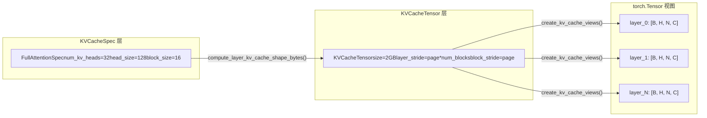

# 제 2 장: 핵심 추상화: Request, Sequence 및 KV Cache 데이터 구조

이전 장에서 우리는 vLLM v1의 계층적 멘탈 모델을 구축하여 요청이 API Server에서 출발해 EngineCore를 거쳐 최종적으로 Worker에 도달하여 실행된다는 것을 알았습니다. 하지만 HTTP 요청 본문의 JSON 문자열이 어떻게 엔진 내부에서 스케줄링 가능하고, 추적 가능하며, 중단 가능한 객체로 변환될까요? 이것이 Request 클래스가 답해야 할 질문입니다.

# KV Cache의 규격 체계: KVCacheSpec에서 레지스트리까지

Request는 「누가 계산할 것인가」 문제를 해결하고,`KVCacheSpec`는 「어디서 계산할 것인가」 문제를 해결합니다. PagedAttention의 세계에서 각 모델 레이어의 KV cache는 정확히 설명되어야 합니다: head가 몇 개인지, 각 head가 얼마나 큰지, 하나의 block이 몇 개의 token을 저장할 수 있는지, 양자화가 필요한지. 이 정보들은`KVCacheSpec`의 상속 체계에 인코딩됩니다.

## 직관적 모델: KVCacheSpec은 메모리의 「평면도」

> **[Design Inference & Architectural Trade-offs]**
> GPU 메모리를 개발 예정인 토지라고 상상하면,`KVCacheSpec`는 각 건물(각 cache group)의 평면도입니다: 각 층(각 block)에 방(head slot)이 몇 개인지, 각 방이 얼마나 큰지(head_size), 몇 명이 거주할 수 있는지(block_size개의 token)를 규정합니다. 그리고`KVCacheConfig`전체 단지의 계획안에 해당한다 — 총 몇 동의 건물이 있고, 각 동이 얼마의 땅을 차지하며, 어떤 동들이 같은 기초(block table)를 공유하는지.

이러한 규격 체계가 없으면 KV cache 할당은 하드코딩된 가정에만 의존할 수밖에 없어, 표준 MHA부터 MLA까지, 전체 어텐션부터 슬라이딩 윈도우까지, FP16부터 FP8 양자화까지의 다양한 모델 요구를 지원할 수 없다.

## 데이터 구조: KVCacheSpec의 상속 트리와 핵심 필드

`KVCacheSpec`모든 규격의 기반 클래스이며, 이는`@dataclass(frozen=True)` [FACT:vllm/v1/kv_cache_interface.py:150-152]이다. frozen은 규격 객체가 한 번 생성되면 변경 불가능함을 의미한다 — 이는 여러 컴포넌트(스케줄러, Worker, KV Cache Manager)가 동일한 규격을 보게 하여, 어딘가에서 수정되어 불일치가 발생하지 않도록 보장한다.

기반 클래스는 서브클래스가 반드시 구현해야 하는 세 가지 추상 속성을 정의한다:`num_heads`、`tokens_per_state`、`state_content_size_bytes` [FACT:vllm/v1/kv_cache_interface.py:182-183]이 세 가지 속성이 함께 결정한다`page_size_bytes`— 즉 하나의 block이 차지하는 바이트 수를.

`AttentionSpec`가장 핵심적인 서브클래스이며, 다음을 도입한다`num_kv_heads`、`head_size`、`dtype`、`kv_quant_mode`등의 필드[FACT:vllm/v1/kv_cache_interface.py:485-498]. 그중`tokens_per_state`필드의 설계가 특히 정교하다: 기본값은 1로, 하나의 state가 하나의 token에 대응함을 의미하지만, 1보다 큰 정수(예: DeepSeek-V4의 sparse MLA는 여러 token을 하나의 state로 압축)로 설정할 수도 있고, 1보다 작은 분수(예: Whisper의 block pooling은`Fraction(1, block_pool_size)`로 하나의 token이 여러 state에 대응함을 나타냄)로 설정할 수도 있다.[FACT:vllm/v1/kv_cache_interface.py:501-501]。

`FullAttentionSpec`는`AttentionSpec`기반 위에`sliding_window`과`attention_chunk_size` [FACT:vllm/v1/kv_cache_interface.py:566-566]을 추가한다. 그 문서 문자열이 중요한 설계 결정을 설명한다는 점에 주목하라: 혼합 할당기가 비활성화되면, 슬라이딩 윈도우 어텐션 레이어는 KV Cache Manager에서 전체 어텐션으로 처리되어(모든 token에 block 할당) 모델 실행 시에는 여전히 슬라이딩 윈도우로 계산한다[FACT:vllm/v1/kv_cache_interface.py:540-545]. 이는**보수적 할당, 정밀 계산**전략이다.

`MLAAttentionSpec`는 DeepSeek 계열 모델의 핵심 규격이다. 이는`head_size_v`를 기본값 0으로 설정하는데[FACT:vllm/v1/kv_cache_interface.py:670], MLA는 하나의 latent vector만 저장하고 독립적인 V가 없기 때문이다.`alignment`필드는 페이지 정렬 패딩에 사용되며[FACT:vllm/v1/kv_cache_interface.py:646-652], 이는 FlashMLA 등 특정 정렬이 필요한 백엔드에 매우 중요하다.

`MambaSpec`는 어텐션 경로를 전혀 따르지 않는다. 이는`shapes`과`dtypes`튜플로 상태 텐서의 형상을 설명한다[FACT:vllm/v1/kv_cache_interface.py:1027-1028]，`state_content_size_bytes`는 모든 상태 텐서 크기의 총합이다[FACT:vllm/v1/kv_cache_interface.py:1048-1052]. Mamba의`max_memory_usage_bytes`은`mamba_cache_mode`에 따라 세 가지 서로 다른 계산 방식을 가진다[FACT:vllm/v1/kv_cache_interface.py:1073-1084]. 이는 Mamba 상태 관리의 복잡성을 반영한다 — 어텐션처럼 선형으로 증가하지 않고 고정된 상태 크기를 가진다.

## 시나리오 주도: 규격에서 VRAM 레이아웃으로의 변환

엔진이 시작되면, 모든 레이어의`KVCacheSpec`을 실제 VRAM 레이아웃으로 변환해야 한다. 이 과정은`KVCacheTensor`과`create_kv_cache_views`에 의해 완료된다.

`KVCacheTensor`는 동일한 형상의 레이어 그룹이 KV cache 할당에서 차지하는 위치를 설명한다[FACT:vllm/v1/kv_cache_interface.py:1406-1427]. 핵심 필드는`layer_stride`과`block_stride`이다: 전자는 인접 레이어 간의 바이트 거리이고, 후자는 인접 block 간의 바이트 거리이다. 문서 문자열은 두 가지 레이아웃 모드를 상세히 설명한다: 레이어 최외곽(layer-outermost) 레이아웃은 각 레이어에 연속 영역을 부여하고, 블록 최외곽(block-outermost) 레이아웃은 각 block이 모든 레이어의 page를 포함하게 한다[FACT:vllm/v1/kv_cache_interface.py:1416-1416]。

`create_kv_cache_views`함수는 이 과정의 핵심이다[FACT:vllm/v1/kv_cache_interface.py:353-417]. 이는 평탄한 int8 buffer를 받아`torch.as_strided`를 통해 각 레이어에 대해 4D 뷰를 생성한다`[B, H, N, C]`. 핵심 매개변수는`strides`이며,`compute_layout_strides`에 의해 계산된다[FACT:vllm/v1/kv_cache_interface.py:314-350]. 이 함수는`layout.stride_order`에 지정된 차원 순서에 따라, 가장 안쪽 차원부터 역방향으로 각 차원의 바이트 스트라이드를 계산한다.

여기서 주목할 만한 경계 검사가 있다: kernel_block_size가 spec.block_size보다 작을 때(즉 하나의 manager block이 여러 kernel block으로 분할될 때), 코드는 block_stride가 dense_page_size와 같은지 검증한다[FACT:vllm/v1/kv_cache_interface.py:381-382]. 같지 않다면 레이아웃에 padding이 존재하여 균등 분할이 불가능함을 의미하며, 이때 명확한 수정 제안을 담은 ValueError를 발생시킨다.

## 설계 고찰: 레지스트리 패턴과 확장성

`KVCacheSpecRegistry`는 vLLM 확장성의 핵심 설계이다[FACT:vllm/v1/kv_cache_spec_registry.py:39-40]. 이는 두 개의 전역 딕셔너리를 유지한다:`_REGISTRY_KVCACHESPEC_LIST`은 spec 클래스에서 메타데이터로의 매핑을 저장하고,`_REGISTRY_ROLE_MANAGERS`은 역할에서 관리자로의 매핑을 저장한다[FACT:vllm/v1/kv_cache_spec_registry.py:35-36]。

`get_manager_class`메서드는 레지스트리의 핵심 조회 로직을 보여준다: spec 클래스의 MRO(메서드 해석 순서)를 따라 위로 순회하며, 첫 번째로 등록된 기반 클래스를 찾는다[FACT:vllm/v1/kv_cache_spec_registry.py:129-130]. 이는 사용자 정의`CustomFullAttentionSpec`가 별도로 등록되지 않았다면 자동으로`FullAttentionSpec`의 관리자를 상속함을 의미한다. 이러한**상속 기반 조회**는 새로운 spec 타입을 추가할 때 차이점 부분만 등록하면 되게 한다.

`check_kv_cache_spec_registry`메서드는 시작 시 모든 레이어의 spec이 등록되었는지 검증한다[FACT:vllm/v1/kv_cache_spec_registry.py:165-174]. 이는`raise ValueError`를 사용하고`assert`를 사용하지 않는다는 점에 주목하라. 주석은 이것이 프로덕션 환경에서도 적용되게 하기 위함이라고 명확히 설명한다[FACT:vllm/v1/kv_cache_spec_registry.py:165-174]. 이는 중요한 엔지니어링 결정이다: Python의`-O`플래그는 assert를 제거하지만, 프로덕션 환경의 구성 오류는 런타임에야 충돌하는 것이 아니라 시작 시에 반드시 드러나야 한다.

> **[Design Inference & Architectural Trade-offs]**
> 레지스트리의 지연 초기화 설계(`_ensure_registered`)는 순환 의존성 문제를 해결한다:`kv_cache_interface.py`는 spec 타입을 확인하기 위해 레지스트리를 참조해야 하고, 레지스트리는 임포트해야 한다`single_type_kv_cache_manager`관리자 클래스를 가져오기 위해, 이는 다시`kv_cache_interface`에 의존한다. 실제 등록을 첫 번째 조회 시점까지 지연시킴으로써 이 순환을 끊었다.

# 이 장 요약

이 장에서는 vLLM v1의 두 가지 핵심 데이터 구조를 분석했다.`Request`는 엔진 내부에서 요청의 생명주기 운반체로, 이중 token 리스트, 비동기 스케줄링 카운터 및 block hash 메커니즘을 통해 연속 배치 처리와 프리픽스 캐싱이라는 두 가지 핵심 기능을 지원한다.`KVCacheSpec`및 그 상속 체계는 KV cache의 VRAM 레이아웃 규격을 정의하며, 표준`FullAttentionSpec`에서`MLAAttentionSpec`、`MambaSpec`까지 다양한 모델 아키텍처 요구를 포괄한다. 레지스트리 패턴 덕분에 새로운 spec 타입을 추가할 때 핵심 코드를 수정할 필요가 없어 시스템의 확장성이 보장된다.

여기까지 우리는 Request가 EngineCoreRequest로부터 어떻게 변환되는지, 그리고 상태 카운터, block hash 등의 메커니즘을 통해 스케줄링 결정을 어떻게 지원하는지 살펴보았다. 하지만 외부 요청이 실제로 API Server, chat template 및 멀티모달 처리를 거쳐 최종적으로 EngineCoreRequest가 되는 과정은 어떠한가? 다음 장에서는 요청 진입 계층으로 들어가 HTTP/CLI에서 EngineCore까지의 전체 경로를 추적한다.
