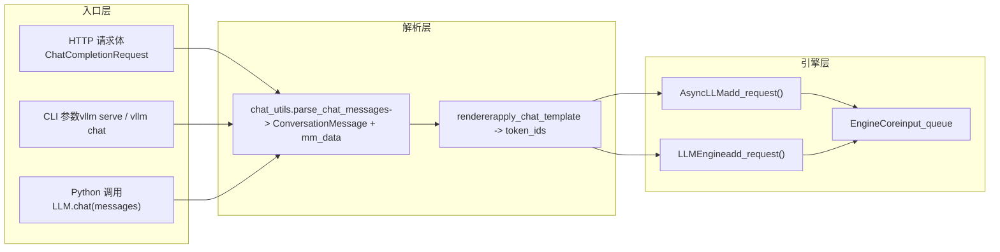

# 제 3 장: 요청 진입: HTTP/CLI에서 EngineCore까지의 전체 경로

이전 장에서 우리는 Request와 KVCacheSpec이라는 두 가지 엔진 내부 핵심 데이터 구조를 분석하며, 논리적 시퀀스와 물리적 VRAM 블록이 어떻게 분리되는지 이해했다. 하지만 HTTP 요청 본문이나 Python 문자열이 실제로 API Server, chat template 및 멀티모달 처리를 거쳐 최종적으로 EngineCoreRequest가 되는 과정은 어떠한가? 이 장에서는 이 경로를 완전히 추적하고, 동기 CLI, 비동기 API 및 오프라인 LLM 클래스라는 세 가지 진입 경로가 어떻게 동일한 엔진 코어로 수렴하는지 밝힌다.

# 3.1 세 가지 진입 경로의 수렴점: AsyncLLMEngine과 LLMEngine

요청 파싱을 깊이 파고들기 전에, 먼저 세 가지 진입 경로의 토폴로지 구조를 명확히 파악해야 한다. vLLM은 세 가지 사용 방식을 제공한다:`vllm serve`로 시작하는 OpenAI 호환 HTTP 서비스, 명령줄`vllm`도구, 그리고 Python에서 직접 인스턴스화하는`LLM`클래스를 통한 오프라인 추론. 이들은 겉보기에는 독립적이지만, 실제로는 동일한 엔진 코어를 공유한다.

먼저 비동기 API 경로의 별칭 메커니즘을 살펴보자.

[FACT:vllm/engine/async_llm_engine.py:7-7]

이 파일은 모듈이라고 부르기 어려울 정도로 짧다—단 한 가지 일만 한다:`AsyncLLMEngine`별칭을`vllm.v1.engine.async_llm.AsyncLLM`으로 지정하는 것이다. 이는 전형적인 아키텍처 마이그레이션 흔적이다. vLLM v0 시대의`AsyncLLMEngine`은 거대하고 복잡한 클래스였으며, v1 아키텍처 재작성 후 새로운`AsyncLLM`이 동일한 역할을 담당하게 되었다. 기존 사용자 코드를 깨뜨리지 않기 위해 vLLM은 이전 모듈 경로를 호환 계층으로 유지했다.

> **[Design Inference & Architectural Trade-offs]**
> 이러한 「이전 경로 별칭이 새 구현을 가리키는」 패턴은 vLLM에서 반복적으로 나타난다(`api_server.py`의 deprecation warning 등). 이는 프로젝트가 v0에서 v1으로의 마이그레이션에서 점진적 전략을 취했음을 보여준다: 새 코드는 새 경로를 사용하고, 이전 코드는 오류를 내지 않지만 경고를 받으며, 사용자에게 충분한 마이그레이션 기간을 제공한다.

다음으로 오프라인 경로의 진입점을 살펴보자.

[FACT:vllm/entrypoints/llm.py:344-346]

`LLM.__init__`은 최종적으로`LLMEngine.from_engine_args`을 호출하며,`UsageContext.LLM_CLASS`을 전달한다. 이`UsageContext`열거형은 진입 경로를 구분하는 핵심이다—엔진이 자신이 오프라인 배치 처리 모드에서 실행 중인지 온라인 서비스 모드에서 실행 중인지 알게 하여, 로그, 지표 및 리소스 관리 전략을 조정할 수 있게 한다.

[FACT:vllm/entrypoints/llm.py:357-359]

여기서`self.renderer = self.llm_engine.renderer`과`self.input_processor = self.llm_engine.input_processor`의 할당에 주목하자. 오프라인`LLM`클래스는 자체적으로 chat template 렌더링을 구현하지 않고, 엔진 내부의`renderer`을 재사용한다. 이는 chat template 파싱 로직이 오프라인과 온라인 경로에서 동일한 코드이며, 단지 호출 시점만 다르다는 것을 의미한다.

세 경로의 수렴 관계는 아래 데이터 흐름도로 표현할 수 있다.

이 그림은 핵심 설계를 드러낸다: 요청이 HTTP, CLI 또는 Python에서 오든,`chat_utils`은 멀티모달 및 chat template 처리의 유일한 진입점이다. 이는 이기종 입력 형식을`ConversationMessage`리스트와`MultiModalDataDict`으로 통일한 후, renderer에 전달하여 token 시퀀스를 생성한다.

# 3.2 chat_utils: 이기종 메시지에서 통합 대화 구조로

`chat_utils.py`은 전체 요청 진입 계층에서 가장 복잡한 모듈로, 2264줄의 코드가 OpenAI 호환 형식, 사용자 정의 확장, 멀티모달 임베딩, 도구 호출 등 모든 입력 형태를 처리한다. 그 핵심 역할은 한 문장으로 요약할 수 있다: 사용자가 전달한 임의의 메시지 리스트를 chat template이 이해할 수 있는`ConversationMessage`리스트로 정규화하고, 동시에 멀티모달 데이터를 독립적인`MultiModalDataDict`으로 추출하는 것이다.

## 직관적 모델: 번역가와 수하물 분류원

을`chat_utils`공항의 번역가 겸 수하물 분류원이라고 상상해 보자. 여행객(사용자)은 여러 나라(OpenAI 형식, 사용자 정의 형식, Harmony 형식)에서 왔고, 각기 다른 언어를 사용한다. 번역가는 먼저 모든 사람의 말을 통일된 작업 언어(`ConversationMessage`), 동시에 승객이 위탁한 수하물(이미지, 오디오, 비디오)을 독립된 컨베이어 벨트로 분류하고(`MultiModalDataDict`), 라벨(UUID)을 붙인 뒤, 마지막으로 사람과 수하물을 각각 같은 비행기(엔진)에 태운다.

이 계층이 없으면 엔진이 모든 입력 형식의 세부 사항을 이해해야 하며, 멀티모달 데이터 추출 로직이 각 진입점에 흩어져 새로운 형식이 추가될 때마다 엔진 코어를 수정해야 한다.

## 데이터 구조: 트래커와 파서의 이중 클래스 협업

`chat_utils`의 핵심은 두 그룹의 클래스 협업이다:`BaseMultiModalItemTracker`및 그 하위 클래스는 멀티모달 항목을 "추적"한다,`BaseMultiModalContentParser`및 그 하위 클래스는 콘텐츠 부분을 "파싱"한다.

먼저 트래커의 필드 레이아웃을 살펴보자.

[FACT:vllm/entrypoints/chat_utils.py:598-601]

`_items_by_modality`은`defaultdict[str, list[_T]]`이며, 모달리티(image, audio, video 등)별로 처리할 항목을 그룹화하여 저장한다.`_modality_order`은`vision_chunk`모달리티를 위해 각 chunk의 원본 모달리티(image인지 video인지)를 기록하는데, 통합 비전 chunk 모델이 둘 다`vision_chunk`로 매핑하지만 이후 처리에서는 원본 타입을 알아야 하기 때문이다.

[FACT:vllm/entrypoints/chat_utils.py:613-615]

`use_unified_vision_chunk_modality`은`cached_property`이며, HuggingFace 설정에서`use_unified_vision_chunk`플래그를 읽는다. 일반 속성 대신`cached_property`을 사용하는 이유는 이 검사가 매`add`호출 시 트리거되므로 캐싱으로 반복적인`getattr`오버헤드를 피할 수 있기 때문이다.

트래커의`add`메서드는 핵심 진입점이다.

[FACT:vllm/entrypoints/chat_utils.py:656-684]

`add`메서드는 먼저`_validate_add`을 호출해 검증한 후, 통합 비전 chunk 모달리티 사용 여부에 따라 항목을 다른 키 아래에 저장한다.`prompt_embeds`의 특수 처리를 주목하자: 이는`_items_by_modality["prompt_embeds"]`에 직접 추가되고`None`을 반환하는데, 사전 계산된 임베딩은 HF processor를 거치지 않아 플레이스홀더 문자열이 없기 때문이다.

`_validate_add`의 검증 로직은 자세히 볼 가치가 있다.

[FACT:vllm/entrypoints/chat_utils.py:686-721]

여기 미묘한 분기가 있다:`enable_mm_embeds=True`이고 해당 모달리티의 프롬프트당 제한이 0이며 원본 모달리티가`_embeds`로 끝날 때 수량 검증을 건너뛴다. 이는 임베딩 입력이 원본 모달리티의 수량 제한을 우회하도록 허용하기 위함이다 — 임베딩은 사전 계산되어 원본 모달리티의 처리 리소스를 차지하지 않는다.

## 시나리오 기반: 이미지가 포함된 chat 요청이 어떻게 파싱되는가

사용자가 이미지 URL과 텍스트를 포함한 chat 요청을 보낸다고 가정하자.`parse_chat_messages`은 동기 경로의 진입점이다.

[FACT:vllm/entrypoints/chat_utils.py:2161-2197]

`parse_chat_messages`은`MultiModalItemTracker`을 생성하고, 각 메시지를 순회하며`_parse_chat_message_content`을 호출하고, 마지막으로`_postprocess_messages`을 호출해 도구 호출 파라미터를 처리한 후,`mm_tracker.resolve_items()`을 통해 멀티모달 데이터를 구체화한다.

`_parse_chat_message_content`은 단일 메시지 파싱을 담당한다.

[FACT:vllm/entrypoints/chat_utils.py:2007-2029]

먼저 content를 정규화한다:`None`은 빈 리스트가 되고, 문자열은 단일 텍스트 part가 된다. 그런 다음`_parse_chat_message_content_parts`을 호출하는데, 여기서`wrap_dicts`파라미터는`content_format == "openai"`에 의해 결정된다 — 이는 출력이 구조화된 딕셔너리 리스트인지 연결된 문자열인지를 결정한다.

`_parse_chat_message_content_parts`은 각 part를 순회한다.

[FACT:vllm/entrypoints/chat_utils.py:1814-1853]

각 part는`_parse_chat_message_content_part`처리를 거친다. 만약`wrap_dicts=False`이면 최종적으로 텍스트와 플레이스홀더를 단일 문자열로 연결하고,`wrap_dicts=True`이면 구조화된 딕셔너리 리스트를 반환한다.

`_parse_chat_message_content_part`은 분배의 핵심이다.

[FACT:vllm/entrypoints/chat_utils.py:1875-1884]

순수 텍스트 part의 경우 먼저 플레이스홀더 보존 검사를 하고,`wrap_dicts`에 따라 반환 형식을 결정한다. 구조화된 part의 경우`_parse_chat_message_content_mm_part`을 호출해 타입과 콘텐츠를 추출한다.

[FACT:vllm/entrypoints/chat_utils.py:1690-1723]

`_parse_chat_message_content_mm_part`은`MM_PARSER_MAP`을 통해 해당 파싱 함수를 찾는다.`uuid is None`의 조건을 주목하자 — 사용자가 UUID를 제공했다면 미디어 데이터가 요청 본문에 없을 수 있으며(다른 방식으로 업로드됨), 이때 아래의 직접 URL 필드 분기를 탄다.

[FACT:vllm/entrypoints/chat_utils.py:1731-1733]

이`part_type is None`또는`uuid is not None`일 때, 코드는 part에서 직접 URL 필드를 추출하려 시도한다. 이러한 "관대한 파싱"은 OpenAI 형식을 엄격히 따르지 않는 클라이언트와의 호환을 위한 것이다.

으로 돌아가서,`_parse_chat_message_content_part`미디어 타입의 part는 해당`mm_parser`메서드로 분배된다.

[FACT:vllm/entrypoints/chat_utils.py:1923-1968]

각 미디어 타입은 해당`parse_*`메서드를 호출하며, 이 메서드들은 내부적으로`tracker.add`을 호출해 항목을 트래커에 추가하고 플레이스홀더 문자열을 반환한다. 마지막으로`interleave_strings`에 따라 플레이스홀더를 반환할지`None`。

[FACT:vllm/entrypoints/chat_utils.py:1984-1999]

`prompt_embeds`의 처리는 특별하다:`interleave_strings`과 관계없이`PROMPT_EMBEDS_PLACEHOLDER_TOKEN`을 반환한다. 주석은 그 이유를 설명한다 — prompt_embeds는 토큰 오프셋 위치에 연결되므로 위치가 중요하며,`missing_placeholders`의 앞쪽 패딩 로직을 타면 순서가 뒤섞이기 때문이다.

## 비동기 경로의 차이

비동기 경로는`AsyncMultiModalItemTracker`과`AsyncMultiModalContentParser`을 사용한다. 핵심 차이는`resolve_items`。

[FACT:vllm/entrypoints/chat_utils.py:906-952]

에 있다. 비동기 버전은`asyncio.gather`으로 모든 모달리티 항목을 동시에 대기한다. 주석은 명확히 지적한다: 각 추적 항목은 이미 독립적인 awaitable이고, 비동기 커넥터가 블로킹 디코딩 작업을 스레드 풀에 오프로드하므로, 한 모달리티를 직렬로 기다린 후 다음을 기다리는 것은 불필요하게 지연을 증가시킨다.`return_exceptions=True`은 모든 작업이 완료되거나 실패한 후에 통합적으로 예외를 던져, 첫 번째 실패로 아직 진행 중인 네트워크 요청을 포기하는 것을 방지한다.

## 설계 고찰: 왜 트래커와 파서를 분리하는가

> **[Design Inference & Architectural Trade-offs]**
> 트래커와 파서의 분리는 음미할 가치가 있는 설계다. 트래커는 "상태 관리"를 담당한다 — 각 모달리티에 항목이 몇 개인지 기록하고, 수량 제한을 검증하며, vision_chunk의 원본 모달리티 순서를 유지한다. 파서는 "콘텐츠 추출"을 담당한다 — URL에서 이미지를 가져오고, base64에서 임베딩을 디코딩하며, 오디오 형식 변환을 처리한다. 이러한 분리 덕분에 동기 및 비동기 경로가 추적 로직(`BaseMultiModalItemTracker`은 추상 기반 클래스)을 공유하고 파서 수준에서만 분기할 수 있다. 만약 하나의 클래스로 합친다면 동기와 비동기의 차이가 추적 로직에 스며들어 코드 중복과 상태 관리 복잡화를 초래할 것이다.

# 3.3 메시지에서 token으로: renderer와 EngineCore의 교대

`chat_utils`이 생성한`ConversationMessage`리스트와`MultiModalDataDict`은 chat template 렌더링을 거쳐야 token 시퀀스가 된다. 이 단계는 renderer가 수행하며, 이후 요청이 실제로 엔진에 진입한다.

## 시나리오 기반: chat template 렌더링과 요청 전달

`parse_chat_messages`반환 후, 호출자(예:`OpenAIServingChat`)는`conversation`과`mm_data`를 renderer에 전달합니다. renderer는 chat template을 적용하여`ConversationMessage`리스트를 텍스트로 렌더링한 뒤, token ID 시퀀스로 tokenize합니다. 멀티모달 플레이스홀더(예:`<##IMAGE##>`)는 tokenize 후 모델별 플레이스홀더 토큰으로 대체됩니다.

렌더링이 완료되면 요청은`EngineCoreRequest`로 캡슐화되어`AsyncLLM.add_request()`또는`LLMEngine.add_request()`를 통해 EngineCore의 입력 큐에 전달됩니다.

[FACT:vllm/entrypoints/llm.py:420-484]

오프라인`LLM.generate`메서드는 이 경로를 보여줍니다. 먼저`runner_type`을 검증하고, 기본 샘플링 파라미터를 가져온 다음,`_run_completion`。`_run_completion`를 호출합니다. 내부적으로 renderer를 호출하여 prompt를 렌더링하고,`llm_engine`를 통해 요청을 전달합니다.

[FACT:vllm/entrypoints/llm.py:615-708]

`LLM.chat`메서드는 chat 경로를 보여줍니다.`messages`리스트를 받아`_run_chat`을 호출하며, 내부적으로`parse_chat_messages`과 renderer를 호출합니다.

## 설계 고찰: 왜 renderer가 엔진 내부에 있는가

> **[Design Inference & Architectural Trade-offs]**
> `LLM.__init__`에서`self.renderer = self.llm_engine.renderer`이 한 줄은 중요한 설계 결정을 드러냅니다. renderer는 진입 계층이 아닌 엔진에 속합니다. 이는 chat template의 로딩, 캐싱, 워밍업(`self.renderer.warmup(ChatParams(...))`)이 모두 엔진 초기화 시 완료되며, 진입 계층은 단순한 호출자임을 의미합니다. 이렇게 하면 오프라인`LLM`과 온라인`AsyncLLM`이 동일한 renderer 구현과 캐시를 공유하여 tokenizer와 chat template의 중복 로딩을 방지합니다. 또한 renderer 워밍업이 엔진 시작 시 완료되어 첫 요청의 콜드 스타트 지연을 방지합니다.

## 오류 복구와 프로덕션 함정

`_postprocess_messages`의 도구 호출 파라미터 처리는 전형적인 프로덕션 환경 함정입니다.

[FACT:vllm/entrypoints/chat_utils.py:2118-2158]

assistant 메시지에`tool_calls`이 포함될 때,`arguments`필드는 JSON 문자열, 딕셔너리, 또는 유효하지 않은 JSON일 수 있습니다. 코드는 JSON 문자열 파싱을 시도하고, 실패하면 경고를 기록한 뒤 빈 객체로 강제 변환합니다. 주석은 그 이유를 설명합니다. 형식이 잘못된`arguments`이 대화 기록에 존재하면, 여기서 요청을 실패시킬 경우 이후 매 턴마다 실패하여 대화가 복구 불가능해집니다. 이는 신중한 내결함성 설계로, 모델이 빈 도구 파라미터를 보더라도 전체 대화가 멈추지 않게 합니다.

또 다른 함정은 예약 플레이스홀더 주입 방어입니다.

[FACT:vllm/entrypoints/chat_utils.py:1856-1872]

가`enable_prompt_embeds`활성화되면,`PROMPT_EMBEDS_PLACEHOLDER_TOKEN`이 분할 불가능한 특수 토큰으로 등록됩니다. 사용자 텍스트에 이 리터럴 시퀀스가 포함되면 tokenizer가 동일한 token ID로 인코딩하고, renderer는 이를 연결점으로 오인하여 호출자가 순수 텍스트 콘텐츠를 통해 연결 위치를 이동하거나 주입할 수 있게 됩니다.`_reject_reserved_placeholder_in_text`은 텍스트 part 파싱 시 이러한 입력을 거부하여 이 보안 취약점을 차단합니다.

[FACT:vllm/entrypoints/chat_utils.py:1889-1892]

이 검사는`isinstance(part, str)`분기와 구조화 텍스트 분기 모두에서 호출되어 모든 텍스트 경로가 방어됨을 보장합니다.

# 이 장 요약

이 장에서는 요청이 외부에서 시스템으로 진입하는 첫 번째 경로를 추적했습니다. 세 가지 진입 경로 — HTTP API, CLI, 오프라인`LLM`클래스 — 는 최종적으로`chat_utils`의 멀티모달 파싱 계층으로 수렴합니다.`BaseMultiModalItemTracker`은 상태 관리를,`BaseMultiModalContentParser`은 콘텐츠 추출을 담당하며, 이 둘의 분리로 동기 및 비동기 경로가 추적 로직을 공유할 수 있습니다.`parse_chat_messages`은 이기종 메시지를`ConversationMessage`리스트와`MultiModalDataDict`로 정규화한 뒤, 엔진 내부의 renderer에 전달하여 chat template 렌더링과 tokenize를 완료합니다. 최종적으로 요청은`EngineCoreRequest`로 캡슐화되어 EngineCore의 입력 큐에 전달됩니다.

# 이 장 생각해보기와 자가 점검

Q1:`_parse_chat_message_content_mm_part`에서`uuid is None`이 조건을 제거하면(즉,`if isinstance(part_type, str) and part_type in MM_PARSER_MAP:`로 변경), 어떤 시나리오에서 문제가 발생하는가?

**참고 해석**：`uuid is None`이 조건은 「사용자가 UUID를 제공했지만 미디어 데이터가 요청 본문에 없는」 시나리오를 처리하기 위해 존재합니다. 사용자가 UUID를 제공할 때 미디어 데이터는 이미 다른 방식으로 업로드되었을 수 있으며(예: 미디어 캐시에 사전 업로드), 이때 요청 본문의 part에는 실제 URL이나 데이터 없이 UUID만 포함될 수 있습니다. 이 조건을 제거하면 코드가`MM_PARSER_MAP[part_type](part)`을 통해 파싱을 시도하지만, part에 해당 데이터 필드가 없을 수 있어(예:`image_url`이 비어 있음)`None`콘텐츠가 파싱됩니다. 더 심각한 것은 이후`parse_image(None, uuid)`이`_connector.fetch_image(None)`을 호출하여 불필요한 네트워크 요청이나 예외가 발생할 수 있다는 점입니다.`uuid is not None`분기는 직접 필드 추출 경로를 따라 「UUID는 있지만 데이터가 없는」 상황을 올바르게 처리합니다. 참조:[FACT:vllm/entrypoints/chat_utils.py:1713-1723]및[FACT:vllm/entrypoints/chat_utils.py:1731-1733]。

Q2: `AsyncMultiModalItemTracker.resolve_items`기본`asyncio.gather(..., return_exceptions=True)`대신`return_exceptions=False`을 사용합니다.`False`로 변경하면 어떤 동시성 시나리오에서 리소스 누수가 발생하는가?

**참고 해석**：`return_exceptions=False`시,`asyncio.gather`은 첫 번째 예외가 발생하면 즉시 반환하지만, 아직 진행 중인 다른 작업들은 취소되지 않고 백그라운드에서 계속 실행됩니다. 이 작업들은 네트워크 연결, 스레드 풀 작업 항목, 파일 핸들을 보유할 수 있습니다. 이 작업들이 최종적으로 실패하면 예외는 조용히 버려지고(gather가 이미 반환되었으므로), 리소스 누수와 추적하기 어려운 오류가 발생합니다.`return_exceptions=True`모든 작업이 완료되거나 실패할 때까지 기다린 후 일괄적으로 검사하여, 버려지는 작업이 없도록 보장합니다. 주석은 이 점을 명확히 설명합니다: 「Gathering with return_exceptions=True lets every task finish (or itself fail) before we raise, instead of abandoning still-in-flight fetches (real network/thread-pool work) the moment the first one fails.」참조[FACT:vllm/entrypoints/chat_utils.py:924-931]。

Q3: `_postprocess_messages`에서,`arguments`가 유효하지 않은 JSON일 때, 코드는 예외를 발생시키는 대신 강제로 빈 객체로 변환합니다. 만약 예외를 발생시키도록 변경한다면, 어떤 프로덕션 시나리오에서 복구 불가능한 대화 상태가 발생할까요?

**참고 분석**：`arguments`필드가 대화 기록에 존재합니다 (assistant 메시지의`tool_calls`). 만약 특정 턴에서 모델이 잘못된 형식의`arguments`를 생성했다면, 이 오류는 대화 기록에 저장됩니다. 만약`_postprocess_messages`가 기록을 파싱할 때 예외를 발생시킨다면, 이후 모든 턴의 요청이 기록에 있는 이 오류 때문에 실패하게 됩니다 — 현재 턴의 입력이 완전히 올바르더라도 마찬가지입니다. 사용자는 이 대화를 계속할 수 없고, 전체 세션을 포기하고 처음부터 다시 시작해야만 합니다. 강제로 빈 객체로 변환하면 대화를 계속할 수 있고, 모델은 빈 도구 인자를 보고 올바른 호출을 다시 생성합니다. 주석은 이 점을 설명합니다: 「A malformed arguments string lives in conversation history, so failing the request here would fail every subsequent turn too and leave the conversation unrecoverable.」참조[FACT:vllm/entrypoints/chat_utils.py:2124-2139]。

다음 장에서는 스케줄러로 들어가서, EngineCore가 연속 배칭과 VRAM 인식 전략으로 이러한 요청들을 어떻게 편성하는지 살펴봅니다.

여기까지 요청은 외부 입력에서 EngineCoreRequest로의 정규화 변환을 완료하고 엔진 코어의 입구에 도달했습니다. 하지만 요청은 들어온 후 즉시 실행되지 않습니다 — 엔진은 각 단계에서 어떤 요청을 처리할지, 한정된 VRAM 자원을 어떻게 할당할지 결정해야 합니다. 다음 장에서는 EngineCore의 스케줄링 루프를 깊이 파고들어, Scheduler가 연속 배칭에서 처리량과 지연을 어떻게 저울질하는지, 그리고 chunked prefill, prefix caching, KV block 할당이 어떻게 협력하여 작동하는지 분석합니다.
