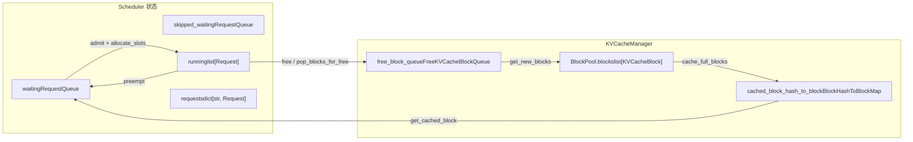
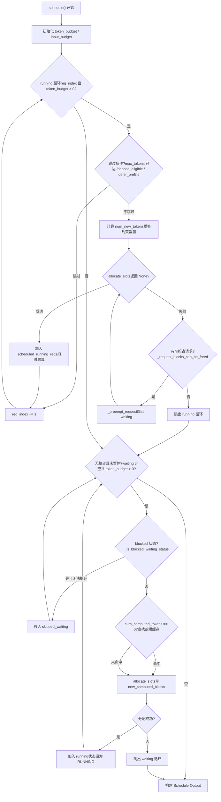

# 제 4 장: 스케줄러: 연속 배칭과 VRAM 인식 요청 편성

요청이 EngineCore의 입력 큐에 들어간 후, 즉시 실행되지 않습니다. 각 단계에서 어떤 요청을 처리할지, 각 요청에 얼마나 많은 token 예산을 할당할지, VRAM이 부족할 때 누구를 우선적으로 희생할지, 이러한 결정들은 모두`Scheduler.schedule()`메서드에 집중되어 있습니다. 이 장에서는 스케줄러의 데이터 구조부터 시작하여, 한 번의`schedule()`호출이 waiting 큐, running 리스트, KV cache 풀을 어떻게 실행 가능한 배치로 구성하는지 추적합니다.

# 4.1 스케줄러의 데이터 구조: 세 개의 큐와 하나의 VRAM 풀

스케줄러가 답해야 할 핵심 질문은:**한정된 token 예산과 KV block 예산 아래에서, 이 단계에서 어떤 요청들을 얼마나 많은 token만큼 전진시켜야 하는가?**이를 이해하려면, 먼저 그것이 어떤 상태를 쥐고 있는지 봐야 합니다.

스케줄러는 세 가지 유형의 요청 컨테이너를 유지합니다.`self.requests`는 전역 딕셔너리로,`req_id -> Request`, 모든 활성 요청의 유일한 진실 원천[FACT:vllm/v1/core/sched/scheduler.py:208-209]。`self.waiting`와`self.skipped_waiting`는 두 개의 우선순위 큐로, 전자는 정상적으로 스케줄링을 기다리는 요청을 넣고, 후자는 비동기 의존성이나 제약으로 인해 일시적으로 스케줄링할 수 없는 요청을 넣습니다 (예: 원격 KV 대기, 구조화된 출력 문법 컴파일 대기)[FACT:vllm/v1/core/sched/scheduler.py:208-209]。`self.running`는 일반 리스트로, 이미 실행 상태에 들어가 KV block을 보유한 요청을 저장합니다[FACT:vllm/v1/core/sched/scheduler.py:208-209]。

여기에 간과하기 쉬운 설계가 있습니다:`max_num_running_reqs`와`max_num_active_reqs`는 두 개의 서로 다른 상한입니다. 전자는`max_num_seqs`에서 오며, model runner의 슬롯 수를 결정합니다; 후자는`max_num_active_seqs`에서 오며, RUNNING에 들어갈 수 있는 요청 수만 제한하고, 기본값은 전자와 같습니다[FACT:vllm/v1/core/sched/scheduler.py:123-131]. 이 분리는 CUDA graph 캡처 용량을 줄이지 않으면서 실제 동시 디코딩 배치 크기를 낮출 수 있게 해줍니다.

VRAM 측은`KVCacheManager`이 통합 관리하며, 내부적으로`BlockPool`。`BlockPool`를 보유합니다.`self.blocks`의 핵심은`KVCacheBlock`(모든`free_block_queue`의 리스트)와[FACT:vllm/v1/core/block_pool.py:171-177](축출 순서로 배열된 빈 블록 이중 연결 리스트)입니다`null_block`. 주목할 점은`is_null=True`의 존재입니다: 이것은 빈 큐 헤드에서 팝된 첫 번째 블록으로,[FACT:vllm/v1/core/block_pool.py:183-187], 참조 카운트는 일반 유지보수에 참여하지 않고, 전용으로 플레이스홀더로 사용됩니다

. 요청의 특정 token 위치에 실제 KV block이 필요하지 않을 때 (예: 슬라이딩 윈도우에 의해 건너뛰어진 위치), block table에 이 null block을 채웁니다.`BlockHashToBlockMap`프리픽스 캐싱의 인덱스 구조는`BlockHashWithGroupId`이며,`KVCacheBlock`를`{block_id: KVCacheBlock}`또는[FACT:vllm/v1/core/block_pool.py:56-59]. 왜 유니온 타입을 사용하는가? 주석이 답을 제시한다: 대부분의 해시는 단 하나의 블록에만 대응하므로 딕셔너리를 사용하면 불필요한 GC 오버헤드가 발생한다; 동일한 해시가 여러 블록에 의해 공유될 때만 딕셔너리로 승격된다[FACT:vllm/v1/core/block_pool.py:56-59]. 이것은 타입 복잡도로 런타임 오버헤드를 교환하는 전형적인 트레이드오프이다.

`KVCacheBlocks`. 스케줄러와 KV cache 관리자 사이의 인터페이스 객체로, 내부 데이터 구조를 숨긴다.它的`blocks`. 필드는`tuple[Sequence[KVCacheBlock], ...]`. 이며, 외부 차원은 KV cache group, 내부는 블록 시퀀스이다[FACT:vllm/v1/core/kv_cache_manager.py:41-54]. 주석은 왜 블록을 외부 차원으로 사용하지 않는지 명확히 설명한다: 그것은 모든 group의 블록 수가 동일하다고 가정하게 되는데, 미래에는 서로 다른 group에 서로 다른 block size를 설정할 수 있기 때문이다[FACT:vllm/v1/core/kv_cache_manager.py:43-48]。



. 이 그림은 스케줄러와 VRAM 풀 사이의 데이터 흐름을 고정한다: waiting 큐의 요청은`allocate_slots`. 을 통해 running으로 진입하고, running의 요청이 선점되면 waiting으로 돌아가며, 해제된 블록은 유휴 큐로 반환되고, 프리픽스 캐시 해시 테이블은 waiting 요청이 캐시를 히트하는 진입점이다.

# . 4.2 schedule() 메인 흐름: running 우선, waiting 보충, 선점 폴백

`schedule()`. 은 전체 스케줄러의 핵심 메서드로,`SchedulerOutput`. 을 반환하여 이 단계에서 무엇을 실행할지 설명한다. 메서드 서두의 주석은 설계 철학을 밝힌다: 스케줄러에는 "디코드 단계"와 "프리필 단계"의 구분이 없으며, 각 요청은 오직`num_computed_tokens`. 과`num_tokens_with_spec`. 만 가지고, 스케줄러의 임무는 전자가 후자를 따라잡게 하는 것이다[FACT:vllm/v1/core/sched/scheduler.py:559-568]. 이러한 통합적 관점은 chunked prefill, prefix caching, 추측 디코딩이 공존할 수 있는 기반이다.

## . 4.2.1 예산 초기화와 임계값 계산

. 메인 루프에 진입하기 전에 스케줄러는 먼저 두 가지 예산을 설정한다:`token_budget`. 은`max_num_scheduled_tokens`，`input_budget`. 으로 초기화되고, 은 으로 초기화된다. 둘은 일반적으로 동일하지만, 모델이 배치에서 토큰을 추가할 수 있는 경우(예: 추측 디코딩),`max_num_batched_tokens` [FACT:vllm/v1/core/sched/scheduler.py:577-580]. 은`max_num_scheduled_tokens`. 보다 작아지며, 그 차이가 draft token을 위한 공간이다.`max_num_batched_tokens`. 의 처리는 별도로 볼 가치가 있다. 그 역할은 긴 prefill이 다른 요청을 기아 상태로 만드는 것을 방지하는 것이지만, 현재 요청이 하나뿐이라면 기아 상태가 될 대상이 없으므로 임계값은 0으로 설정된다

`long_prefill_token_threshold`. 이[FACT:vllm/v1/core/sched/scheduler.py:606-616]. 활성화되면 임계값은`adaptive_long_prefill_threshold`. 으로 높아져, 단일 요청의 예산이 공정한 몫 이하로 압축되지 않도록 보장한다`input_budget // num_eligible_reqs`. 4.2.2 running 요청의 스케줄링 루프[FACT:vllm/v1/core/sched/scheduler.py:617-622]。

## . 메인 루프는

. 의 헤드부터 순회를 시작하며,`self.running`. 은 커서이다`req_index`. 각 요청에 대해 먼저 일련의 건너뛰기 판단을 수행한다:[FACT:vllm/v1/core/sched/scheduler.py:624-627]. 비동기 스케줄링에서 요청의 출력 플레이스홀더가 이미

- . 에 도달했음을 나타내면, 한 단계 더 실행하는 것을 피하기 위해 건너뛴다`max_tokens`. V2 + PP + 비동기 시나리오에서 현재 단계가 아직[FACT:vllm/v1/core/sched/scheduler.py:631-645]。
- . 에 도달하지 않았다면, worker 측의 샘플링 토큰 브로드캐스트 리듬에 맞추기 위해 건너뛴다`next_decode_eligible_step`. DP prefill 균형이 활성화되면, 리듬 정렬 단계가 아닌 곳의 prefill chunk는 지연된다[FACT:vllm/v1/core/sched/scheduler.py:647-651]。
- . 건너뛰기 판단을 통과하면, 이 요청이 이번 단계에서 얼마나 많은 토큰을 진행할 수 있는지 계산한다:[FACT:vllm/v1/core/sched/scheduler.py:653-657]。

. 복사

```
num_new_tokens = request.num_tokens_with_spec
               + request.num_output_placeholders
               - request.num_computed_tokens
```

. 과`long_prefill_token_threshold`、`token_budget`、`input_budget - draft_slots`. 에 의해 제약된다`max_model_len`. 요청에 인코더 입력이 있으면[FACT:vllm/v1/core/sched/scheduler.py:670-688]. 을 거쳐 조정된다`_try_schedule_encoder_inputs`. 다음이 가장 핵심적인 단계이다: KV block 할당.[FACT:vllm/v1/core/sched/scheduler.py:700-712]。

. 은`allocate_slots`. 루프 안에 감싸져 있다`while True`. 이[FACT:vllm/v1/core/sched/scheduler.py:742-747]. 을 반환하면 VRAM이 부족하다는 의미이므로, 스케줄러는 선점을 시작한다: 전략에 따라 희생자를 선택하고(PRIORITY 전략은 우선순위가 가장 낮은 것을, FCFS 전략은 running 리스트 끝의 것을 선택)`None`. ,[FACT:vllm/v1/core/sched/scheduler.py:761-767]. 을 호출하여 waiting 큐로 되돌린 후 할당을 재시도한다`_preempt_request`. 희생자가 현재 요청 자신이라면 선점할 대상이 더 이상 없다는 의미이므로 루프를 빠져나오고, 현재 요청도 스케줄링할 수 없다[FACT:vllm/v1/core/sched/scheduler.py:801-806]. 선점 로직에는 정교한 디테일이 하나 있다: PRIORITY 전략에서 선점된 요청이 이미[FACT:vllm/v1/core/sched/scheduler.py:807-813]。

. 에 있는 경우(즉, 이번 단계에서 이미 리소스가 할당된 경우), 해당 요청의 토큰 예산, block, 추측 토큰, 인코더 예산을 모두 반환해야 한다`scheduled_running_reqs`. 이는 예산 장부의 일관성을 보장한다.[FACT:vllm/v1/core/sched/scheduler.py:779-797]. 할당이 성공하면 요청은

. 에 추가되고, block과 토큰 수를 기록하며, 예산을 차감한다`scheduled_running_reqs`. 추측 디코딩 관련 토큰은 여기서 트리밍되고 기록된다[FACT:vllm/v1/core/sched/scheduler.py:815-823]. 4.2.3 waiting 요청의 진입 허용[FACT:vllm/v1/core/sched/scheduler.py:825-841]。

## . running 루프가 끝난 후, 이번 단계에서 선점이 발생하지 않았고 스케줄러가 일시 중지되지 않았다면 waiting 큐 처리를 시작한다

. 진입 허용 전에 두 가지 상한을 확인한다:[FACT:vllm/v1/core/sched/scheduler.py:868-872]. 과`max_num_active_reqs`. waiting 요청의 스케줄링은 running보다 프리픽스 캐시 조회 단계가 하나 더 있다.当`input_budget` [FACT:vllm/v1/core/sched/scheduler.py:873-879]。

. 일 때,`request.num_computed_tokens == 0`. 을 호출하여 로컬 캐시 히트를 조회한다`_get_local_prefix_cache_hit`. KV connector가 구성되어 있으면 원격 캐시 히트도 조회한다[FACT:vllm/v1/core/sched/scheduler.py:932-939]. 여기에는 로컬과 원격 히트 충돌을 처리하는 정교한 로직이 있다. 로컬 히트는 블록 정렬이 아닐 수 있으며([FACT:vllm/v1/core/sched/scheduler.py:942-954]。

. ), 원격 히트가 로컬 완전 히트를 엄격히 초과하면 로컬의 하위 블록 꼬리를 버리고 원격 로드가 이를 덮어쓰게 하여 쓰기 시 복사를 방지한다`partial_tail`. 반대로 로컬 꼬리를 유지하고 외부를 로드하지 않는다[FACT:vllm/v1/core/sched/scheduler.py:977-988]. 진입 허용이 성공하면 요청은 waiting 큐에서 팝되고, 상태가 RUNNING으로 설정되며, running 리스트에 추가된다[FACT:vllm/v1/core/sched/scheduler.py:989-995]。

. 이번 단계 이후에도 여전히 prefill 중이면([FACT:vllm/v1/core/sched/scheduler.py:1263-1319]. ),`num_computed_tokens + num_new_tokens < request.num_tokens`. 집합에 추가된다`_inflight_prefills`. 복사[FACT:vllm/v1/core/sched/scheduler.py:1326-1328]。



. 의 두 가지 주요 루프와 선점 분기를 포함한다. running 루프에서`schedule()`. 실패 후의 선점 재시도 경로, 그리고 waiting 루프에서 blocked 상태 요청이 이동되는 부분에 주목하라`allocate_slots` 失败后的抢占重试路径，以及 waiting 循环中 blocked 状态请求被移入 `skipped_waiting`의 바이패스.

# 4.3 메모리 인식의 핵심: allocate_slots와 선점

`allocate_slots`는 스케줄러와 메모리 사이의 게이트입니다. 그 파라미터 목록 자체가 하나의 메모리 장부입니다:`num_new_tokens`는 새로 계산할 token 수이고,`num_new_computed_tokens`는 프리픽스 캐시에서 새로 히트된 token 수이며,`num_external_computed_tokens`는 connector가 제공하는 외부 히트 수이고,`num_lookahead_tokens`는 추측 디코딩을 위해 예약된 슬롯입니다[FACT:vllm/v1/core/kv_cache_manager.py:371-383]。

메서드 시작 부분의 주석은 ASCII 그림 한 장으로 블록 레이아웃을 정확히 설명합니다[FACT:vllm/v1/core/kv_cache_manager.py:417-438]：

```
|  |  |   |   |  |
                                          |        |
                        |                       |
```

`comp`는 이미 계산된 token이고,`new_comp`는 프리픽스 캐시 히트이며,`ext_comp`는 외부 히트이고,`new`는 이번 단계에서 새로 계산하는 것이며,`lookahead`는 추측 예약입니다. 할당은 세 단계로 나뉩니다: 먼저 불필요한 블록을 해제하고 충분한 빈 블록이 있는지 확인한 뒤, 프리픽스 token을 처리하고, 마지막으로 새로 계산할 token을 위해 블록을 할당합니다[FACT:vllm/v1/core/kv_cache_manager.py:458-461]。

## 4.3.1 워터마크와 진입 제어

`allocate_slots`에는 두 개의 진입 게이트가 있습니다. 첫 번째는`full_sequence_must_fit`입니다: 활성화되면 전체 요청 시퀀스(첫 번째 chunk만이 아님)가 들어갈 수 있는지 먼저 확인하고, 들어갈 수 없으면 바로`None` [FACT:vllm/v1/core/kv_cache_manager.py:515-531]를 반환합니다. 이는 chunked prefill 상황에서 과도한 진입으로 인한 KV cache 요동을 방지합니다.

두 번째는 워터마크입니다.`watermark_blocks`는 요청 상태가 WAITING 또는 PREEMPTED이고 이미 요청이 스케줄된 경우에만 적용됩니다[FACT:vllm/v1/core/kv_cache_manager.py:506-513]. 이는 할당 후 최소한 일정 비율의 빈 블록을 남겨두도록 요구하여 빈번한 축출과 선점을 피합니다.`reserved_blocks`는 비동기 KV 로딩 시나리오에 사용되어, 진행 중인 prefill의 예약 블록이 새 요청에 의해 잠식되지 않도록 보장합니다[FACT:vllm/v1/core/kv_cache_manager.py:564-570]。

## 4.3.2 선점의 대가와 복구

> **[Design Inference & Architectural Trade-offs]**
> `_preempt_request`는 겉보기에는 폭력적이지만 필요한 일을 합니다: 요청의`num_computed_tokens`를 0으로 재설정합니다[FACT:vllm/v1/core/sched/scheduler.py:1560-1561]. 이는 선점된 요청이 다음 스케줄링 시 처음부터 다시 prefill해야 함을 의미합니다. 왜 이렇게 설계했을까요? vLLM의 KV block은 요청 전용이므로 선점 시 모든 블록을 해제해야 하고, 해제 후 재할당 시 동일한 블록을 얻을 수 있다는 보장이 없기 때문에 처음부터 계산할 수밖에 없습니다. 프리픽스 캐시의 존재가 이 비용을 부분적으로 상쇄합니다: 선점된 요청의 프리픽스가 이미 캐시되어 있다면 재스케줄링 시 캐시를 히트할 수 있어 실제로 다시 계산할 필요가 없습니다.

선점은 또한 비동기 스케줄링에서의 "오래된 출력" 문제도 처리합니다.`num_stale_output_tokens`가`num_in_flight_tokens`로 설정되어, 모든 진행 중인 출력을 오래된 것으로 표시합니다[FACT:vllm/v1/core/sched/scheduler.py:1571-1574]. 이 token들은 여전히 전달되지만(버리면 추측 디코딩 수용률이 교란됨), 재설정된 카운터는 수정하지 않습니다.`drop_stale_output`플래그는 버릴지 전달할지를 결정합니다[FACT:vllm/v1/core/sched/scheduler.py:1539-1547]。

## 4.3.3 지연 해제: 비동기 connector의 쓰기 후 읽기 위험

KV connector를 사용하고 여러 진행 중인 배치가 있을 때,`defer_block_free`가`True` [FACT:vllm/v1/core/sched/scheduler.py:175-181]로 설정됩니다. 이유는: 한 단계가 아직 해제된 요청의 KV 블록에 쓰고 있을 수 있는데, 소비자 connector가 그 쓰기와 정렬되지 않은 로드를 통해 이 블록들을 재할당하고 채울 수 있기 때문입니다.

지연 해제는`deferred_frees`덱으로 구현되며, 각 항목은`(fence_seq, blocks)` [FACT:vllm/v1/core/sched/scheduler.py:388-390]。`_free_request_blocks`입니다`_request_blocks_can_be_freed`를 확인하여, 요청의 마지막 스케줄링 단계가 아직 처리되지 않았다면 블록을 지연 큐에 넣습니다[FACT:vllm/v1/core/sched/scheduler.py:2679-2688]。`_drain_deferred_frees`는`update_from_output`에서`processed_step_seq`를 진행한 후 호출되어, fence가 충족된 블록을 해제합니다[FACT:vllm/v1/core/sched/scheduler.py:2701-2706]。

# 4.4 프리픽스 캐시 히트 판정과 블록 수명 주기

프리픽스 캐시의 조회 진입점은`KVCacheManager.get_computed_blocks`입니다. 먼저 캐시가 활성화되었고 요청이 읽기 건너뛰기로 표시되지 않았는지 확인합니다[FACT:vllm/v1/core/kv_cache_manager.py:286-287]. 그런 다음`coordinator.find_longest_cache_hit`를 호출하여`request.block_hashes`와`max_cache_hit_length = request.num_tokens - 1` [FACT:vllm/v1/core/kv_cache_manager.py:295-300]。

를 전달합니다`num_tokens - 1`왜[FACT:vllm/v1/core/kv_cache_manager.py:289-294]일까요? 주석은 다음과 같이 설명합니다: 모든 token이 캐시를 히트할 때 logits를 얻으려면 마지막 token을 다시 계산해야 합니다

. 이는 간과하기 쉬운 경계 조건입니다: 프리픽스가 완전히 히트하더라도 최소한 하나의 token은 계산해야 합니다.`BlockPool`블록의 수명 주기는`get_new_blocks`가 관리합니다.`_maybe_evict_cached_block`는 빈 큐의 헤드에서 블록을 꺼내고, 캐시가 활성화되어 있으면 먼저[FACT:vllm/v1/core/block_pool.py:683-702]。`free_blocks`를 호출하여 해시 메타데이터를 지운 뒤 참조 카운트를 증가시킵니다[FACT:vllm/v1/core/block_pool.py:785-805]。

`cache_full_blocks`는 블록에 해시가 있는지에 따라 큐의 헤드로 되돌릴지 테일로 되돌릴지 결정합니다: 해시가 없는 블록은 LIFO 재사용(더 나은 GPU 지역성), 해시가 있는 블록은 FIFO 재사용(LRU 축출 동작)입니다`cached_block_hash_to_block` [FACT:vllm/v1/core/block_pool.py:272-300]는 블록이 프리픽스 캐시 해시 테이블에 기록되는 시점입니다. 새로 가득 찬 블록을 순회하며 null 블록과 mask된 블록을 건너뛰고, 각 블록의 해시를 계산하여[FACT:vllm/v1/core/block_pool.py:285-293]。

`touch`에 삽입합니다. 블록에 이미 해시가 있는 경우(부분 블록이 가득 찬 블록으로 승격되는 시나리오), 먼저 기존 해시를 제거한 뒤 새 해시를 삽입합니다`ref_cnt == 0`메서드는 캐시 히트 시의 참조 카운트를 처리합니다: 블록이 빈 큐에 있으면([FACT:vllm/v1/core/block_pool.py:754-770]), 먼저 큐에서 제거한 뒤 참조 카운트를 증가시킵니다

# . 이는 히트된 블록이 축출되지 않도록 보장합니다.

> **[Design Inference & Architectural Trade-offs]**
> **〔설계 추론 및 아키텍처 트레이드오프〕**왜 선점은 "부분 보존"이 아니라 "처음부터 재계산"을 선택할까요?

> **[Design Inference & Architectural Trade-offs]**
> **〔설계 추론 및 아키텍처 트레이드오프〕**워터마크는 왜 기본값이 0일까요?

> **[Design Inference & Architectural Trade-offs]**
> **`skipped_waiting`〔설계 추론 및 아키텍처 트레이드오프〕**이 큐가 없다면, 블로킹된 요청이 계속 waiting 큐의 헤드를 차지하여 뒤의 요청들이 스케줄링될 수 없게 된다(FCFS 전략 하에서). 이를 분리하면 스케줄러가 블로킹된 요청을 건너뛰고 뒤의 요청을 계속 처리할 수 있으며, 동시에 블로킹된 요청의 상태를 보존하여 이후 승격할 수 있다.

# 이 장의 요약

스케줄러의 핵심은`schedule()`메서드 내의 두 루프이다: running 루프는 이미 실행 중인 요청의 전진을 우선 보장하고, waiting 루프는 예산이 허용할 때 새로운 요청을 승인한다. VRAM이 부족하면 running 리스트에서 우선순위가 가장 낮은 요청을 선점하여 공간을 확보하고, 선점된 요청의`num_computed_tokens`은 0으로 리셋되지만, 프리픽스 캐싱이 재계산 비용의 일부를 상쇄할 수 있다.`allocate_slots`은 VRAM 게이트이며,`full_sequence_must_fit`, 워터마크, 그리고`reserved_blocks`세 계층의 승인 제어를 통해 과다 할당을 방지한다. 프리픽스 캐싱은 블록 해시 인덱스를 통해 요청 간 공유를 구현하며, 히트 판정은`num_tokens - 1`을 상한으로 하여 최소 하나의 토큰을 계산하여 logits를 얻도록 보장한다.

# 이 장의 생각과 자가 점검

Q1:`schedule()`의 running 루프에서, 만약`allocate_slots`이`None`를 반환하고`_request_blocks_can_be_freed`이 희생자에 대해`False`를 반환하면, 코드는`break`루프를 빠져나간다. 이 검사를 제거하고 직접`_preempt_request`을 호출하면, 어떤 시나리오에서 상태 불일치가 발생하는가?

**참고 해석**：`_request_blocks_can_be_freed`검사`request.last_sched_seq <= self.processed_step_seq` [FACT:vllm/v1/core/sched/scheduler.py:2672-2677].`defer_block_free`이 활성화되어 있을 때, 희생자의 마지막 스케줄링 단계가 아직 처리되지 않았다면, 그 블록은 여전히 인플라이트 GPU 단계에 의해 쓰여지고 있을 수 있다. 직접 선점하면`_free_request_blocks`을 호출하는데, 후자는`_request_blocks_can_be_freed`이`False`일 때 블록을`deferred_frees`에 넣고 즉시 해제하지 않는다[FACT:vllm/v1/core/sched/scheduler.py:2679-2688]. 그러나 선점의 의미는 "현재 요청을 위해 즉시 블록을 확보한다"이므로, 지연 해제는 이 요구를 충족할 수 없고,`allocate_slots`은 다시 실패하여 무한 루프를 형성한다. 더 심각한 것은, 희생자의 블록이 지연 해제된 후 현재 요청에 의해 할당되고, GPU가 여전히 희생자의 블록에 쓰고 있다면 데이터 레이스가 발생한다.

Q2: `get_computed_blocks`에서`max_cache_hit_length = request.num_tokens - 1`. 만약`request.num_tokens`로 변경하면, 어떤 경우에 출력 오류가 발생하는가?

**참고 해석**: 요청의 모든 토큰이 캐시에 히트하면,`num_computed_tokens`은`num_tokens`과 같아진다. 이때 스케줄러는 새로운 토큰을 계산할 필요가 없다고 판단하지만, logits 샘플링에는 마지막 위치의 히든 스테이트가 필요하고, 히든 스테이트는 순전파에서 나온다. 어떤 토큰도 계산되지 않으면 샘플링할 logits가 없어 요청이 멈추거나 잘못된 출력을 생성한다. 주석이 이를 명확히 설명한다[FACT:vllm/v1/core/kv_cache_manager.py:289-294]. 또한,`allocate_slots`은`num_computed_tokens`이 블록 크기에 정렬되어야 하며, 마지막 토큰을 재계산하면 전체 블록의 재계산을 트리거할 수 있는데, 이는 현재 구현의 알려진 제한 사항이다.

Q3: `_preempt_request`은`num_computed_tokens`을 0으로 리셋하지만,`request.num_tokens`(prompt + 생성된 토큰)은 보존한다. 선점된 요청이 재스케줄링될 때 프리픽스 캐시가 미스하면, 얼마나 많은 토큰을 재계산해야 하는가? 히트하면 얼마나 절약되는가?

**참고 해석**：`num_computed_tokens = 0`은 재스케줄링 시 첫 번째 토큰부터 시작함을 의미한다[FACT:vllm/v1/core/sched/scheduler.py:1561]。`request.num_tokens`은 변경되지 않고 유지되며, 원래 prompt와 생성된 출력 토큰을 포함한다. 프리픽스 캐시가 미스하면 전체`num_tokens`개 토큰의 prefill을 재계산해야 한다. 히트하면,`get_computed_blocks`은 히트된 블록을 반환하고,`num_computed_tokens`은 히트 위치부터 시작한다[FACT:vllm/v1/core/kv_cache_manager.py:296-300]. 선점된 요청의 출력 토큰도`num_tokens`에 있으며, 그들의 프리픽스 해시는 생성 시 캐시되었다(활성화된 경우). 따라서 재스케줄링 시 이 출력 토큰들의 프리픽스도 히트할 수 있다. 그러나`max_cache_hit_length = num_tokens - 1`은 마지막 토큰이 항상 재계산되어야 함을 의미한다.

스케줄러가 출력하는`SchedulerOutput`은 이 단계의 실행 내용을 명확히 한다: 새 요청의 블록 ID, 캐시된 요청의 토큰 수, 투기 토큰, 인코더 입력 등. 다음 장에서는 이 출력이 ModelRunner에 의해 어떻게 소비되는지 추적하며,`SchedulerOutput`부터 GPU 순전파까지 따라간다.
