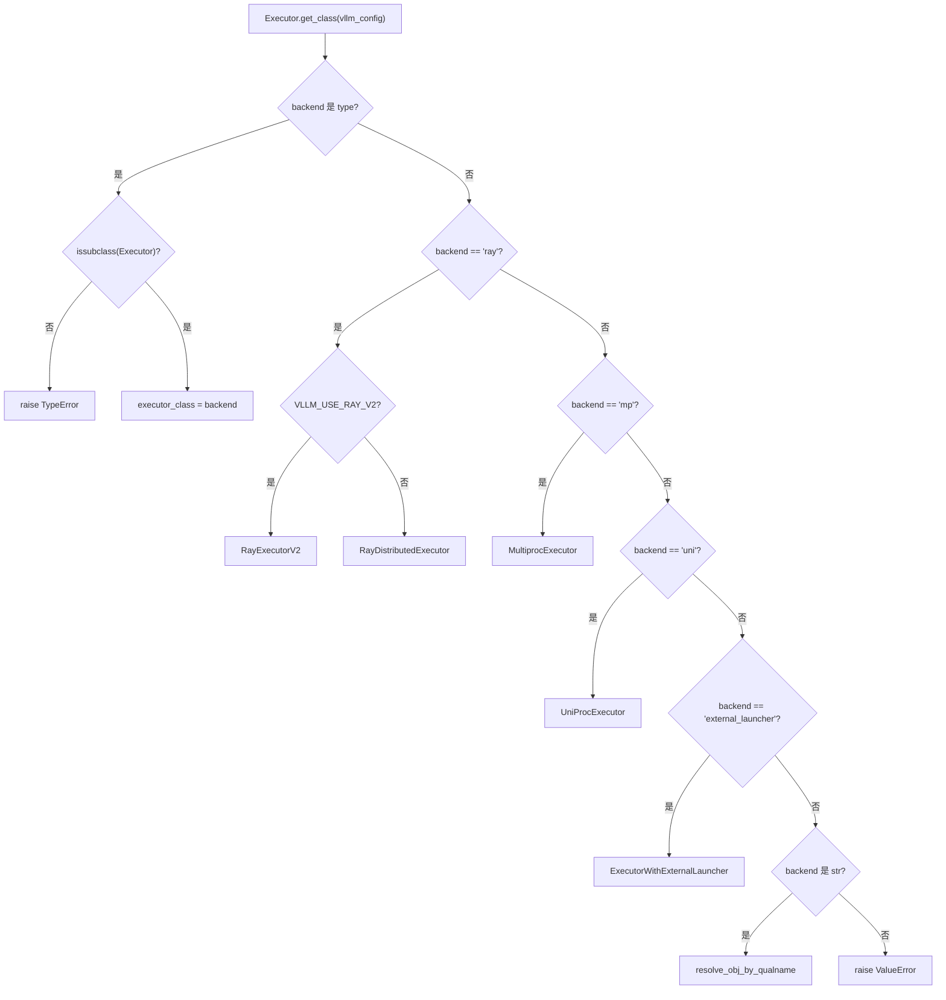
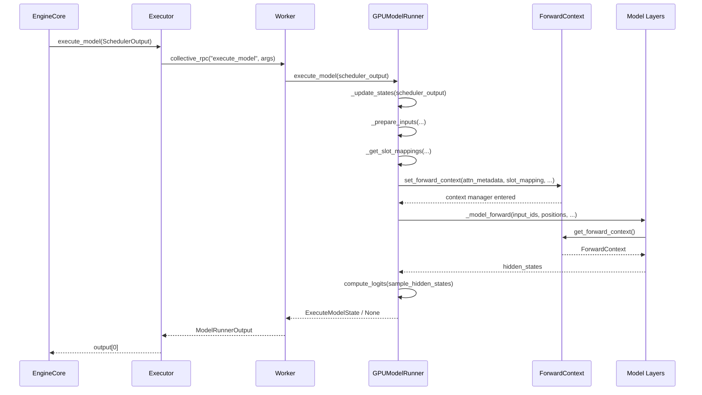

# 제 5 장: 모델 실행 주간: SchedulerOutput에서 GPU 순전파까지

이전 장에서 우리는 Scheduler가 각 단계의 스케줄링 루프에서 어떤 요청이 running 큐에 들어가고, 어떤 것이 선점되며, 어떤 것이 VRAM 부족으로 대기하는지를 결정하고, 최종적으로 SchedulerOutput을 생성하는 것을 보았다——이는 이 단계에서 무엇을 계산해야 하는지를 설명한다: 어떤 요청, 각각 얼마나 많은 토큰, 어떤 KV block을 사용하는지. 그러나 이 목록은 논리적 의도일 뿐이며, GPU가 필요로 하는 것은 물리적 텐서이다. 이 장에서는 SchedulerOutput이 Executor에 의해 Worker로 분배되고, 다시 GPUModelRunner에 의해 input_ids, positions, slot_mapping, block table 등 GPU에서 실행 가능한 입력으로 변환되며, 최종적으로 forward_context를 통해 계층 간 공유 배치 설명을 모델의 각 계층에 주입하여 스케줄링 결정에서 순전파까지의 도약을 완성하는 과정을 추적한다.

# 5.1 Executor: 스케줄링 결과를 각 카드에 전달

## 직관적 모델

`Executor`은 EngineCore와 GPU Worker 사이의 「전령관」이다. 이것이 없다면, EngineCore는 클러스터에 몇 장의 카드가 있고, 각 카드가 어느 프로세스에 있으며, 어떻게`SchedulerOutput`과거를 직렬화하는 것—스케줄링 로직이 분산 토폴로지와 얽히게 된다.`Executor`이 책임을 분리한다: EngineCore는 호출만 담당하고`execute_model(scheduler_output)`, 나머지 「누구에게 보낼지, 어떻게 보낼지, 몇 개의 결과를 받을지」는 Executor가 결정한다.

## 클래스 계층과 필드

`Executor`는 추상 기본 클래스이며, 클래스 수준 필드가 백엔드 능력을 직접 인코딩한다[FACT:vllm/v1/executor/abstract.py:48-49]：

```python
uses_ray: bool = False  # whether the executor uses Ray for orchestration.
supports_pp: bool = False  # whether the executor supports PP
```

이 두 플래그는 장식용이 아니다—상위 코드가 이들을 읽어 특정 최적화 경로를 활성화할지 결정한다.`__init__`에서 초기화된다`sleeping_tags`、`kv_output_aggregator`、`ec_output_aggregator`세 가지 상태 필드[FACT:vllm/v1/executor/abstract.py:119-120]는 각각 슬립 모드 라벨 추적, KV 커넥터 출력 집계, 인코더 커넥터 출력 집계에 사용된다.

## 백엔드 선택:`get_class`의 분기 라우팅

`get_class`는 정적 팩토리로,`distributed_executor_backend`설정에 따라 구체적인 Executor 클래스를 반환한다[FACT:vllm/v1/executor/abstract.py:51-96]. 그 분기 구조는 자세히 볼 가치가 있다:

- 설정 자체가`type`인 경우, 그것이`Executor`의 서브클래스인지 검증한 후 직접 사용한다[FACT:vllm/v1/executor/abstract.py:52-61]；
- `"ray"`분기 아래에 2차 분기가 있다:`VLLM_USE_RAY_V2_EXECUTOR_BACKEND`가 참이면`RayExecutorV2`를 사용하고, 그렇지 않으면`RayDistributedExecutor` [FACT:vllm/v1/executor/abstract.py:64-72]；
- `"mp"`를 사용한다`MultiprocExecutor`，`"uni"`는`UniProcExecutor` [FACT:vllm/v1/executor/abstract.py:73-80]；
- 로 매핑된다`resolve_obj_by_qualname`문자열 형태의 커스텀 백엔드는[FACT:vllm/v1/executor/abstract.py:85-90]。



## 복사`execute_model`Step-by-Step: 한 번의

호출 흐름`SchedulerOutput`시나리오를 대입하면: EngineCore가 한 단계 스케줄링을 완료하고`executor.execute_model(scheduler_output)`。

`Executor.execute_model`를 얻어[FACT:vllm/v1/executor/abstract.py:237-238]：

```python
def execute_model(
    self, scheduler_output: SchedulerOutput, non_block: bool = False
) -> ModelRunnerOutput | None | Future[ModelRunnerOutput | None]:
    output = self.collective_rpc(
        "execute_model", args=(scheduler_output,), non_block=non_block
    )
    return output[0]
```

> **[Design Inference & Architectural Trade-offs]**
> 복사`collective_rpc`〔설계 추론과 아키텍처 트레이드오프〕`output[0]`핵심은`output[0]`에 있다—그것은 메서드 이름과 인자를 모든 Worker에 브로드캐스트하고, 각 Worker의 반환값 리스트를 수집한 다음`collective_rpc`첫 번째만 취한다. 왜 첫 번째만 취하는가? 텐서 병렬화에서 모든 Worker는 동일한 논리적 전방향을 실행하며 출력은 의미상 동등하기 때문이다; 샘플링 결과는 마지막 PP stage 또는 rank 0에 의해 결정되므로,[FACT:vllm/v1/executor/abstract.py:220-221]를 취하는 것이 중복 집계를 피한다.`SchedulerOutput`의 문서는 명확히 「제어 메시지만 전달하고, 데이터 평면 통신은 별도로 구축하라」고 권장한다

`sample_tokens`, 이것이 바로[FACT:vllm/v1/executor/abstract.py:257-258]의 위치다—그것은 제어 메시지이며, 실제 token 데이터는 GPU 텐서를 통해 Worker 내부에서 흐른다.`None`는 같은 패턴을 따른다`execute_model`, 하지만 반환 타입에`None`를 포함하지 않는다—샘플링은 반드시 결과를 산출한다. 이 두 메서드의 분업은 vLLM v1의 「실행-샘플링 분리」 설계에 대응한다:`ExecuteModelState`는

## 를 반환할 수 있다(전방향이 제출되었지만 샘플링이 지연됨을 의미), 이때 상태는

`collective_rpc`에 임시 저장된다.`@abstractmethod` [FACT:vllm/v1/executor/abstract.py:186-192]설계 사고`MultiprocExecutor`가`RayDistributedExecutor`로 선언된다는 것은, 서로 다른 백엔드가 「어떻게 RPC를 Worker로 보낼지」를 스스로 구현해야 함을 의미한다.`UniProcExecutor`는 공유 메모리 큐를 사용하고,

는 Ray actor 호출을 사용하며,`supported_tasks`는 직접 로컬 호출한다. 이러한 추상화 덕분에 상위 코드는 분산 세부사항을 전혀 신경 쓸 필요가 없다.`@cached_property` [FACT:vllm/v1/executor/abstract.py:306-309]쉽게 간과되는 세부사항:`get_supported_tasks`가

# 로 표시되어 있으며, 주석은 「불필요한 RPC 호출을 피하라」고 직언한다. 왜냐하면

## 는 프로세스 간 통신이 필요하고, 작업 목록은 모델 생명주기 동안 변하지 않으므로 캐싱은 정확하고 필수적인 최적화다.

`GPUModelRunner`5.2 GPUModelRunner: SchedulerOutput에서 입력 텐서로`SchedulerOutput`직관적 모델

## 는 「번역가」다: 그것은

`GPUModelRunner`안의 논리적 설명(요청 ID, token 수, 블록 ID)을 GPU가 직접 소비할 수 있는 물리적 텐서로 번역한다. 이것이 없다면, 모델 계층이 「3번째 요청의 7번째 token이 어느 KV 슬롯에 있는가」 같은 문제를 스스로 처리해야 한다—이것은 재앙적인 관심사 누출이다.[FACT:vllm/v1/worker/gpu_model_runner.py:479-480]：`LoRAModelRunnerMixin`、`KVConnectorModelRunnerMixin`、`ECConnectorModelRunnerMixin`핵심 상태와 메모리 레이아웃

`__init__`는 세 가지 Mixin[FACT:vllm/v1/worker/gpu_model_runner.py:488-498]을 상속하며, 각각 LoRA 어댑테이션, KV 커넥터, 인코더 커넥터 능력을 제공한다.

- `check_ep_fault`에는 모든 설정 객체[FACT:vllm/v1/worker/gpu_model_runner.py:507-509]；
- `is_pooling_model`가 캐시되어 있으며, 몇 가지 핵심 플래그를 초기화한다:`runner_type == "pooling"`: 데이터 병렬화 > 1이고 MoE 모델일 때만, EP all2all 관리자가 내결함성을 지원하는지 조회한다[FACT:vllm/v1/worker/gpu_model_runner.py:515]；
- `enable_prompt_embeds`:[FACT:vllm/v1/worker/gpu_model_runner.py:516]。

`ExecuteModelState`에 의해 결정된다`NamedTuple`: prompt embedding 입력을 활성화할지 여부`execute_model()`는`sample_tokens()`이며,[FACT:vllm/v1/worker/gpu_model_runner.py:463-476]와`logits`、`hidden_states`、`sample_hidden_states`사이의 임시 상태를 담는다`spec_decode_metadata`、`slot_mappings`. 그 필드 설계는 실행-샘플링 분리의 본질을 드러낸다:[FACT:vllm/v1/worker/gpu_model_runner.py:464-464]。

## Step-by-Step：`_update_states`는 전방향 산물이고,

는 샘플링 단계에서 여전히 필요한 메타데이터다. 주석은 이것이 「execute_model()이 None을 반환한 후 전달되는 임시 캐시 상태」라고 명확히 말한다

**캐시 상태를 어떻게 동기화하는가**시나리오를 대입하면: 스케줄러가 이번 단계에서 요청 A(새 요청), B(이전 단계의 decode 계속), C(선점 후 복구)를 처리하기로 결정하고, 동시에 요청 D는 완료되었다.`finished_req_ids`첫 번째 단계: 완료된 요청 정리.`self.requests`는`input_batch`를 순회하며,[FACT:vllm/v1/worker/gpu_model_runner.py:1202-1217]딕셔너리에서 상태를 팝하고,`finished_req_ids`에서`scheduled_req_ids`를 제거한다. 주석이 지적하는 경계 사례에 주목하라:[FACT:vllm/v1/worker/gpu_model_runner.py:1211-1215]。

**와**는 겹칠 수 있다—요청이 중단된 후 같은 ID로 다시 제출되면, 그들은 두 개의 다른 요청으로 간주된다`new_block_ids_to_zero`두 번째 단계: 새로 할당된 KV 블록 제로화.`_zero_block_ids`만약[FACT:vllm/v1/worker/gpu_model_runner.py:1219-1222]가 비어 있지 않으면,

**를 호출하여 GPU 메모리를 제로화하고, 오래된 NaN이 어텐션 또는 SSM 계산을 오염시키는 것을 방지한다**. 이것은 PagedAttention 블록 재사용의 안전 전제다.[FACT:vllm/v1/worker/gpu_model_runner.py:1238-1247]：

```python
scheduled_req_ids = scheduler_output.num_scheduled_tokens.keys()
cached_req_ids = self.input_batch.req_id_to_index.keys()
resumed_req_ids = scheduler_output.scheduled_cached_reqs.resumed_req_ids
unscheduled_req_ids = cached_req_ids - (scheduled_req_ids - resumed_req_ids)
```

이것이 가장 실수하기 쉬운 단계다`scheduled_req_ids - resumed_req_ids`복사`scheduled_req_ids`주석은 왜`cached_req_ids`이고 직접`resumed_req_ids`가 아닌지 설명한다: 일반적으로`reset_prefix_cache`와[FACT:vllm/v1/worker/gpu_model_runner.py:1241-1246]。

**는 서로소이지만,**가 트리거한 강제 선점 시나리오에서는 복구된 요청을 영속 배치에서 먼저 제거한 후 다시 추가해야 한다`scheduled_new_reqs`네 번째 단계: 새 요청 처리.`CachedRequestState` [FACT:vllm/v1/worker/gpu_model_runner.py:1295-1308]각`RANDOM_SEED`에 대해`torch.Generator` [FACT:vllm/v1/worker/gpu_model_runner.py:1277-1284]를 구성한다. 샘플링 타입이`_init_mrope_positions`이면, 시드를 가진[FACT:vllm/v1/worker/gpu_model_runner.py:1319-1321]。

**를 생성한다. 모델이 M-RoPE를 사용하면,**를 호출하여 위치를 미리 계산한다`scheduled_cached_reqs`다섯 번째 단계: 실행 중 요청 업데이트.`num_computed_tokens` [FACT:vllm/v1/worker/gpu_model_runner.py:1402]각[FACT:vllm/v1/worker/gpu_model_runner.py:1437-1448]에 대해`req_index is None`를 업데이트하고, 블록 ID 추가 또는 교체를 처리한다`reqs_to_add` [FACT:vllm/v1/worker/gpu_model_runner.py:1450-1465]。

**. 요청이 영속 배치에 없으면(** `condense()`제거 요청이 남긴 빈 공간을 채움[FACT:vllm/v1/worker/gpu_model_runner.py:1511-1512]，`_may_reorder_batch`어텐션 백엔드가 필요에 따라 재배열하도록 함[FACT:vllm/v1/worker/gpu_model_runner.py:1513-1514]，`refresh_metadata()`배치 메타데이터를 새로 고침[FACT:vllm/v1/worker/gpu_model_runner.py:1515-1516]。

## 입력 텐서 준비:`_prepare_input_ids`의 비동기 고속 경로

`_prepare_input_ids`미묘한 문제를 처리함: 비동기 스케줄링에서 이전 단계의 샘플링 token이 아직 GPU에 있고, 이번 단계의`input_ids`에 이를 채워 넣어야 함[FACT:vllm/v1/worker/gpu_model_runner.py:1767-1772]。

정상 경로(`prev_sampled_token_ids is None`)는 CPU 텐서를 GPU로 직접 복사함[FACT:vllm/v1/worker/gpu_model_runner.py:1788-1794]. 비동기 경로는 요청을 순회하며 각 요청의 마지막 token이 평탄화된`input_ids`에서의 인덱스를 계산함[FACT:vllm/v1/worker/gpu_model_runner.py:1809-1836]. 주석에 구체적인 예시가 제시됨:`cu_num_tokens = [2, 5, 8]`、`draft_tokens = [1, 2, 2]`일 때,`sample_flattened_indices = [0, 2, 5]`，`spec_flattened_indices = [1, 3, 4, 6, 7]` [FACT:vllm/v1/worker/gpu_model_runner.py:1820-1822]。

에는 핵심 최적화가 있음[FACT:vllm/v1/worker/gpu_model_runner.py:1859-1868]：

```python
if common_indices_match and max_flattened_index == (num_common_tokens - 1):
    self.input_ids.gpu[:num_common_tokens].copy_(
        self.input_batch.prev_sampled_token_ids[:num_common_tokens, 0],
        non_blocking=True,
    )
    return
```

배치가 변경되지 않았고 재배열이 없을 때, 인덱스는`0..N-1`의 동일한 순열이므로 단일 슬라이스 복사를 바로 사용할 수 있어 scatter 오버헤드를 피할 수 있음. 이는 영속 배치 최적화의 직접적인 구현임.

## `slot_mapping`과 block table

`_get_slot_mappings`은 두 가지 형식을 반환함[FACT:vllm/v1/worker/gpu_model_runner.py:4078-4078]: KV cache group으로 인덱싱된`dict[int, torch.Tensor]`은 어텐션 메타데이터에 사용되고, 레이어 이름으로 인덱싱된`dict[str, torch.Tensor]`은`ForwardContext`에 사용됨. encoder-only KV cache group의 경우 slot mapping은 전부 0인 텐서[FACT:vllm/v1/worker/gpu_model_runner.py:4096-4115]이며, 그렇지 않으면`block_table.slot_mapping.gpu`에서 슬라이스함[FACT:vllm/v1/worker/gpu_model_runner.py:4107-4109]. 사용되지 않는 꼬리 부분은`-1`로 채우며, 주석은 이것이`reshape_and_cache`의 전체 CUDA graph 모드에서 필요하다고 설명함[FACT:vllm/v1/worker/gpu_model_runner.py:4118-4122]。

`_get_block_table`각 KV cache group에 대해 디바이스 텐서를 가져오고,[FACT:vllm/v1/worker/gpu_model_runner.py:2319-2335]으로 CUDAGraph padding 행을 채움——블록 0은 padding용으로 예약됨`NULL_BLOCK_ID`5.3 forward_context: 레이어 간 공유되는 배치 설명[FACT:vllm/v1/worker/gpu_model_runner.py:2332-2334]。

# 직관적 모델

## 은 교실 앞에 붙은 「통합 알림판」임: 각 모델 레이어는 고개를 들면 이번 시험의 좌석 배치(attention metadata)와 규칙(slot mapping)을 볼 수 있어 각자 물어볼 필요가 없음. 이것이 없다면 각 어텐션 레이어는 매개변수에서 이 정보를 받아야 하는데——모델 레이어의

`forward_context`시그니처는 고정되어 있어 레이어마다 개별적으로 매개변수를 전달할 수 없음.`forward`데이터 구조

## 은

`ForwardContext`이며, 핵심 필드는:`@dataclass` [FACT:vllm/forward_context.py:141-202]:

- `no_compile_layers`에서 복사하며, 컴파일에 참여하지 않는 레이어를 표시함`static_forward_context`: 레이어 이름에서 어텐션 메타데이터로의 매핑, DBO 모드에서는 길이 2의 리스트(microbatch마다 하나)[FACT:vllm/forward_context.py:132-137]；
- `attn_metadata`: 레이어 이름에서 slot mapping 텐서로의 매핑[FACT:vllm/forward_context.py:144-152]；
- `slot_mapping`: 런타임 CUDA graph 모드, 기본값[FACT:vllm/forward_context.py:145]；
- `cudagraph_runtime_mode`: 배치 디스크립터, CUDA graph 디스패치에 사용`NONE` [FACT:vllm/forward_context.py:155-157]；
- `batch_descriptor`: token 축의 불리언 마스크,[FACT:vllm/forward_context.py:158]；
- `is_padding`는 padding 행을 나타냄`True`은 또 다른[FACT:vllm/forward_context.py:162-165]。

`BatchDescriptor`이며, 필드 설계는 「설명 항목 최소화」 원칙을 따름:`@dataclass(frozen=True)` [FACT:vllm/forward_context.py:30-57](PIECEWISE 모드에서는 None 가능),`num_tokens`、`num_reqs`(모든 요청의 token 수가 동일),`uniform`. 주석은`has_lora`、`num_active_loras`의 존재 이유를 설명함:`num_active_loras`이 활성화되면 각 LoRA 수량 값이 독립 CUDA graph를 캡처하는데,`cudagraph_specialize_lora_count`등의 커널 grid size가 이 값에 의존하기 때문임`fused_moe_lora`전역 싱글턴과 컨텍스트 관리[FACT:vllm/forward_context.py:60-64]。

## 은 모듈 수준 전역 변수

`_forward_context`이며,[FACT:vllm/forward_context.py:199-201]컨텍스트 관리자를 통해 진입 시 이전 값을 저장하고 종료 시 복원함`override_forward_context`은 더 상위 수준의 래퍼[FACT:vllm/forward_context.py:263-274]。`set_forward_context`로, DP 메타데이터 구성, batch descriptor 자동 생성, 플랫폼별 kwargs 주입을 추가로 처리함.[FACT:vllm/forward_context.py:277-394]Step-by-Step:

## 에서 모델 전방향까지`execute_model`시나리오 대입:

이 모든 입력 텐서를 준비했고, 곧 모델을 호출함.`GPUModelRunner.execute_model`에서

,`execute_model`이 호출됨`set_forward_context`복사[FACT:vllm/v1/worker/gpu_model_runner.py:4408-4420]：

```python
with (
    set_forward_context(
        attn_metadata,
        self.vllm_config,
        num_tokens=num_tokens_padded,
        num_tokens_across_dp=num_tokens_across_dp,
        cudagraph_runtime_mode=cudagraph_mode,
        batch_descriptor=batch_desc,
        ubatch_slices=ubatch_slices_padded,
        slot_mapping=slot_mappings,
        skip_compiled=has_encoder_input,
        is_padding=is_padding,
    ),
    ...
):
    model_output = self._model_forward(...)
```

`set_forward_context`를 구성하고(DP 또는 시퀀스 병렬 MoE가 활성화된 경우)`DPMetadata`, 그다음[FACT:vllm/forward_context.py:299-328]을 호출해`create_forward_context`인스턴스를 구성하며`ForwardContext`, 마지막으로[FACT:vllm/forward_context.py:347-358]를 통해 전역 변수를 설정함`override_forward_context`모델 레이어는[FACT:vllm/forward_context.py:361-362]。

을 통해`get_forward_context()`을 읽음[FACT:vllm/forward_context.py:208-214]. 설정되지 않았다면 어서션이 실패하고`set_forward_context`。



## 복사

> **[Design Inference & Architectural Trade-offs]**
> 〔설계 추론 및 아키텍처 트레이드오프〕`forward`왜 전역 변수를 쓰고 명시적 매개변수 전달을 하지 않는가? 모델 레이어의`get_forward_context()`시그니처는 HuggingFace 규약에 의해 고정되어 있어 레이어마다 추가 매개변수를 주입할 수 없기 때문임. 전역 변수 + 컨텍스트 관리자는 모델 코드를 수정하지 않고 레이어 간 주입을 구현할 수 있는 유일한 방안임. 대가는 암시적 의존성——`set_forward_context`의 호출자는 자신이

`is_padding`의 스코프 안에 있음을 반드시 보장해야 함.[FACT:vllm/forward_context.py:162-165]필드의 설계는 주목할 만함

`all_moe_layers`: 주석은 「소비자가 이를 사용해 padding token 작업을 건너뛸 수 있다」고 말함. 이는 CUDA graph 시나리오의 최적화——padding 행은 그래프 캡처에 참여하지만 실제 계산을 생성해서는 안 됨.`moe_layer_index`과[FACT:vllm/forward_context.py:170-195]은 한 쌍의 교묘한 workaround`vllm.moe_forward`임. 주석은 문제를 자세히 설명함:`ForwardContext`사용자 정의 연산자는 레이어 이름 문자열을 그래프에 하드코딩하여 torch.compile 콜드 스타트 시간이 너무 길어짐. 해결책은 레이어 이름 리스트를[FACT:vllm/forward_context.py:182-184]。

# 에 저장하고, 사용자 정의 연산자가 순서대로 문자열을 꺼내고 카운터를 증가시키는 것임. 주석은 또한 이것이 「사용자 정의 연산자가 순서대로 실행되고 torch.compile이 재배열하지 않는다」는 가정에 의존함을 솔직히 인정함

**설계 사고와 프로덕션 함정** `_update_states`비동기 스케줄링의 상태 일관성.`output_token_ids`은 비동기 투기적 디코딩에서 「낙관적 가정」 전략을 채택함: 이전 단계의 모든 draft token이 수락되었다고 가정하고 먼저[FACT:vllm/v1/worker/gpu_model_runner.py:1376-1384]를 확장한 다음, 지연 수정 함수[FACT:vllm/v1/worker/gpu_model_runner.py:1509-1510]를 등록함. 수정 함수는 모델 전방향이 시작된 후`num_computed_tokens` [FACT:vllm/v1/worker/gpu_model_runner.py:1547-1558]에 호출되어, GPU에서 실제 수락 수를 읽고

**`_may_reorder_batch`를 롤백함. 이 설계의 정교함은 수정이 「배치가 이미 시작된」 이후에 발생하여 전방향을 차단하지 않고 비동기 파이프라인의 연속성을 유지한다는 점에 있음.**의 트리거 조건.`kv_cache_groups`이 메서드는 먼저[FACT:vllm/v1/worker/gpu_model_runner.py:1131-1132]이 비어 있는지 확인함`is_attention_free`: Mamba 모델도 attention-free이지만, KV cache를 사용해 내부 상태를 저장한다[FACT:vllm/v1/worker/gpu_model_runner.py:1116-1139]. 실제로 KV cache group이 없는 모델만 재배치를 건너뛴다.

**`_prepare_input_ids`의 인덱스 계산 함정.**배치에 이전 단계의 decode 요청과 새 요청이 함께 있을 때,`num_common_tokens < total_without_spec`, CPU 텐서를 먼저 복사한 후 scatter해야 한다[FACT:vllm/v1/worker/gpu_model_runner.py:1849-1854]. 만약`num_common_tokens == 0`, 이전 단계와 겹치는 요청이 전혀 없음을 의미하므로 바로 반환한다[FACT:vllm/v1/worker/gpu_model_runner.py:1855-1858]. 이 두 분기의 구분은 매우 중요하다——어느 하나라도 놓치면`input_ids`부분이 초기화되지 않는다.

**`AsyncGPUModelRunnerOutput`의 스트림 동기화.**출력 복사는 독립적인 CUDA stream에서 수행된다[FACT:vllm/v1/worker/gpu_model_runner.py:308-328], 사용`blocking=True`의 Event로 CUDA 드라이버 잠금의 바쁜 폴링을 방지한다[FACT:vllm/v1/worker/gpu_model_runner.py:296-298]。`get_output()`에서 먼저 synchronize한 후 디바이스 텐서 참조를 해제한다[FACT:vllm/v1/worker/gpu_model_runner.py:336-340], 순서를 바꿀 수 없다——그렇지 않으면 텐서가 복사 완료 전에 회수될 수 있다.

# 이 장 요약

이 장에서는`SchedulerOutput`의 EngineCore에서 GPU 전방향까지의 전체 경로를 추적했다.`Executor`를 통해`collective_rpc`스케줄링 결과를 모든 Worker에 브로드캐스트하고,`GPUModelRunner`의`_update_states`로 캐시 상태를 동기화하고,`_prepare_inputs`입력 텐서를 구성하고,`_get_slot_mappings`KV 슬롯 매핑을 생성하며, 마지막으로`set_forward_context`배치 설명을 전역 컨텍스트에 주입하여 모델의 각 레이어에서 소비하도록 한다. 비동기 스케줄링 경로는 낙관적 가정 + 지연 수정을 통해 파이프라인 연속성을 유지하며,`ForwardContext`의 전역 싱글톤 설계는 모델 레이어 시그니처 고정과 크로스 레이어 메타데이터 주입 사이의 모순을 해결한다.

# 이 장의 생각과 자습

Q1: `_update_states`에서`unscheduled_req_ids = cached_req_ids - (scheduled_req_ids - resumed_req_ids)`이 표현식에서, 만약`resumed_req_ids`를 뺄셈에서 제거하여`cached_req_ids - scheduled_req_ids`로 바꾸면, 어떤 시나리오에서 상태 불일치가 발생하는가?

**참고 해석**: 주석은 명확히 지적한다[FACT:vllm/v1/worker/gpu_model_runner.py:1241-1246]，`cached_req_ids`와`resumed_req_ids`는 일반적으로 교차하지 않지만,`reset_prefix_cache`에 의해 트리거된 강제 선점 시나리오에서 하나의 요청이 동시에`cached_req_ids`와`resumed_req_ids`에 나타날 수 있다. 이때`scheduled_req_ids - resumed_req_ids`는 이 요청을 '스케줄됨' 집합에서 제외하여`unscheduled_req_ids`에 떨어뜨려, 영속 배치에서 먼저 제거한 후 정상적인 resumed 경로를 통해 다시 추가한다. 만약`resumed_req_ids`를 제거하면, 해당 요청은 '스케줄됨'으로 간주되어 배치에 남지만, 블록 ID가 이미 교체되었으므로(`req_state.block_ids = new_block_ids` [FACT:vllm/v1/worker/gpu_model_runner.py:1448]), block table의 이전 행과 새 블록 ID가 일치하지 않아 attention 계산이 잘못된 KV 위치를 읽게 된다.

Q2: `_prepare_input_ids`의 빠른 경로[FACT:vllm/v1/worker/gpu_model_runner.py:1859-1868]는`common_indices_match and max_flattened_index == (num_common_tokens - 1)`를 조건으로 사용한다. 만약 배치 내 요청 순서가 변경되었지만(예: attention 백엔드가 배치를 재배치),`common_indices_match`가 여전히 True라면, 무슨 일이 발생하는가?

**참고 해석**：`common_indices_match`는 루프에서`prev_index == flattened_index`를 통해[FACT:vllm/v1/worker/gpu_model_runner.py:1835]。`prev_index`를 누적한다`prev_positions`에서, 현재 배치 위치를 이전 단계 배치 위치로 매핑한다;`flattened_index`는 현재 배치에서 해당 요청의 마지막 token의 플랫 인덱스이다. 만약 배치가 재배치되면,`prev_index`와`flattened_index`의 대응 관계가 변경되어,`common_indices_match`가 False가 되고 빠른 경로가 트리거되지 않는다. 하지만 재배치가 우연히`prev_index == flattened_index`가 모든 요청에 대해 성립하도록 만들면(예: token 수가 같은 두 요청을 교환), 빠른 경로는 잘못하여`prev_sampled_token_ids[:num_common_tokens, 0]`로 직접 슬라이스 복사한다——이것은 요청 A의 샘플링 token을 요청 B의 위치에 채우게 된다.`max_flattened_index == num_common_tokens - 1`이 추가 조건은 바로 이러한 퇴화 상황을 방지하기 위한 것이다: 플랫 인덱스가 정확히`0..N-1`의 순열이어야 하며, 모든 비자명한 재배치를 배제한다.

Q3: `ForwardContext`는 모듈 수준 전역 변수`_forward_context`를 사용하며, 스레드 로컬 변수가 아니다.`execute_model`와`sample_tokens`가 분리된 비동기 스케줄링에서, 만약`sample_tokens`가 전방향 완료 전에 호출되면,`get_forward_context()`는 무엇을 반환하는가? 이것이 어떤 문제를 일으키는가?

**참고 해석**：`set_forward_context`는 컨텍스트 관리자[FACT:vllm/forward_context.py:278-288]이며,`with`블록 종료 시`override_forward_context`의`finally`를 통해 이전 값을 복원한다[FACT:vllm/forward_context.py:263-274].`execute_model`에서,`set_forward_context`의`with`블록은`_model_forward`호출만 감싸며[FACT:vllm/v1/worker/gpu_model_runner.py:4408-4433], 전방향 반환 후 컨텍스트가 복원된다. 만약`sample_tokens`가 전방향 완료 후 호출되면,`get_forward_context()`는 어서션 실패를 일으킨다[FACT:vllm/forward_context.py:208-214], 왜냐하면`_forward_context`가 이미`None`(또는 외부 값)으로 재설정되었기 때문이다. 이것이 바로`ExecuteModelState`가 존재하는 이유이다[FACT:vllm/v1/worker/gpu_model_runner.py:463-476]: 샘플링에 필요한 상태(`logits`、`hidden_states`、`slot_mappings`)는 NamedTuple에 명시적으로 저장되며,`ForwardContext`의 암시적 전달에 의존하지 않는다. 만약`ForwardContext`가`sample_tokens`에서 여전히 사용 가능하다고 잘못 가정하면, 어서션 오류가 발생하거나 잘못된 메타데이터를 읽게 된다.

여기까지, 우리는 SchedulerOutput에서 GPU 전방향 전파까지의 전체 경로를 걸어왔다: Executor 디스패치, Worker 실행, GPUModelRunner가 논리적 목록을 물리적 텐서로 변환하고, forward_context를 통해 배치 설명을 각 레이어에 주입한다. 그러나 모델 전방향 전파에서 가장 시간이 많이 걸리는 부분——attention 계산——은 아직 펼쳐지지 않았다. 다음 장에서는 attention 백엔드로 깊이 들어가, attn_metadata의 block table과 slot mapping이 PagedAttention 커널에 의해 어떻게 소비되는지, 그리고 FlashAttention, FlashInfer, Triton 등 다양한 백엔드가 통합 인터페이스를 통해 어떻게 선택되고 스케줄링되는지 살펴본다.
