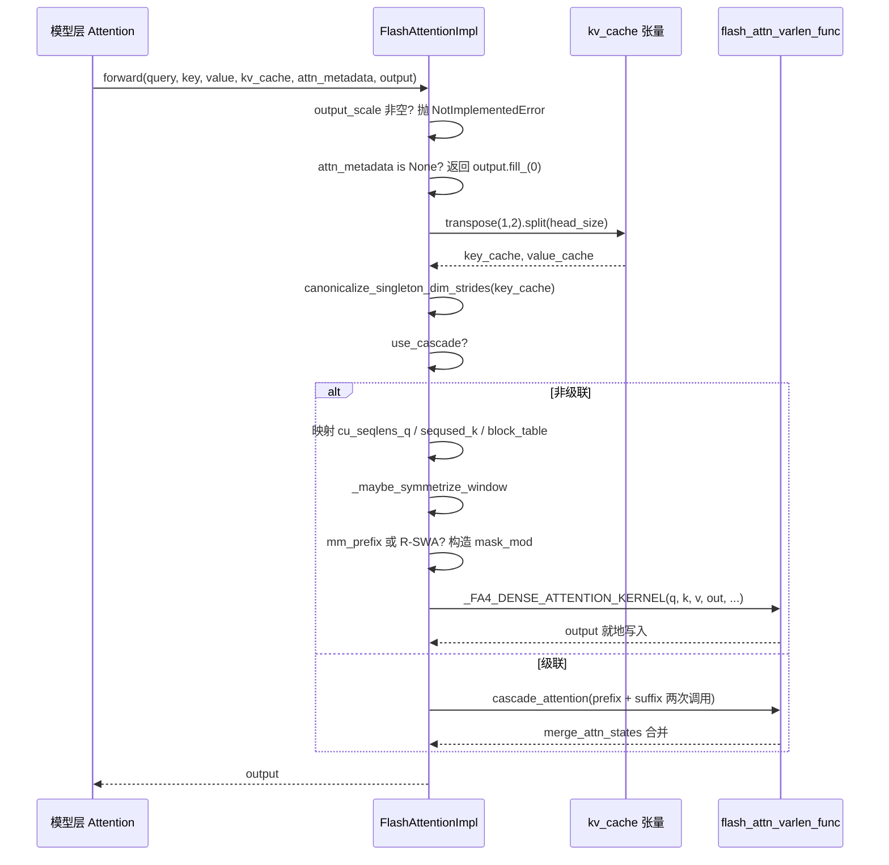

# 제 6 장: Attention 백엔드와 PagedAttention 커널 구현

지난 장에서 우리는 GPUModelRunner가 스케줄링 결과를 input_ids, slot_mapping, block_table 등의 물리적 텐서로 변환하고 forward_context를 통해 각 레이어에 주입하는 방법을 살펴보았다. 하지만 실제로 GPU 시간을 가장 많이 소모하는 부분인 어텐션 계산은 아직 공중에 떠 있다. attn_metadata 안의那些 텐서들은究竟 누가 소비하는가? FlashAttention, FlashInfer, Triton 같은 구현들이凭什么 동일한 모델 코드 아래에서 서로 교체 가능한가? 답은 AttentionBackend 추상화 계층에 있다. 이는 "어텐션을 어떻게 계산하는가"와 "모델이 어떻게 호출하는가"를 분리한다: 모델 계층은 AttentionImpl 참조만 보유하고 통일된 forward(query, key, value, kv_cache, attn_metadata, output)를 호출하며, 구체적 백엔드는 block_table, slot_mapping, seq_lens를 자체 커널이 소화할 수 있는 파라미터로 변환하는 역할을 담당한다. 이 장에서는 FlashAttentionBackend를 주된 흐름으로 삼는데, 이는 PagedAttention의 gather 의미론, CUDA Graph 호환성, 계단식 어텐션, DCP 분산 컨텍스트 등 가장 풍부한 분기를 동시에 포괄하기 때문이다. 이를 완전히 이해하면 다른 백엔드는 단지 파라미터 매핑의 변형일 뿐이다. 이러한 "백엔드 등록 + 통일 인터페이스" 설계의 동기는 매우 직접적이다: 어텐션 커널은 진화가 매우 빠르며(FA2→FA3→FA4, FlashInfer 반복, Triton 자체 개발), 모델 계층이 특정 커널에 직접 의존하면 커널 업그레이드 때마다 모델 코드를 수정해야 한다. 추상화 계층은 변화를 get_impl_cls()라는 하나의 팩토리 메서드 뒤에 격리한다.

# 백엔드 선택: 능력 선언과 메타데이터 구축

## 직관적 모델

를`AttentionBackend`구인 공고라고 생각하자: 그것은 일을 하지 않고 단지 "내가 어떤 dtype, 어떤 head_size, 어떤 KV cache 양자화 형식, 어떤 attention 유형을 처리할 수 있는지"만 선언한다. 스케줄러는 모델 설정을 가지고 매칭하며, 매칭에 실패하면 다음 후보로 넘어간다. 이러한 선언 계층이 없다면 시스템은 런타임에 "이 head_size는 커널이 지원하지 않는다"는 것을 발견하고 바로 크래시할 것이다.

## 능력 행렬: 필드가 곧 계약

`FlashAttentionBackend`의 클래스 속성이 곧 그 능력의 경계이다.`supported_dtypes`fp16/bf16을 제한하고[FACT:vllm/v1/attention/backends/flash_attn.py:287-287]；`supported_kv_cache_dtypes`추가로 fp8 계열을 허용한다[FACT:vllm/v1/attention/backends/flash_attn.py:298-299]. 하지만 "지원을 선언"하는 것이 "무조건 지원"과 같지는 않다——`supports_kv_cache_dtype`양자화 KV에 대해서는 추가로`flash_attn_supports_kv_cache_dtype`에 위임하여 장치 관련 판단을 수행한다[FACT:vllm/v1/attention/backends/flash_attn.py:431-438]。

더 정교한 것은`supports_combination`이다: 이는 head_size, dtype, block_size, use_mla, has_sink 등 일련의 조합 파라미터를 받아`None`를 반환하면 사용 가능, 문자열을 반환하면 거부 이유를 나타낸다[FACT:vllm/v1/attention/backends/flash_attn.py:454-507]. 예를 들어 sink는 연산 능력 < 9.0에서 거부되며[FACT:vllm/v1/attention/backends/flash_attn.py:467-468], SM90에서 FP8 KV와 mm_prefix 조합은 반드시 Triton을 거쳐야 한다[FACT:vllm/v1/attention/backends/flash_attn.py:472-472]. 이러한 "이유 문자열 반환" 설계는 상위 계층이 진단 가능한 오류를 제공할 수 있게 하며, 조용한 폴백을 방지한다.

block_size 선택 역시 능력에 의해 주도된다. 기본적으로`MultipleOf(16)`를 반환하지만, SM90 FP8-KV는 64를 강제하며[FACT:vllm/v1/attention/backends/flash_attn.py:297-324], FA4의 head_size=256 커널은`FA4_HD256_PAGE_SIZE` [FACT:vllm/v1/attention/backends/flash_attn.py:326-352]를 강제한다. 이는 KV cache의 block 크기가 아무렇게나 정해지는 것이 아니라——커널의 TMA tile 크기에 의해 역으로 제약됨을 설명한다.

## 메타데이터 구조: FlashAttentionMetadata의 필드 레이아웃

`FlashAttentionMetadata`은 dataclass이며, 필드는 네 그룹으로 나뉜다[FACT:vllm/v1/attention/backends/flash_attn.py:511-566]：

첫 번째 그룹은 기본 배치 설명이다:`num_actual_tokens`(패딩을 제거한 실제 token 수),`max_query_len`、`query_start_loc`(접두사 합, varlen 커널이 각 시퀀스의 시작과 끝을 찾는 데 사용),`seq_lens`、`block_table`、`slot_mapping` [FACT:vllm/v1/attention/backends/flash_attn.py:520-526]. 소스 코드 주석에 있는 ASCII 그림[FACT:vllm/v1/attention/backends/flash_attn.py:512-518]에 주목하라, 이는`context_len`(과거 KV),`query_len`(이번에 추가),`seq_len`(둘의 합)——을 정확히 구분하며, 이는 varlen 커널 파라미터를 이해하는 핵심이다.

두 번째 그룹은 계단식 어텐션 필드이다:`use_cascade`、`common_prefix_len`、`cu_prefix_query_lens`등[FACT:vllm/v1/attention/backends/flash_attn.py:528-533]。

세 번째 그룹은 DCP(Decode Context Parallel) 필드이다:`max_dcp_context_kv_len`、`dcp_context_kv_lens`, 그리고 decode/prefill 요청 수를 구분하는 카운터[FACT:vllm/v1/attention/backends/flash_attn.py:535-544]。

네 번째 그룹은 선택적 스케줄링과 특수 마스크이다:`scheduler_metadata`(FA3 AOT 스케줄링용),`causal`(bool 또는 텐서가 될 수 있으며, 시퀀스별 인과 지원),`mm_prefix_query_range_tensor`(멀티모달 양방향 범위), R-SWA 관련 필드[FACT:vllm/v1/attention/backends/flash_attn.py:546-566]。

> **[Design Inference & Architectural Trade-offs]**
> `causal`필드 타입이`bool | torch.Tensor`이고 순수 bool이 아닌 이유는 "동일 배치에서 일부 시퀀스는 인과적, 일부는 비인과적"인 시나리오(예: PrefixLM)를 지원하기 위함이다. 이것이 텐서일 때 FA4의`dynamic_causal`파라미터가 이를 인수하고, FA2/FA3는 직접 NotImplementedError를 던진다[FACT:vllm/v1/attention/backends/flash_attn.py:1429-1433]。

## build()의 단계별 진행

시나리오 대입: 혼합 배치, 3개의 decode 시퀀스 + 2개의 prefill 시퀀스, 계단식 없음, DCP 없음.

첫 번째 단계,`common_attn_metadata`에서 기본 텐서를 언패킹한다[FACT:vllm/v1/attention/backends/flash_attn.py:824-832]. 두 번째 단계에서는 AOT 스케줄링을 활성화할지 결정합니다:`aot_schedule = self.aot_schedule and not fast_build and not envs.VLLM_BATCH_INVARIANT` [FACT:vllm/v1/attention/backends/flash_attn.py:836-838]。`self.aot_schedule`에서`__init__`이`get_flash_attn_version() == 3`를 결정합니다[FACT:vllm/v1/attention/backends/flash_attn.py:709-709]— FA3만 사전 계산된 스케줄링 메타데이터를 지원합니다. 세 번째 단계에서는 최초 build 시 지연 방식으로`aot_sliding_window`를 채웁니다: 모든`FlashAttentionImpl`레이어를 순회하며 슬라이딩 윈도우 구성을 수집하고, 구성이 유일하면 채택하며, 하나보다 많으면 AOT를 비활성화합니다[FACT:vllm/v1/attention/backends/flash_attn.py:848-851]。

네 번째 단계에서는`max_num_splits`를 계산합니다. 기본값은 0입니다(FA3가 휴리스틱을 사용하도록). full CUDA graph가 활성화되고 토큰 수가 캡처 범위 안에 있을 때만`self.max_num_splits` [FACT:vllm/v1/attention/backends/flash_attn.py:856-866]로 설정합니다. 주석은 그 이유를 설명합니다:`num_splits > 1`는`[num_splits, num_heads, num_tokens, head_size]`의 중간 버퍼를 할당하므로 VRAM 비용이 높고, CUDA graph 시나리오에서만[FACT:vllm/v1/attention/backends/flash_attn.py:862-865]。

할 가치가 있습니다`_get_scheduler_metadata`다섯 번째 단계에서는 비계단식 비 DCP 분기를 타고,[FACT:vllm/v1/attention/backends/flash_attn.py:976-986]를 호출해 FA3의 스케줄링 메타데이터를 생성합니다`_store_scheduler_metadata`. 여섯 번째 단계에서는[FACT:vllm/v1/attention/backends/flash_attn.py:671-684]가 CUDA graph 시나리오를 처리합니다: 새 메타데이터를 사전 할당된 버퍼에 복사하고 나머지 부분을 0으로 지웁니다[FACT:vllm/v1/attention/backends/flash_attn.py:671-672]。

. 이 0 초기화 단계는 매우 중요합니다—주석은 그렇지 않으면 일부 thread block이 유효하지 않은 메타데이터를 읽고 출력 버퍼를 덮어쓴다고 명확히 밝힙니다`FlashAttentionMetadata`일곱 번째 단계에서는[FACT:vllm/v1/attention/backends/flash_attn.py:992-1015]。

```mermaid
flowchart TD
    start["build(common_prefix_len, common_attn_metadata)"] --> unpack["解包 query_start_loc / seq_lens / block_table / slot_mapping"]
    unpack --> aot{"aot_schedule 且非 fast_build 且非 BATCH_INVARIANT?"}
    aot -->|是| sw_check{"aot_sliding_window 已初始化?"}
    aot -->|否| maxsplit
    sw_check -->|否, 首次| collect["_get_sliding_window_configs 收集层滑窗"]
    collect --> sw_unique{"配置数量 == 1?"}
    sw_unique -->|是| set_sw["设置 aot_sliding_window"]
    sw_unique -->|否, >1| disable_aot["self.aot_schedule = False"]
    set_sw --> maxsplit
    disable_aot --> maxsplit
    sw_check -->|是| maxsplit["计算 max_num_splits"]
    maxsplit --> cg_check{"use_full_cuda_graph 且 tokens |是| set_splits["max_num_splits = self.max_num_splits"]
    cg_check -->|否| zero_splits["max_num_splits = 0"]
    set_splits --> branch
    zero_splits --> branch
    branch{"dcp_world_size > 1?"}
    branch -->|是| dcp_path["计算 dcp_context_kv_lens, 可能 skip"]
    branch -->|否| cascade_check{"common_prefix_len > 0?"}
    cascade_check -->|是| cascade_path["构造 prefix/suffix 双份 scheduler_metadata"]
    cascade_check -->|否| normal_path["_get_scheduler_metadata 单份"]
    dcp_path --> store
    cascade_path --> store
    normal_path --> store
    store["_store_scheduler_metadata: CUDA graph 时拷入预分配缓冲并清零尾部"] --> build_meta["构造 FlashAttentionMetadata"]
    build_meta --> mm_check{"mm_req_doc_ranges 非空?"}
    mm_check -->|是| fill_mm["fill_mm_prefix_query_ranges + 拷贝到 GPU"]
    mm_check -->|否| rswa_check
    fill_mm --> rswa_check{"rswa_window 非空?"}
    rswa_check -->|是| copy_rswa["拷贝 prefix_lens 到持久缓冲"]
    rswa_check -->|否| done
    copy_rswa --> done["返回 attn_metadata"]
```

---

# 를 반환합니다

## 복사

`forward()`forward(): 메타데이터에서 커널 호출까지의 전체 경로

## 직관적 모델

는 백엔드의 "최종 조립 공장"입니다: 모델 레이어가 계산한 Q/K/V, KV cache 텐서, 그리고 이전 단계에서 구성한 메타데이터를 받아 KV cache의 물리적 레이아웃을 커널이 기대하는 형태로 조정한 다음 구체적인 커널로 디스패치합니다. 이 단계가 없으면 커널이 잘못된 메모리 레이아웃을 읽어 출력이 조용히 잘못됩니다—충돌보다 디버깅하기 더 어렵습니다.`[num_blocks, num_kv_heads, block_size, 2 * head_size]`KV cache의 메모리 레이아웃 변환[FACT:vllm/v1/attention/backends/flash_attn.py:1246-1247]vLLM의 KV cache 물리적 형태는`[num_blocks, block_size, num_kv_heads, head_size]`。

입니다—K와 V가 마지막 차원에 결합되어 있습니다`forward()`. 하지만 FlashAttention 커널은 K와 V가 분리되어 있고 레이아웃이`kv_cache.transpose(1, 2).split(self.head_size, dim=-1)` [FACT:vllm/v1/attention/backends/flash_attn.py:1310-1310]。`transpose(1,2)`이기를 기대합니다`[blocks, heads, block_size, 2D]`변환은`[blocks, block_size, heads, 2D]`，`split`시작 부분에서 일어납니다:`transpose`는

를`canonicalize_singleton_dim_strides` [FACT:vllm/v1/attention/backends/flash_attn.py:1310-1310]로 바꾸고 마지막 차원을 따라 K와 V로 자릅니다. 참고로`num_kv_heads=1`는 stride만 바꾸고 데이터는 옮기지 않으므로, 이후 커널은 비연속 접근을 지원해야 합니다.[FACT:vllm/v1/attention/backends/flash_attn.py:1310-1310]바로 뒤에는

## 가 이어집니다. 주석은 동기를 분명히 밝힙니다:

(TP 시나리오에서 흔함)일 때 size-1 차원의 stride는 퇴화되며, FA3/FA4는 H100+에서 TMA를 사용하므로 stride가 최소 16바이트 정렬을 요구합니다`if not attn_metadata.use_cascade`. 이는 전형적인 "논리적으로는 동등하지만 물리적으로는 불법"인 함정입니다.[FACT:vllm/v1/attention/backends/flash_attn.py:1326-1342]：`cu_seqlens_q = query_start_loc`，`seqused_k = seq_lens`，`block_table = attn_metadata.block_table`。`descale_shape`비계단식 경로의 파라미터 흐름`(batch_size, num_kv_heads)`분기에 들어간 뒤 파라미터가 하나씩 매핑됩니다`(num_sequences, num_kv_heads)`는`.expand()`를 취해 FP8 양자화의 scale 브로드캐스트에 사용합니다—주석은 flash-attn이 기대하는 descale 형태가[FACT:vllm/v1/attention/backends/flash_attn.py:1258-1258]。

라고 설명하며,`_maybe_symmetrize_window`를 사용해 복사를 피합니다`(w, 0)`다음은 슬라이딩 윈도우의 대칭화 처리입니다.`(w, w)`의 로직: 인과적 슬라이딩 윈도우[FACT:vllm/v1/attention/backends/flash_attn.py:587-589]는 비인과적 시나리오에서[FACT:vllm/v1/attention/backends/flash_attn.py:1362-1365]。

## 로 바뀌어 양방향 query가 두 방향을 볼 수 있게 합니다

. 주석은 또한 "레이어 자체의 window가 group의 window보다 우선한다"고 강조합니다. 하나의 KV cache group이 윈도우 레이어와 전역 레이어를 동시에 담을 수 있기 때문입니다(예: Gemma-3에서 hybrid KV cache manager를 끈 경우)`mm_prefix_query_ranges`마스크 분기: mm_prefix와 R-SWA`mask_mod` [FACT:vllm/v1/attention/backends/flash_attn.py:1374-1407]가 비어 있지 않고 FA4 + 정적 인과 조건을 만족할 때, 코드는 CuTE-DSL의`causal = False`를 구성합니다`sliding_window_size = None` [FACT:vllm/v1/attention/backends/flash_attn.py:1406-1407]. 핵심 동작은`(causal ∧ window) ∨ bidirectional-range`와[FACT:vllm/v1/attention/backends/flash_attn.py:1402-1405]。

`_make_mm_prefix_mask_mod`입니다. 주석은 그 이유를 설명합니다: mm_prefix의 의미는`functools.cache`이며 causal의 부분집합이 아닙니다; FA #155 이후 mask_mod를 설정해도 causal/local이 자동으로 지워지지 않으므로, 호출자가 명시적으로 꺼야 합니다. 그렇지 않으면 내장 causal 경로가 mask_mod를 단락시킵니다[FACT:vllm/v1/attention/backends/flash_attn.py:1793-1802]는`hash_callable`를 사용해`repr()`를 캐시합니다`_load_q_range`. 주석은 강력한 근거를 제시합니다: FA4의[FACT:vllm/v1/attention/backends/flash_attn.py:1793-1802]는 클로저 셀의

를 컴파일 키에 섞어 넣고, 중첩된`q_idx`는 호출마다 주소가 달라져 매 forward마다 전체 JIT 재컴파일을 유발합니다`kv_idx`. 이는 프로덕션 환경 성능 함정의 전형적인 표본입니다.`q_abs = q_idx + seqlen_k - seqlen_q`마스크 내부에는 좌표 변환 세부 사항이 있습니다: FA4가 전달하는 것은 로컬[FACT:vllm/v1/attention/backends/flash_attn.py:1859-1865]。`__vec_size__ = 1`(현재 prefill chunk 내 0-based)이고,`_load_q_range`는 절대 위치입니다. 코드는[FACT:vllm/v1/attention/backends/flash_attn.py:1897-1897]。

를 사용해 절대 위치를 복원합니다`causal & (in_prefix | in_window)` [FACT:vllm/v1/attention/backends/flash_attn.py:1945-1948]의 설정에도 이유가 있습니다:`use_fast_sampling = True`는 lane 0을 읽고, 한 번의 호출이 query 행을 넘을 수 없습니다[FACT:vllm/v1/attention/backends/flash_attn.py:1950-1950]。

## R-SWA의 mask_mod도 비슷하지만 의미는

이고,`self.fa4_hd256`는 FA4가 완전히 마스크된 KV block을 건너뛰게 하여 해당 데이터를 로드하지 않습니다`num_pages = cdiv(max_seqlen_k, FA4_HD256_PAGE_SIZE)`，`max_seqlen_k`FA4 hd256의 특수 처리`block_table`가 참일 때 코드는 page 정렬을 강제합니다:`num_splits = 1` [FACT:vllm/v1/attention/backends/flash_attn.py:1442-1448]는 페이지 경계로 올림하고,

는 정확한 페이지 수로 자르며,`_FA4_DENSE_ATTENTION_KERNEL(...)`. 주석은 hd256 커널이 페이지 정렬 길이, 정확한 너비의 block table을 요구하고 SplitKV를 지원하지 않는다고 설명합니다.[FACT:vllm/v1/attention/backends/flash_attn.py:1450-1475]。

## 최종적으로

`forward()`를 호출하여 q, k, v, out, cu_seqlens_q, seqused_k, block_table, softcap, mask_mod, aux_tensors 등을 함께 전달합니다`do_kv_cache_update`KV cache 쓰기: do_kv_cache_update`reshape_and_cache_flash`는 KV cache를 읽기만 하며, 쓰기는`slot_mapping`가 수행합니다. 이는[FACT:vllm/v1/attention/backends/flash_attn.py:1532-1541]를 호출하고,`key`/`value`를 사용해 새로 계산된 K/V를 cache에 산란 기록합니다`slot_mapping`아니요, 하지만 수동 슬라이싱은 필요하지 않습니다. 왜냐하면 op가`slot_mapping`의 shape로 실제 token 수를 결정하기 때문입니다[FACT:vllm/v1/attention/backends/flash_attn.py:1527-1531]. 여기서는 stride 정규화를 하지 않습니다. TMA 커널이 참여하지 않기 때문입니다[FACT:vllm/v1/attention/backends/flash_attn.py:1520-1521]。



---

# 설계 사고: 왜 이렇게 작성했는가

> **[Design Inference & Architectural Trade-offs]**
> **능력 선언과 구현 분리**。`supports_combination`은 bool 대신 이유 문자열을 반환합니다. 이는 상위 계층이 다른 백엔드로 폴백할 때 "왜 FA를 사용하지 않았는지"를 기록할 수 있게 하여, 운영 환경에서의 문제 추적 비용을 크게 줄이기 위한 것입니다. 조용한 폴백과 달리, 이 설계는 의사결정 근거를 명시적으로 드러냅니다.

**CUDA Graph 호환성은 메타데이터 설계의 숨겨진 제약**。`_store_scheduler_metadata`의 "복사 + 꼬리 부분 제로화" 패턴은[FACT:vllm/v1/attention/backends/flash_attn.py:671-684]R-SWA 영구 버퍼[FACT:vllm/v1/attention/backends/flash_attn.py:787-798]와 mm_prefix 임시 저장 영역[FACT:vllm/v1/attention/backends/flash_attn.py:800-813]에서 반복적으로 나타납니다. 공통 패턴은:`__init__`에서 최대 크기의 영구 버퍼를 사전 할당하고,`build()`에서는 복사만 하고 할당은 하지 않는다는 것입니다. 그 이유는 주석에 명시되어 있습니다 — CUDA graph 캡처 중에는 할당 연산이 있어서는 안 됩니다[FACT:vllm/v1/attention/backends/flash_attn.py:1044-1046]。

**DCP와 fused draft decode의 상호 배제**。`supports_draft_decode_metadata_update = self.dcp_world_size == 1` [FACT:vllm/v1/attention/backends/flash_attn.py:742-742]. 주석 설명: fused draft decode는 draft 단계에 걸쳐 캡처된 메타데이터 객체를 재사용하지만, DCP의 빌드 타임 호스트 측 결정(예:`skip_dcp_context_attention()`)이 메타데이터 shape를 변경하며, 이러한 Python 필드는 graph replay 사이에 제자리에서 갱신되지 않습니다[FACT:vllm/v1/attention/backends/flash_attn.py:736-741]. 이는 "성능 최적화와 정확성이 충돌할 때 정확성을 선택한다"는 전형적인 트레이드오프입니다.

**계단식 어텐션의 휴리스틱 임계값**。`use_cascade_attention`은 일련의 임계값으로 필터링합니다: common_prefix_len < 256이면 즉시 거부[FACT:vllm/v1/attention/backends/flash_attn.py:1967-1967], alibi/sliding_window/local_attention은 지원하지 않음[FACT:vllm/v1/attention/backends/flash_attn.py:1978-1979], 요청 수 < 8이면 거부[FACT:vllm/v1/attention/backends/flash_attn.py:1982-1984], DCP 시나리오에서는 비활성화[FACT:vllm/v1/attention/backends/flash_attn.py:1985-1987]. 통과 후에도 대략적인 성능 모델로 cascade와 FlashDecoding의 CTA 수와 wave 수를 비교합니다[FACT:vllm/v1/attention/backends/flash_attn.py:2011-2029]. 주석은 이 모델이 "very rough"임을 솔직히 인정합니다[FACT:vllm/v1/attention/backends/flash_attn.py:2009-2010]。

**운영 환경 함정 포인트**：`forward()`에는 눈에 띄는 주석이 있어, piece-wise CUDA graph 하에서 이 메서드가 eager 모드로 실행되며,`view`/`slice`과 같이 GPU 연산이 없어 보이는 메서드가 실제로는 매우 느리므로 변경 시 반드시 benchmark해야 한다고 경고합니다[FACT:vllm/v1/attention/backends/flash_attn.py:1277-1284]. 이는 코드에서 더 "우아한" 작성법 대신`[:num_actual_tokens]`슬라이싱을 많이 사용하는 이유를 설명합니다 — 모든 곳이 성능 트레이드오프의 결과입니다.

---

# 이 장 요약

이 장에서는`FlashAttentionBackend`을 따라 어텐션 백엔드의 전체 생명주기를 살펴보았습니다: 능력 선언(`supports_*`시리즈) → 메타데이터 구축(`build()`이`CommonAttentionMetadata`을`FlashAttentionMetadata`로 변환) → 커널 호출(`forward()`이 KV cache 레이아웃을 변환하고, 마스크를 구성하고, FA 커널로 디스패치). 핵심 메커니즘은 다음과 같습니다: KV cache의`transpose+split`레이아웃 변환, 퇴화된 stride의 정규화, CUDA graph 하의 영구 버퍼 패턴, mm_prefix/R-SWA의 CuTE-DSL 마스크 구성, 그리고 계단식 어텐션의 휴리스틱 의사결정.

핵심 설계 원칙: 능력 선언과 구현 분리, CUDA graph 호환성이 주도하는 메타데이터 사전 할당, 성능 최적화와 정확성 충돌 시 정확성 우선(DCP에서 fused draft decode 비활성화).

다음 장에서는 샘플링과 출력으로 넘어갑니다:`logits`이 어떻게 프로세서 체인(온도, top-p, 페널티 항)을 거쳐 token이 되는지, 구조화된 출력이 어떻게 디코딩을 제약하는지, 그리고 스트리밍 반환이 어떻게 스케줄러와 협력하는지.

# 이 장의 생각해보기와 자가 점검

Q1: 만약`_store_scheduler_metadata`에서`self.scheduler_metadata[n:] = 0`제로화 연산을 삭제하면, 어떤 시나리오에서 출력 오류가 발생하는가? 왜 주석에서 특히 이 점을 강조하는가?

**참고 해설**：`_store_scheduler_metadata`은 CUDA graph 시나리오에서 새 메타데이터를 사전 할당된 버퍼의 앞 n개 위치에 복사합니다[FACT:vllm/v1/attention/backends/flash_attn.py:671-684]. 꼬리 부분을 제로화하지 않으면, 이전 build에서 남은 스케줄링 메타데이터를 이번 커널이 읽게 됩니다. 주석은 "some thread blocks may use the invalid scheduler metadata and overwrite the output buffer"라고 명확히 지적합니다[FACT:vllm/v1/attention/backends/flash_attn.py:671-672]. 트리거 시나리오: 배치 크기가 큰 것에서 작은 것으로 줄어들 때(예: 8개 시퀀스에서 3개로 감소), 버퍼의 앞 3개 위치는 새 데이터이지만 4-8번째 위치는 여전히 이전 배치의 데이터입니다. FA3의 스케줄링 메타데이터에는 tile 할당 정보가 포함되어 있으며, 커널이 batch_size로 읽을 때 batch_size 계산에 편차가 있거나 커널이 고정 stride로 스캔하면 더티 데이터를 읽고 출력을 손상시킵니다. 이는 CUDA graph 버퍼 재사용의 전형적인 함정입니다: 버퍼 생명주기가 여러 번의 replay에 걸쳐 있으므로 반드시 명시적으로 정리해야 합니다.

Q2: `_make_mm_prefix_mask_mod`은`functools.cache`으로 캐시하는데, 주석에서는 그렇지 않으면 "force a full JIT recompile every forward"가 발생한다고 합니다. 이 캐시 데코레이터를 제거하면 성능이 얼마나 저하되는가? 왜 FA4의 컴파일 키가 클로저 주소에 영향을 받는가?

**참고 해설**: 주석에서 FA4의`hash_callable`이 클로저 셀의`repr()`을 컴파일 키에 혼입한다고 설명합니다[FACT:vllm/v1/attention/backends/flash_attn.py:1793-1802]。`_make_mm_prefix_mask_mod`내부에 중첩 함수`_load_q_range`가 정의되어 있어, 팩토리 함수를 호출할 때마다 새로운 함수 객체가 생성되고, 그`repr()`메모리 주소를 포함하며, 주소는 매번 달라짐 → 컴파일 키가 매번 달라짐 → FA4가 재 JIT 컴파일이 필요하다고 판단함. 캐시 후에는 동일해짐`(sliding_window, sliding_window_left)`파라미터가 동일한 함수 객체를 재사용하므로 컴파일 키가 안정적임. 성능 저하 정도는 FA4 컴파일 소요 시간에 달려 있지만, "매 forward마다 전체 컴파일이 트리거된다"는 것은 확실하며, decode 루프에서 매 스텝마다 한 번씩 컴파일되므로 지연이 밀리초 수준에서 초 수준으로 퇴화함. 이는 "겉보기에는 무해한 Python 클로저"가 JIT 캐시 무효화를 유발하는 전형적인 사례임.

Q3: `supports_draft_decode_metadata_update = self.dcp_world_size == 1`이 줄은 DCP 시나리오에서 fused draft decode를 비활성화함. 이를 강제로 다음과 같이 바꾼다고 가정하면`True`, 추측 디코딩 + DCP 조합에서 어떤 구체적 오류가 발생하는가?

**참고 해석**: 주석은 fused draft decode가 draft 스텝 간에 캡처된 메타데이터 객체를 재사용한다고 설명하며, DCP의 build-time 호스트 측 결정(예:`skip_dcp_context_attention()`)이 메타데이터 형상/제어 경로를 변경함. 예를 들어`max_dcp_context_kv_len` [FACT:vllm/v1/attention/backends/flash_attn.py:736-741]. 이러한 Python 필드는 CUDA graph replay 사이에 제자리에서 갱신되지 않음. 구체적 오류: draft 스텝 간에 시퀀스 길이가 증가하고,`skip_dcp_context_attention`의 판정이 True에서 False로(또는 그 반대로) 바뀔 수 있지만, 재사용된 메타데이터 객체는 여전히 이전 값을 유지함. 이전 값이`max_dcp_context_kv_len = 0`이면, 커널은 "DCP context 없음" 경로를 타고[FACT:vllm/v1/attention/backends/flash_attn.py:1565-1589], rank 간 context 어텐션을 건너뛰어 출력에 컨텍스트 정보가 누락됨 — 조용한 오류, 크래시 없음. 이는 바로 "성능 최적화와 정확성이 충돌할 때 정확성을 선택한다"는 것의 구현임.

여기까지, 어텐션 백엔드가 추상 인터페이스에서 커널 구현까지 이어지는 전체 경로가 관통되었다: 모델 계층은 AttentionImpl을 통해 통일적으로 호출하고, 백엔드는 block_table, slot_mapping 등의 메타데이터를 구체적 커널 파라미터로 변환하는 역할을 하며, FlashAttentionBackend의 PagedAttention 구현은 페이지드 KV Cache 하의 gather 의미론과 CUDA Graph 호환 전략을 보여준다. 그러나 어텐션 계산이 산출하는 것은 은닉 상태일 뿐이며, 모델이 최종적으로 출력해야 하는 것은 다음 token이다. 이 은닉 상태가 어떻게 logits가 되고, logits가 어떻게 샘플링과 후처리를 거쳐 최종적으로 스트리밍 텍스트로 클라이언트에 반환되는가? 다음 장에서는 이 마지막 1킬로미터를 추적한다.
