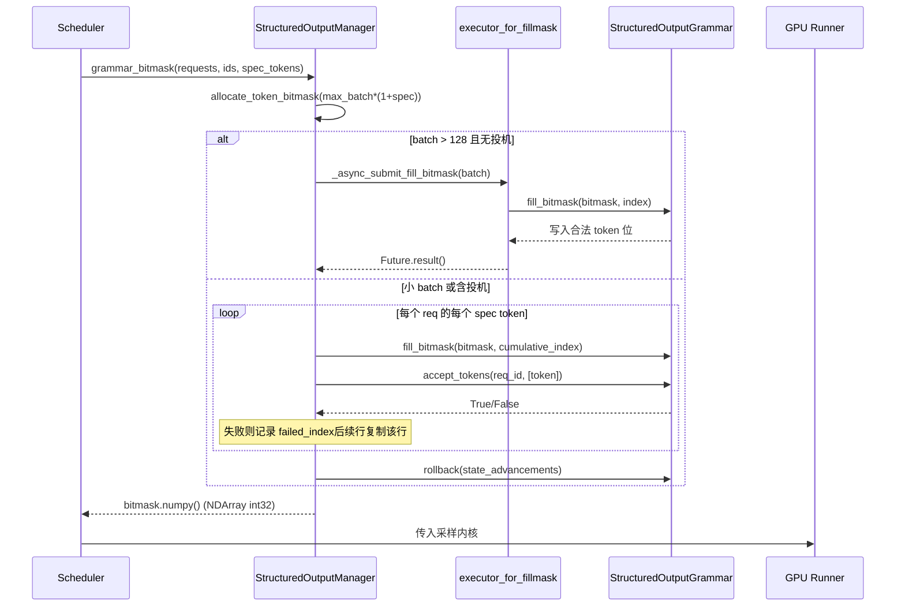

# 제 7 장: 샘플링과 출력: Logits 처리, 구조화 출력, 스트리밍 반환

이전 장에서 우리는 어텐션 백엔드가 block table을 커널 파라미터로 변환하여 비연속 메모리에서 gather 방식 어텐션 계산을 완료하는 방법을 추적했다. 그러나 어텐션이 산출하는 것은 은닉 상태일 뿐이다 — 모델이 실제로 사용자에게 전달해야 하는 것은 다음 token의 텍스트이다. 이번 장에서는 이 마지막 1킬로미터를 추적한다: 은닉 상태가 lm_head를 통해 logits로 투영된 후, 정교하게 정렬된 프로세서 체인(온도, 페널티, top-k/top-p, 구조화 제약)을 통과하여 token id로 샘플링되고, 다시 detokenizer를 거쳐 텍스트로 복원되어 스트리밍으로 푸시된다. 이 경로에서 어느 한 단계라도 순서가 뒤바뀌거나 상태가 누출되면 출력 품질이 조용히 악화된다.

# Sampler: 프로세서 체인의 순서가 곧 정확성

**직관적 모델**: Sampler는 하나의 조립 라인과 같고, logits는 가공할 원자재이다. 라인 위의 각 공정(processor)은 원자재를 수정하며, 공정의 선후 순서가 완성품을 직접 결정한다 — 먼저 깎고 나서 갈면 것과 먼저 갈고 나서 깎으면 것은 서로 다른 두 가지가 된다. 이 체인이 없다면 모델은 원시 확률 분포만 출력할 수 있고, 사용자가 받는 것은 온도 제어도, 반복 억제도, 형식 제약도 불가능한 "날 샘플링"이 된다.

## 데이터 구조와 메모리 레이아웃

Sampler 자체는`nn.Module`이지만, 핵심 상태는 매우 얇다: 단지`topk_topp_sampler`서브모듈,`logprobs_mode`과`use_fp64_gumbel`플래그만 보유한다[FACT:vllm/v1/sample/sampler.py:61-64]. 실제 배치 수준 상태는 전부`SamplingMetadata`에 캡슐화되어 forward 파라미터로 전달된다. 이러한 "무상태 Sampler + 외부 메타데이터" 설계는 의도적이다: Sampler 인스턴스는 엔진 생명주기 동안 한 번만 생성되지만, 각 decode step의 배치 구성은 계속 변하므로, 상태를 외부로 빼내야 Sampler가 CUDA Graph에 캡처된 후 안전하게 재생될 수 있다.

핵심 상수는`_SAMPLING_EPS = 1e-5` [FACT:vllm/v1/sample/sampler.py:18]이다. 이는 동시에 두 가지 의미를 가진다: 온도가 이 값보다 낮으면 그리디로 간주하며, 그리고`apply_temperature`에서 0으로 나누기를 방지하는 폴백이다.

## Step-by-Step Walkthrough

시나리오 대입: 하나의 batch에 그리디 요청과 랜덤 샘플링 요청이 섞여 있고, 일부 요청은 logprobs도 켜져 있다.

**첫 번째 단계, 원본 logprobs를 스냅샷한다.**어떤 페널티나 온도를 적용하기 전에, 요청이 logprobs를 필요로 하면 먼저`logprobs_mode`에 따라 스냅샷 내용을 결정한다[FACT:vllm/v1/sample/sampler.py:84-93]. 주석이 V0와의 차이를 명확히 지적한다는 점에 주목하라: V1은**원본 logits**(페널티와 온도 이전)로 top-k logprobs를 계산한다[FACT:vllm/v1/sample/sampler.py:72-77]. 이것은 의미론적 계약이다 — 사용자가 보는 logprob은 모델의 실제 분포를 반영해야 하며, 페널티로 왜곡된 분포가 아니어야 한다.

**두 번째 단계, float32로 통일한다.** [FACT:vllm/v1/sample/sampler.py:95-96]입력이 bf16이든 fp16이든 모두 float32로 업캐스트한다. 이유는 이후의 log_softmax, top-k, 누적 확률이 저정밀도에서 오차를 누적하기 때문이며, 특히 vocab이 15만에 달할 때 그러하다.

**세 번째 단계, 비-argmax 불변 프로세서 체인.** `apply_logits_processors`순차적으로 적용한다: allowed token 화이트리스트 마스크, bad words 제외,`non_argmax_invariant`프로세서, 페널티 항[FACT:vllm/v1/sample/sampler.py:391-404]. 여기서의 분류가 핵심 설계이다 —`non_argmax_invariant`이는 다음을 가리킨다**그리디 결과를 변경하는**프로세서(예: min_tokens, logit_bias)는 그리디 샘플링 이전에 반드시 적용되어야 한다; 반면`argmax_invariant`프로세서(예: min_p)는 argmax를 변경하지 않으므로 온도 이후로 지연할 수 있다.

**네 번째 단계, 샘플링.** `sample`메서드는 먼저 완전 무작위인지 판단한다[FACT:vllm/v1/sample/sampler.py:256-271]: 만약`all_greedy`이면 직접 argmax를 반환한다; 그렇지 않으면 먼저 그리디 결과를 계산해 두고, 온도, argmax 불변 프로세서, top-k/top-p를 적용한다[FACT:vllm/v1/sample/sampler.py:275-291]. 마지막으로`torch.where`를 사용해 온도 임계값에 따라 그리디와 무작위 결과 사이에서 선택하고[FACT:vllm/v1/sample/sampler.py:305-306], 그리고`greedy_sampled`텐서를 출력 버퍼로 재사용하여 추가 할당을 피한다.

**다섯 번째 단계, logprobs를 수집하고 출력을封装한다.**에 따라`num_logprobs`세 가지 경우로 나뉜다: None은 지정된 token의 logprobs만 반환; -1은 전체 미정렬 logprobs 반환; 그렇지 않으면 top-k[FACT:vllm/v1/sample/sampler.py:120-131]. 최종 token id는 int32로 변환하여 크기를 압축하고, 다음과 같이 확장한다`[num_requests, 1]`의 2차원 텐서[FACT:vllm/v1/sample/sampler.py:138-148]。

```mermaid
flowchart TD
    in_logits["logits (bf16/fp16)"] --> snap{"需要 logprobs?"}
    snap -->|是| raw["compute_logprobs / cloneraw_logprobs 快照"]
    snap -->|否| f32
    raw --> f32["logits.to(float32)"]
    f32 --> proc["apply_logits_processors"]
    proc --> mask{"allowed_token_ids_mask?"}
    mask -->|是| fill["masked_fill_(-inf)"]
    mask -->|否| bad
    fill --> bad{"bad_words_token_ids?"}
    bad -->|是| apply_bad["apply_bad_words"]
    bad -->|否| noninv
    apply_bad --> noninv["non_argmax_invariant 处理器"]
    noninv --> pen["apply_penalties"]
    pen --> sample["sample()"]
    sample --> allg{"all_greedy?"}
    allg -->|是| greedy["greedy_sample (argmax)"]
    allg -->|否| temp["apply_temperature"]
    temp --> arginv["argmax_invariant 处理器"]
    arginv --> topp["topk_topp_sampler"]
    topp --> where["torch.where(temp  out
    where --> out["SamplerOutputsampled_token_ids"]
```

## 설계 고찰과 함정

**왜 페널티 항이 온도 이전에 있어야 하는가?**온도는 분포에 대한 스케일링이고, 페널티는 특정 token에 대한 가감점이다. 만약 먼저 스케일링하고 나중에 페널티를 주면, 페널티의 절대적 진폭이 온도에 의해 확대되거나 축소되어 동일한 페널티 파라미터 세트가 서로 다른 온도에서 일관되지 않은 동작을 보인다. V1은 페널티를 온도 이전에 고정하여 파라미터 의미론의 안정성을 보장한다.

**`mark_unbacked`의 컴파일 함정.**에서`gather_logprobs`,`batched_count_greater_than`이 컴파일되며, batch 차원이 1에서 ≥2로 변할 때 dynamo의 0/1 특수화 재컴파일이 트리거된다[FACT:vllm/v1/sample/sampler.py:345-348]。`mark_unbacked`해당 차원을 완전히 심볼릭으로 표시하여 이 재컴파일을 피한다. 프로덕션 환경에서 decode 첫 요청 후 갑자기 한 번 멈춤이 보인다면, 십중팔구 이런 종류의 재컴파일이다.

**`gpu_sync_allowed`의 동기화 경계.** `batched_count_greater_than`내부에서 GPU 동기화가 트리거될 수 있으며, vLLM은`gpu_sync_allowed(first_only=True)`컨텍스트로 "여기서 동기화를 허용하지만, 첫 번째만 허용한다"고 명시적으로 선언한다[FACT:vllm/v1/sample/sampler.py:345-348]. 만약 CUDA Graph 캡처 영역 내에서 의도치 않게 동기화가 발생하면 캡처 실패를 초래한다 — 이것이 그래프 캡처 문제를排查하는 핵심 단서이다.

# 구조화된 출력: 비트마스크와 문법의 이중 트랙 상태 머신

**직관적 모델**: 구조화된 출력은 샘플러에게 "문법 안경"을 씌우는 것과 같다 — 각 단계에서 JSON schema나 문법에 맞는 token만 볼 수 있다. 이것이 없으면 모델이 문법 오류가 있는 JSON을 생성하여 다운스트림 파서가 바로崩溃할 수 있다. vLLM 구현의精髓는: 문법 상태 머신은 CPU 측에서 진행되고, 제약은 비트마스크 형태로 GPU 측 샘플링에 전달된다.

## 데이터 구조와 메모리 레이아웃

`StructuredOutputManager`은 엔진 레벨 싱글톤으로,`backend`(xgrammar/guidance/outlines/lm-format-enforcer 중 하나),`reasoner_cls`과 두 개의 스레드 풀을 보유한다[FACT:vllm/v1/structured_output/__init__.py:39-98]。

비트마스크는 핵심 데이터 구조이다:`_grammar_bitmask`은 형태가`[max_batch_size * (1 + max_num_spec_tokens), vocab_size/32]`인 int32 텐서[FACT:vllm/v1/structured_output/__init__.py:327-336]. 각 bit는 하나의 token이 합법인지에 대응한다.`_full_mask = torch.tensor(-1, dtype=torch.int32)`는 "전부 1"을 나타낸다 — 모든 token 합법[FACT:vllm/v1/structured_output/__init__.py:59]。

두 스레드 풀의 분업은 명확하다:`executor`은 문법 컴파일 담당(CPU 집약적, worker 수는 CPU 수의 절반)[FACT:vllm/v1/structured_output/__init__.py:71-78]；`executor_for_fillmask`은 대형 batch 비트마스크 병렬 채우기 담당, batch가 128을 초과할 때만 활성화[FACT:vllm/v1/structured_output/__init__.py:62-69]。

## Step-by-Step Walkthrough

**문법 초기화.**요청이 처음 진입할 때`grammar_init`이 호출된다[FACT:vllm/v1/structured_output/__init__.py:115-176]. backend가 초기화되지 않았으면 설정에 따라 구현을 선택한다[FACT:vllm/v1/structured_output/__init__.py:130-165]. 이후 컴파일 작업을 제출한다: 기본적으로 비동기`executor.submit`를 사용하지만,`external_launcher`모드에서는 반드시 동기[FACT:vllm/v1/structured_output/__init__.py:167-176]。

**비트마스크 생성.**각 decode step마다,`grammar_bitmask`이 배치 내 모든 구조화된 요청에 대해 마스크를 생성한다[FACT:vllm/v1/structured_output/__init__.py:314-442]. 대형 batch는 병렬 경로: 16개씩 한 배치로 스레드 풀에 제출[FACT:vllm/v1/structured_output/__init__.py:346-373]. 소형 batch는 직렬 경로, token별로 문법 상태를 진행[FACT:vllm/v1/structured_output/__init__.py:374-433]。

**투기적 디코딩 하의 마스크 정렬.**이것이 가장 정교한 부분이다. draft token이 있을 때, 각 요청은`1 + max_num_spec_tokens`행 마스크가 필요하다. 직렬 경로는 token별로 처리한다: 만약 어떤 draft token이 문법에 의해 거부되면,`failed_index`을 기록하고, 이후 행은 해당 행의 마스크를 직접 복사한다[FACT:vllm/v1/structured_output/__init__.py:396-418]. 이는 "draft가 거부된 후, 이후 위치의 제약 상태가 거부 지점으로 롤백됨"을 보장한다.

**상태 롤백.**비트마스크 채우기 과정에서 문법 상태가`state_advancements`단계 진행되었지만, draft token이 아직 실제로 수락되지 않았으므로 반드시`grammar.rollback(state_advancements)`롤백해야 한다[FACT:vllm/v1/structured_output/__init__.py:422-430]. 실제 수락은`accept_tokens` [FACT:vllm/v1/structured_output/__init__.py:444-466]。



## 설계 고찰과 함정

**왜 external_launcher는 반드시 동기 컴파일이어야 하는가?**주석이 정확한 이유를 제시한다: 비동기 컴파일은`WAITING_FOR_STRUCTURED_OUTPUT_GRAMMAR → WAITING`상태 전환이 서로 다른 TP rank에서 서로 다른 시점에 발생하게 하여, external_launcher가 의존하는 결정론적 가정을 깨뜨린다[FACT:vllm/v1/structured_output/__init__.py:47-56]. 이는 분산 결정성과 비동기 최적화 충돌의 전형적인 사례이다.

**추론 모델 하에서의 제약 시작점.** `_get_constraint_start`몇 번째 token부터 문법 제약을 적용할지 결정한다[FACT:vllm/v1/structured_output/__init__.py:220-292]. 사고 연쇄(chain-of-thought)가 있는 모델의 경우, reasoning 단계는 JSON 제약을 받지 않아야 하며, reasoning이 끝난 후에만 시작된다.`enable_in_reasoning`True일 때 직접 0을 반환한다 (전체 구간 제약)[FACT:vllm/v1/structured_output/__init__.py:235-236]. reasoner가 지원하면`find_reasoning_end_offset`, 이를 사용해 정확히 위치를 찾는다[FACT:vllm/v1/structured_output/__init__.py:261-267]; 그렇지 않으면 token별 역방향 탐색으로 폴백한다[FACT:vllm/v1/structured_output/__init__.py:287-291]。

**`validate_tokens`의 접두사 의미.**투기적 디코딩 시 draft token이 문법을 위반할 수 있다,`validate_tokens`"최장 합법 접두사"를 반환한다[FACT:vllm/v1/structured_output/__init__.py:294-312]. 주의: 먼저 투기적 패딩(-1)을 제거하고, 그 다음 제약 시작점을 계산하며, 마지막으로 제약 구간 내의 token에 대해서만 문법 검증을 수행한다.

# Detokenizer: 증분 디코딩과 stop string의 경계博弈

**직관적 모델**: detokenizer는 한 글자씩 베껴 쓰는 서기와 같아서, token id를 사람이 읽을 수 있는 텍스트로 번역한다. 어려운 점은: token과 문자가 일대일 대응이 아니며(하나의 token이 UTF-8 문자의 절반만 대응할 수 있음), stop string이 여러 token에 걸쳐 있을 수 있다는 것이다. 증분 디코딩이 없으면 매 단계마다 전체 시퀀스를 처음부터 디코딩해야 하며, O(n²)의 오버헤드가 처리량을 무너뜨린다.

## 데이터 구조와 메모리 레이아웃

`IncrementalDetokenizer`기반 클래스는 단지 보유한다`token_ids`리스트[FACT:vllm/v1/engine/detokenizer.py:32-33]。`BaseIncrementalDetokenizer`stop 관련 필드가 추가되었다:`stop`리스트,`min_tokens`、`include_stop_str_in_output`、`stop_buffer_length`과`_last_output_text_offset` [FACT:vllm/v1/engine/detokenizer.py:70-94]。

`stop_buffer_length`이 핵심이다: stop string이 출력에 포함되지 않을 때, 이는 최장 stop string 길이에서 1을 뺀 값과 같다[FACT:vllm/v1/engine/detokenizer.py:87-90]. 이 "되돌림 버퍼"는 스트리밍 출력이 stop string의 접두사일 수 있는 문자를 미리 내보내지 않도록 보장한다.

두 가지 구현 경로:`FastIncrementalDetokenizer`tokenizers 라이브러리의`DecodeStream` [FACT:vllm/v1/engine/detokenizer.py:166-246]；`SlowIncrementalDetokenizer`Python 측`detokenize_incrementally` [FACT:vllm/v1/engine/detokenizer.py:249-305]. 선택 기준은 tokenizers 버전 ≥ 0.22.0이고 tokenizer 유형이 일치하는지 여부이다[FACT:vllm/v1/engine/detokenizer.py:32-33][FACT:vllm/v1/engine/detokenizer.py:61-63]。

## Step-by-Step Walkthrough

**증분 디코딩.** `update`새로운 token ids와`stop_terminated`플래그를 받는다[FACT:vllm/v1/engine/detokenizer.py:96-142]. stop이 종료되고 stop string을 포함하지 않으면, 마지막 token은 디코딩에서 제외된다[FACT:vllm/v1/engine/detokenizer.py:107-111]. 이후 token별로`decode_next`을 호출하여 텍스트를 누적한다[FACT:vllm/v1/engine/detokenizer.py:117-122]。

**stop string 감지.** `check_stop_strings`새로 추가된 문자 범위 내에서만 검색한다[FACT:vllm/v1/engine/detokenizer.py:308-360]. 검색 시작점은`1 - new_char_count - stop_string_len` [FACT:vllm/v1/engine/detokenizer.py:338]이며, 이 오프셋은 token 경계를 넘는 stop string도 포착되도록 보장한다. 여러 stop string이 동시에 매칭될 때, 선택한다**가장 먼저 완료되는**것[FACT:vllm/v1/engine/detokenizer.py:342-347]。

**스트리밍 출력 슬라이스.** `get_next_output_text`에 따라`delta`파라미터가 전체를 반환할지 증분을 반환할지 결정한다[FACT:vllm/v1/engine/detokenizer.py:148-163]. 미완료 시`stop_buffer_length`개 문자를 내보내지 않고 보류한다[FACT:vllm/v1/engine/detokenizer.py:145-146],`_last_output_text_offset`으로 이미 전송된 위치를 기록한다[FACT:vllm/v1/engine/detokenizer.py:148-163]。

**예외 복구.** `FastIncrementalDetokenizer._protected_step`두 가지 예외를 처리한다: OverflowError/TypeError는 로그를 기록하고 None을 반환한다[FACT:vllm/v1/engine/detokenizer.py:225-229]; "Invalid prefix" 오류의 경우**DecodeStream을 재구성한다**하고 재시도한다[FACT:vllm/v1/engine/detokenizer.py:222-246]. 후자는 tokenizer가 비단조적 UTF-8 출력을 생성하는 경계 상황에 대응한다.

## 설계 고찰과 함정

**stop_buffer_length의 트레이드오프.**버퍼가 길수록 스트리밍 지연이 커지지만(사용자가 텍스트를 보는 시간이 늦춰짐), token을 넘는 stop string을 놓칠 확률이 낮아진다. "최장 stop string 길이에서 1을 뺀 값"을 취하는 것이 정확한 하한이다: 어떤 stop string의 접두사도 최대 이 길이를 넘지 않는다.

**min_tokens와 stop_check_offset.**출력 token 수가`min_tokens`에 미달할 때,`stop_check_offset`은 계속 텍스트 끝으로 밀린다[FACT:vllm/v1/engine/detokenizer.py:120-122], 이는 이 텍스트가 stop 감지되지 않음을 의미한다. 이는 모델이 시작 부분에서 stop string에 부딪혀 빈 출력이 되는 것을 방지한다.

**Fast 경로의 added_token_ids 캐시.**가`spaces_between_special_tokens`False일 때, 특수 token 사이의 공백을 억제해야 한다[FACT:vllm/v1/engine/detokenizer.py:192-207]. 코드는`added_token_ids`을 tokenizer 객체에 캐시한다[FACT:vllm/v1/engine/detokenizer.py:195-200], 매 decode마다 딕셔너리를 재구성하는 것을 피한다.

# 설계 고찰

세 모듈은 하나의 설계 철학을 공유한다:**상태 진행과 제약 검사를 분리하여, GPU 측은 무상태 텐서 연산만 수행하게 한다**. Sampler는 무상태이고, 상태는`SamplingMetadata`에 있다; 문법 상태 머신은 CPU 측에서 진행되고, GPU는 비트 마스크만 소비한다; detokenizer의`_last_output_text_offset`은 유일한 스트리밍 커서이다. 이러한 분리는 각 GPU 측 컴포넌트가 CUDA Graph에 의해 캡처될 수 있게 한다.

또 다른 주된 흐름은**순서가 곧 의미이다**. Sampler의 프로세서 체인 순서, 구조화된 출력의 제약 시작점, detokenizer의 stop 감지 오프셋, 어느 하나라도 순서가 틀리면 크래시하지 않고 조용히 잘못된 결과를 낸다——이것이 바로 이런 코드가 가장 디버깅하기 어려운 이유이다.

# 이 장 요약

- Sampler의 프로세서 체인은 엄격히 정렬된다: 원시 logprobs 스냅샷 → float32 → 화이트리스트/bad words → non-argmax-invariant → 페널티 → 온도 → argmax-invariant → top-k/top-p.
- 구조화 출력은 비트마스크로 CPU 측 문법 상태를 GPU에 전달하며, 투기적 디코딩 하에서`failed_index`복사와`rollback`를 통해 상태 일관성을 보장한다.
- Detokenizer는`stop_buffer_length`폴백 버퍼로 스트리밍 지연과 stop string의 토큰 간 검출을 균형 있게 처리하며, Fast 경로는 tokenizers ≥ 0.22.0의`DecodeStream`。

# 이 장의 생각과 자가 점검

Q1: 만약`apply_logits_processors`의 페널티 항(`apply_penalties`)을 온도 이후로 옮겨 실행하면, temperature=2.0의 고온 샘플링 시나리오에서 어떤 구체적 편차가 발생하는가? 왜인가?

**참고 해석**: 온도는 전체 logits 벡터에 대한 스케일링(`logits.div_(temp)`）[FACT:vllm/v1/sample/sampler.py:241-242]이다. 페널티 항(예: repetition penalty)은 특정 토큰에 대한 곱셈/덧셈 조정이다. 만약 스케일링 후 페널티를 적용하면, 페널티의 절대적 크기가 온도에 의해 2배로 증폭되어 동일한`repetition_penalty`파라미터가 고온에서 억제 효과가 저온보다 훨씬 강해지며, 파라미터 의미가 온도에 따라 표류한다. V1은 페널티를 온도 앞에 고정하여[FACT:vllm/v1/sample/sampler.py:403-404], 페널티 크기가 온도와 분리되도록 보장한다. 또한 페널티는`non_argmax_invariant`범주에 속하며(그리디 결과에 영향), 그리디 경로는 온도 이전에 이미 반환되므로[FACT:vllm/v1/sample/sampler.py:261-271], 만약 온도 이후로 옮기면 그리디 요청은 페널티를 완전히 우회하게 되어 동작이 일관되지 않는다.

Q2:`grammar_bitmask`의 직렬 경로에서 만약`grammar.rollback(state_advancements)` [FACT:vllm/v1/structured_output/__init__.py:422-430]이 줄을 삭제하면, 투기적 디코딩 + 구조화 출력의 조합에서 무슨 일이 발생하는가?`accept_tokens`의 호출 시점과 결합하여 분석하라.

**참고 해석**: 비트마스크 채우기 시, 코드는 각 draft token에 대해`grammar.accept_tokens`를 호출하여 문법 상태를 진행시켜 다음 위치의 마스크를 생성하지만[FACT:vllm/v1/structured_output/__init__.py:396-418], 이는 단지 "시험적 진행"일 뿐이다 — draft token은 아직 대상 모델에 의해 검증·수락되지 않았다. 만약`rollback`를 삭제하면, 문법 상태는 영구적으로 "모든 draft가 수락됨" 위치에 머무른다. 대상 모델이 실제로 일부 draft token을 거부했을 때, 실제 수락된 토큰 시퀀스와 문법 상태가 불일치하게 된다:`accept_tokens` [FACT:vllm/v1/structured_output/__init__.py:444-466]는 잘못된 문법 상태를 기반으로 검증하여, 합법적 토큰이 거부되거나 불법 토큰이 통과될 수 있다. 결과적으로 JSON 출력이 조용히 손상되며, 크래시는 없지만 하위 파싱이 실패한다.

Q3: `check_stop_strings`의 검색 시작점은`1 - new_char_count - stop_string_len` [FACT:vllm/v1/engine/detokenizer.py:338]이다. 만약 0부터 전체 검색으로 변경하면, 기능적으로 올바른가? 긴 시퀀스 스트리밍 시나리오에서 어떤 성능 문제가 발생하는가?

**참고 해석**: 기능적으로 올바르다 — 0부터 검색하면 토큰 경계를 넘는 것을 포함한 모든 매칭을 찾을 수 있다. 그러나 성능상, 매 단계마다 전체`output_text`에 대해`find`를 수행하여, 복잡도가 O(new_char_count)에서 O(total_length)로 퇴화하며, 긴 시퀀스에서는 O(n²)이다. 더 심각한 것은, 0부터 검색하면**이미 사용자에게 전송된 역사 텍스트**내의 stop string 부분 문자열과 매칭될 수 있어, stop이 중복 트리거되거나 잘못 절단될 수 있다. 원래 설계의 오프셋`1 - new_char_count - stop_string_len`은 "신규 문자 + 경계를 넘을 수 있는 stop string 접두사"라는 최소 필요 윈도우를 정확히 커버하여, 누락 검출을 방지하면서 역사 오매칭도 피한다.

여기까지, 단일 머신에서의 추론 전체 체인이 완성되었다: 어텐션 계산부터 샘플링 출력까지, 각 단계가 최종 전달되는 텍스트 품질에 직접 영향을 미친다. 그러나 모델 규모가 단일 카드 용량을 초과하면, 이 체인은 반드시 여러 장치에 걸쳐 협력하여 완료되어야 한다. 다음 장에서는 단일 머신을 떠나 분산 병렬로 진입한다: TP, PP, EP가 모델을 어떻게 분할하는지, 통신 원시 연산이 rank 간에 이러한 샘플링 결과를 어떻게 동기화하는지.
