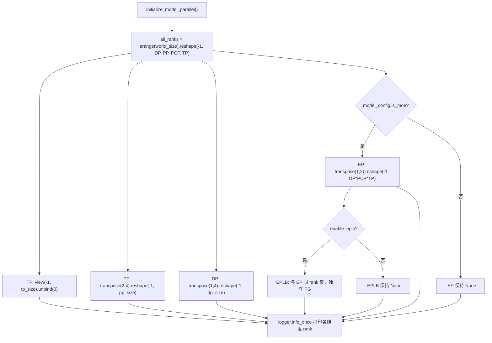
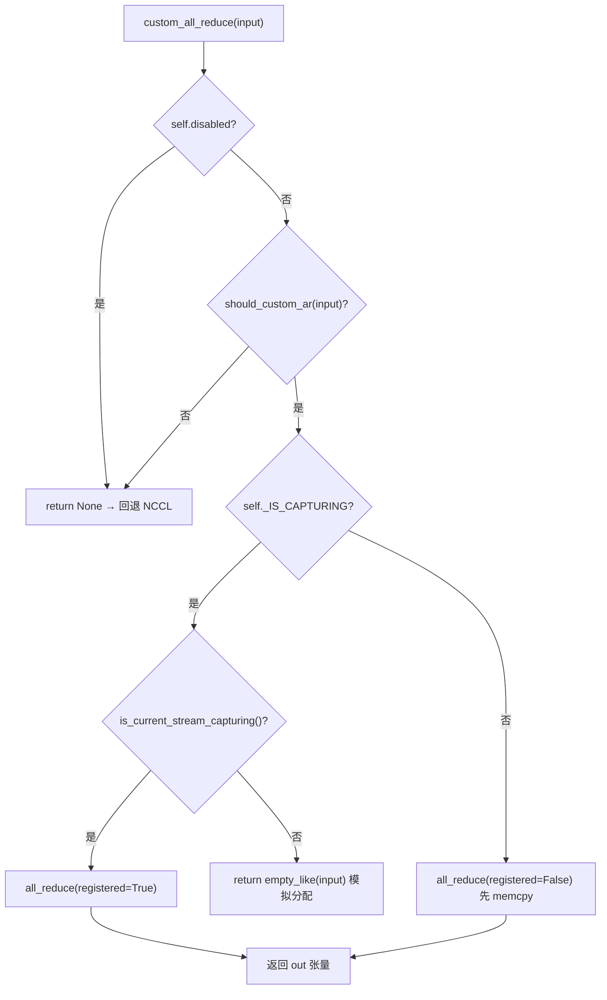

# 제 8 장: 분산 병렬: TP, PP, EP와 통신 원시 연산

이전 장에서 우리는 단일 추론 생명주기의 마지막 1킬로미터를 완주했다: logits 샘플링부터 스트리밍 출력까지. 그러나 모델이 단일 카드에 담을 수 없을 만큼 커지면, 이 파이프라인은 반드시 여러 장치로 분할되어 협력 실행되어야 한다. 분산 추론의 제1의 문제는 "모델을 어떻게 분할하는가"가 아니라 "분할 후, 누가 누구와 대화하고, 어떤 방식으로 대화하는가"이다. vLLM은 이 두 문제를 각각 parallel_state.py의 프로세스 그룹 토폴로지와 custom_all_reduce.py의 통신기 구현에 맡긴다. 이 장은 "그룹 구축 → 분할 → 통신 → 부하 재균형"이라는 체인을 따라, TP, PP, EP의 병렬 전략과 저수준 통신 원시 연산을 층층이 해부한다.

# 8.1 프로세스 그룹 토폴로지: 하나의 rank 그리드에서 TP/PP/DP/EP를 어떻게 잘라내는가

## 직관 모델

8장의 GPU를 8개 좌석의 긴 테이블이라고 상상하자. 텐서 병렬(Tensor Parallelism, TP)은 "같은 테이블 사람들이 동시에 잔을 들어야 한다"를 요구하고, 파이프라인 병렬(Pipeline Parallelism, PP)은 "인접 좌석이 릴레이로 요리를 전달"을 요구하며, 데이터 병렬(Data Parallelism, DP)은 "다른 테이블은 각자 먹되 마지막에 대조"를 요구하고, 전문가 병렬(Expert Parallelism, EP)은 "토큰을 진료과별로 분류"를 요구한다. 만약 통일된 좌석 배치가 없다면, 각 모듈이 각자`new_group`, "TP 그룹에 있다고 생각했는데 실제로는 DP 그룹에 있다"는 통신 불일치가 발생한다——집합 통신에서 rank가 하나라도 빠지면 NCCL은 오류를 내는 대신 그대로 멈춰버린다.

## 데이터 구조와 메모리 레이아웃

`GroupCoordinator`이 모든 것의 운반체이다. 그 필드 설계는 "하나의 프로세스가 여러 병렬 차원에서 가지는 다중 정체성"에 직접 대응한다:

- `rank`은 전역 rank이고,`ranks`은 본 그룹 구성원의 전역 rank 목록이며,`world_size`은 그룹 크기[FACT:vllm/distributed/parallel_state.py:434-436]。
- `local_rank`는 디바이스 바인딩에 사용되고,`rank_in_group`은 그룹 내 순번이다——소스 코드는 하나의 표로 둘을 정확히 구분한다: 두 노드에 걸친 4카드 그룹에서 rank 2의`local_rank`은 0이고(노드 1에서 첫 번째 카드), 하지만`rank_in_group`은 2이다[FACT:vllm/distributed/parallel_state.py:437-445]。
- `cpu_group`과`device_group`은 쌍으로 존재한다: 전자는 gloo로 메타데이터/객체 통신을 하고, 후자는 NCCL로 텐서 통신을 한다[FACT:vllm/distributed/parallel_state.py:446-447]。

여기에는 핵심 설계가 있다:**왜 각 그룹마다 CPU 그룹을 유지해야 하는가?**왜냐하면`broadcast_object`、`send_object`같은 연산이 전송하는 것은 Python 객체(직렬화된 바이트)라서, NCCL로 가면 VRAM을 낭비할 뿐만 아니라 현재 CUDA 디바이스를 오염시킬 수 있기 때문이다.`barrier()`의 주석은 이 점을 아주 직설적으로 설명한다: NCCL의 barrier는 내부적으로 broadcast 한 번이라서 GPU 텐서를 몰래 생성해 현재 디바이스를 쉽게 어지럽히므로, 반드시 CPU 그룹을 써야 한다[FACT:vllm/distributed/parallel_state.py:1355-1362]。

## Step-by-Step：`initialize_model_parallel`그리드를 어떻게 자르는가

구체적인 시나리오를 대입해보자: 8카드, TP=2, PP=4, DP=1. 핵심은 1차원 rank 시퀀스를 다차원 그리드로 reshape한 뒤 각 차원을 따라 분할하는 것이다.

첫 번째 단계, rank 그리드를 구성한다. 레이아웃 순서는`ExternalDP x DP x PP x PCP x TP` [FACT:vllm/distributed/parallel_state.py:2045-2060]：

```python
all_ranks = torch.arange(world_size).reshape(
    -1, data_parallel_size, pipeline_model_parallel_size,
    prefill_context_model_parallel_size, tensor_model_parallel_size,
)
```

두 번째 단계, TP 그룹을 자른다: 그리드를`(-1, tp_size)`로 view한 뒤 unbind하여`[g0,g1],[g2,g3],...` [FACT:vllm/distributed/parallel_state.py:2065-2077]을 얻는다. TP 그룹은`use_message_queue_broadcaster=True`를 추가로 전달하는데, TP 그룹은 메타데이터 배포를 위해 공유 메모리 broadcast가 필요하기 때문이다.

세 번째 단계, PP 그룹을 자른다:`all_ranks.transpose(2, 4)`PP 차원을 마지막 차원으로 옮긴 뒤 잘라서`[g0,g2,g4,g6],[g1,g3,g5,g7]` [FACT:vllm/distributed/parallel_state.py:2175-2188]을 얻는다. 이것이 바로 docstring에 제시된 예시이다[FACT:vllm/distributed/parallel_state.py:1997-1997]。

네 번째 단계, DP 그룹을 자른다:`transpose(1, 4)`후[FACT:vllm/distributed/parallel_state.py:2195-2202]。

를 자른다[FACT:vllm/distributed/parallel_state.py:2210-2241]다섯 번째 단계, EP 그룹을 자른다——여기에는 놓치기 쉬운 세부 사항이 있다: EP 그룹은 MoE 모델에서만 생성되고, dense 모델은 그냥 건너뛴다`DP x PCP x TP`. EP 그룹의 rank 집합은



## 복사

**설계 고찰과 함정**EPLB는 왜 독립 프로세스 그룹이 필요한가?[FACT:vllm/distributed/parallel_state.py:2243-2246]주석이 답을 준다: EPLB 통신과 MoE 순전파의 집합 통신을 격리하여 "실행 시점의 torch.distributed"와 "EPLB의 torch.distributed"가 서로 교착되는 것을 방지한다

**. 이는 전형적인 "독립 통신 도메인으로 결정성을 얻는" 트레이드오프이다——PG 하나가 더 쓰는 VRAM 비용을 치르고, 가중치 이동 시 순전파가 멈추지 않는 것을 얻는다.**DP 그룹의 동기화 제약`generate`은 프로덕션 환경에서 가장 자주 밟는 함정이다: 같은 DP 그룹 내 모든 rank가 동시에[FACT:vllm/distributed/parallel_state.py:2048-2051]를 호출해야 하며, 그렇지 않으면 교착된다

**. DP 그룹 내에서는 그래디언트/샘플링 결과의 all-reduce를 수행하므로, 어떤 rank든 빠지면 집합 통신이 영구적으로 차단된다.**파괴 순서`destroy()`도 역시 주의가 필요하다.[FACT:vllm/distributed/parallel_state.py:1380-1393]는 먼저 device communicator를 파괴하고, 그다음 device_group과 cpu_group을 파괴한다[FACT:vllm/distributed/parallel_state.py:1377-1377]。

# . 주석은 그 이유를 설명한다: device communicator는 이들 PG에 의존하는 집합 통신 작업 공간(예: FlashInfer PCIe IPC barrier)을 보유할 수 있으므로 반드시 먼저 해제해야 한다

## 8.2 통신 프리미티브: 커스텀 all-reduce가 NCCL을 어떻게 우회하는가

직관적 모델`cudaMemcpy`NCCL의 all-reduce는 "범용 트럭"으로, 어떤 화물이든 실을 수 있고 어떤 길이든 갈 수 있지만 시작 오버헤드와 프로토콜 오버헤드가 고정되어 있다. 8카드 NVLink 전연결 머신에서 작은 텐서 all-reduce를 반복적으로 해야 할 때(TP의 각 attention/MLP 레이어마다), 범용 트럭의 "통행료"는 무시할 수 없게 된다. 커스텀 all-reduce는 "전용 손수레"이다: 동일 머신, NVLink 전연결, 적절한 텐서 크기 시나리오에서만 활성화되며, 한 번의

## 로 NCCL의 핸드셰이크와 프로토콜 오버헤드를 대체한다.

`CustomAllreduce`데이터 구조와 메모리 레이아웃

- `_SUPPORTED_WORLD_SIZES = [2, 4, 6, 8, 16]`의 초기화는 "능력 탐지 + 자원 사전 할당"의 조합이다. 핵심 필드:[FACT:vllm/distributed/device_communicators/custom_all_reduce.py:113-129]。
- `meta_ptrs`: 이 그룹 크기들만 지원한다`ops.meta_size() + max_size` [FACT:vllm/distributed/device_communicators/custom_all_reduce.py:291-294]。
- `buffer_ptrs`: 메타데이터 + 중간 결과 버퍼 동기화, 크기[FACT:vllm/distributed/device_communicators/custom_all_reduce.py:298-305]。
- `rank_data`: 사전 등록된 IPC 버퍼, eager 모드에서 입력 텐서를 먼저 복사한 뒤 계산한다[FACT:vllm/distributed/device_communicators/custom_all_reduce.py:309-315]。

**: 8MB uint8 텐서로, 모든 rank의 IPC 버퍼 포인터 튜플을 저장한다**왜 버퍼를 사전 등록해야 하는가?`register_graph_buffers`CUDA Graph 캡처는 캡처 시점에 모든 주소가 고정되어야 하기 때문이다.[FACT:vllm/distributed/device_communicators/custom_all_reduce.py:474-491]。

## 는 캡처 종료 시 사용된 모든 버퍼 주소를 모든 rank에 broadcast하고 등록한다

Step-by-Step: 한 번의 all-reduce 의사결정 흐름

시나리오를 대입하자: TP 그룹 내 어떤 MLP 레이어의 출력이 all-reduce를 해야 하고, 입력은 4MB bf16 텐서이다.`custom_all_reduce`첫 번째 단계,`should_custom_ar` [FACT:vllm/distributed/device_communicators/custom_all_reduce.py:529-533]。

비활성화 여부,`should_custom_ar`항목별 필터링: world_size > 8이면 거부; dtype은 반드시 fp32/fp16/bf16이어야 함; 바이트 수는 반드시 16의 배수여야 함; 반드시 weakly contiguous해야 함; world_size==2이거나 완전 연결일 때만 계속 진행[FACT:vllm/distributed/device_communicators/custom_all_reduce.py:493-508]。

세 번째 단계, CUDA Graph 캡처 중인지에 따라 분기: 캡처 중에는`registered=True`(주소가 이미 고정됨), 그렇지 않으면`registered=False`(먼저 사전 등록된 버퍼로 memcpy 필요)[FACT:vllm/distributed/device_communicators/custom_all_reduce.py:529-545]。

네 번째 단계, 실제로 호출`ops.all_reduce`, 전달`buffer_ptrs[rank]`및`max_size` [FACT:vllm/distributed/device_communicators/custom_all_reduce.py:519-527]。



## 설계 고민과 함정

**다중 노드 시나리오의 폴백 경로**가 이 코드에서 가장 정교한 부분이다.`same_node`가 거짓일 때,`mnnvl_only`를 참으로 설정[FACT:vllm/distributed/device_communicators/custom_all_reduce.py:198-199], 이후 MNNVL(Multi-Node NVLink) 능력을 확인한다. 그룹 내 모든 카드가 MNNVL을 지원하지 않으면 커스텀 집합 통신을 즉시 비활성화[FACT:vllm/distributed/device_communicators/custom_all_reduce.py:228-233]。`_group_can_attempt_mnnvl`CPU all-reduce(MIN 연산) 한 번으로 모든 rank가 동일한 제어 흐름을 타도록 보장[FACT:vllm/distributed/device_communicators/custom_all_reduce.py:59-73]——이것이 이기종 클러스터에서 "일부 rank는 MNNVL 경로로, 일부는 NCCL로" 가서 교착되는 것을 방지하는 핵심 보호 장치다.

**P2P 검사의 비용**：`_can_p2p`은 모든 peer를 순회하며`gpu_p2p_access_check`를 수행하고, 주석에는 최초 계산이 매우 비싸지만 캐시된다고 되어 있다[FACT:vllm/distributed/device_communicators/custom_all_reduce.py:278-278]. 프로덕션 환경에서 시작이 느리면`VLLM_SKIP_P2P_CHECK`를 설정해 건너뛰고 드라이버의 P2P 보고를 직접 신뢰할 수 있다[FACT:vllm/distributed/device_communicators/custom_all_reduce.py:86-100]。

**reduce-scatter의 3단계 백엔드 선택**은 따로 볼 가치가 있다:`_select_reduce_scatter_backend`은 우선순위에 따라 반환`mnnvl_multimem` > `mnnvl_lamport` > `legacy` [FACT:vllm/distributed/device_communicators/custom_all_reduce.py:601-636]. multimem 경로는 world_size가`(2,4,8)`에 있고 디바이스 능력이 (10,0) 또는 (10,3)(Blackwell급)이어야 한다[FACT:vllm/distributed/device_communicators/custom_all_reduce.py:103-104]. 주의:`VLLM_BATCH_INVARIANT`는 multimem 경로를 비활성화한다[FACT:vllm/distributed/device_communicators/custom_all_reduce.py:628]——multimem의 리덕션 순서가 비결정적이라 배치 불변성을 깨뜨리기 때문이다.

# 8.3 EPLB: 전문가 부하 재균형의 스케줄링 로직

## 직관적 모델

MoE 모델에서 256개의 논리 전문가가 32장의 카드에 분배되어 카드당 8개다. 하지만 실제 트래픽에서는 일부 "인기 전문가"(예: 흔한 문법 구조를 처리하는)에 대량의 토큰이 라우팅되어, 이를 보유한 카드가 병목이 되고 다른 카드는 유휴 상태가 된다. EPLB(Expert Parallel Load Balancer)는 "인기 전문가에 복제본을 추가"하는 것: 인기 전문가의 가중치를 유휴 카드에 복사해 토큰을 분산시킨다. 이것이 없으면 MoE의 실제 처리량은 가장 느린 카드에 의해 잠긴다.

## 데이터 구조와 메모리 레이아웃

`EplbModelState`은 세 개의 매핑 테이블로 "논리 전문가 ↔ 물리 전문가" 관계를 기술한다:

- `physical_to_logical_map`: 형상`(num_moe_layers, num_physical_experts)`, 각 물리 슬롯이 담당하는 논리 전문가 id 저장[FACT:vllm/distributed/eplb/eplb_state.py:105-120]。
- `logical_to_physical_map`: 형상`(num_moe_layers, num_logical_experts, max_replicas+1)`, 희소 행렬, -1은 매핑 없음[FACT:vllm/distributed/eplb/eplb_state.py:123-146]。
- `logical_replica_count`: 각 논리 전문가의 복제본 수[FACT:vllm/distributed/eplb/eplb_state.py:147-161]。

`expert_load_window`은 슬라이딩 윈도우, 형상`(window_size, num_moe_layers, num_physical_experts)` [FACT:vllm/distributed/eplb/eplb_state.py:180-187]. 주석에서 특히 지적: 이제 로컬 전문가만이 아니라 모든 물리 전문가의 부하를 기록하여 서로 다른 dispatch 방법(naive all-to-all, DeepEP)의 통계가 일치하도록 보장; naive all-to-all에서는 각 DP rank가 동일한 토큰 집합을 기여하므로 부하가 dp_size만큼 곱해진다[FACT:vllm/distributed/eplb/eplb_state.py:180-187]。

## Step-by-Step: 한 번의 재배치 전체 경로

시나리오 대입:`expert_rearrangement_step`이 임계값에 도달, 트리거`rearrange()`。

첫 번째 단계, 물리 부하를 논리 전문가로 역매핑. 사용`scatter_add_`을`physical_to_logical_map`기준으로 집계, 유효하지 않은 슬롯(<0)은`invalid_idx`버킷에 채운 후 마지막에 버림[FACT:vllm/distributed/eplb/eplb_state.py:794-816]。

두 번째 단계, rank 간 all-reduce로 전역 논리 부하 획득.`_allreduce_list`은 여러 모델의 부하를 연결한 후 한 번 all-reduce하고 다시 분리하여 다중 통신 회피[FACT:vllm/distributed/eplb/eplb_state.py:1045-1068]。

세 번째 단계, 전략 호출로 새 매핑 계산.`policy.rebalance_experts`은 host에서 실행되므로 부하 윈도우와 현재 매핑을 모두 CPU로 복사해야 함[FACT:vllm/distributed/eplb/eplb_state.py:859-867]。

네 번째 단계, ROCm 특화 "재배치 건너뛰기" 판단: 새 매핑이 가져오는 rank 부하 불균형 개선이 5% 미만이면 이번 재배치를 건너뜀[FACT:vllm/distributed/eplb/eplb_state.py:869-923]. 이는 실용적 최적화——재배치 자체에 통신 비용이 있으니 이득이 충분치 않으면 하지 않는다.

다섯 번째 단계, 가중치 이송 실행 및 새 매핑 커밋[FACT:vllm/distributed/eplb/eplb_state.py:925-942]。

```mermaid
sequenceDiagram
    participant Main as 主线程 step()
    participant Policy as DefaultEplbPolicy
    participant Comm as EplbCommunicator
    participant Async as async_worker 线程
    Main->>Main: expert_rearrangement_step >= interval
    Main->>Main: scatter_add_ 物理负载→逻辑负载
    Main->>Main: _allreduce_list 跨 rank 聚合
    Main->>Policy: rebalance_experts(load, replicas, groups, nodes, gpus, map)
    Policy-->>Main: new_physical_to_logical_map
    alt 同步模式
        Main->>Comm: rearrange_expert_weights_inplace()
        Comm-->>Main: 权重搬运完成
        Main->>Main: _commit_eplb_maps()
    else 异步模式
        Main->>Main: eplb_stats = EplbStats(...); rebalanced = True
        Main->>Async: rearrange_event.record()
        Async->>Comm: 后台搬运权重到 expert_buffer
        Async-->>Main: pending_result 就绪
        Main->>Main: _move_to_workspace() 提交
    end
```

## 설계 고민과 함정

**비동기 모드의 동기화 원시 연산**이 이 코드에서 가장 미묘한 부분이다.`rebalanced`플래그는 GIL에 의존해 메인 스레드와 async worker 사이에서 동기화된다[FACT:vllm/distributed/eplb/eplb_state.py:194-203]. 하지만 주석은 경고한다:`rebalanced`는 모든 rank에서 일관되어야 하며, 그렇지 않으면`_all_ranks_result_ready`내부의 all-reduce가 교착된다[FACT:vllm/distributed/eplb/eplb_state.py:664-665]。`_all_ranks_result_ready`은 CPU 그룹으로 all-reduce를 우선 사용하는데, CPU 그룹이 더 신뢰할 수 있기 때문이다[FACT:vllm/distributed/eplb/eplb_state.py:1024-1043]。

**슬라이딩 윈도우의 "사전 녹화" 최적화**：`_should_record_current_step`은 다음 재배치까지`window_size`단계 이내일 때만 녹화를 시작한다[FACT:vllm/distributed/eplb/eplb_state.py:689-709]. 주석 설명: 각 재배치 주기 전`step_interval - window_size`단계의 데이터는 슬라이딩 윈도우에 덮어써지므로 녹화해도 헛수고, GPU 계산 낭비[FACT:vllm/distributed/eplb/eplb_state.py:1196-1199]。`should_record_tensor`은 모든 레이어가 공유하는 동일한 스칼라 텐서, 한 번의`fill_`로 모든 레이어 갱신[FACT:vllm/distributed/eplb/eplb_state.py:272-278]。

**탄력적 EP의 용량 예약**：`enable_elastic_ep`시,`physical_expert_capacity`은`elastic_ep_max_dp_size`기준으로 예약, 매핑 테이블은 -1로 여분 슬롯 채움[FACT:vllm/distributed/eplb/eplb_state.py:375-386]. 이렇게 하면 확장 시 메모리 재할당 없이 -1 슬롯에 실제 전문가만 채우면 된다.`reconfigure_physical_expert_slots`은 확장/축소 시 뷰를 새로고침하는 역할[FACT:vllm/distributed/eplb/eplb_state.py:1135-1160]。

**`_commit_eplb_maps`의 pin memory 처리**:`PIN_MEMORY`이 켜져 있고 소스가 CPU일 때, 먼저 pinned 메모리로 복사한 후`non_blocking=True`비동기로 GPU에 복사[FACT:vllm/distributed/eplb/eplb_state.py:1392-1400]. 이는 H2D 복사가 메인 스레드를 막는 것을 방지——매핑 테이블은 매 레이어 매 라운드마다 갱신되므로 동기 복사는 병목이 된다.

# 설계 고민

세 코드는 하나의 설계 철학을 공유한다:**능력 탐지로 결정적 성능 저하를 얻는다**。`GroupCoordinator`에서`world_size == 1`일 때 모든 집합 통신을 직접 bypass한다[FACT:vllm/distributed/parallel_state.py:736-738]；`CustomAllreduce`어느 한 조건이라도 충족되지 않으면 을 반환한다`None`호출자가 NCCL로 폴백하도록 한다[FACT:vllm/distributed/device_communicators/custom_all_reduce.py:532-533]; EPLB는 개선이 5% 미만일 때 재배치를 건너뛴다[FACT:vllm/distributed/eplb/eplb_state.py:916]. 이러한 "빠른 실패 + 우아한 성능 저하" 패턴은 동일한 코드가 단일 카드에서 다중 머신 MNNVL까지 전 스펙트럼 하드웨어에서 실행될 수 있게 하며, 각 구성마다 분기를 작성할 필요가 없다.

또 다른 공통점은**제어 흐름 일관성이 성능보다 우선한다**。`_group_can_attempt_mnnvl`CPU all-reduce로 모든 rank가 동일한 분기를 타도록 강제한다[FACT:vllm/distributed/device_communicators/custom_all_reduce.py:59-73]，`_all_ranks_result_ready`마찬가지로[FACT:vllm/distributed/eplb/eplb_state.py:1024-1043]. 분산 시스템에서는 "일부 rank는 빠른 경로, 일부는 느린 경로"가 "모든 rank가 느린 경로"보다 훨씬 위험하다—전자는 교착 상태에 빠지고, 후자는 단지 느릴 뿐이다.

# 이 장 요약

- `GroupCoordinator`1차원 rank 시퀀스를 으로 reshape한다`ExternalDP x DP x PP x PCP x TP`그리드로, 각 차원을 따라 TP/PP/DP/EP/EPLB 프로세스 그룹을 분할한다; 각 그룹은 동시에 CPU(gloo)와 device(NCCL) 두 개의 PG를 유지한다.
- `CustomAllreduce`능력 탐지(동일 머신, NVLink 전 interconnect, 텐서 크기, dtype, 16바이트 정렬)를 통해 all-reduce를 인계할지 결정하며, 다중 머신 시나리오에서는 MNNVL 또는 NCCL로 성능 저하한다.
- EPLB는 세 개의 매핑 테이블로 논리/물리 전문가 관계를 설명하고, 슬라이딩 윈도우로 부하를 통계하며, 전략으로 새 매핑을 계산하고, 통신기로 가중치를 운반하며, 동기와 비동기 두 모드를 지원한다.
- 세 가지의 공통 설계 원칙: 능력 탐지 + 결정적 성능 저하 + 제어 흐름 일관성 우선.

# 이 장 사고와 자가 테스트

Q1: `GroupCoordinator.destroy()`device communicator를 먼저 파괴한 후 process group을 파괴한다[FACT:vllm/distributed/parallel_state.py:1380-1393]. 만약 순서를 반대로 하여 PG를 먼저 파괴하고 communicator를 나중에 파괴하면, 어떤 시나리오에서 충돌이 발생하는가?

**참고 해석**: 주석은 device communicator가 이러한 PG에 의존하는 집합 통신 작업 공간, 예를 들어 FlashInfer PCIe IPC barrier를 보유할 수 있음을 명확히 지적한다[FACT:vllm/distributed/parallel_state.py:1377-1377]. 만약 PG를 먼저 파괴하면, communicator의`destroy()`내부에서 이 PG를 사용하여 barrier나 정리 통신을 수행해야 할 경우, 이미 파괴된 ProcessGroup에 접근하여 use-after-free 또는 NCCL 내부 assertion 실패를 유발한다. 올바른 순서는 "의존자가 먼저 죽는다": communicator가 PG에 의존하므로 communicator를 먼저 파괴한다.

Q2: `should_custom_ar`을 요구한다`inp_size % 16 == 0` [FACT:vllm/distributed/device_communicators/custom_all_reduce.py:493-508]. 만약 이 검사를 제거하면, 15바이트 bf16 텐서(예를 들어 7.5개 요소, 실제로는 불가능하지만 8개 요소 = 16바이트 경계 상황이라고 가정)는 어떻게 되는가? 왜 사용자 정의 kernel에 이 정렬이 필요한가?

**참고 해석**: 사용자 정의 all-reduce kernel 내부에서 벡터화 로드(예: 128-bit load)를 사용하며, 주소와 크기가 16바이트로 정렬되어야 과 같은 와이드 로드 명령을 사용할 수 있다. 정렬되지 않으면 kernel이 범위를 벗어나 읽거나 misaligned address 예외를 유발한다. 더 은밀한 것은,`float4`사전 등록 버퍼가 으로 할당되며, 입력 크기가 16의 배수가 아니면 버퍼에 복사한 후 꼬리에 잔여 데이터가 함께 reduce되어 조용한 오류를 발생시킨다. 따라서 이 검사는 정확성 보호이자 성능 전제 조건이다.`buffer_ptrs`Q3: EPLB 비동기 모드에서,`max_size`플래그는 GIL 동기화에 의존하며

, 주석은 모든 rank가 일관성을 유지해야 한다고 경고한다. 그렇지 않으면 all-reduce가 교착 상태에 빠진다`rebalanced`. 만약 어떤 rank가 네트워크 지터로 인해 async worker가 미리 을 False로 설정했는데, 다른 rank는 여전히 True라면,[FACT:vllm/distributed/eplb/eplb_state.py:194-203]무슨 일이 발생하는가?[FACT:vllm/distributed/eplb/eplb_state.py:664-665]참고 해석`rebalanced`에 대해 all-reduce 합계를 수행한 후, 그룹 크기와 같은지 판단한다`_all_ranks_result_ready`. 만약 어떤 rank의 이 미리 False로 바뀌면, 그 rank의 은 이미 소비되었을 수 있고,

**이 0이 되어 합계 결과가 그룹 크기보다 작아지며, 다른 rank는 계속 대기한다. 더 나쁜 것은, 이 rank가 이미 루프를 종료했다면, 더 이상 후속 all-reduce에 참여하지 않아 다른 rank의 all-reduce가 영구적으로 차단된다—이것이 주석에서 말한 "hang at collective communication calls"이다. 방어 수단은 device 그룹 대신 CPU 그룹을 사용하고, 재배치 전에 모든 pending result를 명시적으로 배출하는 것이다.**：`_all_ranks_result_ready` 对 `has_result` 做 all-reduce 求和，然后判断是否等于组大小 [FACT:vllm/distributed/eplb/eplb_state.py:1030-1032]。如果某个 rank 的 `rebalanced` 提前变 False，它的 `pending_result` 可能已被消费，`has_result` 为 0，导致求和结果小于组大小，其他 rank 会一直等待。更糟的是，如果这个 rank 已经退出 `while ms.rebalanced` 循环，它不会再参与后续的 all-reduce，其他 rank 的 all-reduce 会永久阻塞——这就是注释所说的"hang at collective communication calls"。防护手段是 `_all_ranks_result_ready` 用 CPU 组而非 device 组，且 `drain_async` 在重排前显式排空所有 pending result [FACT:vllm/distributed/eplb/eplb_state.py:985-1022]。

여기까지 우리는 카드 간 통신의 그룹 생성, 분할, 부하 재분배 메커니즘을 정리했다. 그러나 분산 추론의 통신 과제는 단일 인스턴스 내부에 그치지 않는다——prefill과 decode가 서로 다른 인스턴스로 분리되면 KV Cache는 노드를 넘어 전송되어야 한다. 다음 장에서 우리는 "카드 간 통신"을 떠나 "인스턴스 간 통신"으로 들어간다: KV Cache가 분리형 배포의 prefill과 decode 인스턴스 사이에서 어떻게 전송되는지, KV Connector 추상화가 NIXL, Mooncake 등 전송 백엔드를 어떻게 통합하는지.
