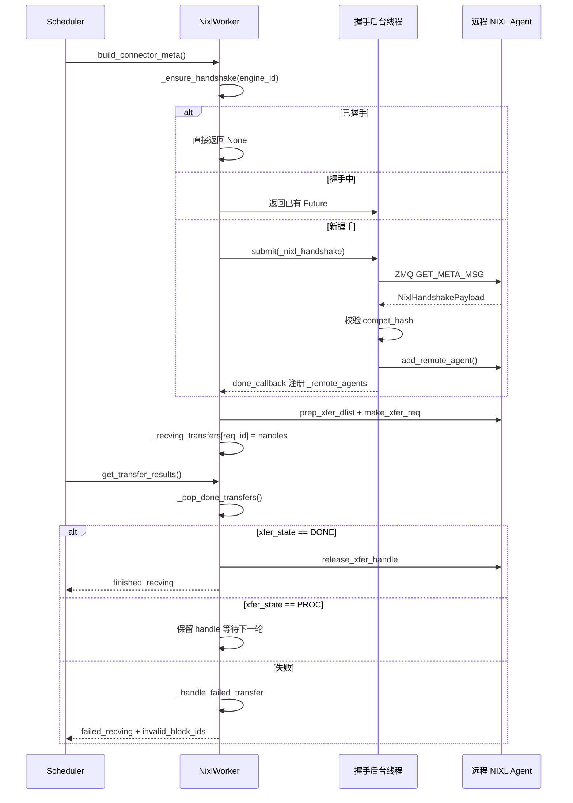

# 제 9 장: KV Cache 전송과 분리형 배포(PD 분리)

이전 장에서 우리는 시점을 단일 추론 인스턴스 내부에 고정했다: TP/PP/DP/EP 프로세스 그룹이 어떻게 구성되는지, 텐서가 카드 간에 어떻게 분할되는지, EPLB가 MoE 계층에서 전문가 재분배를 어떻게 하는지. 그러나 이 모든 메커니즘은 동일한 전제 위에 세워져 있다——prefill과 decode가 같은 인스턴스에서 실행되고, KV Cache가 처음부터 끝까지 로컬 VRAM에 머문다. 분리형 배포(Prefill-Decode Disaggregation, 줄여서 PD 분리)는 이 전제를 깨뜨린다. 그것은 prefill과 decode를 두 개의 독립적인 vLLM 인스턴스로 분리한다: prefill 인스턴스는 prompt의 전방 계산만 수행하고, KV Cache를 생성한 후 decode 인스턴스에 넘긴다; decode 인스턴스는 이 KV Cache를 받아 자동 회귀 생성을 계속한다. 이렇게 하면 자원을 단계 특성에 따라 독립적으로 구성할 수 있다——prefill은 계산 집약적이므로 큰 TP, 큰 batch에 적합하다; decode는 메모리 접근 집약적이므로 작은 batch, 낮은 지연 스케줄링에 적합하다. 둘은 더 이상 서로를 방해하지 않는다. 대가는: KV Cache가 반드시 인스턴스 간 전송되어야 한다는 것이다. 이것이 이 장의 주인공——KV Connector이다. vllm/distributed/kv_transfer/kv_connector/v1/base.py의 파일 헤더 주석은 이미 전체 추상화의 핵심 원시 요소를 나열했다: Scheduler 측은 메타데이터 바인딩, 원격 캐시 히트 조회, 비동기 block 해제 여부 결정을 담당한다; Worker 측은 실제 KV 로드와 저장을 담당한다. 이 인터페이스 세트의 설계 목표는 상위 스케줄링 로직과 하위 전송 백엔드(NIXL, Mooncake, MoRIIO)를 완전히 분리하는 것이다. 공학적 관점에서 PD 분리의 가장 큰 위험은 전송이 느린 것이 아니라 상태 불일치이다: prefill 인스턴스는 KV가 이미 전송되었다고 생각하는데 decode 인스턴스는 받지 못했거나; 또는 decode 인스턴스가 block을 조기에 해제했는데 prefill이 아직 거기에 쓰고 있는 경우이다. 이 장에서 밝히려는 것은 바로 이 커넥터 체계가 핸드셰이크 프로토콜, 리스(lease), 하트비트, 실패 복구 메커니즘으로 이러한 경계를 어떻게 감당하는가이다.

# 一、KVConnectorBase_V1: 이중 역할 추상화와 메타데이터 계약

## 직관적 모델

KV Connector는 두 지점 간의 택배 시스템과 같다. Prefill 지점은 반제품(KV Cache)을 계산해 포장하여 Decode 지점에 보내 계속 가공한다. 그러나 택배 시스템은 "발송"이라는 하나의 동작만으로는 안 된다——무엇을 보내는지, 어디로 보내는지 설명하는 운송장(metadata)이 필요하다; 상대방이 받았는지 확인하는 서명 메커니즘이 필요하다; 또한 패키지가 영원히 길에 막혀 선반을 차지하는 것을 방지하는 타임아웃 규칙도 필요하다.

만약 이 추상화가 없다면, 각 전송 백엔드(NIXL, Mooncake)가 스케줄링 로직을 스스로 구현해야 하고, vLLM의 Scheduler는 각 백엔드마다适配 코드를 작성해야 한다. KVConnectorBase_V1의 가치는 이 계약을 고정하는 것이다.

## 이중 역할: Scheduler 측과 Worker 측

[FACT:vllm/distributed/kv_transfer/kv_connector/v1/base.py:137-142]커넥터의 두 가지 역할을 정의한다:

```python
class KVConnectorRole(enum.Enum):
    # Connector running in the scheduler process
    SCHEDULER = 0
    # Connector running in the worker process
    WORKER = 1
```

이 구분은 임의적이지 않다. Scheduler 프로세스는 전역 스케줄링 결정을 담당한다——어떤 요청이 전송되어야 하는지, 언제 block을 해제할 수 있는지; Worker 프로세스는 실제 데이터 운반을 담당한다. 둘은`KVConnectorMetadata`을 통해 통신한다.

[FACT:vllm/distributed/kv_transfer/kv_connector/v1/base.py:153-158]Scheduler에서 Worker 방향의 메타데이터 기본 클래스를 정의한다:

```python
class KVConnectorMetadata(ABC):  # noqa: B024
    """Abstract Metadata used to communicate
    Scheduler KVConnector -> Worker KVConnector.
    """
    pass
```

반대 방향인 Worker에서 Scheduler 방향은,[FACT:vllm/distributed/kv_transfer/kv_connector/v1/base.py:161-176]이 정의한다`KVConnectorWorkerMetadata`, 이는 구현을 요구한다`aggregate`메서드——하나의 engine step에서 여러 worker가 각각 메타데이터를 반환할 수 있으므로 집계 후 Scheduler에 전달해야 하기 때문이다.

## 핵심 데이터 구조: KVConnectorTransferResults

[FACT:vllm/distributed/kv_transfer/kv_connector/v1/base.py:87-96]전송 결과의 스냅샷 구조를 정의한다:

```python
@dataclass
class KVConnectorTransferResults:
    finished_sending: set[str] = field(default_factory=set)
    finished_recving: set[str] = field(default_factory=set)
    failed_recving: set[str] = field(default_factory=set)
```

주석의 핵심 설계에 주목:**실패한 수신도`finished_recving`에 나타난다**. 이는 Scheduler가 요청을 "전송 대기" 상태에서 해제할 수 있도록 하기 위한 것입니다——전송이 실패하더라도 요청이 영원히 멈춰 있어서는 안 됩니다. 실패 정보는`failed_recving`를 통해 별도로 전달되며, Scheduler는 이를 기반으로 재시도할지 아니면 성능을 낮출지 결정합니다.

## 라이프사이클 훅: 요청부터 해제까지

전체 커넥터의 라이프사이클은 몇 가지 핵심 훅을 중심으로 전개됩니다. Scheduler 측:

- `get_num_new_matched_tokens` [FACT:vllm/distributed/kv_transfer/kv_connector/v1/base.py:485-518]: 원격 캐시에서 몇 개의 토큰을 히트할 수 있는지 조회합니다. 주석에서는 "실제로 사용 가능한 최대 프리픽스만 고려해야 한다"고 특히 강조합니다. 일부 토큰이 연결 문제나 축출로 인해 가져올 수 없다면 포함해서는 안 됩니다.
- `update_state_after_alloc` [FACT:vllm/distributed/kv_transfer/kv_connector/v1/base.py:520-544]: block 할당 후 상태를 업데이트합니다. 주석에 쉽게 빠질 수 있는 함정이 하나 있습니다——로드 여부를 판단하려면`num_external_tokens`을 봐야 하며,`blocks`이 비어 있는지 여부를 봐서는 안 됩니다. MultiConnector의 비선택 서브 커넥터도 실제 block을 수신하기 때문입니다.
- `request_finished` [FACT:vllm/distributed/kv_transfer/kv_connector/v1/base.py:579-598]: 요청 완료 시 호출되며,`True`을 반환하면 커넥터가 block의 비동기 해제 책임을 인계받았음을 나타냅니다.

Worker 측:

- `start_load_kv` / `wait_for_layer_load`: 레이어별로 로드하며, 파이프라인을 지원합니다.
- `save_kv_layer` / `wait_for_save`: 레이어별로 저장합니다.
- `get_transfer_results` [FACT:vllm/distributed/kv_transfer/kv_connector/v1/base.py:396-397]: 비동기 전송의 완료 상황을 반환합니다.

[FACT:vllm/distributed/kv_transfer/kv_connector/v1/base.py:192-201]간과하기 쉽지만 매우 중요한 설계가 하나 더 있습니다——`requires_kv_delivery`속성:

```python
@property
def requires_kv_delivery(self) -> bool:
    """Whether this connector hands off KV that must be reliably delivered.
    ...
    """
    return self._kv_transfer_config.is_kv_producer
```

주석에서 동기를 설명합니다: 요청이 KV 핸드오버가 아직 완료되지 않은 상태에서 선점되면, 완료시켜 이미 선점 해제된 block을 핸드오버하도록 하는 대신 재계산해야 합니다. producer 역할만 신뢰할 수 있는 전달이 필요하며, best-effort 캐시가 손실되면 단지 미래의 cache miss일 뿐입니다.

## 핸드셰이크 메타데이터

[FACT:vllm/distributed/kv_transfer/kv_connector/v1/base.py:145-150]은 핸드셰이크 메타데이터의 기본 클래스를 정의합니다:

```python
class KVConnectorHandshakeMetadata(ABC):  # noqa: B024
    """Metadata used for out of band connector handshake between
    P/D workers. This needs to serializable.
    """
    pass
```

"out of band"는 핸드셰이크가 정상적인 요청 경로를 거치지 않고 P/D worker 간에 직접 통신한다는 의미입니다. 이는 NIXL의 ZMQ 핸드셰이크 프로토콜을 위한 복선이었습니다.

---

# 2. NIXL 커넥터: 핸드셰이크, 등록 및 디스크립터 구축

## 직관적 모델

NIXL(NVIDIA Inference Xfer Library)은 NVIDIA가 제공하는 저수준 전송 라이브러리로, UCX, GDS 등 다양한 백엔드를 지원합니다. NixlBaseConnectorWorker의 역할은 마치 택배 회사의 분류 센터와 같습니다——먼저 상대 분류 센터와 전용선을 구축하고(핸드셰이크), 자신의 선반 배치를 등록한 후(KV Cache 메모리 영역 등록), 그제서야 주소에 따라 효율적으로 물건을 꺼내고 발송할 수 있습니다.

만약 이런 메커니즘이 없다면, 매 전송마다 주소를 재협상하고 연결을 다시 구축해야 하므로 지연이 감당할 수 없을 정도로 높아질 것입니다.

## 메모리 레이아웃: Region과 Descriptor

NIXL의 핵심 개념은**region**(메모리 영역)과**descriptor**(디스크립터)입니다. 각 KV Cache 레이어는 NIXL에 하나 이상의 region으로 등록되며, 각 region은 베이스 주소, 블록 길이, 블록 스트라이드를 가집니다.

[FACT:vllm/distributed/kv_transfer/kv_connector/v1/nixl/base_worker.py:740-751]은 region 관련 핵심 필드를 나열합니다:

```python
# Number of NIXL regions. Currently one region per cache
# (so 1 per layer for MLA, otherwise 2 per layer)
self.num_regions = 0
self.region_mem_types: list[str] = []
self.region_group_ids: list[int] = []
self._uses_region_group_mapping = False
self.region_names: list[str] = []
self.region_num_blocks: list[int] = []
self._mixed_mem_types = False
```

[FACT:vllm/distributed/kv_transfer/kv_connector/v1/nixl/base_worker.py:897-900]은 블록 스트라이드의 출처를 추가로 설명합니다:

```python
# Per-region block stride in bytes. Taken from the registered tensor's
# stride(0) so it stays correct under layouts that interleave layers
# within a block (BLHNC/BHLNC), where stride > block_len.
self.block_stride_per_layer = list[int]()
```

여기서 핵심 통찰은:**block_stride는 block_len과 같지 않습니다**. BLHNC/BHLNC 같은 레이어 간 인터리브 레이아웃에서는 하나의 block의 실제 범위가 유효 데이터 길이보다 클 수 있습니다. 만약 block_len을 직접 스트라이드로 사용하면 주소를 잘못 읽게 됩니다.

## 핸드셰이크 프로토콜: ZMQ + 호환성 해시

핸드셰이크는 NIXL 커넥터에서 가장 복잡한 부분입니다.[FACT:vllm/distributed/kv_transfer/kv_connector/v1/nixl/base_worker.py:974-1128]의`_nixl_handshake`메서드가 이 과정을 완전히 보여줍니다.

첫 번째 단계는 CUDA 디바이스 컨텍스트를 설정하는 것입니다.[FACT:vllm/distributed/kv_transfer/kv_connector/v1/nixl/base_worker.py:988-998]의 주석에서 이유를 설명합니다:

```python
# the first time we connect to a remote agent.
# be careful, the handshake happens in a background thread.
# it does not have an active cuda context until any cuda runtime
# call is made. when UCX fails to find a valid cuda context, it will
# disable any cuda ipc communication, essentially disabling any NVLink
# communication.
if not self.use_host_buffer:
    current_platform.set_device(self.device_id)
```

이것은 매우 은밀한 함정입니다: 핸드셰이크가 백그라운드 스레드에서 실행되는데, 디바이스를 명시적으로 설정하지 않으면 UCX가 유효한 CUDA 컨텍스트를 찾지 못하고 NVLink 통신을 조용히 비활성화하여 느린 경로로 퇴화합니다.

두 번째 단계는 ZMQ를 통해 메타데이터 쿼리를 전송하는 것입니다.[FACT:vllm/distributed/kv_transfer/kv_connector/v1/nixl/base_worker.py:1029-1036]：

```python
msg = msgspec.msgpack.encode(
    (GET_META_MSG, remote_pp_rank, remote_rank)
)
# Set receive timeout to 5 seconds to avoid hanging on dead server
sock.setsockopt(zmq.RCVTIMEO, 5000)  # milliseconds
start_time = time.perf_counter()
sock.send(msg)
reply_parts = sock.recv_multipart()
```

5초 타임아웃은 상대방이 죽은 후 무한 대기하는 것을 방지하기 위한 것입니다. 동시에 코드는 RTT로 클럭 오프셋[FACT:vllm/distributed/kv_transfer/kv_connector/v1/nixl/base_worker.py:1042-1045]을 추정하며, 최소 RTT 샘플을 유지합니다——높은 RTT는 단지 노이즈일 뿐이며 중간점 추정을 왜곡시키기 때문입니다.

세 번째 단계는 호환성 검증입니다.[FACT:vllm/distributed/kv_transfer/kv_connector/v1/nixl/base_worker.py:1063-1080]：

```python
assert self.compat_hash is not None
if (
    self.enforce_compat_hash
    and handshake_payload.compatibility_hash != self.compat_hash
):
    raise RuntimeError(
        f"NIXL compatibility hash mismatch. "
        ...
    )
```

호환성 해시는[FACT:vllm/distributed/kv_transfer/kv_connector/v1/nixl/base_worker.py:1372-1376]에서 계산됩니다:

```python
self.compat_hash = compute_nixl_compatibility_hash(
    self.vllm_config,
    self.backend_name,
    transfer_mode=self._TRANSFER_MODE,
)
```

`transfer_mode`도 해시에 참여한다는 점에 주목하세요——[FACT:vllm/distributed/kv_transfer/kv_connector/v1/nixl/base_worker.py:163-166]의 주석에서 설명합니다: push(WRITE) 커넥터와 pull(READ) 커넥터는 절대 핸드셰이크에 성공해서는 안 됩니다.

## 비동기 핸드셰이크 스케줄링

핸드셰이크는 비동기이며, 스레드 풀을 통해 실행됩니다.[FACT:vllm/distributed/kv_transfer/kv_connector/v1/nixl/base_worker.py:824-835]：

```python
self._handshake_initiation_executor = ThreadPoolExecutor(
    # NIXL is not guaranteed to be thread-safe, limit 1 worker.
    max_workers=1,
    thread_name_prefix="vllm-nixl-handshake-initiator",
)
self._ready_requests = queue.Queue[tuple[ReqId, ReqMeta]]()
self._handshake_futures: dict[
    EngineId, Future[tuple[dict[tuple[int, int], str], float]]
] = {}
# Protects _handshake_futures and _remote_agents.
self._handshake_lock = threading.RLock()
```

`max_workers=1`은 NIXL이 스레드 안전성을 보장하지 않기 때문입니다.`_handshake_lock`은`_handshake_futures`과`_remote_agents`두 딕셔너리를 보호합니다.

`_ensure_handshake` [FACT:vllm/distributed/kv_transfer/kv_connector/v1/nixl/base_worker.py:1257-1317]은 멱등적인 핸드셰이크 개시를 구현합니다: 이미 핸드셰이크에 성공했다면 직접 None을 반환하고, 핸드셰이크 진행 중이라면 기존 Future를 반환하며, 그렇지 않으면 새 작업을 제출하고 콜백을 등록합니다.

## 디스크립터 구축: block ID에서 NIXL descriptor까지

핸드셰이크가 완료되면 각 요청에 대해 디스크립터를 구축해야 합니다.[FACT:vllm/distributed/kv_transfer/kv_connector/v1/nixl/base_worker.py:172-310]의`_compute_desc_ids`가 핵심입니다.

순수 attention 모델(SSM 없음)의 경우 빠른 경로[FACT:vllm/distributed/kv_transfer/kv_connector/v1/nixl/base_worker.py:226-262]를 사용합니다. 주석에서 HMA 시나리오에서의 처리를 설명합니다:

```python
# NOTE (NickLucche) With HMA, every kv group has the same number of layers
# and layers from different groups share the same kv tensor.
# eg block_ids=[[1, 2], [3]]->blocks [1, 2] need to be
# read across all regions, same for [3], but group0-group1 blocks will
# always differ (different areas). Therefore we can just flatten the
# block_ids and compute the descs ids for all groups at once.
```

하이브리드 SSM 모델의 경우 디스크립터 레이아웃이 더 복잡합니다[FACT:vllm/distributed/kv_transfer/kv_connector/v1/nixl/base_worker.py:285-304]：

```python
elif _is_ssm_spec(spec_type):
    # NOTE (NickLucche) SSM and Attention block regions can
    # be exchanged arbitrarily by manager.  Therefore, descs
    # are laid out as:
    #   [descs_fa (all regions) | descs_ssm (all regions)].
    # num_fa_descs offset must be computed per-engine since
    # P and D can have different num_blocks (and thus
    # different FA desc counts).
```

## 전송 토폴로지와 TP 매핑

이기종 TP는 NIXL 커넥터에서 가장 복잡한 시나리오입니다.[FACT:vllm/distributed/kv_transfer/kv_connector/v1/nixl/base_worker.py:2130-2178]의`add_remote_agent`문서에서 다양한 상황을 자세히 설명합니다:

D.world_size > P.world_size일 때, 여러 D worker가 동일한 P worker로부터 서로 다른 KV head 샤드를 읽습니다. 문서에서는 구체적인 예시를 제시합니다: D TP=4, P TP=2, tp_ratio=2. D-Worker0는 P-Worker0의 전반부 KV head를 읽고, D-Worker1은 후반부를 읽습니다.

MLA 모델의 경우, KV Cache는 TP worker 간에 복제되므로 rank_offset은 항상 0입니다.

## 임대와 하트비트: block이 조기에 해제되는 것을 방지

이것은 NIXL 커넥터의 가장 정교한 설계 중 하나입니다. Prefill 인스턴스는 KV를 전송한 후 block을 즉시 해제할 수 없습니다——decode 인스턴스가 아직 읽고 있을 수 있기 때문입니다. 하지만 영원히 해제하지 않으면 VRAM이 누출됩니다.

해결책은 임대(lease)입니다.[FACT:vllm/distributed/kv_transfer/kv_connector/v1/nixl/base_worker.py:528-528]：

```python
kv_lease_duration: int = vllm_config.kv_transfer_config.get_from_extra_config(
    "kv_lease_duration", 30
)
# NOTE (NickLucche): For now we use a hardcoded value for a simpler interface.
self._lease_extension = kv_lease_duration * 2 // 3
```

기본 임대는 30초이며, 매 하트비트마다 20초(2/3)씩 연장됩니다.

하트비트 처리는[FACT:vllm/distributed/kv_transfer/kv_connector/v1/nixl/base_worker.py:3014-3034]：

```python
def _handle_heartbeat(self, payload: str) -> None:
    new_expiry = time.perf_counter() + self._lease_extension
    for req_id in payload.split(","):
        if req_id in self._reqs_to_send:
            old = self._reqs_to_send[req_id]
            self._reqs_to_send[req_id] = max(old, new_expiry)
```

주의`max(old, new_expiry)`——하트비트는 임대를 연장할 수만 있고, 단축할 수는 없습니다.

임대 만료 후 회수는[FACT:vllm/distributed/kv_transfer/kv_connector/v1/nixl/base_worker.py:2986-3012]：

```python
def _reap_expired_send_leases(self, done_sending: set[str]) -> None:
    """Reclaim expired send-side KV leases into ``done_sending``.

    ``_reqs_to_send`` is not ordered by expiry: heartbeats update the
    deadline in place, and mixed TTLs share the map, so a live head
    entry can sit in front of already-expired ones. Scan every entry
    rather than stopping at the first still-live request.
    """
```

주석은 흔히 범하기 쉬운 실수를 지적합니다: 첫 번째 만료되지 않은 요청을 만나면 스캔을 중단해서는 안 됩니다. 하트비트가 제자리에서 만료 시간을 갱신하므로 map이 만료 시간 순으로 정렬되지 않기 때문입니다.

## 전송 상태 머신과 실패 복구

전송의 수명 주기는`_pop_done_transfers` [FACT:vllm/distributed/kv_transfer/kv_connector/v1/nixl/base_worker.py:3036-3086]로 관리됩니다:

```python
for handle in handles:
    try:
        xfer_state = self.nixl_wrapper.check_xfer_state(handle)
        if xfer_state == "DONE":
            res = self.nixl_wrapper.get_xfer_telemetry(handle)
            self.xfer_stats.record_transfer(res)
            self.nixl_wrapper.release_xfer_handle(handle)
        elif xfer_state == "PROC":
            in_progress.append(handle)
        else:
            self._log_failure(
                failure_type="transfer_failed",
                req_id=req_id,
                xfer_state=xfer_state,
            )
```

NIXL 전송에는 세 가지 상태가 있습니다:`DONE`(완료),`PROC`(진행 중), 기타(실패).

실패 처리는[FACT:vllm/distributed/kv_transfer/kv_connector/v1/nixl/base_worker.py:3103-3127]：

```python
def _handle_failed_transfer(
    self,
    req_id: str,
    handle: int | None,
    failed_req_ids: set[str] | None = None,
    record_failed_transfer: bool = True,
) -> bool:
    if record_failed_transfer:
        self.xfer_stats.record_failed_transfer()
    if failed_req_ids is not None:
        failed_req_ids.add(req_id)
    return handle is None or self._try_release_xfer_handle(req_id, handle)
```

`_try_release_xfer_handle` [FACT:vllm/distributed/kv_transfer/kv_connector/v1/nixl/base_worker.py:3088-3101]의 주석이 매우 중요합니다:

```python
except Exception as e:
    # A status error does not guarantee that the backend stopped DMA.
    self._log_failure(
        failure_type="transfer_release_failed",
        msg="Retaining handle and blocks until release succeeds",
        ...
    )
    return False
```

**상태 오류는 백엔드가 DMA를 중지했음을 보장하지 않습니다**. 해제가 실패하면, 해제가 성공할 때까지 handle과 block을 유지해야 합니다. 이것은 전형적인 "누출되더라도 잘못 사용하지 말라"는 설계입니다.

## 실패한 요청의 block 처리

수신이 실패하면,[FACT:vllm/distributed/kv_transfer/kv_connector/v1/nixl/base_worker.py:2876-2891]은 처리 로직을 보여줍니다:

```python
for req_id in done_recving:
    meta = self._recving_metadata.pop(req_id, None)
    assert meta is not None, f"{req_id} not found in recving_metadata list"

    # Skip KV sync and post-processing for failed requests
    if req_id in failed_recv_reqs:
        self._pending_recv_notifs.pop(req_id, None)
        # TODO (NickLucche) handle failed transfer for HMA.
        if not self._is_hma_required:
            self._invalid_block_ids.put(set(meta.local_block_ids[0]))
        logger.warning(
            "Skipping KV post-processing for failed request %s",
            req_id,
        )
        continue
```

실패한 block ID는`_invalid_block_ids`큐에 들어가고, Scheduler는`get_block_ids_with_load_errors` [FACT:vllm/distributed/kv_transfer/kv_connector/v1/nixl/base_worker.py:3491-3504]를 통해 꺼내어 재시도 여부를 결정합니다.

## 원격 엔진의 TTL 축출

장기 실행 인스턴스는 계속해서 새로운 원격 엔진을 만나게 되며, 정리하지 않으면 메모리가 무한히 증가합니다.[FACT:vllm/distributed/kv_transfer/kv_connector/v1/nixl/base_worker.py:3506-3532]의`_evict_stale_engines`은 TTL 축출을 구현합니다:

```python
def _evict_stale_engines(self) -> None:
    """Scan for and evict remote engines that have exceeded their TTL.

    Called from the main thread in when a new remote engine appears.
    We can only go OOM as we discover and register a new remote, therefore we make
    sure we clean up stale engine data structures before then.
    """
    if self._engine_ttl  self._engine_ttl and eid not in busy:
            self._cleanup_remote_engine(eid)
```

핵심 제약은`busy`집합입니다——진행 중인 전송이 있는 엔진은 축출될 수 없습니다.[FACT:vllm/distributed/kv_transfer/kv_connector/v1/nixl/base_worker.py:3534-3546]의 주석이 그 이유를 설명합니다:

```python
"""Remote engines a transfer is still reading from.

The timestamp is stamped when a read is issued and not refreshed while
it runs, so a transfer that outlives the TTL leaves its engine looking
idle. A peer that has lost its NIC holds one indefinitely.
"""
```

상대방의 NIC가 고장 나면 전송이 영원히 걸려 있을 수 있고, 타임스탬프가 갱신되지 않아 엔진이 유휴 상태로 보입니다.`busy`집합이 이러한 상황을 명시적으로 보호합니다.

## 핸드셰이크와 전송의 타이밍

아래 시퀀스 다이어그램은 요청부터 전송 완료까지의 핵심 상호작용을 보여줍니다:



---

# 3. 설계 사고: 왜 이렇게 설계했는가

## 왜 핸드셰이크가 비동기여야 하는가?

핸드셰이크는 네트워크 왕복을 포함하며 수십 밀리초가 걸릴 수 있습니다. 동기적으로 실행하면 Scheduler의 메인 루프를 차단하여 모든 요청의 스케줄링에 영향을 미칩니다. 비동기 핸드셰이크를 통해 Scheduler는 먼저 다른 요청을 처리할 수 있고, 핸드셰이크 완료 후 콜백으로 통지받습니다.

하지만 비동기는 복잡성도 가져옵니다:`_handshake_futures`딕셔너리는 잠금 보호가 필요하고, 콜백에서 성공과 실패 두 가지 경우를 처리해야 하며, 중복 핸드셰이크도 방지해야 합니다.

## 왜 참조 카운팅 대신 임대를 사용하는가?

참조 카운팅은 decode 인스턴스가 prefill에게 "다 읽었습니다"라고 명시적으로 통지해야 합니다. 하지만 decode 인스턴스가 충돌하면 통지가 영원히 도착하지 않아 prefill의 block이 영원히 누출됩니다.

임대는 더 강건한 방식입니다: decode가 충돌하더라도 임대 만료 후 prefill이 자동으로 회수합니다. 하트비트 메커니즘은 정상 상황에서의 임대 갱신을 보장합니다.

## 왜 실패 시 handle을 유지하는가?

[FACT:vllm/distributed/kv_transfer/kv_connector/v1/nixl/base_worker.py:3088-3101]의 주석이 명확히 설명합니다: 상태 오류는 DMA 중지를 보장하지 않습니다. 이때 handle을 해제하면 DMA가 이미 해제된 메모리에 계속 데이터를 쓸 수 있어 데이터 손상이나 충돌을 초래합니다. 일시적으로 누출되더라도 이 위험을 감수할 수 없습니다.

## 왜 TTL 축출 시 busy를 확인하는가?

[FACT:vllm/distributed/kv_transfer/kv_connector/v1/nixl/base_worker.py:3534-3546]의 주석은 은밀한 버그 시나리오를 드러냅니다: 타임스탬프는 읽기 시작 시 찍히고, 읽기 중에는 갱신되지 않습니다. 전송 시간이 TTL을 초과하면 엔진이 유휴 상태로 보이지만 실제로는 여전히 읽히고 있습니다. 이때 축출하면 진행 중인 전송이 실패합니다.

## 프로덕션 환경 함정 포인트

1. **CUDA 컨텍스트 문제**: 핸드셰이크가 백그라운드 스레드에서 실행되므로 반드시 명시적으로`set_device`해야 합니다. 그렇지 않으면 UCX가 NVLink를 조용히 비활성화합니다.

2. **호환성 해시 불일치**: P/D 인스턴스의 vLLM 버전, 모델, dtype, KV layout, attention backend가 완전히 일치해야 합니다. 불일치 시 핸드셰이크가 실패하며, 오류 메시지가 검사를 비활성화하는 방법을 안내합니다(하지만 권장하지 않음).

3. **임대 만료**: decode 인스턴스의 부하가 매우 높으면 하트비트가 지연되어 임대가 만료될 수 있습니다. 로그에 "Releasing expired KV blocks" 경고가 나타납니다.`kv_lease_duration`。

4. **를 늘릴 수 있습니다. TP 불일치**: 이기종 TP는 block-contiguous 레이아웃(예: LBHNC)이 필요합니다. 비연속 레이아웃을 사용하면 이기종 TP가 실패합니다.

5. **NIXL UAR 고갈**：[FACT:vllm/distributed/kv_transfer/kv_connector/v1/nixl/base_worker.py:631-636]의 주석 경고: 각 UCX 스레드는 DevX를 통해 UAR(doorbell pages)을 할당하며, 과도한 NIXL UAR 사용은 NIC UAR 공간을 고갈시켜 NVSHMEM(DeepEP 커널에서 사용)이 RDMA 초기화 시 실패하게 만든다.

---

# 이 장 요약

이 장에서는 KV Connector 체계의 핵심 메커니즘을 깊이 다루었다:

1. **KVConnectorBase_V1**Scheduler 측과 Worker 측의 이중 역할 추상화를 정의하고,`KVConnectorMetadata`와`KVConnectorTransferResults`를 통해 메타데이터 교환과 전송 결과 피드백을 구현한다.

2. **NIXL 커넥터**는 가장 성숙한 구현으로, ZMQ 핸드셰이크 프로토콜을 통해 P/D 인스턴스 간 연결을 설정하고, 호환성 해시로 구성 불일치를 방지하며, 비동기 스레드 풀로 메인 루프 차단을 피한다.

3. **임대와 하트비트**메커니즘은 block 해제의 타이밍 문제를 해결한다: prefill은 KV를 전송한 후 즉시 해제하지 않고, decode의 하트비트 갱신 또는 임대 만료를 기다린다.

4. **실패 복구**는 "누수가 발생하더라도 잘못 사용하지 말라"는 원칙을 따른다: 해제 실패 시 handle을 유지하고, 실패한 block ID를 Scheduler에 보고하여 재시도를 결정한다.

5. **TTL 축출**은 장기 실행 시 원격 엔진 상태가 무한히 증가하는 것을 방지하지만, 진행 중인 전송이 있는 엔진은 반드시 보호해야 한다.

다음 장에서는 오버헤드를 제거하는 또 다른 방향인 컴파일 가속과 CUDA Graph로 전환한다. PD 분리가 리소스 활용률 문제를 해결한 후, 단일 전방향의 시작 오버헤드가 새로운 병목이 된다—CUDA Graph로 수백에서 수천 개의 커널 시작을 한 번의 재생으로 압축하는 방법.

# 이 장 생각해보기와 자가 점검

Q1: 만약`_try_release_xfer_handle`의 예외 처리를 제거하고 직접`release_xfer_handle`를 호출하면, 어떤 시나리오에서 데이터 손상이 발생하는가? 왜인가?

**참고 해석**：`_try_release_xfer_handle` [FACT:vllm/distributed/kv_transfer/kv_connector/v1/nixl/base_worker.py:3088-3101]의 주석은 명확히 지적한다: "A status error does not guarantee that the backend stopped DMA." 예외 처리를 제거하면,`release_xfer_handle`가 예외를 던질 때 호출자는 해제가 성공했다고 생각하고 block 해제를 계속한다. 하지만 실제로 NIXL 백엔드의 DMA가 아직 진행 중일 수 있으며, 이 메모리에 데이터를 쓰고 있을 수 있다. block이 다른 요청에 재할당되면 DMA 쓰기가 새 요청의 KV Cache를 오염시켜 출력이 깨지거나 NaN이 발생한다. 더 나쁜 경우, block이 VRAM 풀로 반환되어 다른 텐서에 재사용되면 DMA가 잘못된 주소에 쓰기를 시도하여 크래시가 발생할 수 있다. 올바른 방법은 handle과 block을 유지하고 다음 라운드`_pop_done_transfers`에서 해제를 재시도하는 것이다.

Q2: `_reap_expired_send_leases`의 주석은 "만료되지 않은 첫 번째 요청을 만났다고 해서 스캔을 중단해서는 안 된다"고 말한다. 만료되지 않은 요청을 만나면 break하도록 변경하면, 어떤 시나리오에서 block 누수가 발생하는가?

**참고 해석**：`_reqs_to_send`는 일반 dict이며, 만료 시간으로 정렬된 우선순위 큐가 아니다. 하트비트 처리`_handle_heartbeat` [FACT:vllm/distributed/kv_transfer/kv_connector/v1/nixl/base_worker.py:3014-3034]는 만료 시간을 제자리에서 갱신한다:`self._reqs_to_send[req_id] = max(old, new_expiry)`. 이는 먼저 추가된 요청이 지속적으로 하트비트를 받아 매우 늦은 만료 시간을 가질 수 있고, 그 뒤에 있는 요청은 이미 만료되었을 수 있음을 의미한다. 만료되지 않은 첫 번째 요청을 만나면 break하면, 뒤에 있는 이미 만료된 요청은 영원히 회수되지 않고 그들의 block이 계속 VRAM을 점유한다. 장시간 실행되고 요청 패턴이 혼합된 시나리오(일부 요청은 빈번히 하트비트로 갱신되고, 일부 요청의 decode 인스턴스는 이미 크래시됨)에서 이는 심각한 VRAM 누수로 누적된다.

Q3: `_evict_stale_engines`는`_engines_with_inflight_transfers`로 진행 중인 전송이 있는 엔진을 보호한다. 이 보호를 제거하면, 어떤 네트워크 장애 시나리오에서 전송 실패가 발생하는가?

**참고 해석**：`_engines_with_inflight_transfers` [FACT:vllm/distributed/kv_transfer/kv_connector/v1/nixl/base_worker.py:3534-3546]의 주석은 핵심 시나리오를 설명한다: "The timestamp is stamped when a read is issued and not refreshed while it runs, so a transfer that outlives the TTL leaves its engine looking idle. A peer that has lost its NIC holds one indefinitely." 상대방 NIC에 장애가 발생하여 NIXL 읽기 작업이 TTL(기본 3600초)을 초과하여 중단된다고 가정하자.`_engine_last_active`타임스탬프는 읽기 시작 시 찍히고 읽기 동안 갱신되지 않으므로 엔진은 이미 유휴 상태로 보인다. 이때`_evict_stale_engines`가 이 엔진을 축출하면,`_cleanup_remote_engine`를 호출하여`dst_xfer_side_handles`를 해제하고 remote agent를 제거한다. 하지만 진행 중인 DMA가 아직 이 리소스들을 사용하고 있어, 해제 후 전송 실패나 크래시가 발생한다.`busy`집합은 이러한 상황을 명시적으로 보호하여 진행 중인 전송이 있는 엔진이 축출되지 않도록 보장한다.

지금까지 우리는 KV Connector가 prefill과 decode 인스턴스 사이에 어떻게 신뢰할 수 있는 데이터 채널을 구축하는지, 그리고 리스, 하트비트, 실패 복구 메커니즘으로 어떻게 상태 일관성을 지키는지 살펴보았다. 하지만 인스턴스 간 전송은 PD 분리의 절반에 불과한 이야기다—KV Cache가 decode 인스턴스에 도착한 후에도 추론 엔진은 단일 인스턴스 내부에서 각 전방 계산 단계를 여전히 효율적으로 실행해야 한다. 그리고 Python 스케줄링과 커널 시작 오버헤드가 바로 단일 단계 지연을 제약하는 다음 병목이다. 다음 장에서는 컴파일 가속과 CUDA Graph로 전환하여, vLLM이 torch.compile과 piecewise backend로 이러한 오버헤드를 어떻게 제거하고 CUDA Graph와 동적 배치 형태를 조화롭게 공존시키는지 살펴본다.
