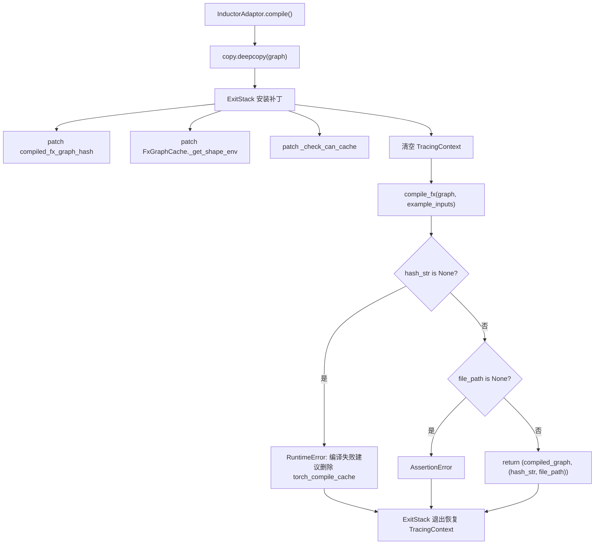
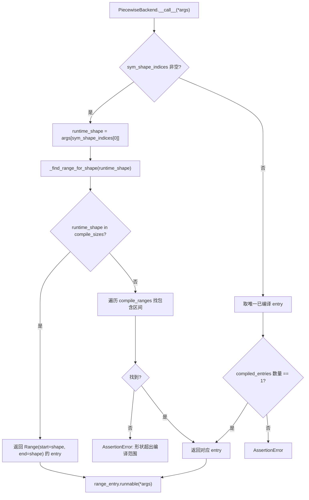

# 제 10 장: 컴파일 가속과 CUDA Graph: 시작 및 스케줄링 오버헤드 제거

이전 장에서 우리는 KV Connector가 NIXL, Mooncake 등의 커넥터를 통해 Prefill과 Decode 엔진 사이에서 KV cache를 효율적으로 운반하여, 분리형 아키텍처가 TTFT를 낮추는 동시에 리소스 활용률을 높이는 것을 보았다. 하지만 전송이 아무리 빨라도, 자기회귀 디코딩에는 알고리즘으로 제거할 수 없는 두 가지 고정 비용이 여전히 존재한다: Python 인터프리터의 스케줄링 오버헤드와 GPU 커널의 시작 오버헤드다. 모델 전방 계산이 수백 개의 연산자로 쪼개지고, 각 연산자가 매번 Python 함수 호출 한 번과 CUDA 커널 시작 한 번을 거쳐야 할 때, CPU 측 오버헤드는 GPU가 두 계산 사이에 유휴 상태로 있게 만들기에 충분하다. 이 장에서는 vLLM이 torch.compile로 연산자를 정적 그래프로 융합하고, 다시 CUDA Graph로 전체 커널 시작 시퀀스를 한 번의 재생으로 녹화하여 이 두 가지 오버헤드를 거의 0에 가깝게 압축하는 방법을 분석한다.

# 컴파일 캐시와 컴파일러 어댑터 계층: 컴파일 결과를 프로세스 간 재사용하기

## 직관적 모델

컴파일 가속의 이점은 "한 번 컴파일, 여러 번 실행"이지만, 대가는 최초 컴파일 소요 시간이 수 분에 달할 수 있다는 점이다. 캐시가 없으면 서비스가 재시작될 때마다 다시 컴파일해야 하므로 콜드 스타트 시간을 감당할 수 없다.`CompilerInterface`이 계층이 해결하려는 것이 바로 "컴파일 산출물을 어떻게 직렬화하고, 어떻게 해시로 식별하며, 다음 시작 시 어떻게 정확히 적중시킬 것인가"라는 문제다. 이것이 없으면 시스템이 직면하는 재앙은 충돌이 아니라, 매번 재시작할 때마다 "최초 실행"으로 퇴화하는 것이다—자동 확장/축소가 이루어지는 프로덕션 환경에서 이는 확장된 인스턴스가 수 분 동안 저지연 서비스를 제공할 수 없다는 것을 의미한다.

## 데이터 구조와 인터페이스 계약

`CompilerInterface`컴파일러 어댑터의 추상 계약을 정의하며, 핵심은 네 가지 메서드다:`initialize_cache`컴파일러 자체의 캐시 디렉터리를 vLLM의 캐시 디렉터리 아래로 리디렉션하는 역할을 담당한다[FACT:vllm/compilation/compiler_interface.py:36-51]；`compute_hash`컴파일러 관련 구성 정보를 수집하여 해시를 생성한다[FACT:vllm/compilation/compiler_interface.py:53-62]；`compile`컴파일을 실행하고 호출 가능한 객체와 핸들을 반환한다[FACT:vllm/compilation/compiler_interface.py:64-95]；`load`핸들로부터 컴파일 산출물을 복원한다[FACT:vllm/compilation/compiler_interface.py:97-103]。

여기서 핵심 설계는`compile`이원 튜플을 반환한다`(callable, handle)`。`callable`은 이번 프로세스 내에서 직접 호출 가능한 컴파일 결과다;`handle`은 "다음 시작 시 복원에 사용할" 증빙이며, 문서는 이것이 "plain Python object, preferably a string or a file path"여야 한다고 명확히 요구한다[FACT:vllm/compilation/compiler_interface.py:81-81]. 이 분리는 캐시 적중 경로와 최초 컴파일 경로가 완전히 다른 코드를 탈 수 있게 한다—적중 시에는`compile`이 전혀 필요 없고,`load`。

`compile_range`만 필요하다. 매개변수는 동적 형태의 의미를 담고 있다. 주석은 이것이 "could be concrete size (if compile_sizes is provided), e.g. [4, 4] or a range [5, 8]"일 수 있으며, "Right now we only support one variable in ranges for all inputs, which is the batchsize (number of tokens) during inference"라고 설명한다[FACT:vllm/compilation/compiler_interface.py:74-74]. 이것이 vLLM 컴파일 전략의 핵심 제약이다: 모든 동적 형태가 단일 변수—토큰 수—로 귀결된다.

## 시나리오 기반: 한 번의 컴파일 요청의 전체 흐름

서비스가 최초로 시작되어,`InductorAdaptor.compile`이 호출된다고 가정하자. 이것은 먼저 컴파일 카운터를 증가시키고[FACT:vllm/compilation/compiler_interface.py:477-489], 그다음 정교하게 구성된 패치 스택에 진입한다.

첫 번째 단계는 그래프를 깊은 복사하는 것이다. 주석은 "inductor can inplace modify the graph, so we need to copy it"이라고 지적한다[FACT:vllm/compilation/compiler_interface.py:500-502]. 이것은 방어적 설계다—컴파일 실패 후에도 원본 그래프를 재시도에 사용할 수 있다.

두 번째 단계는 일련의 monkey-patch를 설치하는 것이다.`hijacked_compile_fx_inner`은 Inductor의 내부 컴파일 함수를 감싸서, 컴파일 완료 후`inductor_compiled_graph._fx_graph_cache_key`에서 해시를 가져온다[FACT:vllm/compilation/compiler_interface.py:512-536]。`hijack_compiled_fx_graph_hash`은 해시 계산 함수 자체를 가로챈다[FACT:vllm/compilation/compiler_interface.py:538-542]. 왜 해시를 "하이재킹"하는가? vLLM은 Dynamo 추적 컨텍스트 밖에서 별도로 컴파일해야 하는데, Inductor의 해시 계산이 해당 컨텍스트에 의존하기 때문이다.

세 번째 단계는`_check_can_cache`패치, 그것은 직접 반환하고 아무런 검사도 하지 않는다[FACT:vllm/compilation/compiler_interface.py:544-551]. 주석은 동기를 설명한다: "Inductor refuses to cache the graph outside of Dynamo tracing context, and also disables caching for graphs with high-order ops. For vLLM, in either case, we want to cache the graph"[FACT:vllm/compilation/compiler_interface.py:544-551]。

네 번째 단계는 추적 컨텍스트를 정리하는 것이다. 이것이 가장 미묘한 부분이다: vLLM은`PiecewiseCompileInterpreter`내부에서`compile_fx`를 호출하며, 이때 Dynamo의`FakeTensorMode`와 서브그래프 입력의`FakeTensorMode`가 일치하지 않아,`detect_fake_mode()`는 단언 실패를 일으킨다[FACT:vllm/compilation/compiler_interface.py:615-622]. 코드는`TracingContext`를 저장한 후 이를 비우고, 종료 시 복원하는 콜백을 등록한다[FACT:vllm/compilation/compiler_interface.py:623-630]。

## 설계 고찰: AlwaysHitShapeEnv와 캐시 일관성

`AlwaysHitShapeEnv`이 클래스는 별도로 분석할 가치가 있다. 그 독스트링은 동기를 직설적으로 설명한다: vLLM은 Dynamo 바이트코드 컴파일을 한 번만 실행하지만, 서로 다른 형상과 하나의 범용 형상으로 Inductor 컴파일을 여러 번 실행해야 한다; 특정 형상에 대한 컴파일은 Dynamo 컨텍스트 외부에서 발생하며, 이때 Inductor에 제공할 shape environment가 없어 Inductor 코드 캐시 조회가 실패한다[FACT:vllm/compilation/compiler_interface.py:114-131]。

해결책은 "항상 히트"하는 가짜 shape environment를 제공하는 것이다:`evaluate_guards_expression`항상`True` [FACT:vllm/compilation/compiler_interface.py:144-145]，`get_pruned_guards`를 반환하고 빈 리스트를 반환한다[FACT:vllm/compilation/compiler_interface.py:144-145]，`produce_guards_expression`빈 문자열을 반환한다[FACT:vllm/compilation/compiler_interface.py:147-159]. 주석은 이 메서드들이 "obtained by trial-and-error until it works"임을 인정한다[FACT:vllm/compilation/compiler_interface.py:137-142]——이것은 PyTorch 내부 구현과 결합된 취약점이며, PyTorch 업그레이드 시 가장 문제가 발생하기 쉬운 부분이다.

캐시 해시의 구성도 마찬가지로 중요하다.`get_inductor_factors`세 가지 종류의 인자를 수집한다: 시스템 상태`CacheBase.get_system()`, PyTorch 상태`torch_key()`, 그리고 Inductor와 functorch의 구성[FACT:vllm/compilation/compiler_interface.py:165-185]. functorch 구성은`patch(_get_vllm_functorch_config())`컨텍스트에서 수집된다는 점에 주목하라[FACT:vllm/compilation/compiler_interface.py:188-189], 이는 "컴파일 시 구성과 캐시 키가 항상 일치"하도록 보장한다——주석은 이것이`set_functorch_config()`와`get_inductor_factors()`를 일치시키기 위한 것이라고 명확히 말한다[FACT:vllm/compilation/compiler_interface.py:147-159]. 이 두 곳이 일치하지 않으면 "컴파일 시 구성 A를 사용하고 캐시 키는 구성 B로 계산"하는 불일치가 발생하여, 캐시가 히트되었지만 잘못된 산출물을 로드하게 된다.

프로덕션 함정:`_patch_standalone_compile_atomic_save`은 torch < 2.10.0을 위한 백포트이다[FACT:vllm/compilation/compiler_interface.py:205-243]. 그것은`CompiledArtifact.save()`를`write_atomic`로 바이너리 형식을 쓰도록 변경하며, 주석은 목적이 "preventing corrupt cache files when multiple processes compile concurrently"라고 설명한다[FACT:vllm/compilation/compiler_interface.py:208-210]. 여러 복제본이 동시에 콜드 스타트하는 시나리오에서 여러 프로세스가 동일한 캐시 파일에 동시에 쓰게 되며, 비원자적 쓰기는 잘린 파일을 생성하고, 이후 프로세스가 손상된 산출물을 읽으면 동작이 예측 불가능해진다.

# PiecewiseBackend: 형상별 구간 컴파일과 런타임 디스패치

## 직관적 모델

`PiecewiseBackend`은 컴파일과 실행 사이의 스케줄링 허브이다. 그것은 "하나의 FX 서브그래프"를 "여러 형상 구간의 호출 가능 객체"로 컴파일하고, 런타임에 실제 토큰 수에 따라 가장 적합한 것을 선택한다. 이것이 없다면, 모든 형상이 동일한 범용 컴파일을 거치거나(성능 차선), 각 형상이 개별적으로 컴파일되어야 한다(컴파일 시간 폭발).

## 데이터 구조: RangeEntry와 컴파일 범위

핵심 데이터 구조는`RangeEntry`이며, 그것은`compile_range`、`compiled`플래그와`runnable`를 함께 묶는다[FACT:vllm/compilation/piecewise_backend.py:80-83]。`PiecewiseBackend``range_entries: dict[Range, RangeEntry]` [FACT:vllm/compilation/piecewise_backend.py:166-171]。

컴파일 범위를 유지한다. 구성은 두 단계로 나뉜다. 먼저`compile_sizes`(정확한 크기)를 처리하며, 각 크기는`Range(start=size, end=size)`의 단일 지점 구간을 생성한다[FACT:vllm/compilation/piecewise_backend.py:166-171]. 여기서 문자열`"cudagraph_capture_sizes"`에 대해 직접`NotImplementedError`를 던지며, "should be handled in`post_init_cudagraph_sizes`" [FACT:vllm/compilation/piecewise_backend.py:166-171]——이것은 명시적인 책임 경계 선언이다. 그런 다음`compile_ranges`(구간)를 처리하며, 각 구간은 하나의 entry를 생성한다[FACT:vllm/compilation/piecewise_backend.py:173-173]。

`PiecewiseBackend`[FACT:vllm/compilation/piecewise_backend.py:117-119]는 두 가지 상호 배타적 모드를 지원하며, 생성자는 XOR 단언으로 이를 강제한다`compile_all_ranges()` [FACT:vllm/compilation/piecewise_backend.py:193-194]: 컴파일 모드(graph 있음, compiled_runnables 없음)는`load_all_ranges()` [FACT:vllm/compilation/piecewise_backend.py:193-194]를 사용한다; 사전 컴파일 모드(graph 없음, compiled_runnables 있음)는

## 를 사용한다. 이 설계는 콜드 스타트와 핫 스타트가 동일한 클래스를 공유하되 데이터 출처만 다르게 한다.

**시나리오 기반: 컴파일에서 런타임 디스패치까지**：`compile_all_ranges`컴파일 단계`_log_compile_start`는 모든 range entry를 순회하며, 컴파일되지 않은 각 entry에 대해[FACT:vllm/compilation/piecewise_backend.py:252-256]를 호출한다`create_concrete_args`추적 이벤트를 기록한다[FACT:vllm/compilation/piecewise_backend.py:258-261]. 핵심 분기는 인자 구성에 있다: 단일 지점 크기라면`get_fake_args_from_graph`를 호출하여 구체적 형상의 FakeTensor를 생성한다[FACT:vllm/compilation/piecewise_backend.py:262-263]。

`create_concrete_args`; 그렇지 않으면`ShapeEnv`를 호출하여 그래프의 placeholder 메타데이터를 직접 재사용한다`FakeTensorMode` [FACT:vllm/compilation/piecewise_backend.py:54]`SymInt`의 구현은 심볼릭 형상 구체화의 세부 사항을 드러낸다. 그것은`concretize`를 가진`size` [FACT:vllm/compilation/piecewise_backend.py:47-52]를 구성한 다음, placeholder 노드를 순회한다.`Tensor`유형의 입력에 대해서는`compute_required_storage_length`를 사용하여 모든 자유 심볼을`as_strided`로 대체한다;[FACT:vllm/compilation/piecewise_backend.py:64-73]. 왜 shape만 바꿀 수 없는가? stride와 storage_offset에도 기호가 포함될 수 있고, 이 세 가지가 서로 일관되어야 하기 때문이다. 그렇지 않으면`as_strided`가 범위를 벗어난다.

**런타임 디스패치**：`__call__`는 핫 패스이다. 만약`sym_shape_indices`가 존재하면,`args`에서 런타임 shape[FACT:vllm/compilation/piecewise_backend.py:357-362]를 가져온 후,`_find_range_for_shape`를 호출하여 조회한다. 조회 로직에는 우선순위가 있다: 먼저 정확한`compile_sizes`에 매칭되는지 확인하고, 매칭되면 해당 단일 포인트 구간[FACT:vllm/compilation/piecewise_backend.py:342-355]을 반환한다. 그렇지 않으면`compile_ranges`를 순회하며 해당 shape를 포함하는 구간을 찾는다.[FACT:vllm/compilation/piecewise_backend.py:342-355]。

## 설계 고찰: 직렬화와 CachingAutotuner의 특수 처리

> **[Design Inference & Architectural Trade-offs]**
> `to_bytes`메서드는 컴파일 산출물을 직렬화하여 AOT 캐시에 사용하는 역할을 한다. 여기에는 정교한`reducer_override`가 있다: pickle이`CachingAutotuner`를 만나면 먼저`obj.prepare_for_pickle()`를 호출한 후[FACT:vllm/compilation/piecewise_backend.py:209-218]를 직렬화한다. 왜 이 훅이 필요한가?`CachingAutotuner`는 내부적으로 Triton 컴파일 산출물과 런타임 상태를 보유하고 있어, 직접 pickle하면 실패하거나 재사용 불가능한 객체가 생성될 수 있다;`prepare_for_pickle`는 분명히 객체를 직렬화 가능한 순수한 형태로 변환하는 것이다.

직렬화 시에는 임시로`bundled_autograd_cache` [FACT:vllm/compilation/piecewise_backend.py:222]를 활성화하는데, 이는`_get_vllm_functorch_config`의 로직과 호응한다——즉`VLLM_USE_MEGA_AOT_ARTIFACT`가 활성화되지 않았을 때 해당 설정은`False` [FACT:vllm/compilation/compiler_interface.py:160-161]이며, 직렬화 시에는 강제로`True`로 설정하여 산출물이 패키징되도록 보장한다.

`load_all_ranges`는 핫 스타트 경로로, 각 range가`compiled_runnables`에서 대응하는 key를 찾을 수 있다고 단언하며, 그렇지 않으면 사용 가능한 key 목록을 포함한 오류[FACT:vllm/compilation/piecewise_backend.py:329-339]를 발생시킨다. 이 오류 메시지는 매우 실용적으로 설계되었다——사용 가능한 key를 직접 나열하여 캐시 버전 불일치를 쉽게排查할 수 있다.

# CUDA Graph 래퍼: 캡처, 재생 및 중첩 디스패치

## 직관적 모델

CUDA Graph는 "일련의 커널 실행"을 정적 그래프로 녹화하여, 이후 매 재생 시 단 한 번의 API 호출만 필요로 한다.`CUDAGraphWrapper`는 녹화와 재생의 실행자이다. 핵심 난제는: vLLM의 배치 크기는 동적이지만, CUDA Graph는 입력 주소가 고정되어야 한다는 것이다. 해결책은 "batch descriptor별로 분할 캡처"——각 shape 등급마다 그래프를 하나씩 녹화하고, 런타임에 descriptor로 테이블을 조회하여 재생하는 것이다.

## 데이터 구조: CUDAGraphEntry와 디스패치 계약

`CUDAGraphEntry`는 세 가지 핵심 필드를 보유한다:`batch_descriptor`는 디스패치 키로 사용[FACT:vllm/compilation/cuda_graph.py:128-135]、`cudagraph`는 캡처된 그래프 객체[FACT:vllm/compilation/cuda_graph.py:128-135]、`output`는 캡처 시의 출력 (메모리 절약을 위해 약한 참조로 저장)[FACT:vllm/compilation/cuda_graph.py:128-135]。`input_addresses`는 디버그 모드에서만 재생 시 입력 주소 일관성을 검증하는 데 사용[FACT:vllm/compilation/cuda_graph.py:128-135]。

`CUDAGraphWrapper`의 클래스 문서는 디스패치 계약을 정확히 설명한다: 초기화 시 런타임 모드(FULL 또는 PIECEWISE)를 할당[FACT:vllm/compilation/cuda_graph.py:158-158]; 런타임에 forward context로부터 runtime_mode와 batch_descriptor를 수신하고 "blindly trust them"[FACT:vllm/compilation/cuda_graph.py:158-158]; runtime_mode가 NONE이거나 일치하지 않으면 직접[FACT:vllm/compilation/cuda_graph.py:158-158]를 호출; 그렇지 않으면 캡처 또는 재생을 수행[FACT:vllm/compilation/cuda_graph.py:158-158]。

문서는 또한 경계를 특별히 선언한다: "CUDAGraphWrapper does not store persistent buffers or copy any runtime inputs into that buffers for replay"[FACT:vllm/compilation/cuda_graph.py:164-164]. 이는 입력 버퍼 관리는 호출자의 책임이라는 의미이다——wrapper는 그래프 자체만 담당한다.

## 시나리오 기반: 한 번의 캡처와 한 번의 재생

**캡처 경로**:`__call__`가 트리거되고 runtime_mode가 일치할 때, 먼저 forward context가 사용 가능한지 확인한다. 사용 불가능한 경우(예: 비전 인코더의 전방향), 직접 하위 함수[FACT:vllm/compilation/cuda_graph.py:232-233]를 호출한다. 이는 멀티모달 시나리오의 핵심 분기이다——ViT 전방향은 CUDA Graph를 거치지 않는다.

다음으로`batch_descriptor`와`cudagraph_runtime_mode` [FACT:vllm/compilation/cuda_graph.py:242-244]를 가져온다. mode가 NONE이거나 일치하지 않으면 직접[FACT:vllm/compilation/cuda_graph.py:246-256]를 호출한다. 이 "불일치 시 직통" 설계는 중첩 wrapper의 공존을 가능하게 한다: FULL wrapper가 외부에, PIECEWISE wrapper가 내부에 있으며, 런타임에는 하나만 활성화된다.

entry의`cudagraph`가 None이면 캡처에 진입한다. 먼저`validate_cudagraph_capturing_enabled()`를 호출하여 유효성을 검증하고[FACT:vllm/compilation/cuda_graph.py:279], 그런 다음 입력 주소를 기록하고[FACT:vllm/compilation/cuda_graph.py:281-284],`torch.cuda.CUDAGraph()` [FACT:vllm/compilation/cuda_graph.py:285]。

를 생성한다. 캡처 컨텍스트에는 몇 가지 핵심 작업이 있다. 만약`gc_disable`가 활성화되면,`gc.collect`와`torch.accelerator.empty_cache` [FACT:vllm/compilation/cuda_graph.py:288-303]를 패치한다. 주석은 그 이유를 설명한다: piecewise 모드에서는 각 레이어마다 그래프를 하나씩 캡처해야 하는데, 반복적인 GC는 캡처를 극도로 느리게 만들기 때문에 "only run gc for the first graph, and disable gc for the rest"[FACT:vllm/compilation/cuda_graph.py:289-294]. 다음으로 graph pool id[FACT:vllm/compilation/cuda_graph.py:305-308]를 설정하고, offloader의 복사 스트림을 동기화한다[FACT:vllm/compilation/cuda_graph.py:310-312]。

실제 캡처는`torch.cuda.graph(cudagraph, pool=..., stream=...)`컨텍스트에서 실행된다`self.runnable(*args, **kwargs)` [FACT:vllm/compilation/cuda_graph.py:315-321]. 캡처 후`get_offloader().join_after_forward()`를 호출하여 join되지 않은 스트림 오류를 방지한다[FACT:vllm/compilation/cuda_graph.py:322-326]. 만약`weak_ref_output`가 활성화되면, 메모리 절약을 위해 output을 약한 참조로 변환한다[FACT:vllm/compilation/cuda_graph.py:327-334]. 마지막으로 entry는 약한 참조 output과 그래프 객체를 저장하지만[FACT:vllm/compilation/cuda_graph.py:338-339],**반환되는 것은 약한 참조가 아닌 원본 output이다**——주석은 이것이 PyTorch가 캡처 중에 메모리를 올바르게 관리하도록 하기 위함이라고 강조한다[FACT:vllm/compilation/cuda_graph.py:343-346]。

**재생 경로**: entry에 이미 그래프가 있으면, 디버그 모드에서 입력 주소 일관성을 검증하고[FACT:vllm/compilation/cuda_graph.py:348-357], 그런 다음 offloader를 동기화하고[FACT:vllm/compilation/cuda_graph.py:359-361],`entry.cudagraph.replay()`를 호출하여 반환한다`entry.output` [FACT:vllm/compilation/cuda_graph.py:362-363]。

## 설계 고민: 왜 출력은 약한 참조여야 하고, 반환은 강한 참조여야 하는가

이것은`CUDAGraphWrapper`에서 가장 직관에 반하는 부분이다. 캡처 시`output`은 PyTorch의 cudagraph pool에 의해 관리된다[FACT:vllm/compilation/cuda_graph.py:320]. 만약 entry가 output을 강하게 참조하면, 이 그래프가 차지하는 VRAM은 영원히 해제될 수 없다. 그러나 캡처 중에 이를 약한 참조로 변환하면, PyTorch가 캡처가 완료되기 전에 메모리를 회수하여 캡처가 실패할 수 있다. 그래서 코드는 캡처 블록 내에서 약한 참조[FACT:vllm/compilation/cuda_graph.py:334]를 사용하고, entry에는 약한 참조[FACT:vllm/compilation/cuda_graph.py:338]를 저장하지만, 함수 반환값은 강한 참조[FACT:vllm/compilation/cuda_graph.py:346]이다. 이 "삼중 참조 상태"는 메모리 안전성과 VRAM 효율성의 정밀한 균형이다.

또 하나 주목할 만한 설계는`_all_instances`이`WeakSet` [FACT:vllm/compilation/cuda_graph.py:173-176]이다. 이는`clear_all_graphs`가 모든 wrapper의 그래프를 한 번에 비울 수 있게 하여[FACT:vllm/compilation/cuda_graph.py:173-176], VRAM이 부족할 때 긴급 회수를 위해 사용된다. 일반 집합 대신`WeakSet`를 사용하는 이유는 wrapper가 GC되는 것을 막지 않기 위해서다. 그렇지 않으면 wrapper 자체가 누수된다.

프로덕션 함정:`__getattr__`의 구현은 디버그 모드에서 존재하지 않는 속성에 대해 컨텍스트가 포함된 오류를 발생시킨다[FACT:vllm/compilation/cuda_graph.py:211-217]. 사소해 보이지만, "왜 특정 메서드 호출이 실패하는가"를 조사할 때 wrapper가 감싼 runnable 문자열 설명을 볼 수 있어서 순수`AttributeError`보다 훨씬 유용하다.

# 설계 고민: 컴파일과 CUDA Graph의 디커플링

설계 문서는 이번 리팩터링의 동기를 명확히 기록하고 있다. 초기 piecewise 컴파일은 piecewise CUDA Graph 캡처를 지원하기 위해 CUDA Graph를 지원하지 않는 연산자(주로 attention)를 제외했다[FACT:docs/design/cuda_graphs.md:25]. 이후 full CUDA Graph 지원이 추가되었지만, "this tight coupling between compilation and cudagraph capture led to an all-or-nothing experience with little flexibility"[FACT:docs/design/cuda_graphs.md:25]。

리팩터링 후 목표는 네 가지다: prefill/mixed와 uniform-decode 배치를 명시적으로 구분하고 각각 캡처[FACT:docs/design/cuda_graphs.md:25-25]; CUDA Graph 캡처 로직을 컴파일과 디커플링하여 "capturing piecewise and full cudagraphs using the same compiled graph"[FACT:docs/design/cuda_graphs.md:25-25]; 런타임에 배치 구성에 따라 디스패치[FACT:docs/design/cuda_graphs.md:25-25]; 복잡도를 낮추기 위한 중앙 집중 제어[FACT:docs/design/cuda_graphs.md:25-25]。

`BatchDescriptor`는 디스패치 키의 핵심 구조로,`num_tokens`、`num_reqs`、`uniform`、`has_lora`네 개의 필드를 포함한다[FACT:docs/design/cuda_graphs.md:86-93]。`uniform`플래그가 특히 중요한데, 많은 attention 백엔드가 배치가 uniform일 때만 full CUDA Graph를 지원하기 때문이다[FACT:docs/design/cuda_graphs.md:95-95]. 문서는 또한 이 구조가 확장될 수 있음을 예고하는데, 예를 들어`uniform_query_len`를 추가하여 여러 uniform decode 길이를 지원하는 것이다[FACT:docs/design/cuda_graphs.md:95-95]。

디스패치 우선순위는`FULL > PIECEWISE > None`이며, 디스패치 키가 존재하지 않으면 NONE 모드로 폴백하여 eager 실행을 한다[FACT:docs/design/cuda_graphs.md:112-115]. 이 "오류 대신 강등" 전략은 어떤 배치 조합이든 실행될 수 있게 보장하며, 성능만 다를 뿐이다.

`AttentionCGSupport`열거형은 백엔드의 CUDA Graph 능력을 정량화하며, 값은`ALWAYS=3 > UNIFORM_BATCH=2 > UNIFORM_SINGLE_TOKEN_DECODE=1 > NEVER=0` [FACT:docs/design/cuda_graphs.md:153-162]이다. 혼합 attention 모델(예: mamba mixer)은 모든 백엔드 능력의 최솟값을 취하고, 그에 따라 CUDA Graph 모드를 강등한다[FACT:docs/design/cuda_graphs.md:173-175]. 이 설계는 "능력 선언"과 "모드 선택"을 디커플링한다. 새 백엔드는 능력만 선언하면 강등 전략이 자동으로 적용된다.

# 이 장 요약

# 이 장 생각과 자가 점검

Q1: 만약`_check_can_cache`패치([FACT:vllm/compilation/compiler_interface.py:544-551])를 제거하고 Inductor가 스스로 캐시 여부를 결정하게 하면, 어떤 시나리오에서 컴파일 캐시가 무효화되는가? 왜 주석은 "Inductor refuses to cache the graph outside of Dynamo tracing context"라고 말하는가?

**참고 해석**：`_check_can_cache`은 직접 반환하고 아무 검사도 하지 않으며, 주석은 Inductor가 두 가지 경우에 캐싱을 거부한다고 설명한다: 하나는 Dynamo 추적 컨텍스트 밖이고, 둘은 그래프에 고차 연산자가 포함된 경우이다[FACT:vllm/compilation/compiler_interface.py:544-551]. vLLM의 컴파일 흐름은 정확히 Dynamo 컨텍스트 밖에 있다(`compile_fx`이`PiecewiseCompileInterpreter`에 의해 호출되고, 코드가 명시적으로`TracingContext` [FACT:vllm/compilation/compiler_interface.py:623-625]를 비운다). 패치를 제거하면 Inductor는 "캐시 불가"로 판정하고, 매 시작마다 다시 컴파일하여 콜드 스타트 시간이 초 단위에서 분 단위로 퇴화한다. 더 은밀한 것은, vLLM이`hijacked_compile_fx_inner`에 의존하여`hash_str`를 가져오는데, 캐시 경로가 건너뛰어지면`hash_str`이 None이 될 수 있어[FACT:vllm/compilation/compiler_interface.py:640-652]의 RuntimeError를 트리거한다. 이는 왜 주석이 "vLLM today assumes and requires the monkey-patched functions to get hit"라고 강조하는지 설명한다[FACT:vllm/compilation/compiler_interface.py:596-598]。

Q2: `CUDAGraphWrapper`은 캡처 시 output을 약한 참조로 변환하여 entry에 저장하지만([FACT:vllm/compilation/cuda_graph.py:338]), 강한 참조를 반환한다([FACT:vllm/compilation/cuda_graph.py:346]). 만약 반환값도 약한 참조로 바꾸면 어떤 시나리오에서 크래시하는가?

**참고 해석**: 캡처 기간 동안`output`은 PyTorch의 cudagraph pool에 의해 관리된다[FACT:vllm/compilation/cuda_graph.py:320]. 반환값이 약한 참조라면, 호출자가 받은 객체는 캡처 블록이 종료된 직후 GC에 의해 회수될 수 있다 — 이때 이를 유지하는 강한 참조가 전혀 없기 때문이다. PyTorch는 캡처 기간 동안 output이 살아 있어야 메모리 풀의 매핑 관계를 올바르게 구축할 수 있다; 일단 회수되면 이후 재생 시`entry.output`가 가리키는 약한 참조는 이미 무효화되어,`replay()`이후 반환된 객체는 이미 덮어쓰이거나 해제되었을 수 있다. 주석은 명확히 "we need to return the output, rather than the weak ref of the output, so that pytorch can correctly manage the memory during cuda graph capture"라고 말한다[FACT:vllm/compilation/cuda_graph.py:343-345]. 이 설계는 "캡처 기간 강한 참조, 저장 기간 약한 참조"의 정교한 균형이다.

Q3:`PiecewiseBackend._find_range_for_shape`（[FACT:vllm/compilation/piecewise_backend.py:342-355]에서 정확한 크기 조회가 구간 조회보다 우선한다.`compile_sizes=[8]`、`compile_ranges=[Range(1,16)]`이고 런타임 shape=8이라고 가정하면, 어떤 entry에 매칭될까? 만약 우선순위를 반대로 하면 어떤 결과가 발생할까?

**참고 해석**: 현재 로직은 먼저`runtime_shape in self.compile_sizes`을 확인하고, 매칭되면`Range(start=8, end=8)`의 단일 포인트 entry[FACT:vllm/compilation/piecewise_backend.py:342-355]를 반환한다. 이 entry는`create_concrete_args`로 컴파일되었으며, 형상이 완전히 구체화되어 Triton 커널이 최대 수준의 특화를 수행할 수 있다 (예:`set_inductor_config`에서 단일 포인트 크기는`max_autotune` [FACT:vllm/compilation/compiler_interface.py:747-754]을 활성화한다). 만약 우선순위를 반대로 하면, shape=8은 구간`Range(1,16)`의 entry에 매칭된다 — 이는 심볼릭 형상으로 컴파일된 범용 버전으로 성능이 차선이다. 더 심각한 것은,`compile_sizes`은 일반적으로`cudagraph_capture_sizes`에서 오며, 이러한 크기들은 바로 CUDA Graph가 캡처하려는 단계이다; 만약 런타임에 범용 entry로 디스패치되면, CUDA Graph가 캡처한 그래프와 디스패치된 runnable이 일치하지 않아 재생 시 형상 불일치가 발생할 수 있다. 따라서 정확한 우선순위는 성능 선택일 뿐만 아니라 정확성 요구사항이기도 하다.

다음 장에서는 양자화와 사용자 정의 커널로 전환하여, vLLM이 가중치 로딩 단계부터 정밀도 제어에 개입하고 고도로 특화된 연산자로 양자화 이점을 실제 처리량 향상으로 실현하는 방법을 살펴본다.

이 장에서는 vLLM 컴파일 가속의 두 계층 메커니즘을 분석했다. 첫 번째 계층은 CompilerInterface와 PiecewiseBackend이다: 전자는 컴파일러 적응 계약과 캐시 해시 전략을 정의하고, AlwaysHitShapeEnv로 Dynamo 컨텍스트 부재 문제를 우회한다; 후자는 단일 FX 서브그래프를 여러 형상 단계로 컴파일하고 런타임에 토큰 수에 따라 디스패치한다. 두 번째 계층은 CUDAGraphWrapper이다: BatchDescriptor에 따라 CUDA Graph를 단계별로 캡처하고, runtime mode 매칭을 통해 중첩 디스패치를 구현하여 FULL과 PIECEWISE 두 모드가 동일한 컴파일 그래프에서 공존할 수 있게 한다.两者的 분리는 이번 리팩토링의 핵심이다 — 컴파일 산출물은 두 CUDA Graph 모드에서 재사용될 수 있고, CUDA Graph도 컴파일과 독립적으로 작동할 수 있다. 그러나 컴파일과 그래프 캡처가 해결하는 것은 스케줄링 오버헤드이며, 모델 자체의 가중치 정밀도와 연산자 효율성은 여전히 또 다른 최적화 주선이다. 다음 장에서는 양자화와 사용자 정의 커널로 전환하여, vLLM이 양자화 설정을 파싱하고 가중치 로딩 시 FP8/INT4/AWQ/GPTQ 등의 형식 변환을 완료하며, _custom_ops와 Triton 커널을 통해 하드웨어 성능을 더욱 짜내는 방법을 살펴본다.
