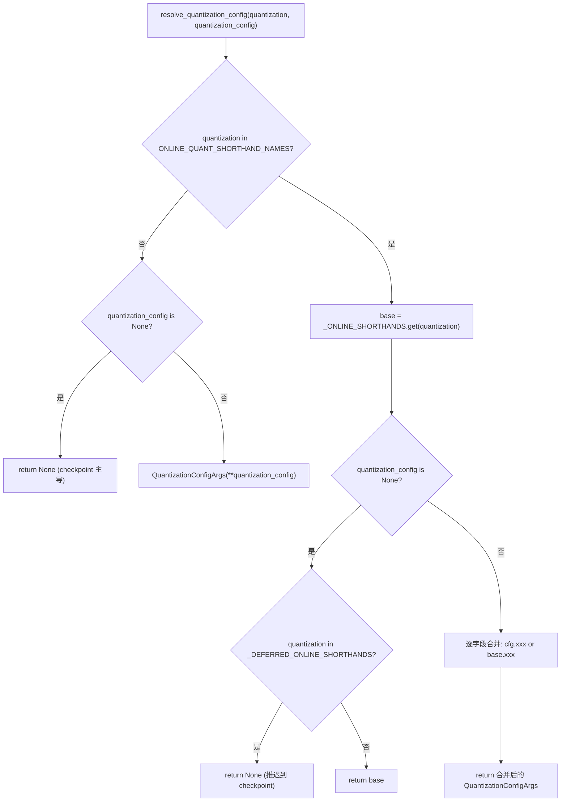
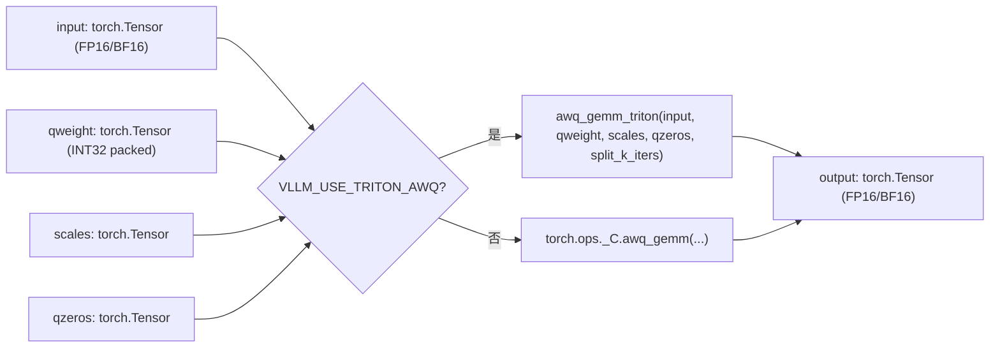
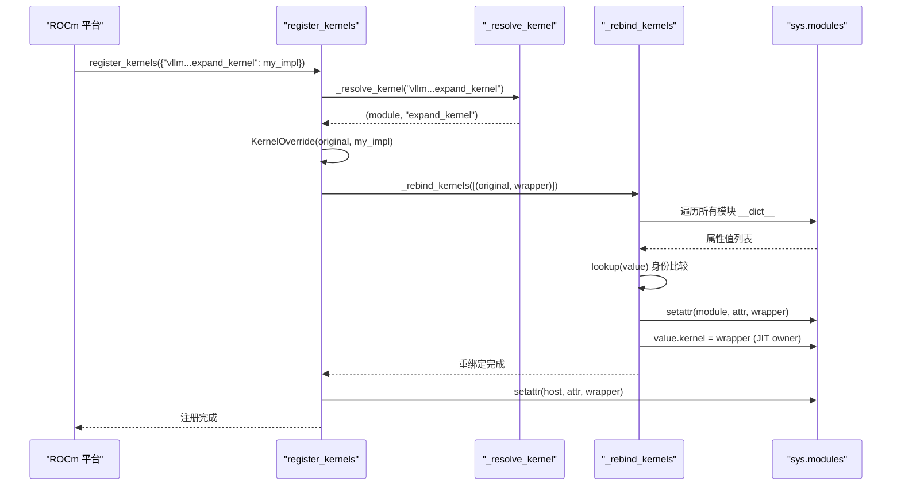

# 제 11 장: 양자화와 사용자 정의 커널: 가중치 로딩에서 고성능 연산자까지

이전 장에서 우리는 torch.compile과 CUDA Graph가 Python 스케줄링과 커널 시작 오버헤드를 극한까지 줄이는 것을 보았다. 그러나 스케줄링이 아무리 빨라도 가중치 자체가 FP16이고 행렬 곱셈이 범용 GEMM을 사용한다면, 하드웨어 연산 능력은 여전히 메모리 대역폭과 비효율적인 연산자에 발목이 잡힌다. 양자화와 사용자 정의 커널은 또 다른 직교적인 최적화 주선이다: 전자는 가중치 로딩 단계에서 정밀도를 낮추고, 후자는 양자화 이점을 실제 처리량으로 실현한다. 이 장은 양자화 설정의 파싱 진입점에서 출발하여 _custom_ops의 연산자 등록과 Triton 커널 스케줄링까지 다룬다.

# 11.1 양자화 설정: CLI 문자열에서 QuantKey까지

## 직관적 모델

양자화 설정 모듈의 역할은 식당의 주문 번역기와 같다. 사용자가 프런트에서 "fp8_per_tensor를 원합니다"(CLI 문자열)라고 말하면, 주방에서는 정확한 레시피 번호(`QuantKey`)가 필요하다. 번역기는 세 가지 입력을 처리해야 한다: 순수 CLI 약어, checkpoint에 내장된 양자화 메타데이터, 그리고两者가 중첩된 조합 시나리오. 이러한 번역 계층이 없으면 주방은 의미가 모호한 문자열 더미를 받아 어떤 kernel을 호출해야 할지 결정할 수 없다.

## 데이터 구조와 메모리 레이아웃

핵심 데이터 구조는`QuantSpec`와`QuantizationConfigArgs`이다. 전자는 단일 유형 계층(linear 또는 MoE)의 가중치와 활성화 양자화 키를 설명하고, 후자는 사용자에게 보이는 최상위 설정이다.

[FACT:vllm/config/quantization.py:73-99]

```python
@config
class QuantSpec:
    weight: QuantKeyField = None
    activation: QuantKeyField = None

    def __str__(self) -> str:
        def quant_key_str(quant_key: QuantKey | None) -> str:
            if quant_key is None:
                return "None"
            return next(
                (
                    name
                    for name, known_quant_key in QUANT_KEY_NAMES.items()
                    if known_quant_key == quant_key
                ),
                str(quant_key),
            )
        return quant_key_str(self.weight)
```

`weight`과`activation`은 모두 선택 사항이다`QuantKey`。`None`의 의미는 "메서드 클래스 자체의 기본값으로 폴백" — 일반적으로 checkpoint에서 상속되며, 온라인 양자화 시나리오에서는 양자화하지 않음을 의미[FACT:vllm/config/quantization.py:74-74]。`QuantKey`자체는 다음을 포함하는 복잡한 타입`NamedTuple`과`ClassVar[GroupShape]`선언을 포함하며, pydantic이 직접 내성할 수 없으므로 작성자는`GetPydanticSchema`를 사용해 커스텀 검증기를 주입`_coerce_quant_key`하여 문자열 또는`QuantKey`을 통일적으로 정규화[FACT:vllm/config/quantization.py:60-69]。

`QuantizationConfigArgs`의 필드 레이아웃은 주목할 만함[FACT:vllm/config/quantization.py:102-126]：

- `linear` / `moe`: 각각`LinearBase`과`FusedMoEFactory`레이어에 적용됨;
- `ignore`: 양자화를 건너뛸 레이어 이름 목록, 온라인 양자화는 fnmatch 와일드카드도 지원;
- `targets`: 레이어별 온라인 양자화 오버라이드, 키는 정확한 레이어 이름,`re:`접두사의 정규식, 또는 fnmatch 패턴이 될 수 있으며, 값은`linear`/`moe`와 상호 배타적.

`targets`과`linear`/`moe`의 상호 배타성은`model_validator`에 의해 강제됨[FACT:vllm/config/quantization.py:172-179]. 이 제약은 형식주의가 아님:`targets`은 레이어별 오버라이드 경로를 따르고,`linear`/`moe`은 전역 기본 경로를 따르며, 둘이 동시에 존재하면 "특정 레이어가 어떤 spec을 사용하는지"가 결정 불가능해짐.

## Step-by-Step: 한 번의`--quantization fp8_per_tensor`파싱

시나리오 대입: 사용자가 명령줄에서`--quantization fp8_per_tensor`를 전달하고, 동시에`--quantization-config`를 통해 MoE 레이어의 활성화 양자화를 지정.

첫 번째 단계,`resolve_quantization_config`이 호출되며, 인자는 CLI 문자열과 설정 딕셔너리[FACT:vllm/config/quantization.py:233-235]. 먼저`quantization`이`ONLINE_QUANT_SHORTHAND_NAMES`에 있는지 확인 — 이 튜플은 모든 축약 이름과`"online"` [FACT:vllm/config/quantization.py:216-222]。

을 포함`fp8_per_tensor`두 번째 단계,`base`이 축약 테이블에 매칭되어,`_ONLINE_SHORTHANDS["fp8_per_tensor"]`로 파싱됨, 즉 linear와 moe 모두`kFp8StaticTensorSym` [FACT:vllm/config/quantization.py:188-190]。

을 사용`quantization_config`세 번째 단계,`QuantizationConfigArgs`이 비어 있지 않아[FACT:vllm/config/quantization.py:267-268]객체로 생성됨. 이후 병합 로직에 진입`quantization_config.xxx or base.xxx`: 각 필드는`or`로 결정 — 사용자가 명시적으로 설정한 필드가 우선하고, 설정되지 않은 필드는 축약 기본값을 상속. 여기서`if is not None`대신`QuantSpec`을 사용한 것은 의도적:

과 빈 리스트 모두 falsy이므로, 의미상 "미설정"과 "빈 값"이 동등함.`quantization`네 번째 단계, 만약`awq`이 축약 테이블에 없고 (예: checkpoint 자체의`quantization_config`), 그리고`None`이`None` [FACT:vllm/config/quantization.py:256-257]이면, 함수는 직접

을 반환. 이는 "온라인 양자화를 중첩하지 않음"을 의미하며, checkpoint의 양자화 방법이 주도권을 유지.`_DEFERRED_ONLINE_SHORTHANDS`놓치기 쉬운 분기가 하나 있음:`mxfp4`이`mxfp8` [FACT:vllm/config/quantization.py:233-235]과`--quantization mxfp4`을 포함. 이 두 이름은 CLI 축약이자 checkpoint 양자화 메서드 이름. 사용자가`quantization_config`만 전달하고`None`없이`base` [FACT:vllm/config/quantization.py:267-268]을 전달하면, 함수는



## 을 반환하여 결정권을 checkpoint 메타데이터로 미룸 — checkpoint에 양자화 정보가 없을 때만 온라인 축약으로 폴백.

`_coerce_spec`복사`linear`설계 고찰과 함정`moe`검증기는 미묘한 시나리오를 처리:`_ONLINE_SHORTHANDS`또는`QuantKey`이 문자열을 받으면, 먼저[FACT:vllm/config/quantization.py:130-139]을 조회하여 히트하면 해당 필드의 spec을 가져오고; 미스하면 단일`linear="fp8_per_tensor"`이름으로 처리`linear="fp8_per_tensor_static"`. 이는`None`과`int8_per_channel_weight_only`이 두 가지 다른 경로를 따른다는 의미 — 전자는 완전한 설정 축약, 후자는 단일 양자화 키. 만약 축약에서 해당 필드가`linear`이면 (예:`ValueError`에`None` [FACT:vllm/config/quantization.py:130-139]。

필드가 없음), 명확한`targets`을 던지고 조용히`_validate_targets`을 반환하지 않음[FACT:vllm/config/quantization.py:166-167]프로덕션 환경의 흔한 함정:

# 11.2 `_custom_ops`의 정규식 키는

## 에서 사전 컴파일 검증되지만

`_custom_ops.py`, fnmatch 패턴의 키는 검증하지 않음. 사용자가 어떤 레이어와도 절대 매칭되지 않는 fnmatch 패턴을 작성하면, 오류가 발생하지 않고 해당 레이어는 양자화되지 않은 채로 유지됨 — 문제 해결 시 레이어 이름이 실제로 매칭되는지 확인해야 함.`torch.ops._C`: 연산자 등록과 fake 구현`torch.compile`직관적 모델`_custom_ops`은 vLLM과 하위 CUDA/C++ 연산자 사이의 어댑터 레이어로, 세관과 같음. PyTorch의

## 네임스페이스에는 컴파일된 C++ 연산자가 등록되어 있지만, 직접 호출에는 세 가지 문제가 있음: 플랫폼마다 (CUDA/ROCm/CPU/XPU) 연산자 집합이 다르고,

은 출력 형태를 추론하기 위한 fake 구현이 필요하며, 일부 연산자는 Python 측 매개변수 전처리가 필요.`current_platform.import_kernels()` [FACT:vllm/_custom_ops.py:25-26]이 이러한 문제들을 통합적으로 캡슐화.`register_fake`데이터 구조와 등록 메커니즘`TYPE_CHECKING`모듈 로드 시 먼저`torch.library`을 호출하여 플랫폼 레이어가 자체 연산자 라이브러리를 임포트할 기회를 줌. 이후[FACT:vllm/_custom_ops.py:25-26]。

을 정의 —`torch.compile`하에서는 빈 데코레이터, 런타임에는`scaled_fp4_quant`에서 임포트

[FACT:vllm/_custom_ops.py:90-100]

```python
if hasattr(torch.ops, "_C") and hasattr(torch.ops._C, "scaled_fp4_quant"):

    @register_fake("_C::scaled_fp4_quant")
    def _scaled_fp4_quant_fake(
        input: torch.Tensor,
        input_scale: torch.Tensor,
        is_sf_swizzled_layout: bool,
    ) -> tuple[torch.Tensor, torch.Tensor]:
        n = input.shape[-1]
        m = input.numel() // n
        return create_fp4_output_tensors(m, n, input.device, is_sf_swizzled_layout)
```

이 추적 단계에서 실제 실행 없이 연산자의 출력 형태와 dtype을 알게 하는 것.`hasattr`을 예로 들면:`_C::scaled_fp4_quant`복사

`create_fp4_output_tensors`[FACT:vllm/_custom_ops.py:69-87]가드에 주목: 플랫폼이 실제로`is_sf_swizzled_layout=True`을 등록했을 때만 fake 구현이 정의됨. 이는 CPU나 구형 GPU에서 연산자 부재로 인해 모듈 임포트가 크래시하지 않도록 보장.`n // 16`은 FP4 양자화 출력의 메모리 레이아웃 세부 사항을 보여줌[FACT:vllm/_custom_ops.py:55-64].[FACT:vllm/_custom_ops.py:60-61]。

## 일 때, scale 텐서는 Tensor Core가 요구하는 128x4 tile 배치로 배열되어야 함: 행 수는 128의 배수로 올림, 열 수 (

)는 4의 배수로 올림, 매 4개의 float8_e4m3가 하나의 int32로 패킹됨

. 주석은 NVFP4 양자화 커널이 모든 padding된 scale 항목을 명시적으로 0으로 초기화하므로 별도의 제로 초기화 kernel이 필요 없음을 명확히 밝힘`awq_gemm` [FACT:vllm/_custom_ops.py:587-592]Step-by-Step: 한 번의 AWQ GEMM 호출 흐름`VLLM_USE_TRITON_AWQ`시나리오 대입: 모델이 AWQ 양자화된 가중치를 로드했고, 순전파 시 활성화와 양자화 가중치의 행렬 곱셈이 필요.`awq_gemm_triton`첫 번째 단계,

을 호출. 함수는 먼저 환경 변수`torch.ops._C.awq_gemm`을 확인. 참이면,`split_k_iters` [FACT:vllm/_custom_ops.py:598-598]。

을 지연 임포트하고 호출 — 이는 순수 Triton 구현 경로로, CUDA 연산자를 지원하지 않는 플랫폼이나 디버깅 시나리오에 사용.`torch.ops._C.awq_gemm`존재하며, fake 구현이 등록됨[FACT:vllm/_custom_ops.py:601-616]. fake가 반환하는 shape는`(split_k_iters, num_in_feats, qweight.size(1) * 8)`그런 다음`.sum(0)`——이는 split-K의 중간 결과 shape와 reduce 후의 최종 shape를 정확히 모사한다.`qweight.size(1) * 8`AWQ의 패킹 방식에서 유래: 각 int32에 4-bit 가중치 8개를 저장.

네 번째 단계,`awq_dequantize`유사한 경로를 따르지만[FACT:vllm/_custom_ops.py:553-559], fake 구현의 shape 추론은 다름:`out_c = qout_c * 8`, 역양자화 후 열 수가 8배 확장되기 때문[FACT:vllm/_custom_ops.py:587-592]。

Marlin 시리즈의 repack 함수는 또 다른 패턴을 보여준다.`gptq_marlin_repack`의 fake 구현은 다음을 계산하고`pack_factor = 32 // num_bits`, 출력 shape는`(size_k // 16, size_n * 16 // pack_factor)` [FACT:vllm/_custom_ops.py:1103-1119]. 여기서`16`는 Marlin tile size이고,`size_k // 16`는 K 차원이 tile 단위로 분할됨을 나타낸다. MoE 버전의`gptq_marlin_moe_repack`는 Python 레벨에서 각 expert를 순회하며 단일 expert의 repack을 호출하고[FACT:vllm/_custom_ops.py:1154-1172], 다음을 단언한다`size_k % 16 == 0`——이는 Marlin 포맷의 강제 제약이다.



## 설계 고찰과 함정

fake 구현은 반드시 실제 연산자의 출력 shape와 완전히 일치해야 한다. 그렇지 않으면`torch.compile`가 추적한 그래프가 런타임에 shape 불일치를 일으킨다.`create_fp4_output_tensors`의 주석은 특히 "Must match the C++ scaled_fp4_quant_func allocation exactly when padded_n is None"[FACT:vllm/_custom_ops.py:69-74]을 강조한다. 이는 실수하기 쉬운 지점이다: C++ 측이 할당 로직을 바꿨는데 fake가 동기화하지 않으면, 컴파일된 그래프가 CUDA Graph 재생 시 크래시한다.

또 다른 함정은`torch.library.custom_op`의 앨리어싱 규칙이다.`safeFusedQuantizeNv`의 주석은 torch 2.12+에서 커스텀 연산자의 출력이 어떤 입력도 앨리어싱할 수 없다고 지적하며, 따라서 저자는 반환 텐서를 in-place 파라미터로 변경했다[FACT:vllm/_custom_ops.py:4650-4655]. 이렇게 "프레임워크 제한을 우회하기 위해 API 형태를 바꾸는" 방식은 연산자 적응 계층에서 흔하며, 디버깅 시`mutates_args`선언이 실제 동작과 일치하는지 주의해야 한다.

`CPUDNNLGEMMHandler`는 또 다른 리소스 관리 패턴을 보여준다: handler 포인터를 int64 tensor에 저장하고,`__del__`시`release_dnnl_matmul_handler`를 호출해[FACT:vllm/_custom_ops.py:3708-3717]를 해제한다. 포인터를 tensor에 저장하는 것은 Python의 정수 인라인 최적화로 제거되는 것을 방지하기 위함이다——이는 저수준 바인딩의 고전적 기법이다.

# 11.3 Triton 커널 디스패치:`KernelOverride`와 크로스 모듈 리바인딩

## 직관적 모델

Triton 커널 디스패처의 역할은 회사의 직무 대체 시스템과 같다. 어떤 플랫폼(예: ROCm)이 vLLM 코어의 Triton 커널을 자체 구현으로 교체해야 할 때, 코어 코드를 직접 수정할 수 없다——그러면 업스트림이 오염된다.`dispatcher`는 플랫폼이 대체 구현을 등록하고, 원래 커널을 가리키는 모든 참조를 조용히 대체 구현으로 바꾸도록 허용한다. 이런 메커니즘이 없으면 각 플랫폼이 fork를 유지해야 하고, 업스트림 변경을 병합할 때 충돌이 끊이지 않는다.

## 데이터 구조와 메모리 레이아웃

핵심 데이터 구조는`_registry`딕셔너리와`KernelOverride`클래스[FACT:vllm/triton_utils/dispatcher.py:29-36]。

`KernelOverride`의 주요 필드[FACT:vllm/triton_utils/dispatcher.py:50-61]：

- `_impl`: 플랫폼 구현 함수;
- `arg_names`: 원래 커널의 파라미터 이름 튜플을 미러링하며, launch 시 키워드 바인딩에 사용;
- `constexprs`: 원래 커널에서 상속된 constexpr 선언;
- `func`: 구현 함수를 가리키며, warmup 내성에 제공;
- `_forward_by_name`: 불리언 플래그로, launch 시 키워드로 전달할지 위치로 전달할지 결정.

`_forward_by_name`의 계산 로직은: 비교`inspect.signature(impl).parameters`와 원래 커널의`arg_names`이 완전히 동일한지[FACT:vllm/triton_utils/dispatcher.py:50-61]. 동일하면 구현의 파라미터 이름이 커널과 일치하므로 안전하게 키워드로 전달 가능; 그렇지 않으면 원래 커널의 파라미터 순서대로 위치 전달해야 한다.

## Step-by-Step:`register_kernels`의 리바인딩 한 번

시나리오 대입: ROCm 플랫폼이 초기화 시`register_kernels({"vllm.v1.sample.rejection_sampler.expand_kernel": my_expand_impl})`。

를 호출`register_kernels`첫 번째 단계,`_resolve_kernel` [FACT:vllm/triton_utils/dispatcher.py:162-166]。`_resolve_kernel`가 overrides를 순회하며 각 이름에 대해`.`를 호출해 이름을 마지막[FACT:vllm/triton_utils/dispatcher.py:83-94]기준으로 모듈명과 속성명으로 분리`getattr`. 모듈명의 마지막 세그먼트 첫 글자가 대문자면 커널이 어떤 클래스(JIT warmup owner)에 속하므로, 부모 모듈을 먼저 import한 후`(类, 属性名)`로 클래스를 얻어`(模块, 属性名)`。

를 반환; 그렇지 않으면 모듈 자체를 import해`KernelOverride`를 반환`_registry` [FACT:vllm/triton_utils/dispatcher.py:167-169]。

두 번째 단계, 원래 커널 객체를 얻은 후`_rebind_kernels`래퍼를 생성하고[FACT:vllm/triton_utils/dispatcher.py:97-144]에 기록`sys.modules`세 번째 단계,`__dict__`가 전체 모듈 스캔을 수행`is`. 이는`==`내 모든 모듈의`PlaceholderModule`를 순회하며 각 속성 값에 대해 아이덴티티 비교 수행——주의:[FACT:vllm/triton_utils/dispatcher.py:116-123]。

가 아니라`setattr`, 일부 속성 값(예:[FACT:vllm/triton_utils/dispatcher.py:125-135]센티넬)이 hash/eq 시 import나 예외를 트리거하기 때문`kernel`네 번째 단계, 원래 커널과 매칭된 속성에 대해서는 직접`value.kernel`를 wrapper로 교체`_kernel_arg_names`. JIT warmup owner(인스턴스 속성[FACT:vllm/triton_utils/dispatcher.py:138-139]。

이 원래 커널을 가리키는 객체)에 대해서는`_rebind_kernels`를 교체하고 캐시된[FACT:vllm/triton_utils/dispatcher.py:170-174]를 제거해, launch 바인딩이 wrapper에서 다시 추론되도록 함[FACT:vllm/triton_utils/dispatcher.py:170-171]。



## 완료 후에야 정의 위치의 속성도 wrapper로 교체

`KernelOverride.__getitem__`. 주석은 순서의 중요성을 설명한다: 정의 위치를 먼저 교체하면 스캔 시 원래 커널을 찾을 수 없다`self._launch`복사`kernel[grid](**kwargs)`설계 고찰과 함정[FACT:vllm/triton_utils/dispatcher.py:63-74]。`_launch`가[FACT:vllm/triton_utils/dispatcher.py:63-74]를 반환하므로,`_forward_by_name`같은 Triton 표준 launch 문법이 wrapper에 투명하게 작동`RuntimeError`의 전달 로직은 세 가지 경우로 나뉜다

: 위치 인자가 있으면 직접 통과;`RuntimeError`중요한 방어책이다: 플랫폼 구현의 파라미터 이름이 커널과 일치하지 않고, 호출자가 구현이 인식하지 못하는 파라미터를 전달했을 때, 조용히 무시하면 추적하기 어려운 잘못된 결과를 초래한다. 명시적 오류 발생은 문제를 등록 단계에서 바로 드러나게 한다.

프로덕션 환경의 함정:`_rebind_kernels`의 스캔은 O(모듈 수 × 속성 수 × 커널 수)이다. 대형 모델의 경우,`sys.modules`에는 수천 개의 모듈이 있을 수 있고, 각 모듈에는 수백 개의 속성이 있다. 초기화 시에만 한 번 실행되지만, 등록된 커널이 많으면 시작 시간이 눈에 띄게 증가한다.`lookup`함수는 해시 조회 대신 선형 스캔을 사용하며, 주석에 그 이유를 설명한다 — 일부 속성 값은 해시할 수 없다[FACT:vllm/triton_utils/dispatcher.py:116-123]. 이는 전형적인 "정확성 우선, 성능 차선"의 트레이드오프이다.

또 다른 함정:`_resolve_kernel`은 "모듈 이름 마지막 세그먼트의 첫 글자 대문자"로 클래스 속성인지 판단한다[FACT:vllm/triton_utils/dispatcher.py:83-94]. 만약 어떤 모듈 이름이 우연히 대문자로 시작하면(Python 명명 관례에 맞지 않지만 문법적으로는 유효), 클래스로 오판된다. 이는 관례 우선 설계로, vLLM 내부의 명명 규칙에 의존한다.

# 설계 고찰

양자화 설정과 연산자 등록이라는 두 계층 메커니즘이 함께 vLLM의 "정밀도-성능" 조절면을 구성한다.`QuantizationConfigArgs`의 설계는 "사용자 의도"와 "메서드 기본값"의 분리를 보여준다:`None`은 "양자화하지 않음"이 아니라 "메서드 클래스가 스스로 결정하게 함"이다. 이러한 지연 결정 덕분에 동일한 설정이 checkpoint 양자화와 온라인 양자화 두 시나리오에 모두 적용될 수 있다.

`_custom_ops`의 fake 구현 패턴은`torch.compile`생태계의 표준이지만, vLLM의 독특한 점은`hasattr`가드의 보편적 사용이다. 이 덕분에 동일한 모듈을 CUDA, ROCm, CPU, XPU에서 임포트해도 크래시하지 않으며, 대가는 각 연산자마다 세 곳의 코드가 필요하다는 것이다: Python 래퍼, fake 구현, 그리고 플랫폼 가드.

Triton dispatcher의 크로스 모듈 재바인딩은 공격적인 방식이다. Python의 임포트 훅이나`__getattr__`에 의존하지 않고, 모든 참조를 직접 스캔하여 교체한다. 이 방식의 장점은 철저함이다 — 커널이`from mod import kernel`복사된 곳이 얼마나 많든 교체될 수 있다; 단점은 취약함이다 — 커널 참조를 보유하는 새로운 방식(예: 클로저 캡처)은 스캔을 피할 수 있다.

# 이 장 요약

# 이 장 생각해보기와 자가 점검

Q1:`resolve_quantization_config`에서 만약`_DEFERRED_ONLINE_SHORTHANDS`분기를 제거하면(즉,`quantization in _DEFERRED_ONLINE_SHORTHANDS`일 때`base`대신`None`을 반환), checkpoint에 자체`quant_method: "mxfp4"`이 있는 모델을 로드하고 사용자가`--quantization mxfp4`만 전달할 때 무슨 일이 발생하는가?

**참고 해석**：`_DEFERRED_ONLINE_SHORTHANDS`의 설계 의도는 checkpoint 양자화 메서드를 우선하게 하는 것이다[FACT:vllm/config/quantization.py:233-235]. 이 분기를 제거하면,`mxfp4`이`_ONLINE_SHORTHANDS`에 매칭되어`base`을 반환한다(즉,`QuantSpec(weight=kMxfp4Static)`）[FACT:vllm/config/quantization.py:198-210]. 이때 온라인 양자화 설정이 checkpoint의 양자화 메서드를 덮어쓰게 되는데, checkpoint의 가중치는`mxfp4`형식으로 저장되어 있다 — 만약 온라인 설정의`kMxfp4Static`이 checkpoint의 실제 형식과 완전히 일치하지 않으면(예: scale 레이아웃이 다름), 가중치 로딩이 실패하거나 잘못된 결과를 낳는다. 더 은밀한 경우는: checkpoint의`mxfp4`이 다른 group size나 scale dtype을 사용했을 수 있고, 온라인 설정의 기본값이 이와 맞지 않아 추론 정밀도가 저하되지만 오류는 발생하지 않는다.

Q2: `KernelOverride._launch`에서 만약`_forward_by_name`이`False`이고 호출자가 전달한 kwargs에 원래 커널이 인식하지 못하는 파라미터 이름이 포함되어 있으면, 코드는`RuntimeError`을 발생시킨다. 이 검사를 제거하고 알 수 없는 파라미터를 조용히 무시하도록 바꾸면, 어떤 시나리오에서 추적하기 어려운 문제가 발생하는가?

**참고 해석**：`_forward_by_name`이`False`이라는 것은 플랫폼 구현의 파라미터 이름이 원래 커널과 일치하지 않아 위치 기반으로 전달해야 함을 의미한다[FACT:vllm/triton_utils/dispatcher.py:50-61]. 만약 호출자가 원래 커널이 인식하지 못하는 파라미터를 전달하면(예: 업스트림에서 선택적 파라미터를 새로 추가), 조용히 무시하면 해당 파라미터의 값이 유실된다. Triton 커널 시나리오에서 이는 보통 어떤 constexpr이나 grid 차원이 전달되지 않았다는 뜻이며, 커널이 기본값으로 시작될 수 있다 — 결과는 크래시가 아닌 잘못된 계산 결과일 수 있다. Triton 커널의 잘못된 결과는 종종 예외가 아닌 수치 편차로 나타나므로 추적 난이도가 극히 높다. 명시적`RuntimeError`은 문제를 첫 launch 시에 드러나게 한다[FACT:vllm/triton_utils/dispatcher.py:63-74]。

Q3: `_rebind_kernels`JIT warmup owner의`kernel`속성을 교체한 후,`value.__dict__.pop("_kernel_arg_names", None)`을 실행한다. 이 줄을 제거하면 어떤 경우에 launch 바인딩 오류가 발생하는가?

**참고 해석**: JIT warmup owner는`_kernel_arg_names`을 캐시하여 launch 시 kwargs를 커널 파라미터에 바인딩한다[FACT:vllm/triton_utils/dispatcher.py:138-139].`kernel`을 wrapper로 교체한 후, wrapper의`arg_names`이 원래 커널과 다를 수 있다(플랫폼 구현의 파라미터 이름이 다르면, wrapper의`arg_names`은 여전히 원래 커널을 미러링하지만,`_forward_by_name`은`False`일 수 있다). 캐시를 지우지 않으면, warmup 메커니즘이 계속 이전 파라미터 이름 목록으로 바인딩하는데, wrapper의 launch 로직은 다른 바인딩 방식을 기대할 수 있다. 구체적으로,`KernelOverride._launch`은`_forward_by_name`이`False`일 때`self.arg_names`순서로 값을 추출한다[FACT:vllm/triton_utils/dispatcher.py:79-80]. 만약 캐시된`_kernel_arg_names`이 wrapper의`arg_names`과 일치하지 않으면, 추출된 파라미터 순서가 뒤섞여 커널이 잘못된 파라미터 값을 받게 된다.

다음 장에서는 고급 추론 기능으로 넘어가, 프리픽스 캐싱이 KV block을 어떻게 재사용하는지, 추측 디코딩이 소형 모델로 대형 모델을 어떻게 가속하는지, 그리고 LoRA가 기반 가중치를 변경하지 않고 어댑터를 동적으로 전환하는 방법을 살펴본다.

이 장에서는 vLLM 양자화와 사용자 정의 커널의 두 계층 인프라를 분석했다. 첫 번째 계층은 양자화 설정 파싱이다. QuantSpec과 QuantizationConfigArgs는 CLI 문자열, checkpoint 메타데이터, 레이어별 오버라이드를 QuantKey로 통일해 정규화하고, resolve_quantization_config는 축약형 확장과 필드 병합을 처리하며, _DEFERRED_ONLINE_SHORTHANDS는 이름 충돌 시나리오를 해결한다. 두 번째 계층은 연산자 적응이다. _custom_ops는 hasattr 가드와 register_fake를 통해 크로스 플랫폼 연산자 등록을 구현하고, fake 구현은 torch.compile을 지원하기 위해 실제 연산자의 출력 형태를 정확히 미러링한다. dispatcher는 KernelOverride와 전체 모듈 스캔을 통해 Triton 커널의 플랫폼 교체를 구현한다. 이 둘은 함께 가중치 로딩부터 전방 계산까지의 양자화 이득 실현을 뒷받침한다. 다음으로 처리량을 높이고 지연을 줄이는 고급 추론 기능으로 넘어간다. 자동 프리픽스 캐싱이 요청 간 KV를 어떻게 재사용하는지, 추측 디코딩이 드래프트 모델로 생성을 어떻게 가속하는지, 그리고 LoRA가 어댑터를 어떻게 동적으로 전환하는지 살펴본다.
