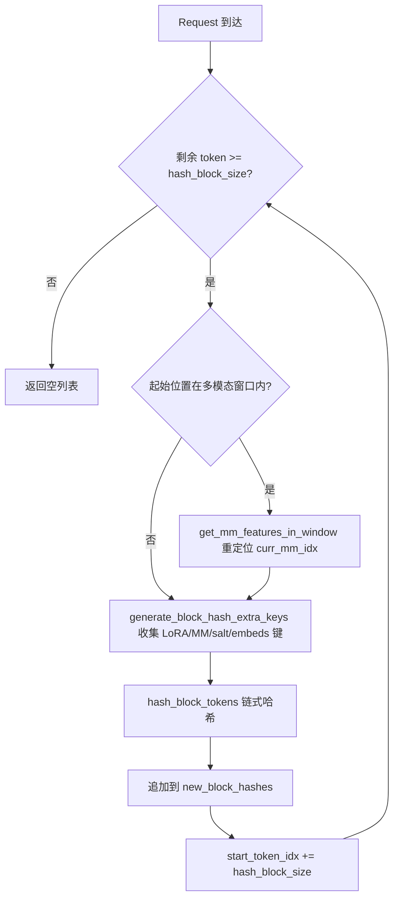
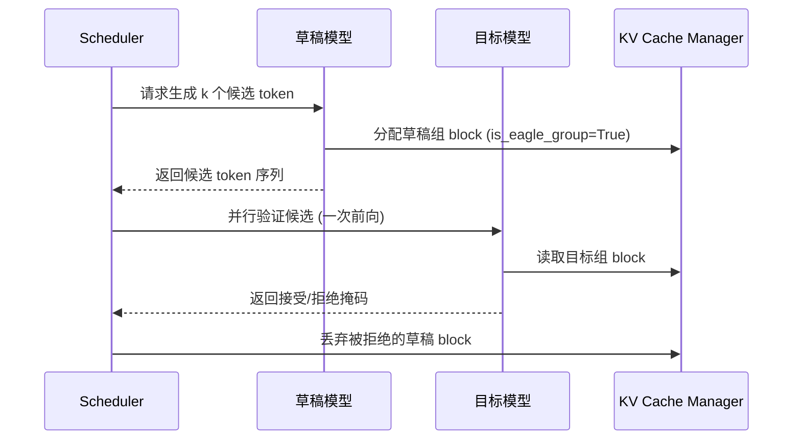

# 제 12 장: 고급 추론 기능: 프리픽스 캐싱, 추측 디코딩과 LoRA

지난 장에서 우리는 vLLM의 양자화 체계와 사용자 정의 연산자 인프라를 깊이 살펴보았고, 양자화 설정이 어떻게 파싱되고 해당 kernel이 선택되는지, 그리고 FP8, INT4, AWQ, GPTQ 등의 방식이 가중치 로딩 시 어떻게 변환을 완료하는지 보았다. 동시에 _custom_ops가 CUDA 연산자를 어떻게 등록하는지, Triton 커널의 스케줄링 메커니즘, 그리고 MoE 융합 커널이 어떻게 메모리 왕복을 줄이는지도 확인했다. 이러한 저수준 능력은 더 고급 추론 최적화를 위한 길을 열어주었다. 이 장에서는 vLLM의 세 가지 고급 추론 기능인 자동 프리픽스 캐싱(APC), 추측 디코딩, LoRA에 집중한다. 이들은 겉보기에는 독립적이지만, 실제로는 동일한 저수준 인프라—KV block의 해시, 스케줄러의 slot 할당, 그리고 모델 실행 시의 동적 가중치 주입—를 공유한다. 이들을 이해하는 핵심은 PagedAttention 페이징 의미론을 훼손하지 않으면서 '재사용'을 극한까지 달성하는 방법을 이해하는 것이다.

# 12.1 프리픽스 캐싱: block hash가 프리픽스를 지문화하는 방법

## 직관적 모델

프리픽스 캐싱은 도서관의 '공용 문단 발췌본'과 같다. 두 학생이 작문을 쓰는데 서두에서 같은 고문을 인용한다면, 선생님은 이 고문 부분을 한 번만 첨삭하면 되고, 이후 각자 다른 부분만 따로 보면 된다. 이것이 없다면 모든 요청이 처음부터 전체 prompt를 prefill해야 하며, 긴 문서 질의응답 시나리오에서는 연산력이 여러 배로 중복 소모된다.

## 데이터 구조: token에서 block hash로의 매핑

프리픽스 캐싱의 핵심은 '두 요청의 프리픽스가 같은지 어떻게 판단하는가'이다. vLLM의 답은 token 시퀀스를 block 단위로 나누고, 각 block에 대해 체인 해시를 계산하는 것이다. 체인이라는 것은 N번째 block의 해시가 앞 N-1개 block의 해시를 포함한다는 의미이므로, 하나의 block hash는 '시퀀스 시작부터 해당 block 끝까지'의 전체 프리픽스를 고유하게 지문화한다.

해시의 담체는`BlockHash`이며, 이는`bytes`의`NewType`로 정의되고, 순수`bytes`가 아니며, 목적은 타입 수준에서 오용을 방지하는 것이다[FACT:vllm/v1/core/kv_cache_utils.py:59-62]. block hash와 KV cache group id를 조합해 딕셔너리 키로 만들 때, vLLM은 튜플을 사용하지 않고 4바이트 빅엔디언 group id를 hash 바이트 끝에 직접 이어 붙인다[FACT:vllm/v1/core/kv_cache_utils.py:75-76]：

```python
def make_block_hash_with_group_id(block_hash, group_id):
    return BlockHashWithGroupId(block_hash + group_id.to_bytes(4, "big", signed=False))
```

> **[Design Inference & Architectural Trade-offs]**
> 이것은 전형적인 '튜플 할당 회피' 최적화이다. 핫 패스에서 각 block의 조회는 매번 키를 구성해야 하는데, 튜플은 추가적인 Python 객체 할당과 해시 오버헤드를 유발한다. 반면 바이트열 연결은 C 계층에서 완료되고, 바이트열 자체가 해시 가능하다. 되찾을 때는 슬라이싱`key[:-4]`과`int.from_bytes(key[-4:])`로 복원한다[FACT:vllm/v1/core/kv_cache_utils.py:87-89]。

해시 함수 자체는`hash_block_tokens`가 담당하며, 부모 block hash, 현재 block의 token id 튜플, 그리고 추가 키를 함께 해시 함수에 넣는다[FACT:vllm/v1/core/kv_cache_utils.py:650-680]. 첫 번째 block의 부모 해시는`None`가 아니라 전역`NONE_HASH`：

```python
if not parent_block_hash:
    parent_block_hash = NONE_HASH
```

[FACT:vllm/v1/core/kv_cache_utils.py:674-675]。`NONE_HASH`의 시드 선택에는 보안 설계가 숨어 있다. SHA-256 같은 암호학적 해시의 경우 시드는 고정`"vllm-none-hash"`이므로 서로 다른 vLLM 프로세스가 동일한 내용에 대해 같은 해시를 계산해 노드 간 프리픽스 캐시를 공유할 수 있다. 반면 xxhash 같은 비암호학적 해시의 경우 시드는 프로세스마다 무작위인데, 예측 가능한 시드는 공격자가 오프라인에서 충돌 block을 미리 계산할 수 있게 하기 때문이다[FACT:vllm/v1/core/kv_cache_utils.py:105-126]。`resolve_none_hash_seed`이 분기를 구현한다:`PYTHONHASHSEED`환경 변수가 우선이고, 그렇지 않으면 암호학적 해시는 고정 시드를, 비암호학적 해시는`os.urandom(32)` [FACT:vllm/v1/core/kv_cache_utils.py:132-145]。

## 시나리오 기반: 한 요청의 block hash 계산

하나의 요청이 128개의 token을 가지고 들어오고, block size가 16이라고 가정하자.`get_request_block_hasher`반환된 클로저는 증분 계산을 담당한다[FACT:vllm/v1/core/kv_cache_utils.py:802-861]：

첫 번째 단계, 어디서부터 계산을 시작할지 결정한다.`start_token_idx = len(request.block_hashes) * hash_block_size` [FACT:vllm/v1/core/kv_cache_utils.py:812-812]즉, 이미 계산된 block 수에 block 크기를 곱한 값이다. 남은 token이 하나의 block에 미치지 못하면 바로 빈 값을 반환한다[FACT:vllm/v1/core/kv_cache_utils.py:812-812]。

두 번째 단계, 멀티모달 오프셋을 처리한다. 시작 위치가 어떤 멀티모달 입력 내부에 걸쳐 있다면,`get_mm_features_in_window`를 사용해 재배치해야 한다`curr_mm_idx` [FACT:vllm/v1/core/kv_cache_utils.py:823-832]. 이는 멀티모달 입력의 placeholder token 자체가 의미를 지니지 않기 때문에, mm 특징 식별자와 그것의 block 내 오프셋을 추가 키로 해시에 섞어 넣어야 하기 때문이다.

세 번째 단계, 각 block을 반복 계산한다.`generate_block_hash_extra_keys`모든 추가 키를 수집한다[FACT:vllm/v1/core/kv_cache_utils.py:611-647]. LoRA 이름, 멀티모달 키, cache salt, prompt embeds 해시를 포함한다. 그중 cache salt는 첫 번째 block에서만 적용된다[FACT:vllm/v1/core/kv_cache_utils.py:633-635]. 이는 의도된 것이다: salt의 역할은 전체 캐시 네임스페이스를 격리하는 것이므로, 체인의 시작점에서 한 번만 주입하면 된다.

네 번째 단계,`hash_block_tokens`부모 해시, token 튜플, 추가 키를 함께 해시하고, 그 결과를 다음 block의 부모 해시로 삼는다[FACT:vllm/v1/core/kv_cache_utils.py:851-857]. 연쇄 구조가 이로써 형성된다.

## 다중 block size의 입도 변환

모델에 여러 KV cache group이 있고 block size가 서로 다를 때, 해시 입도와 group의 block 입도가 일치하지 않을 수 있다.`BlockHashListWithBlockSize`이 문제를 해결한다: 해시를 다시 계산하지 않고, 연쇄 해시의 성질을 이용한다 — target block의 해시는 그 내부의 마지막 hash block의 해시이다[FACT:vllm/v1/core/kv_cache_utils.py:2781-2851]. 예를 들어 hash block이 16, target block이 32일 때, token 0-31의 해시는 두 번째 16-size 해시이다(그것이 이미 연쇄적으로 0-31을 커버한다)[FACT:vllm/v1/core/kv_cache_utils.py:2794-2806]。`_get_value_at`의 구현은 바로`self.block_hashes[(idx + 1) * self.scale_factor - 1]` [FACT:vllm/v1/core/kv_cache_utils.py:2848-2851]。



## 설계 고찰과 함정

**왜 독립 해시가 아니라 연쇄 해시를 쓰는가?**독립 해시는 「같은 block이 서로 다른 프리픽스 위치에 나타나는」 경우를 구분하지 못한다. 연쇄 해시는 block hash가 전체 프리픽스를 유일하게 지문화하게 만든다. 이것이 바로`find_longest_cache_hit`가 KV를 안전하게 재사용할 수 있는 전제이다.

**비암호학적 해시의 프로세스 간 함정.**xxhash를 사용하면서`PYTHONHASHSEED`를 설정하지 않으면, 각 프로세스의`NONE_HASH`가 달라져 인스턴스 간 프리픽스 캐시가 완전히 무효화된다.`init_none_hash`경고를 출력한다[FACT:vllm/v1/core/kv_cache_utils.py:161-169]. 프로덕션 환경에서 여러 인스턴스가 캐시를 공유하도록 배포한다면, 반드시 명시적으로`PYTHONHASHSEED`를 설정하거나 sha256으로 바꿔야 한다.

**멀티모달 오프셋의 미묘함.** `_gen_mm_extra_hash_keys`를`(mm_identifier, offset - start_token_idx)`추가 키로 삼는다[FACT:vllm/v1/core/kv_cache_utils.py:552]. 오프셋은 block 시작점을 기준으로 하므로, 같은 mm 항목이 서로 다른 block 위치에 나타날 때 해시가 달라져 잘못된 적중을 피한다.

# 12.2 투기적 디코딩: 초안과 검증의 협업

## 직관적 모델

투기적 디코딩은 비서가 먼저 상사를 대신해 몇 가지 답변 초안을 작성하고, 상사는 어느 버전을 쓸 수 있는지만 빠르게 골라내는 것과 같다. 초안 모델(drafter)은 매우 낮은 비용으로 여러 후보 token을 예측하고, 목표 모델(target)은 한 번의 전방 패스로 이 후보들을 병렬 검증하여 일치하는 부분을 받아들인다. 이것이 없다면 목표 모델은 token을 하나씩 직렬 생성할 수밖에 없어, decode 단계에서 GPU 활용률이 극히 낮다.

## 데이터 구조: EAGLE group의 표기

투기적 디코딩이 KV cache 관리에서 갖는 핵심 문제는: 초안 모델의 KV 레이어와 목표 모델의 KV 레이어를 어떻게 그룹화할 것인가?`_annotate_eagle_groups`두 가지 규칙으로 초안 그룹을 식별한다[FACT:vllm/v1/core/kv_cache_utils.py:2134-2189]：

규칙 1은 spec 기반이다:`non_causal_multi_token_decode`플래그는`MLAAttentionSpec`에 선언되며, 비인과적 다중 token decode를 실행하는 초안 어텐션 레이어에 의해 설정되고,`merge`연산을 거쳐도 살아남을 수 있다[FACT:vllm/v1/core/kv_cache_utils.py:2175-2177]。

규칙 2는 위치 폴백이다: MTP 초안기(예: DeepseekV4/V4.1 DSpark)는 목표 모델 자신의 decoder 레이어를 재사용하며, spec에 표시가 없지만 그들의 초안 어텐션 레이어는 항상 모든 목표 레이어 뒤에 등록되므로, 마지막으로 등록된 레이어를 보유한 group에 표기를 부여한다[FACT:vllm/v1/core/kv_cache_utils.py:2183-2184]. 이 규칙은 group이 정확히`kv_cache_spec`의 모든 레이어를 분할했을 때만 유효하다[FACT:vllm/v1/core/kv_cache_utils.py:2183-2184]。

## 시나리오 기반: 투기적 디코딩의 KV 할당

가`speculative_config`활성화되고`use_eagle_block_drop()`가 참일 때,`_annotate_eagle_groups`가 호출된다[FACT:vllm/v1/core/kv_cache_utils.py:2175-2177]. 표기 결과`is_eagle_group`는 이후의 block 할당 전략에 영향을 준다 — 초안 그룹의 block은 검증 후 폐기될 수 있다.

의`get_kv_cache_groups`주 경로에서 표기는 그룹화 이후에 일어난다[FACT:vllm/v1/core/kv_cache_utils.py:2364-2365]. 어떤 group도 초안 그룹으로 표기되지 않으면,`_warn_if_unannotated_eagle_mamba`경고를 발생시킨다[FACT:vllm/v1/core/kv_cache_utils.py:2192-2222]。



## 설계 고찰과 함정

**왜 초안 그룹은 별도로 표기해야 하는가?**초안 모델이 생성한 token은 검증 후 거부될 수 있고, 대응하는 KV는 폐기해야 한다. 초안 KV가 목표 KV와 같은 group에 섞여 있으면, 폐기 연산이 목표 KV를 잘못 건드리게 된다. 표기를 통해 스케줄러가 정확히 회수할 수 있다.

**위치 폴백 규칙의 취약성.**규칙 2는 「초안 레이어가 마지막에 등록된다」는 관례에 의존하며, 주석에는 이것이 hacky check임을 명확히 표시하고 FIXME를 남겨 두었다[FACT:vllm/v1/core/kv_cache_utils.py:2158-2159]. 초안의 꼬리 캐시가 여러 group에 걸쳐 있을 때, 이 규칙은 마지막 레이어를 보유한 group만 표기하므로 일반화가 필요하다.

**Mamba 모델의 추가 제약.**투기적 디코딩이 활성화되었지만 초안 그룹으로 인식된 group이 없고 Mamba group이 존재하면 경고가 발생합니다[FACT:vllm/v1/core/kv_cache_utils.py:2211-2213]. 이는 일반적으로 초안 레이어의 spec과 대상 레이어를 구분할 수 없음을 의미하며, 모델 등록 순서를 확인해야 합니다.

# 12.3 LoRA: 베이스를 재로드하지 않는 동적 어댑터

## 직관적 모델

LoRA는 같은 휴대폰에 다른 케이스를 씌우는 것과 같습니다: 휴대폰 본체(베이스 모델)는 변하지 않고, 케이스(어댑터)만 바꾸면 다른 스타일이 됩니다. 이것이 없다면 각 미세 조정 작업마다 전체 가중치를 로드해야 하므로 VRAM이 감당할 수 없습니다.

## 데이터 구조: 이중 LRU 캐시와 slot 배열

`LoRAModelManager`두 개의 LRU 캐시로 어댑터 수명 주기를 관리합니다[FACT:vllm/lora/model_manager.py:115-120]：

```python
self._registered_adapters: AdapterLRUCache[LoRAModel] = AdapterLRUCache(
    self.capacity, self.deactivate_adapter
)
self._active_adapters: AdapterLRUCache[None] = AdapterLRUCache(
    self.lora_slots, self._deactivate_adapter
)
```

`capacity`는 CPU 측에서 캐시할 수 있는 어댑터의 총 수입니다(`max_cpu_loras`）[FACT:vllm/lora/model_manager.py:340-342]，`lora_slots`는 GPU 측에서 동시에 활성화할 수 있는 어댑터 수입니다(`max_loras`）[FACT:vllm/lora/model_manager.py:345-346]。`_registered_adapters`가 제거될 때`deactivate_adapter`콜백이 트리거됩니다[FACT:vllm/lora/model_manager.py:71-74], CPU 캐시에서 제거될 때 GPU의 복사본도 정리되도록 보장합니다.

`lora_index_to_id`는 길이가`lora_slots`인 배열로, GPU slot 인덱스를 어댑터 id에 매핑합니다[FACT:vllm/lora/model_manager.py:122]. 이 배열은 punica wrapper가 배치 LoRA 계산을 할 때의 핵심 인덱스입니다.

## 시나리오 기반: 어댑터 활성화

요청이 LoRA 어댑터를 가지고 들어오면,`activate_adapter`가 호출됩니다[FACT:vllm/lora/model_manager.py:352-409]：

첫 번째 단계, 이미 활성화되었는지 확인하고, 그렇다면 바로 반환합니다[FACT:vllm/lora/model_manager.py:352-354]。

두 번째 단계, 유휴 slot을 찾습니다.`lora_index_to_id`를 순회하여 첫 번째`None` [FACT:vllm/lora/model_manager.py:362-362]를 찾습니다. 유휴 slot이 없으면`ValueError("No free lora slots")` [FACT:vllm/lora/model_manager.py:368-368]。

를 발생시킵니다`module.set_lora(index, lora_a, lora_b)`세 번째 단계, 상태를 업데이트하고 모든 래핑된 모듈을 순회하며[FACT:vllm/lora/model_manager.py:377-401]를 호출하여 가중치를 GPU의 stacked buffer에 복사합니다`reset_lora(index)`. 특정 모듈에 대응하는 LoRA 가중치가 없으면[FACT:vllm/lora/model_manager.py:378-385]。

를 호출하여 0으로 초기화합니다[FACT:vllm/lora/model_manager.py:411-416]네 번째 단계, 적용된 가중치가 없으면 일회성 디버그 로그를 출력합니다

## . 이는 파이프라인 병렬 또는 전문가 병렬에서 예상되는 동작입니다——일부 rank는 어댑트된 레이어를 보유하지 않습니다.

`_create_lora_modules`모듈 래핑: nn.Linear에서 BaseLayerWithLoRA로[FACT:vllm/lora/model_manager.py:462-606]모델의 모든 명명된 모듈을 순회합니다

- . 핵심 로직:`PPMissingLayer` [FACT:vllm/lora/model_manager.py:473-474]。
- 를 건너뜁니다`target_modules`에 따라 필터링합니다: 지정되지 않으면`is_supported_lora_module`로 판단하고, 그렇지 않으면`_match_target_modules` [FACT:vllm/lora/model_manager.py:479-493]。
- 로 별칭 모듈을 처리합니다: 동일한 기본 모듈이 여러 경로를 통해 접근될 수 있습니다(예: MoE gate가 block에도 있고 runner 내에도 있음). 이때 별칭 속성을 동일한 wrapper로 리디렉션하지만 중복 등록하지 않습니다. 그렇지 않으면`activate_adapter`가 별칭에 대해`reset_lora`를 호출하여 방금 설정한 가중치를 지웁니다[FACT:vllm/lora/model_manager.py:512-527]。
- 로`from_layer`를 생성하여 wrapper로 원래 모듈을 교체합니다[FACT:vllm/lora/model_manager.py:546-553]。

## 설계 고민과 함정

**slot 레이아웃 변경이 매핑 업데이트를 트리거합니다.** `set_adapter_mapping`는 mapping이 변경되었는지 비교할 뿐만 아니라`lora_index_to_id`의 튜플 스냅샷도 비교합니다[FACT:vllm/lora/model_manager.py:1323-1331]. 이유는 주석에 명확히 설명되어 있습니다: 대역 외`add_lora()`가 LRU 제거를 트리거하고 slot을 재할당할 수 있지만, 실행 중인 batch와 그 mapping은 변경되지 않습니다[FACT:vllm/lora/model_manager.py:1323-1331]. mapping만 보면 punica metadata가 만료된 slot 레이아웃을 사용하게 됩니다.

**MoE의 EP 슬라이싱.**전문가 병렬이 활성화되면 checkpoint는 모든 전역 전문가의 가중치를 보유하지만, 각 rank는`local_num_experts`개만 소유합니다.`_stack_moe_lora_weights`먼저`global_num_experts`로 reshape한 후 슬라이스합니다`[expert_start:expert_end]` [FACT:vllm/lora/model_manager.py:966-977]. 비 EP일 때 슬라이스는 no-op입니다.

**pin_memory의 타이밍.**가중치 패킹(예:`pack_moe`)이 pin_memory 할당을 무효화할 수 있으므로, pin_memory는 모든 가중치 병합 이후에 실행됩니다[FACT:vllm/lora/model_manager.py:916-934]. 주석은 두 가지 이유를 명확히 지적합니다: MoE 모델의 LoRA 가중치 수가 많아 너무 이른 pin은 오버헤드가 상당하며; 패킹이 할당을 무효화할 수 있습니다[FACT:vllm/lora/model_manager.py:916-921]。

# 설계 고민: 세 가지의 협력 지점

세 가지 기능이 KV cache 관리 계층에서 교차합니다. 프리픽스 캐싱은 block hash를 통해 KV를 재사용하고; 투기적 디코딩은`is_eagle_group`로 초안 KV를 구분하며; LoRA는`_gen_lora_extra_hash_keys`로 어댑터 이름을 block hash에 섞어[FACT:vllm/v1/core/kv_cache_utils.py:568-581], 서로 다른 어댑터의 동일한 토큰 시퀀스가 서로의 KV를 잘못 히트하지 않도록 보장합니다.

`generate_block_hash_extra_keys`는 LoRA 키를 추가 키 목록의 맨 앞에 둡니다[FACT:vllm/v1/core/kv_cache_utils.py:640-642], 멀티모달 키, cache salt, prompt embeds 키와 함께 완전한 해시 입력을 구성합니다. 이는 다음을 보장합니다: 두 요청의 토큰이 완전히 동일하더라도 LoRA 어댑터가 다르면 block hash가 달라져 KV가 섞이지 않습니다.

# 이 장 요약

# 이 장 고민과 자가 테스트

Q1: 만약`init_none_hash`에서 비암호학적 해시의 랜덤 시드 로직을 제거하고 항상 고정 시드를 사용하도록 변경하면, 어떤 시나리오에서 보안 위험이 발생합니까? 왜 소스 주석은 xxhash에 비밀 시드가 필요하다고 특별히 강조합니까?

**참고 해석**: 소스는`_NON_CRYPTO_HASH_FUNCTIONS`에서 xxhash와 xxhash_cbor를 비충돌 저항 알고리즘으로 명시하고[FACT:vllm/v1/core/kv_cache_utils.py:125-126]。`resolve_none_hash_seed`이러한 알고리즘에 대해`os.urandom(32).hex()` [FACT:vllm/v1/core/kv_cache_utils.py:143-144]를 반환합니다. 고정 시드로 변경하면 공격자가 오프라인에서 대상 프리픽스와 충돌하는 block을 미리 계산하여 해시는 같지만 내용이 다른 요청을 구성할 수 있고, 이를 통해 타인의 KV cache를 히트하여 읽을 수 있습니다——이는 요청 간 정보 유출입니다. SHA-256의 충돌 저항은 시드 비밀성에 의존하지 않으므로 고정 시드는 재현성에만 영향을 미치고 보안에는 영향을 미치지 않습니다[FACT:vllm/v1/core/kv_cache_utils.py:97-111]。

Q2: `_create_lora_modules`에서 별칭 모듈을 처리할 때, "중복 등록하지 않음" 로직을 제거하고 별칭에도 직접`register_module`를 호출하면,`activate_adapter`때 어떤 일이 발생하는가? 다음을 결합하여`reset_lora`의 호출 경로를 분석하라.

**참고 해석**：`activate_adapter`을 순회하고`self.modules`각 모듈에 대해`set_lora`또는`reset_lora` [FACT:vllm/lora/model_manager.py:377-401]을 호출한다. 별칭과 정규 이름이 모두 등록되면 동일한底层 wrapper가 두 번 접근된다. 정규 이름 경로에서는`_get_lora_layer_weights`가 가중치를 찾아`set_lora`쓰기를 호출할 수 있고, 별칭 경로에서는 이름 불일치로 인해`_get_lora_layer_weights`가 None을 반환하여`reset_lora(index)` [FACT:vllm/lora/model_manager.py:378-385]을 트리거하고, 방금 쓴 가중치를 0으로 만든다. 소스 주석은 이 함정을 명확히 지적한다[FACT:vllm/lora/model_manager.py:519-523]. 올바른 방법은 별칭 속성을 동일한 wrapper로 리디렉션하되 중복 등록하지 않는 것이다[FACT:vllm/lora/model_manager.py:531-537]。

Q3: `BlockHashListWithBlockSize`은 "target block의 해시가 내부 마지막 hash block의 해시와 같다"는 성질에 의존한다. 해시 함수가 체인 방식이 아니라면(즉, 각 block이 독립적으로 해시된다면) 이 클래스는 여전히 올바르게 작동할까? 어떤 경우에 잘못된 캐시 히트가 발생하는가?

**참고 해석**: 불가능하다.`_get_value_at`은`self.block_hashes[(idx + 1) * self.scale_factor - 1]` [FACT:vllm/v1/core/kv_cache_utils.py:2848-2851]을 직접 반환하는데, 이 구현의 전제는 마지막 hash block의 해시가 이미 이전의 모든 토큰을 체인 방식으로 커버했다는 것이다. 해시가 독립적이라면 이 값은 마지막 hash block의 내용만 지문화할 뿐 전체 target block을 지문화하지 않는다. 두 target block은 앞부분이 다르지만 마지막 hash block이 같을 수 있어 해시 충돌이 발생하고,`find_longest_cache_hit`은 잘못된 KV를 재사용하게 된다. 소스 주석은 "Each hash_block_size hash is already chained over its entire prefix"라고 명확히 설명한다[FACT:vllm/v1/core/kv_cache_utils.py:2787-2792]。

다음 장에서는 플러그인 시스템과 확장성으로 넘어가, vLLM이 플랫폼 추상화, IO 프로세서, 엔드포인트 확장을 통해 다양한 배포 형태를 어떻게 지원하는지 살펴본다.

이 장에서는 vLLM의 세 가지 고급 추론 기능의底层 메커니즘을 분석했다. 접두사 캐싱의 핵심은 체인 방식 block hash이다: hash_block_tokens는 부모 해시, 토큰 튜플, 추가 키를 함께 해시하며, NONE_HASH의 시드 전략은 프로세스 간 공유와 충돌 안전성 사이에서 균형을 잡는다. 투기적 디코딩은 is_eagle_group 주석으로 드래프트 KV 그룹을 구분한다. LoRA는 이중 LRU 캐시와 slot 배열로 어댑터 수명 주기를 관리하고, block hash에 어댑터 이름을 섞어 캐시 격리를 구현한다. 이러한 기능들은 vLLM이 추론 최적화에서 보여주는 깊이와 유연성을 함께 보여준다. 다음으로 vLLM의 플러그인 시스템과 확장성으로 넘어가, 플랫폼 플러그인이 새로운 하드웨어를 어떻게 적응시키는지, IO processor 플러그인이 멀티모달 입력 처리를 어떻게 개입하는지, 엔드포인트 플러그인이 사용자 정의 API 라우트를 어떻게 주입하는지 살펴본다. 플러그인 등록과 발견의 로딩 순서를 이해하면 핵심 코드를 수정하지 않고도 vLLM의 능력을 확장하는 방법을 알 수 있다.
