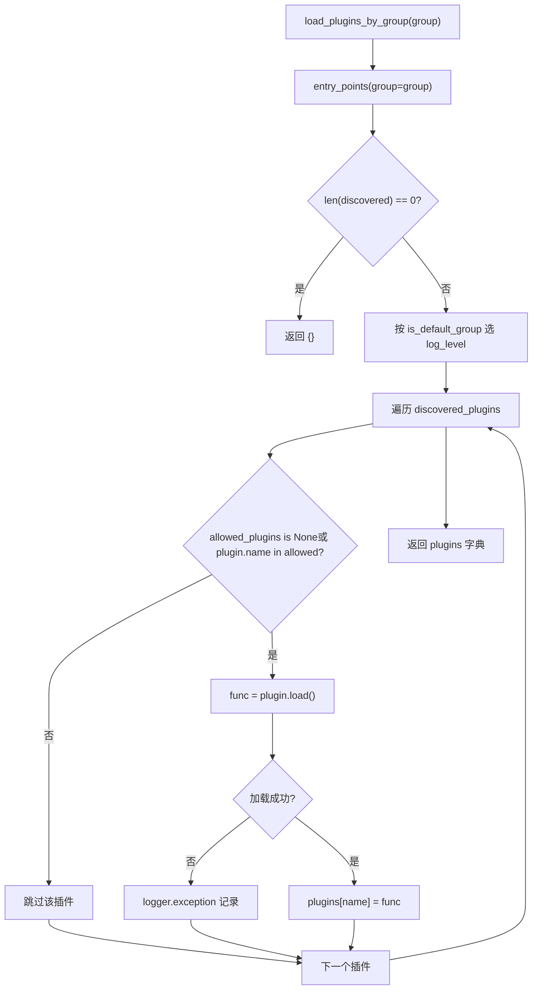
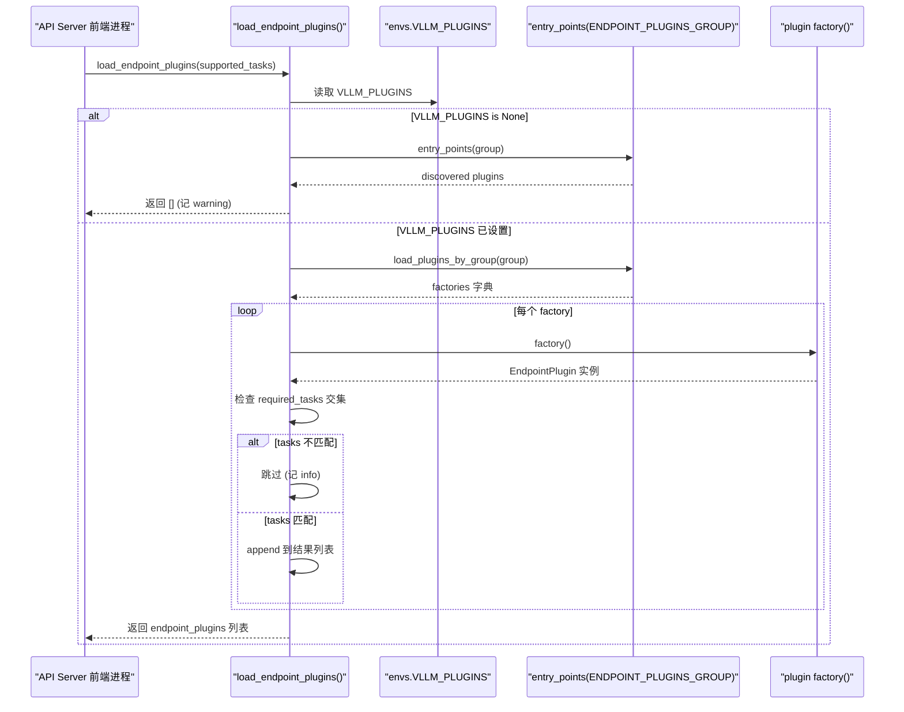

# 제 13 장: 플러그인 시스템과 확장성: 플랫폼, IO 프로세서, 엔드포인트 확장

이전 장에서 우리는 접두사 캐싱, 투기적 디코딩, LoRA 같은 고급 기능들이 스케줄러, KV 관리, 모델 실행의 핵심 경로에 깊이 결합되어 있음을 보았다. 그러나 추론 엔진이 실제로 프로덕션에 나아가려면 성능만으로는 충분하지 않다. 더 까다로운 질문에 답해야 한다: 커뮤니티가 새로운 하드웨어, 새로운 멀티모달 입력 형식, 또는 사용자 정의 HTTP 라우트를 연결하려 할 때, 핵심 코드를 fork하지 않고 어떻게 완료할 수 있는가? 이것이 바로 플러그인 시스템이 존재하는 이유이다. vLLM의 아키텍처는 본질적으로 다중 프로세스이다: API Server 프론트엔드 프로세스, EngineCore 프로세스, 그리고 각 TP/PP rank에 대응하는 Worker 프로세스. 만약 플러그인 메커니즘이 단순히 "import 시 코드 한 조각을 실행"하는 것이라면, 그것은 각 프로세스에서 반복 실행되어 부작용이 누적되거나, 메인 프로세스에서만 실행되어 Worker가 확장을 받지 못하게 된다. 이 장에서 분석할 것은 vLLM이 Python 표준 entry_points 메커니즘을 사용하여 그룹(group) + 프로세스 경계 + 로딩 시점이라는 삼중 제약과 함께, 모든 프로세스를 커버하면서도 노출 면을 정밀하게 제어할 수 있는 플러그인 체계를 어떻게 구축했는가이다. 우리는 세 가지 주선에 집중한다: 플랫폼 플러그인(새 하드웨어 적응), IO processor 플러그인(멀티모달 입력 처리 개입), 엔드포인트 플러그인(사용자 정의 API 라우트 주입). 세 가지의 로딩 전략은 완전히 다르며, 이러한 차이를 이해하면 vLLM의 "확장 능력"과 "안전 경계"에 대한 균형 철학을 이해하게 된다.

# 1. 플러그인 발견과 로딩: entry_points의 그룹 계약

## 직관적 모델: 플러그인의 "방송 채널"

vLLM의 플러그인 시스템을 일련의 방송 채널이라고 상상해 보자. 각 플러그인 패키지는 설치 시`setup.py`의`entry_points`을 통해 특정 채널에 자신의 호출 부호(plugin name)와 응답 함수(plugin value)를 "등록"한다. vLLM은 시작 시 이러한 채널을 스캔하여 어떤 채널이 어떤 프로세스에서 "청취"될지 결정한다.

이 메커니즘이 없다면 vLLM 확장은 소스 코드 수정에만 의존해야 합니다——커뮤니티가 하드웨어를 하나 추가할 때마다 fork를 유지보수해야 하고, 결국 버전이 분열됩니다. 그룹 메커니즘의 가치는 다음과 같습니다:**동일한 플러그인 패키지가 특정 채널에만 등록되어 특정 프로세스에서만 로드되도록 제한할 수 있습니다**。

## 데이터 구조: 다섯 개의 그룹 상수와 전역 플래그

vLLM은`vllm/plugins/__init__.py`상단에 다섯 개의 entry point group 상수를 정의하며, 각 상수는 하나의 로딩 전략에 대응합니다:

[FACT:vllm/plugins/__init__.py:16-30]

```python
DEFAULT_PLUGINS_GROUP = "vllm.general_plugins"
IO_PROCESSOR_PLUGINS_GROUP = "vllm.io_processor_plugins"
PLATFORM_PLUGINS_GROUP = "vllm.platform_plugins"
STAT_LOGGER_PLUGINS_GROUP = "vllm.stat_logger_plugins"
ENDPOINT_PLUGINS_GROUP = "vllm.endpoint_plugins"
```

주석에 핵심 정보가 숨어 있습니다:`DEFAULT_PLUGINS_GROUP`에서**모든 프로세스**로드(process0, engine core, worker);`IO_PROCESSOR_PLUGINS_GROUP` **process0에서만**；`PLATFORM_PLUGINS_GROUP`모든 프로세스에서 로드되지만 트리거 시점은`current_platform`최초 접근 시;`STAT_LOGGER_PLUGINS_GROUP`process0에서만 그리고 비동기 모드에서만;`ENDPOINT_PLUGINS_GROUP`API Server 프론트엔드 프로세스에서만.

바로 뒤에는 모듈 수준 전역 변수`plugins_loaded = False` [FACT:vllm/plugins/__init__.py:32-33]가 있으며, 이것은 멱등 로딩의 가드입니다——주석에 명확히 "make sure one process only loads plugins once"라고 적혀 있습니다.

## Step-by-Step: 한 번의`load_plugins_by_group`전체 호출 흐름

시나리오: 사용자가`setup.py`에`vllm.general_plugins`아래의`register_dummy_model`를 등록했고, 이제 vLLM이 시작되어 어떤 프로세스가`load_general_plugins()`。

**를 호출합니다** `load_general_plugins`첫 번째 단계: 멱등 가드.`plugins_loaded`먼저`True`를 확인하고, 이미[FACT:vllm/plugins/__init__.py:77-90]이면 바로**를 반환합니다. 여기에는 미묘한 점이 있습니다: 가드가 로딩**이전

**에 설정되므로, 이후 로딩에서 예외가 발생해도 재시도하지 않습니다. 이는 의도된 것입니다——플러그인 로딩 실패가 프로세스의 반복 시도를 유발해서는 안 됩니다.**두 번째 단계: 발견.`load_plugins_by_group`가`importlib.metadata.entry_points(group=group)`에 진입하여[FACT:vllm/plugins/__init__.py:36-45]를 통해 해당 그룹 아래에 설치된 모든 entry points

**를 가져옵니다. 비어 있으면 debug 로그를 기록한 후 빈 딕셔너리를 반환합니다.**세 번째 단계: 로그 레벨 분류.`is_default_group`소스 코드는 기본 그룹과 비기본 그룹의 로그 레벨을 구분합니다:`logger.debug`가 참이면`logger.info` [FACT:vllm/plugins/__init__.py:47-54]를 사용하고, 그렇지 않으면`vllm.general_plugins`를 사용합니다. 동기는 매우 실용적입니다——

**아래에는 보통 대량의 모델 등록 플러그인이 있어 INFO를 사용하면 화면이 도배됩니다; 반면 플랫폼/엔드포인트 플러그인은 수가 적고 중요하므로 INFO로 보일 가치가 있습니다.**네 번째 단계: 화이트리스트 필터링.`envs.VLLM_PLUGINS`가`None`를 읽고,[FACT:vllm/plugins/__init__.py:62-70]이면 전부 로드하고, 그렇지 않으면 이름이 목록에 있는 플러그인만 로드합니다`plugin.load()`.[FACT:vllm/plugins/__init__.py:68-72]。

**가 try/except로 감싸져 있어 단일 플러그인 로딩 실패는 exception 로그만 기록하고 다른 플러그인에 영향을 주지 않습니다**다섯 번째 단계: 실행.`load_general_plugins`가`func()` [FACT:vllm/plugins/__init__.py:77-90]로 돌아가서, 로드된 각 함수에 대해 직접**를 호출합니다. 이것이 문서에서 플러그인 함수가 반드시**재진입 가능(re-entrant)

해야 한다고 강조하는 이유입니다——여러 프로세스에서 여러 번 호출될 수 있습니다.`load_plugins_by_group`아래 흐름도는



## 복사

> **[Design Inference & Architectural Trade-offs]**
> 〔설계 추론과 아키텍처 트레이드오프〕`entry_points`사용자 정의 설정 파일이 아니라**를 선택한 핵심 동기는**플러그인이 Python 패키지와 함께 배포되도록 하기 위함`pip install vllm-add-dummy-platform`입니다. 사용자가

---

# 하면 플러그인이 자동으로 해당 그룹에 나타나며, vLLM 설정을 수동으로 편집할 필요가 없습니다. 이는 pytest, flake8 등의 도구 플러그인 생태계와 맥을 같이합니다. 대가는 플러그인 발견이 패키지 메타데이터에 의존한다는 점이며, 플러그인 패키지가 불완전하게 설치되면(예: pip를 거치지 않고 소스 디렉터리만 복사한 경우) entry_points를 스캔할 수 없습니다.

## 2. 플랫폼 플러그인: 하드웨어 적응의 추상화 계층

`Platform`직관적 모델: 플랫폼은 "하드웨어 방언 번역가"**클래스는 전체 vLLM이 하드웨어와 대화하는**유일한 번역가`current_platform.get_attn_backend_cls()`、`current_platform.is_cuda_alike()`입니다. 모델 코드는`import torch.cuda`같은 추상 메서드만 호출하고, 결코 직접`if device == "xpu"`하지 않습니다. 이 추상화 계층이 없다면 새로운 하드웨어를 지원할 때마다 모델 코드에

## 분기를 추가해야 하고, 결국 스파게티가 됩니다.

`Platform`데이터 구조: Platform 기반 클래스의 필드 레이아웃`vllm/platforms/interface.py`는 순수 클래스(인스턴스화하여 사용하지 않음)이며, 주요 클래스 속성은[FACT:vllm/platforms/interface.py:135-179]：

```python
class Platform:
    _enum: PlatformEnum
    device_name: str
    device_type: str
    dispatch_key: str = "CPU"
    ray_device_key: str = ""
    device_control_env_var: str = "VLLM_DEVICE_CONTROL_ENV_VAR_PLACEHOLDER"
    ray_noset_device_env_vars: list[str] = []
    simple_compile_backend: str = "inductor"
    dist_backend: str = ""
    supported_quantization: list[str] = []
    additional_env_vars: list[str] = []
    _global_graph_pool: Any | None = None
```

`_enum`복사`PlatformEnum`는`is_cuda()`、`is_rocm()`열거형 값으로,[FACT:vllm/platforms/interface.py:69-78]。`device_control_env_var`등의 판정을 결정합니다`CUDA_VISIBLE_DEVICES`는 플랫폼 독립적인 "장치 가시성 환경 변수" 추상화입니다——CUDA는[FACT:vllm/platforms/interface.py:151-152]。`_global_graph_pool`이고, 다른 플랫폼은 각자 정의합니다`get_global_graph_pool`는 클래스 수준의 CUDA graph 메모리 풀 캐시로,[FACT:vllm/platforms/interface.py:1210-1215]。

를 통해 지연 초기화됩니다`__getattr__`주목할 점은[FACT:vllm/platforms/interface.py:1189-1208]의 폴백 로직`torch.<device_type>`입니다: Platform에 존재하지 않는 속성에 접근하면`current_platform.memory_allocated()`네임스페이스에서 전달을 시도합니다. 이를 통해 플랫폼 코드는`torch.cuda.memory_allocated()`라고 작성하고 실제로는`__getstate__`를 호출할 수 있습니다. 하지만 소스 코드는 의도적으로 dunder 메서드를 제외합니다——그렇지 않으면 pickle 검사 시`None`가[FACT:vllm/platforms/interface.py:1182-1185]。

## 를 가져와 호출하려고 시도할 것입니다

Step-by-Step: 장치 ID의 삼중 네임스페이스 변환**플랫폼 추상화에서 가장 함정에 빠지기 쉬운 것은**장치 ID 네임스페이스[FACT:vllm/platforms/interface.py:275-283]：

- **logical**입니다. 소스 코드 주석은 세 가지`_assigned_physical_gpu_ids`
- **visible**를 명확히 나열합니다: vLLM 내부의 local rank,`CUDA_VISIBLE_DEVICES`를 인덱싱: 현재 프로세스가
- **physical**로 재매핑된 후의 torch/CUDA 번호

: NVML 등 토폴로지 API가 사용하는 전역 GPU ID로, 환경 변수의 영향을 받지 않습니다`[4, 5]`시나리오: 하나의 Worker 프로세스에 물리 GPU`CUDA_VISIBLE_DEVICES=4,5`가 할당되고, 환경 변수`torch.device("cuda:0")`。

**이며, 이제 local rank 0을** `device_id_to_physical_device_id(0)`로 변환해야 합니다`_assigned_physical_gpu_ids`첫 번째 단계: logical → physical.`4` [FACT:vllm/platforms/interface.py:296-297]먼저`device_control_env_var`를 조회하고, 이미 설정되어 있으면 바로 인덱싱하여[FACT:vllm/platforms/interface.py:305-311]를 반환합니다. 설정되지 않았으면**에서 쉼표 목록을 분리하여 0번째 항목**을 가져옵니다. 소스 코드는 의도적으로[FACT:vllm/platforms/interface.py:296-297]。

**2단계: physical → visible.** `logical_device_id_to_visible_device_id(0)`physical`4`을(를) 가져온 후, 환경 변수를 분해하여`[4, 5]`를 찾고,`4`의 인덱스`0`를 반환합니다[FACT:vllm/platforms/interface.py:316-339]. 만약 physical ID가 가시 목록에 없으면`RuntimeError`을(를) 던집니다 — 이는 프로세스 간에 보이지 않는 디바이스를 잘못 사용하는 것을 방지하기 위한 강력한 보호 장치입니다.

`set_assigned_physical_gpu_ids`의 멱등 설계도 주목할 만합니다: 동일한 값을 반복 설정하면 무작동이고, 다른 값을 설정하면`RuntimeError` [FACT:vllm/platforms/interface.py:38-56]을(를) 던집니다. 이는 멀티스레드 환경에서 디바이스 매핑이 의도치 않게 덮어쓰이는 것을 방지합니다.

## 플랫폼 플러그인의 등록 및 구성 주입

플랫폼 플러그인은`vllm.platform_plugins`그룹으로 등록되며, 플러그인 함수는 플랫폼 클래스의 정규화된 이름(또는`None`는 현재 환경에서 지원되지 않음을 나타냄)을 반환합니다[FACT:docs/design/plugin_system.md:50-50]. 문서에서 제시하는 최소 구현 요구 사항은[FACT:docs/design/plugin_system.md:100-100]：

- `_enum`보통`PlatformEnum.OOT`（out-of-tree）
- `device_type`로 설정되어 PyTorch가 인식하는 디바이스 유형 문자열을 반환합니다
- `check_and_update_config`는 vLLM 초기화 초기에 호출되며,**반드시 여기에서 설정해야 합니다`worker_cls`**
- `get_attn_backend_cls`는 어텐션 백엔드 클래스 이름을 반환합니다
- `get_device_communicator_cls`는 통신기 클래스 이름을 반환합니다

`check_and_update_config`는 플랫폼 플러그인의 가장 핵심적인 훅입니다[FACT:vllm/platforms/interface.py:583-592]. 이는`VllmConfig`참조를 받아 제자리에서 수정하며, block size, graph mode 등을 조정할 수 있습니다. 문서에서는 "가장 중요한 것은 worker_cls를 여기에서 반드시 설정해야 한다"고 강조합니다[FACT:docs/design/plugin_system.md:105-105]— vLLM이 작업 프로세스를 인스턴스화할 때 어떤 Worker 클래스를 사용할지 알아야 하기 때문입니다.

## 설계 고찰: block size 정렬의 3단계 전략

플랫폼 인터페이스에서 가장 복잡한 로직은`update_block_size_for_backend` [FACT:vllm/platforms/interface.py:666-708]입니다. 이는 세 단계로 나누어 block size가 어텐션 백엔드와 호환되도록 보장합니다:

**Phase 1**: 사용자가 명시적으로`--block-size`를 지정하지 않은 경우,`_preferred_block_size_for_backends`를 호출하여 모든 백엔드가 지원하는 최소 block size를 선택합니다[FACT:vllm/platforms/interface.py:687-697]. 이 함수는 LCM(최소공배수)으로 후보 값을 열거하는데, 일부 백엔드(예: CPU_MLA)는 배수가 아닌 정확한 크기만 허용하기 때문입니다[FACT:vllm/platforms/interface.py:622-663]。

**Phase 2**: 하이브리드 모델(attention + mamba)은 block과 mamba page size를 정렬해야 합니다[FACT:vllm/platforms/interface.py:699-702]。

**Phase 3**: 여러 KV dtype이 block pool을 공유할 때(예: nvfp4 메인 + 비양자화 skip 레이어), 메인 block을 가장 큰 padded spec page를 커버할 수 있을 만큼 확장해야 합니다[FACT:vllm/platforms/interface.py:704-708]。

> **[Design Inference & Architectural Trade-offs]**
> 이러한 단계적 설계는 vLLM이 직면한 현실을 반영합니다: 서로 다른 하드웨어, 서로 다른 양자화 방식, 서로 다른 모델 아키텍처가 block size에 대해 서로 충돌하는 제약을 가지므로 단일 공식으로 해결할 수 없습니다. 단계적으로 나누면 각 제약을 독립적으로 처리하고, 최종적으로 모든 제약을 만족하는 해를 취합니다.

---

# 3. IO Processor와 엔드포인트 플러그인: 입력 처리 및 API 확장

## 직관적 모델: IO Processor는 "멀티모달 번역 계층"

멀티모달 모델(예: LLaVA)의 입력은 순수 텍스트가 아니라 텍스트 + 이미지의 혼합체입니다. IO Processor 플러그인은 원시 멀티모달 데이터를 모델이 소화할 수 있는 텐서로 변환하고, 모델 출력을 다시 사람이 읽을 수 있는 형식으로 변환합니다. 이는 세관의 통역사와 같습니다: 들어오는 외국어(이미지/오디오)를 모델의 모국어로 번역하고, 나가는 모델의 모국어를 다시 외국어로 번역합니다.

## 단계별: IO Processor의 발견 및 인스턴스화

시나리오 대입:`io_processor_plugin`필드를 가진 HF config의 모델을 로드합니다.

**1단계: 플러그인 이름 결정.** `get_io_processor`우선 명시적으로 전달된`plugin_from_init`를 사용하고, 그렇지 않으면`hf_config`의`io_processor_plugin`필드에서[FACT:vllm/plugins/io_processors/__init__.py:42-50]를 읽습니다. 둘 다 비어 있으면`None`를 반환합니다 — 해당 모델에 IO processor가 필요하지 않음을 나타냅니다[FACT:vllm/plugins/io_processors/__init__.py:52-54]。

**2단계: 설치된 모든 플러그인 로드.**를 호출하여`load_plugins_by_group(IO_PROCESSOR_PLUGINS_GROUP)`해당 그룹 아래의 모든 플러그인을 가져옵니다[FACT:vllm/plugins/io_processors/__init__.py:59-61]。

**3단계: 로드 가능 매핑 구성.**각 플러그인을 순회하며 함수를 호출하여`processor_cls_qualname`를 가져오고,`None`가 아니면`loadable_plugins` [FACT:vllm/plugins/io_processors/__init__.py:66-76]에 기록합니다. 여기서 각 플러그인의 함수 호출도 try/except로 감싸져 있어 단일 실패가 다른 것에 영향을 주지 않습니다.

**4단계: 검증 및 인스턴스화.**로드 가능한 플러그인 수가 0이면`ValueError`를 던져 "IOProcessor 플러그인이 필요하지만 하나도 설치되지 않았습니다"를 알립니다[FACT:vllm/plugins/io_processors/__init__.py:66-76]. 모델이 요구하는 플러그인 이름이 로드 가능 목록에 없으면`ValueError`를 던지고 사용 가능한 모든 플러그인 이름을 나열합니다[FACT:vllm/plugins/io_processors/__init__.py:80-81]. 마지막으로`resolve_obj_by_qualname`를 통해 클래스 이름을 해석하고 인스턴스화합니다[FACT:vllm/plugins/io_processors/__init__.py:80-81]。

## 엔드포인트 플러그인: 기본 거부의 보안 태세

엔드포인트 플러그인은 이 장에서 가장 특별한 유형인데, 그것이**기본적으로 로드되지 않기**。`load_endpoint_plugins`때문입니다. 문서 문자열은 그 이유를 명확히 설명합니다: 엔드포인트 플러그인은 API Server에 HTTP 라우트를 추가하여 네트워크 노출 면을 확대하므로,`load_plugins_by_group`보다 더 엄격한 "기본 거부" 태세를 취합니다[FACT:vllm/plugins/__init__.py:93-94]。

구체적 규칙은: 플러그인 이름이**에 명시적으로 나타나고`VLLM_PLUGINS`,**그`required_tasks`가`None`이거나 서버가 지원하는 tasks와 교집합이 있을 때만 로드됩니다[FACT:vllm/plugins/__init__.py:108-108]。

시나리오 대입: 사용자가 엔드포인트 플러그인을 설치했지만`VLLM_PLUGINS`。

**설정을 잊었습니다**1단계: VLLM_PLUGINS가 설정되지 않았는지 확인.`envs.VLLM_PLUGINS is None`만약[FACT:vllm/plugins/__init__.py:126-126]이면, 먼저 해당 그룹 아래의 플러그인을 발견하고, 있으면 warning을 기록하여 "명시적 allowlist가 필요합니다"를 알립니다`VLLM_PLUGINS=""`. 소스 주석에서 특히 지적하기를:`[""]`는`None`가 아니라[FACT:vllm/plugins/__init__.py:108-108]로 해석되므로, "어떤 플러그인과도 매칭되지 않는 allowlist"로 간주되지 "미설정"이 아닙니다`None`. 이 경계 구분은 중요합니다 — 빈 문자열은 명시적인 "아무것도 로드하지 않음"이고,

**는 "미구성"입니다.**2단계: 로드 및 인스턴스화.`load_plugins_by_group`를 통해`factory()`팩토리 함수를 가져온 후, 하나씩 호출하여[FACT:vllm/plugins/__init__.py:133-141]를 인스턴스화합니다

**. 인스턴스화 실패는 exception을 기록하고 continue합니다.**3단계: task 게이팅.`plugin.required_tasks`를 확인하여`None`가 아니고`supported_tasks`교집합이 없으므로 해당 플러그인을 건너뜁니다[FACT:vllm/plugins/__init__.py:144-145]. 이를 통해 동일한 플러그인 패키지가 서로 다른 작업(예: embedding vs generation)에 대해 서로 다른 엔드포인트를 등록할 수 있습니다.

아래 시퀀스 다이어그램은 엔드포인트 플러그인의 발견부터 로딩까지의 전체 상호작용을 묘사합니다:



## 설계 고찰: 프로세스 경계가 로딩 전략을 결정한다

세 가지 플러그인 유형의 로딩 전략 차이는 본질적으로**프로세스 경계**의 매핑입니다:

| 플러그인 유형 | 로딩 프로세스 | 기본 동작 | 동기 |
| --- | --- | --- | --- |
| general | 모든 프로세스 | 전부 로드 | 모델 등록은 모든 Worker에서 가시적이어야 함 |
| platform | 모든 프로세스 | 전부 로드 | 하드웨어 추상화는 모든 프로세스에 의존됨 |
| io_processor | process0만 | 전부 로드 | 입력 처리는 프론트엔드에서만 발생 |
| stat_logger | process0만 (비동기) | 전부 로드 | 로그는 메인 프로세스에서만 수집 |
| endpoint | API Server만 | **기본 거부** | 네트워크 노출 면적을 확대하므로 명시적 권한 부여 필요 |

> **[Design Inference & Architectural Trade-offs]**
> 엔드포인트 플러그인의 "기본 거부"는 보안 엔지니어링의 표준 관행입니다: 공격 면적을 확대하는 모든 확장은 opt-in이어야 합니다. 반면 다른 플러그인은 기본 로드되는데, 이는 네트워크 인터페이스를 직접 노출하지 않으며 커뮤니티 생태계가 저마찰 접근 경험을 필요로 하기 때문입니다.

## 프로덕션 함정: 플러그인 로딩 실패의 조용한 성능 저하

`load_plugins_by_group`각 플러그인의`plugin.load()`을 try/except로 감싸고, 실패 시 exception만 기록합니다[FACT:vllm/plugins/__init__.py:68-72]. 이는 다음을 의미합니다:**손상된 플러그인이 vLLM 시작을 막지 않지만**, 명시적 오류도 제공하지 않습니다——사용자는 "왜 내 플러그인이 작동하지 않는가"에 혼란스러울 수 있습니다.

문제 해결 제안: 로그 레벨을 DEBUG로 조정하고`"Failed to load plugin"`을 검색하세요. 플러그인이`vllm.general_plugins`그룹 아래에 있다면 기본 로그 레벨은 DEBUG이므로, 로딩 세부 정보를 보려면 명시적으로 활성화해야 합니다[FACT:vllm/plugins/__init__.py:49-50]。

또 다른 함정은`plugins_loaded`가드의 설정 시점입니다[FACT:vllm/plugins/__init__.py:77-90]: 로딩 전에 이미 설정됩니다`True`. 첫 로딩이 어떤 이유로 실패하면(예: entry_points 스캔 예외), 이후 호출은 재시도 없이 바로 반환됩니다. 이는 테스트 환경에서 "플러그인이 될 때도 있고 안 될 때도 있는" 기이한 현상을 초래할 수 있습니다.

---

# 이 장의 요약

vLLM의 플러그인 시스템은 Python`entry_points`을 기반으로 하며,**다섯 개의 그룹 상수**로 확장 유형을 구분하고,**프로세스 경계**로 로딩 범위를 결정하며,**`VLLM_PLUGINS`화이트리스트**로 로딩 집합을 제어합니다. 플랫폼 플러그인은`Platform`기본 클래스로 하드웨어 차이를 추상화하며, 그 디바이스 ID 삼중 네임스페이스 변환(logical/visible/physical)은 크로스 프로세스 디바이스 관리의 핵심입니다; IO processor 플러그인은 HF config의`io_processor_plugin`필드로 트리거되어 멀티모달 입력 번역을 담당합니다; 엔드포인트 플러그인은 "기본 거부" 자세를 취하며, 명시적 allowlist가 있고 task가 일치할 때만 로드되어 네트워크 노출 면적을 제어합니다.

세 가지 주류는 동일한 발견 메커니즘을 공유하지만, 로딩 전략의 차이는 vLLM이 "확장 편의성"과 "보안 경계" 사이에서 균형을 잡는 것을 보여줍니다: 네트워크를 노출하지 않는 플러그인은 기본 로드되고, 네트워크를 노출하는 플러그인은 반드시 opt-in이어야 합니다.

# 이 장의 사고와 자가 점검

Q1: 만약`load_plugins_by_group`에서`plugin.load()`의 try/except를 제거하여 로딩 실패가 직접 예외를 발생시키면, vLLM의 멀티프로세스 시작에 어떤 영향을 미칠까요? 어떤 시나리오에서는 이것이 오히려 더 나은 설계일까요?

> **[Design Inference & Architectural Trade-offs]**
> **참고 해석**: 현재 구현은[FACT:vllm/plugins/__init__.py:68-72]단일 플러그인 로딩 실패를 조용히 삼키고 exception 로그만 기록합니다. try/except를 제거하면 로딩 실패가`load_general_plugins`로 전파되어 프로세스 시작이 중단됩니다. 멀티프로세스 시나리오에서는 다음과 같은 결과가 발생합니다: 특정 Worker 프로세스의 플러그인 로딩이 실패하면 전체 엔진이 시작될 수 없습니다——이는 좋을 수도 있고(빠른 실패, 일부 프로세스가 문제를 안고 실행되어 상태 불일치를 초래하는 것을 방지), 나쁠 수도 있습니다(선택적 플러그인의 버그가 전체 서비스를 마비시킴). 더 나은 설계는`VLLM_PLUGINS_STRICT`환경 변수를 도입하는 것입니다: 기본은 관대(현재 동작), 엄격 모드에서는 로딩 실패 시 예외를 발생시킵니다. 이렇게 하면 프로덕션 환경에서는 "선언된 모든 플러그인이 성공적으로 로드되어야 함"을 요구할 수 있고, 개발 환경에서는 내결함성을 유지할 수 있습니다.

Q2: `load_endpoint_plugins`에서,`VLLM_PLUGINS=""`과`VLLM_PLUGINS`이 설정되지 않은(`None`) 경우의 동작 차이는 무엇인가요? 소스 코드가 왜 이 두 가지 경우를特意 구분하는 걸까요?

> **[Design Inference & Architectural Trade-offs]**
> **참고 해석**: 소스 코드 주석은`VLLM_PLUGINS=""`이`[""]`이 아닌`None`으로 해석되므로, "어떤 플러그인과도 매칭되지 않는 allowlist"[FACT:vllm/plugins/__init__.py:108-108]로 간주된다고 명확히 밝힙니다.`VLLM_PLUGINS is None`일 때,`load_endpoint_plugins`은 바로`[]`을 반환하고 warning을 기록합니다[FACT:vllm/plugins/__init__.py:126-126]; 반면`VLLM_PLUGINS=""`일 때, 코드는 계속`load_plugins_by_group`로 진행되지만, 빈 문자열이 어떤 플러그인 이름과도 매칭되지 않으므로 최종적으로도 빈 리스트를 반환합니다. 둘의**결과는 동일하지만**(둘 다 엔드포인트 플러그인을 로드하지 않음),**의미는 다릅니다**：`None`는 "사용자가 구성하지 않았으므로 우리가 주도적으로 거부하고 경고함"을,`""`는 "사용자가 명시적으로 빈 allowlist를 구성했으므로 우리가 그 의도를 존중하여 경고하지 않음"을 나타냅니다. 이러한 구분을 통해 운영자는 빈 문자열을 설정하여 "모든 엔드포인트 플러그인을 조용히 비활성화"할 수 있으며, 매번 시작 시 발생하는 warning 소음을 감수할 필요가 없습니다.

Q3: `device_id_to_physical_device_id`에서, 소스 코드가 왜 빈`device_control_env_var`을 설정되지 않은 것으로 처리하는가[FACT:vllm/platforms/interface.py:302-308]? 이 빈 문자열 검사를 제거하면 Ray의 CPU-only placement group 시나리오에서 무슨 일이 발생할까요?

**참고 해석**: 소스 코드 주석은 빈 환경 변수가 Ray가 GPU 노드에서 CPU-only placement group을 시작할 때의 합법적인 구성이라고 설명합니다[FACT:vllm/platforms/interface.py:296-297]. 만약`!= ""`검사를 제거하면, 코드는`device_ids = "".split(",")`분기로 진입하여`[""]`을 얻고, 그런 다음`device_ids[device_id]`이 빈 문자열을 반환하며, 최종적으로`int("")`이 예외를 발생시킵니다`ValueError`. 이로 인해 엔진이 합법적인 Ray 구성에서 시작 실패할 수 있다. 검사를 유지하면 빈 환경 변수는`else`분기로 직접 반환되어`device_id`을 반환한다. 즉, logical ID가 physical ID와 같다고 가정하는데, 이는 CPU-only 시나리오에서는 GPU 매핑이 필요 없기 때문에 안전하다. 이 사례는 환경 변수의 "미설정"과 "빈 값 설정"이 분산 오케스트레이션 시스템에서 의미가 다르며, 코드가 이를 명시적으로 처리해야 함을 보여준다.

---

다음 장에서는 아키텍처 트레이드오프, 프로덕션 함정, 미래 진화로 전환하여, 앞 13개 장에서 분해한 메커니즘을 함께 놓고 vLLM이 성능, 유지보수성, 확장성 사이에서 어떤 선택을 하는지 검토하고 추론 엔진의 진화 방향을 전망한다.

여기까지 우리는 vLLM이 entry_points의 그룹화 메커니즘, 프로세스 경계 인식 로딩 타이밍, 그리고 플랫폼, IO processor, 엔드포인트 세 가지 플러그인의 차별화 전략을 통해 핵심 코드를 안정적으로 유지하면서 확장 면을 열어가는 방식을 살펴보았다. 이 플러그인 체계는 새로운 하드웨어, 새로운 입력 형식, 새로운 API 라우팅을 비침습적으로 통합할 수 있게 하지만, 확장성 자체는 더 많은 트레이드오프 차원을 의미한다. 다음 장에서는全书를 마무리하며 vLLM의 핵심 설계 결정에서의 긴장 관계—연속 배치와 VRAM 단편화, CUDA Graph와 동적 형상, 분리형 배포와 네트워크 오버헤드—를 체계적으로 정리하고, 프로덕션 환경 함정 목록과 진단 경로를 제시하며, Rust 프론트엔드, IR 계층, 이기종 하드웨어 방향의 진화 트렌드를 전망한다.
