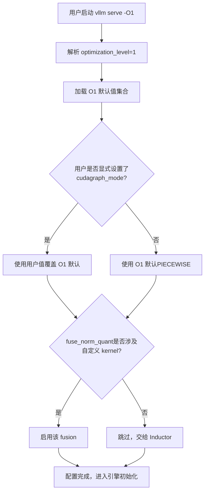
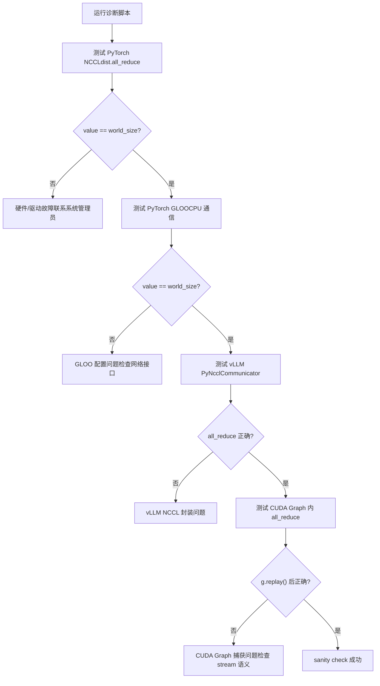
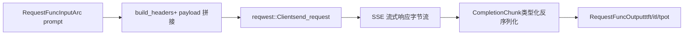

# 제 14 장: 아키텍처 트레이드오프, 프로덕션 함정, 미래 진화

이전 장에서 우리는 vLLM의 플러그인 확장 메커니즘을 분해하며, 플랫폼 플러그인, IO processor 플러그인, 엔드포인트 플러그인이 핵심 코드를 수정하지 않고도 엔진이 새로운 하드웨어, 새로운 모달리티, 새로운 API에 적응할 수 있게 하는 방식을 살펴보았다. 이러한 확장성은 vLLM이 변화를 빠르게 수용할 수 있게 하지만, 확장점이 많을수록 프로덕션 환경에서의 상호작용 경로는 더 복잡해진다. VRAM 단편화, NCCL 핸드셰이크 실패, 컴파일 캐시 무효화, 네트워크 지터 같은 실제 문제가 동시에 발생할 때, 앞 13개 장에서 소개한 메커니즘들은 서로 당기며 이상적인 환경에서는 드러나지 않던 긴장을 노출한다. 이 장에서는 새로운 핵심 메커니즘을 도입하지 않고, 이러한 메커니즘을 함께 놓고 공식 troubleshooting 문서를 앵커로 삼아 Rust 프론트엔드 bench 도구의 설계와 결합하여 성능과 운영 가능성 사이의 트레이드오프를 검토하고, 실행 가능한 진단 경로를 제시한다.

# 1. 최적화 등급: 시작 시간과 실행 성능의 명시적 계약

## 직관적 모델

최적화 등급은 카메라의 "장면 모드"와 같다: 자동 모드(`-O2`)는 대부분의 장면에 적합하지만, 빠른 스냅샷(디버깅)이 필요할 때 수동 모드(`-O0`)로 전환하면 즉시 응답할 수 있으며, 대가는 화질(성능) 저하다. vLLM은 이러한 트레이드오프를 수십 개의 불리언 flag에 숨겨 사용자가 직접 조합하게 하는 대신, 명시적인 네 단계 계약으로 만들었다.

## 네 단계의 필드 레이아웃

vLLM은`-O0`부터`-O3`까지 네 등급을 제공한다[FACT:docs/design/optimization_levels.md:5-5]. 핵심 설계 원칙은:**사용자가 명시적으로 설정한 flag가 최적화 등급의 기본값보다 우선한다** [FACT:docs/design/optimization_levels.md:5-5]. 이는 최적화 등급이 단지 기본값 집합일 뿐, 강제 제약이 아님을 의미한다.

`-O0`모든 것을 끈다: autotuning 없음, 컴파일 없음, cudagraph 없음[FACT:docs/design/optimization_levels.md:32-33]. 구체적으로 네 가지 스위치에 적용된다:`cudagraph_mode=NONE`、`mode=NONE`, 모든 fusion 비활성화,`enable_flashinfer_autotune=False` [FACT:docs/design/optimization_levels.md:37-40]。

`-O1`는 개발 시나리오의 균형점이다:`PIECEWISE`cudagraph와`VLLM_COMPILE`모드 활성화[FACT:docs/design/optimization_levels.md:50-51]. 여기에는 정교한 세부 사항이 있다:`fuse_norm_quant`와`fuse_act_quant`는 둘 중 하나의 연산자만 사용자 정의 kernel을 사용할 때만 활성화되며, 그렇지 않으면 Inductor의 자동 fusion 효과가 더 좋다[FACT:docs/design/optimization_levels.md:61]. 이는 전형적인 "컴파일러와 일을 다투지 말라"는 설계 판단이다.

`-O2`는 기본값이며 프로덕션을 지향한다[FACT:docs/design/optimization_levels.md:66-67]. 이는`-O1`기반에`FULL_AND_PIECEWISE`cudagraph와`fuse_allreduce_rms` [FACT:docs/design/optimization_levels.md:72-73]。`-O3`를 추가한다`-O2`현재는[FACT:docs/design/optimization_levels.md:80-81]。

## 와 동일하며, 미래의 더 공격적인 실험적 최적화를 위해

시나리오 기반 선택 흐름`vllm serve model -O1`사용자가

복사`check_user`이 흐름의 핵심은[FACT:docs/design/optimization_levels.md:5-5]분기이다: 사용자 명시적 설정이 항상 우선한다

## . 이는 "최적화 등급이 내 디버깅 flag를 조용히 덮어썼다" 같은排查하기 어려운 문제를 방지한다.

설계 고찰과 함정**최적화 등급의 가장 흔한 프로덕션 함정은**시작 시간 과다`-O0`이다. 문서는 명확히 권장한다: 시작 시간이 너무 길면`-O1` [FACT:docs/design/optimization_levels.md:87]또는`-O0`를 사용하라. 하지만 여기에는 숨은 대가가 있다—

에는 cudagraph가 없어 각 kernel의 CPU 발사 오버헤드가 드러나며, 고동시성 시나리오에서 처리량이 수 배 감소할 수 있다.**또 다른 함정은**。`-O2`컴파일 오류`FULL_AND_PIECEWISE`이다.`-O2`의`-O1`cudagraph는 모델 구조에 더 강한 가정을 하며, 일부 사용자 정의 모델은`debug_dump_path`에서 컴파일 실패하지만[FACT:docs/design/optimization_levels.md:88]에서는 정상이다. 문서는`-O0`를 사용하여 더 많은 디버깅 정보를 얻으라고 권장한다`-O1`、`-O2`.排查 경로는 다음과 같아야 한다: 먼저

> **[Design Inference & Architectural Trade-offs]**
> 로 올리며 어느 등급에서 문제가 도입되었는지 찾는다.`--enforce-eager`동일한 방법론입니다: 가장 보수적인 설정으로 정확성을 확인한 후, 점진적으로 최적화를 활성화하여 문제를 최소한의 설정 차이로 격리합니다.

---

# 2. 프로덕션 함정 체크리스트: 증상에서 근본 원인까지의 진단 경로

## 직관적 모델

프로덕션 환경의 장애 대응은 응급 분류와 같습니다: 모든 환자에게 전체 검사를 할 수 없으므로, 먼저 증상(OOM, hang, 크래시)에 따라 범위를 빠르게 좁힌 후, 표적을 정해 깊이 파고들어야 합니다. vLLM의 troubleshooting 문서는 본질적으로 분류 매뉴얼입니다.

## 증상 분류와 진단 도구

문서는 일반적인 문제를 몇 가지 큰 범주로 나누는데, 진단 난이도가 높아지는 순서로 정리하겠습니다.

**첫 번째 범주: 모델 다운로드/로딩 멈춤.**증상은 시작 후 장시간 응답이 없는 것입니다. 근본 원인은 보통 네트워크가 느리거나 공유 파일 시스템이 느린 것입니다[FACT:docs/usage/troubleshooting.md:11-11]. 진단 수단은`--load-format dummy`가중치 로딩을 건너뛰어 다운로드가 느린지 로딩이 느린지를 격리하는 것입니다[FACT:docs/usage/troubleshooting.md:23-23]. 이는 전형적인 "이분법적 격리" 기법입니다.

**두 번째 범주: VRAM OOM.**문서는 곧바로 conserving_memory 설정 문서를 가리킵니다[FACT:docs/usage/troubleshooting.md:23]. 하지만 프로덕션에서의 OOM은 모델이 너무 커서가 아니라 KV cache 단편화나 예상보다 많은 동시 요청 수 때문인 경우가 많습니다.

**세 번째 범주: 생성 품질 변화.**이는 간과하기 쉬운 함정입니다. v0.8.0은 기본 샘플링 파라미터의 출처를 변경했습니다: vLLM의 중립적 기본값에서 모델 작성자의`generation_config.json` [FACT:docs/usage/troubleshooting.md:23-23]로 바뀌었습니다. 대부분의 경우 품질이 향상되지만, 일부 모델에서는 설정이 오히려 더 나빠집니다[FACT:docs/usage/troubleshooting.md:23-23]. 진단 방법은`--generation-config vllm`로 되돌려 비교하는 것입니다[FACT:docs/usage/troubleshooting.md:23-23]。

**네 번째 범주: 멈춤(hang).**이것이 가장 진단하기 어려운 범주입니다. 문서는 점진적인 디버깅 환경 변수 세트를 제시합니다[FACT:docs/usage/troubleshooting.md:41-41]：

- `VLLM_LOGGING_LEVEL=DEBUG`: 상세 로그 활성화
- `VLLM_LOG_STATS_INTERVAL=1.`: 고빈도 출력 큐와 캐시 히트 상태
- `CUDA_LAUNCH_BLOCKING=1`: 어떤 CUDA kernel에서 문제가 발생했는지 특정
- `NCCL_DEBUG=TRACE`: NCCL 상세 로그 활성화
- `VLLM_TRACE_FUNCTION=1`: 모든 함수 호출을 기록하지만 100배 이상 느려짐[FACT:docs/usage/troubleshooting.md:41]

여기에는 중요한 운영 규율이 있습니다: 디버깅 후 반드시 이 환경 변수들을 꺼야 하며, 또는 새 shell을 열어야 합니다. 그렇지 않으면 잔류한 디버깅 설정이 계속 시스템을 느리게 만듭니다[FACT:docs/usage/troubleshooting.md:11-11]。

## 브레이크포인트 디버깅의 프로세스 경계 함정

vLLM의 다중 프로세스 아키텍처는 일반적인`pdb`브레이크포인트를 무효화합니다——브레이크포인트가 자식 프로세스에서 실행되면`BdbQuit` [FACT:docs/usage/troubleshooting.md:45-54]를 던집니다. 두 가지 해결법:`forked-pdb` [FACT:docs/usage/troubleshooting.md:57-61]를 사용하거나,`VLLM_ENABLE_V1_MULTIPROCESSING=0`를 설정하여 스케줄러를 동일 프로세스에 유지하는 것입니다[FACT:docs/usage/troubleshooting.md:63-68]。

> **[Design Inference & Architectural Trade-offs]**
> 두 번째 방법은 편리하지만 실행 모델을 변경합니다——단일 프로세스 모드에서는 EngineCore와 API Server가 더 이상 큐를 통해 통신하지 않으므로 일부 동시성 버그가 재현되지 않을 수 있습니다. 따라서 논리 오류를 찾는 데는 적합하지만 동시성 문제를 재현하는 데는 적합하지 않습니다.

## 분산 통신의 진단

분산 배포에는 전용 진단 문서가 있습니다. 핵심 권장 사항은:**클러스터 생성 시 환경 변수를 설정하라**, 변수가 모든 노드로 전파되기 때문입니다; shell에서 설정하면 로컬 노드에만 영향을 미칩니다[FACT:docs/serving/distributed_troubleshooting.md:16-16]。

빈번한 문제는`No available node types can fulfill resource request`이며, 클러스터에 충분한 GPU가 있어도[FACT:docs/serving/distributed_troubleshooting.md:16-16]가 발생합니다. 근본 원인은 보통 노드에 여러 IP가 있는데 vLLM이 잘못된 것을 선택했기 때문입니다. 해결법은`VLLM_HOST_IP`로 명시적으로 지정하고,`ray status`로 검증하는 것입니다[FACT:docs/serving/distributed_troubleshooting.md:16-16]。

## NCCL 초기화 실패 진단 스크립트

문서는 통신 스택을 계층별로 검증하는 완전한 진단 스크립트를 제공합니다[FACT:docs/usage/troubleshooting.md:89-150]. 그 설계는 매우 계층적입니다:

이 스크립트의 정교함은 계층별 격리에 있습니다: 먼저 최하위 계층의 PyTorch NCCL을 검증하고, 다음으로 CPU 측 GLOO를 검증하고, 그 다음 vLLM 자체의 PyNcclCommunicator 래퍼를 검증하고, 마지막으로 CUDA Graph 내의 통신을 검증합니다[FACT:docs/usage/troubleshooting.md:90-146]. 각 계층의 실패는 서로 다른 근본 원인을 가리킵니다.

스크립트에서 주목할 만한 세부 사항:`pynccl.disabled = False`는 0.6.4 이하 버전과의 하위 호환성을 위한 것입니다[FACT:docs/usage/troubleshooting.md:121-125]. 0.6.5+에서는 기본 활성화되지만, 이 코드를 남겨두면 최신 문서를 읽는 사용자가 혼란스럽지 않습니다.

다중 노드 테스트 시 문서는 의도적으로`--rdzv_backend=static`가 아닌`c10d`를 사용하는데,`c10d`는 다중 노드에서 DNS 해석 실패로[FACT:docs/usage/troubleshooting.md:168-168]가 발생하기 때문입니다. 이는 전형적인 "겪어봐야 아는" 설정입니다.

## 설계 고찰과 함정

**NCCL 초기화 실패**（`ncclCommInitRank`는 unhandled system error를 보고하며) 보통 두 가지 근본 원인을 가리킵니다:`IPC_LOCK`capability 부족 또는`/dev/shm`가 마운트되지 않음[FACT:docs/usage/troubleshooting.md:311-311]. 둘 다 컨테이너화 배포의 전형적인 함정입니다.

**CUDA PTX 툴체인 불일치**（`the provided PTX was compiled with an unsupported toolchain`)는 wheel 내의 PTX가 더 높은 버전의 CUDA toolkit으로 컴파일되었음을 의미합니다[FACT:docs/usage/troubleshooting.md:325-327]. 해결법은 CUDA forward compatibility를 활성화하는 것입니다: Docker에서는`-e VLLM_ENABLE_CUDA_COMPATIBILITY=1` [FACT:docs/usage/troubleshooting.md:325-327]를 추가하고, 베어메탈에서는`cuda-compat`패키지를 설치하고`VLLM_CUDA_COMPATIBILITY_PATH` [FACT:docs/usage/troubleshooting.md:325-327]。

**를 설정합니다**：vLLM `>= 0.4.3, <= 0.10.1.1`알려진 NCCL 메모리 오버헤드 문제`NCCL_CUMEM_ENABLE=0`는 NCCL 버그를 회피하기 위해[FACT:docs/usage/troubleshooting.md:375]를 설정하며, 외부 프로세스가 vLLM에 연결할 때도 이 변수를 설정해야 합니다. 그렇지 않으면 hang 또는 크래시가 발생합니다[FACT:docs/usage/troubleshooting.md:375]. NCCL 2.22.3에서 수정된 후, 새 버전에서는 성능 최적화를 허용하기 위해 이 오버라이드를 제거했습니다**. 이 사례는 다음을 보여줍니다:**프로세스 간 환경 변수 계약은 분산 시스템의 암묵적 의존성이며

---

# , 업그레이드 시 반드시 동기화해야 합니다.

## 3. Rust 프론트엔드: bench 도구의 제로 카피 설계 철학

직관적 모델

## Python 프론트엔드가 "기능은 완비됐지만 무거운" 스위스 군용 칼이라면, Rust bench 도구는 "부하 테스트만을 위해 태어난" 메스입니다. 그 설계 목표는 기능 커버리지가 아니라, 높은 동시성에서 클라이언트 자체의 오버헤드를 최소로 줄여 측정된 숫자가 서버 성능을 진실되게 반영하도록 하는 것입니다.

bench 도구의 핵심 데이터 구조는`RequestFuncInput` [FACT:rust/src/bench/src/backends/mod.rs:59-89]입니다. 이는`Arc<str>`과`Arc<[u32]>`을(를) 대량으로 사용하고`String`/`Vec`을(를) 사용하지 않으며, 이것이 제로 카피 설계의 핵심입니다.

몇 가지 주요 필드를 살펴보겠습니다:`prompt: Arc<str>` [FACT:rust/src/bench/src/backends/mod.rs:50-52]——여러 동시 요청이 동일한 prompt 문자열을 공유할 수 있어 각 요청마다 복제하는 것을 방지합니다.`prompt_token_ids: Option<Arc<[u32]>>` [FACT:rust/src/bench/src/backends/mod.rs:77]——미리 계산된 token ID를 서버로 직접 전송하여 서버 측 tokenization을 건너뜁니다.[FACT:rust/src/bench/src/backends/mod.rs:74-76]。

가장 정교한 부분은`multi_modal_content: Option<Arc<[Arc<str>]>>` [FACT:rust/src/bench/src/backends/mod.rs:81]입니다. 주석 설명: 멀티모달 콘텐츠를 사전 직렬화된 JSON 조각으로 처리하여 chat backend가 payload 바이트 스트림에 직접 연결하며, base64 이미지 데이터를 파싱하거나 깊은 복사하는 것을 방지합니다.[FACT:rust/src/bench/src/backends/mod.rs:78-80]입니다. 이는 이중 레이어`Arc`구조입니다: 외부`Arc<[...]>`은 전체 배열을 공유하고, 내부`Arc<str>`은 단일 조각을 공유합니다.

`chat_messages_json: Option<Arc<str>>`우선순위가 가장 높아 payload에 그대로 직접 연결됩니다.[FACT:rust/src/bench/src/backends/mod.rs:82-85]。

## 제로 할당 역직렬화

SSE 스트리밍 응답 파싱은 또 다른 성능 핵심 포인트입니다. 주석에서 명확히 지적합니다: 타입화된 역직렬화를 사용하여 완전한`serde_json::Value`트리 구축을 피하고 필요한 필드만 추출합니다.[FACT:rust/src/bench/src/backends/mod.rs:20-24]。

`CompletionChunk``choices`과`usage`두 필드만 유지합니다.[FACT:rust/src/bench/src/backends/mod.rs:20-24]，`ChatChunk`마찬가지로[FACT:rust/src/bench/src/backends/mod.rs:33-37]。`#[serde(default)]`은 누락된`choices`필드를 기본적으로 빈 배열로 설정합니다.[FACT:rust/src/bench/src/backends/mod.rs:20-24]이는 스트리밍 응답의 일반적인 경우입니다.

## 시나리오 기반 요청 흐름

부하 테스트 요청이 전송될 때 데이터는 어떻게 흐르나요? 아래 데이터 흐름 다이어그램은 입력에서 출력까지의 변환을 보여줍니다:

`Backend`열거형은 정적 디스패치를 사용하여 async trait object 문제를 방지합니다.[FACT:rust/src/bench/src/backends/mod.rs:150-154]。`send_request``match`을 통해 구체적인 구현으로 디스패치합니다.[FACT:rust/src/bench/src/backends/mod.rs:158-168]。`get_backend``BackendKind`에 따라 해당 백엔드를 반환합니다.[FACT:rust/src/bench/src/backends/mod.rs:172-181]。

한 가지 세부 사항:`API_KEY``OnceLock`을 사용하여 캐시하여 각 요청마다 환경 변수 syscall을 수행하는 것을 방지합니다.[FACT:rust/src/bench/src/backends/mod.rs:186-188]。`build_headers`Content-Type, Authorization, extra headers, request-id를 순서대로 삽입합니다.[FACT:rust/src/bench/src/backends/mod.rs:191-215]。

## 설계 고찰과 함정

> **[Design Inference & Architectural Trade-offs]**
> Rust bench 도구의 제로 카피 설계는 중요한 판단을 반영합니다:**부하 테스트 도구의 클라이언트 오버헤드는 측정 오류의 원인이 됩니다.**만약 각 요청마다 prompt를 복제하고, 전체 JSON을 파싱하고, base64 이미지를 깊은 복사한다면, 측정된 지연 시간에 클라이언트 오버헤드가 섞여 서버 성능을 진정으로 반영할 수 없습니다.`Arc`을 사용하여 불변 데이터를 공유하고, 타입화된 역직렬화로 관련 없는 필드를 건너뛰는 것은 본질적으로 클라이언트 오버헤드를 거의 0에 가깝게 줄이는 것입니다.

`RequestFuncOutput`의 필드 설계도 주목할 만합니다:`ttft`（time to first token）、`itl`(inter-token latency 배열),`tpot`（time per output token）[FACT:rust/src/bench/src/backends/mod.rs:93-105]. 이 세 가지 지표는 각각 다른 성능 차원에 대응합니다: TTFT는 prefill과 대기 지연을 반영하고, ITL은 decode의 안정성을 반영하며, TPOT는 전체 처리량을 반영합니다. 부하 테스트 시 평균 지연만 보면 ITL의 변동을 숨길 수 있습니다.

---

# 설계 고찰: 아키텍처 트레이드오프의 근본 논리

이 장과 앞의 13개 장의 메커니즘을 함께 놓으면 vLLM의 몇 가지 핵심 트레이드오프 라인을 볼 수 있습니다.

> **[Design Inference & Architectural Trade-offs]**
> **연속 배치 처리 vs VRAM 단편화.**연속 배치 처리는 배치가 매 단계 재구성되어 처리량이 크게 향상되지만, 대가는 KV cache의 할당과 해제가 극도로 빈번하다는 것입니다. PagedAttention의 블록 테이블 메커니즘은 바로 이러한 고빈도 할당에 대응하기 위한 것입니다——고정 크기 block은 외부 단편화를 제거하지만, 블록 테이블의 간접 주소 지정 오버헤드와 내부 단편화(마지막 block이 채워지지 않을 수 있음)를 도입합니다. 이는 전형적인 "간접 계층으로 단편화율을 교환"하는 트레이드오프이며, 운영체제의 가상 메모리 페이징과 동일한 사고방식입니다.

**CUDA Graph vs 동적 형태.**CUDA Graph는 정적 형태를 요구하지만, 연속 배치 처리의 배치 크기는 매 단계 변합니다. vLLM의 해결책은`PIECEWISE`과`FULL_AND_PIECEWISE`모드입니다.[FACT:docs/design/optimization_levels.md:50,72]——정적으로 만들 수 있는 부분을 그래프로 캡처하고, 동적 부분은 eager로 유지합니다.`-O0`cudagraph를 완전히 끄는 것은 디버깅을 위한 것이고,`-O2`전부 켜는 것은 프로덕션을 위한 것이며, 중간의`-O1`은 절충안입니다.

**분리형 배포 vs 네트워크 오버헤드.**KV Connector는 prefill과 decode를 서로 다른 인스턴스로 분리할 수 있게 하지만, KV cache의 인스턴스 간 전송은 네트워크 지연을 도입합니다. 문서에서 GPUDirect RDMA의 구성 요구사항(`IPC_LOCK`、`/dev/shm`）[FACT:docs/usage/troubleshooting.md:311-311]은 이 경로가 인프라에 엄격한 요구사항이 있음을 보여줍니다. 네트워크 지터는 KV 전송 타임아웃을 유발하여 재시도 또는 성능 저하를 트리거합니다.

**운영 가능성 vs 성능.**최적화 등급, 디버깅 환경 변수, 진단 스크립트는 모두 운영 가능성을 위해 지불하는 비용입니다.`VLLM_TRACE_FUNCTION=1`은 100배 느려집니다.[FACT:docs/usage/troubleshooting.md:41]하지만 hang 문제를 찾는 최후의 수단입니다. 성숙한 엔진은 이러한 "느리지만 명확히 볼 수 있는" 도구를 반드시 제공해야 합니다.

---

# 이 장 요약

이 장은 책 전체를 마무리하며, 앞의 13개 장의 메커니즘을 프로덕션 관점에서 재검토합니다.

최적화 등급(`-O0`에서`-O3`까지)은 시작 시간과 런타임 성능의 명시적 계약이며, 사용자 flag는 항상 등급 기본값보다 우선합니다.[FACT:docs/design/optimization_levels.md:5-5]. 프로덕션 함정 목록은 모델 로딩, VRAM OOM, 생성 품질 변화에서 분산 통신 실패까지 완전한 진단 경로를 다루며, 핵심 방법론은 "이분법적 격리"와 "계층별 검증"입니다. Rust bench 도구는`Arc`공유와 타입화된 역직렬화를 사용하여 클라이언트 오버헤드를 거의 0에 가깝게 줄여 부하 테스트 수치가 서버 성능을 진정으로 반영하도록 보장합니다.

세 가지 핵심 트레이드오프 축이 전서를 관통한다: 연속 배치 처리와 VRAM 단편화, CUDA Graph와 동적 형상, 분리형 배포와 네트워크 오버헤드. 이러한 긴장 관계를 이해하는 것이 어떤 단일 메커니즘을 암기하는 것보다 중요하다 — 프로덕션 환경의 모든 튜닝은 본질적으로 이러한 긴장 사이에서 균형점을 찾는 것이기 때문이다.

# 본 장 사고와 자가 점검

Q1: 만약`-O2`의`FULL_AND_PIECEWISE`cudagraph를`-O1`의`PIECEWISE`로 변경하면, 어떤 시나리오에서 성능 회귀가 발생하는가? 왜인가?

**참고 해석**：`-O2`은`-O1`기반 위에`FULL_AND_PIECEWISE`cudagraph 모드[FACT:docs/design/optimization_levels.md:72]。`FULL`모드는 전체 순방향 전파를 하나의 그래프로 캡처하는 반면,`PIECEWISE`은 정적으로 만들 수 있는 조각만 캡처한다. 배치 형상이 안정적인 프로덕션 시나리오에서`FULL`모드는 더 많은 kernel 발사 오버헤드를 제거할 수 있어 처리량이 더 높다. 그러나 모델에 동적 제어 흐름(예: MoE의 token 라우팅)이 포함된 경우,`FULL`모드는 캡처하지 못하거나 캡처 후 동작이 비정상일 수 있으며, 이때`PIECEWISE`이 오히려 더 안정적이다. 성능 회귀는 다음과 같은 경우에 나타난다: 배치 크기가 빈번하게 변하여`FULL`그래프가 히트되지 않거나, 모델 구조가`FULL`모드의 fallback 경로를 트리거할 때이다.排查 방법은 먼저`-O1`로 기준선을 확인한 후,`-O2`로 승격하여 비교하고,`VLLM_LOG_STATS_INTERVAL=1.`로 큐 상태를 관찰하는 것이다.[FACT:docs/usage/troubleshooting.md:41-41]。

Q2: 진단 스크립트에서 vLLM PyNcclCommunicator를 테스트하기 전에 왜 PyTorch GLOO를 먼저 테스트해야 하는가? GLOO 테스트를 건너뛰고 바로 PyNccl을 테스트하면 무엇을 놓치는가?

**참고 해석**: 스크립트의 실행 순서는 PyTorch NCCL → PyTorch GLOO → vLLM PyNccl → CUDA Graph[FACT:docs/usage/troubleshooting.md:90-146]이다. GLOO는 CPU 측 통신을 테스트하며[FACT:docs/usage/troubleshooting.md:106-112], vLLM의`PyNcclCommunicator`은 GLOO group을 bootstrap으로 필요로 한다[FACT:docs/usage/troubleshooting.md:120]. GLOO 테스트를 건너뛰면 PyNccl 초기화 실패 시 NCCL 자체의 문제인지 GLOO bootstrap의 문제인지 구분할 수 없다. GLOO는 네트워크 인터페이스 설정(`GLOO_SOCKET_IFNAME`）[FACT:docs/usage/troubleshooting.md:81-81]에 의존하며, 복잡한 네트워크 환경에서 이는 빈번한 장애 지점이다. 계층별 테스트의 가치는 장애를 최소한의 설정 차이로 격리하는 데 있다.

Q3: Rust bench 도구가`Arc<str>`을 사용하여 prompt를 공유하는데, 부하 테스트 시나리오에서 각 요청마다 다른 prompt를 보내야 한다면 이 설계는 무효화되는가? 왜인가?

**참고 해석**：`Arc<str>`의 설계 목표는 여러 동시 요청이 동일한 불변 문자열[FACT:rust/src/bench/src/backends/mod.rs:50-52]을 공유하도록 하는 것이다. 만약 각 요청의 prompt가 모두 다르다면,`Arc`의 공유 이점은 확실히 사라진다 — 각 요청이 자체`Arc<str>`을 구성해야 한다. 그러나 설계가 무효화된 것은 아니다:`Arc<str>`은`String`에 비해 여전히 요청 흐름 과정에서의 다중 복제(예: 입력 큐에서 backend로, 다시 payload 구성으로 전달)를 방지한다. 진정한 제로 카피 최적화는`prompt_token_ids: Option<Arc<[u32]>>` [FACT:rust/src/bench/src/backends/mod.rs:77]에 있다 — prompt 텍스트가 달라도 사전 계산된 token ID 배열은`Arc`을 통해 요청 생명주기 동안 공유되어 중복 할당을 방지할 수 있다. 부하 테스트 도구의 설계 가정은 "동일 prompt 고동시성" 또는 "사전 계산 token ID"이며, 전자는`Arc<str>`으로 텍스트를 공유하고 후자는`Arc<[u32]>`으로 token 시퀀스를 공유한다.

---

이로써 전서 14장의 소스 코드 해석이 일단락되었다. 우리는 하나의 API 호출에서 출발하여 스케줄러, KV cache 관리자, 어텐션 백엔드, 분산 통신 계층을 거쳐 최종적으로 GPU kernel의 발사 지점에 도달했고, 다시 프로덕션 운영의 진단 콘솔로 돌아왔다. vLLM의 모든 설계 결정 뒤에는 명확한 트레이드오프가 있으며, 이러한 트레이드오프를 이해해야 새로운 하드웨어, 새로운 모델, 새로운 부하에 직면했을 때 올바른 엔지니어링 판단을 내릴 수 있다. 추론 엔진의 진화는 멈추지 않을 것이다 — Rust 프론트엔드, IR 계층, 이기종 하드웨어 지원이 빠르게推进되고 있다 — 그러나 저층의 트레이드오프 논리는 안정적이며, 이것이 바로 이 책이 전달하고자 하는 핵심 역량이다.

이로써 우리는 요청 진입점에서 GPU Kernel까지의 완전한 여정을 마쳤고, 프로덕션 환경에서 시스템을 "돌아가는" 상태에서 "안정적으로 돌아가는" 상태로 만드는 트레이드오프와 함정도 명확히 파악했다. vLLM의 진화는 현재 아키텍처에서 멈추지 않을 것이며, 더 효율적인 어텐션 구현, 더 지능적인 스케줄링 전략, 더 원활한 이기종 지원이 모두 진행 중이다. 그러나 미래가 어떻게 변하든, 이러한 메커니즘 사이의 긴장과取舍를 이해하는 것이 항상 추론 엔진을 다루는 핵심이다.
