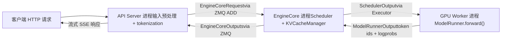
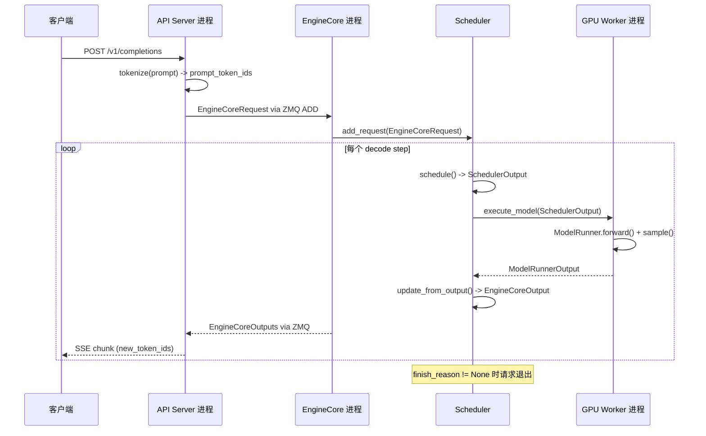

# Capítulo 1: A filosofia de design do vLLM e uma visão geral da arquitetura

Suponha que você tenha uma A100 e queira usar o LLaMA-7B para oferecer um serviço de inferência online. A abordagem mais simples é: chega uma requisição, executa-se um model.generate() e retorna-se o resultado. Essa solução entra em colapso imediatamente quando a concorrência aumenta — não porque o poder de computação da GPU seja insuficiente, mas por dois motivos: primeiro, a memória de vídeo é consumida por fragmentação. A geração autorregressiva precisa armazenar em cache os tensores Key/Value de cada camada (KV Cache). Se cada requisição pré-alocar um bloco contíguo inteiro de memória de vídeo com base em max_model_len, uma requisição de 4096 tokens ocuparia dezenas de MB, enquanto a sequência realmente gerada pode ter apenas 200 tokens. Pior ainda, requisições de comprimentos diferentes entram e saem alternadamente, e os blocos contíguos de memória de vídeo são divididos em pedaços irregulares; no fim, embora o total seja suficiente, não se encontra um espaço contíguo grande o bastante — este é o clássico problema de fragmentação de memória de vídeo. Segundo, a eficiência de batching é baixa. O batching estático tradicional exige que todas as requisições de um batch comecem e terminem ao mesmo tempo. Mas o comprimento de saída de tarefas de geração é naturalmente imprevisível: uma requisição pode parar com 10 tokens, enquanto outra precisa gerar 2000. Depois que a requisição curta termina, o slot de batch que ela ocupava só pode esperar ocioso até a requisição longa terminar, e a utilização da GPU despenca. As duas bases de design do vLLM visam exatamente esses dois pontos problemáticos: PagedAttention elimina a fragmentação de memória de vídeo com um mecanismo de paginação, e Continuous Batching elimina a ociosidade do batching com agendamento em nível de iteração. Este capítulo não aprofunda os detalhes de implementação desses dois mecanismos (esse é o tema dos capítulos 2 e 4), mas primeiro estabelece um mapa global: como é a arquitetura de processos do vLLM v1, como as responsabilidades de cada camada são divididas e por quais componentes uma requisição passa desde a entrada no sistema até a emissão de tokens. Entendendo esse mapa, a leitura do código-fonte de cada capítulo seguinte terá um ponto de apoio.

# Arquitetura de processos: por que o vLLM não é um programa de processo único

## Modelo intuitivo

Imagine o vLLM como um restaurante. A recepção (API Server) é responsável por atender os clientes e registrar os pedidos; o núcleo da cozinha (EngineCore) decide qual prato preparar primeiro e em qual fogão; cada fogão (GPU Worker) é operado exclusivamente por um cozinheiro. Se uma única pessoa atendesse e cozinhasse ao mesmo tempo, nos horários de pico inevitavelmente haveria confusão — é por isso que o vLLM separa esses papéis em processos independentes.

> **[Design Inference & Architectural Trade-offs]**
> A motivação central dessa divisão em múltiplos processos é**separação de responsabilidades**: parsing HTTP, tokenization e carregamento de dados multimodais são operações intensivas em CPU e potencialmente bloqueantes, enquanto a propagação direta do modelo é intensiva em GPU. Se estivessem no mesmo processo, o GIL do Python faria com que ambos se prejudicassem mutuamente. Após a divisão em processos independentes, o API Server pode continuar recebendo novas requisições, o EngineCore pode continuar agendando e o GPU Worker pode continuar computando, com os três desacoplados por meio de filas de mensagens ZMQ.

## Topologia de processos e relação de quantidades

A arquitetura de processos do vLLM v1 pode ser resumida em uma fórmula. Para`N`GPUs, grau de paralelismo de tensor`TP`, grau de paralelismo de pipeline`PP`, grau de paralelismo de dados`DP`, número de API Servers`A`em uma implantação:

| Tipo de processo | Quantidade | Responsabilidade |
| --- | --- | --- |
| API Server | `A`(por padrão igual a`DP`） | Processamento de requisições HTTP, pré-processamento de entrada, retorno de resultados em streaming |
| EngineCore | `DP`(padrão 1) | Agendamento, gerenciamento de KV Cache, coordenação dos GPU Workers |
| GPU Worker | `N`（= `DP × PP × TP`） | Carregamento de pesos, execução da propagação direta, gerenciamento de memória de vídeo |
| DP Coordinator | `DP > 1`quando for 1, caso contrário 0 | Balanceamento de carga entre ranks de DP e coordenação de ondas do MoE |

[FACT:docs/design/arch_overview.md:113-113]fornece a definição autoritativa desta tabela. Uma implantação típica de 4 GPUs em um único nó (`vllm serve -tp=4`) gera 1 API Server + 1 EngineCore + 4 GPU Workers = 6 processos[FACT:docs/design/arch_overview.md:115-115]. Já uma implantação de 8 GPUs com TP=2/DP=4 expande para 4 + 4 + 8 + 1 = 17 processos[FACT:docs/design/arch_overview.md:123-123]。

Há aqui um detalhe facilmente negligenciado:**o número de API Servers segue por padrão o tamanho do DP**. Quando`--data-parallel-size 4`, são iniciados automaticamente 4 API Servers, cada um conectado a todos os EngineCores via ZMQ em topologia muitos-para-muitos[FACT:docs/design/arch_overview.md:73-73]. Isso significa que qualquer API Server pode rotear requisições para qualquer EngineCore, evitando gargalos de ponto único.

## Fluxo de dados

A figura abaixo mostra o caminho completo de uma requisição entre os processos. Observe que cada nó está rotulado com nomes reais de classes e estruturas de dados:



O ponto-chave desta figura é:**entre o API Server e o EngineCore há passagem assíncrona de mensagens**, e não chamada de função. A requisição é serializada na`EngineCoreRequest`estrutura (um`msgspec.Struct`, ver[FACT:vllm/v1/engine/__init__.py:109-113]), enviada via ZMQ com o tipo de mensagem`ADD`[FACT:vllm/v1/engine/__init__.py:287-299]. Após o processamento, o EngineCore empacota o resultado como`EngineCoreOutputs`e o retorna[FACT:vllm/v1/engine/__init__.py:256-260]。

> **[Design Inference & Architectural Trade-offs]**
> A escolha de ZMQ em vez de gRPC ou memória compartilhada se deve ao fato de que ZMQ tem latência extremamente baixa em cenários de comunicação entre processos (nível de microssegundos) e suporta naturalmente topologias muitos-para-muitos e semântica de filas de mensagens. Para serviços de inferência, que são sensíveis à latência do primeiro token, a sobrecarga de comunicação deve ser a menor possível.

## Reflexão de design: por que o EngineCore é um processo independente e não uma thread

Uma pergunta natural é: já que o EngineCore e o API Server estão na mesma máquina, por que não colocá-los no mesmo processo e usar comunicação por threads?

A resposta está no modo de operação do EngineCore. O EngineCore executa um**busy loop**(busy loop), agendando continuamente requisições e distribuindo trabalho para os GPU Workers[FACT:docs/design/arch_overview.md:73-73]. Esse loop não pode ser interrompido — uma vez bloqueado por parsing HTTP ou tokenization, toda a pipeline de inferência sofre bolhas. O processo independente garante que a fatia de CPU do EngineCore não seja preemptada pela lógica de frontend.

Além disso, o processo independente também traz**isolamento de falhas**: se o API Server travar por causa de alguma requisição malformada, o EngineCore e os GPU Workers não são afetados e podem continuar atendendo requisições encaminhadas por outros API Servers.

# Modelo mental em camadas: fronteiras de responsabilidade da entrada até a GPU

## Modelo intuitivo

Se a arquitetura de processos é "quem faz o quê e onde", então o modelo em camadas é "qual decisão cada camada toma". A organização do código do vLLM segue um princípio claro de camadas:**a camada superior decide o que fazer, a camada inferior decide como fazer**. A camada de entrada decide quais requisições aceitar, a camada central do engine decide quem processar primeiro, a camada de executor decide qual estratégia de paralelismo usar, e a camada de Worker decide como produzir resultados no hardware específico.

## Estrutura em quatro camadas

**Camada de entrada (Entrypoints)**oferece duas formas de interação: a classe`LLM`para inferência offline e o comando`vllm serve`para serviço online[FACT:docs/design/arch_overview.md:16-16][FACT:docs/design/arch_overview.md:56-56]. A responsabilidade central desta camada é o pré-processamento de entrada — tokenization, carregamento de dados multimodais, parsing de parâmetros de amostragem — além da detokenization da saída e do retorno em streaming. Ela não se preocupa com estratégias de agendamento nem toca na GPU.

**Camada central do engine (EngineCore)**é o cérebro de todo o sistema. Ela mantém o Scheduler (que decide quais requisições processar em cada decode step) e o KV Cache Manager (que gerencia a memória de vídeo paginada), comunicando-se com os GPU Workers através da abstração Executor[FACT:docs/design/arch_overview.md:79-85]. O design-chave desta camada é**a separação entre agendamento e execução**: o Scheduler apenas produz a decisão de "quais tokens rodar neste passo" (`SchedulerOutput`), e como executar concretamente na GPU é responsabilidade do Worker.

**Camada de executor (Executor)**é a ponte entre o EngineCore e os Workers. Ela encapsula as estratégias de execução distribuída — em processo único usa`UniProcExecutor`, em múltiplos processos usa`MultiprocExecutor`, em cluster Ray usa`RayDistributedExecutor`. A interface abstrata do Executor faz com que o EngineCore não precise saber se a base é uma única GPU ou 8 GPUs com TP.

**Camada de Worker**cada GPU tem um processo Worker, que internamente mantém o ModelRunner e o objeto real de modelo`torch.nn.Module`[FACT:docs/design/arch_overview.md:171-191]. O ModelRunner é responsável por preparar os tensores de entrada, capturar CUDA Graphs e executar o cálculo forward. Esta camada é o único lugar que opera diretamente a memória de vídeo da GPU e as streams CUDA.

## Objeto de configuração: estado global que atravessa todas as camadas

Como as quatro camadas trocam informações entre si? A resposta é`VllmConfig`— um dataclass gigante contendo todas as configurações[FACT:vllm/config/vllm.py:357-357]。

```python
@config(config=ConfigDict(arbitrary_types_allowed=True))
class VllmConfig:
    """Dataclass which contains all vllm-related configuration."""
    model_config: ModelConfig = None
    cache_config: CacheConfig = Field(default_factory=CacheConfig)
    parallel_config: ParallelConfig = Field(default_factory=ParallelConfig)
    scheduler_config: SchedulerConfig = Field(default_factory=SchedulerConfig.default_factory)
    # ... 还有 20+ 个子配置
```

[FACT:vllm/config/vllm.py:363-371]mostra os campos principais. A lógica por trás dessa escolha de design merece ser detalhada.

> **[Design Inference & Architectural Trade-offs]**
> A documentação explica claramente por que usar um grande objeto de configuração em vez de passar parâmetros dispersos:**Escalabilidade**. Suponha que seja necessário adicionar um novo recurso que afeta apenas o ModelRunner; basta adicionar um campo em`VllmConfig`e o ModelRunner o lê diretamente, sem precisar modificar as assinaturas dos construtores de Engine, Worker e Model[FACT:docs/design/arch_overview.md:203-203]. Em um framework de inferência em rápida evolução, essa capacidade de "adicionar campos sem alterar interfaces" reduz enormemente o atrito no desenvolvimento.

O custo é que`VllmConfig`se torna extremamente grande — como se pode ver em[FACT:vllm/config/vllm.py:356-3509], essa classe ultrapassa 3000 linhas de código, contendo dezenas de campos e métodos de validação.`__post_init__`O método[FACT:vllm/config/vllm.py:1405-2317]chega a ter mais de 900 linhas, assumindo toda a validação cruzada entre itens de configuração e a derivação de valores padrão.

## Hash e cache de configuração

`VllmConfig`Há também uma capacidade facilmente negligenciada, mas muito importante:`compute_hash()` [FACT:vllm/config/vllm.py:464-580]. Ele gera um hash curto para todos os itens de configuração que afetam a estrutura do grafo computacional.

```python
def compute_hash(self, include_version: bool = True) -> str:
    factors: list[Any] = []
    vllm_factors: list[Any] = []
    if include_version:
        from vllm import __version__
        vllm_factors.append(__version__)
    if self.model_config:
        vllm_factors.append(self.model_config.compute_hash())
    # ... 逐个追加各子配置的哈希
    hash_str = safe_hash(str(factors).encode(), usedforsecurity=False).hexdigest()[:10]
    return hash_str
```

[FACT:vllm/config/vllm.py:479-580]mostra o fluxo completo de cálculo do hash. Observe o aviso no comentário: "Whenever a new field is added to this config, ensure that it is included in the factors list if it affects the computation graph"[FACT:vllm/config/vllm.py:465-467]。

> **[Design Inference & Architectural Trade-offs]**
> O propósito desse hash é**chave de cache do torch.compile**. O vLLM usa`torch.compile`para compilar o grafo forward do modelo, e o resultado da compilação é armazenado em disco. Na próxima inicialização, se o hash da configuração for o mesmo, o cache de compilação pode ser reutilizado diretamente, pulando o demorado processo de compilação. Se algum item de configuração que afeta o grafo computacional não for incluído no hash, isso causará erro de acerto de cache — usar um grafo compilado com a configuração antiga para executar a nova configuração, resultando em erro silencioso. É por isso que o comentário enfatiza repetidamente que "campos que afetam o grafo computacional devem ser incluídos no hash".

# Walkthrough do ciclo de vida da requisição: do HTTP ao Token

## Definição do cenário

Suponha que o cliente envie para`vllm serve`um serviço iniciado que envia uma requisição compatível com OpenAI`/v1/completions`, com prompt "The capital of France is", solicitando a geração de 16 tokens. Vamos rastrear a jornada completa dessa requisição pelo código-fonte.

## Step 1: O API Server recebe e pré-processa

Após o processo do API Server receber a requisição HTTP, ele realiza tokenization e parsing dos parâmetros de amostragem, e então constrói`EngineCoreRequest`：

```python
class EngineCoreRequest(
    msgspec.Struct,
    array_like=True,
    omit_defaults=True,
    gc=False,
):
    request_id: str
    prompt_token_ids: list[int] | None
    mm_features: list[MultiModalFeatureSpec] | None
    sampling_params: SamplingParams | None
    pooling_params: PoolingParams | None
    arrival_time: float
    lora_request: LoRARequest | None
    cache_salt: str | None
    data_parallel_rank: int | None
    prompt_embeds: torch.Tensor | None = None
    # ... 更多字段
```

[FACT:vllm/v1/engine/__init__.py:109-124]define a estrutura central da requisição. Observe`msgspec.Struct`combinado com`array_like=True`e`omit_defaults=True`a combinação[FACT:vllm/v1/engine/__init__.py:109-113]— isso serve para**desempenho de serialização**。`array_like`fazer o msgspec codificar usando arrays posicionais em vez de dicionários,`omit_defaults`pular campos com valores padrão; a combinação dos dois reduz drasticamente o tamanho das mensagens ZMQ.

> **[Design Inference & Architectural Trade-offs]**
> `gc=False`diz ao msgspec para não gerar código de rastreamento de GC para essa estrutura[FACT:vllm/v1/engine/__init__.py:109-113]. Para objetos de mensagem criados/destruídos com alta frequência, desativar o rastreamento de GC reduz a pressão sobre o coletor de lixo do Python, o que é uma otimização necessária em cenários que processam milhares de requisições por segundo.

## Step 2: Agendamento do EngineCore

Após o EngineCore receber a requisição, o Scheduler a coloca na fila de espera. Em cada passo de agendamento, o Scheduler decide se inclui essa requisição no lote atual. Se incluída, o KV Cache Manager alocará blocos físicos para ela (operação central do PagedAttention, detalhada no Capítulo 2).

O resultado do agendamento é encapsulado como`SchedulerOutput`, e enviado ao GPU Worker através do Executor.

## Step 3: O GPU Worker executa o forward

O ModelRunner do Worker recebe`SchedulerOutput`, prepara os tensores de entrada (incluindo block table, slot mapping e outros metadados de attention), executa o forward do modelo e amostra o próximo token.

## Step 4: Retorno do resultado

O token produzido pelo Worker é encapsulado como`EngineCoreOutput`：

```python
class EngineCoreOutput(
    msgspec.Struct,
    array_like=True,
    omit_defaults=True,
    gc=False,
):
    request_id: str
    new_token_ids: list[int]
    new_logprobs: LogprobsLists | None = None
    finish_reason: FinishReason | None = None
    stop_reason: int | str | None = None
    # ...
```

[FACT:vllm/v1/engine/__init__.py:199-217]define a estrutura de saída.`finish_reason`é um`IntEnum`, com valores incluindo`STOP`、`LENGTH`、`ABORT`、`ERROR`、`REPETITION` [FACT:vllm/v1/engine/__init__.py:68-69]. O comentário explica por que usar`Int`em vez de`Str`：「Int rather than Str for more compact serialization」[FACT:vllm/v1/engine/__init__.py:56-57]— mais uma otimização de tamanho de serialização.

Múltiplos`EngineCoreOutput`são empacotados em`EngineCoreOutputs`, e retornados ao API Server via ZMQ[FACT:vllm/v1/engine/__init__.py:256-260]。

## Step 5: Retorno em streaming do API Server

Após o API Server receber`EngineCoreOutputs`, para cada`EngineCoreOutput`realiza detokenization e então envia ao cliente via streaming usando SSE (Server-Sent Events).

## Sequência temporal completa

O diagrama de sequência abaixo mostra a interação completa entre processos, anotando os nomes reais de funções e estruturas de dados em cada passo:



Informações-chave deste diagrama:**Cada decode step produz um`EngineCoreOutputs`de retorno**, em vez de esperar toda a sequência ser gerada para retornar. Isso é exatamente a manifestação do Continuous Batching — sequências concluídas saem imediatamente, novas requisições entram imediatamente, e a saída é retornada em streaming ao cliente.

# Reflexões de design e armadilhas em produção

## O padrão de "inicialização postergada" na validação de configuração

`VllmConfig.__post_init__`é o núcleo de todo o sistema de configuração. Não é uma simples atribuição de campos, mas sim um**pipeline de validação multifásico**：

1. Primeiro, analisa o modo do codificador multimodal[FACT:vllm/config/vllm.py:1416-1416]

2. Em seguida, chama`try_verify_and_update_config()`, permitindo que hooks de configuração específicos do modelo tenham a oportunidade de modificar a configuração[FACT:vllm/config/vllm.py:1434-1434]

3. Depois, valida a consistência entre configuração paralela, configuração de quantização e configuração de LoRA[FACT:vllm/config/vllm.py:1442-1444]

4. Por fim, trata verificações de compatibilidade de recursos de runtime como agendamento assíncrono, CUDA Graph, KV Transfer, etc.[FACT:vllm/config/vllm.py:1544-1635]

> **[Design Inference & Architectural Trade-offs]**
> Esse padrão de "inicialização posterior" resolve uma contradição fundamental:**existem dependências entre itens de configuração, mas o usuário pode defini-los em qualquer ordem**. Por exemplo,`async_scheduling`se está habilitado depende do tipo de método em speculative_config, se o backend do executor oferece suporte, se pipeline parallelism é usado, entre várias outras condições[FACT:vllm/config/vllm.py:1544-1575]. Se essa lógica fosse colocada no`__set__`do campo, formaria dependências circulares complexas. Centralizá-la em`__post_init__`para processamento sequencial torna a lógica clara e fácil de depurar.

## Armadilha: conflito entre KV Connector e expandable_segments

[FACT:vllm/config/vllm.py:1219-1260]O`_verify_kv_transfer_compat`em revela uma armadilha de produção muito sutil.

Ao usar KV Connector (como NIXL, Mooncake) para implantação com separação PD, esses connectors, por meio de mecanismos como`ibv_reg_mr`**fixam (pin) as páginas de memória física do KV cache**. Mas se`PYTORCH_CUDA_ALLOC_CONF=expandable_segments:True`for definido ao mesmo tempo, o alocador CUDA VMM do PyTorch pode, em runtime, remapear o mesmo endereço virtual para páginas físicas diferentes[FACT:vllm/config/vllm.py:1227-1233]。

Qual é a consequência? A região de memória RDMA registrada pelo Connector aponta para páginas físicas que já não são válidas. A primeira transferência de KV entre nós reportará`IBV_WC_REM_ACCESS_ERR`ou`NIXL_ERR_REMOTE_DISCONNECT` [FACT:vllm/config/vllm.py:1232-1233]。

A estratégia do vLLM é**rejeição conservadora**: desde que detecte`expandable_segments:True`e qualquer KV connector configurado, lança exceção diretamente[FACT:vllm/config/vllm.py:1249-1260]. A única exceção é quando`enable_cumem_allocator`está habilitado — porque o alocador CuMem desativa`expandable_segments` [FACT:vllm/config/vllm.py:1238-1241]。

> **[Design Inference & Architectural Trade-offs]**
> 〔Inferência de design e trade-offs arquiteturais〕**A lição deste caso é:**registro de memória RDMA e remapeamento de memória virtual são semanticamente incompatíveis`PYTORCH_CUDA_ALLOC_CONF`。

## . Qualquer funcionalidade que envolva pin de memória GPU (transferência KV, buffers de registro NCCL, etc.) deve garantir que as páginas físicas subjacentes não sejam movidas silenciosamente pelo alocador. Ao investigar esse tipo de problema, se você vir uma transferência RDMA falhar na primeira comunicação entre nós, a primeira reação deve ser verificar

`__post_init__`Armadilha: cadeia de degradação automática do agendamento assíncrono`async_scheduling`A lógica de tratamento de[FACT:vllm/config/vllm.py:1544-1635]em**demonstra uma**。

cadeia de degradação automática`async_scheduling`cuidadosamente projetada`None`Quando o usuário não define

- explicitamente (valor[FACT:vllm/config/vllm.py:1578-1587]
- ), o vLLM tenta habilitá-lo automaticamente, mas precisa verificar sequencialmente uma série de condições de incompatibilidade:[FACT:vllm/config/vllm.py:1588-1601]
- Se for modelo pooling, desabilita`disable_padded_drafter_batch=True`Se o método speculative não estiver na lista de suporte, desabilita[FACT:vllm/config/vllm.py:1602-1610]
- Se[FACT:vllm/config/vllm.py:1611-1617]
- , desabilita[FACT:vllm/config/vllm.py:1618-1624]
- Se o backend do executor não oferecer suporte, desabilita[FACT:vllm/config/vllm.py:1625-1633]

Se for ROCm DeepEP high-throughput DBO, desabilita[FACT:vllm/config/vllm.py:1639-1640]。

> **[Design Inference & Architectural Trade-offs]**
> Somente se todas as verificações passarem, habilita**〔Inferência de design e trade-offs arquiteturais〕**A filosofia de design desta cadeia de degradação é:

# habilitar a configuração ótima por padrão, degradar silenciosamente e registrar aviso quando houver incompatibilidade

. Isso é muito mais amigável do que exigir que o usuário configure manualmente cada switch de compatibilidade. Mas o custo é — quando o desempenho fica abaixo do esperado, o usuário precisa vasculhar os logs para descobrir que o agendamento assíncrono foi desabilitado automaticamente. Em produção, se detectar throughput anormal, recomenda-se verificar se há o aviso "Async scheduling will be disabled" nos logs de inicialização.

1. **Resumo do capítulo**Este capítulo estabeleceu o modelo mental global do vLLM v1, com os pontos principais:

2. **Os dois problemas fundamentais que o vLLM resolve**: fragmentação de memória de vídeo (gerenciamento paginado do PagedAttention) e ociosidade no batching (agendamento em nível de iteração do Continuous Batching).`A + DP + N`Arquitetura multiprocesso

3. **: API Server (entrada) → EngineCore (agendamento) → GPU Worker (execução), três camadas de processos, comunicando-se assincronamente via ZMQ. O número de processos segue a**fórmula.

4. **Modelo em quatro camadas**: a camada de entrada é responsável pelo pré-processamento, a camada central do engine pelas decisões de agendamento, a camada do executor pela estratégia distribuída, e a camada Worker pela computação na GPU.`compute_hash()`VllmConfig é o estado global que atravessa todas as camadas`__post_init__`, suportando cache de compilação via

5. **, e implementando validação entre itens de configuração e derivação de valores padrão via**：HTTP → tokenize → `EngineCoreRequest` → Scheduler → Worker forward → `EngineCoreOutput`Ciclo de vida da requisição

# → retorno em streaming via SSE.

Reflexões e autoavaliação do capítulo`EngineCoreRequest`Q1: Se o`msgspec.Struct`parâmetro`array_like=True, omit_defaults=True`de`array_like=False, omit_defaults=False`for alterado de[FACT:vllm/v1/engine/__init__.py:109-113]para o valor padrão (ou seja,[FACT:vllm/v1/engine/__init__.py:256-260]), em quais cenários isso causaria problemas de desempenho? Analise combinando

**e**：`array_like=True`Análise de referência`omit_defaults=True`faz o msgspec codificar structs usando arrays posicionais em vez de dicionários,`EngineCoreRequest`seria codificado como uma estrutura de dicionário contendo todos os nomes de campos, e o tamanho poderia inflar de 2 a 3 vezes. Em cenários de alta concorrência (milhares de requisições por segundo), o volume de mensagens ZMQ entre o API Server e o EngineCore aumentaria significativamente, levando ao aumento do custo de CPU com serialização/desserialização e ao desperdício de largura de banda de rede.`EngineCoreOutputs`também usa esses dois parâmetros[FACT:vllm/v1/engine/__init__.py:256-260], e ele é gerado a cada decode step, com impacto ainda maior. Além disso,`gc=False`desativa o rastreamento do GC, o que pode aliviar a pressão do GC do Python para objetos de alta frequência e curta duração.

Q2: Em`VllmConfig.__post_init__`,`async_scheduling`a lógica de ativação automática ([FACT:vllm/config/vllm.py:1576-1635]) adota a estratégia de "verificar sequencialmente as condições de incompatibilidade e só ativar se todas passarem". Se uma nova funcionalidade incompatível com o agendamento assíncrono for adicionada, mas o desenvolvedor esquecer de adicionar o branch correspondente nessa cadeia de verificações, que problema isso causaria? Analise do ponto de vista do comportamento do sistema.

**Análise de referência**: Se o branch de verificação for esquecido, o agendamento assíncrono será ativado incorretamente. A suposição central do agendamento assíncrono é que "a decisão de agendamento do step atual não depende da saída do step anterior", o que permite ao EngineCore agendar o próximo step antes que a computação da GPU do step anterior tenha terminado. Se a nova funcionalidade violar essa suposição (por exemplo, alguma lógica de pós-processamento que precisa ler os logits do step anterior), o agendamento assíncrono causará condições de corrida ou resultados incorretos. De forma mais sutil, esse tipo de bug pode ser acionado apenas em determinadas sequências de concorrência, sendo difícil de reproduzir. É exatamente por isso que[FACT:vllm/config/vllm.py:1549-1552]o caminho de ativação explícita adota a estratégia de "hard fail" — quando o usuário ativa ativamente, ele gera erro diretamente em vez de degradar silenciosamente, forçando o desenvolvedor a enfrentar o problema de compatibilidade.

Q3: `VllmConfig.compute_hash()`o comentário alerta que "campos que afetam o grafo computacional devem ser adicionados à lista factors" ([FACT:vllm/config/vllm.py:465-467]). Suponha que um novo campo`attention_sink_tokens`afete a lógica de cálculo de attention, mas seja omitido no hash. Que tipo de falha isso acionaria em ambiente de produção? Por que esse tipo de falha é especialmente perigoso?

**Análise de referência**：`compute_hash()`a saída é usada como chave do cache de compilação do torch.compile. Se`attention_sink_tokens`afeta a estrutura do grafo computacional, mas não é incluído no hash, então quando o usuário muda de`attention_sink_tokens=0`para`attention_sink_tokens=4`, o valor do hash permanece o mesmo, e o vLLM reutilizará o grafo compilado anteriormente (sem a lógica de sink token). O resultado é que o modelo produz silenciosamente saídas incorretas — sem erro, sem crash, apenas resultado errado. Esse tipo de falha é especialmente perigoso porque: (1) não dispara nenhuma exceção nem aviso de log; (2) a saída ainda é um texto que "parece razoável", apenas com qualidade reduzida ou comportamento anômalo; (3) para investigar, é necessário comparar o acerto do cache de compilação com as diferenças reais de configuração, com custo de localização extremamente alto. É por isso que o comentário enfatiza repetidamente que novos campos devem ser avaliados quanto a impactar ou não o grafo computacional.

Este capítulo parte da cena de crash de uma requisição de inferência ingênua, revelando dois conflitos fundamentais que o vLLM precisa resolver: fragmentação de memória de vídeo e ociosidade do batching, e apresenta as duas chaves: PagedAttention e Continuous Batching. Em seguida, fazemos uma visão geral da arquitetura do vLLM v1, esclarecendo o modelo de processos, a divisão em camadas dos componentes e o ciclo de vida completo de uma requisição. Com esse mapa global em mãos, o próximo capítulo aprofundará a estrutura de dados mais central do vLLM — Request, Sequence e o mecanismo de gerenciamento de blocos do KV Cache —, revelando como o PagedAttention implementa, no nível do código, o mapeamento de memória de vídeo com "continuidade lógica e dispersão física".
