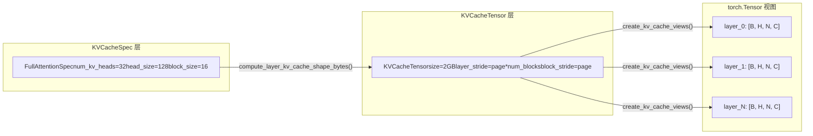

# Capítulo 2: Abstrações centrais: estruturas de dados de Request, Sequence e KV Cache

No capítulo anterior, estabelecemos o modelo mental em camadas do vLLM v1, sabendo que uma requisição parte do API Server, atravessa o EngineCore e finalmente chega ao Worker para execução. Mas como uma string JSON no corpo de uma requisição HTTP se transforma em um objeto interno do motor que pode ser agendado, rastreado e interrompido? Essa é a pergunta que a classe Request deve responder.

# O sistema de especificações do KV Cache: de KVCacheSpec ao registro

Request resolve o problema de "quem deve calcular", enquanto`KVCacheSpec`resolve o problema de "onde calcular". No mundo do PagedAttention, o KV cache de cada camada do modelo precisa ser descrito com precisão: quantos heads ele tem, qual o tamanho de cada head, quantos tokens um bloco pode armazenar, se precisa de quantização. Essas informações são codificadas no sistema de herança de`KVCacheSpec`.

## Modelo intuitivo: KVCacheSpec é a "planta baixa" da memória de vídeo

> **[Design Inference & Architectural Trade-offs]**
> Se imaginarmos a memória de vídeo da GPU como um terreno a ser desenvolvido,`KVCacheSpec`é a planta baixa de cada prédio (cada cache group): ela define quantos quartos (head slot) cada andar (cada bloco) tem, qual o tamanho de cada quarto (head_size), quantas pessoas podem morar (block_size tokens). E`KVCacheConfig`é o plano de layout de todo o complexo residencial — quantos edifícios no total, quanto terreno cada edifício ocupa, quais edifícios compartilham a mesma fundação (block table).

Sem este sistema de especificações, a alocação do KV cache só poderia depender de suposições codificadas manualmente, incapaz de suportar as diversas necessidades de modelos que vão desde MHA padrão até MLA, de atenção completa até janela deslizante, de FP16 até quantização FP8.

## Estrutura de dados: árvore de herança e campos-chave do KVCacheSpec

`KVCacheSpec`é a classe base de todas as especificações, é uma`@dataclass(frozen=True)` [FACT:vllm/v1/kv_cache_interface.py:150-152]. frozen significa que o objeto de especificação é imutável uma vez criado — isso garante que múltiplos componentes (scheduler, Worker, KV Cache Manager) vejam a mesma especificação, sem inconsistências causadas por modificações em algum lugar.

A classe base define três propriedades abstratas que devem ser implementadas pelas subclasses:`num_heads`、`tokens_per_state`、`state_content_size_bytes` [FACT:vllm/v1/kv_cache_interface.py:182-183]. Essas três propriedades juntas determinam`page_size_bytes`— ou seja, o número de bytes ocupados por um block.

`AttentionSpec`é a subclasse mais central, ela introduz`num_kv_heads`、`head_size`、`dtype`、`kv_quant_mode`e outros campos[FACT:vllm/v1/kv_cache_interface.py:485-498]. Entre eles, o design do campo`tokens_per_state`é particularmente engenhoso: o valor padrão é 1, indicando que um state corresponde a um token; mas pode ser definido como um inteiro maior que 1 (como o MLA esparso do DeepSeek-V4 que comprime múltiplos tokens em um state), ou uma fração menor que 1 (como o block pooling do Whisper usando`Fraction(1, block_pool_size)`para indicar que um token corresponde a múltiplos states)[FACT:vllm/v1/kv_cache_interface.py:501-501]。

`FullAttentionSpec`em`AttentionSpec`adiciona`sliding_window`e`attention_chunk_size` [FACT:vllm/v1/kv_cache_interface.py:566-566]. Note que sua docstring explica uma decisão de design importante: quando o alocador híbrido está desabilitado, as camadas de atenção com janela deslizante são tratadas como atenção completa no KV Cache Manager (alocando blocks para todos os tokens), mas em tempo de execução do modelo ainda são calculadas como janela deslizante[FACT:vllm/v1/kv_cache_interface.py:540-545]. Esta é uma**alocação conservadora, cálculo preciso**estratégia.

`MLAAttentionSpec`é a especificação chave da série de modelos DeepSeek. Ela define`head_size_v`como 0 por padrão[FACT:vllm/v1/kv_cache_interface.py:670], porque o MLA armazena apenas um latent vector, sem V independente.`alignment`O campo é usado para preenchimento de alinhamento de página[FACT:vllm/v1/kv_cache_interface.py:646-652], o que é crucial para backends como FlashMLA que requerem alinhamento específico.

`MambaSpec`por sua vez, não segue a rota de attention de forma alguma. Ele usa`shapes`e`dtypes`tuplas para descrever a forma do tensor de estado[FACT:vllm/v1/kv_cache_interface.py:1027-1028]，`state_content_size_bytes`é a soma de todos os tamanhos de tensores de estado[FACT:vllm/v1/kv_cache_interface.py:1048-1052]. O`max_memory_usage_bytes`do Mamba tem três formas diferentes de cálculo dependendo de`mamba_cache_mode`[FACT:vllm/v1/kv_cache_interface.py:1073-1084], o que reflete a complexidade do gerenciamento de estado do Mamba — ele não cresce linearmente como o attention, mas tem um tamanho de estado fixo.

## Orientado a cenários: conversão de especificação para layout de memória de vídeo

Quando o motor inicia, ele precisa converter o`KVCacheSpec`de todas as camadas em um layout real de memória de vídeo. Este processo é realizado por`KVCacheTensor`e`create_kv_cache_views`.

`KVCacheTensor`descreve a posição de um grupo de camadas de mesma forma na alocação do KV cache[FACT:vllm/v1/kv_cache_interface.py:1406-1427]. Seus campos centrais são`layer_stride`e`block_stride`: o primeiro é a distância em bytes entre camadas adjacentes, o segundo é a distância em bytes entre blocks adjacentes. A docstring explica em detalhes dois modos de layout: layout com camadas mais externas (layer-outermost) dá a cada camada uma região contígua, layout com blocks mais externos (block-outermost) faz com que cada block contenha as páginas de todas as camadas[FACT:vllm/v1/kv_cache_interface.py:1416-1416]。

`create_kv_cache_views`A função é o núcleo deste processo[FACT:vllm/v1/kv_cache_interface.py:353-417]. Ela recebe um buffer int8 plano, através de`torch.as_strided`cria uma visão 4D para cada camada`[B, H, N, C]`. O parâmetro chave é`strides`, que é calculado por`compute_layout_strides`[FACT:vllm/v1/kv_cache_interface.py:314-350]. Esta função, seguindo a ordem de dimensões especificada por`layout.stride_order`, calcula os strides em bytes de cada dimensão em ordem reversa a partir da dimensão mais interna.

Há uma verificação de limite digna de nota: quando kernel_block_size é menor que spec.block_size (ou seja, um manager block é dividido em múltiplos kernel blocks), o código verifica se block_stride é igual a dense_page_size[FACT:vllm/v1/kv_cache_interface.py:381-382]. Se não for igual, indica que há padding no layout, impossibilitando a divisão uniforme, e neste caso lança um ValueError com sugestão de correção explícita.

## Reflexões de design: padrão de registro e extensibilidade

`KVCacheSpecRegistry`é o design chave para a extensibilidade do vLLM[FACT:vllm/v1/kv_cache_spec_registry.py:39-40]. Ele mantém dois dicionários globais:`_REGISTRY_KVCACHESPEC_LIST`armazena o mapeamento de classes spec para metadados,`_REGISTRY_ROLE_MANAGERS`armazena o mapeamento de papéis para gerenciadores[FACT:vllm/v1/kv_cache_spec_registry.py:35-36]。

`get_manager_class`O método demonstra a lógica central de busca do registro: ele percorre a MRO (ordem de resolução de métodos) da classe spec para cima, encontrando a primeira classe base registrada[FACT:vllm/v1/kv_cache_spec_registry.py:129-130]. Isso significa que um`CustomFullAttentionSpec`personalizado, se não registrado separadamente, herdará automaticamente o gerenciador de`FullAttentionSpec`. Este tipo de**busca baseada em herança**faz com que, ao adicionar novos tipos de spec, seja necessário registrar apenas as diferenças.

`check_kv_cache_spec_registry`O método valida na inicialização que os specs de todas as camadas estão registrados[FACT:vllm/v1/kv_cache_spec_registry.py:165-174]. Note que ele usa`raise ValueError`em vez de`assert`, e o comentário explica claramente que isso é para ter efeito também em ambiente de produção[FACT:vllm/v1/kv_cache_spec_registry.py:165-174]. Esta é uma decisão de engenharia importante: a flag`-O`do Python remove asserts, mas erros de configuração em ambiente de produção devem ser expostos na inicialização, e não causar falhas apenas em tempo de execução.

> **[Design Inference & Architectural Trade-offs]**
> O design de inicialização tardia do registro (`_ensure_registered`) resolve um problema de dependência circular:`kv_cache_interface.py`precisa referenciar o registro para verificar tipos de spec, e o registro precisa importar`single_type_kv_cache_manager`para obter a classe gerenciadora, que por sua vez depende de`kv_cache_interface`. Ao adiar o registro real para a primeira consulta, esse ciclo é quebrado.

# Resumo do capítulo

Este capítulo analisou duas estruturas de dados centrais do vLLM v1.`Request`é o veículo do ciclo de vida da requisição dentro do engine; por meio de listas duplas de tokens, contadores assíncronos de agendamento e mecanismo de block hash, ele sustenta as duas funcionalidades centrais: batching contínuo e prefix caching.`KVCacheSpec`e sua hierarquia de herança definem a especificação de layout de memória de vídeo do KV cache, desde o padrão`FullAttentionSpec`até`MLAAttentionSpec`、`MambaSpec`, cobrindo necessidades de arquiteturas de modelos diversificadas. O padrão de registro permite adicionar novos tipos de spec sem modificar o código central, garantindo a extensibilidade do sistema.

Até aqui, já vimos como Request é convertido a partir de EngineCoreRequest e como ele sustenta decisões de agendamento por meio de contadores de estado, block hash e outros mecanismos. Mas como uma requisição externa atravessa o API Server, o chat template e o processamento multimodal até finalmente se tornar um EngineCoreRequest? O próximo capítulo entrará na camada de entrada de requisições, rastreando completamente essa cadeia do HTTP/CLI até o EngineCore.
