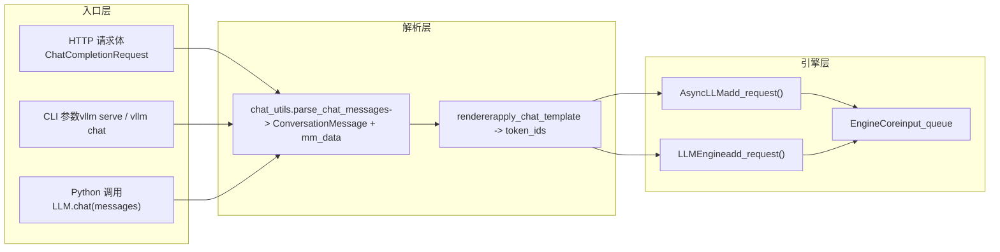

# Capítulo 3: Entrada de requisições: a cadeia completa do HTTP/CLI ao EngineCore

No capítulo anterior, analisamos as duas estruturas de dados centrais internas do engine: Request e KVCacheSpec, entendendo como a sequência lógica e os blocos físicos de memória de vídeo são desacoplados. Mas como um corpo de requisição HTTP ou uma string Python atravessa o API Server, o chat template e o processamento multimodal até finalmente se tornar um EngineCoreRequest? Este capítulo rastreará completamente essa cadeia e revelará como os três caminhos de entrada — CLI síncrona, API assíncrona e classe LLM offline — convergem para o mesmo núcleo do engine.

# 3.1 O ponto de convergência dos três caminhos de entrada: AsyncLLMEngine e LLMEngine

Antes de aprofundar na análise de requisições, é necessário visualizar claramente a topologia dos três caminhos de entrada. O vLLM oferece três formas de uso:`vllm serve`serviço HTTP compatível com OpenAI iniciado por , ferramenta de linha de comando`vllm`, e instanciação direta em Python da classe`LLM`para inferência offline. Eles parecem independentes, mas na verdade compartilham o mesmo núcleo de engine.

Vejamos primeiro o mecanismo de alias do caminho da API assíncrona.

[FACT:vllm/engine/async_llm_engine.py:7-7]

Este arquivo é tão curto que quase não parece um módulo — ele faz apenas uma coisa: apontar o alias`AsyncLLMEngine`para`vllm.v1.engine.async_llm.AsyncLLM`. Esta é uma marca típica de migração arquitetural. Na era do vLLM v0,`AsyncLLMEngine`era uma classe enorme e complexa; após a reescrita da arquitetura v1, a nova`AsyncLLM`assumiu as mesmas responsabilidades. Para não quebrar o código existente dos usuários, o vLLM manteve o caminho do módulo antigo como camada de compatibilidade.

> **[Design Inference & Architectural Trade-offs]**
> Esse padrão de "alias do caminho antigo apontando para a nova implementação" aparece repetidamente no vLLM (como o deprecation warning de`api_server.py`), indicando que o projeto adotou uma estratégia gradual na migração de v0 para v1: código novo usa o novo caminho, código antigo não gera erro mas recebe aviso, dando ao usuário janela suficiente para migração.

Vejamos agora a entrada do caminho offline.

[FACT:vllm/entrypoints/llm.py:344-346]

`LLM.__init__`eventualmente chama`LLMEngine.from_engine_args`, passando`UsageContext.LLM_CLASS`. Este enum`UsageContext`é a chave para distinguir os caminhos de entrada — ele permite que o engine saiba se está rodando em modo de processamento em lote offline ou modo de serviço online, ajustando assim estratégias de log, métricas e gerenciamento de recursos.

[FACT:vllm/entrypoints/llm.py:357-359]

Observe aqui a atribuição de`self.renderer = self.llm_engine.renderer`e`self.input_processor = self.llm_engine.input_processor`. A classe`LLM`offline não implementa ela mesma a renderização do chat template, mas reutiliza o`renderer`interno do engine. Isso significa que a lógica de parsing do chat template é o mesmo código nos caminhos offline e online, apenas com momentos de chamada diferentes.

A relação de convergência dos três caminhos pode ser representada pelo seguinte diagrama de fluxo de dados.

Este diagrama revela um design fundamental: independentemente de a requisição vir de HTTP, CLI ou Python,`chat_utils`é a única entrada para processamento multimodal e chat template. Ele unifica formatos de entrada heterogêneos em`ConversationMessage`lista mais`MultiModalDataDict`, e então entrega ao renderer para gerar a sequência de tokens.

# 3.2 chat_utils: de mensagens heterogêneas a uma estrutura de diálogo unificada

`chat_utils.py`é o módulo mais complexo de toda a camada de entrada de requisições; suas 2264 linhas de código tratam todos os formatos de entrada: formato compatível com OpenAI, extensões personalizadas, embeddings multimodais, chamadas de ferramentas, etc. Sua responsabilidade central pode ser resumida em uma frase: normalizar qualquer lista de mensagens enviada pelo usuário para uma lista`ConversationMessage`compreensível pelo chat template, enquanto extrai dados multimodais para um`MultiModalDataDict`separado.

## Modelo intuitivo: tradutor e triador de bagagens

Imagine`chat_utils`como um tradutor e triador de bagagens de aeroporto. Os passageiros (usuários) vêm de países diferentes (formato OpenAI, formato personalizado, formato Harmony), falando línguas diferentes. O tradutor primeiro traduz as falas de todos para uma língua de trabalho unificada (`ConversationMessage`), ao mesmo tempo, classificar a bagagem despachada dos passageiros (imagens, áudio, vídeo) em esteiras transportadoras independentes (`MultiModalDataDict`), colar etiquetas (UUID), e finalmente enviar pessoas e bagagem separadamente para o mesmo avião (motor).

Sem essa camada, o motor teria que entender os detalhes de cada formato de entrada, a lógica de extração de dados multimodais ficaria dispersa em cada ponto de entrada, e qualquer adição de novo formato exigiria alterar o núcleo do motor.

## Estrutura de dados: colaboração de duas classes entre rastreador e analisador

`chat_utils`O núcleo de  é a colaboração de dois grupos de classes:`BaseMultiModalItemTracker`e suas subclasses são responsáveis por "rastrear" itens multimodais,`BaseMultiModalContentParser`e suas subclasses são responsáveis por "analisar" as partes de conteúdo.

Primeiro, vejamos o layout dos campos do rastreador.

[FACT:vllm/entrypoints/chat_utils.py:598-601]

`_items_by_modality`é um`defaultdict[str, list[_T]]`, armazenando itens pendentes agrupados por modalidade (image, audio, video, etc.).`_modality_order`é dedicado a`vision_chunk`registrar a modalidade original de cada chunk (image ou video), porque o modelo unificado de chunk visual mapeia ambos para`vision_chunk`, mas o processamento subsequente precisa saber o tipo original.

[FACT:vllm/entrypoints/chat_utils.py:613-615]

`use_unified_vision_chunk_modality`é um`cached_property`, lendo a flag`use_unified_vision_chunk`da configuração do HuggingFace. Usar`cached_property`em vez de um atributo comum é porque essa verificação é acionada a cada chamada de`add`, e o cache evita a sobrecarga repetitiva de`getattr`.

O método`add`do rastreador é o ponto de entrada principal.

[FACT:vllm/entrypoints/chat_utils.py:656-684]

`add`O método  primeiro chama`_validate_add`para validação, depois armazena os itens sob chaves diferentes dependendo de se a modalidade unificada de chunk visual é usada. Note o tratamento especial de`prompt_embeds`: ele anexa diretamente a`_items_by_modality["prompt_embeds"]`e retorna`None`, porque embeddings pré-computados não passam pelo HF processor e não têm string de placeholder.

`_validate_add`A lógica de validação em  merece uma análise detalhada.

[FACT:vllm/entrypoints/chat_utils.py:686-721]

Há um ramo sutil aqui: quando`enable_mm_embeds=True`e o limite por prompt dessa modalidade é 0 e a modalidade original termina com`_embeds`, a validação de quantidade é ignorada. Isso é para permitir que entradas de embedding contornem o limite de quantidade da modalidade original — embeddings são pré-computados e não ocupam recursos de processamento da modalidade original.

## Orientado a cenário: como uma requisição de chat com imagem é analisada

Suponha que o usuário envie uma requisição de chat contendo uma URL de imagem e texto.`parse_chat_messages`é o ponto de entrada do caminho síncrono.

[FACT:vllm/entrypoints/chat_utils.py:2161-2197]

`parse_chat_messages`cria`MultiModalItemTracker`, itera sobre cada mensagem chamando`_parse_chat_message_content`, e finalmente chama`_postprocess_messages`para processar os parâmetros de chamada de ferramenta, depois materializa os dados multimodais através de`mm_tracker.resolve_items()`.

`_parse_chat_message_content`é responsável pela análise de uma única mensagem.

[FACT:vllm/entrypoints/chat_utils.py:2007-2029]

Ele primeiro normaliza o content:`None`torna-se uma lista vazia, strings tornam-se uma única parte de texto. Depois chama`_parse_chat_message_content_parts`, onde o parâmetro`wrap_dicts`é determinado por`content_format == "openai"`— isso decide se a saída é uma lista de dicionários estruturados ou uma string concatenada.

`_parse_chat_message_content_parts`itera sobre cada part.

[FACT:vllm/entrypoints/chat_utils.py:1814-1853]

Cada part passa por`_parse_chat_message_content_part`. Se`wrap_dicts=False`, finalmente concatena texto e placeholders em uma única string; se`wrap_dicts=True`, retorna uma lista de dicionários estruturados.

`_parse_chat_message_content_part`é o núcleo do despacho.

[FACT:vllm/entrypoints/chat_utils.py:1875-1884]

Para parts de texto puro, primeiro faz a verificação de placeholder de preservação, depois decide o formato de retorno com base em`wrap_dicts`. Para parts estruturados, chama`_parse_chat_message_content_mm_part`para extrair tipo e conteúdo.

[FACT:vllm/entrypoints/chat_utils.py:1690-1723]

`_parse_chat_message_content_mm_part`procura a função de análise correspondente através de`MM_PARSER_MAP`. Note a condição de`uuid is None`— se o usuário forneceu um UUID, isso indica que os dados de mídia podem não estar no corpo da requisição (já enviados por outro meio), então segue para o ramo abaixo de campos de URL diretos.

[FACT:vllm/entrypoints/chat_utils.py:1731-1733]

Quando`part_type is None`ou`uuid is not None`, o código tenta extrair o campo URL diretamente do part. Essa "análise permissiva" é para compatibilidade com clientes que não seguem estritamente o formato OpenAI.

Voltando a`_parse_chat_message_content_part`, parts de tipo mídia são despachados para os métodos`mm_parser`correspondentes.

[FACT:vllm/entrypoints/chat_utils.py:1923-1968]

Cada tipo de mídia chama o método`parse_*`correspondente, que internamente chama`tracker.add`para adicionar o item ao rastreador e retorna uma string de placeholder. Finalmente, com base em`interleave_strings`, decide se retorna o placeholder ou`None`。

[FACT:vllm/entrypoints/chat_utils.py:1984-1999]

`prompt_embeds`é tratado de forma especial: independentemente de`interleave_strings`, retorna`PROMPT_EMBEDS_PLACEHOLDER_TOKEN`. O comentário explica o motivo — prompt_embeds são concatenados no deslocamento de token, a posição é importante, e se passar pela lógica de preenchimento frontal de`missing_placeholders`a ordem seria bagunçada.

## Diferenças do caminho assíncrono

O caminho assíncrono usa`AsyncMultiModalItemTracker`e`AsyncMultiModalContentParser`. A diferença principal está em`resolve_items`。

[FACT:vllm/entrypoints/chat_utils.py:906-952]

A versão assíncrona usa`asyncio.gather`para aguardar concorrentemente todos os itens de modalidade. O comentário aponta explicitamente: cada item rastreado já é um awaitable independente, o conector assíncrono descarrega o trabalho de decodificação bloqueante para o pool de threads, então aguardar serialmente uma modalidade e depois outra aumentaria desnecessariamente a latência.`return_exceptions=True`faz com que todas as tarefas sejam concluídas ou falhem antes de lançar a exceção unificada, evitando que a primeira falha abandone requisições de rede ainda em andamento.

## Reflexão de design: por que rastreador e analisador são separados

> **[Design Inference & Architectural Trade-offs]**
> A separação entre rastreador e analisador é um design interessante. O rastreador é responsável pelo "gerenciamento de estado" — registrar quantos itens cada modalidade tem, validar limites de quantidade, manter a ordem da modalidade original do vision_chunk. O analisador é responsável pela "extração de conteúdo" — obter imagens de URLs, decodificar embeddings de base64, processar conversão de formato de áudio. Essa separação permite que os caminhos síncrono e assíncrono compartilhem a lógica de rastreamento (`BaseMultiModalItemTracker`é uma classe base abstrata), divergindo apenas na camada do analisador. Se fossem fundidos em uma única classe, as diferenças entre síncrono e assíncrono vazariam para a lógica de rastreamento, causando duplicação de código e complexidade no gerenciamento de estado.

# 3.3 De mensagem a token: a transição entre renderer e EngineCore

`chat_utils`A lista`ConversationMessage`e`MultiModalDataDict`produzidas ainda precisam passar pela renderização do chat template para se tornarem sequências de tokens. Esse passo é feito pelo renderer, e só então a requisição realmente entra no motor.

## Orientado a cenário: renderização de chat template e entrega de requisição

`parse_chat_messages`Após retornar, o chamador (como`OpenAIServingChat`) passará`conversation`e`mm_data`para o renderer. O renderer aplica o chat template, renderiza a lista`ConversationMessage`como texto e então tokeniza em uma sequência de token IDs. Placeholders multimodais (como`<##IMAGE##>`) são substituídos por tokens placeholder específicos do modelo após a tokenização.

Após a renderização, a requisição é encapsulada como`EngineCoreRequest`, e entregue à fila de entrada do EngineCore através de`AsyncLLM.add_request()`ou`LLMEngine.add_request()`.

[FACT:vllm/entrypoints/llm.py:420-484]

O método offline`LLM.generate`demonstra essa cadeia: ele primeiro valida`runner_type`, obtém os parâmetros de amostragem padrão, e então chama`_run_completion`。`_run_completion`. Internamente, ele chama o renderer para renderizar o prompt, e então entrega a requisição através de`llm_engine`.

[FACT:vllm/entrypoints/llm.py:615-708]

`LLM.chat`O método`messages`demonstra o caminho de chat: ele recebe a lista`_run_chat`, chama`parse_chat_messages`, que internamente chama

## e o renderer.

> **[Design Inference & Architectural Trade-offs]**
> `LLM.__init__`〔Inferência de design e trade-offs arquiteturais〕`self.renderer = self.llm_engine.renderer`Em`self.renderer.warmup(ChatParams(...))`, a linha`LLM`revela uma decisão de design importante: o renderer pertence ao engine, não à camada de entrada. Isso significa que o carregamento, cache e pré-aquecimento do chat template (`AsyncLLM`) são concluídos na inicialização do engine, e a camada de entrada é apenas o chamador. A vantagem disso é: offline

## e online

`_postprocess_messages`compartilham a mesma implementação de renderer e cache, evitando recarregar o tokenizer e o chat template repetidamente. Ao mesmo tempo, o pré-aquecimento do renderer pode ser concluído na inicialização do engine, evitando a latência de cold start da primeira requisição.

[FACT:vllm/entrypoints/chat_utils.py:2118-2158]

Recuperação de erros e armadilhas em produção`tool_calls`O tratamento de parâmetros de chamada de ferramentas em`arguments`é uma armadilha típica de ambiente de produção.`arguments`Quando a mensagem do assistant contém

, o campo

[FACT:vllm/entrypoints/chat_utils.py:1856-1872]

pode ser uma string JSON, um dicionário ou JSON inválido. O código tenta fazer parse da string JSON; se falhar, registra um aviso e força a conversão para um objeto vazio. O comentário explica o motivo: dados`enable_prompt_embeds`mal formatados existem no histórico da conversa, e se a requisição falhar aqui, cada rodada subsequente falhará, tornando a conversa irrecuperável. Este é um design de tolerância a falhas bem pensado — é preferível que o modelo veja parâmetros de ferramenta vazios do que travar toda a conversa.`PROMPT_EMBEDS_PLACEHOLDER_TOKEN`Outra armadilha é a proteção contra injeção de placeholders reservados.`_reject_reserved_placeholder_in_text`Quando

[FACT:vllm/entrypoints/chat_utils.py:1889-1892]

está habilitado,`isinstance(part, str)`é registrado como um token especial indivisível. Se o texto do usuário contiver exatamente essa sequência literal, o tokenizer a codificará como o mesmo token ID, e o renderer erroneamente a considerará como ponto de concatenação, permitindo que o chamador mova ou injete a posição de concatenação através de conteúdo de texto puro.

# O

rejeita essa entrada durante o parse de partes de texto, fechando essa vulnerabilidade de segurança.`LLM`Note que essa verificação é chamada tanto no branch`chat_utils`quanto no branch de texto estruturado, garantindo que todos os caminhos de texto passem pela proteção.`BaseMultiModalItemTracker`Resumo do capítulo`BaseMultiModalContentParser`Este capítulo rastreou o primeiro segmento do caminho de uma requisição entrando no sistema a partir do exterior. Três caminhos de entrada — HTTP API, CLI e a classe offline`parse_chat_messages`— eventualmente convergem para a camada de parsing multimodal de`ConversationMessage`.`MultiModalDataDict`é responsável pelo gerenciamento de estado,`EngineCoreRequest`é responsável pela extração de conteúdo, e a separação entre os dois permite que os caminhos síncrono e assíncrono compartilhem a lógica de rastreamento.

# normaliza mensagens heterogêneas em uma lista

e`_parse_chat_message_content_mm_part`, e então as entrega ao renderer interno do engine para completar a renderização do chat template e a tokenização. Finalmente, a requisição é encapsulada como`uuid is None`e entregue à fila de entrada do EngineCore.`if isinstance(part_type, str) and part_type in MM_PARSER_MAP:`Reflexões e autoavaliação do capítulo

**Q1: Em**：`uuid is None`, se removermos a condição`MM_PARSER_MAP[part_type](part)`(ou seja, mudando para`image_url`), em quais cenários isso causaria problemas?`None`Análise de referência`parse_image(None, uuid)`A condição`_connector.fetch_image(None)`existe para lidar com o cenário em que "o usuário forneceu um UUID mas os dados de mídia não estão no corpo da requisição". Quando o usuário fornece um UUID, os dados de mídia podem já ter sido enviados por outros meios (como pré-envio para o cache de mídia), e nesse caso a part no corpo da requisição pode conter apenas o UUID sem a URL ou dados reais. Se removermos essa condição, o código tentará fazer parse através de`uuid is not None`, mas a part pode não ter os campos de dados correspondentes (como[FACT:vllm/entrypoints/chat_utils.py:1713-1723]vazio), resultando em conteúdo[FACT:vllm/entrypoints/chat_utils.py:1731-1733]。

Q2: `AsyncMultiModalItemTracker.resolve_items`. Mais grave ainda, o`asyncio.gather(..., return_exceptions=True)`subsequente chamará`return_exceptions=False`, podendo disparar requisições de rede desnecessárias ou exceções.`False`O branch

**segue o caminho de extração direta de campos, tratando corretamente o caso de "UUID presente sem dados". Veja**：`return_exceptions=False`e`asyncio.gather`.`return_exceptions=True`Faça com que todas as tarefas sejam concluídas ou falhem antes de verificar de forma unificada, garantindo que nenhuma tarefa seja abandonada. O comentário explica isso claramente: 「Gathering with return_exceptions=True lets every task finish (or itself fail) before we raise, instead of abandoning still-in-flight fetches (real network/thread-pool work) the moment the first one fails.」 Consulte[FACT:vllm/entrypoints/chat_utils.py:924-931]。

Q3: `_postprocess_messages`quando`arguments`é um JSON inválido, o código opta por forçar a conversão para um objeto vazio em vez de lançar uma exceção. Se fosse alterado para lançar uma exceção, em qual cenário de produção isso causaria um estado de conversa irrecuperável?

**Análise de referência**：`arguments`O campo existe no histórico da conversa (da mensagem do assistant`tool_calls`). Se em algum turno da conversa o modelo gerar um`arguments`com formato incorreto, esse erro será salvo no histórico da conversa. Se`_postprocess_messages`lançar uma exceção ao analisar o histórico, então cada turno subsequente falhará por causa desse erro no histórico — mesmo que a entrada do turno atual esteja completamente correta. O usuário não conseguirá continuar essa conversa, tendo que abandonar toda a sessão e recomeçar. Forçar a conversão para um objeto vazio permite que a conversa continue, e o modelo, ao ver os parâmetros de ferramenta vazios, gerará novamente a chamada correta. O comentário explica isso: 「A malformed arguments string lives in conversation history, so failing the request here would fail every subsequent turn too and leave the conversation unrecoverable.」 Consulte[FACT:vllm/entrypoints/chat_utils.py:2124-2139]。

O próximo capítulo entrará no agendador, para ver como o EngineCore orquestra essas requisições com processamento em lote contínuo e estratégias cientes da memória de vídeo.

Até aqui, a requisição completou a transformação normalizada da entrada externa para EngineCoreRequest e chegou à entrada do núcleo do motor. Mas, após a requisição entrar, ela não será executada imediatamente — o motor precisa decidir quais requisições processar em cada passo e como alocar os recursos limitados de memória de vídeo. O próximo capítulo aprofundará o loop de agendamento do EngineCore, analisando como o Scheduler equilibra throughput e latência no processamento em lote contínuo, e como chunked prefill, prefix caching e alocação de KV block trabalham em conjunto.
