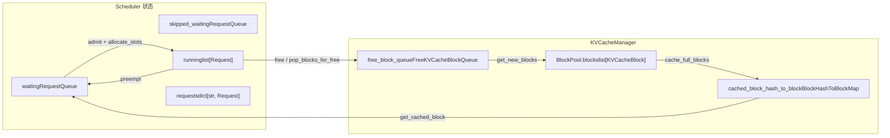
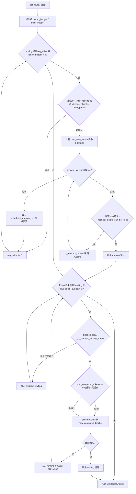

# Capítulo 4: Agendador: processamento em lote contínuo e orquestração de requisições ciente da memória de vídeo

Após a requisição entrar na fila de entrada do EngineCore, ela não será executada imediatamente. Quais requisições processar em cada passo, quantos tokens de orçamento alocar para cada requisição, e quem sacrificar primeiro quando a memória de vídeo for insuficiente — essas decisões estão concentradas no método`Scheduler.schedule()`. Este capítulo começa pelas estruturas de dados do agendador e rastreia como uma chamada`schedule()`organiza a fila waiting, a lista running e o pool de KV cache em um lote executável.

# 4.1 Estruturas de dados do agendador: três filas e um pool de memória de vídeo

A pergunta central que o agendador precisa responder é:**Sob um orçamento limitado de tokens e de KV blocks, quais requisições devem avançar quantos tokens neste passo?**Para entendê-lo, primeiro é preciso ver claramente quais estados ele tem em mãos.

O agendador mantém três tipos de contêineres de requisições.`self.requests`é um dicionário global,`req_id -> Request`, a única fonte de verdade para todas as requisições ativas[FACT:vllm/v1/core/sched/scheduler.py:208-209]。`self.waiting`e`self.skipped_waiting`são duas filas de prioridade; a primeira contém requisições aguardando agendamento normal, e a segunda contém requisições temporariamente não agendáveis por dependências assíncronas ou restrições (como aguardar KV remoto, aguardar compilação da gramática de saída estruturada)[FACT:vllm/v1/core/sched/scheduler.py:208-209]。`self.running`é uma lista comum, armazenando requisições que já entraram no estado de execução e possuem KV blocks[FACT:vllm/v1/core/sched/scheduler.py:208-209]。

Há aqui um design facilmente ignorado:`max_num_running_reqs`e`max_num_active_reqs`são dois limites diferentes. O primeiro vem de`max_num_seqs`, determinando o número de slots do model runner; o segundo vem de`max_num_active_seqs`, limitando apenas o número de requisições que podem entrar em RUNNING, por padrão igual ao primeiro[FACT:vllm/v1/core/sched/scheduler.py:123-131]. Essa separação permite reduzir o tamanho efetivo do lote de decodificação concorrente sem diminuir a capacidade de captura do CUDA graph.

O lado da memória de vídeo é gerenciado de forma unificada por`KVCacheManager`, que internamente mantém`BlockPool`。`BlockPool`O núcleo de`self.blocks`é`KVCacheBlock`(uma lista de todos os`free_block_queue`) e[FACT:vllm/v1/core/block_pool.py:171-177](uma lista duplamente ligada de blocos livres ordenada por ordem de evicção)`null_block`. Observe a existência de`is_null=True`: é o primeiro bloco retirado da cabeça da fila de livres,[FACT:vllm/v1/core/block_pool.py:183-187], a contagem de referências não participa da manutenção regular, sendo usada exclusivamente como placeholder

. Quando uma posição de token de uma requisição não precisa de um KV block real (por exemplo, uma posição ignorada pela janela deslizante), preenche-se esse null block na block table.`BlockHashToBlockMap`A estrutura de índice do cache de prefixo é`BlockHashWithGroupId`, que mapeia`KVCacheBlock`para um`{block_id: KVCacheBlock}`ou um dicionário[FACT:vllm/v1/core/block_pool.py:56-59]. Por que usar tipos união? O comentário dá a resposta: a maioria dos hashes corresponde a apenas um bloco, e usar um dicionário geraria sobrecarga desnecessária de GC; somente quando o mesmo hash é compartilhado por múltiplos blocos é que se promove para dicionário[FACT:vllm/v1/core/block_pool.py:56-59]. Este é um trade-off típico de trocar complexidade de tipos por sobrecarga em tempo de execução.

`KVCacheBlocks`é o objeto de interface entre o escalonador e o gerenciador de KV cache, que oculta as estruturas de dados internas. Seu`blocks`campo é`tuple[Sequence[KVCacheBlock], ...]`, a dimensão externa é o KV cache group, a interna é a sequência de blocos[FACT:vllm/v1/core/kv_cache_manager.py:41-54]. O comentário explica explicitamente por que não usar blocos como dimensão externa: isso assumiria que todos os groups têm o mesmo número de blocos, mas no futuro pode-se configurar block sizes diferentes para groups diferentes[FACT:vllm/v1/core/kv_cache_manager.py:43-48]。



Este diagrama ancora o fluxo de dados entre o escalonador e o pool de memória de vídeo: as requisições da fila waiting entram em running através de`allocate_slots`, as requisições em running retornam para waiting quando são preemptadas, os blocos liberados retornam para a fila de ociosos, e a tabela hash de cache de prefixo é a porta de entrada para requisições em waiting acertarem o cache.

# 4.2 Fluxo principal de schedule(): running prioritário, waiting complementar, preempção como fallback

`schedule()`é o método central de todo o escalonador, ele retorna um`SchedulerOutput`, descrevendo o que deve ser executado neste passo. O comentário no início do método aponta a filosofia de design: no escalonador não há distinção entre "fase de decodificação" e "fase de pré-preenchimento", cada requisição tem apenas`num_computed_tokens`e`num_tokens_with_spec`, e a tarefa do escalonador é fazer o primeiro alcançar o segundo[FACT:vllm/v1/core/sched/scheduler.py:559-568]. Essa visão unificada é a base para que chunked prefill, prefix caching e decodificação especulativa possam coexistir.

## 4.2.1 Inicialização de orçamento e cálculo de limiares

Antes de entrar no loop principal, o escalonador define dois orçamentos:`token_budget`inicializado como`max_num_scheduled_tokens`，`input_budget`inicializado como`max_num_batched_tokens` [FACT:vllm/v1/core/sched/scheduler.py:577-580]. Ambos geralmente são iguais, mas quando o modelo pode adicionar tokens no lote (como na decodificação especulativa),`max_num_scheduled_tokens`será menor que`max_num_batched_tokens`, e a diferença é o espaço reservado para draft tokens.

`long_prefill_token_threshold`O tratamento de[FACT:vllm/v1/core/sched/scheduler.py:606-616]merece atenção separada. Sua função é evitar que um prefill longo mate de fome outras requisições, mas se houver apenas uma requisição no momento, ninguém passará fome, então o limiar é zerado`adaptive_long_prefill_threshold`. Quando`input_budget // num_eligible_reqs`está ativado, o limiar também é elevado para[FACT:vllm/v1/core/sched/scheduler.py:617-622]。

## , garantindo que o orçamento de uma única requisição não seja comprimido abaixo da cota justa

4.2.2 Loop de escalonamento de requisições running`self.running`O loop principal percorre a partir do início de`req_index`, sendo[FACT:vllm/v1/core/sched/scheduler.py:624-627]o cursor

- . Para cada requisição, primeiro faz uma série de verificações de salto:`max_tokens`Sob escalonamento assíncrono, se o placeholder de saída da requisição indicar que ela já atingiu[FACT:vllm/v1/core/sched/scheduler.py:631-645]。
- , pula para evitar executar um passo a mais`next_decode_eligible_step`No cenário V2 + PP + assíncrono, se o passo atual ainda não chegou a[FACT:vllm/v1/core/sched/scheduler.py:647-651]。
- , pula para corresponder ao ritmo de broadcast de tokens de amostragem do lado do worker[FACT:vllm/v1/core/sched/scheduler.py:653-657]。

Quando o balanceamento de prefill DP está ativado, chunks de prefill em passos não alinhados ao ritmo são adiados

```
num_new_tokens = request.num_tokens_with_spec
               + request.num_output_placeholders
               - request.num_computed_tokens
```

Copiar`long_prefill_token_threshold`、`token_budget`、`input_budget - draft_slots`Em seguida, é restringido sucessivamente por`max_model_len`e[FACT:vllm/v1/core/sched/scheduler.py:670-688]. Se a requisição tiver entrada de encoder, ainda passa pelo ajuste de`_try_schedule_encoder_inputs`A seguir vem o passo mais crítico: alocar KV block.[FACT:vllm/v1/core/sched/scheduler.py:700-712]。

é envolvido em um loop`allocate_slots``while True`. Se retornar[FACT:vllm/v1/core/sched/scheduler.py:742-747], significa memória de vídeo insuficiente, e o escalonador inicia a preempção: seleciona a vítima de acordo com a política (a estratégia PRIORITY escolhe a de menor prioridade, a estratégia FCFS escolhe a do final da lista running)`None`, chama[FACT:vllm/v1/core/sched/scheduler.py:761-767]para expulsá-la de volta à fila waiting, e então tenta a alocação novamente`_preempt_request`. Se a vítima for a própria requisição atual, significa que não há mais objetos para preemptar, sai do loop, e a requisição atual também não pode ser escalonada[FACT:vllm/v1/core/sched/scheduler.py:801-806]Há um detalhe refinado na lógica de preempção: sob a estratégia PRIORITY, se a requisição preemptada já está em[FACT:vllm/v1/core/sched/scheduler.py:807-813]。

(ou seja, os recursos já foram alocados para ela neste passo), é necessário devolver todo o seu orçamento de tokens, blocks, tokens especulativos e orçamento de encoder`scheduled_running_reqs`. Isso garante a consistência do livro-razão de orçamento.[FACT:vllm/v1/core/sched/scheduler.py:779-797]Após a alocação bem-sucedida, a requisição é adicionada a

, registrando blocks e número de tokens, deduzindo o orçamento`scheduled_running_reqs`. Tokens relacionados à decodificação especulativa são cortados e registrados aqui[FACT:vllm/v1/core/sched/scheduler.py:815-823]4.2.3 Admissão de requisições waiting[FACT:vllm/v1/core/sched/scheduler.py:825-841]。

## Após o término do loop running, se não houve preempção neste passo e o escalonador não está pausado, começa-se a processar a fila waiting

. Antes da admissão, verificam-se dois limites:[FACT:vllm/v1/core/sched/scheduler.py:868-872]e`max_num_active_reqs`O escalonamento de requisições waiting tem um passo a mais de busca no cache de prefixo em relação a running. Quando`input_budget` [FACT:vllm/v1/core/sched/scheduler.py:873-879]。

, chama-se`request.num_computed_tokens == 0`para buscar acerto no cache local`_get_local_prefix_cache_hit`. Se um KV connector estiver configurado, também se consulta o acerto no cache remoto[FACT:vllm/v1/core/sched/scheduler.py:932-939]Aqui há uma lógica refinada para tratar conflitos entre acertos locais e remotos. O acerto local pode não estar alinhado a blocos ([FACT:vllm/v1/core/sched/scheduler.py:942-954]。

), e se o acerto remoto exceder estritamente o acerto local completo, descarta-se a cauda do sub-bloco local, deixando o carregamento remoto sobrescrevê-la, evitando copy-on-write`partial_tail`. Caso contrário, mantém-se a cauda local e não se carrega o externo[FACT:vllm/v1/core/sched/scheduler.py:977-988]Após a admissão bem-sucedida, a requisição é removida da fila waiting, o estado é definido como RUNNING, e ela é adicionada à lista running[FACT:vllm/v1/core/sched/scheduler.py:989-995]。

. Se após este passo ela ainda estiver em prefill ([FACT:vllm/v1/core/sched/scheduler.py:1263-1319]), adiciona-se ao conjunto`num_computed_tokens + num_new_tokens < request.num_tokens``_inflight_prefills`Copiar[FACT:vllm/v1/core/sched/scheduler.py:1326-1328]。



os dois grandes loops e o ramo de preempção de`schedule()`. Observe o caminho de retentativa de preempção após falha de`allocate_slots`no loop running, e a movimentação de requisições em estado blocked no loop waiting para`skipped_waiting`bypass de.

# 4.3 O núcleo da percepção de memória de vídeo: allocate_slots e preempção

`allocate_slots`é o portão entre o agendador e a memória de vídeo. Sua lista de parâmetros é, por si só, um registro contábil da memória de vídeo:`num_new_tokens`é o número de tokens a serem recalculados,`num_new_computed_tokens`é o número de tokens recém-acertados no cache de prefixo,`num_external_computed_tokens`é o número de acertos externos fornecidos pelo connector,`num_lookahead_tokens`são os slots reservados para decodificação especulativa[FACT:vllm/v1/core/kv_cache_manager.py:371-383]。

O comentário no início do método descreve com precisão o layout dos blocos usando um diagrama ASCII[FACT:vllm/v1/core/kv_cache_manager.py:417-438]：

```
|  |  |   |   |  |
                                          |        |
                        |                       |
```

`comp`são tokens já calculados,`new_comp`é acerto no cache de prefixo,`ext_comp`é acerto externo,`new`é o novo cálculo deste passo,`lookahead`é a reserva especulativa. A alocação é dividida em três fases: primeiro liberar blocos desnecessários e verificar se há blocos livres suficientes, depois processar os tokens de prefixo e, por fim, alocar blocos para os tokens recém-calculados[FACT:vllm/v1/core/kv_cache_manager.py:458-461]。

## 4.3.1 Linha de nível d'água e controle de admissão

`allocate_slots`há dois portões de admissão. O primeiro é`full_sequence_must_fit`: quando ativado, primeiro verifica se toda a sequência da requisição (e não apenas o primeiro chunk) cabe; se não couber, retorna diretamente`None` [FACT:vllm/v1/core/kv_cache_manager.py:515-531]. Isso evita que, sob chunked prefill, a admissão excessiva cause oscilação no KV cache.

O segundo é a linha de nível d'água.`watermark_blocks`só entra em vigor quando o estado da requisição é WAITING ou PREEMPTED e já há requisições agendadas[FACT:vllm/v1/core/kv_cache_manager.py:506-513]. Ela exige que, após a alocação, seja mantida ao menos uma certa proporção de blocos livres, evitando evicções e preempções frequentes.`reserved_blocks`é usada em cenários de carregamento assíncrono de KV, garantindo que os blocos reservados para prefill em andamento não sejam consumidos por novas requisições[FACT:vllm/v1/core/kv_cache_manager.py:564-570]。

## 4.3.2 O custo e a recuperação da preempção

> **[Design Inference & Architectural Trade-offs]**
> `_preempt_request`fez algo aparentemente brutal, mas necessário: redefinir o`num_computed_tokens`da requisição para 0[FACT:vllm/v1/core/sched/scheduler.py:1560-1561]. Isso significa que uma requisição preemptada precisará refazer o prefill do zero na próxima vez que for agendada. Por que foi projetado assim? Porque o KV block do vLLM é privado da requisição; na preempção, todos os blocos devem ser liberados e, após a liberação, não há garantia de obter os mesmos blocos na realocação, então só resta recalcular do início. A existência do cache de prefixo compensa parcialmente esse custo: se o prefixo da requisição preemptada já estiver em cache, ao reagendar será possível acertar o cache, sem precisar realmente recalcular.

A preempção também trata o problema de "saída obsoleta" sob agendamento assíncrono.`num_stale_output_tokens`é definido como`num_in_flight_tokens`, marcando todas as saídas em andamento como obsoletas[FACT:vllm/v1/core/sched/scheduler.py:1571-1574]. Esses tokens ainda serão entregues (descartá-los perturbaria a taxa de aceitação da decodificação especulativa), mas não modificarão os contadores após a redefinição.`drop_stale_output`o flag determina se deve descartar ou entregar[FACT:vllm/v1/core/sched/scheduler.py:1539-1547]。

## 4.3.3 Liberação atrasada: o risco de write-after-read em connectors assíncronos

Ao usar um KV connector e havendo múltiplos lotes em andamento,`defer_block_free`é definido como`True` [FACT:vllm/v1/core/sched/scheduler.py:175-181]. O motivo é: um passo ainda pode estar gravando nos blocos KV de uma requisição já liberada, enquanto o connector consumidor pode realocar e preencher esses blocos por meio de um carregamento não ordenado em relação a essa gravação.

A liberação atrasada é implementada por meio de`deferred_frees`uma deque dupla, em que cada entrada é`(fence_seq, blocks)` [FACT:vllm/v1/core/sched/scheduler.py:388-390]。`_free_request_blocks`verifica`_request_blocks_can_be_freed`, se o último passo de agendamento da requisição ainda não tiver sido processado, coloca os blocos na fila de atraso[FACT:vllm/v1/core/sched/scheduler.py:2679-2688]。`_drain_deferred_frees`em`update_from_output`avança`processed_step_seq`e depois chama, liberando os blocos cujo fence já foi satisfeito[FACT:vllm/v1/core/sched/scheduler.py:2701-2706]。

# 4.4 Determinação de acerto no cache de prefixo e ciclo de vida dos blocos

A entrada de busca do cache de prefixo é`KVCacheManager.get_computed_blocks`. Primeiro verifica se o cache está habilitado e se a requisição não está marcada para pular a leitura[FACT:vllm/v1/core/kv_cache_manager.py:286-287]. Em seguida, chama`coordinator.find_longest_cache_hit`, passando`request.block_hashes`e`max_cache_hit_length = request.num_tokens - 1` [FACT:vllm/v1/core/kv_cache_manager.py:295-300]。

Por que`num_tokens - 1`? O comentário explica: quando todos os tokens acertam o cache, é necessário recalcular o último token para obter os logits[FACT:vllm/v1/core/kv_cache_manager.py:289-294]. Esse é um limite fácil de ignorar: mesmo que o prefixo acerte completamente, pelo menos um token deve ser calculado.

O ciclo de vida dos blocos é gerenciado por`BlockPool`.`get_new_blocks`remove um bloco da cabeça da fila de livres; se o cache estiver habilitado, primeiro chama`_maybe_evict_cached_block`para limpar seus metadados de hash e, em seguida, incrementa a contagem de referências[FACT:vllm/v1/core/block_pool.py:683-702]。`free_blocks`decide, com base em o bloco ter hash ou não, se o devolve à cabeça ou ao fim da fila: blocos sem hash são reutilizados em LIFO (melhor localidade de GPU), blocos com hash são reutilizados em FIFO (comportamento de evicção LRU)[FACT:vllm/v1/core/block_pool.py:785-805]。

`cache_full_blocks`é o momento em que um bloco é escrito na tabela hash do cache de prefixo. Ele percorre os blocos recém-completados, ignora blocos null e blocos mascarados, calcula o hash de cada bloco e insere em`cached_block_hash_to_block` [FACT:vllm/v1/core/block_pool.py:272-300]. Se o bloco já tiver hash (cenário em que um bloco parcial é promovido a bloco cheio), primeiro remove o hash antigo e depois insere o novo hash[FACT:vllm/v1/core/block_pool.py:285-293]。

`touch`o método trata a contagem de referências em caso de acerto no cache: se o bloco estiver na fila de livres (`ref_cnt == 0`), primeiro o remove da fila e depois incrementa a contagem de referências[FACT:vllm/v1/core/block_pool.py:754-770]. Isso garante que blocos acertados não sejam evictados.

# Reflexões de design

> **[Design Inference & Architectural Trade-offs]**
> **Por que a preempção escolhe "recalcular do zero" em vez de "retenção parcial"?**A retenção parcial exigiria registrar a posição física dos blocos de cada requisição no momento da preempção e tentar restaurar o mapeamento ao reagendar. Mas o pool de blocos é compartilhado globalmente, e outras requisições podem já ter ocupado esses blocos. A complexidade e o custo de memória de manter esse mapeamento superam o custo do recálculo, especialmente quando o cache de prefixo consegue acertar a maior parte do prefixo.

> **[Design Inference & Architectural Trade-offs]**
> **Por que a linha de nível d'água é 0 por padrão?**A linha de nível d'água é um seguro contra preempções frequentes, mas ao custo de sacrificar a utilização da memória de vídeo. Desativá-la por padrão significa que o vLLM prioriza throughput em vez de estabilidade, e o usuário precisa ativá-la conforme as características da carga.

> **[Design Inference & Architectural Trade-offs]**
> **`skipped_waiting`o significado da existência da fila.**Sem essa fila, as requisições bloqueadas ocupariam permanentemente a cabeça da fila waiting, impedindo que as requisições seguintes fossem escalonadas (sob a política FCFS). Ao separá-la, o escalonador pode pular as requisições bloqueadas e continuar processando as seguintes, enquanto preserva o estado das requisições bloqueadas para posterior promoção.

# Resumo do capítulo

O núcleo do escalonador é o`schedule()`método com dois loops: o loop running prioriza garantir o avanço das requisições já em execução, e o loop waiting admite novas requisições quando o orçamento permite. Quando a memória de vídeo é insuficiente, abre-se espaço por meio da preempção da requisição de menor prioridade na lista running; a requisição preemptada tem seu`num_computed_tokens`redefinido para 0, mas o cache de prefixo pode compensar parte do custo de recálculo.`allocate_slots`é o portão da memória de vídeo, através de`full_sequence_must_fit`, linha d'água e`reserved_blocks`três camadas de controle de admissão para evitar superalocação. O cache de prefixo é compartilhado entre requisições por meio de índice de hash de bloco, e a determinação de acerto tem como limite superior`num_tokens - 1`para garantir que pelo menos um token seja calculado e obtenha logits.

# Reflexão e autoavaliação do capítulo

Q1: No`schedule()`loop running de`allocate_slots`, se`None`retornar`_request_blocks_can_be_freed`e`False`retornar para a vítima`break`, o código`_preempt_request`sai do loop. Se essa verificação for removida e

**for chamado diretamente, em qual cenário isso causaria inconsistência de estado?**：`_request_blocks_can_be_freed`Análise de referência`request.last_sched_seq <= self.processed_step_seq` [FACT:vllm/v1/core/sched/scheduler.py:2672-2677]verifica`defer_block_free`. Quando`_free_request_blocks`está habilitado, se o último passo de escalonamento da vítima ainda não tiver sido processado, seus blocos podem ainda estar sendo escritos por passos de GPU em trânsito. A preempção direta chamaria`_request_blocks_can_be_freed`, e este, quando`False`é`deferred_frees`, colocaria os blocos em[FACT:vllm/v1/core/sched/scheduler.py:2679-2688]em vez de liberá-los imediatamente`allocate_slots`. Mas a semântica da preempção é "liberar blocos imediatamente para a requisição atual", e a liberação atrasada não satisfaz essa necessidade,

Q2: `get_computed_blocks`falharia novamente, formando um loop infinito. Mais grave ainda, se os blocos da vítima forem liberados com atraso e depois alocados pela requisição atual, enquanto a GPU ainda estiver escrevendo nos blocos da vítima, ocorreria uma condição de corrida de dados.`max_cache_hit_length = request.num_tokens - 1`em`request.num_tokens`. Se for alterado para

**, em quais circunstâncias isso causaria saída incorreta?**Análise de referência`num_computed_tokens`: quando todos os tokens da requisição acertam o cache,`num_tokens`será igual a[FACT:vllm/v1/core/kv_cache_manager.py:289-294]. Nesse momento, o escalonador considera que nenhum novo token precisa ser calculado, mas a amostragem de logits requer o estado oculto da última posição, e o estado oculto vem da propagação direta. Se nenhum token for calculado, não haverá logits para amostrar, e a requisição ficará travada ou produzirá saída incorreta. O comentário explica isso claramente`allocate_slots`. Além disso,`num_computed_tokens`exige que

Q3: `_preempt_request`esteja alinhado ao tamanho do bloco; recalcular o último token pode disparar o recálculo de todo o bloco, o que é uma limitação conhecida da implementação atual.`num_computed_tokens`redefine`request.num_tokens`para 0, mas preserva

**(prompt + tokens já gerados). Se, ao reescalonar uma requisição preemptada, o cache de prefixo não acertar, quantos tokens ela precisa recalcular? Se acertar, quantos podem ser economizados?**：`num_computed_tokens = 0`Análise de referência[FACT:vllm/v1/core/sched/scheduler.py:1561]。`request.num_tokens`significa que, ao reescalonar, começa-se do primeiro token`num_tokens`permanece inalterado, incluindo o prompt original e os tokens de saída já gerados. Se o cache de prefixo não acertar, é preciso recalcular o prefill de todos os`get_computed_blocks`tokens. Se acertar,`num_computed_tokens`retornará os blocos que acertaram,[FACT:vllm/v1/core/kv_cache_manager.py:296-300]começa a partir da posição de acerto`num_tokens`. Observe que os tokens de saída da requisição preemptada também estão em`max_cache_hit_length = num_tokens - 1`; seus hashes de prefixo já foram armazenados em cache no momento da geração (se habilitado), então, ao reescalonar, os prefixos desses tokens de saída também podem acertar. Mas

significa que o último token sempre precisa ser recalculado.`SchedulerOutput`A saída do escalonador`SchedulerOutput`especifica claramente o conteúdo de execução deste passo: IDs de bloco da nova requisição, número de tokens da requisição em cache, tokens especulativos, entrada do codificador etc. O próximo capítulo rastreará como essa saída é consumida pelo ModelRunner, desde
