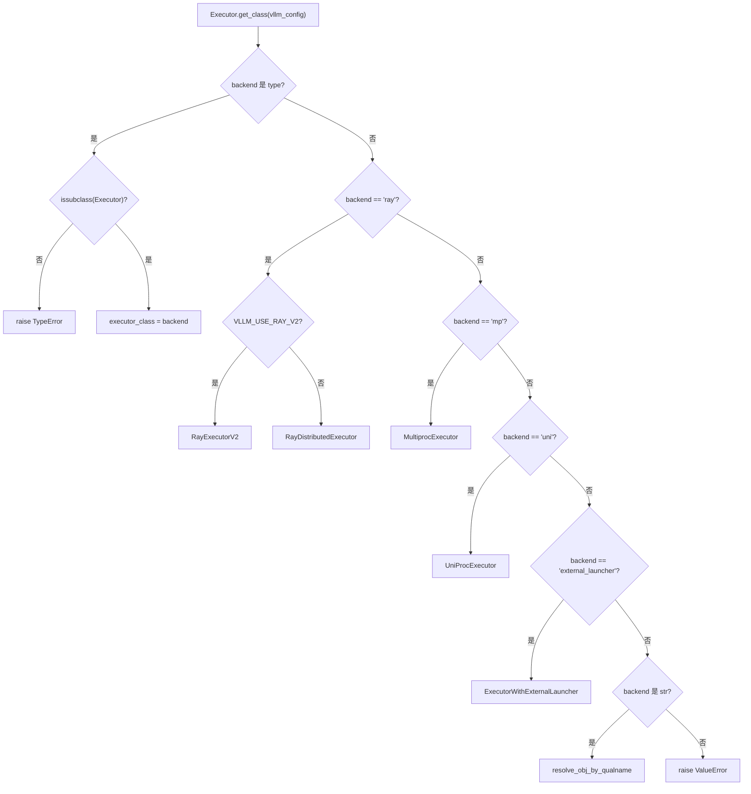
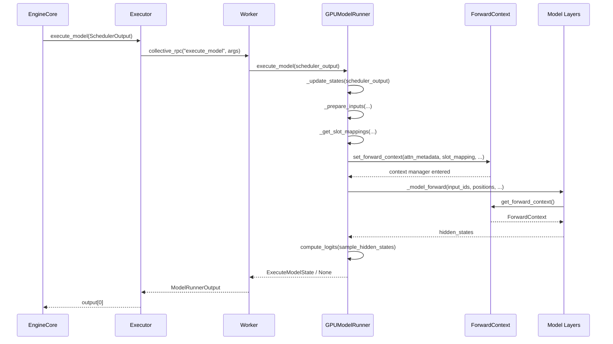

# Próximo capítulo: Capítulo 5 →

Status de verificação: linhas FACT com ancoragem real

# No capítulo anterior, vimos que o Scheduler, em cada passo do loop de escalonamento, decide quais requisições entram na fila running, quais são preemptadas, quais aguardam por falta de memória de vídeo e, por fim, produz um SchedulerOutput — que descreve o que deve ser calculado neste passo: quais requisições, quantos tokens cada uma, quais blocos KV usar. Mas essa lista é apenas intenção lógica; a GPU precisa de tensores físicos. Este capítulo rastreia como o SchedulerOutput é distribuído pelo Executor aos Workers e então traduzido pelo GPUModelRunner em entradas executáveis pela GPU, como input_ids, positions, slot_mapping e block table, e finalmente, por meio do forward_context, injeta a descrição de lote compartilhada entre camadas em cada camada do modelo, completando a travessia da decisão de escalonamento até a propagação direta.

## 5.1 Executor: enviar o resultado do escalonamento para cada placa

`Executor`Modelo intuitivo`SchedulerOutput`Serializar o passado — a lógica de agendamento ficaria entrelaçada com a topologia distribuída.`Executor`Extrair essa responsabilidade: o EngineCore apenas chama`execute_model(scheduler_output)`, e o restante — «para quem enviar, como enviar, quantos resultados receber» — é decidido pelo Executor.

## Hierarquia de classes e campos

`Executor`é uma classe base abstrata cujos campos de nível de classe codificam diretamente as capacidades do backend[FACT:vllm/v1/executor/abstract.py:48-49]：

```python
uses_ray: bool = False  # whether the executor uses Ray for orchestration.
supports_pp: bool = False  # whether the executor supports PP
```

Estes dois sinalizadores não são decorativos — o código das camadas superiores lê-os para decidir se ativa determinados caminhos de otimização.`__init__`Em são inicializados`sleeping_tags`、`kv_output_aggregator`、`ec_output_aggregator`três campos de estado[FACT:vllm/v1/executor/abstract.py:119-120], usados respetivamente para rastreamento de etiquetas do modo de suspensão, agregação de saída do conector KV e agregação de saída do conector do codificador.

## Seleção de backend:`get_class`O encaminhamento de ramos de

`get_class`é uma fábrica estática que, com base na configuração`distributed_executor_backend`, devolve a classe Executor concreta[FACT:vllm/v1/executor/abstract.py:51-96]. A sua estrutura de ramos merece uma análise detalhada:

- Se a própria configuração for um`type`, valida se é uma subclasse de`Executor`e usa-a diretamente[FACT:vllm/v1/executor/abstract.py:52-61]；
- `"ray"`Sob o ramo existem ainda sub-ramos:`VLLM_USE_RAY_V2_EXECUTOR_BACKEND`quando é verdadeiro usa-se`RayExecutorV2`, caso contrário usa-se`RayDistributedExecutor` [FACT:vllm/v1/executor/abstract.py:64-72]；
- `"mp"`mapeia para`MultiprocExecutor`，`"uni"`mapeia para`UniProcExecutor` [FACT:vllm/v1/executor/abstract.py:73-80]；
- Backends personalizados em forma de string são resolvidos dinamicamente através de`resolve_obj_by_qualname`resolução dinâmica[FACT:vllm/v1/executor/abstract.py:85-90]。



## Passo a passo: o fluxo de chamada de um`execute_model`Cenário: o EngineCore conclui um passo de agendamento, obtém

, chama`SchedulerOutput`A implementação de é extremamente simples`executor.execute_model(scheduler_output)`。

`Executor.execute_model`Copiar[FACT:vllm/v1/executor/abstract.py:237-238]：

```python
def execute_model(
    self, scheduler_output: SchedulerOutput, non_block: bool = False
) -> ModelRunnerOutput | None | Future[ModelRunnerOutput | None]:
    output = self.collective_rpc(
        "execute_model", args=(scheduler_output,), non_block=non_block
    )
    return output[0]
```

> **[Design Inference & Architectural Trade-offs]**
> — este difunde o nome do método e os parâmetros para todos os Workers, recolhe a lista de valores de retorno de cada Worker e depois`collective_rpc`apenas recolhe o primeiro. Porquê apenas o primeiro? Porque sob paralelismo tensorial todos os Workers executam a mesma passagem forward lógica, e as saídas são semanticamente equivalentes; o resultado de amostragem é determinado pelo último estágio PP ou pelo rank 0, e recolher`output[0]`evita agregação duplicada.`output[0]`A documentação de recomenda explicitamente «enviar apenas mensagens de controlo; a comunicação do plano de dados é estabelecida separadamente»`collective_rpc`, e é precisamente esse o posicionamento de[FACT:vllm/v1/executor/abstract.py:220-221]— é uma mensagem de controlo; os dados reais de tokens circulam dentro dos Workers através de tensores GPU.`SchedulerOutput`segue o mesmo padrão

`sample_tokens`, mas o tipo de retorno não inclui[FACT:vllm/v1/executor/abstract.py:257-258]— a amostragem produz necessariamente um resultado. A divisão de trabalho entre estes dois métodos corresponde ao design de «separação execução-amostragem» do vLLM v1:`None`pode devolver`execute_model`(indicando que o forward foi submetido mas a amostragem foi adiada), e nesse caso o estado é temporariamente armazenado em`None`.`ExecuteModelState`Reflexão de design

## é declarado como

`collective_rpc`, o que significa que cada backend deve implementar por si «como enviar o RPC ao Worker».`@abstractmethod` [FACT:vllm/v1/executor/abstract.py:186-192]usa filas de memória partilhada,`MultiprocExecutor`usa chamadas a atores Ray,`RayDistributedExecutor`faz chamadas locais diretas. Esta abstração faz com que o código das camadas superiores não precise de se preocupar minimamente com detalhes distribuídos.`UniProcExecutor`Um detalhe fácil de ignorar:

está marcado como`supported_tasks`, e o comentário diz explicitamente «evitar chamadas RPC desnecessárias». Porque`@cached_property` [FACT:vllm/v1/executor/abstract.py:306-309]requer comunicação entre processos, e a lista de tarefas não muda durante o ciclo de vida do modelo, a cache é uma otimização correta e necessária.`get_supported_tasks`5.2 GPUModelRunner: de SchedulerOutput para tensores de entrada

# Modelo intuitivo

## é o «tradutor»: traduz a descrição lógica em

`GPUModelRunner`(IDs de pedido, número de tokens, IDs de blocos) para tensores físicos que a GPU pode consumir diretamente. Sem ele, a camada do modelo teria de lidar sozinha com questões como «em que slot KV está o 7.º token do 3.º pedido» — o que seria uma fuga de responsabilidades catastrófica.`SchedulerOutput`Estado central e disposição de memória

## herda de três Mixins

`GPUModelRunner`, que fornecem respetivamente capacidades de adaptação LoRA, conector KV e conector do codificador.[FACT:vllm/v1/worker/gpu_model_runner.py:479-480]：`LoRAModelRunnerMixin`、`KVConnectorModelRunnerMixin`、`ECConnectorModelRunnerMixin`Em são armazenados em cache todos os objetos de configuração

`__init__`, e são inicializados vários sinalizadores-chave:[FACT:vllm/v1/worker/gpu_model_runner.py:488-498]: apenas quando o paralelismo de dados > 1 e o modelo é MoE, consulta se o gestor EP all2all suporta tolerância a falhas

- `check_ep_fault`: determinado por[FACT:vllm/v1/worker/gpu_model_runner.py:507-509]；
- `is_pooling_model`: se a entrada de prompt embedding está ativada`runner_type == "pooling"`é um[FACT:vllm/v1/worker/gpu_model_runner.py:515]；
- `enable_prompt_embeds`, que transporta o estado temporário entre[FACT:vllm/v1/worker/gpu_model_runner.py:516]。

`ExecuteModelState`e`NamedTuple`. O design dos seus campos revela a essência da separação execução-amostragem:`execute_model()`é o produto do forward,`sample_tokens()`são os metadados ainda necessários na fase de amostragem. O comentário afirma explicitamente que este é «o estado de cache temporário transmitido após execute_model() devolver None»[FACT:vllm/v1/worker/gpu_model_runner.py:463-476]Como sincronizar o estado da cache`logits`、`hidden_states`、`sample_hidden_states`Cenário: o agendador decide que neste passo serão processados os pedidos A (novo pedido), B (continuação do decode do passo anterior) e C (recuperado após preempção), enquanto o pedido D já foi concluído.`spec_decode_metadata`、`slot_mappings`Primeiro passo: limpar pedidos concluídos.[FACT:vllm/v1/worker/gpu_model_runner.py:464-464]。

## Step-by-Step：`_update_states`percorre

, remove o estado do dicionário

**, remove de**. Note o caso-limite indicado no comentário:`finished_req_ids`e`self.requests`podem sobrepor-se — quando um pedido é abortado e depois reenviado com o mesmo ID, são tratados como dois pedidos distintos`input_batch`Segundo passo: zerar os blocos KV recém-alocados.[FACT:vllm/v1/worker/gpu_model_runner.py:1202-1217]Se`finished_req_ids`não estiver vazio, chama`scheduled_req_ids`para zerar a memória da GPU, evitando que NaN obsoletos contaminem os cálculos de atenção ou SSM[FACT:vllm/v1/worker/gpu_model_runner.py:1211-1215]。

**. Este é o pré-requisito de segurança para a reutilização de blocos do PagedAttention.**Terceiro passo: calcular o conjunto de pedidos não agendados.`new_block_ids_to_zero`Este é o passo mais propenso a erros`_zero_block_ids`Copiar[FACT:vllm/v1/worker/gpu_model_runner.py:1219-1222]O comentário explica porque é

**e não diretamente**: normalmente[FACT:vllm/v1/worker/gpu_model_runner.py:1238-1247]：

```python
scheduled_req_ids = scheduler_output.num_scheduled_tokens.keys()
cached_req_ids = self.input_batch.req_id_to_index.keys()
resumed_req_ids = scheduler_output.scheduled_cached_reqs.resumed_req_ids
unscheduled_req_ids = cached_req_ids - (scheduled_req_ids - resumed_req_ids)
```

não se intersectam, mas no cenário de preempção forçada desencadeado por`scheduled_req_ids - resumed_req_ids`, os pedidos recuperados precisam primeiro de ser removidos do lote persistente e depois readicionados`scheduled_req_ids`Quarto passo: processar novos pedidos.`cached_req_ids`Para cada`resumed_req_ids`, constrói`reset_prefix_cache`. Se o tipo de amostragem for[FACT:vllm/v1/worker/gpu_model_runner.py:1241-1246]。

**, cria**com seed. Se o modelo usar M-RoPE, chama`scheduled_new_reqs`para pré-calcular as posições`CachedRequestState` [FACT:vllm/v1/worker/gpu_model_runner.py:1295-1308]Quinto passo: atualizar pedidos em execução.`RANDOM_SEED`Para cada`torch.Generator` [FACT:vllm/v1/worker/gpu_model_runner.py:1277-1284], atualiza`_init_mrope_positions`, trata da adição ou substituição de IDs de blocos[FACT:vllm/v1/worker/gpu_model_runner.py:1319-1321]。

**. Se o pedido não estiver no lote persistente (**), adiciona a`scheduled_cached_reqs`Sexto passo: compressão e reordenação.`num_computed_tokens` [FACT:vllm/v1/worker/gpu_model_runner.py:1402]，处理块 ID 追加或替换 [FACT:vllm/v1/worker/gpu_model_runner.py:1437-1448]。若请求不在持久批中（`req_index is None`），加入 `reqs_to_add` [FACT:vllm/v1/worker/gpu_model_runner.py:1450-1465]。

**第六步：压缩与重排。** `condense()`Preencher os vazios deixados pelas requisições de remoção[FACT:vllm/v1/worker/gpu_model_runner.py:1511-1512]，`_may_reorder_batch`Permitir que o backend de atenção reorganize sob demanda[FACT:vllm/v1/worker/gpu_model_runner.py:1513-1514]，`refresh_metadata()`Atualizar os metadados do lote[FACT:vllm/v1/worker/gpu_model_runner.py:1515-1516]。

## Preparação dos tensores de entrada:`_prepare_input_ids`Caminho rápido assíncrono de

`_prepare_input_ids`Lidar com um problema sutil: sob agendamento assíncrono, o token de amostragem da etapa anterior ainda está na GPU, e os`input_ids`desta etapa precisam preenchê-los[FACT:vllm/v1/worker/gpu_model_runner.py:1767-1772]。

Caminho normal (`prev_sampled_token_ids is None`) copia diretamente o tensor da CPU para a GPU[FACT:vllm/v1/worker/gpu_model_runner.py:1788-1794]. O caminho assíncrono percorre as requisições, calculando o índice do último token de cada requisição no`input_ids`achatado[FACT:vllm/v1/worker/gpu_model_runner.py:1809-1836]. Os comentários fornecem exemplos concretos:`cu_num_tokens = [2, 5, 8]`、`draft_tokens = [1, 2, 2]`quando,`sample_flattened_indices = [0, 2, 5]`，`spec_flattened_indices = [1, 3, 4, 6, 7]` [FACT:vllm/v1/worker/gpu_model_runner.py:1820-1822]。

há uma otimização crucial[FACT:vllm/v1/worker/gpu_model_runner.py:1859-1868]：

```python
if common_indices_match and max_flattened_index == (num_common_tokens - 1):
    self.input_ids.gpu[:num_common_tokens].copy_(
        self.input_batch.prev_sampled_token_ids[:num_common_tokens, 0],
        non_blocking=True,
    )
    return
```

Quando o lote não muda e não há reorganização, os índices são`0..N-1`a mesma permutação, permitindo cópia direta com um único slice, evitando a sobrecarga de scatter. Esta é uma manifestação direta da otimização de lote persistente.

## `slot_mapping`e block table

`_get_slot_mappings`retorna dois formatos[FACT:vllm/v1/worker/gpu_model_runner.py:4078-4078]: indexado por KV cache group`dict[int, torch.Tensor]`para uso em metadados de atenção, indexado por nome de camada`dict[str, torch.Tensor]`para uso em`ForwardContext`. Para KV cache groups encoder-only, o slot mapping é um tensor totalmente zerado[FACT:vllm/v1/worker/gpu_model_runner.py:4096-4115]; caso contrário, é fatiado de`block_table.slot_mapping.gpu`[FACT:vllm/v1/worker/gpu_model_runner.py:4107-4109]. Preenchimento de cauda não utilizado`-1`, os comentários explicam que isso é necessário para`reshape_and_cache`no modo CUDA graph completo[FACT:vllm/v1/worker/gpu_model_runner.py:4118-4122]。

`_get_block_table`Obtém o tensor do dispositivo para cada KV cache group[FACT:vllm/v1/worker/gpu_model_runner.py:2319-2335], e preenche com`NULL_BLOCK_ID`as linhas de padding do CUDAGraph — o bloco 0 é reservado para padding[FACT:vllm/v1/worker/gpu_model_runner.py:2332-2334]。

# 5.3 forward_context: descrição de lote compartilhada entre camadas

## Modelo intuitivo

`forward_context`é como um "quadro de avisos unificado" afixado na frente da sala de aula: cada camada do modelo pode levantar a cabeça e ver o arranjo de assentos (attention metadata) e as regras (slot mapping) deste exame, sem precisar perguntar individualmente. Sem ele, cada camada de atenção teria que receber essas informações dos parâmetros — mas a assinatura`forward`das camadas do modelo é fixa, impossibilitando passar parâmetros individualmente por camada.

## Estrutura de dados

`ForwardContext`é um`@dataclass` [FACT:vllm/forward_context.py:141-202], campos principais:

- `no_compile_layers`: copiado de`static_forward_context`, marca camadas que não participam da compilação[FACT:vllm/forward_context.py:132-137]；
- `attn_metadata`: mapeamento de nome de camada para metadados de atenção, no modo DBO é uma lista de comprimento 2 (um por microbatch)[FACT:vllm/forward_context.py:144-152]；
- `slot_mapping`: mapeamento de nome de camada para tensor de slot mapping[FACT:vllm/forward_context.py:145]；
- `cudagraph_runtime_mode`: modo CUDA graph em tempo de execução, padrão`NONE` [FACT:vllm/forward_context.py:155-157]；
- `batch_descriptor`: descritor de lote, usado para despacho de CUDA graph[FACT:vllm/forward_context.py:158]；
- `is_padding`: máscara booleana no eixo de tokens,`True`indica linhas de padding[FACT:vllm/forward_context.py:162-165]。

`BatchDescriptor`é outro`@dataclass(frozen=True)` [FACT:vllm/forward_context.py:30-57], o design dos campos segue o princípio de "minimizar itens de descrição":`num_tokens`、`num_reqs`(pode ser None no modo PIECEWISE),`uniform`(todos os tokens de requisição têm o mesmo número),`has_lora`、`num_active_loras`. Os comentários explicam a razão da existência de`num_active_loras`: quando`cudagraph_specialize_lora_count`é habilitado, cada valor de quantidade de LoRA captura um CUDA graph independente, pois o grid size de kernels como`fused_moe_lora`depende deste valor[FACT:vllm/forward_context.py:60-64]。

## Singleton global e gerenciamento de contexto

`_forward_context`é uma variável global de nível de módulo[FACT:vllm/forward_context.py:199-201], através do gerenciador de contexto`override_forward_context`salva o valor antigo ao entrar e restaura ao sair[FACT:vllm/forward_context.py:263-274]。`set_forward_context`é um encapsulamento de nível superior[FACT:vllm/forward_context.py:277-394], que adicionalmente lida com construção de metadados DP, criação automática de batch descriptor, injeção de kwargs específicos da plataforma.

## Passo a Passo: de`execute_model`até o forward do modelo

Cenário:`GPUModelRunner.execute_model`todos os tensores de entrada estão prontos, prestes a chamar o modelo.

Em`execute_model`,`set_forward_context`é chamado[FACT:vllm/v1/worker/gpu_model_runner.py:4408-4420]：

```python
with (
    set_forward_context(
        attn_metadata,
        self.vllm_config,
        num_tokens=num_tokens_padded,
        num_tokens_across_dp=num_tokens_across_dp,
        cudagraph_runtime_mode=cudagraph_mode,
        batch_descriptor=batch_desc,
        ubatch_slices=ubatch_slices_padded,
        slot_mapping=slot_mappings,
        skip_compiled=has_encoder_input,
        is_padding=is_padding,
    ),
    ...
):
    model_output = self._model_forward(...)
```

`set_forward_context`Internamente, primeiro constrói`DPMetadata`(se DP ou MoE de paralelismo de sequência estiver habilitado)[FACT:vllm/forward_context.py:299-328], depois chama`create_forward_context`para construir a instância`ForwardContext`, e finalmente define a variável global via[FACT:vllm/forward_context.py:347-358]`override_forward_context`As camadas do modelo leem[FACT:vllm/forward_context.py:361-362]。

através de`get_forward_context()`. Se não definido, a asserção falha e sugere usar[FACT:vllm/forward_context.py:208-214]`set_forward_context`。



## Reflexões de design

> **[Design Inference & Architectural Trade-offs]**
> Por que usar variável global em vez de passagem explícita de parâmetros? Porque a assinatura`forward`das camadas do modelo é fixada pela convenção do HuggingFace, impossibilitando injetar parâmetros extras por camada. Variável global + gerenciador de contexto é a única solução para injeção entre camadas sem modificar o código do modelo. O custo é a dependência implícita —`get_forward_context()`o chamador de`set_forward_context`deve garantir que está dentro do escopo de

`is_padding`. O design do campo[FACT:vllm/forward_context.py:162-165]merece atenção: os comentários dizem "consumidores podem usá-lo para pular o trabalho de tokens de padding". Esta é uma otimização no cenário de CUDA graph — linhas de padding participam da captura do grafo mas não devem produzir computação real.

`all_moe_layers`e`moe_layer_index`são um par engenhoso de workarounds[FACT:vllm/forward_context.py:170-195]. Os comentários explicam detalhadamente o problema:`vllm.moe_forward`operadores personalizados codificam strings de nomes de camadas no grafo, causando tempo de inicialização a frio excessivo do torch.compile. A solução é armazenar a lista de nomes de camadas em`ForwardContext`, e os operadores personalizados retiram strings em ordem e incrementam um contador. Os comentários também admitem que isso depende da suposição de que "operadores personalizados executam em ordem e torch.compile não reordena"[FACT:vllm/forward_context.py:182-184]。

# Reflexões de design e armadilhas em produção

**Consistência de estado no agendamento assíncrono.** `_update_states`adota uma estratégia de "suposição otimista" sob decodificação especulativa assíncrona: assume que todos os draft tokens da etapa anterior foram aceitos, primeiro expande`output_token_ids`, depois registra uma função de correção diferida[FACT:vllm/v1/worker/gpu_model_runner.py:1376-1384]. A função de correção é chamada após o início do forward do modelo[FACT:vllm/v1/worker/gpu_model_runner.py:1509-1510], lê o número real de aceitos da GPU e reverte`num_computed_tokens` [FACT:vllm/v1/worker/gpu_model_runner.py:1547-1558]. A elegância deste design está em: a correção ocorre após "o lote já ter sido iniciado", não bloqueia o forward, mantendo a continuidade do pipeline assíncrono.

**`_may_reorder_batch`Condição de disparo de**. Este método primeiro verifica`kv_cache_groups`se está vazio[FACT:vllm/v1/worker/gpu_model_runner.py:1131-1132]. Os comentários explicam por que não se pode simplesmente verificar`is_attention_free`：O modelo Mamba também é attention-free, mas usa KV cache para armazenar o estado interno[FACT:vllm/v1/worker/gpu_model_runner.py:1116-1139]。Apenas modelos que realmente não possuem KV cache group é que pulam o reordenamento.

**`_prepare_input_ids`armadilha de cálculo de índice.**Quando o lote contém tanto requisições de decode do passo anterior quanto novas requisições,`num_common_tokens < total_without_spec`, é necessário primeiro copiar o tensor da CPU e depois fazer scatter[FACT:vllm/v1/worker/gpu_model_runner.py:1849-1854]。Se`num_common_tokens == 0`, significa que nenhuma requisição se sobrepõe ao passo anterior, retornando diretamente[FACT:vllm/v1/worker/gpu_model_runner.py:1855-1858]。A distinção entre esses dois ramos é crucial — omitir qualquer um deles resultará em`input_ids`parcialmente não inicializado.

**`AsyncGPUModelRunnerOutput`sincronização de stream.**A cópia de saída é realizada em uma CUDA stream independente[FACT:vllm/v1/worker/gpu_model_runner.py:308-328], usando`blocking=True`Event para evitar busy-polling do lock do driver CUDA[FACT:vllm/v1/worker/gpu_model_runner.py:296-298]。`get_output()`primeiro synchronize e depois liberar a referência do tensor do dispositivo[FACT:vllm/v1/worker/gpu_model_runner.py:336-340], a ordem não pode ser invertida — caso contrário, o tensor pode ser reciclado antes da conclusão da cópia.

# Resumo do capítulo

Este capítulo rastreou`SchedulerOutput`o caminho completo do EngineCore até o forward pass na GPU.`Executor`Através de`collective_rpc`transmitir os resultados do agendamento para todos os Workers,`GPUModelRunner`o`_update_states`sincroniza o estado do cache,`_prepare_inputs`constrói os tensores de entrada,`_get_slot_mappings`gera o mapeamento de slots KV, e finalmente`set_forward_context`injeta a descrição do lote no contexto global para consumo pelas camadas do modelo. O caminho de agendamento assíncrono mantém a continuidade do pipeline através de suposição otimista + correção tardia, enquanto`ForwardContext`o design de singleton global resolve a contradição entre a assinatura fixa das camadas do modelo e a injeção de metadados entre camadas.

# Reflexão e autoavaliação do capítulo

Q1: `_update_states`Em`unscheduled_req_ids = cached_req_ids - (scheduled_req_ids - resumed_req_ids)`esta expressão, se removermos`resumed_req_ids`da subtração, tornando-se`cached_req_ids - scheduled_req_ids`, em qual cenário isso causaria inconsistência de estado?

**Análise de referência**：O comentário indica explicitamente que[FACT:vllm/v1/worker/gpu_model_runner.py:1241-1246]，`cached_req_ids`e`resumed_req_ids`geralmente não se intersectam, mas em cenários de preempção forçada acionados por`reset_prefix_cache`, uma requisição pode aparecer simultaneamente em`cached_req_ids`e`resumed_req_ids`。Nesse caso,`scheduled_req_ids - resumed_req_ids`excluirá esta requisição do conjunto "já agendado", fazendo com que ela caia em`unscheduled_req_ids`, sendo assim primeiro removida do lote persistente e depois readicionada através do caminho normal de resumed. Se removermos`resumed_req_ids`, a requisição será considerada "já agendada" e mantida no lote, mas seu block ID já foi substituído (`req_state.block_ids = new_block_ids` [FACT:vllm/v1/worker/gpu_model_runner.py:1448]), causando incompatibilidade entre a linha antiga na block table e o novo block ID, e o cálculo de atenção lerá posições KV incorretas.

Q2: `_prepare_input_ids`caminho rápido de[FACT:vllm/v1/worker/gpu_model_runner.py:1859-1868]usa`common_indices_match and max_flattened_index == (num_common_tokens - 1)`como condição. Se a ordem das requisições no lote mudar (por exemplo, o backend de atenção reordenou o lote), mas`common_indices_match`ainda for True, o que acontecerá?

**Análise de referência**：`common_indices_match`No loop, através de`prev_index == flattened_index`acumula[FACT:vllm/v1/worker/gpu_model_runner.py:1835]。`prev_index`proveniente de`prev_positions`, mapeando a posição atual do lote para a posição do lote do passo anterior;`flattened_index`é o índice flat do último token desta requisição no lote atual. Se o lote for reordenado,`prev_index`e`flattened_index`a correspondência mudará,`common_indices_match`se tornará False e o caminho rápido não será acionado. Mas se o reordenamento fizer com que`prev_index == flattened_index`seja válido para todas as requisições (por exemplo, trocando duas requisições com o mesmo número de tokens), o caminho rápido erroneamente usará`prev_sampled_token_ids[:num_common_tokens, 0]`para cópia direta por slicing — isso preencherá o token amostrado da requisição A na posição da requisição B.`max_flattened_index == num_common_tokens - 1`Esta condição adicional serve exatamente para prevenir este caso degenerado: ela exige que os índices flat sejam exatamente uma permutação de`0..N-1`, excluindo qualquer reordenamento não trivial.

Q3: `ForwardContext`usa variável global de nível de módulo`_forward_context`em vez de variável thread-local. No agendamento assíncrono com`execute_model`e`sample_tokens`separados, se`sample_tokens`for chamado antes da conclusão do forward,`get_forward_context()`retornará o quê? Isso causaria qual problema?

**Análise de referência**：`set_forward_context`é um context manager[FACT:vllm/forward_context.py:278-288], que ao sair do bloco`with`restaura o valor antigo através de`override_forward_context`do`finally`[FACT:vllm/forward_context.py:263-274]。Em`execute_model`,`set_forward_context`o bloco`with`envolve apenas a chamada`_model_forward`, e o contexto é restaurado após o retorno do forward. Se[FACT:vllm/v1/worker/gpu_model_runner.py:4408-4433]for chamado após a conclusão do forward,`sample_tokens`falhará na asserção`get_forward_context()`, porque[FACT:vllm/forward_context.py:208-214]já foi redefinido para`_forward_context`(ou valor externo). Esta é exatamente a razão da existência de`None`: o estado necessário para amostragem (`ExecuteModelState`) é explicitamente armazenado em NamedTuple, em vez de depender da passagem implícita de[FACT:vllm/v1/worker/gpu_model_runner.py:463-476]。Se erroneamente assumirmos que`logits`、`hidden_states`、`slot_mappings`ainda está disponível em`ForwardContext`, isso acionará erro de asserção ou leitura de metadados incorretos.`ForwardContext`Até aqui, percorremos o caminho completo do SchedulerOutput até a propagação forward na GPU: Executor distribui, Worker executa, GPUModelRunner traduz a lista lógica em tensores físicos, e através do forward_context injeta a descrição do lote em cada camada. No entanto, a parte mais demorada da propagação forward do modelo — o cálculo de atenção — ainda não foi explorada. O próximo capítulo mergulhará nos backends de atenção, vendo como a block table e o slot mapping em attn_metadata são consumidos pelos kernels do PagedAttention, e como diferentes backends como FlashAttention, FlashInfer, Triton são selecionados e agendados através de uma interface unificada.`sample_tokens`← Capítulo anterior: Capítulo 4

Voltar ao topo ↑
