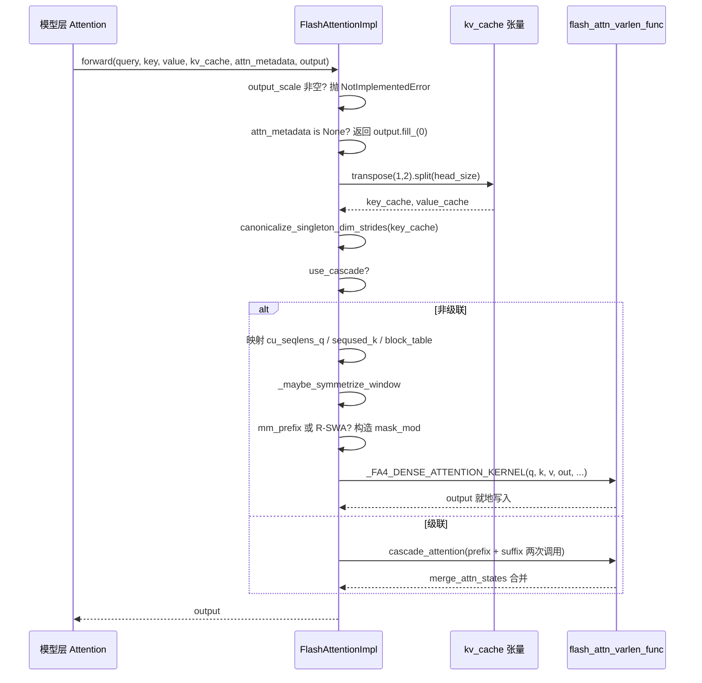

# Progresso do livro: Capítulo 6 / 14

No capítulo anterior vimos como o GPUModelRunner traduz os resultados do agendamento em tensores físicos como input_ids, slot_mapping e block_table, e os injeta em cada camada através do forward_context. Mas o grande consumidor de tempo de GPU — o cálculo de atenção — ainda está no ar. Quem consome exatamente aqueles tensores em attn_metadata? Por que FlashAttention, FlashInfer e Triton podem ser intercambiáveis sob o mesmo código de modelo? A resposta está na camada de abstração AttentionBackend. Ela desacopla "como a atenção é calculada" de "como o modelo a invoca": a camada do modelo mantém apenas uma referência a AttentionImpl e chama a interface unificada forward(query, key, value, kv_cache, attn_metadata, output); enquanto o backend concreto é responsável por traduzir block_table, slot_mapping, seq_lens em parâmetros que seu próprio kernel consegue consumir. Este capítulo usa o FlashAttentionBackend como linha principal, porque ele cobre simultaneamente a semântica de gather do PagedAttention, compatibilidade com CUDA Graph, atenção em cascata, contexto distribuído DCP e os ramos mais ricos. Entendendo-o a fundo, os outros backends são apenas variantes de mapeamento de parâmetros. A motivação desse design de "registro de backend + interface unificada" é direta: os kernels de atenção evoluem extremamente rápido (FA2→FA3→FA4, iterações do FlashInfer, Triton próprio), e se a camada do modelo dependesse diretamente de um kernel concreto, cada atualização de kernel exigiria alterar o código do modelo. A camada de abstração isola as mudanças atrás de um único método de fábrica get_impl_cls().

# Seleção de backend: declaração de capacidades e construção de metadados

## Modelo intuitivo

Pense em`AttentionBackend`como um anúncio de vaga: ele não executa trabalho, apenas declara "quais dtypes, quais head_size, quais formatos de quantização de KV cache, quais tipos de atenção eu consigo processar". O agendador usa a configuração do modelo para fazer o matching, e se falhar, passa para o próximo candidato. Sem essa camada de declaração, o sistema só descobriria em tempo de execução que "este head_size não é suportado pelo kernel", resultando em crash imediato.

## Matriz de capacidades: campos como contrato

`FlashAttentionBackend`Os atributos de classe de são seus limites de capacidade.`supported_dtypes`restringe a fp16/bf16[FACT:vllm/v1/attention/backends/flash_attn.py:287-287]；`supported_kv_cache_dtypes`permite adicionalmente a série fp8[FACT:vllm/v1/attention/backends/flash_attn.py:298-299]. Mas "declarar suporte" não é o mesmo que "suporte incondicional" —`supports_kv_cache_dtype`para KV quantizado delega ainda mais para`flash_attn_supports_kv_cache_dtype`fazer julgamentos dependentes de dispositivo[FACT:vllm/v1/attention/backends/flash_attn.py:431-438]。

Ainda mais refinado é`supports_combination`: ele recebe um conjunto completo de parâmetros combinados como head_size, dtype, block_size, use_mla, has_sink, e retorna`None`indicando disponibilidade, ou uma string indicando o motivo da rejeição[FACT:vllm/v1/attention/backends/flash_attn.py:454-507]. Por exemplo, sink é rejeitado em capacidade de computação < 9.0[FACT:vllm/v1/attention/backends/flash_attn.py:467-468], e em SM90 FP8 KV com mm_prefix deve obrigatoriamente usar Triton[FACT:vllm/v1/attention/backends/flash_attn.py:472-472]. Esse design de "retornar string de motivo" permite que as camadas superiores forneçam erros diagnosticáveis, em vez de fallback silencioso.

A escolha do block_size também é guiada por capacidades. Por padrão retorna`MultipleOf(16)`, mas SM90 FP8-KV força 64[FACT:vllm/v1/attention/backends/flash_attn.py:297-324], e o kernel FA4 com head_size=256 força`FA4_HD256_PAGE_SIZE` [FACT:vllm/v1/attention/backends/flash_attn.py:326-352]. Isso explica por que o tamanho de bloco do KV cache não é definido arbitrariamente — ele é restringido inversamente pelo tamanho do tile TMA do kernel.

## Estrutura de metadados: layout de campos do FlashAttentionMetadata

`FlashAttentionMetadata`é uma dataclass, com campos divididos em quatro grupos[FACT:vllm/v1/attention/backends/flash_attn.py:511-566]：

O primeiro grupo é a descrição básica do lote:`num_actual_tokens`(número real de tokens sem padding),`max_query_len`、`query_start_loc`(soma de prefixos, usada por kernels varlen para localizar início e fim de cada sequência),`seq_lens`、`block_table`、`slot_mapping` [FACT:vllm/v1/attention/backends/flash_attn.py:520-526]. Observe o diagrama ASCII nos comentários do código-fonte[FACT:vllm/v1/attention/backends/flash_attn.py:512-518], que distingue precisamente`context_len`(KV histórico),`query_len`(adicionado nesta rodada),`seq_len`(soma dos dois) — esta é a chave para entender os parâmetros do kernel varlen.

O segundo grupo são campos de atenção em cascata:`use_cascade`、`common_prefix_len`、`cu_prefix_query_lens`etc.[FACT:vllm/v1/attention/backends/flash_attn.py:528-533]。

O terceiro grupo são campos DCP (Decode Context Parallel):`max_dcp_context_kv_len`、`dcp_context_kv_lens`, além de contadores que distinguem o número de requisições decode/prefill[FACT:vllm/v1/attention/backends/flash_attn.py:535-544]。

O quarto grupo são agendamento opcional e máscaras especiais:`scheduler_metadata`(usado pelo agendamento AOT do FA3),`causal`(pode ser bool ou tensor, suporta causalidade por sequência),`mm_prefix_query_range_tensor`(intervalo bidirecional multimodal), campos relacionados a R-SWA[FACT:vllm/v1/attention/backends/flash_attn.py:546-566]。

> **[Design Inference & Architectural Trade-offs]**
> `causal`O tipo do campo é`bool | torch.Tensor`em vez de bool puro, isso é para suportar o cenário de "parte das sequências no mesmo lote é causal, parte não é" (como PrefixLM). Quando é um tensor, o parâmetro`dynamic_causal`do FA4 assume o controle, e FA2/FA3 lançam diretamente NotImplementedError[FACT:vllm/v1/attention/backends/flash_attn.py:1429-1433]。

## Passo a passo do build()

Cenário: um lote misto, 3 sequências decode + 2 sequências prefill, sem cascata, sem DCP.

Primeiro passo, a partir de`common_attn_metadata`desempacotar os tensores básicos[FACT:vllm/v1/attention/backends/flash_attn.py:824-832]. Segundo passo, decidir se ativar o agendamento AOT:`aot_schedule = self.aot_schedule and not fast_build and not envs.VLLM_BATCH_INVARIANT` [FACT:vllm/v1/attention/backends/flash_attn.py:836-838]。`self.aot_schedule`em`__init__`é decidido por`get_flash_attn_version() == 3`— apenas FA3 suporta pré-cálculo de metadados de agendamento. Terceiro passo, no primeiro build preencher lazily[FACT:vllm/v1/attention/backends/flash_attn.py:709-709]: percorrer todas as`aot_sliding_window`camadas para coletar configurações de janela deslizante; se a configuração for única, adotá-la; se houver mais de uma, desativar AOT`FlashAttentionImpl`Quarto passo, calcular[FACT:vllm/v1/attention/backends/flash_attn.py:848-851]。

. Padrão 0 (deixar FA3 usar heurística), definir como`max_num_splits`apenas quando full CUDA graph estiver ativado e o número de tokens estiver dentro do intervalo de captura`self.max_num_splits` [FACT:vllm/v1/attention/backends/flash_attn.py:856-866]. O comentário explica o motivo:`num_splits > 1`aloca`[num_splits, num_heads, num_tokens, head_size]`buffer intermediário, com alto custo de memória de vídeo, só vale a pena em cenários de CUDA graph[FACT:vllm/v1/attention/backends/flash_attn.py:862-865]。

Quinto passo, seguir o ramo não-cascata e não-DCP, chamar`_get_scheduler_metadata`para gerar os metadados de agendamento do FA3[FACT:vllm/v1/attention/backends/flash_attn.py:976-986]. Sexto passo,`_store_scheduler_metadata`trata o cenário de CUDA graph: copiar os novos metadados para o buffer pré-alocado e zerar a parte restante[FACT:vllm/v1/attention/backends/flash_attn.py:671-684]. O passo de zerar é crucial — o comentário indica claramente que, caso contrário, alguns thread blocks lerão metadados inválidos e sobrescreverão o buffer de saída[FACT:vllm/v1/attention/backends/flash_attn.py:671-672]。

Sétimo passo, construir`FlashAttentionMetadata`e retornar[FACT:vllm/v1/attention/backends/flash_attn.py:992-1015]。

```mermaid
flowchart TD
    start["build(common_prefix_len, common_attn_metadata)"] --> unpack["解包 query_start_loc / seq_lens / block_table / slot_mapping"]
    unpack --> aot{"aot_schedule 且非 fast_build 且非 BATCH_INVARIANT?"}
    aot -->|是| sw_check{"aot_sliding_window 已初始化?"}
    aot -->|否| maxsplit
    sw_check -->|否, 首次| collect["_get_sliding_window_configs 收集层滑窗"]
    collect --> sw_unique{"配置数量 == 1?"}
    sw_unique -->|是| set_sw["设置 aot_sliding_window"]
    sw_unique -->|否, >1| disable_aot["self.aot_schedule = False"]
    set_sw --> maxsplit
    disable_aot --> maxsplit
    sw_check -->|是| maxsplit["计算 max_num_splits"]
    maxsplit --> cg_check{"use_full_cuda_graph 且 tokens |是| set_splits["max_num_splits = self.max_num_splits"]
    cg_check -->|否| zero_splits["max_num_splits = 0"]
    set_splits --> branch
    zero_splits --> branch
    branch{"dcp_world_size > 1?"}
    branch -->|是| dcp_path["计算 dcp_context_kv_lens, 可能 skip"]
    branch -->|否| cascade_check{"common_prefix_len > 0?"}
    cascade_check -->|是| cascade_path["构造 prefix/suffix 双份 scheduler_metadata"]
    cascade_check -->|否| normal_path["_get_scheduler_metadata 单份"]
    dcp_path --> store
    cascade_path --> store
    normal_path --> store
    store["_store_scheduler_metadata: CUDA graph 时拷入预分配缓冲并清零尾部"] --> build_meta["构造 FlashAttentionMetadata"]
    build_meta --> mm_check{"mm_req_doc_ranges 非空?"}
    mm_check -->|是| fill_mm["fill_mm_prefix_query_ranges + 拷贝到 GPU"]
    mm_check -->|否| rswa_check
    fill_mm --> rswa_check{"rswa_window 非空?"}
    rswa_check -->|是| copy_rswa["拷贝 prefix_lens 到持久缓冲"]
    rswa_check -->|否| done
    copy_rswa --> done["返回 attn_metadata"]
```

---

# forward(): a cadeia completa dos metadados até a chamada do kernel

## Modelo intuitivo

`forward()`é a "oficina de montagem final" do backend: ela recebe os Q/K/V calculados pelas camadas do modelo, os tensores de KV cache e os metadados construídos no passo anterior, ajusta o layout físico do KV cache para o formato esperado pelo kernel e então despacha para o kernel específico. Sem esse passo, o kernel leria um layout de memória incorreto e produziria erros silenciosos na saída — mais difíceis de depurar do que um crash.

## Transformação do layout de memória do KV cache

A forma física do KV cache do vLLM é`[num_blocks, num_kv_heads, block_size, 2 * head_size]`— K e V concatenados na última dimensão[FACT:vllm/v1/attention/backends/flash_attn.py:1246-1247]. Mas os kernels do FlashAttention esperam K e V separados, com layout`[num_blocks, block_size, num_kv_heads, head_size]`。

A transformação ocorre no início de`forward()`:`kv_cache.transpose(1, 2).split(self.head_size, dim=-1)` [FACT:vllm/v1/attention/backends/flash_attn.py:1310-1310]。`transpose(1,2)`transforma`[blocks, heads, block_size, 2D]`em`[blocks, block_size, heads, 2D]`，`split`dividindo ao longo da última dimensão em K e V. Note que`transpose`apenas altera o stride sem mover dados, então os kernels subsequentes devem suportar acesso não contíguo.

Em seguida vem`canonicalize_singleton_dim_strides` [FACT:vllm/v1/attention/backends/flash_attn.py:1310-1310]. O comentário aponta a motivação: quando`num_kv_heads=1`(comum em cenários TP), o stride de dimensões de tamanho 1 é degenerado, e FA3/FA4 em H100+ usam TMA, que exige que o stride tenha pelo menos 16 bytes de alinhamento[FACT:vllm/v1/attention/backends/flash_attn.py:1310-1310]. Esta é uma armadilha típica de "logicamente equivalente, fisicamente inválido".

## Fluxo de parâmetros do caminho não-cascata

Após entrar no ramo`if not attn_metadata.use_cascade`, os parâmetros são mapeados um a um[FACT:vllm/v1/attention/backends/flash_attn.py:1326-1342]：`cu_seqlens_q = query_start_loc`，`seqused_k = seq_lens`，`block_table = attn_metadata.block_table`。`descale_shape`pega`(batch_size, num_kv_heads)`, usado para broadcast de scale na quantização FP8 — o comentário explica que flash-attn espera que a forma de descale seja`(num_sequences, num_kv_heads)`, usando`.expand()`para evitar cópia[FACT:vllm/v1/attention/backends/flash_attn.py:1258-1258]。

Em seguida vem o tratamento de simetrização da janela deslizante.`_maybe_symmetrize_window`A lógica: janela deslizante causal`(w, 0)`em cenário não-causal deve se tornar`(w, w)`, permitindo que queries bidirecionais olhem em ambas as direções[FACT:vllm/v1/attention/backends/flash_attn.py:587-589]. O comentário também enfatiza que "a window da própria camada tem prioridade sobre a window do group", pois um KV cache group pode conter simultaneamente camadas com janela e camadas globais (como no Gemma-3 quando o hybrid KV cache manager está desativado)[FACT:vllm/v1/attention/backends/flash_attn.py:1362-1365]。

## Ramo de máscara: mm_prefix e R-SWA

Quando`mm_prefix_query_ranges`não é vazio e satisfaz as condições de FA4 + causal estático, o código constrói o`mask_mod` [FACT:vllm/v1/attention/backends/flash_attn.py:1374-1407]do CuTE-DSL. As ações-chave são`causal = False`e`sliding_window_size = None` [FACT:vllm/v1/attention/backends/flash_attn.py:1406-1407]. O comentário explica o motivo: a semântica de mm_prefix é`(causal ∧ window) ∨ bidirectional-range`, não um subconjunto de causal; após FA #155, definir mask_mod não limpa mais automaticamente causal/local, e o chamador deve desativá-los explicitamente, caso contrário o caminho causal embutido fará curto-circuito em mask_mod[FACT:vllm/v1/attention/backends/flash_attn.py:1402-1405]。

`_make_mm_prefix_mask_mod`usa`functools.cache`para cachear[FACT:vllm/v1/attention/backends/flash_attn.py:1793-1802]. O comentário apresenta a razão técnica: o`hash_callable`do FA4 mistura o`repr()`da unidade de closure na chave de compilação; o`_load_q_range`aninhado tem endereço diferente a cada chamada, fazendo com que cada forward dispare uma recompilação JIT completa[FACT:vllm/v1/attention/backends/flash_attn.py:1793-1802]. Este é um exemplo típico de armadilha de desempenho em ambiente de produção.

Dentro da máscara há um detalhe de conversão de coordenadas: o FA4 passa`q_idx`local (0-based dentro do chunk de prefill atual), enquanto`kv_idx`é a posição absoluta. O código usa`q_abs = q_idx + seqlen_k - seqlen_q`para restaurar a posição absoluta[FACT:vllm/v1/attention/backends/flash_attn.py:1859-1865]。`__vec_size__ = 1`A configuração de`_load_q_range`também tem suas particularidades: lê lane 0, uma chamada não pode atravessar linhas de query[FACT:vllm/v1/attention/backends/flash_attn.py:1897-1897]。

O mask_mod do R-SWA é semelhante, mas a semântica é`causal & (in_prefix | in_window)` [FACT:vllm/v1/attention/backends/flash_attn.py:1945-1948], e`use_fast_sampling = True`faz o FA4 pular blocos de KV totalmente mascarados, sem carregar seus dados[FACT:vllm/v1/attention/backends/flash_attn.py:1950-1950]。

## Tratamento especial do FA4 hd256

Quando`self.fa4_hd256`é verdadeiro, o código força alinhamento de página:`num_pages = cdiv(max_seqlen_k, FA4_HD256_PAGE_SIZE)`，`max_seqlen_k`arredondado para cima até a fronteira de página,`block_table`truncado para o número exato de páginas,`num_splits = 1` [FACT:vllm/v1/attention/backends/flash_attn.py:1442-1448]. O comentário explica que o kernel hd256 exige comprimento alinhado à página, block table de largura exata e não suporta SplitKV.

Chamada final a`_FA4_DENSE_ATTENTION_KERNEL(...)`, passando q, k, v, out, cu_seqlens_q, seqused_k, block_table, softcap, mask_mod, aux_tensors etc. para[FACT:vllm/v1/attention/backends/flash_attn.py:1450-1475]。

## Escrita no KV cache: do_kv_cache_update

`forward()`apenas lê o KV cache; a escrita é feita por`do_kv_cache_update`. Ele chama`reshape_and_cache_flash`, usando`slot_mapping`para espalhar os K/V recém-calculados no cache[FACT:vllm/v1/attention/backends/flash_attn.py:1532-1541]. O comentário observa:`key`/`value`é padded enquanto`slot_mapping`Não, mas não é necessário fatiar manualmente, porque o op usa`slot_mapping`o shape de[FACT:vllm/v1/attention/backends/flash_attn.py:1527-1531]para determinar o número real de tokens[FACT:vllm/v1/attention/backends/flash_attn.py:1520-1521]。



---

# da cópia

> **[Design Inference & Architectural Trade-offs]**
> **〔Inferência de design e trade-offs arquiteturais〕**。`supports_combination`Separação entre declaração de capacidade e implementação

**Retorna uma string de motivo em vez de bool; isso permite que a camada superior, ao fazer fallback para outros backends, registre "por que FA não foi usado", reduzindo enormemente o custo de diagnóstico em produção. Em comparação com fallback silencioso, esse design torna explícita a base da decisão.**。`_store_scheduler_metadata`A compatibilidade com CUDA Graph é uma restrição invisível do design de metadados[FACT:vllm/v1/attention/backends/flash_attn.py:671-684]O padrão de "copiar para dentro + zerar a cauda"[FACT:vllm/v1/attention/backends/flash_attn.py:787-798]aparece repetidamente no buffer persistente de R-SWA[FACT:vllm/v1/attention/backends/flash_attn.py:800-813]e na área de staging de mm_prefix`__init__`. O padrão comum é: pré-alocar no`build()`um buffer persistente do tamanho máximo,[FACT:vllm/v1/attention/backends/flash_attn.py:1044-1046]。

**e no**。`supports_draft_decode_metadata_update = self.dcp_world_size == 1` [FACT:vllm/v1/attention/backends/flash_attn.py:742-742]apenas copiar, sem alocar. O motivo é apontado nos comentários — durante a captura de CUDA graph não pode haver operações de alocação`skip_dcp_context_attention()`Exclusão mútua entre DCP e fused draft decode[FACT:vllm/v1/attention/backends/flash_attn.py:736-741]. O comentário explica: fused draft decode reutiliza entre etapas de draft o objeto de metadados capturado, mas as decisões do lado do host em build-time do DCP (como

**) alteram o shape dos metadados, e esses campos Python não são atualizados in-place entre replays do graph**。`use_cascade_attention`. Este é um trade-off típico de "escolher corretude quando otimização de desempenho entra em conflito com corretude".[FACT:vllm/v1/attention/backends/flash_attn.py:1967-1967]Limiar heurístico da atenção em cascata[FACT:vllm/v1/attention/backends/flash_attn.py:1978-1979]usa uma série de limiares para filtrar: common_prefix_len < 256 é rejeitado diretamente[FACT:vllm/v1/attention/backends/flash_attn.py:1982-1984], alibi/sliding_window/local_attention não são suportados[FACT:vllm/v1/attention/backends/flash_attn.py:1985-1987], número de requisições < 8 é rejeitado[FACT:vllm/v1/attention/backends/flash_attn.py:2011-2029], cenário DCP é desabilitado[FACT:vllm/v1/attention/backends/flash_attn.py:2009-2010]。

**. Depois de passar, ainda é preciso usar um modelo de desempenho aproximado para comparar o número de CTAs e waves entre cascade e FlashDecoding**：`forward()`. O comentário admite que esse modelo é "very rough"`view`/`slice`Pontos de armadilha em produção[FACT:vllm/v1/attention/backends/flash_attn.py:1277-1284]Há um comentário destacado em`[:num_actual_tokens]`, alertando que sob piece-wise CUDA graph esse método é executado em modo eager,

---

# e métodos que aparentam não ter operações de GPU, como

, são na verdade muito lentos; alterações devem ser benchmarkadas`FlashAttentionBackend`. Isso explica por que o código usa amplamente`supports_*`slicing em vez de formas mais "elegantes" — cada ponto é resultado de um trade-off de desempenho.`build()`Resumo do capítulo`CommonAttentionMetadata`Este capítulo percorreu`FlashAttentionMetadata`todo o ciclo de vida do backend de atenção: declaração de capacidade (`forward()`série) → construção de metadados (`transpose+split`traduz

para

) → chamada de kernel (`logits`transforma o layout do KV cache, constrói máscaras, despacha para o kernel FA). Os mecanismos centrais incluem: a transformação de layout

# do KV cache, a normalização de strides degenerados, o padrão de buffer persistente sob CUDA graph, a construção de máscaras CuTE-DSL de mm_prefix/R-SWA, e a decisão heurística da atenção em cascata.

Princípios-chave de design: separação entre declaração de capacidade e implementação, pré-alocação de metadados impulsionada pela compatibilidade com CUDA graph, e prioridade à corretude quando otimização de desempenho entra em conflito com corretude (DCP desabilita fused draft decode).`_store_scheduler_metadata`O próximo capítulo voltará-se para amostragem e saída:`self.scheduler_metadata[n:] = 0`como

**se transforma em token via cadeia de processadores (temperatura, top-p, penalidades), como a saída estruturada restringe a decodificação, e como o retorno em streaming coopera com o scheduler.**：`_store_scheduler_metadata`Reflexões e autoavaliação deste capítulo[FACT:vllm/v1/attention/backends/flash_attn.py:671-684]Q1: Se a operação de[FACT:vllm/v1/attention/backends/flash_attn.py:671-672]de zerar

Q2: `_make_mm_prefix_mask_mod`em`functools.cache`for removida, em quais cenários isso causaria saída incorreta? Por que o comentário enfatiza especialmente esse ponto?

**Análise de referência**No cenário de CUDA graph, copia os novos metadados para as primeiras n posições do buffer pré-alocado`hash_callable`. Se a cauda não for zerada, metadados de agendamento remanescentes da build anterior serão lidos pelo kernel atual. O comentário aponta explicitamente que "some thread blocks may use the invalid scheduler metadata and overwrite the output buffer"`repr()`. Cenário de disparo: o tamanho do batch diminui de grande para pequeno (por exemplo, de 8 sequências para 3), as primeiras 3 posições do buffer são dados novos, mas as posições 4-8 ainda são dados do batch antigo. Os metadados de agendamento do FA3 incluem informações de alocação de tiles; quando o kernel lê conforme batch_size, se o cálculo de batch_size tiver desvio ou o kernel escanear com stride fixo, ele lerá dados sujos e corromperá a saída. Esta é a armadilha clássica da reutilização de buffers em CUDA graph: o ciclo de vida do buffer atravessa múltiplos replays e deve ser limpo explicitamente.[FACT:vllm/v1/attention/backends/flash_attn.py:1793-1802]。`_make_mm_prefix_mask_mod`usa`_load_q_range`cache; o comentário diz que, caso contrário, isso "force a full JIT recompile every forward". Se esse decorador de cache for removido, quanto o desempenho degradaria? Por que a chave de compilação do FA4 é afetada pelo endereço da closure?`repr()`Contém endereços de memória, e o endereço muda a cada vez → a chave de compilação muda a cada vez → o FA4 considera que é necessário recompilar via JIT. Após o cache, torna-se igual`(sliding_window, sliding_window_left)`Os parâmetros reutilizam o mesmo objeto de função, e a chave de compilação é estável. O grau de degradação de desempenho depende do tempo de compilação do FA4, mas é certo que "cada forward dispara uma compilação completa", compilando uma vez a cada passo no loop de decode, e a latência degrada de milissegundos para segundos. Este é um caso típico de invalidação do cache JIT causada por uma "closure Python aparentemente inofensiva".

Q3: `supports_draft_decode_metadata_update = self.dcp_world_size == 1`Esta linha de código desabilita o fused draft decode no cenário DCP. Suponha que você force a alteração para`True`, que erro específico ocorreria na combinação de decodificação especulativa + DCP?

**Análise de referência**: O comentário explica que o fused draft decode reutiliza entre passos de draft o objeto de metadados capturado, enquanto as decisões do lado do host em tempo de build do DCP (como`skip_dcp_context_attention()`) alteram a forma dos metadados/caminho de controle, por exemplo`max_dcp_context_kv_len` [FACT:vllm/v1/attention/backends/flash_attn.py:736-741]. Esses campos Python não são atualizados in-place entre replays do CUDA graph. Erro específico: o comprimento da sequência cresce entre passos de draft,`skip_dcp_context_attention`a determinação pode mudar de True para False (ou vice-versa), mas o objeto de metadados reutilizado ainda mantém o valor antigo. Se o valor antigo for`max_dcp_context_kv_len = 0`, o kernel seguirá o caminho "sem contexto DCP"[FACT:vllm/v1/attention/backends/flash_attn.py:1565-1589], pulando a atenção de contexto entre ranks, resultando em saída sem informações de contexto — erro silencioso, sem crash. Isso é exatamente a manifestação de "escolher a correção quando otimização de desempenho e correção entram em conflito".

Até aqui, a cadeia completa do backend de atenção, da interface abstrata à implementação do kernel, já está conectada: a camada do modelo chama uniformemente através de AttentionImpl, o backend é responsável por traduzir metadados como block_table e slot_mapping em parâmetros concretos de kernel, e a implementação PagedAttention do FlashAttentionBackend demonstra a semântica de gather sob KV Cache paginado e a estratégia de compatibilidade com CUDA Graph. Mas o cálculo de atenção produz apenas estados ocultos, e o que o modelo finalmente deve emitir é o próximo token. Como esses estados ocultos se tornam logits, e como os logits passam por amostragem e pós-processamento, retornando finalmente texto em streaming ao cliente? O próximo capítulo rastreará esse último quilômetro.
