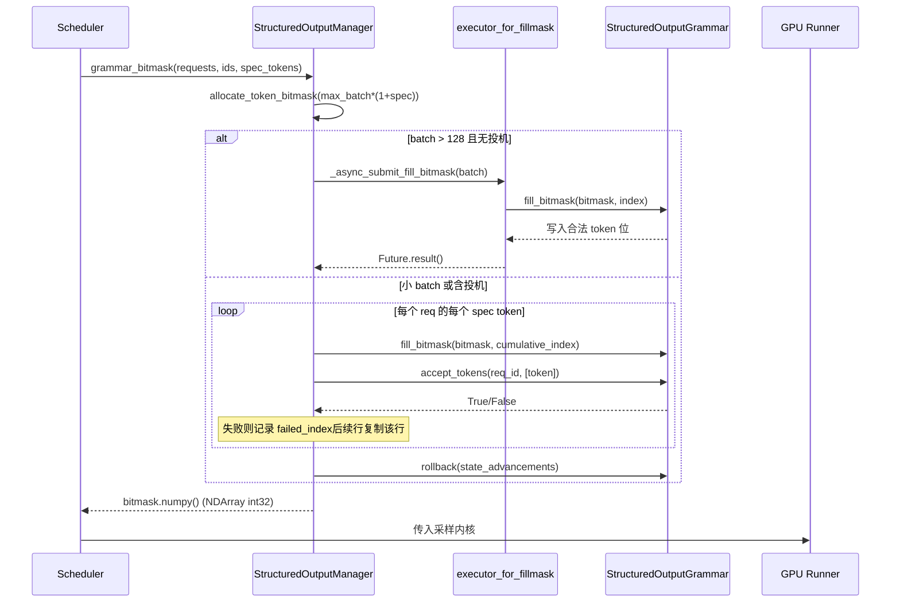

# Capítulo 7: Amostragem e saída: processamento de Logits, saída estruturada e retorno em streaming

No capítulo anterior, rastreamos como o backend de atenção traduz a block table em parâmetros de kernel, realizando o cálculo de atenção do tipo gather em memória de vídeo não contígua. Mas a atenção produz apenas estados ocultos — o que o modelo realmente precisa entregar ao usuário é o texto do próximo token. Este capítulo rastreia esse último quilômetro: após os estados ocultos serem projetados em logits pelo lm_head, como eles atravessam uma cadeia de processadores cuidadosamente ordenada (temperatura, penalidades, top-k/top-p, restrições estruturais), são amostrados em token ids, e então restaurados para texto pelo detokenizer e enviados em streaming. Qualquer passo fora de ordem ou vazamento de estado nessa cadeia fará a qualidade da saída degradar silenciosamente.

# Sampler: a ordem da cadeia de processadores é a própria correção

**Modelo intuitivo**: O Sampler é como uma linha de montagem, e os logits são a matéria-prima a ser processada. Cada estação (processor) na linha modifica a matéria-prima, e a ordem das estações determina diretamente o produto final — primeiro cortar e depois polir e primeiro polir e depois cortar resultam em duas coisas diferentes. Sem essa cadeia, o modelo só poderia emitir a distribuição de probabilidade bruta, e o usuário receberia uma "amostragem nua" sem controle de temperatura, sem supressão de repetição e sem restrição de formato.

## Estrutura de dados e layout de memória

O próprio Sampler é`nn.Module`, mas seu estado central é extremamente fino: ele mantém apenas o submódulo`topk_topp_sampler`,`logprobs_mode`e a flag`use_fp64_gumbel`.[FACT:vllm/v1/sample/sampler.py:61-64]Todo o estado real em nível de batch está encapsulado em`SamplingMetadata`, passado como parâmetro do forward. Esse design de "Sampler sem estado + metadados externos" é intencional: a instância do Sampler é criada apenas uma vez durante o ciclo de vida da engine, enquanto a composição do batch muda a cada decode step; externalizar o estado é o que permite que o Sampler seja capturado pelo CUDA Graph e reproduzido com segurança.

A constante chave é`_SAMPLING_EPS = 1e-5` [FACT:vllm/v1/sample/sampler.py:18]. Ela serve simultaneamente a duas semânticas: temperatura abaixo desse valor é tratada como greedy, e`apply_temperature`é o fallback para evitar divisão por zero em

## Step-by-Step Walkthrough

.

**Cenário: um batch mistura requisições greedy e requisições de amostragem aleatória, e algumas requisições também habilitaram logprobs.**Primeiro passo, tirar um snapshot dos logprobs originais.`logprobs_mode`Antes de aplicar qualquer penalidade ou temperatura, se a requisição precisar de logprobs, primeiro determine o conteúdo do snapshot conforme[FACT:vllm/v1/sample/sampler.py:84-93]. Observe que o comentário aponta explicitamente a diferença em relação ao V0: o V1 usa**logits originais**(antes de penalidades e temperatura) para calcular top-k logprobs[FACT:vllm/v1/sample/sampler.py:72-77]. Este é o contrato semântico — o logprob que o usuário vê deve refletir a distribuição real do modelo, e não a distribuição distorcida pelas penalidades.

**Segundo passo, unificar para float32.** [FACT:vllm/v1/sample/sampler.py:95-96]Independentemente de a entrada ser bf16 ou fp16, converter para float32. O motivo é que o log_softmax, top-k e probabilidade acumulada subsequentes acumulam erros em baixa precisão, especialmente quando o vocabulário chega a 150 mil.

**Terceiro passo, cadeia de processadores que não alteram o argmax.** `apply_logits_processors`Aplicar em sequência: máscara de whitelist de allowed token, exclusão de bad words,`non_argmax_invariant`processadores, termos de penalidade[FACT:vllm/v1/sample/sampler.py:391-404]. A classificação aqui é o design central —`non_argmax_invariant`refere-se àqueles**que alteram o resultado guloso**processadores (como min_tokens, logit_bias), que devem entrar em vigor antes da amostragem gulosa; e os`argmax_invariant`processadores (como min_p) não alteram o argmax, podendo ser adiados para depois da temperatura.

**Quarto passo, amostragem.** `sample`O método primeiro verifica se é totalmente aleatório[FACT:vllm/v1/sample/sampler.py:256-271]: se`all_greedy`, retorna diretamente o argmax; caso contrário, calcula primeiro o resultado guloso para uso posterior, depois aplica temperatura, processadores que não alteram o argmax, top-k/top-p[FACT:vllm/v1/sample/sampler.py:275-291]. Por fim, usa`torch.where`para escolher entre o resultado guloso e o aleatório de acordo com o limiar de temperatura[FACT:vllm/v1/sample/sampler.py:305-306], e reutiliza`greedy_sampled`o tensor como buffer de saída, evitando alocação extra.

**Quinto passo, coletar logprobs e encapsular a saída.**De acordo com`num_logprobs`, há três casos: None retorna apenas os logprobs do token especificado; -1 retorna logprobs completos não ordenados; caso contrário, top-k[FACT:vllm/v1/sample/sampler.py:120-131]. Por fim, o token id é convertido para int32 para comprimir o volume, expandido para`[num_requests, 1]`o tensor bidimensional[FACT:vllm/v1/sample/sampler.py:138-148]。

```mermaid
flowchart TD
    in_logits["logits (bf16/fp16)"] --> snap{"需要 logprobs?"}
    snap -->|是| raw["compute_logprobs / cloneraw_logprobs 快照"]
    snap -->|否| f32
    raw --> f32["logits.to(float32)"]
    f32 --> proc["apply_logits_processors"]
    proc --> mask{"allowed_token_ids_mask?"}
    mask -->|是| fill["masked_fill_(-inf)"]
    mask -->|否| bad
    fill --> bad{"bad_words_token_ids?"}
    bad -->|是| apply_bad["apply_bad_words"]
    bad -->|否| noninv
    apply_bad --> noninv["non_argmax_invariant 处理器"]
    noninv --> pen["apply_penalties"]
    pen --> sample["sample()"]
    sample --> allg{"all_greedy?"}
    allg -->|是| greedy["greedy_sample (argmax)"]
    allg -->|否| temp["apply_temperature"]
    temp --> arginv["argmax_invariant 处理器"]
    arginv --> topp["topk_topp_sampler"]
    topp --> where["torch.where(temp  out
    where --> out["SamplerOutputsampled_token_ids"]
```

## Reflexões de design e armadilhas

**Por que os termos de penalidade devem vir antes da temperatura?**A temperatura é uma escala sobre a distribuição, a penalidade é uma adição/subtração de pontos para tokens específicos. Se primeiro escalar e depois penalizar, a magnitude absoluta da penalidade será ampliada ou reduzida pela temperatura, fazendo com que o mesmo conjunto de parâmetros de penalidade se comporte de forma inconsistente em temperaturas diferentes. A V1 fixa a penalidade antes da temperatura, garantindo a estabilidade semântica dos parâmetros.

**`mark_unbacked`A armadilha de compilação do**Em`gather_logprobs`,`batched_count_greater_than`é compilado, e quando a dimensão de batch muda de 1 para ≥2, isso dispara a recompilação de especialização 0/1 do dynamo[FACT:vllm/v1/sample/sampler.py:345-348]。`mark_unbacked`marca essa dimensão como totalmente simbólica, evitando essa recompilação. Em ambiente de produção, se você vir uma travada súbita após a primeira requisição de decode, provavelmente é esse tipo de recompilação.

**`gpu_sync_allowed`A fronteira de sincronização do** `batched_count_greater_than`pode disparar sincronização de GPU internamente, o vLLM usa`gpu_sync_allowed(first_only=True)`contexto para declarar explicitamente "aqui é permitida sincronização, mas apenas na primeira vez"[FACT:vllm/v1/sample/sampler.py:345-348]. Se houver sincronização inesperada dentro da região de captura do CUDA Graph, isso causará falha na captura — esta é a pista chave para investigar problemas de captura de grafo.

# Saída estruturada: máquina de estados de trilha dupla com bitmask e gramática

**Modelo intuitivo**: a saída estruturada é como colocar um par de "óculos de gramática" no amostrador — a cada passo só se podem ver tokens que obedecem ao JSON schema ou à gramática. Sem isso, o modelo pode gerar JSON com erro de sintaxe, e o parser downstream quebra diretamente. A essência da implementação do vLLM está em: a máquina de estados da gramática avança no lado da CPU, enquanto a restrição é passada ao lado da GPU em forma de bitmask para amostragem.

## Estruturas de dados e layout de memória

`StructuredOutputManager`é um singleton no nível do engine, que mantém`backend`(um entre xgrammar/guidance/outlines/lm-format-enforcer),`reasoner_cls`e dois pools de threads[FACT:vllm/v1/structured_output/__init__.py:39-98]。

O bitmask é a estrutura de dados central:`_grammar_bitmask`é um tensor int32 com formato`[max_batch_size * (1 + max_num_spec_tokens), vocab_size/32]`[FACT:vllm/v1/structured_output/__init__.py:327-336]. Cada bit corresponde a se um token é legal.`_full_mask = torch.tensor(-1, dtype=torch.int32)`representa "todos 1" — todos os tokens legais[FACT:vllm/v1/structured_output/__init__.py:59]。

Os dois pools de threads têm divisão clara:`executor`responsável pela compilação da gramática (intensivo em CPU, número de workers é metade do número de CPUs)[FACT:vllm/v1/structured_output/__init__.py:71-78]；`executor_for_fillmask`responsável pelo preenchimento paralelo de bitmasks em batch grande, habilitado apenas quando o batch excede 128[FACT:vllm/v1/structured_output/__init__.py:62-69]。

## Step-by-Step Walkthrough

**Inicialização da gramática.**Quando a requisição entra pela primeira vez,`grammar_init`é chamado[FACT:vllm/v1/structured_output/__init__.py:115-176]. Se o backend não estiver inicializado, escolhe a implementação conforme a configuração[FACT:vllm/v1/structured_output/__init__.py:130-165]. Em seguida, submete a tarefa de compilação: por padrão segue o caminho assíncrono`executor.submit`, mas no modo`external_launcher`deve ser síncrono[FACT:vllm/v1/structured_output/__init__.py:167-176]。

**Geração de bitmask.**A cada decode step,`grammar_bitmask`gera máscaras para todas as requisições estruturadas no batch[FACT:vllm/v1/structured_output/__init__.py:314-442]. Batch grande segue o caminho paralelo: submete em lotes de 16 para o pool de threads[FACT:vllm/v1/structured_output/__init__.py:346-373]. Batch pequeno segue o caminho serial, avançando o estado da gramática token a token[FACT:vllm/v1/structured_output/__init__.py:374-433]。

**Alinhamento de máscaras sob decodificação especulativa.**Esta é a parte mais engenhosa. Quando há draft tokens, cada requisição precisa de`1 + max_num_spec_tokens`linhas de máscara. O caminho serial processa token a token: se algum draft token for rejeitado pela gramática, registra`failed_index`, e as linhas subsequentes copiam diretamente a máscara dessa linha[FACT:vllm/v1/structured_output/__init__.py:396-418]. Isso garante que "após o draft ser rejeitado, o estado de restrição das posições subsequentes retrocede ao ponto de rejeição".

**Rollback de estado.**Durante o preenchimento do bitmask, o estado da gramática avançou`state_advancements`passos, mas o draft token ainda não foi realmente aceito, portanto é necessário`grammar.rollback(state_advancements)`reverter[FACT:vllm/v1/structured_output/__init__.py:422-430]. A aceitação real ocorre em`accept_tokens` [FACT:vllm/v1/structured_output/__init__.py:444-466]。



## Reflexões de design e armadilhas

**Por que external_launcher deve compilar de forma síncrona?**O comentário dá a razão precisa: a compilação assíncrona faria com que`WAITING_FOR_STRUCTURED_OUTPUT_GRAMMAR → WAITING`a transição de estado ocorresse em momentos diferentes em ranks de TP diferentes, quebrando a suposição de determinismo da qual o external_launcher depende[FACT:vllm/v1/structured_output/__init__.py:47-56]. Este é um caso típico do conflito entre determinismo distribuído e otimização assíncrona.

**Ponto de partida da restrição no modelo de raciocínio.** `_get_constraint_start`Determina a partir de qual token começar a aplicar a restrição gramatical[FACT:vllm/v1/structured_output/__init__.py:220-292]. Para modelos com cadeia de pensamento, a fase de reasoning não deve estar sujeita à restrição JSON; ela só é iniciada após o término do reasoning.`enable_in_reasoning`Quando True, retorna diretamente 0 (restrição em todo o percurso)[FACT:vllm/v1/structured_output/__init__.py:235-236]. Se o reasoner suportar`find_reasoning_end_offset`, use-o para localizar com precisão[FACT:vllm/v1/structured_output/__init__.py:261-267]; caso contrário, recorra à busca regressiva token a token[FACT:vllm/v1/structured_output/__init__.py:287-291]。

**`validate_tokens`da semântica de prefixo.**Na decodificação especulativa, os draft tokens podem violar a gramática,`validate_tokens`retorna o "prefixo legal mais longo"[FACT:vllm/v1/structured_output/__init__.py:294-312]. Observe que ele primeiro remove o preenchimento especulativo (-1), depois calcula o ponto de início da restrição e, por fim, realiza a validação gramatical apenas nos tokens dentro do intervalo de restrição.

# Detokenizer: o jogo de fronteiras entre decodificação incremental e stop string

**Modelo intuitivo**: o detokenizer é como um escriba que transcreve caractere por caractere, traduzindo token ids em texto legível por humanos. A dificuldade está em que: tokens e caracteres não têm correspondência um-a-um (um token pode corresponder apenas a meio caractere UTF-8), e a stop string pode abranger múltiplos tokens. Sem decodificação incremental, seria necessário decodificar a sequência inteira do zero a cada passo, e o custo O(n²) prejudicaria a vazão.

## Estruturas de dados e layout de memória

`IncrementalDetokenizer`A classe base mantém apenas`token_ids`a lista[FACT:vllm/v1/engine/detokenizer.py:32-33]。`BaseIncrementalDetokenizer`adiciona campos relacionados a stop:`stop`lista,`min_tokens`、`include_stop_str_in_output`、`stop_buffer_length`e`_last_output_text_offset` [FACT:vllm/v1/engine/detokenizer.py:70-94]。

`stop_buffer_length`são cruciais: quando a stop string não está incluída na saída, ele é igual ao comprimento da stop string mais longa menos um[FACT:vllm/v1/engine/detokenizer.py:87-90]. Esse "buffer de recuo" garante que a saída em streaming não emita antecipadamente caracteres que possam ser prefixo de uma stop string.

Dois caminhos de implementação:`FastIncrementalDetokenizer`usa a biblioteca tokenizers`DecodeStream` [FACT:vllm/v1/engine/detokenizer.py:166-246]；`SlowIncrementalDetokenizer`usa o lado Python`detokenize_incrementally` [FACT:vllm/v1/engine/detokenizer.py:249-305]. O critério de escolha é a versão do tokenizers ≥ 0.22.0 e o tipo de tokenizer correspondente[FACT:vllm/v1/engine/detokenizer.py:32-33][FACT:vllm/v1/engine/detokenizer.py:61-63]。

## Step-by-Step Walkthrough

**decodificação incremental.** `update`recebe novos token ids e`stop_terminated`flag[FACT:vllm/v1/engine/detokenizer.py:96-142]. Se o stop terminar e não incluir a stop string, o último token é excluído da decodificação[FACT:vllm/v1/engine/detokenizer.py:107-111]. Em seguida, chama token a token`decode_next`acumula texto[FACT:vllm/v1/engine/detokenizer.py:117-122]。

**detecção de stop string.** `check_stop_strings`busca apenas dentro do intervalo de caracteres recém-adicionados[FACT:vllm/v1/engine/detokenizer.py:308-360]. O ponto de início da busca é`1 - new_char_count - stop_string_len` [FACT:vllm/v1/engine/detokenizer.py:338], esse deslocamento garante que stop strings que cruzam fronteiras de tokens também sejam capturadas. Quando múltiplas stop strings correspondem simultaneamente, escolhe-se**a que completa**primeiro[FACT:vllm/v1/engine/detokenizer.py:342-347]。

**fatiamento da saída em streaming.** `get_next_output_text`conforme`delta`o parâmetro decide retornar o total ou o incremental[FACT:vllm/v1/engine/detokenizer.py:148-163]. Quando não concluído, mantém`stop_buffer_length`caracteres sem emitir[FACT:vllm/v1/engine/detokenizer.py:145-146], usa`_last_output_text_offset`registra a posição já enviada[FACT:vllm/v1/engine/detokenizer.py:148-163]。

**recuperação de exceções.** `FastIncrementalDetokenizer._protected_step`trata dois tipos de exceção: OverflowError/TypeError registra log e retorna None[FACT:vllm/v1/engine/detokenizer.py:225-229]; erro "Invalid prefix" então**reconstrói DecodeStream**e tenta novamente[FACT:vllm/v1/engine/detokenizer.py:222-246]. O último lida com casos de fronteira em que o tokenizer produz saída UTF-8 não monotônica.

## Reflexões de design e armadilhas

**O trade-off de stop_buffer_length.**Quanto maior o buffer, maior a latência do streaming (o momento em que o usuário vê o texto é adiado), mas menor a chance de perder stop strings que cruzam tokens. Tomar "comprimento da stop string mais longa menos um" é o limite inferior exato: o prefixo de qualquer stop string tem no máximo esse comprimento.

**min_tokens e stop_check_offset.**Quando o número de tokens de saída não atinge`min_tokens`,`stop_check_offset`é continuamente empurrado para o fim do texto[FACT:vllm/v1/engine/detokenizer.py:120-122], o que significa que esse trecho de texto não será submetido à detecção de stop. Isso evita que o modelo encontre uma stop string logo no início e produza saída vazia.

**Cache de added_token_ids no caminho Fast.**Quando`spaces_between_special_tokens`é False, é necessário suprimir espaços entre tokens especiais[FACT:vllm/v1/engine/detokenizer.py:192-207]. O código armazena`added_token_ids`em cache no objeto tokenizer[FACT:vllm/v1/engine/detokenizer.py:195-200], evitando reconstruir o dicionário a cada decode.

# Reflexões de design

Os três módulos compartilham uma filosofia de design:**separar o avanço de estado da verificação de restrições, deixando o lado da GPU apenas com operações tensoriais sem estado**. O Sampler é sem estado, o estado está em`SamplingMetadata`; a máquina de estados gramatical avança no lado da CPU, e a GPU apenas consome a máscara de bits; o`_last_output_text_offset`do detokenizer é o único cursor de streaming. Essa separação permite que cada componente do lado da GPU seja capturado pelo CUDA Graph.

Outra linha principal é**ordem é semântica**. A ordem da cadeia de processadores do Sampler, o ponto de início da restrição da saída estruturada, o deslocamento da detecção de stop do detokenizer — qualquer erro de ordem em qualquer um desses pontos não causa crash, apenas produz resultados incorretos silenciosamente — e é exatamente isso que torna esse tipo de código tão difícil de depurar.

# Resumo do capítulo

- A cadeia de processadores do Sampler é estritamente ordenada: snapshot dos logprobs originais → float32 → whitelist/bad words → non-argmax-invariant → penalidades → temperatura → argmax-invariant → top-k/top-p.
- A saída estruturada usa bitmask para passar o estado sintático do lado da CPU para a GPU; sob decodificação especulativa, através de`failed_index`cópia e`rollback`garante consistência de estado.
- O Detokenizer usa`stop_buffer_length`buffer de fallback para equilibrar a latência de streaming e a detecção de stop string entre tokens; o caminho Fast depende de tokenizers ≥ 0.22.0`DecodeStream`。

# Reflexões e autoavaliação deste capítulo

Q1: Se mover`apply_logits_processors`o termo de penalidade em (`apply_penalties`) para ser executado após a temperatura, que desvio concreto ocorrerá no cenário de amostragem em alta temperatura com temperature=2.0? Por quê?

**Análise de referência**: A temperatura é uma escala de todo o vetor de logits (`logits.div_(temp)`）[FACT:vllm/v1/sample/sampler.py:241-242]. O termo de penalidade (como repetition penalty) é um ajuste multiplicativo/aditivo para tokens específicos. Se escalar primeiro e penalizar depois, a magnitude absoluta da penalidade será amplificada 2 vezes pela temperatura, fazendo com que o mesmo conjunto de`repetition_penalty`parâmetros tenha efeito inibitório em alta temperatura muito mais forte do que em baixa temperatura, e a semântica dos parâmetros varia com a temperatura. A V1 fixa a penalidade antes da temperatura[FACT:vllm/v1/sample/sampler.py:403-404], garantindo que a magnitude da penalidade seja desacoplada da temperatura. Além disso, a penalidade pertence à`non_argmax_invariant`categoria (afeta o resultado guloso), e o caminho guloso já retorna antes da temperatura[FACT:vllm/v1/sample/sampler.py:261-271]; se for movida para depois da temperatura, as requisições gulosas ignorarão completamente a penalidade, causando comportamento inconsistente.

Q2: No`grammar_bitmask`caminho serial de , se a linha`grammar.rollback(state_advancements)` [FACT:vllm/v1/structured_output/__init__.py:422-430]for removida, o que acontecerá na combinação de decodificação especulativa + saída estruturada? Analise combinando com`accept_tokens`o momento de chamada de .

**Análise de referência**: Ao preencher o bitmask, o código chama`grammar.accept_tokens`para cada draft token para avançar o estado sintático e gerar a máscara da próxima posição[FACT:vllm/v1/structured_output/__init__.py:396-418], mas isso é apenas um "avanço exploratório" — o draft token ainda não foi verificado e aceito pelo modelo alvo. Se`rollback`for removido, o estado sintático permanecerá permanentemente na posição de "todos os drafts aceitos". Quando o modelo alvo realmente rejeitar parte dos draft tokens, a sequência de tokens realmente aceita não corresponderá ao estado sintático:`accept_tokens` [FACT:vllm/v1/structured_output/__init__.py:444-466]fará a validação com base em um estado sintático incorreto, fazendo com que tokens legais sejam rejeitados ou tokens ilegais sejam permitidos. O resultado é corrupção silenciosa da saída JSON, sem crash, mas com falha na análise downstream.

Q3: `check_stop_strings`O ponto de início da busca de`1 - new_char_count - stop_string_len` [FACT:vllm/v1/engine/detokenizer.py:338]é . Se for alterado para busca completa começando de 0, isso é funcionalmente correto? Que problemas de desempenho isso trará em cenários de streaming com sequências longas?

**Análise de referência**: Funcionalmente correto — buscar desde 0 encontra todas as correspondências, incluindo aquelas que cruzam limites de tokens. Mas em desempenho, a cada passo faz`output_text`em todo o`find`, e a complexidade degrada de O(new_char_count) para O(total_length), sendo O(n²) em sequências longas. Mais grave ainda, buscar desde 0 pode corresponder a**substrings de stop string no texto histórico**já enviado ao usuário, causando disparo repetido de stop ou truncamento incorreto. O deslocamento`1 - new_char_count - stop_string_len`do design original cobre precisamente a janela mínima necessária de "caracteres novos + prefixo de stop string que pode cruzar limites", garantindo que não haja omissão de detecção e evitando falsas correspondências no histórico.

Até aqui, toda a cadeia de inferência em uma única máquina está conectada: do cálculo de atenção à saída de amostragem, cada etapa afeta diretamente a qualidade do texto final entregue. Mas quando a escala do modelo excede a capacidade de um único cartão, essa cadeia precisa ser concluída de forma colaborativa entre vários dispositivos. No próximo capítulo, deixaremos a máquina única e entraremos no paralelismo distribuído: como TP, PP e EP dividem o modelo, e como as primitivas de comunicação sincronizam esses resultados de amostragem entre ranks.
