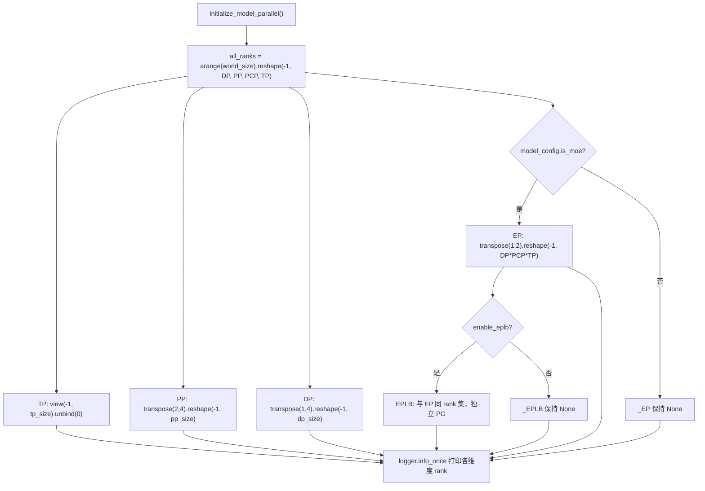
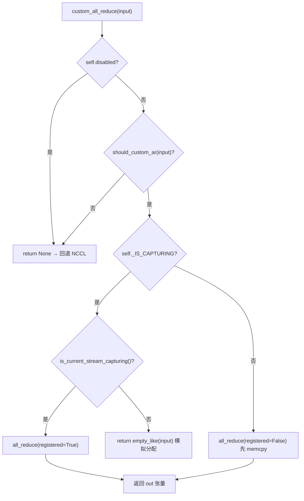

# Capítulo 8: Paralelismo distribuído: TP, PP, EP e primitivas de comunicação

No capítulo anterior, percorremos o último trecho do ciclo de vida de uma única inferência, da amostragem de logits à saída em streaming. Mas quando o modelo é grande demais para caber em um único cartão, esse pipeline precisa ser dividido entre vários dispositivos para execução colaborativa. A primeira questão do raciocínio distribuído não é "como dividir o modelo", mas "depois de dividir, quem fala com quem e de que forma". O vLLM delega essas duas questões, respectivamente, à topologia de grupos de processos em parallel_state.py e à implementação do comunicador em custom_all_reduce.py. Este capítulo segue a cadeia "criar grupo → dividir → comunicar → reequilibrar carga", desmontando camada por camada as estratégias de paralelismo de TP, PP e EP e as primitivas de comunicação de baixo nível.

# 8.1 Topologia de grupos de processos: como uma grade de ranks recorta TP/PP/DP/EP

## Modelo intuitivo

Pense em 8 GPUs como uma mesa comprida com 8 assentos. O paralelismo de tensor (Tensor Parallelism, TP) exige que "as pessoas da mesma mesa levantem o copo ao mesmo tempo", o paralelismo de pipeline (Pipeline Parallelism, PP) exige que "assentos adjacentes passem o prato em revezamento", o paralelismo de dados (Data Parallelism, DP) exige que "mesas diferentes comam por conta própria, mas no final conciliem as contas", e o paralelismo de especialistas (Expert Parallelism, EP) exige que "os tokens sejam triados por setor". Se não houver uma organização unificada de assentos, cada módulo individualmente`new_group`, surge um desalinhamento de comunicação do tipo "pensei que você estava no grupo TP, mas na verdade você está no grupo DP" — uma vez que falte um rank na comunicação coletiva, o NCCL simplesmente trava em vez de reportar erro.

## Estrutura de dados e layout de memória

`GroupCoordinator`é o veículo de tudo isso. O design de seus campos corresponde diretamente à "múltipla identidade de um processo em várias dimensões paralelas":

- `rank`é o rank global,`ranks`é a lista de ranks globais dos membros do grupo,`world_size`é o tamanho do grupo[FACT:vllm/distributed/parallel_state.py:434-436]。
- `local_rank`usado para vincular o dispositivo,`rank_in_group`é o índice dentro do grupo — o código-fonte usa uma tabela para distinguir precisamente os dois: em um grupo de 4 GPUs distribuído em dois nós, o`local_rank`do rank 2 é 0 (ele é a primeira GPU no nó 1), mas`rank_in_group`é 2[FACT:vllm/distributed/parallel_state.py:437-445]。
- `cpu_group`e`device_group`existem em pares: o primeiro usa gloo para comunicação de metadados/objetos, o segundo usa NCCL para comunicação de tensores[FACT:vllm/distributed/parallel_state.py:446-447]。

Aqui há um design crucial:**Por que cada grupo precisa manter um grupo de CPU?**Porque`broadcast_object`、`send_object`operações desse tipo transmitem objetos Python (bytes serializados), e usar NCCL desperdiça memória de GPU e pode poluir o dispositivo CUDA atual.`barrier()`Os comentários de deixam isso bem claro: o barrier do NCCL é internamente um broadcast, que cria tensores de GPU sorrateiramente e pode bagunçar o dispositivo atual, então é obrigatório usar o grupo de CPU[FACT:vllm/distributed/parallel_state.py:1355-1362]。

## Step-by-Step：`initialize_model_parallel`Como dividir a grade

Vamos a um cenário concreto: 8 GPUs, TP=2, PP=4, DP=1. O núcleo é fazer reshape de uma sequência unidimensional de ranks em uma grade multidimensional e então dividir ao longo de cada dimensão.

Primeiro passo, construir a grade de ranks. A ordem de layout é explicitamente definida como`ExternalDP x DP x PP x PCP x TP` [FACT:vllm/distributed/parallel_state.py:2045-2060]：

```python
all_ranks = torch.arange(world_size).reshape(
    -1, data_parallel_size, pipeline_model_parallel_size,
    prefill_context_model_parallel_size, tensor_model_parallel_size,
)
```

Segundo passo, dividir o grupo TP: fazer view da grade como`(-1, tp_size)`e então unbind, obtendo`[g0,g1],[g2,g3],...` [FACT:vllm/distributed/parallel_state.py:2065-2077]. Note que o grupo TP passa adicionalmente`use_message_queue_broadcaster=True`, porque o grupo TP precisa de broadcast de memória compartilhada para distribuir metadados.

Terceiro passo, dividir o grupo PP:`all_ranks.transpose(2, 4)`mover a dimensão PP para a última dimensão e então dividir, obtendo`[g0,g2,g4,g6],[g1,g3,g5,g7]` [FACT:vllm/distributed/parallel_state.py:2175-2188]. Este é exatamente o exemplo dado na docstring[FACT:vllm/distributed/parallel_state.py:1997-1997]。

Quarto passo, dividir o grupo DP:`transpose(1, 4)`e então dividir[FACT:vllm/distributed/parallel_state.py:2195-2202]。

Quinto passo, dividir o grupo EP — aqui há um detalhe fácil de ignorar: o grupo EP só é criado em modelos MoE, modelos dense simplesmente pulam[FACT:vllm/distributed/parallel_state.py:2210-2241]. O conjunto de ranks do grupo EP é o produto de`DP x PCP x TP`, o que significa que o EP reutiliza as GPUs físicas do DP e do TP, em vez de ser uma dimensão independente.



## Reflexões de design e armadilhas

**Por que o EPLB precisa de um grupo de processos independente?**Os comentários dão a resposta: isolar a comunicação do EPLB da comunicação coletiva do forward do MoE, evitando que "o torch.distributed da fase de execução" e "o torch.distributed do EPLB" causem deadlock mútuo[FACT:vllm/distributed/parallel_state.py:2243-2246]. Este é um trade-off típico de "trocar um domínio de comunicação independente por determinismo" — o custo de memória de GPU de um PG a mais é trocado pela garantia de não travar o forward durante a movimentação de pesos.

**Restrição de sincronização do grupo DP**é a armadilha mais comum em produção: todos os ranks dentro do mesmo grupo DP devem chamar`generate`simultaneamente, caso contrário há deadlock[FACT:vllm/distributed/parallel_state.py:2048-2051]. Porque dentro do grupo DP é feito all-reduce de gradientes/resultados de amostragem, e qualquer rank ausente fará a comunicação coletiva bloquear permanentemente.

**Ordem de destruição**também tem suas particularidades.`destroy()`Primeiro destrói o device communicator, depois o device_group e o cpu_group[FACT:vllm/distributed/parallel_state.py:1380-1393]. Os comentários explicam o motivo: o device communicator pode manter áreas de trabalho de comunicação coletiva que dependem desses PGs (como a FlashInfer PCIe IPC barrier), então deve ser liberado primeiro[FACT:vllm/distributed/parallel_state.py:1377-1377]。

# 8.2 Primitivas de comunicação: como o all-reduce customizado contorna o NCCL

## Modelo intuitivo

O all-reduce do NCCL é um "caminhão de carga geral", capaz de transportar qualquer carga por qualquer rota, mas com overhead fixo de inicialização e protocolo. Quando você precisa fazer repetidamente all-reduce de tensores pequenos em uma máquina de 8 GPUs totalmente interconectadas por NVLink (cada camada de attention/MLP do TP precisa fazer isso), o "pedágio" do caminhão de carga geral torna-se não desprezível. O all-reduce customizado é um "carrinho dedicado": habilitado apenas em cenários intra-nó, com NVLink totalmente interconectado e tamanho de tensor adequado, trocando uma vez`cudaMemcpy`pelo handshake e overhead de protocolo do NCCL.

## Estrutura de dados e layout de memória

`CustomAllreduce`A inicialização de é uma combinação de "detecção de capacidades + pré-alocação de recursos". Campos-chave:

- `_SUPPORTED_WORLD_SIZES = [2, 4, 6, 8, 16]`: só suporta esses tamanhos de grupo[FACT:vllm/distributed/device_communicators/custom_all_reduce.py:113-129]。
- `meta_ptrs`: metadados de sincronização + buffer de resultados intermediários, tamanho`ops.meta_size() + max_size` [FACT:vllm/distributed/device_communicators/custom_all_reduce.py:291-294]。
- `buffer_ptrs`: buffer IPC pré-registrado, no modo eager o tensor de entrada é copiado para cá antes do cálculo[FACT:vllm/distributed/device_communicators/custom_all_reduce.py:298-305]。
- `rank_data`: tensor uint8 de 8MB, armazena as tuplas de ponteiros de buffer IPC de todos os ranks[FACT:vllm/distributed/device_communicators/custom_all_reduce.py:309-315]。

**Por que os buffers precisam ser pré-registrados?**Porque a captura de CUDA Graph exige que todos os endereços estejam fixos no momento da captura.`register_graph_buffers`No final da captura, faz broadcast de todos os endereços de buffer usados para todos os ranks e os registra[FACT:vllm/distributed/device_communicators/custom_all_reduce.py:474-491]。

## Passo a passo: o fluxo de decisão de um all-reduce

Cenário: a saída de uma camada MLP dentro do grupo TP precisa de all-reduce, a entrada é um tensor bf16 de 4MB.

Primeiro passo,`custom_all_reduce`verifica se está desabilitado, se satisfaz`should_custom_ar` [FACT:vllm/distributed/device_communicators/custom_all_reduce.py:529-533]。

Segundo passo,`should_custom_ar`Filtragem item a item: world_size > 8 é rejeitado; dtype deve ser fp32/fp16/bf16; o número de bytes deve ser múltiplo de 16; deve ser fracamente contíguo; só continua se world_size==2 ou totalmente interconectado[FACT:vllm/distributed/device_communicators/custom_all_reduce.py:493-508]。

Terceiro passo, ramificar conforme se está em captura de CUDA Graph: durante a captura usa-se`registered=True`(endereço já fixado), caso contrário`registered=False`(é necessário primeiro memcpy para o buffer pré-registrado)[FACT:vllm/distributed/device_communicators/custom_all_reduce.py:529-545]。

Quarto passo, chamar efetivamente`ops.all_reduce`, passando`buffer_ptrs[rank]`e`max_size` [FACT:vllm/distributed/device_communicators/custom_all_reduce.py:519-527]。



## Reflexões de design e armadilhas

**O caminho de degradação para cenários multi-máquina**é a parte mais engenhosa deste código.`same_node`Quando é falso,`mnnvl_only`define como verdadeiro[FACT:vllm/distributed/device_communicators/custom_all_reduce.py:198-199], em seguida verifica a capacidade MNNVL (Multi-Node NVLink). Se nem todas as GPUs do grupo suportarem MNNVL, desabilita diretamente a comunicação coletiva personalizada[FACT:vllm/distributed/device_communicators/custom_all_reduce.py:228-233]。`_group_can_attempt_mnnvl`usa um all-reduce de CPU (operação MIN) para garantir que todos os ranks sigam o mesmo fluxo de controle[FACT:vllm/distributed/device_communicators/custom_all_reduce.py:59-73]——esta é a proteção crucial em clusters heterogêneos para evitar que "parte dos ranks entre no caminho MNNVL e parte vá para NCCL" causando travamento.

**O custo da verificação P2P**：`_can_p2p`percorre todos os peers fazendo`gpu_p2p_access_check`, o comentário diz que o primeiro cálculo é caro mas será cacheado[FACT:vllm/distributed/device_communicators/custom_all_reduce.py:278-278]. Em ambiente de produção, se notar inicialização lenta, pode definir`VLLM_SKIP_P2P_CHECK`para pular, confiando diretamente no relatório P2P do driver[FACT:vllm/distributed/device_communicators/custom_all_reduce.py:86-100]。

**A seleção de backend em três níveis do reduce-scatter**merece ser vista separadamente:`_select_reduce_scatter_backend`retorna por prioridade`mnnvl_multimem` > `mnnvl_lamport` > `legacy` [FACT:vllm/distributed/device_communicators/custom_all_reduce.py:601-636]. O caminho multimem exige que world_size esteja em`(2,4,8)`e que a capacidade do dispositivo seja (10,0) ou (10,3) (nível Blackwell)[FACT:vllm/distributed/device_communicators/custom_all_reduce.py:103-104]. Note que`VLLM_BATCH_INVARIANT`desabilita o caminho multimem[FACT:vllm/distributed/device_communicators/custom_all_reduce.py:628]——porque a ordem de redução do multimem é indeterminada, o que quebraria a invariância de batch.

# 8.3 EPLB: lógica de agendamento para rebalanceamento de carga de especialistas

## Modelo intuitivo

Em modelos MoE, 256 especialistas lógicos são distribuídos em 32 GPUs, 8 por GPU. Mas sob tráfego real, alguns "especialistas populares" (por exemplo, os que processam estruturas gramaticais comuns) recebem roteamento de uma grande quantidade de tokens, fazendo com que a GPU que os contém se torne gargalo, enquanto as outras ficam ociosas. O EPLB (Expert Parallel Load Balancer) consiste em "adicionar réplicas aos especialistas populares": copiar os pesos dos especialistas populares para GPUs ociosas, permitindo que os tokens sejam desviados para lá. Sem ele, a vazão real do MoE ficaria travada pela GPU mais lenta.

## Estruturas de dados e layout de memória

`EplbModelState`usa três tabelas de mapeamento para descrever a relação "especialista lógico ↔ especialista físico":

- `physical_to_logical_map`: formato`(num_moe_layers, num_physical_experts)`, cada slot físico armazena o id do especialista lógico que ele carrega[FACT:vllm/distributed/eplb/eplb_state.py:105-120]。
- `logical_to_physical_map`: formato`(num_moe_layers, num_logical_experts, max_replicas+1)`, matriz esparsa, -1 indica ausência de mapeamento[FACT:vllm/distributed/eplb/eplb_state.py:123-146]。
- `logical_replica_count`: quantas réplicas cada especialista lógico possui[FACT:vllm/distributed/eplb/eplb_state.py:147-161]。

`expert_load_window`é a janela deslizante, formato`(window_size, num_moe_layers, num_physical_experts)` [FACT:vllm/distributed/eplb/eplb_state.py:180-187]. O comentário destaca especialmente: agora registra-se a carga de todos os especialistas físicos, não apenas dos locais, para garantir que diferentes métodos de dispatch (naive all-to-all, DeepEP) tenham estatísticas consistentes; sob naive all-to-all, cada rank de DP contribui com o mesmo conjunto de tokens, e a carga é multiplicada por dp_size[FACT:vllm/distributed/eplb/eplb_state.py:180-187]。

## Passo a passo: a cadeia completa de um rearranjo

Cenário de exemplo:`expert_rearrangement_step`atinge o limiar, dispara`rearrange()`。

Primeiro passo, mapear a carga física de volta para os especialistas lógicos. Usa`scatter_add_`para agregar por`physical_to_logical_map`, slots inválidos (<0) são preenchidos no`invalid_idx`bucket e descartados no final[FACT:vllm/distributed/eplb/eplb_state.py:794-816]。

Segundo passo, all-reduce entre ranks para obter a carga lógica global.`_allreduce_list`concatena as cargas de múltiplos modelos e faz um único all-reduce e depois separa, evitando múltiplas comunicações[FACT:vllm/distributed/eplb/eplb_state.py:1045-1068]。

Terceiro passo, chamar a estratégia para calcular o novo mapeamento.`policy.rebalance_experts`roda no host, então a janela de carga e o mapeamento atual precisam ser copiados de volta para a CPU[FACT:vllm/distributed/eplb/eplb_state.py:859-867]。

Quarto passo, julgamento de "pular rearranjo" especializado para ROCm: se a melhoria no desequilíbrio de carga entre ranks trazida pelo novo mapeamento for menor que 5%, pula este rearranjo[FACT:vllm/distributed/eplb/eplb_state.py:869-923]. Esta é uma otimização pragmática——o rearranjo em si tem custo de comunicação, se o ganho não for suficiente, não se faz.

Quinto passo, executar a movimentação de pesos e submeter o novo mapeamento[FACT:vllm/distributed/eplb/eplb_state.py:925-942]。

```mermaid
sequenceDiagram
    participant Main as 主线程 step()
    participant Policy as DefaultEplbPolicy
    participant Comm as EplbCommunicator
    participant Async as async_worker 线程
    Main->>Main: expert_rearrangement_step >= interval
    Main->>Main: scatter_add_ 物理负载→逻辑负载
    Main->>Main: _allreduce_list 跨 rank 聚合
    Main->>Policy: rebalance_experts(load, replicas, groups, nodes, gpus, map)
    Policy-->>Main: new_physical_to_logical_map
    alt 同步模式
        Main->>Comm: rearrange_expert_weights_inplace()
        Comm-->>Main: 权重搬运完成
        Main->>Main: _commit_eplb_maps()
    else 异步模式
        Main->>Main: eplb_stats = EplbStats(...); rebalanced = True
        Main->>Async: rearrange_event.record()
        Async->>Comm: 后台搬运权重到 expert_buffer
        Async-->>Main: pending_result 就绪
        Main->>Main: _move_to_workspace() 提交
    end
```

## Reflexões de design e armadilhas

**Primitivas de sincronização no modo assíncrono**é o ponto mais sutil deste código.`rebalanced`A flag depende do GIL para sincronizar entre a thread principal e o async worker[FACT:vllm/distributed/eplb/eplb_state.py:194-203]. Mas o comentário alerta:`rebalanced`deve permanecer consistente em todos os ranks, caso contrário o all-reduce dentro de`_all_ranks_result_ready`travará[FACT:vllm/distributed/eplb/eplb_state.py:664-665]。`_all_ranks_result_ready`prioriza usar o grupo de CPU para o all-reduce, porque o grupo de CPU é mais confiável[FACT:vllm/distributed/eplb/eplb_state.py:1024-1043]。

**Otimização de "gravação antecipada" da janela deslizante**：`_should_record_current_step`só ativa a gravação quando faltam no máximo`window_size`passos para o próximo rearranjo[FACT:vllm/distributed/eplb/eplb_state.py:689-709]. O comentário explica: os dados dos`step_interval - window_size`passos antes de cada ciclo de rearranjo serão sobrescritos pela janela deslizante, gravar seria inútil, desperdiçando computação de GPU[FACT:vllm/distributed/eplb/eplb_state.py:1196-1199]。`should_record_tensor`é o mesmo tensor escalar compartilhado por todas as camadas, uma única`fill_`atualiza todas as camadas[FACT:vllm/distributed/eplb/eplb_state.py:272-278]。

**Reserva de capacidade do EP elástico**：`enable_elastic_ep`quando,`physical_expert_capacity`reserva conforme`elastic_ep_max_dp_size`, a tabela de mapeamento preenche os slots extras com -1[FACT:vllm/distributed/eplb/eplb_state.py:375-386]. Assim, ao expandir não é necessário realocar memória de vídeo, basta preencher os slots -1 com especialistas reais.`reconfigure_physical_expert_slots`é responsável por atualizar a visão ao expandir/contrair[FACT:vllm/distributed/eplb/eplb_state.py:1135-1160]。

**`_commit_eplb_maps`Tratamento de pin memory de**: quando`PIN_MEMORY`está ativado e a origem está na CPU, primeiro copia para memória pinned e depois`non_blocking=True`cópia assíncrona para a GPU[FACT:vllm/distributed/eplb/eplb_state.py:1392-1400]. Isso evita que a cópia H2D bloqueie a thread principal——a tabela de mapeamento é atualizada a cada camada e a cada rodada, cópias síncronas se tornariam gargalo.

# Reflexões de design

Três blocos de código compartilham uma filosofia de design:**Trocar capacidade de detecção por degradação determinística**。`GroupCoordinator`Em`world_size == 1`fazer bypass direto de toda comunicação coletiva[FACT:vllm/distributed/parallel_state.py:736-738]；`CustomAllreduce`retornar quando qualquer condição não for satisfeita`None`permitir que o chamador faça fallback para NCCL[FACT:vllm/distributed/device_communicators/custom_all_reduce.py:532-533]; EPLB pula o rearranjo quando a melhoria é inferior a 5%[FACT:vllm/distributed/eplb/eplb_state.py:916]. Esse padrão de "falha rápida + degradação graciosa" permite que o mesmo código rode em toda a gama de hardware, de uma única GPU a MNNVL multi-nó, sem precisar escrever ramificações para cada configuração.

Outra característica comum é**Consistência de fluxo de controle tem prioridade sobre desempenho**。`_group_can_attempt_mnnvl`usar CPU all-reduce para forçar todos os ranks a seguir o mesmo ramo[FACT:vllm/distributed/device_communicators/custom_all_reduce.py:59-73]，`_all_ranks_result_ready`Da mesma forma[FACT:vllm/distributed/eplb/eplb_state.py:1024-1043]. Em sistemas distribuídos, "alguns ranks seguem o caminho rápido, outros o caminho lento" é muito mais perigoso do que "todos os ranks seguem o caminho lento" — o primeiro trava, o segundo apenas fica lento.

# Resumo do capítulo

- `GroupCoordinator`reshape da sequência unidimensional de ranks em`ExternalDP x DP x PP x PCP x TP`grade, dividindo ao longo de cada dimensão os grupos de processos TP/PP/DP/EP/EPLB; cada grupo mantém simultaneamente dois PGs: CPU (gloo) e device (NCCL).
- `CustomAllreduce`Através da detecção de capacidade (mesma máquina, NVLink totalmente interconectado, tamanho do tensor, dtype, alinhamento de 16 bytes) decide se assume o all-reduce, degradando para MNNVL ou NCCL em cenários multi-nó.
- EPLB usa três tabelas de mapeamento para descrever a relação entre especialistas lógicos/físicos, através de janela deslizante estatística de carga, estratégia de cálculo de novo mapeamento, comunicador para transportar pesos, suportando modos síncrono e assíncrono.
- Princípio de design comum aos três: detecção de capacidade + degradação determinística + consistência de fluxo de controle prioritária.

# Reflexões e autoavaliação do capítulo

Q1: `GroupCoordinator.destroy()`Destruir primeiro o device communicator e depois o process group[FACT:vllm/distributed/parallel_state.py:1380-1393]. Se invertermos a ordem, destruindo primeiro o PG e depois o communicator, em qual cenário ocorreria crash?

**Análise de referência**: O comentário indica explicitamente que o device communicator pode manter áreas de trabalho de comunicação coletiva que dependem desses PGs, como FlashInfer PCIe IPC barrier[FACT:vllm/distributed/parallel_state.py:1377-1377]. Se destruirmos primeiro o PG, o communicator`destroy()`internamente, se ainda precisar usar esses PGs para uma barrier ou limpeza de comunicação, acessará um ProcessGroup já destruído, disparando use-after-free ou falha de asserção interna do NCCL. A ordem correta é "o dependente morre primeiro": o communicator depende do PG, então o communicator é destruído primeiro.

Q2: `should_custom_ar`Requer`inp_size % 16 == 0` [FACT:vllm/distributed/device_communicators/custom_all_reduce.py:493-508]. Se removermos essa verificação, o que aconteceria com um tensor bf16 de 15 bytes (por exemplo, 7,5 elementos, o que na prática é impossível, mas suponha 8 elementos = caso limite de 16 bytes)? Por que o kernel customizado precisa desse alinhamento?

**Análise de referência**: O kernel all-reduce customizado usa internamente carregamento vetorizado (como load de 128 bits), exigindo que endereço e tamanho estejam alinhados a 16 bytes para usar`float4`instruções de carregamento largo como essa. O desalinhamento faria o kernel ler fora dos limites ou disparar exceção de endereço desalinhado. Mais sutil ainda,`buffer_ptrs`o buffer pré-registrado é alocado por`max_size`; se o tamanho de entrada não for múltiplo de 16, após copiar para o buffer pode haver dados residuais na cauda sendo reduzidos junto, gerando erro silencioso. Portanto, essa verificação é tanto proteção de correção quanto pré-requisito de desempenho.

Q3: No modo assíncrono do EPLB,`rebalanced`a flag depende de sincronização do GIL[FACT:vllm/distributed/eplb/eplb_state.py:194-203], e o comentário alerta que todos os ranks devem permanecer consistentes, caso contrário o all-reduce trava[FACT:vllm/distributed/eplb/eplb_state.py:664-665]. Suponha que um rank, devido a instabilidade de rede, tenha o async worker definido`rebalanced`como False antecipadamente, enquanto os outros ranks ainda estão True,`_all_ranks_result_ready`o que aconteceria?

**Análise de referência**：`_all_ranks_result_ready`Faz all-reduce de soma sobre`has_result`e então verifica se é igual ao tamanho do grupo[FACT:vllm/distributed/eplb/eplb_state.py:1030-1032]. Se o`rebalanced`de algum rank virar False antecipadamente, seu`pending_result`pode já ter sido consumido,`has_result`sendo 0, fazendo o resultado da soma ser menor que o tamanho do grupo, e os outros ranks ficarão esperando. Pior ainda, se esse rank já saiu do`while ms.rebalanced`loop, ele não participará mais dos all-reduces subsequentes, e os all-reduces dos outros ranks bloquearão permanentemente — é isso que o comentário chama de "hang at collective communication calls". A medida de proteção é`_all_ranks_result_ready`usar o grupo CPU em vez do grupo device, e`drain_async`drenar explicitamente todos os pending results antes do rearranjo[FACT:vllm/distributed/eplb/eplb_state.py:985-1022]。

Até aqui, esclarecemos os mecanismos de criação de grupos, divisão e rebalanceamento de carga para comunicação entre placas. Mas o desafio de comunicação da inferência distribuída não se limita ao interior de uma única instância — quando prefill e decode são separados em instâncias diferentes, o KV Cache precisa ser transferido entre nós. No próximo capítulo, deixaremos a "comunicação entre placas" e entraremos na "comunicação entre instâncias": como o KV Cache é transferido entre instâncias de prefill e decode em implantação separada, e como a abstração KV Connector unifica backends de transferência como NIXL, Mooncake, etc.
