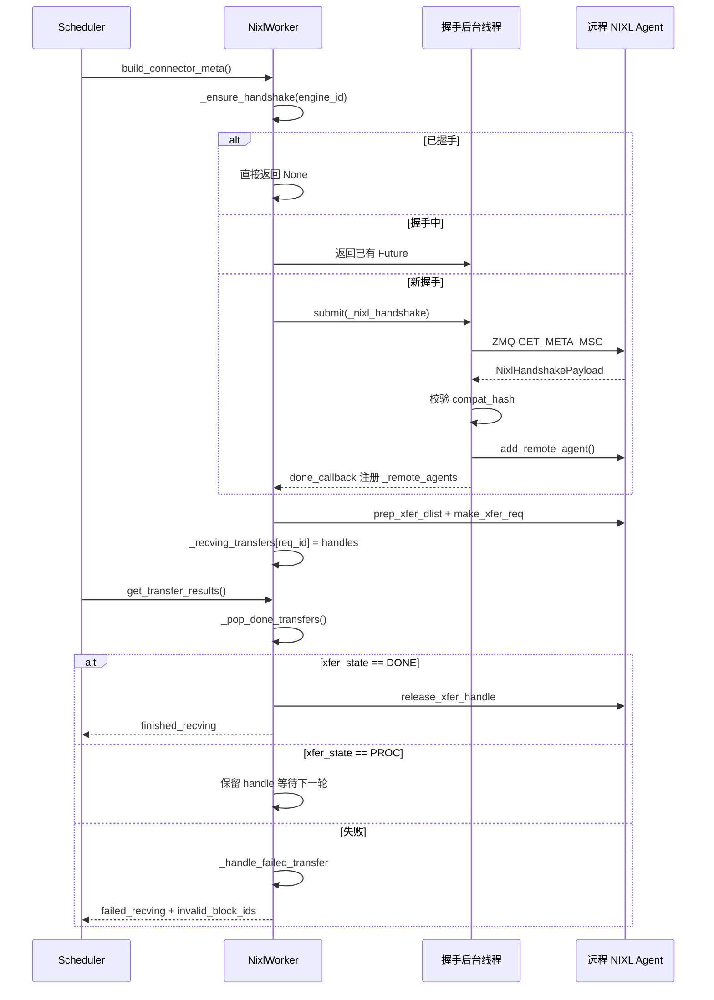

# Capítulo 9: Transferência de KV Cache e Implantação Separada (PD Disaggregation)

No capítulo anterior, restringimos nossa visão ao interior de uma única instância de inferência: como os grupos de processos TP/PP/DP/EP são criados, como os tensores são divididos entre placas, e como o EPLB faz o rebalanceamento de especialistas na camada MoE. Mas todos esses mecanismos partem da mesma premissa — prefill e decode rodam na mesma instância, e o KV Cache permanece na memória local do início ao fim. A implantação separada (Prefill-Decode Disaggregation, abreviada como PD Disaggregation) quebra essa premissa. Ela divide prefill e decode em duas instâncias vLLM independentes: a instância de prefill faz apenas o cálculo forward do prompt, produz o KV Cache e o entrega à instância de decode; a instância de decode usa esse KV Cache para continuar a geração autorregressiva. A vantagem é que os recursos podem ser configurados independentemente de acordo com as características de cada fase — prefill é intensivo em computação, adequado para TP grande e batch grande; decode é intensivo em acesso à memória, adequado para batch pequeno e agendamento de baixa latência. Os dois não se atrapalham mais. O custo é: o KV Cache precisa ser transferido entre instâncias. Esse é o protagonista deste capítulo — o KV Connector. O comentário de cabeçalho do arquivo vllm/distributed/kv_transfer/kv_connector/v1/base.py já lista as primitivas centrais de toda a abstração: o lado do Scheduler é responsável por vincular metadados, consultar acertos de cache remoto e decidir se libera blocos de forma assíncrona; o lado do Worker é responsável pela carga e salvamento reais do KV. O objetivo de design dessa interface é desacoplar completamente a lógica de agendamento superior dos backends de transferência subjacentes (NIXL, Mooncake, MoRIIO). Do ponto de vista de engenharia, o maior risco da PD Disaggregation não é a lentidão da transferência, mas a inconsistência de estado: a instância de prefill acha que o KV já foi enviado, mas a instância de decode não o recebeu; ou a instância de decode libera o bloco antecipadamente, enquanto o prefill ainda está escrevendo nele. O que este capítulo pretende esclarecer é exatamente como esse sistema de conectores usa protocolos de handshake, leases, heartbeats e mecanismos de recuperação de falhas para cobrir essas bordas.

# I. KVConnectorBase_V1: Abstração de Papel Duplo e Contrato de Metadados

## Modelo Intuitivo

O KV Connector é como um sistema de entrega entre duas filiais. A filial de Prefill calcula o produto semiacabado (KV Cache), embala e envia para a filial de Decode continuar o processamento. Mas o sistema de entrega não pode ter apenas a ação de "enviar" — ele precisa de uma guia de transporte (metadata) indicando o que enviar e para onde; precisa de um mecanismo de confirmação de recebimento; e também precisa de um conjunto de regras de timeout para evitar que pacotes fiquem presos na estrada ocupando prateleiras.

Sem essa abstração, cada backend de transferência (NIXL, Mooncake) teria que implementar sua própria lógica de agendamento, e o Scheduler do vLLM teria que escrever um conjunto de código de adaptação para cada backend. O valor do KVConnectorBase_V1 é fixar esse contrato.

## Papel Duplo: Lado do Scheduler e Lado do Worker

[FACT:vllm/distributed/kv_transfer/kv_connector/v1/base.py:137-142]define os dois papéis do conector:

```python
class KVConnectorRole(enum.Enum):
    # Connector running in the scheduler process
    SCHEDULER = 0
    # Connector running in the worker process
    WORKER = 1
```

Essa divisão não é arbitrária. O processo do Scheduler é responsável pelas decisões globais de agendamento — quais requisições precisam de transferência, quando os blocos podem ser liberados; o processo do Worker é responsável pela movimentação real dos dados. Ambos se comunicam através de`KVConnectorMetadata`comunicação.

[FACT:vllm/distributed/kv_transfer/kv_connector/v1/base.py:153-158]define a classe base de metadados na direção Scheduler para Worker:

```python
class KVConnectorMetadata(ABC):  # noqa: B024
    """Abstract Metadata used to communicate
    Scheduler KVConnector -> Worker KVConnector.
    """
    pass
```

Na direção inversa, Worker para Scheduler,[FACT:vllm/distributed/kv_transfer/kv_connector/v1/base.py:161-176]define`KVConnectorWorkerMetadata`, que exige a implementação do método`aggregate`— porque em um engine step pode haver múltiplos workers retornando metadados cada um, que precisam ser agregados antes de serem entregues ao Scheduler.

## Estrutura de Dados Central: KVConnectorTransferResults

[FACT:vllm/distributed/kv_transfer/kv_connector/v1/base.py:87-96]define a estrutura de snapshot dos resultados de transferência:

```python
@dataclass
class KVConnectorTransferResults:
    finished_sending: set[str] = field(default_factory=set)
    finished_recving: set[str] = field(default_factory=set)
    failed_recving: set[str] = field(default_factory=set)
```

Observe o design-chave nos comentários:**Recebimentos falhos também aparecem em`finished_recving`**. Isso é para permitir que o Scheduler libere a requisição do estado de "aguardando transferência" — mesmo que a transferência falhe, a requisição não pode ficar travada para sempre. A informação de falha é transmitida separadamente através de`failed_recving`, e o Scheduler decide com base nisso se deve tentar novamente ou fazer downgrade.

## Hooks de ciclo de vida: da requisição à liberação

Todo o ciclo de vida do conector gira em torno de alguns hooks principais. No lado do Scheduler:

- `get_num_new_matched_tokens` [FACT:vllm/distributed/kv_transfer/kv_connector/v1/base.py:485-518]: consulta quantos tokens o cache remoto pode acertar. O comentário enfatiza especialmente que "deve-se considerar apenas o prefixo máximo realmente disponível"; se alguns tokens não puderem ser obtidos devido a problemas de conexão ou eviction, eles não podem ser contabilizados.
- `update_state_after_alloc` [FACT:vllm/distributed/kv_transfer/kv_connector/v1/base.py:520-544]: atualiza o estado após a alocação de block. Há uma armadilha fácil de cometer nos comentários — para determinar se deve carregar, é preciso verificar`num_external_tokens`, e não se`blocks`está vazio, porque os subconectores não selecionados do MultiConnector também recebem blocks reais.
- `request_finished` [FACT:vllm/distributed/kv_transfer/kv_connector/v1/base.py:579-598]: chamado quando a requisição é concluída, retorna`True`indicando que o conector assume a responsabilidade de liberação assíncrona do block.

No lado do Worker:

- `start_load_kv` / `wait_for_layer_load`: carrega camada por camada, com suporte a pipeline.
- `save_kv_layer` / `wait_for_save`: salva camada por camada.
- `get_transfer_results` [FACT:vllm/distributed/kv_transfer/kv_connector/v1/base.py:396-397]: retorna o status de conclusão da transferência assíncrona.

[FACT:vllm/distributed/kv_transfer/kv_connector/v1/base.py:192-201]Há também um design fácil de ignorar, mas crucial —`requires_kv_delivery`atributo:

```python
@property
def requires_kv_delivery(self) -> bool:
    """Whether this connector hands off KV that must be reliably delivered.
    ...
    """
    return self._kv_transfer_config.is_kv_producer
```

O comentário explica a motivação: se a requisição for preempted antes que a transferência de KV seja concluída, deve-se recalcular em vez de deixá-la completar e transferir blocks que já foram liberados pela preempção. Apenas o papel de producer precisa de entrega confiável; se o cache best-effort for perdido, será apenas um cache miss futuro.

## Metadados de handshake

[FACT:vllm/distributed/kv_transfer/kv_connector/v1/base.py:145-150]define a classe base dos metadados de handshake:

```python
class KVConnectorHandshakeMetadata(ABC):  # noqa: B024
    """Metadata used for out of band connector handshake between
    P/D workers. This needs to serializable.
    """
    pass
```

"out of band" significa que o handshake não segue o caminho normal da requisição, mas sim a comunicação direta entre os workers P/D. Isso prepara o terreno para o protocolo de handshake ZMQ do NIXL.

---

# II. Conector NIXL: handshake, registro e construção de descritores

## Modelo intuitivo

NIXL (NVIDIA Inference Xfer Library) é a biblioteca de transporte de baixo nível fornecida pela NVIDIA, com suporte a diversos backends como UCX, GDS, etc. O papel do NixlBaseConnectorWorker é como o centro de triagem de uma transportadora — ele precisa primeiro estabelecer uma linha dedicada com o centro de triagem da outra parte (handshake), registrar o layout de suas próprias prateleiras (registrar as regiões de memória do KV Cache), e só então pode buscar e enviar mercadorias de forma eficiente por endereço.

Sem esse mecanismo, cada transferência precisaria renegociar endereços e restabelecer conexões, e a latência seria inaceitavelmente alta.

## Layout de memória: Region e Descriptor

O conceito central do NIXL é**region**(região de memória) e**descriptor**(descritor). Cada camada do KV Cache é registrada no NIXL como uma ou mais regions, e cada region tem endereço base, comprimento de bloco e stride de bloco.

[FACT:vllm/distributed/kv_transfer/kv_connector/v1/nixl/base_worker.py:740-751]lista os campos principais relacionados a region:

```python
# Number of NIXL regions. Currently one region per cache
# (so 1 per layer for MLA, otherwise 2 per layer)
self.num_regions = 0
self.region_mem_types: list[str] = []
self.region_group_ids: list[int] = []
self._uses_region_group_mapping = False
self.region_names: list[str] = []
self.region_num_blocks: list[int] = []
self._mixed_mem_types = False
```

[FACT:vllm/distributed/kv_transfer/kv_connector/v1/nixl/base_worker.py:897-900]explica ainda a origem do stride de bloco:

```python
# Per-region block stride in bytes. Taken from the registered tensor's
# stride(0) so it stays correct under layouts that interleave layers
# within a block (BLHNC/BHLNC), where stride > block_len.
self.block_stride_per_layer = list[int]()
```

A percepção-chave aqui é:**block_stride não é igual a block_len**. Em layouts com intercalação entre camadas como BLHNC/BHLNC, a extensão real de um block pode ser maior que o comprimento de seus dados efetivos. Se block_len for usado diretamente como stride, endereços incorretos serão lidos.

## Protocolo de handshake: ZMQ + hash de compatibilidade

O handshake é a parte mais complexa do conector NIXL.[FACT:vllm/distributed/kv_transfer/kv_connector/v1/nixl/base_worker.py:974-1128]O método`_nixl_handshake`de

demonstra completamente esse processo.[FACT:vllm/distributed/kv_transfer/kv_connector/v1/nixl/base_worker.py:988-998]O primeiro passo é configurar o contexto do dispositivo CUDA.

```python
# the first time we connect to a remote agent.
# be careful, the handshake happens in a background thread.
# it does not have an active cuda context until any cuda runtime
# call is made. when UCX fails to find a valid cuda context, it will
# disable any cuda ipc communication, essentially disabling any NVLink
# communication.
if not self.use_host_buffer:
    current_platform.set_device(self.device_id)
```

explica o motivo:

Cópia[FACT:vllm/distributed/kv_transfer/kv_connector/v1/nixl/base_worker.py:1029-1036]：

```python
msg = msgspec.msgpack.encode(
    (GET_META_MSG, remote_pp_rank, remote_rank)
)
# Set receive timeout to 5 seconds to avoid hanging on dead server
sock.setsockopt(zmq.RCVTIMEO, 5000)  # milliseconds
start_time = time.perf_counter()
sock.send(msg)
reply_parts = sock.recv_multipart()
```

O segundo passo é enviar a consulta de metadados via ZMQ.[FACT:vllm/distributed/kv_transfer/kv_connector/v1/nixl/base_worker.py:1042-1045]Cópia

O timeout de 5 segundos serve para evitar espera infinita caso a outra parte morra. Ao mesmo tempo, o código usa RTT para estimar o desvio de clock[FACT:vllm/distributed/kv_transfer/kv_connector/v1/nixl/base_worker.py:1063-1080]：

```python
assert self.compat_hash is not None
if (
    self.enforce_compat_hash
    and handshake_payload.compatibility_hash != self.compat_hash
):
    raise RuntimeError(
        f"NIXL compatibility hash mismatch. "
        ...
    )
```

O terceiro passo é a verificação de compatibilidade.[FACT:vllm/distributed/kv_transfer/kv_connector/v1/nixl/base_worker.py:1372-1376]Cópia

```python
self.compat_hash = compute_nixl_compatibility_hash(
    self.vllm_config,
    self.backend_name,
    transfer_mode=self._TRANSFER_MODE,
)
```

:`transfer_mode`Cópia[FACT:vllm/distributed/kv_transfer/kv_connector/v1/nixl/base_worker.py:163-166]Observe que

## também participa do hash —

O comentário de[FACT:vllm/distributed/kv_transfer/kv_connector/v1/nixl/base_worker.py:824-835]：

```python
self._handshake_initiation_executor = ThreadPoolExecutor(
    # NIXL is not guaranteed to be thread-safe, limit 1 worker.
    max_workers=1,
    thread_name_prefix="vllm-nixl-handshake-initiator",
)
self._ready_requests = queue.Queue[tuple[ReqId, ReqMeta]]()
self._handshake_futures: dict[
    EngineId, Future[tuple[dict[tuple[int, int], str], float]]
] = {}
# Protects _handshake_futures and _remote_agents.
self._handshake_lock = threading.RLock()
```

`max_workers=1`Agendamento assíncrono de handshake`_handshake_lock`O handshake é assíncrono, executado através de um pool de threads.`_handshake_futures`Cópia`_remote_agents`é porque o NIXL não garante thread safety.

`_ensure_handshake` [FACT:vllm/distributed/kv_transfer/kv_connector/v1/nixl/base_worker.py:1257-1317]protege os dois dicionários

## e

.[FACT:vllm/distributed/kv_transfer/kv_connector/v1/nixl/base_worker.py:172-310]implementa o início idempotente de handshake: se já houve handshake bem-sucedido, retorna None diretamente; se está em processo de handshake, retorna o Future existente; caso contrário, submete uma nova tarefa e registra o callback.`_compute_desc_ids`Construção de descritores: de block ID para NIXL descriptor

Após a conclusão do handshake, é preciso construir descritores para cada requisição.[FACT:vllm/distributed/kv_transfer/kv_connector/v1/nixl/base_worker.py:226-262]O

```python
# NOTE (NickLucche) With HMA, every kv group has the same number of layers
# and layers from different groups share the same kv tensor.
# eg block_ids=[[1, 2], [3]]->blocks [1, 2] need to be
# read across all regions, same for [3], but group0-group1 blocks will
# always differ (different areas). Therefore we can just flatten the
# block_ids and compute the descs ids for all groups at once.
```

é o núcleo.[FACT:vllm/distributed/kv_transfer/kv_connector/v1/nixl/base_worker.py:285-304]：

```python
elif _is_ssm_spec(spec_type):
    # NOTE (NickLucche) SSM and Attention block regions can
    # be exchanged arbitrarily by manager.  Therefore, descs
    # are laid out as:
    #   [descs_fa (all regions) | descs_ssm (all regions)].
    # num_fa_descs offset must be computed per-engine since
    # P and D can have different num_blocks (and thus
    # different FA desc counts).
```

## . O comentário explica o tratamento no cenário HMA:

Cópia[FACT:vllm/distributed/kv_transfer/kv_connector/v1/nixl/base_worker.py:2130-2178]Para modelos híbridos com SSM, o layout de descritores é mais complexo`add_remote_agent`Cópia

Quando D.world_size > P.world_size, vários workers D leem fragmentos diferentes de KV head do mesmo worker P. A documentação fornece um exemplo concreto: D TP=4, P TP=2, tp_ratio=2. D-Worker0 lê a primeira metade dos KV heads de P-Worker0, D-Worker1 lê a segunda metade.

Para modelos MLA, o KV Cache é replicado entre os workers TP, então rank_offset é sempre 0.

## Lease e heartbeat: evitando a liberação prematura de blocks

Este é um dos designs mais engenhosos do conector NIXL. Após a instância Prefill enviar o KV, ela não pode liberar o block imediatamente — porque a instância decode pode ainda estar lendo. Mas se nunca liberar, a memória de vídeo vazará.

A solução é o lease.[FACT:vllm/distributed/kv_transfer/kv_connector/v1/nixl/base_worker.py:528-528]：

```python
kv_lease_duration: int = vllm_config.kv_transfer_config.get_from_extra_config(
    "kv_lease_duration", 30
)
# NOTE (NickLucche): For now we use a hardcoded value for a simpler interface.
self._lease_extension = kv_lease_duration * 2 // 3
```

O lease padrão é de 30 segundos, estendido em 20 segundos a cada heartbeat (2/3).

O tratamento do heartbeat está em[FACT:vllm/distributed/kv_transfer/kv_connector/v1/nixl/base_worker.py:3014-3034]：

```python
def _handle_heartbeat(self, payload: str) -> None:
    new_expiry = time.perf_counter() + self._lease_extension
    for req_id in payload.split(","):
        if req_id in self._reqs_to_send:
            old = self._reqs_to_send[req_id]
            self._reqs_to_send[req_id] = max(old, new_expiry)
```

Atenção`max(old, new_expiry)`— o heartbeat só pode estender o lease, não encurtá-lo.

A recuperação após a expiração do lease está em[FACT:vllm/distributed/kv_transfer/kv_connector/v1/nixl/base_worker.py:2986-3012]：

```python
def _reap_expired_send_leases(self, done_sending: set[str]) -> None:
    """Reclaim expired send-side KV leases into ``done_sending``.

    ``_reqs_to_send`` is not ordered by expiry: heartbeats update the
    deadline in place, and mixed TTLs share the map, so a live head
    entry can sit in front of already-expired ones. Scan every entry
    rather than stopping at the first still-live request.
    """
```

O comentário aponta um erro fácil de cometer: não se pode parar a varredura ao encontrar a primeira requisição não expirada, porque o heartbeat atualiza o tempo de expiração no local, fazendo com que o map não esteja ordenado por tempo de expiração.

## Máquina de estados de transferência e recuperação de falhas

O ciclo de vida da transferência é gerenciado através de`_pop_done_transfers` [FACT:vllm/distributed/kv_transfer/kv_connector/v1/nixl/base_worker.py:3036-3086]:

```python
for handle in handles:
    try:
        xfer_state = self.nixl_wrapper.check_xfer_state(handle)
        if xfer_state == "DONE":
            res = self.nixl_wrapper.get_xfer_telemetry(handle)
            self.xfer_stats.record_transfer(res)
            self.nixl_wrapper.release_xfer_handle(handle)
        elif xfer_state == "PROC":
            in_progress.append(handle)
        else:
            self._log_failure(
                failure_type="transfer_failed",
                req_id=req_id,
                xfer_state=xfer_state,
            )
```

A transferência NIXL tem três estados:`DONE`(concluído),`PROC`(em andamento), outros (falha).

O tratamento de falhas está em[FACT:vllm/distributed/kv_transfer/kv_connector/v1/nixl/base_worker.py:3103-3127]：

```python
def _handle_failed_transfer(
    self,
    req_id: str,
    handle: int | None,
    failed_req_ids: set[str] | None = None,
    record_failed_transfer: bool = True,
) -> bool:
    if record_failed_transfer:
        self.xfer_stats.record_failed_transfer()
    if failed_req_ids is not None:
        failed_req_ids.add(req_id)
    return handle is None or self._try_release_xfer_handle(req_id, handle)
```

`_try_release_xfer_handle` [FACT:vllm/distributed/kv_transfer/kv_connector/v1/nixl/base_worker.py:3088-3101]O comentário em é crucial:

```python
except Exception as e:
    # A status error does not guarantee that the backend stopped DMA.
    self._log_failure(
        failure_type="transfer_release_failed",
        msg="Retaining handle and blocks until release succeeds",
        ...
    )
    return False
```

**Erros de estado não garantem que o backend parou o DMA**. Se a liberação falhar, o handle e o block devem ser mantidos até que a liberação seja bem-sucedida. Este é um design típico de "prefiro vazar a usar incorretamente".

## Tratamento de block para requisições com falha

Quando a recepção falha,[FACT:vllm/distributed/kv_transfer/kv_connector/v1/nixl/base_worker.py:2876-2891]mostra a lógica de tratamento:

```python
for req_id in done_recving:
    meta = self._recving_metadata.pop(req_id, None)
    assert meta is not None, f"{req_id} not found in recving_metadata list"

    # Skip KV sync and post-processing for failed requests
    if req_id in failed_recv_reqs:
        self._pending_recv_notifs.pop(req_id, None)
        # TODO (NickLucche) handle failed transfer for HMA.
        if not self._is_hma_required:
            self._invalid_block_ids.put(set(meta.local_block_ids[0]))
        logger.warning(
            "Skipping KV post-processing for failed request %s",
            req_id,
        )
        continue
```

O ID do block com falha é colocado na fila`_invalid_block_ids`, e o Scheduler o retira através de`get_block_ids_with_load_errors` [FACT:vllm/distributed/kv_transfer/kv_connector/v1/nixl/base_worker.py:3491-3504], decidindo se deve tentar novamente.

## Expulsão por TTL de engines remotas

Instâncias de longa duração encontram continuamente novas engines remotas; se não forem limpas, a memória crescerá indefinidamente.[FACT:vllm/distributed/kv_transfer/kv_connector/v1/nixl/base_worker.py:3506-3532]O`_evict_stale_engines`de implementa a expulsão por TTL:

```python
def _evict_stale_engines(self) -> None:
    """Scan for and evict remote engines that have exceeded their TTL.

    Called from the main thread in when a new remote engine appears.
    We can only go OOM as we discover and register a new remote, therefore we make
    sure we clean up stale engine data structures before then.
    """
    if self._engine_ttl  self._engine_ttl and eid not in busy:
            self._cleanup_remote_engine(eid)
```

A restrição chave é o conjunto`busy`— engines com transferências em andamento não podem ser expulsas.[FACT:vllm/distributed/kv_transfer/kv_connector/v1/nixl/base_worker.py:3534-3546]O comentário em explica o motivo:

```python
"""Remote engines a transfer is still reading from.

The timestamp is stamped when a read is issued and not refreshed while
it runs, so a transfer that outlives the TTL leaves its engine looking
idle. A peer that has lost its NIC holds one indefinitely.
"""
```

Se a placa de rede do par estiver quebrada, a transferência pode ficar pendurada para sempre, o timestamp não será atualizado e a engine parecerá ociosa.`busy`O conjunto protege explicitamente essa situação.

## Temporização do handshake e da transferência

O diagrama de sequência abaixo mostra a interação central desde a requisição até a conclusão da transferência:



---

# III. Reflexões de design: por que foi projetado assim

## Por que o handshake é assíncrono?

O handshake envolve ida e volta pela rede, podendo levar dezenas de milissegundos. Se executado de forma síncrona, bloquearia o loop principal do Scheduler, afetando o agendamento de todas as requisições. O handshake assíncrono permite que o Scheduler processe outras requisições primeiro, notificando via callback quando o handshake for concluído.

Mas a assincronia também traz complexidade:`_handshake_futures`O dicionário precisa de proteção por lock, o callback deve tratar tanto sucesso quanto falha, e ainda é preciso evitar handshakes duplicados.

## Por que usar lease em vez de contagem de referências?

A contagem de referências exige que a instância decode notifique explicitamente o prefill "terminei de ler". Mas se a instância decode falhar, a notificação nunca chegará, e o block do prefill vazará para sempre.

O lease é uma solução mais robusta: mesmo que o decode falhe, após a expiração do lease o prefill recupera automaticamente. O mecanismo de heartbeat garante a renovação do lease em condições normais.

## Por que manter o handle em caso de falha?

[FACT:vllm/distributed/kv_transfer/kv_connector/v1/nixl/base_worker.py:3088-3101]O comentário em deixa claro: erros de estado não garantem que o DMA parou. Se o handle for liberado nesse momento, o DMA pode ainda estar escrevendo dados na memória já liberada, causando corrupção de dados ou crash. Melhor vazar temporariamente do que correr esse risco.

## Por que a expulsão por TTL verifica o busy?

[FACT:vllm/distributed/kv_transfer/kv_connector/v1/nixl/base_worker.py:3534-3546]O comentário em revela um cenário de bug oculto: o timestamp é registrado no início da leitura e não é atualizado durante a leitura. Se o tempo de transferência exceder o TTL, a engine parecerá ociosa, mas na verdade ainda está sendo lida. Se for expulsa nesse momento, a transferência em andamento falhará.

## Armadilhas em ambiente de produção

1. **Problema de contexto CUDA**: o handshake é executado em thread de background, sendo necessário explicitamente`set_device`, caso contrário o UCX desabilitará silenciosamente o NVLink.

2. **Incompatibilidade de hash de compatibilidade**: a versão do vLLM, modelo, dtype, layout de KV e backend de attention das instâncias P/D devem ser completamente idênticos. Em caso de incompatibilidade, o handshake falhará, e a mensagem de erro indicará como desabilitar a verificação (mas não é recomendado).

3. **Expiração do lease**: se a instância decode estiver com carga muito alta, o heartbeat pode atrasar, causando a expiração do lease. Aparecerá um aviso "Releasing expired KV blocks" no log. Pode-se aumentar`kv_lease_duration`。

4. **Incompatibilidade de TP**: TP heterogêneo requer layout block-contiguous (como LBHNC). Se for usado um layout não contíguo, o TP heterogêneo falhará.

5. **Esgotamento de UAR do NIXL**：[FACT:vllm/distributed/kv_transfer/kv_connector/v1/nixl/base_worker.py:631-636]Aviso de comentário: cada thread UCX aloca UAR (doorbell pages) via DevX; uso excessivo de UAR pelo NIXL esgota o espaço de UAR da NIC, fazendo com que o NVSHMEM (usado pelo kernel DeepEP) falhe na inicialização do RDMA.

---

# Resumo do capítulo

Este capítulo aprofundou os mecanismos centrais do sistema KV Connector:

1. **KVConnectorBase_V1**Define a abstração de papéis duplos no lado do Scheduler e no lado do Worker, através de`KVConnectorMetadata`e`KVConnectorTransferResults`para realizar troca de metadados e feedback de resultados de transferência.

2. **Conector NIXL**É a implementação mais madura; estabelece conexões entre instâncias P/D através do protocolo de handshake ZMQ, usa hash de compatibilidade para evitar incompatibilidade de configuração e usa pool de threads assíncrono para evitar bloquear o loop principal.

3. **Lease e heartbeat**O mecanismo resolve o problema de timing da liberação de block: o prefill não libera imediatamente após enviar o KV, mas espera a renovação do heartbeat do decode ou a expiração do lease.

4. **Recuperação de falhas**Segue o princípio de "prefira vazar a usar errado": em caso de falha na liberação, mantém o handle; o block ID com falha é reportado ao Scheduler para decidir sobre retry.

5. **Expulsão por TTL**Evita crescimento ilimitado do estado de engines remotos em execuções de longa duração, mas deve proteger engines com transferências em andamento.

No próximo capítulo, voltamo-nos para outra direção de eliminação de overhead: aceleração de compilação e CUDA Graph. Quando a separação PD resolveu o problema de utilização de recursos, o overhead de inicialização de um único forward torna-se o novo gargalo — como usar CUDA Graph para comprimir centenas ou milhares de lançamentos de kernels em uma única reprodução.

# Reflexões e autoavaliação deste capítulo

Q1: Se removermos o tratamento de exceções em`_try_release_xfer_handle`e chamarmos diretamente`release_xfer_handle`, em quais cenários isso causaria corrupção de dados? Por quê?

**Análise de referência**：`_try_release_xfer_handle` [FACT:vllm/distributed/kv_transfer/kv_connector/v1/nixl/base_worker.py:3088-3101]O comentário em deixa claro: "A status error does not guarantee that the backend stopped DMA." Se removermos o tratamento de exceções, quando`release_xfer_handle`lançar uma exceção, o chamador pensará que a liberação foi bem-sucedida e continuará liberando o block. Mas, na verdade, o DMA do backend NIXL pode ainda estar em andamento, escrevendo dados nessa memória. Uma vez que o block seja realocado para outra requisição, a escrita do DMA contaminará o KV Cache da nova requisição, causando saída ilegível ou NaN. Pior ainda, se o block for liberado de volta ao pool de memória de vídeo e reutilizado por outro tensor, o DMA pode escrever em endereços inválidos e causar crash. A abordagem correta é manter o handle e o block, e tentar liberar novamente na próxima rodada de`_pop_done_transfers`.

Q2: `_reap_expired_send_leases`O comentário em diz "não se pode parar a varredura só porque se encontrou a primeira requisição não expirada". Se mudarmos para break ao encontrar uma não expirada, em quais cenários isso dispararia vazamento de block?

**Análise de referência**：`_reqs_to_send`É um dict comum, não uma fila de prioridade ordenada por tempo de expiração. O tratamento de heartbeat`_handle_heartbeat` [FACT:vllm/distributed/kv_transfer/kv_connector/v1/nixl/base_worker.py:3014-3034]atualiza o tempo de expiração in-place:`self._reqs_to_send[req_id] = max(old, new_expiry)`. Isso significa que uma requisição que entrou antes pode ter um tempo de expiração muito posterior por receber heartbeats continuamente, enquanto requisições atrás dela podem já ter expirado. Se pararmos no primeiro não expirado, as requisições já expiradas atrás nunca serão recuperadas, e seus blocks ocuparão memória de vídeo indefinidamente. Em cenários de longa execução com padrões de requisição mistos (algumas requisições renovadas frequentemente por heartbeat, outras cujas instâncias de decode já falharam), isso se acumula em vazamento grave de memória de vídeo.

Q3: `_evict_stale_engines`Usa`_engines_with_inflight_transfers`para proteger engines com transferências em andamento. Se removermos essa proteção, em quais cenários de falha de rede isso causaria falha na transferência?

**Análise de referência**：`_engines_with_inflight_transfers` [FACT:vllm/distributed/kv_transfer/kv_connector/v1/nixl/base_worker.py:3534-3546]O comentário em explica um cenário crítico: "The timestamp is stamped when a read is issued and not refreshed while it runs, so a transfer that outlives the TTL leaves its engine looking idle. A peer that has lost its NIC holds one indefinitely." Suponha que a NIC do par falhe e uma operação de leitura NIXL fique pendurada além do TTL (padrão 3600 segundos).`_engine_last_active`O timestamp é marcado no momento em que a leitura é emitida e não é atualizado durante a leitura, então o engine parece ocioso. Se nesse momento`_evict_stale_engines`expulsar esse engine, chamará`_cleanup_remote_engine`para liberar`dst_xfer_side_handles`e remover o remote agent. Mas o DMA em andamento ainda está usando esses recursos; após a liberação, isso causará falha na transferência ou até crash.`busy`O conjunto protege explicitamente esse caso, garantindo que engines com transferências em andamento não sejam expulsos.

Até aqui, vimos como o KV Connector estabelece um canal de dados confiável entre as instâncias de prefill e decode, e como ele usa leases, heartbeats e mecanismos de recuperação de falhas para manter a consistência de estado. Mas a transferência entre instâncias é apenas metade da história da separação PD — depois que o KV Cache chega à instância de decode, o motor de inferência ainda precisa executar eficientemente cada passo de forward computation dentro de uma única instância. E o overhead de agendamento do Python e de lançamento de kernels é exatamente o próximo gargalo que limita a latência de um único passo. O próximo capítulo voltará-se para aceleração por compilação e CUDA Graph, para ver como o vLLM usa torch.compile e piecewise backend para eliminar esses overheads, e como faz o CUDA Graph coexistir de forma coordenada com formas de batching dinâmico.
