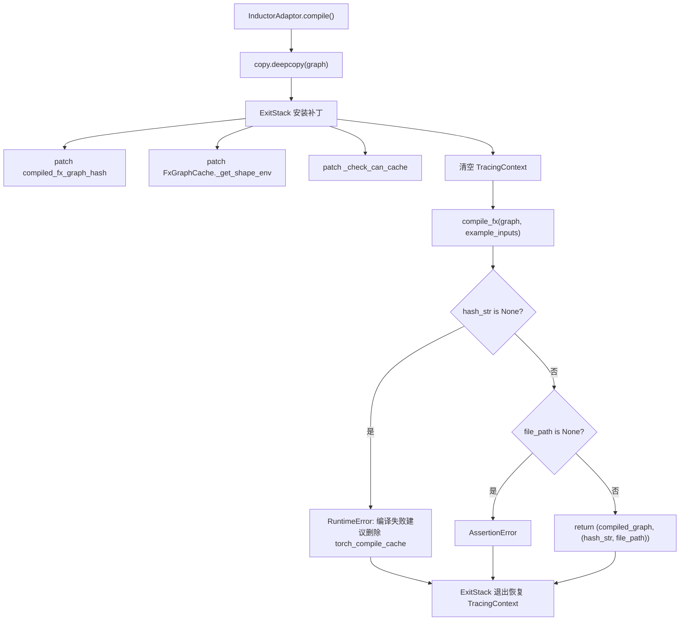
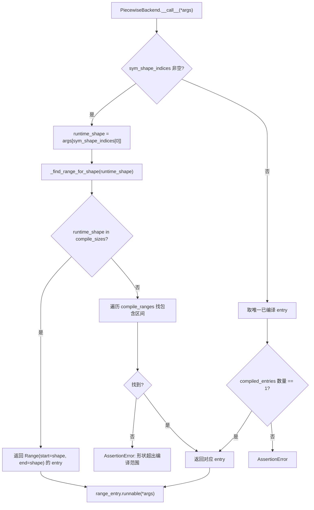

# Capítulo 10: Aceleração por compilação e CUDA Graph: eliminando overhead de inicialização e agendamento

No capítulo anterior, vimos que o KV Connector, por meio de conectores como NIXL e Mooncake, transporta eficientemente o KV cache entre os motores de Prefill e Decode, permitindo que a arquitetura desagregada reduza o TTFT enquanto melhora a utilização de recursos. Mas mesmo que a transferência seja rápida, na decodificação autorregressiva ainda existem dois custos fixos que não podem ser eliminados por algoritmos: o overhead de agendamento do interpretador Python e o overhead de lançamento de kernels da GPU. Quando o forward do modelo é dividido em centenas de operadores, e cada operador precisa passar por uma chamada de função Python e um lançamento de kernel CUDA, o overhead do lado da CPU é suficiente para deixar a GPU ociosa entre dois cálculos. Este capítulo analisa como o vLLM usa torch.compile para fundir operadores em um grafo estático, e depois usa CUDA Graph para gravar toda a sequência de lançamento de kernels como uma única reprodução, reduzindo esses dois tipos de overhead a quase zero.

# Cache de compilação e camada de adaptação do compilador: permitindo reutilização de resultados de compilação entre processos

## Modelo intuitivo

O benefício da aceleração por compilação é "compilar uma vez, executar muitas vezes", mas o custo é que a primeira compilação pode levar vários minutos. Sem cache, cada reinício do serviço exigiria recompilação, e o tempo de cold start seria inaceitável.`CompilerInterface`Esta camada resolve exatamente o problema de "como serializar o artefato de compilação, como identificá-lo por hash e como acertá-lo com precisão no próximo início". Sem ela, o desastre enfrentado pelo sistema não é uma falha, mas sim a degradação de cada reinício para "primeira execução" — em ambientes de produção com auto scaling, isso significa que as instâncias escaladas não conseguirão fornecer serviço de baixa latência por vários minutos.

## Estruturas de dados e contrato de interface

`CompilerInterface`Define o contrato abstrato do adaptador do compilador, cujo núcleo são quatro métodos:`initialize_cache`Responsável por redirecionar o diretório de cache do próprio compilador para o diretório de cache do vLLM[FACT:vllm/compilation/compiler_interface.py:36-51]；`compute_hash`Coleta informações de configuração relacionadas ao compilador para gerar um hash[FACT:vllm/compilation/compiler_interface.py:53-62]；`compile`Executa a compilação e retorna um objeto chamável e um handle[FACT:vllm/compilation/compiler_interface.py:64-95]；`load`Restaura o artefato de compilação a partir do handle[FACT:vllm/compilation/compiler_interface.py:97-103]。

O design-chave aqui é`compile`Retorna uma tupla de dois elementos`(callable, handle)`。`callable`é o resultado de compilação diretamente chamável dentro deste processo;`handle`é a credencial usada para "restaurar no próximo início", e a documentação exige explicitamente que ele seja "plain Python object, preferably a string or a file path"[FACT:vllm/compilation/compiler_interface.py:81-81]. Essa separação permite que o caminho de acerto de cache e o caminho de primeira compilação sigam códigos completamente diferentes — no acerto, não é necessário`compile`, apenas`load`。

`compile_range`O parâmetro carrega a semântica de formas dinâmicas. O comentário explica que ele "could be concrete size (if compile_sizes is provided), e.g. [4, 4] or a range [5, 8]", e que "Right now we only support one variable in ranges for all inputs, which is the batchsize (number of tokens) during inference"[FACT:vllm/compilation/compiler_interface.py:74-74]. Esta é a restrição central da estratégia de compilação do vLLM: todas as formas dinâmicas são reduzidas a uma única variável — o número de tokens.

## Orientado por cenário: o fluxo completo de uma requisição de compilação

Suponha que o serviço seja iniciado pela primeira vez,`InductorAdaptor.compile`é chamado. Ele primeiro incrementa o contador de compilação[FACT:vllm/compilation/compiler_interface.py:477-489], e então entra em uma pilha de patches cuidadosamente construída.

O primeiro passo é fazer deep copy do grafo. O comentário observa que "inductor can inplace modify the graph, so we need to copy it"[FACT:vllm/compilation/compiler_interface.py:500-502], o que é um design defensivo — após uma falha de compilação, o grafo original ainda pode ser usado para nova tentativa.

O segundo passo é instalar uma série de monkey-patches.`hijacked_compile_fx_inner`envolve a função interna de compilação do Inductor, e após a compilação terminar, extrai o hash de`inductor_compiled_graph._fx_graph_cache_key`captura o hash[FACT:vllm/compilation/compiler_interface.py:512-536]。`hijack_compiled_fx_graph_hash`então intercepta a própria função de cálculo de hash[FACT:vllm/compilation/compiler_interface.py:538-542]. Por que "sequestrar" o hash? Porque o vLLM precisa compilar separadamente fora do contexto de tracing do Dynamo, e o cálculo de hash do Inductor depende desse contexto.

O terceiro passo é`_check_can_cache`patch, ele retorna diretamente, sem fazer nenhuma verificação[FACT:vllm/compilation/compiler_interface.py:544-551]. O comentário explica a motivação: "Inductor refuses to cache the graph outside of Dynamo tracing context, and also disables caching for graphs with high-order ops. For vLLM, in either case, we want to cache the graph"[FACT:vllm/compilation/compiler_interface.py:544-551]。

O quarto passo é limpar o contexto de rastreamento. Este é o ponto mais sutil: o vLLM chama`PiecewiseCompileInterpreter`internamente`compile_fx`, neste momento o`FakeTensorMode`do Dynamo e o`FakeTensorMode`da entrada do subgrafo são inconsistentes,`detect_fake_mode()`fará com que a asserção falhe[FACT:vllm/compilation/compiler_interface.py:615-622]. O código salva`TracingContext`e depois o define como vazio, e registra um callback para restaurá-lo na saída[FACT:vllm/compilation/compiler_interface.py:623-630]。

## Reflexão de design: AlwaysHitShapeEnv e consistência de cache

`AlwaysHitShapeEnv`Esta classe merece uma análise separada. Sua docstring declara diretamente a motivação: o vLLM executa a compilação do bytecode do Dynamo apenas uma vez, mas precisa executar a compilação do Inductor várias vezes com diferentes shapes mais um shape genérico; a compilação para shapes específicos ocorre fora do contexto do Dynamo, momento em que não há shape environment disponível para o Inductor, causando falha na busca do cache de código do Inductor[FACT:vllm/compilation/compiler_interface.py:114-131]。

A solução é fornecer um shape environment falso que "sempre acerta":`evaluate_guards_expression`sempre retorna`True` [FACT:vllm/compilation/compiler_interface.py:144-145]，`get_pruned_guards`retorna lista vazia[FACT:vllm/compilation/compiler_interface.py:144-145]，`produce_guards_expression`retorna string vazia[FACT:vllm/compilation/compiler_interface.py:147-159]. O comentário admite que esses métodos foram "obtained by trial-and-error until it works"[FACT:vllm/compilation/compiler_interface.py:137-142]——este é um ponto frágil acoplado à implementação interna do PyTorch, e também o local mais propenso a problemas ao atualizar o PyTorch.

A composição do hash de cache também é crucial.`get_inductor_factors`coleta três tipos de fatores: estado do sistema`CacheBase.get_system()`, estado do PyTorch`torch_key()`, e configurações do Inductor e functorch[FACT:vllm/compilation/compiler_interface.py:165-185]. Note que a configuração do functorch é coletada no contexto de`patch(_get_vllm_functorch_config())`, o que garante que "a configuração no momento da compilação e a chave de cache sejam sempre consistentes"——o comentário afirma explicitamente que isso é para manter[FACT:vllm/compilation/compiler_interface.py:188-189]e`set_functorch_config()`consistentes`get_inductor_factors()`. Se esses dois locais forem inconsistentes, ocorrerá um descasamento de "configuração A usada na compilação, chave de cache calculada com base na configuração B", levando a um acerto de cache que carrega o artefato errado.[FACT:vllm/compilation/compiler_interface.py:147-159]Armadilhas em produção:

é um backport para torch < 2.10.0`_patch_standalone_compile_atomic_save`. Ele altera[FACT:vllm/compilation/compiler_interface.py:205-243]para usar`CompiledArtifact.save()`para escrever em formato binário, e o comentário explica que o objetivo é "preventing corrupt cache files when multiple processes compile concurrently"`write_atomic`. No cenário de inicialização a frio simultânea de múltiplas réplicas, vários processos escrevem concorrentemente no mesmo arquivo de cache; escrita não atômica produz arquivos truncados, e processos subsequentes que leem artefatos corrompidos têm comportamento imprevisível.[FACT:vllm/compilation/compiler_interface.py:208-210]PiecewiseBackend: compilação por faixas de shape e despacho em tempo de execução

# Modelo intuitivo

## é o centro de agendamento entre compilação e execução. Ele compila "um subgrafo FX" em "objetos chamáveis para múltiplas faixas de shape", e em tempo de execução seleciona o mais adequado com base no número real de tokens. Sem ele, ou todos os shapes usariam a mesma compilação genérica (desempenho subótimo), ou cada shape seria compilado separadamente (explosão no tempo de compilação).

`PiecewiseBackend`Estrutura de dados: RangeEntry e intervalo de compilação

## A estrutura de dados central é

, que vincula a flag`RangeEntry`e`compile_range`、`compiled`juntos`runnable`mantém um[FACT:vllm/compilation/piecewise_backend.py:80-83]。`PiecewiseBackend`A construção do intervalo de compilação é feita em duas etapas. Primeiro processa`range_entries: dict[Range, RangeEntry]` [FACT:vllm/compilation/piecewise_backend.py:166-171]。

(tamanhos exatos), cada tamanho gera um`compile_sizes`de intervalo pontual`Range(start=size, end=size)`. Note que aqui para a string[FACT:vllm/compilation/piecewise_backend.py:166-171]lança diretamente`"cudagraph_capture_sizes"`, e explica que "should be handled in`NotImplementedError`——esta é uma declaração explícita de fronteira de responsabilidade. Depois processa`post_init_cudagraph_sizes`" [FACT:vllm/compilation/piecewise_backend.py:166-171](intervalos), cada intervalo gera um entry`compile_ranges`suporta dois modos mutuamente exclusivos, e o construtor força isso com uma asserção XOR[FACT:vllm/compilation/piecewise_backend.py:173-173]。

`PiecewiseBackend`: modo de compilação (com graph, sem compiled_runnables) usa[FACT:vllm/compilation/piecewise_backend.py:117-119]; modo pré-compilado (sem graph, com compiled_runnables) usa`compile_all_ranges()` [FACT:vllm/compilation/piecewise_backend.py:193-194]. Este design permite que inicialização a frio e a quente compartilhem a mesma classe, apenas com fontes de dados diferentes.`load_all_ranges()` [FACT:vllm/compilation/piecewise_backend.py:193-194]Orientado a cenários: da compilação ao despacho em tempo de execução

## Fase de compilação

**percorre todos os range entries, e para cada entry não compilado chama**：`compile_all_ranges`registra evento de rastreamento`_log_compile_start`. O branch crítico está na construção de parâmetros: se for tamanho pontual, chama[FACT:vllm/compilation/piecewise_backend.py:252-256]para gerar FakeTensor com shape específico`create_concrete_args`; caso contrário, chama[FACT:vllm/compilation/piecewise_backend.py:258-261]para reutilizar diretamente os metadados de placeholder do grafo`get_fake_args_from_graph`A implementação de[FACT:vllm/compilation/piecewise_backend.py:262-263]。

`create_concrete_args`revela detalhes da concretização de shapes simbólicos. Ele constrói um`ShapeEnv`com`FakeTensorMode` [FACT:vllm/compilation/piecewise_backend.py:54], e então percorre os nós placeholder. Para entradas do tipo`SymInt`, usa`concretize`para substituir todos os símbolos livres por`size` [FACT:vllm/compilation/piecewise_backend.py:47-52]; para o tipo`Tensor`, é necessário concretizar simultaneamente shape, stride, storage_offset, e usar`compute_required_storage_length`para calcular o comprimento de armazenamento necessário, e então reconstruir o tensor através de`as_strided` 重建张量 [FACT:vllm/compilation/piecewise_backend.py:64-73]. Por que não é possível alterar apenas o shape? Porque stride e storage_offset também podem conter símbolos, e os três devem ser consistentes entre si, caso contrário`as_strided`causará acesso fora dos limites.

**Despacho em tempo de execução**：`__call__`é o caminho crítico. Se existir`sym_shape_indices`, extrair o shape de tempo de execução de`args`, e então chamar[FACT:vllm/compilation/piecewise_backend.py:357-362]para buscar. A lógica de busca tem prioridade: primeiro verifica se há correspondência exata de`_find_range_for_shape`, se houver, retorna esse intervalo de ponto único`compile_sizes`; caso contrário, percorre[FACT:vllm/compilation/piecewise_backend.py:342-355]para encontrar o intervalo que contém esse shape`compile_ranges`Cópia[FACT:vllm/compilation/piecewise_backend.py:342-355]。

## 〔Inferência de design e trade-offs de arquitetura〕

> **[Design Inference & Architectural Trade-offs]**
> `to_bytes`engenhoso: quando o pickle encontra`reducer_override`, primeiro chama`CachingAutotuner`e depois serializa`obj.prepare_for_pickle()`. Por que esse hook é necessário?[FACT:vllm/compilation/piecewise_backend.py:209-218]mantém internamente artefatos de compilação Triton e estado de tempo de execução; fazer pickle diretamente pode falhar ou produzir objetos não reutilizáveis;`CachingAutotuner`obviamente converte o objeto em uma forma pura e serializável.`prepare_for_pickle`Durante a serialização, também ativa temporariamente

, o que ecoa a lógica em`bundled_autograd_cache` [FACT:vllm/compilation/piecewise_backend.py:222]— quando`_get_vllm_functorch_config`não está habilitado, essa configuração é`VLLM_USE_MEGA_AOT_ARTIFACT`, e durante a serialização é forçada para`False` [FACT:vllm/compilation/compiler_interface.py:160-161], garantindo que os artefatos sejam empacotados.`True`é o caminho de inicialização a quente; ele afirma que cada range pode ser encontrado em

`load_all_ranges`com a chave correspondente, caso contrário lança um erro contendo a lista de chaves disponíveis`compiled_runnables`. Essa mensagem de erro foi projetada de forma muito prática — lista diretamente as chaves disponíveis, facilitando a investigação de incompatibilidade de versão de cache.[FACT:vllm/compilation/piecewise_backend.py:329-339]Wrapper de CUDA Graph: captura, replay e despacho aninhado

# Modelo intuitivo

## CUDA Graph grava "uma sequência de lançamentos de kernels" como um grafo estático, e depois cada replay requer apenas uma chamada de API.

é o executor da gravação e do replay. O desafio central que enfrenta é: o tamanho de batch do vLLM é dinâmico, enquanto o CUDA Graph exige endereços de entrada fixos. A solução é "capturar por faixas de batch descriptor" — gravar um grafo para cada faixa de shape, e em tempo de execução consultar a tabela por descriptor para replay.`CUDAGraphWrapper`Estrutura de dados: CUDAGraphEntry e contrato de despacho

## mantém três campos principais:

`CUDAGraphEntry`como chave de despacho`batch_descriptor`é o objeto de grafo capturado[FACT:vllm/compilation/cuda_graph.py:128-135]、`cudagraph`é a saída no momento da captura (armazenada como referência fraca para economizar memória)[FACT:vllm/compilation/cuda_graph.py:128-135]、`output`usado apenas em modo de depuração para validar a consistência dos endereços de entrada no replay[FACT:vllm/compilation/cuda_graph.py:128-135]。`input_addresses`A documentação da classe descreve com precisão o contrato de despacho: na inicialização, aloca um runtime mode (FULL ou PIECEWISE)[FACT:vllm/compilation/cuda_graph.py:128-135]。

`CUDAGraphWrapper`; em tempo de execução, recebe runtime_mode e batch_descriptor do forward context e "blindly trust them"[FACT:vllm/compilation/cuda_graph.py:158-158]; se runtime_mode for NONE ou não corresponder, chama diretamente[FACT:vllm/compilation/cuda_graph.py:158-158]; caso contrário, executa captura ou replay[FACT:vllm/compilation/cuda_graph.py:158-158]A documentação também declara explicitamente uma fronteira: "CUDAGraphWrapper does not store persistent buffers or copy any runtime inputs into that buffers for replay"[FACT:vllm/compilation/cuda_graph.py:158-158]。

. Isso significa que o gerenciamento dos buffers de entrada é responsabilidade do chamador — o wrapper é responsável apenas pelo grafo em si.[FACT:vllm/compilation/cuda_graph.py:164-164]Orientado a cenários: uma captura e um replay

## Caminho de captura

**: quando**é acionado e o runtime_mode corresponde, primeiro verifica se o forward context está disponível. Se não estiver (como no forward do codificador visual), chama diretamente a função subjacente`__call__`. Este é o branch crítico do cenário multimodal — o forward do ViT não passa pelo CUDA Graph.[FACT:vllm/compilation/cuda_graph.py:232-233]Em seguida, obtém

e`batch_descriptor`. Se o mode for NONE ou não corresponder, chama diretamente`cudagraph_runtime_mode` [FACT:vllm/compilation/cuda_graph.py:242-244]. Esse design de "se não corresponder, passa direto" permite a coexistência de wrappers aninhados: o wrapper FULL na camada externa, o wrapper PIECEWISE na camada interna, e apenas um será ativado em tempo de execução.[FACT:vllm/compilation/cuda_graph.py:246-256]Se o

da entry for None, entra na captura. Primeiro chama`cudagraph`para validar a legalidade`validate_cudagraph_capturing_enabled()`, depois registra os endereços de entrada[FACT:vllm/compilation/cuda_graph.py:279], cria[FACT:vllm/compilation/cuda_graph.py:281-284]Há várias operações críticas no contexto de captura. Se`torch.cuda.CUDAGraph()` [FACT:vllm/compilation/cuda_graph.py:285]。

estiver habilitado, faz patch de`gc_disable`e`gc.collect`. O comentário explica o motivo: no modo piecewise, cada camada precisa capturar um grafo, e o GC repetido tornaria a captura extremamente lenta, então "only run gc for the first graph, and disable gc for the rest"`torch.accelerator.empty_cache` [FACT:vllm/compilation/cuda_graph.py:288-303]. Em seguida, define o graph pool id[FACT:vllm/compilation/cuda_graph.py:289-294], e sincroniza o stream de cópia do offloader[FACT:vllm/compilation/cuda_graph.py:305-308]A captura real é executada no contexto[FACT:vllm/compilation/cuda_graph.py:310-312]。

`torch.cuda.graph(cudagraph, pool=..., stream=...)`. Após a captura, chama`self.runnable(*args, **kwargs)` [FACT:vllm/compilation/cuda_graph.py:315-321]para evitar erros de streams não sincronizados`get_offloader().join_after_forward()`. Se[FACT:vllm/compilation/cuda_graph.py:322-326]estiver habilitado, converte o output em referência fraca para economizar memória`weak_ref_output`. Por fim, a entry salva a referência fraca do output e o objeto de grafo[FACT:vllm/compilation/cuda_graph.py:327-334], mas[FACT:vllm/compilation/cuda_graph.py:338-339]retorna o output original em vez da referência fraca**— o comentário enfatiza que isso é para permitir que o PyTorch gerencie corretamente a memória durante a captura**Caminho de replay[FACT:vllm/compilation/cuda_graph.py:343-346]。

**: se a entry já tiver um grafo, em modo de depuração valida a consistência dos endereços de entrada**, depois sincroniza o offloader[FACT:vllm/compilation/cuda_graph.py:348-357], chama[FACT:vllm/compilation/cuda_graph.py:359-361]e retorna`entry.cudagraph.replay()` 并返回 `entry.output` [FACT:vllm/compilation/cuda_graph.py:362-363]。

## Considerações de design: por que a saída deve ser uma referência fraca, enquanto o retorno deve ser uma referência forte

Este é`CUDAGraphWrapper`o ponto mais contraintuitivo em`output`No momento da captura,[FACT:vllm/compilation/cuda_graph.py:320]é gerenciado pelo cudagraph pool do PyTorch. Se a entry mantiver uma referência forte ao output, a memória de vídeo ocupada por este grafo nunca poderá ser liberada; mas se for convertido em referência fraca durante a captura, o PyTorch pode recuperar a memória antes da conclusão da captura, causando falha na captura. Por isso, o código usa referência fraca dentro do bloco de captura[FACT:vllm/compilation/cuda_graph.py:334], armazena uma referência fraca na entry[FACT:vllm/compilation/cuda_graph.py:338], mas o valor de retorno da função é uma referência forte[FACT:vllm/compilation/cuda_graph.py:346]. Este "estado de referência triplo" é um equilíbrio preciso entre segurança de memória e eficiência de memória de vídeo.

Outro design digno de nota é`_all_instances`este`WeakSet` [FACT:vllm/compilation/cuda_graph.py:173-176]. Ele permite que`clear_all_graphs`limpe de uma só vez os grafos de todos os wrappers[FACT:vllm/compilation/cuda_graph.py:173-176], usado para recuperação de emergência quando a memória de vídeo está escassa. Usar`WeakSet`em vez de um conjunto comum é para não impedir que o wrapper seja coletado pelo GC — caso contrário, o próprio wrapper vazaria.

Armadilhas em produção:`__getattr__`A implementação de lança, em modo de depuração, um erro com contexto para atributos inexistentes[FACT:vllm/compilation/cuda_graph.py:211-217]. Isso parece trivial, mas ao investigar "por que uma determinada chamada de método falhou", poder ver a descrição em string do runnable encapsulado pelo wrapper é muito mais útil do que um`AttributeError`cru.

# Considerações de design: desacoplamento entre compilação e CUDA Graph

O documento de design registra explicitamente a motivação desta refatoração. A compilação piecewise inicial existia para suportar a captura piecewise de CUDA Graph, excluindo operadores que não suportam CUDA Graph (principalmente attention)[FACT:docs/design/cuda_graphs.md:25]. Posteriormente foi adicionado suporte a full CUDA Graph, mas "this tight coupling between compilation and cudagraph capture led to an all-or-nothing experience with little flexibility"[FACT:docs/design/cuda_graphs.md:25]。

Após a refatoração, os objetivos são quatro: distinguir explicitamente lotes prefill/mixed de uniform-decode e capturá-los separadamente[FACT:docs/design/cuda_graphs.md:25-25]; desacoplar a lógica de captura de CUDA Graph da compilação, permitindo "capturing piecewise and full cudagraphs using the same compiled graph"[FACT:docs/design/cuda_graphs.md:25-25]; despachar em tempo de execução conforme a composição do lote[FACT:docs/design/cuda_graphs.md:25-25]; controle centralizado para reduzir complexidade[FACT:docs/design/cuda_graphs.md:25-25]。

`BatchDescriptor`é a estrutura central da chave de despacho, contendo`num_tokens`、`num_reqs`、`uniform`、`has_lora`os quatro campos[FACT:docs/design/cuda_graphs.md:86-93]。`uniform`O flag é especialmente crítico — muitos backends de attention só suportam full CUDA Graph quando o lote é uniform[FACT:docs/design/cuda_graphs.md:95-95]. O documento também antecipa que esta estrutura pode ser estendida, por exemplo adicionando`uniform_query_len`suporte a múltiplos comprimentos de uniform decode[FACT:docs/design/cuda_graphs.md:95-95]。

A prioridade de despacho é`FULL > PIECEWISE > None`, e se a chave de despacho não existir, faz fallback para o modo NONE com execução eager[FACT:docs/design/cuda_graphs.md:112-115]. Esta estratégia de "degradar em vez de reportar erro" garante que qualquer combinação de lotes possa ser executada, apenas com desempenho diferente.

`AttentionCGSupport`O enum quantifica a capacidade de CUDA Graph do backend, com valores`ALWAYS=3 > UNIFORM_BATCH=2 > UNIFORM_SINGLE_TOKEN_DECODE=1 > NEVER=0` [FACT:docs/design/cuda_graphs.md:153-162]. Modelos de attention híbrida (como mamba mixer) tomam o mínimo das capacidades de todos os backends e degradam o modo CUDA Graph com base nisso[FACT:docs/design/cuda_graphs.md:173-175]. Este design desacopla "declaração de capacidade" de "seleção de modo" — novos backends só precisam declarar capacidade, e a estratégia de degradação entra em vigor automaticamente.

# Resumo do capítulo

# Reflexões e autoavaliação do capítulo

Q1: Se removermos o`_check_can_cache`patch ([FACT:vllm/compilation/compiler_interface.py:544-551]), deixando o Inductor decidir por conta própria se deve fazer cache, em quais cenários o cache de compilação seria invalidado? Por que o comentário diz "Inductor refuses to cache the graph outside of Dynamo tracing context"?

**Análise de referência**：`_check_can_cache`retorna diretamente, sem fazer nenhuma verificação, e o comentário explica que o Inductor recusa o cache em duas situações: fora do contexto de tracing do Dynamo, e quando o grafo contém operadores de alta ordem[FACT:vllm/compilation/compiler_interface.py:544-551]. O fluxo de compilação do vLLM está justamente fora do contexto do Dynamo (`compile_fx`é chamado por`PiecewiseCompileInterpreter`, e o código limpa explicitamente`TracingContext` [FACT:vllm/compilation/compiler_interface.py:623-625]). Se o patch for removido, o Inductor determinará "não cacheável", recompilando a cada inicialização, e o tempo de cold start degradaria de segundos para minutos. Mais sutil ainda é que, como o vLLM depende de`hijacked_compile_fx_inner`para capturar`hash_str`, se o caminho de cache for ignorado,`hash_str`pode ser None, disparando o RuntimeError de[FACT:vllm/compilation/compiler_interface.py:640-652]. Isso explica por que o comentário enfatiza "vLLM today assumes and requires the monkey-patched functions to get hit"[FACT:vllm/compilation/compiler_interface.py:596-598]。

Q2: `CUDAGraphWrapper`converte o output em referência fraca ao armazená-lo na entry durante a captura ([FACT:vllm/compilation/cuda_graph.py:338]), mas retorna uma referência forte ([FACT:vllm/compilation/cuda_graph.py:346]). Se o valor de retorno também fosse alterado para referência fraca, em quais cenários ocorreria crash?

**Análise de referência**: durante a captura,`output`é gerenciado pelo cudagraph pool do PyTorch[FACT:vllm/compilation/cuda_graph.py:320]。Se o valor de retorno for uma referência fraca, o objeto obtido pelo chamador pode ser imediatamente coletado pelo GC após a saída do bloco de captura — porque nesse momento nenhuma referência forte o mantém vivo. O PyTorch precisa que o output permaneça vivo durante a captura para estabelecer corretamente o mapeamento do pool de memória; uma vez coletado, na reprodução subsequente`entry.output`a referência fraca apontada já se tornou inválida,`replay()`o objeto retornado depois pode já ter sido sobrescrito ou liberado. O comentário afirma explicitamente "we need to return the output, rather than the weak ref of the output, so that pytorch can correctly manage the memory during cuda graph capture"[FACT:vllm/compilation/cuda_graph.py:343-345]. Este design é um equilíbrio preciso de "referência forte durante a captura, referência fraca durante o armazenamento".

Q3: Em`PiecewiseBackend._find_range_for_shape`（[FACT:vllm/compilation/piecewise_backend.py:342-355]), a busca por tamanho exato tem prioridade sobre a busca por intervalo. Suponha`compile_sizes=[8]`、`compile_ranges=[Range(1,16)]`, com shape=8 em tempo de execução, qual entry será atingido? Se a prioridade fosse invertida, quais seriam as consequências?

**Análise de referência**: A lógica atual verifica primeiro`runtime_shape in self.compile_sizes`, e se houver correspondência retorna`Range(start=8, end=8)`o entry de ponto único[FACT:vllm/compilation/piecewise_backend.py:342-355]. Este entry foi compilado com`create_concrete_args`, com a forma totalmente concretizada, permitindo que o kernel Triton faça a especialização máxima (como`set_inductor_config`em que tamanhos de ponto único ativam`max_autotune` [FACT:vllm/compilation/compiler_interface.py:747-754]). Se a prioridade fosse invertida, shape=8 atingiria o intervalo`Range(1,16)`do entry — que é uma versão genérica compilada com formas simbólicas, com desempenho subótimo. Mais grave ainda,`compile_sizes`geralmente vem de`cudagraph_capture_sizes`, e esses tamanhos são exatamente os níveis que o CUDA Graph precisa capturar; se em tempo de execução for despachado para o entry genérico, o grafo capturado pelo CUDA Graph será inconsistente com o runnable despachado, podendo causar incompatibilidade de forma na reprodução. Portanto, a prioridade exata não é apenas uma escolha de desempenho, mas um requisito de correção.

O próximo capítulo abordará quantização e kernels personalizados, vendo como o vLLM intervém no controle de precisão desde a fase de carregamento de pesos, e usa operadores altamente especializados para converter os ganhos de quantização em aumento real de throughput.

Este capítulo analisou os dois níveis de mecanismos de aceleração de compilação do vLLM. O primeiro nível é CompilerInterface e PiecewiseBackend: o primeiro define o contrato de adaptação do compilador e a estratégia de hash de cache, usando AlwaysHitShapeEnv para contornar o problema de contexto ausente do Dynamo; o segundo compila um único subgrafo FX em múltiplos níveis de forma, despachando em tempo de execução pelo número de tokens. O segundo nível é CUDAGraphWrapper: ele captura CUDA Graphs por níveis de BatchDescriptor, implementando despacho aninhado através de correspondência de runtime mode, permitindo que os modos FULL e PIECEWISE coexistam no mesmo grafo compilado. O desacoplamento entre os dois é o núcleo desta refatoração — os artefatos de compilação podem ser reutilizados por ambos os modos de CUDA Graph, e o CUDA Graph também pode funcionar independentemente da compilação. No entanto, compilação e captura de grafo resolvem a sobrecarga de agendamento; a precisão dos pesos do modelo em si e a eficiência dos operadores ainda são outra linha principal de otimização. O próximo capítulo abordará quantização e kernels personalizados, vendo como o vLLM analisa configurações de quantização, realiza conversão de formatos como FP8/INT4/AWQ/GPTQ durante o carregamento de pesos, e usa _custom_ops e kernels Triton para extrair ainda mais o desempenho do hardware.
