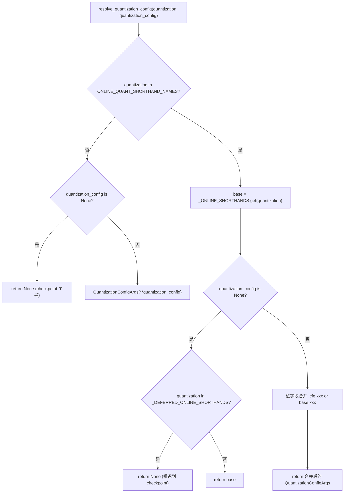
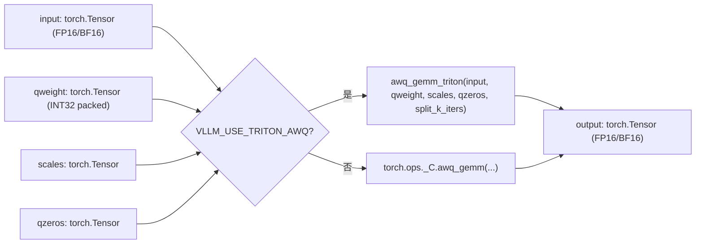
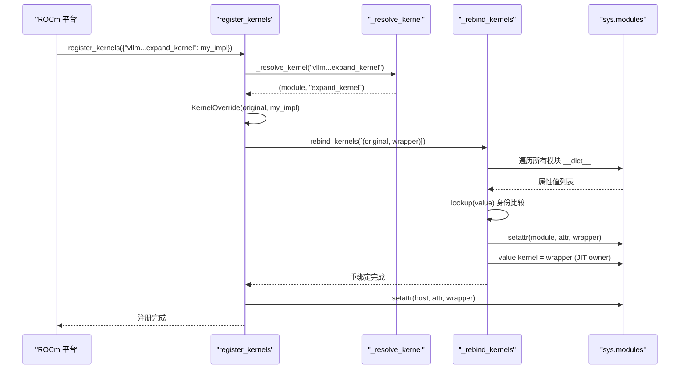

# Capítulo 11: Quantização e Kernels Personalizados: Do Carregamento de Pesos a Operadores de Alto Desempenho

No capítulo anterior vimos que torch.compile e CUDA Graph reduziram ao extremo a sobrecarga de agendamento Python e inicialização de kernels. Mas por mais rápido que seja o agendamento, se os pesos em si são FP16 e a multiplicação de matrizes usa GEMM genérico, o poder computacional do hardware ainda é limitado pela largura de banda de memória e operadores ineficientes. Quantização e kernels personalizados são outra linha ortogonal de otimização: a primeira reduz a precisão já na fase de carregamento de pesos, a segunda converte os ganhos de quantização em throughput real. Este capítulo parte do ponto de entrada de análise de configuração de quantização, percorrendo até o registro de operadores em _custom_ops e o agendamento de kernels Triton.

# 11.1 Configuração de Quantização: Da String CLI ao QuantKey

## Modelo intuitivo

O papel do módulo de configuração de quantização é como um tradutor de menu de restaurante. O usuário no balcão diz "quero fp8_per_tensor" (string CLI), e a cozinha precisa do número exato da receita (`QuantKey`). O tradutor deve lidar com três tipos de entrada: abreviação pura de CLI, metadados de quantização do próprio checkpoint, e cenários combinados dos dois. Sem essa camada de tradução, a cozinha receberia um monte de strings ambíguas, incapaz de decidir qual kernel chamar.

## Estrutura de dados e layout de memória

A estrutura de dados central é`QuantSpec`e`QuantizationConfigArgs`. A primeira descreve as chaves de quantização de pesos e ativações de um tipo de camada (linear ou MoE), a segunda é a configuração de nível superior visível ao usuário.

[FACT:vllm/config/quantization.py:73-99]

```python
@config
class QuantSpec:
    weight: QuantKeyField = None
    activation: QuantKeyField = None

    def __str__(self) -> str:
        def quant_key_str(quant_key: QuantKey | None) -> str:
            if quant_key is None:
                return "None"
            return next(
                (
                    name
                    for name, known_quant_key in QUANT_KEY_NAMES.items()
                    if known_quant_key == quant_key
                ),
                str(quant_key),
            )
        return quant_key_str(self.weight)
```

`weight`e`activation`são ambos opcionais`QuantKey`。`None`A semântica de é "recuar para o valor padrão da própria classe do método" — normalmente herdado do checkpoint; em cenários de quantização online, significa não quantizar[FACT:vllm/config/quantization.py:74-74]。`QuantKey`é em si um tipo complexo que contém`NamedTuple`e`ClassVar[GroupShape]`declarações; o pydantic não consegue introspeccioná-lo diretamente, por isso o autor usou`GetPydanticSchema`para injectar um validador personalizado`_coerce_quant_key`, normalizando uniformemente strings ou`QuantKey`O layout dos campos de merece atenção[FACT:vllm/config/quantization.py:60-69]。

`QuantizationConfigArgs`[FACT:vllm/config/quantization.py:102-126]：

- `linear` / `moe`: aplicam-se respectivamente às camadas`LinearBase`e`FusedMoEFactory`;
- `ignore`: lista de nomes de camadas a saltar na quantização; a quantização online também suporta wildcards fnmatch;
- `targets`: sobreposição de quantização online camada a camada; a chave pode ser um nome exacto de camada,`re:`regex com prefixo, ou padrão fnmatch; o valor é mutuamente exclusivo com`linear`/`moe`.

`targets`e`linear`/`moe`A exclusão mútua entre e é imposta por`model_validator`[FACT:vllm/config/quantization.py:172-179]. Esta restrição não é formalismo:`targets`segue o caminho de sobreposição camada a camada,`linear`/`moe`segue o caminho padrão global; a coexistência de ambos tornaria indeterminável "qual spec é realmente usado por uma dada camada".

## Passo-a-passo: uma resolução de`--quantization fp8_per_tensor`

Cenário: o utilizador passa na linha de comandos`--quantization fp8_per_tensor`, e ao mesmo tempo especifica a quantização de activação da camada MoE através de`--quantization-config`.

Primeiro passo,`resolve_quantization_config`é chamado, com argumentos a string CLI e o dicionário de configuração[FACT:vllm/config/quantization.py:233-235]. Primeiro verifica se`quantization`está em`ONLINE_QUANT_SHORTHAND_NAMES`— esta tupla contém todos os nomes abreviados mais um`"online"` [FACT:vllm/config/quantization.py:216-222]。

Segundo passo,`fp8_per_tensor`corresponde à tabela de abreviaturas,`base`é resolvido para`_ONLINE_SHORTHANDS["fp8_per_tensor"]`, ou seja, tanto linear como moe usam`kFp8StaticTensorSym` [FACT:vllm/config/quantization.py:188-190]。

Terceiro passo,`quantization_config`não vazio, é construído como objecto`QuantizationConfigArgs`. Segue-se a lógica de fusão[FACT:vllm/config/quantization.py:267-268]: cada campo é decidido por`quantization_config.xxx or base.xxx`— campos explicitamente definidos pelo utilizador têm prioridade; os não definidos herdam o valor padrão da abreviatura. Aqui usa-se`or`em vez de`if is not None`intencionalmente:`QuantSpec`e lista vazia são ambos falsy; semanticamente "não definido" e "vazio" são equivalentes.

Quarto passo, se`quantization`não estiver na tabela de abreviaturas (por exemplo, é o`awq`próprio do checkpoint), e`quantization_config`for`None`, a função retorna directamente`None` [FACT:vllm/config/quantization.py:256-257]. Isto significa "não sobrepor quantização online"; o método de quantização do checkpoint mantém-se dominante.

Há um ramo fácil de ignorar:`_DEFERRED_ONLINE_SHORTHANDS`contém`mxfp4`e`mxfp8` [FACT:vllm/config/quantization.py:233-235]. Estes dois nomes são simultaneamente abreviaturas CLI e nomes de métodos de quantização de checkpoint. Quando o utilizador passa apenas`--quantization mxfp4`sem`quantization_config`, a função retorna`None`em vez de`base` [FACT:vllm/config/quantization.py:267-268], adiando a decisão para os metadados do checkpoint — só quando o checkpoint não tem informação de quantização é que se recua para a abreviatura online.



## Reflexões de design e armadilhas

`_coerce_spec`O validador trata um cenário subtil: quando`linear`ou`moe`recebem uma string, primeiro consulta`_ONLINE_SHORTHANDS`; se corresponder, extrai o spec do campo correspondente; se não, trata como um único nome`QuantKey`[FACT:vllm/config/quantization.py:130-139]. Isto significa que`linear="fp8_per_tensor"`e`linear="fp8_per_tensor_static"`seguem dois caminhos diferentes — o primeiro é uma abreviatura de configuração completa, o segundo é uma chave de quantização única. Se na abreviatura esse campo for`None`(por exemplo,`int8_per_channel_weight_only`não tem campo`linear`), lança um`ValueError`explícito em vez de retornar silenciosamente`None` [FACT:vllm/config/quantization.py:130-139]。

Uma armadilha comum em produção:`targets`As chaves regex de são pré-compiladas e validadas em`_validate_targets`[FACT:vllm/config/quantization.py:166-167], mas as chaves de padrão fnmatch não são validadas. Se o utilizador escrever um padrão fnmatch que nunca corresponde a nenhuma camada, não há erro; simplesmente essa camada permanece não quantizada — na depuração é preciso verificar se o nome da camada realmente corresponde.

# 11.2 `_custom_ops`: Registo de operadores e implementação fake

## Modelo intuitivo

`_custom_ops.py`é a camada de adaptação entre o vLLM e os operadores CUDA/C++ subjacentes, como uma alfândega. No namespace`torch.ops._C`do PyTorch estão registados operadores C++ compilados, mas chamá-los directamente tem três problemas: o conjunto de operadores difere entre plataformas (CUDA/ROCm/CPU/XPU),`torch.compile`precisa de implementações fake para inferir formas de saída, e alguns operadores precisam de pré-processamento de parâmetros do lado Python.`_custom_ops`encapsula uniformemente estes problemas.

## Estruturas de dados e mecanismo de registo

No carregamento do módulo, chama-se primeiro`current_platform.import_kernels()` [FACT:vllm/_custom_ops.py:25-26], dando à camada de plataforma a oportunidade de importar a sua própria biblioteca de operadores. Depois define-se`register_fake`— sob`TYPE_CHECKING`é um decorador vazio; em runtime importa-se de`torch.library`[FACT:vllm/_custom_ops.py:25-26]。

O papel central da implementação fake é permitir que`torch.compile`saiba a forma de saída e o dtype do operador durante a fase de tracing, sem o executar realmente. Tomando`scaled_fp4_quant`como exemplo:

[FACT:vllm/_custom_ops.py:90-100]

```python
if hasattr(torch.ops, "_C") and hasattr(torch.ops._C, "scaled_fp4_quant"):

    @register_fake("_C::scaled_fp4_quant")
    def _scaled_fp4_quant_fake(
        input: torch.Tensor,
        input_scale: torch.Tensor,
        is_sf_swizzled_layout: bool,
    ) -> tuple[torch.Tensor, torch.Tensor]:
        n = input.shape[-1]
        m = input.numel() // n
        return create_fp4_output_tensors(m, n, input.device, is_sf_swizzled_layout)
```

Atenção à guarda`hasattr`: só quando a plataforma realmente registou`_C::scaled_fp4_quant`é que a implementação fake é definida. Isto garante que importar o módulo em CPU ou GPUs antigas não rebente por falta de operadores.

`create_fp4_output_tensors`mostra detalhes do layout de memória da saída de quantização FP4[FACT:vllm/_custom_ops.py:69-87]. Quando`is_sf_swizzled_layout=True`, o tensor de scale precisa de ser disposto em tiles 128x4 conforme exigido pelos Tensor Cores: o número de linhas arredondado para cima a múltiplo de 128, o número de colunas (`n // 16`) arredondado para cima a múltiplo de 4, e cada 4 float8_e4m3 empacotados num int32[FACT:vllm/_custom_ops.py:55-64]. O comentário indica explicitamente que o kernel de quantização NVFP4 limpa explicitamente todas as entradas de scale de padding, pelo que não é necessário um kernel separado de inicialização a zero[FACT:vllm/_custom_ops.py:60-61]。

## Passo-a-passo: fluxo de chamada de um AWQ GEMM

Cenário: o modelo carregou pesos quantizados AWQ; na propagação forward é preciso fazer multiplicação matricial entre activações e pesos quantizados.

Primeiro passo, chama-se`awq_gemm` [FACT:vllm/_custom_ops.py:587-592]. A função verifica primeiro a variável de ambiente`VLLM_USE_TRITON_AWQ`. Se verdadeira, importa tardiamente`awq_gemm_triton`e chama — este é um caminho de implementação puramente Triton, para plataformas que não suportam operadores CUDA ou para cenários de depuração.

Segundo passo, o caminho padrão chama`torch.ops._C.awq_gemm`, passando input, qweight, scales, qzeros e`split_k_iters` [FACT:vllm/_custom_ops.py:598-598]。

Terceiro passo, se`torch.ops._C.awq_gemm`Existe, a implementação fake está registrada[FACT:vllm/_custom_ops.py:601-616]. A forma retornada pelo fake é`(split_k_iters, num_in_feats, qweight.size(1) * 8)`e então`.sum(0)`—isto simula com precisão a forma dos resultados intermédios do split-K e a forma final após a redução.`qweight.size(1) * 8`Vem do modo de empacotamento do AWQ: cada int32 armazena 8 pesos de 4 bits.

Quarto passo,`awq_dequantize`segue um caminho semelhante[FACT:vllm/_custom_ops.py:553-559], mas a derivação de forma da implementação fake é diferente:`out_c = qout_c * 8`, porque após a desquantização o número de colunas expande 8 vezes[FACT:vllm/_custom_ops.py:587-592]。

A função repack da série Marlin mostra outro padrão.`gptq_marlin_repack`A implementação fake de calcula`pack_factor = 32 // num_bits`, a forma de saída é`(size_k // 16, size_n * 16 // pack_factor)` [FACT:vllm/_custom_ops.py:1103-1119]. Aqui`16`é o Marlin tile size,`size_k // 16`indica que a dimensão K é dividida por tile. A versão MoE de`gptq_marlin_moe_repack`no nível Python percorre cada expert e chama o repack de expert único[FACT:vllm/_custom_ops.py:1154-1172], e afirma`size_k % 16 == 0`—esta é uma restrição rígida do formato Marlin.



## Reflexões de design e armadilhas

A implementação fake deve ser completamente consistente com a forma de saída do operador real, caso contrário`torch.compile`o grafo traçado por terá incompatibilidade de forma em tempo de execução.`create_fp4_output_tensors`O comentário de enfatiza especialmente "Must match the C++ scaled_fp4_quant_func allocation exactly when padded_n is None"[FACT:vllm/_custom_ops.py:69-74]. Este é um ponto propenso a erros: se o lado C++ alterar a lógica de alocação e o fake não sincronizar, o grafo compilado irá falhar durante a reprodução do CUDA Graph.

Outra armadilha é`torch.library.custom_op`a regra de alias de .`safeFusedQuantizeNv`O comentário de indica que torch 2.12+ não permite que a saída de operadores personalizados faça alias de qualquer entrada, portanto o autor alterou o tensor de retorno para um parâmetro in-place[FACT:vllm/_custom_ops.py:4650-4655]. Esta abordagem de "alterar a forma da API para contornar limitações do framework" é muito comum na camada de adaptação de operadores, e ao investigar é necessário estar atento se`mutates_args`a declaração é consistente com o comportamento real.

`CPUDNNLGEMMHandler`mostra outro modo de gestão de recursos: o ponteiro do handler é armazenado num tensor int64,`__del__`ao chamar`release_dnnl_matmul_handler`liberta[FACT:vllm/_custom_ops.py:3708-3717]. Armazenar o ponteiro num tensor serve para evitar que seja eliminado pela otimização de inlining de inteiros do Python—esta é uma técnica clássica de bindings de baixo nível.

# 11.3 Agendamento de kernels Triton:`KernelOverride`e re-vinculação entre módulos

## Modelo intuitivo

O papel do agendador de kernels Triton é como um sistema de substituição de funções numa empresa. Quando uma plataforma (por exemplo, ROCm) precisa de substituir os kernels Triton no núcleo do vLLM pela sua própria implementação, não pode alterar diretamente o código do núcleo—isso poluiria o upstream.`dispatcher`permite que a plataforma registe um substituto e depois substitua silenciosamente todas as referências ao kernel original pelo substituto. Sem este mecanismo, cada plataforma teria de manter um fork, com conflitos constantes ao fazer merge das alterações do upstream.

## Estruturas de dados e layout de memória

A estrutura de dados central é`_registry`o dicionário e`KernelOverride`a classe[FACT:vllm/triton_utils/dispatcher.py:29-36]。

`KernelOverride`os campos-chave de[FACT:vllm/triton_utils/dispatcher.py:50-61]：

- `_impl`: função de implementação da plataforma;
- `arg_names`: tupla de nomes de parâmetros que espelha o kernel original, usada para vinculação por palavra-chave no launch;
- `constexprs`: declarações constexpr herdadas do kernel original;
- `func`: aponta para a função de implementação, para introspeção no warmup;
- `_forward_by_name`: flag booleana que determina se no launch os parâmetros são encaminhados por palavra-chave ou por posição.

`_forward_by_name`A lógica de cálculo de é: comparar`inspect.signature(impl).parameters`com o do kernel original`arg_names`se são completamente iguais[FACT:vllm/triton_utils/dispatcher.py:50-61]. Se forem iguais, significa que os nomes de parâmetros da implementação são consistentes com o kernel, podendo encaminhar com segurança por palavra-chave; caso contrário, deve encaminhar por posição segundo a ordem de parâmetros do kernel original.

## Step-by-Step: uma`register_kernels`re-vinculação de

Cenário: a plataforma ROCm ao inicializar chama`register_kernels({"vllm.v1.sample.rejection_sampler.expand_kernel": my_expand_impl})`。

Primeiro passo,`register_kernels`percorre os overrides, para cada nome chama`_resolve_kernel` [FACT:vllm/triton_utils/dispatcher.py:162-166]。`_resolve_kernel`divide o nome pelo último`.`em nome de módulo e nome de atributo[FACT:vllm/triton_utils/dispatcher.py:83-94]. Se a primeira letra da última parte do nome do módulo for maiúscula, significa que o kernel pertence a uma classe (JIT warmup owner), sendo necessário importar primeiro o módulo pai e depois`getattr`obter a classe, retornando`(类, 属性名)`; caso contrário, importa o próprio módulo, retornando`(模块, 属性名)`。

Segundo passo, após obter o objeto do kernel original, constrói`KernelOverride`o wrapper, e regista em`_registry` [FACT:vllm/triton_utils/dispatcher.py:167-169]。

Terceiro passo,`_rebind_kernels`executa uma varredura de todos os módulos[FACT:vllm/triton_utils/dispatcher.py:97-144]. Percorre`sys.modules`de todos os módulos em`__dict__`, faz comparação de identidade para cada valor de atributo—atenção, é`is`e não`==`, porque alguns valores de atributo (como`PlaceholderModule`sentinela) ao fazer hash/eq disparam importações ou exceções[FACT:vllm/triton_utils/dispatcher.py:116-123]。

Quarto passo, para atributos que correspondem ao kernel original, diretamente`setattr`substitui por wrapper[FACT:vllm/triton_utils/dispatcher.py:125-135]. Para JIT warmup owner (objetos cujo atributo de instância`kernel`aponta para o kernel original), substitui`value.kernel`e limpa o cache de`_kernel_arg_names`, fazendo com que a vinculação do launch seja novamente derivada do wrapper[FACT:vllm/triton_utils/dispatcher.py:138-139]。

Quinto passo,`_rebind_kernels`após concluir, só então substitui também o atributo no local de definição por wrapper[FACT:vllm/triton_utils/dispatcher.py:170-174]. O comentário explica a importância da ordem: se substituir primeiro no local de definição, durante a varredura já não encontrará o kernel original[FACT:vllm/triton_utils/dispatcher.py:170-171]。



## Reflexões de design e armadilhas

`KernelOverride.__getitem__`retorna`self._launch`, tornando`kernel[grid](**kwargs)`esta sintaxe padrão de launch Triton transparente para o wrapper[FACT:vllm/triton_utils/dispatcher.py:63-74]。`_launch`A lógica de encaminhamento de divide-se em três casos[FACT:vllm/triton_utils/dispatcher.py:63-74]: quando há argumentos posicionais, passa diretamente;`_forward_by_name`quando é verdadeiro, encaminha por palavra-chave; caso contrário, verifica se em kwargs há nomes de parâmetros que o kernel original não reconhece, se houver lança`RuntimeError`, se não houver extrai os valores por ordem de parâmetros do kernel original e encaminha por posição.

Este`RuntimeError`É uma defesa importante: se o nome do parâmetro implementado pela plataforma for inconsistente com o kernel, e o chamador passar um parâmetro que a implementação não reconhece, ignorá-lo silenciosamente levará a resultados errôneos difíceis de diagnosticar. O erro explícito expõe o problema já na fase de registro.

Uma armadilha em ambiente de produção:`_rebind_kernels`A varredura de é O(número de módulos × número de atributos × número de kernels). Para modelos grandes,`sys.modules`pode haver milhares de módulos, cada um com centenas de atributos. Embora seja executado apenas uma vez na inicialização, se houver muitos kernels registrados, o tempo de inicialização aumentará significativamente.`lookup`A função usa varredura linear em vez de busca por hash, e o comentário explica o motivo — alguns valores de atributos não são hashable[FACT:vllm/triton_utils/dispatcher.py:116-123]. Este é um trade-off típico de "correção antes de desempenho".

Outra armadilha:`_resolve_kernel`Determina se é um atributo de classe pela "primeira letra do último segmento do nome do módulo em maiúscula"[FACT:vllm/triton_utils/dispatcher.py:83-94]. Se o nome de um módulo começar com letra maiúscula (o que não segue a convenção de nomenclatura Python, mas é sintaticamente válido), será erroneamente classificado como classe. Este é um design de convenção sobre configuração, que depende das normas de nomenclatura internas do vLLM.

# Reflexões de design

Os dois mecanismos de configuração de quantização e registro de operadores juntos formam a superfície de ajuste "precisão-desempenho" do vLLM.`QuantizationConfigArgs`O design de reflete a separação entre "intenção do usuário" e "valor padrão do método":`None`Não é "não quantizar", mas "deixar a própria classe do método decidir". Essa decisão adiada permite que a mesma configuração se adapte tanto à quantização de checkpoint quanto à quantização online.

`_custom_ops`O padrão de implementação fake de é o`torch.compile`padrão do ecossistema, mas a singularidade do vLLM está no`hasattr`uso generalizado de guardas. Isso permite que o mesmo módulo seja importado em CUDA, ROCm, CPU, XPU sem quebrar, ao custo de que cada operador precisa de três partes de código: wrapper Python, implementação fake e guarda de plataforma.

A religação cross-module do dispatcher Triton é uma solução agressiva. Ela não depende de import hooks do Python ou de`__getattr__`, mas escaneia e substitui diretamente todas as referências. A vantagem dessa abordagem é ser completa — não importa para quantos lugares o kernel seja`from mod import kernel`copiado, ele será substituído; a desvantagem é ser frágil — qualquer nova forma de manter uma referência ao kernel (como captura por closure) pode escapar da varredura.

# Resumo do capítulo

# Reflexões e autoavaliação do capítulo

Q1: Em`resolve_quantization_config`, se removermos o`_DEFERRED_ONLINE_SHORTHANDS`branch (ou seja, quando`quantization in _DEFERRED_ONLINE_SHORTHANDS`retorna`base`em vez de`None`), o que acontece ao carregar um modelo que traz`quant_method: "mxfp4"`no checkpoint e o usuário passa apenas`--quantization mxfp4`?

**Análise de referência**：`_DEFERRED_ONLINE_SHORTHANDS`A intenção de design de é dar prioridade ao método de quantização do checkpoint[FACT:vllm/config/quantization.py:233-235]. Se removermos esse branch,`mxfp4`cairá em`_ONLINE_SHORTHANDS`e retornará`base`(ou seja,`QuantSpec(weight=kMxfp4Static)`）[FACT:vllm/config/quantization.py:198-210]. Nesse caso, a configuração de quantização online sobrescreverá o método de quantização do checkpoint, mas os pesos do checkpoint estão armazenados no formato`mxfp4`— se o`kMxfp4Static`da configuração online não for completamente consistente com o formato real do checkpoint (por exemplo, layout de scale diferente), o carregamento dos pesos falhará ou produzirá resultados errados. Um caso mais sutil: o`mxfp4`do checkpoint pode usar um group size ou scale dtype diferente, e os valores padrão da configuração online não corresponderem, causando degradação da precisão de inferência sem erro.

Q2: `KernelOverride._launch`Em, se`_forward_by_name`for`False`e o chamador passar kwargs contendo um nome de parâmetro que o kernel original não reconhece, o código lançará`RuntimeError`. Se removermos essa verificação e passarmos a ignorar silenciosamente parâmetros desconhecidos, em que cenários isso causaria problemas difíceis de diagnosticar?

**Análise de referência**：`_forward_by_name`Ser`False`significa que os nomes de parâmetros da implementação da plataforma são inconsistentes com o kernel original, e é necessário encaminhar por posição[FACT:vllm/triton_utils/dispatcher.py:50-61]. Se o chamador passar um parâmetro que o kernel original não reconhece (por exemplo, um novo parâmetro opcional adicionado upstream), ignorá-lo silenciosamente fará com que o valor desse parâmetro seja perdido. No cenário de kernel Triton, isso geralmente significa que algum constexpr ou dimensão de grid não foi passado, e o kernel pode iniciar com valores padrão — o resultado pode ser um cálculo errado em vez de um crash. Como resultados errados de kernels Triton geralmente se manifestam como desvios numéricos e não como exceções, o diagnóstico é extremamente difícil. O`RuntimeError`explícito expõe o problema já no primeiro launch[FACT:vllm/triton_utils/dispatcher.py:63-74]。

Q3: `_rebind_kernels`Após substituir a propriedade`kernel`do owner de JIT warmup, será executado`value.__dict__.pop("_kernel_arg_names", None)`. Se removermos esta linha, em que circunstâncias ocorrerá erro de binding no launch?

**Análise de referência**: O owner de JIT warmup armazena em cache`_kernel_arg_names`, usado no launch para vincular kwargs aos parâmetros do kernel[FACT:vllm/triton_utils/dispatcher.py:138-139]. Após substituir`kernel`pelo wrapper, o`arg_names`do wrapper pode ser diferente do kernel original (se os nomes de parâmetros da implementação da plataforma forem diferentes, o`arg_names`do wrapper ainda espelha o kernel original, mas`_forward_by_name`pode ser`False`). Se o cache não for limpo, o mecanismo de warmup continuará usando a lista antiga de nomes de parâmetros para binding, enquanto a lógica de launch do wrapper pode esperar um modo de binding diferente. Especificamente,`KernelOverride._launch`quando`_forward_by_name`é`False`, extrai valores na ordem de`self.arg_names`, e se o[FACT:vllm/triton_utils/dispatcher.py:79-80]em cache for inconsistente com o`_kernel_arg_names`do wrapper, a ordem dos parâmetros extraídos ficará incorreta, fazendo o kernel receber valores de parâmetros errados.`arg_names`O próximo capítulo abordará recursos avançados de inferência, vendo como o prefix caching reutiliza KV blocks, como a decodificação especulativa acelera modelos grandes com modelos pequenos, e como o LoRA alterna adaptadores dinamicamente sem alterar os pesos da base.

下一章将转向高级推理特性，看前缀缓存如何复用 KV block、投机解码如何用小模型加速大模型、以及 LoRA 如何在不改基座权重的前提下动态切换适配器。

Este capítulo analisa a infraestrutura de duas camadas do vLLM para quantização e kernels personalizados. A primeira camada é a análise da configuração de quantização: QuantSpec e QuantizationConfigArgs unificam e normalizam strings de CLI, metadados de checkpoint e sobrescritas por camada em QuantKey; resolve_quantization_config lida com expansão de abreviações e mesclagem de campos; _DEFERRED_ONLINE_SHORTHANDS resolve cenários de conflito de nomes. A segunda camada é a adaptação de operadores: _custom_ops implementa o registro de operadores multiplataforma por meio de guardas hasattr e register_fake; a implementação fake espelha com precisão as formas de saída dos operadores reais para suportar torch.compile; o dispatcher implementa a substituição de plataforma de kernels Triton por meio de KernelOverride e varredura de módulo completo. Juntas, ambas sustentam a concretização dos ganhos de quantização desde o carregamento de pesos até a computação forward. A seguir, passaremos aos recursos avançados de inferência que aumentam a vazão e reduzem a latência: como o cache automático de prefixos reutiliza KVs entre requisições, como a decodificação especulativa acelera a geração com um modelo draft e como o LoRA alterna adaptadores dinamicamente.
