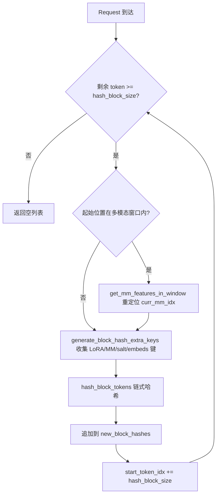
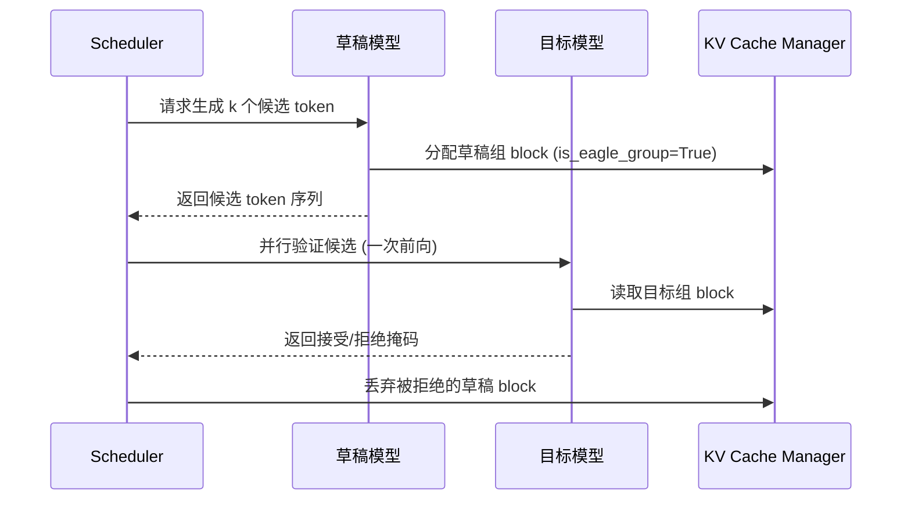

# Capítulo 12: Recursos avançados de inferência: cache de prefixos, decodificação especulativa e LoRA

No capítulo anterior, aprofundamo-nos no sistema de quantização e na infraestrutura de operadores personalizados do vLLM, vimos como as configurações de quantização são analisadas e como o kernel correspondente é selecionado, e como esquemas como FP8, INT4, AWQ e GPTQ concluem a conversão no carregamento de pesos. Ao mesmo tempo, investigamos como _custom_ops registra operadores CUDA, o mecanismo de despacho de kernels Triton e como kernels fundidos de MoE reduzem o tráfego de memória de vídeo. Essas capacidades de baixo nível abriram caminho para otimizações de inferência mais avançadas. Este capítulo focará em três recursos avançados de inferência do vLLM: cache automático de prefixos (APC), decodificação especulativa e LoRA. Embora pareçam independentes, na prática compartilham o mesmo conjunto de infraestrutura de baixo nível — o hash de blocos KV, a alocação de slots pelo scheduler e a injeção dinâmica de pesos na execução do modelo. A chave para entendê-los é compreender como eles levam a "reutilização" ao extremo sem quebrar a semântica de paginação do PagedAttention.

# 12.1 Cache de prefixos: como o block hash fingerprinta um prefixo

## Modelo intuitivo

O cache de prefixos é como um "caderno de trechos públicos" de uma biblioteca: dois alunos escrevem redações e ambos citam o mesmo trecho de texto clássico no início; o professor só precisa corrigir esse trecho uma vez, e depois avalia separadamente as partes diferentes de cada um. Sem ele, cada requisição precisaria fazer prefill de todo o prompt desde o início, e em cenários de perguntas e respostas sobre documentos longos a capacidade computacional seria consumida repetidamente várias vezes.

## Estrutura de dados: mapeamento de tokens para block hash

O núcleo do cache de prefixos é "como determinar que os prefixos de duas requisições são iguais". A resposta do vLLM é: dividir a sequência de tokens em blocos e calcular um hash encadeado para cada bloco. Encadeado significa que o hash do N-ésimo bloco contém o hash dos N-1 blocos anteriores; portanto, um block hash fingerprinta de forma única todo o prefixo "do início da sequência até o fim desse bloco".

O portador do hash é`BlockHash`, que é definido como`bytes`de`NewType`, e não como`bytes`puro, com o objetivo de evitar no nível de tipo o uso indevido de[FACT:vllm/v1/core/kv_cache_utils.py:59-62]. Quando é necessário combinar o block hash com o KV cache group id para formar uma chave de dicionário, o vLLM não usa tuplas, mas concatena diretamente o group id de 4 bytes em big-endian ao final dos bytes do hash[FACT:vllm/v1/core/kv_cache_utils.py:75-76]：

```python
def make_block_hash_with_group_id(block_hash, group_id):
    return BlockHashWithGroupId(block_hash + group_id.to_bytes(4, "big", signed=False))
```

> **[Design Inference & Architectural Trade-offs]**
> Esta é uma otimização típica para "evitar alocação de tuplas": no caminho quente, cada busca de bloco precisa construir uma chave; tuplas trazem alocação extra de objetos Python e custo de hash, enquanto a concatenação de byte strings é feita na camada C, e a própria byte string já é hashable. Na recuperação, usa-se slicing`key[:-4]`e`int.from_bytes(key[-4:])`para restaurar[FACT:vllm/v1/core/kv_cache_utils.py:87-89]。

A própria função de hash é assumida por`hash_block_tokens`, que alimenta a função de hash com o hash do bloco pai, a tupla de token ids do bloco atual e chaves adicionais[FACT:vllm/v1/core/kv_cache_utils.py:650-680]. Observe que o hash pai do primeiro bloco não é`None`, mas o global`NONE_HASH`：

```python
if not parent_block_hash:
    parent_block_hash = NONE_HASH
```

[FACT:vllm/v1/core/kv_cache_utils.py:674-675]。`NONE_HASH`A escolha da semente de esconde um design de segurança: para hashes criptográficos como SHA-256, a semente é fixa`"vllm-none-hash"`, fazendo com que diferentes processos do vLLM calculem o mesmo hash para o mesmo conteúdo, permitindo assim compartilhar o cache de prefixos entre nós; já para hashes não criptográficos como xxhash, a semente é aleatória por processo, porque uma semente previsível permitiria a um atacante pré-calcular offline blocos de colisão[FACT:vllm/v1/core/kv_cache_utils.py:105-126]。`resolve_none_hash_seed`implementa essa bifurcação:`PYTHONHASHSEED`variável de ambiente tem prioridade; caso contrário, hashes criptográficos usam semente fixa e hashes não criptográficos usam`os.urandom(32)` [FACT:vllm/v1/core/kv_cache_utils.py:132-145]。

## Orientado por cenário: cálculo de block hash de uma requisição

Suponha que uma requisição chegue com 128 tokens e o block size seja 16.`get_request_block_hasher`A closure retornada é responsável pelo cálculo incremental[FACT:vllm/v1/core/kv_cache_utils.py:802-861]：

Primeiro passo: determinar de onde começar o cálculo.`start_token_idx = len(request.block_hashes) * hash_block_size` [FACT:vllm/v1/core/kv_cache_utils.py:812-812], ou seja, o número de blocks já calculados multiplicado pelo tamanho do block. Se os tokens restantes não forem suficientes para um block, retorna vazio diretamente[FACT:vllm/v1/core/kv_cache_utils.py:812-812]。

Segundo passo: tratar o deslocamento multimodal. Se a posição inicial cair dentro de alguma entrada multimodal, é preciso usar`get_mm_features_in_window`para reposicionar`curr_mm_idx` [FACT:vllm/v1/core/kv_cache_utils.py:823-832]. Isso porque o placeholder token da entrada multimodal em si não carrega semântica; é necessário incorporar o identificador de feature mm e seu deslocamento dentro do block como chaves extras no hash.

Terceiro passo: calcular cada block em loop.`generate_block_hash_extra_keys`Coletar todas as chaves extras[FACT:vllm/v1/core/kv_cache_utils.py:611-647], incluindo nome do LoRA, chave multimodal, cache salt, hash de prompt embeds. O cache salt só tem efeito no primeiro block[FACT:vllm/v1/core/kv_cache_utils.py:633-635], e isso é intencional: o papel do salt é isolar todo o namespace de cache, bastando injetá-lo uma vez no início da cadeia.

Quarto passo:`hash_block_tokens`fazer o hash do parent hash, da tupla de tokens e das chaves extras juntos, e o resultado é usado como parent hash do próximo block[FACT:vllm/v1/core/kv_cache_utils.py:851-857]. A estrutura encadeada se forma assim.

## Conversão de granularidade entre múltiplos block sizes

Quando o modelo tem múltiplos KV cache groups com block sizes diferentes, a granularidade do hash e a granularidade do block do group podem ser inconsistentes.`BlockHashListWithBlockSize`resolve esse problema: ele não recalcula o hash, mas aproveita a propriedade do hash encadeado — o hash de um target block é o hash do último hash block dentro dele[FACT:vllm/v1/core/kv_cache_utils.py:2781-2851]. Por exemplo, quando o hash block é 16 e o target block é 32, o hash dos tokens 0-31 é o segundo hash de tamanho 16 (ele já cobre 0-31 de forma encadeada)[FACT:vllm/v1/core/kv_cache_utils.py:2794-2806]。`_get_value_at`A implementação é`self.block_hashes[(idx + 1) * self.scale_factor - 1]` [FACT:vllm/v1/core/kv_cache_utils.py:2848-2851]。



## Reflexões de design e armadilhas

**Por que usar hash encadeado em vez de hash independente?**O hash independente não consegue distinguir o caso em que "o mesmo block aparece em posições de prefixo diferentes". O hash encadeado faz com que o block hash seja uma impressão digital única de todo o prefixo, e é exatamente isso que`find_longest_cache_hit`permite reutilizar KV com segurança.

**Armadilha entre processos de hash não criptográfico.**Se usar xxhash e não definir`PYTHONHASHSEED`, o`NONE_HASH`de cada processo será diferente, fazendo com que o cache de prefixo entre instâncias falhe completamente.`init_none_hash`imprimirá um aviso[FACT:vllm/v1/core/kv_cache_utils.py:161-169]. Em ambiente de produção, se forem implantadas múltiplas instâncias compartilhando cache, é obrigatório definir explicitamente`PYTHONHASHSEED`ou trocar para sha256.

**As sutilezas do deslocamento multimodal.** `_gen_mm_extra_hash_keys`Usar`(mm_identifier, offset - start_token_idx)`como chave extra[FACT:vllm/v1/core/kv_cache_utils.py:552]. O deslocamento é relativo ao início do block, de modo que o mesmo item mm, ao aparecer em posições de block diferentes, gera hashes diferentes, evitando falsos acertos.

# 12.2 Decodificação especulativa: a colaboração entre rascunho e verificação

## Modelo intuitivo

A decodificação especulativa é como uma secretária que primeiro redige algumas versões de resposta para o chefe, e o chefe só precisa marcar rapidamente qual versão serve. O modelo de rascunho (drafter) prevê múltiplos tokens candidatos com custo extremamente baixo, e o modelo alvo (target) verifica esses candidatos em paralelo em uma única passada forward, aceitando a parte que coincide. Sem isso, o modelo alvo só poderia gerar token por token em série, e a utilização da GPU na fase de decode seria extremamente baixa.

## Estrutura de dados: anotação do EAGLE group

O problema central da decodificação especulativa no gerenciamento de KV cache é: como as camadas KV do modelo de rascunho e as camadas KV do modelo alvo são agrupadas?`_annotate_eagle_groups`Usa duas regras para identificar o grupo de rascunho[FACT:vllm/v1/core/kv_cache_utils.py:2134-2189]：

Regra um, orientada por spec:`non_causal_multi_token_decode`A flag é declarada em`MLAAttentionSpec`, definida pela camada de atenção de rascunho que executa decode multi-token não causal, e consegue sobreviver à operação`merge`[FACT:vllm/v1/core/kv_cache_utils.py:2175-2177]。

Regra dois, fallback por posição: drafters MTP (como DeepseekV4/V4.1 DSpark) reutilizam as próprias camadas decoder do modelo alvo, sem marcação em spec, mas suas camadas de atenção de rascunho sempre são registradas depois de todas as camadas alvo; portanto, anota o group que contém a última camada registrada[FACT:vllm/v1/core/kv_cache_utils.py:2183-2184]. Essa regra só tem efeito quando o group divide exatamente`kv_cache_spec`todas as camadas[FACT:vllm/v1/core/kv_cache_utils.py:2183-2184]。

## Orientado por cenário: alocação de KV na decodificação especulativa

Quando`speculative_config`está habilitado e`use_eagle_block_drop()`é verdadeiro,`_annotate_eagle_groups`é chamado[FACT:vllm/v1/core/kv_cache_utils.py:2175-2177]. O resultado da anotação`is_eagle_group`afeta a estratégia subsequente de alocação de blocks — os blocks do grupo de rascunho podem ser descartados após a verificação.

No caminho principal de`get_kv_cache_groups`, a anotação ocorre após o agrupamento[FACT:vllm/v1/core/kv_cache_utils.py:2364-2365]. Se nenhum group for anotado como grupo de rascunho,`_warn_if_unannotated_eagle_mamba`emitirá um aviso[FACT:vllm/v1/core/kv_cache_utils.py:2192-2222]。



## Reflexões de design e armadilhas

**Por que o grupo de rascunho precisa de anotação separada?**Os tokens gerados pelo modelo de rascunho podem ser rejeitados após a verificação, e o KV correspondente precisa ser descartado. Se o KV de rascunho e o KV alvo estiverem misturados no mesmo group, a operação de descarte afetaria erroneamente o KV alvo. A anotação permite que o scheduler faça a recuperação com precisão.

**A fragilidade da regra de fallback por posição.**A regra dois depende da convenção de que "a camada de rascunho é registrada por último"; o comentário marca explicitamente isso como hacky check e deixa um FIXME[FACT:vllm/v1/core/kv_cache_utils.py:2158-2159]. Quando o cache final do rascunho abrange múltiplos groups, essa regra só anota o group que contém a última camada, e precisa ser generalizada.

**Restrições adicionais do modelo Mamba.**Se a decodificação especulativa estiver ativada mas nenhum grupo for reconhecido como grupo de rascunho, e existir um grupo Mamba, será disparado um aviso[FACT:vllm/v1/core/kv_cache_utils.py:2211-2213]. Isso geralmente significa que o spec da camada de rascunho não pode ser distinguido da camada alvo, sendo necessário verificar a ordem de registro do modelo.

# 12.3 LoRA: adaptadores dinâmicos sem recarregar a base

## Modelo intuitivo

LoRA é como trocar a capinha de um mesmo celular: o corpo do celular (modelo base) permanece o mesmo, e ao trocar a capinha (adaptador) ele se torna um estilo diferente. Sem isso, cada tarefa de fine-tuning precisaria carregar um conjunto completo de pesos, e a memória de vídeo não suportaria.

## Estrutura de dados: cache LRU duplo e array de slots

`LoRAModelManager`Usa dois caches LRU para gerenciar o ciclo de vida dos adaptadores[FACT:vllm/lora/model_manager.py:115-120]：

```python
self._registered_adapters: AdapterLRUCache[LoRAModel] = AdapterLRUCache(
    self.capacity, self.deactivate_adapter
)
self._active_adapters: AdapterLRUCache[None] = AdapterLRUCache(
    self.lora_slots, self._deactivate_adapter
)
```

`capacity`é o número total de adaptadores que podem ser cacheados no lado da CPU (`max_cpu_loras`）[FACT:vllm/lora/model_manager.py:340-342]，`lora_slots`é o número de adaptadores que podem ser ativados simultaneamente no lado da GPU (`max_loras`）[FACT:vllm/lora/model_manager.py:345-346]。`_registered_adapters`quando removido dispara o callback`deactivate_adapter`callback[FACT:vllm/lora/model_manager.py:71-74], garantindo que, quando o cache da CPU é eliminado, a cópia na GPU também seja limpa.

`lora_index_to_id`é um array de comprimento`lora_slots`que mapeia índices de slot da GPU para ids de adaptador[FACT:vllm/lora/model_manager.py:122]. Este array é o índice central usado pelo punica wrapper ao fazer cálculo em lote de LoRA.

## Orientado a cenários: ativação de adaptador

Quando uma requisição chega com um adaptador LoRA,`activate_adapter`é chamado[FACT:vllm/lora/model_manager.py:352-409]：

Primeiro passo, verifica se já está ativado; se sim, retorna diretamente[FACT:vllm/lora/model_manager.py:352-354]。

Segundo passo, procura um slot livre. Percorre`lora_index_to_id`encontra o primeiro`None` [FACT:vllm/lora/model_manager.py:362-362]. Se não houver slot livre, lança`ValueError("No free lora slots")` [FACT:vllm/lora/model_manager.py:368-368]。

Terceiro passo, atualiza o estado e percorre todos os módulos já empacotados, chamando`module.set_lora(index, lora_a, lora_b)`para copiar os pesos para o stacked buffer da GPU[FACT:vllm/lora/model_manager.py:377-401]. Se algum módulo não tiver pesos LoRA correspondentes, chama`reset_lora(index)`para zerar[FACT:vllm/lora/model_manager.py:378-385]。

Quarto passo, se nenhum peso foi aplicado, imprime um log de depuração único[FACT:vllm/lora/model_manager.py:411-416]. Isso é comportamento esperado sob paralelismo de pipeline ou paralelismo de especialistas — alguns ranks não possuem as camadas adaptadas.

## Empacotamento de módulos: de nn.Linear para BaseLayerWithLoRA

`_create_lora_modules`Percorre todos os módulos nomeados do modelo[FACT:vllm/lora/model_manager.py:462-606]. Lógica principal:

- Pula`PPMissingLayer` [FACT:vllm/lora/model_manager.py:473-474]。
- Filtra com base em`target_modules`: se não especificado, usa`is_supported_lora_module`para julgar; caso contrário, usa`_match_target_modules` [FACT:vllm/lora/model_manager.py:479-493]。
- Trata módulos alias: o mesmo módulo subjacente pode ser acessado por múltiplos caminhos (por exemplo, o gate do MoE está tanto no block quanto no runner). Nesse caso, redireciona o atributo alias para o mesmo wrapper, mas não registra novamente, caso contrário`activate_adapter`chamará`reset_lora`no alias, limpando os pesos recém-definidos[FACT:vllm/lora/model_manager.py:512-527]。
- Usa`from_layer`para criar o wrapper e substituir o módulo original[FACT:vllm/lora/model_manager.py:546-553]。

## Reflexões de design e armadilhas

**Mudanças no layout de slots disparam atualização de mapeamento.** `set_adapter_mapping`não apenas compara se o mapping mudou, mas também compara`lora_index_to_id`o snapshot da tupla[FACT:vllm/lora/model_manager.py:1323-1331]. O motivo está claramente comentado: um`add_lora()`fora de banda pode disparar eliminação LRU e realocar slots, enquanto o batch em execução e seu mapping não mudaram[FACT:vllm/lora/model_manager.py:1323-1331]. Se olhar apenas o mapping, o punica metadata usará um layout de slot desatualizado.

**Fatiamento EP do MoE.**Quando o paralelismo de especialistas está ativado, o checkpoint contém os pesos de todos os especialistas globais, mas cada rank possui apenas`local_num_experts`.`_stack_moe_lora_weights`primeiro faz`global_num_experts`reshape, depois fatia`[expert_start:expert_end]` [FACT:vllm/lora/model_manager.py:966-977]. Quando não é EP, o fatiamento é no-op.

**Momento do pin_memory.**O empacotamento de pesos (como`pack_moe`) pode invalidar a alocação de pin_memory, portanto pin_memory é executado após a fusão de todos os pesos[FACT:vllm/lora/model_manager.py:916-934]. O comentário aponta explicitamente dois motivos: modelos MoE têm grande quantidade de pesos LoRA, e fazer pin cedo tem custo significativo; o empacotamento pode invalidar a alocação[FACT:vllm/lora/model_manager.py:916-921]。

# Reflexão de design: o ponto de sinergia dos três

As três características convergem na camada de gerenciamento do KV cache. O cache de prefixo reutiliza KV via block hash; a decodificação especulativa usa`is_eagle_group`para marcar e distinguir KV de rascunho; LoRA usa`_gen_lora_extra_hash_keys`para misturar o nome do adaptador no block hash[FACT:vllm/v1/core/kv_cache_utils.py:568-581], garantindo que sequências de tokens idênticas com adaptadores diferentes não colidam erroneamente com o KV um do outro.

`generate_block_hash_extra_keys`coloca a chave LoRA no início da lista de chaves extras[FACT:vllm/v1/core/kv_cache_utils.py:640-642], junto com chaves multimodais, cache salt e prompt embeds, formando a entrada completa de hash. Isso garante que: mesmo que dois requests tenham tokens completamente idênticos, desde que os adaptadores LoRA sejam diferentes, seus block hashes serão diferentes, e o KV não será compartilhado indevidamente.

# Resumo do capítulo

# Reflexões e autoavaliação do capítulo

Q1: Se remover`init_none_hash`a lógica de semente aleatória do hash não criptográfico, mudando para sempre usar semente fixa, em quais cenários isso introduziria risco de segurança? Por que o comentário do código-fonte enfatiza especialmente que xxhash precisa de semente secreta?

**Análise de referência**: O código-fonte em`_NON_CRYPTO_HASH_FUNCTIONS`lista explicitamente xxhash e xxhash_cbor como algoritmos não resistentes a colisão[FACT:vllm/v1/core/kv_cache_utils.py:125-126]。`resolve_none_hash_seed`para tais algoritmos retorna`os.urandom(32).hex()` [FACT:vllm/v1/core/kv_cache_utils.py:143-144]. Se mudar para semente fixa, um atacante pode pré-calcular offline blocos que colidem com o prefixo alvo, construir requests com o mesmo hash mas conteúdo diferente, e assim acessar e ler o KV cache de outros — isso é vazamento de informação entre requests. A resistência a colisão do SHA-256 não depende do sigilo da semente, então semente fixa afeta apenas a reprodutibilidade, não a segurança[FACT:vllm/v1/core/kv_cache_utils.py:97-111]。

Q2: `_create_lora_modules`ao tratar módulos alias, se remover a lógica de "não registrar novamente" e chamar diretamente`register_module`também no alias, em`activate_adapter`o que acontece? Por favor, analise em conjunto com`reset_lora`o caminho de chamada de

**Análise de referência**：`activate_adapter`percorre`self.modules`e para cada módulo chama`set_lora`ou`reset_lora` [FACT:vllm/lora/model_manager.py:377-401]. Se tanto o alias quanto o nome canônico estiverem registrados, o mesmo wrapper subjacente será acessado duas vezes. No caminho do nome canônico,`_get_lora_layer_weights`consegue encontrar os pesos e chama`set_lora`para gravar; no caminho do alias, devido à incompatibilidade de nomes,`_get_lora_layer_weights`retorna None, disparando`reset_lora(index)` [FACT:vllm/lora/model_manager.py:378-385], que zera os pesos recém-gravados. Os comentários do código-fonte apontam explicitamente essa armadilha[FACT:vllm/lora/model_manager.py:519-523]. A abordagem correta é redirecionar o atributo de alias para o mesmo wrapper, mas sem registrar novamente[FACT:vllm/lora/model_manager.py:531-537]。

Q3: `BlockHashListWithBlockSize`depende da propriedade de que «o hash do target block é igual ao hash do seu último hash block interno». Se a função de hash não for encadeada (ou seja, cada block é hasheado independentemente), essa classe ainda funcionaria corretamente? Em que circunstâncias ocorreriam falsos acertos de cache?

**Análise de referência**: Não.`_get_value_at`retorna diretamente`self.block_hashes[(idx + 1) * self.scale_factor - 1]` [FACT:vllm/v1/core/kv_cache_utils.py:2848-2851], e a premissa dessa implementação é que o hash do último hash block já cobre encadeadamente todos os tokens anteriores a ele. Se o hash for independente, esse valor apenas fingerprinta o conteúdo do último hash block, e não o target block inteiro. Dois target blocks podem diferir na primeira metade, mas ter o mesmo último hash block, causando colisão de hash,`find_longest_cache_hit`reutilizaria incorretamente KVs incompatíveis. Os comentários do código-fonte afirmam explicitamente que «Each hash_block_size hash is already chained over its entire prefix»[FACT:vllm/v1/core/kv_cache_utils.py:2787-2792]。

O próximo capítulo abordará o sistema de plugins e a extensibilidade, mostrando como o vLLM oferece suporte a formas diversificadas de implantação por meio de abstração de plataforma, processadores de IO e extensões de endpoints.

Este capítulo analisou os mecanismos subjacentes das três principais características avançadas de inferência do vLLM. O núcleo do cache de prefixo é o hash encadeado de blocks: hash_block_tokens faz o hash conjunto do hash pai, da tupla de tokens e de chaves extras, e a estratégia de seed do NONE_HASH equilibra compartilhamento entre processos e segurança contra colisões. A decodificação especulativa distingue grupos de KV de rascunho por meio da anotação is_eagle_group. O LoRA gerencia o ciclo de vida dos adaptadores com cache LRU duplo e array de slots, e mistura o nome do adaptador no block hash para isolar o cache. Essas características, em conjunto, demonstram a profundidade e a flexibilidade do vLLM na otimização de inferência. A seguir, voltamo-nos ao sistema de plugins e à extensibilidade do vLLM, para ver como plugins de plataforma se adaptam a novos hardwares, como plugins de IO processor intervêm no processamento de entradas multimodais e como plugins de endpoint injetam rotas de API personalizadas. Entender a ordem de carregamento do registro e da descoberta de plugins revelará como estender as capacidades do vLLM sem modificar o código central.
