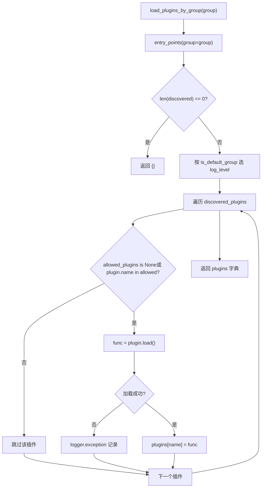
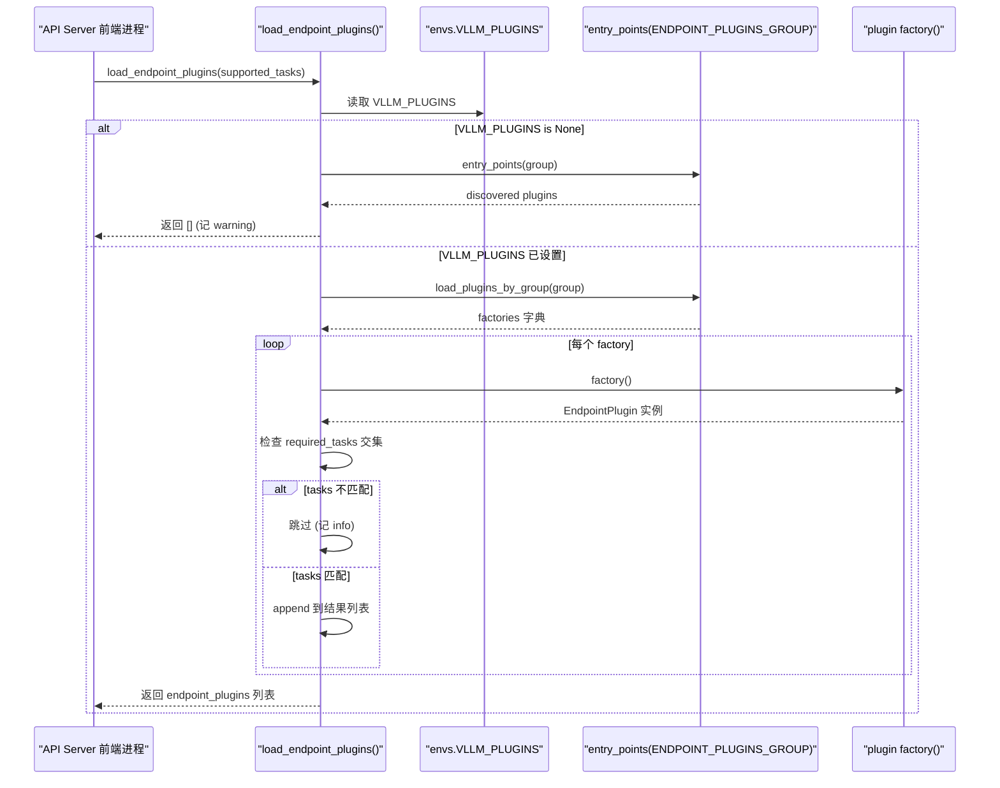

# Capítulo 13: Sistema de plugins e extensibilidade: plataformas, processadores de IO e extensões de endpoints

No capítulo anterior, vimos que recursos avançados como cache de prefixo, decodificação especulativa e LoRA estão profundamente acoplados ao caminho central do escalonador, do gerenciamento de KV e da execução do modelo. Mas, para um motor de inferência realmente chegar à produção, desempenho por si só não basta — ele precisa responder a uma pergunta mais espinhosa: quando a comunidade quer integrar um novo hardware, um novo formato de entrada multimodal ou uma rota HTTP personalizada, como fazer isso sem fork do código central? É exatamente aí que reside o sentido do sistema de plugins. A arquitetura do vLLM é naturalmente multiprocesso: o processo frontend do API Server, o processo EngineCore e o processo Worker correspondente a cada rank de TP/PP. Se o mecanismo de plugins simplesmente «executasse um trecho de código no import», ele ou seria executado repetidamente em cada processo, acumulando efeitos colaterais, ou seria executado apenas no processo principal, fazendo com que os Workers não recebessem a extensão. O que este capítulo disseca é como o vLLM usa o mecanismo padrão de entry_points do Python, combinado com a tripla restrição de grupo (group) + fronteira de processo + momento de carregamento, para construir um sistema de plugins capaz de cobrir todos os processos e, ao mesmo tempo, controlar com precisão a superfície exposta. Focamos em três linhas principais: plugins de plataforma (adaptação a novo hardware), plugins de IO processor (intervenção no processamento de entrada multimodal) e plugins de endpoint (injeção de rotas de API personalizadas). As estratégias de carregamento dos três são completamente diferentes; entender essa diferença significa entender a filosofia de trade-off do vLLM entre «capacidade de extensão» e «fronteira de segurança».

# I. Descoberta e carregamento de plugins: o contrato de agrupamento de entry_points

## Modelo intuitivo: os «canais de broadcast» dos plugins

Imagine o sistema de plugins do vLLM como um conjunto de canais de broadcast. Cada pacote de plugin, ao ser instalado, por meio de`setup.py`do`entry_points`«registra» em algum canal seu indicativo (plugin name) e sua função de resposta (plugin value). O vLLM escaneia esses canais na inicialização e decide quais canais serão «sintonizados» em quais processos.

Sem esse mecanismo, estender o vLLM só seria possível alterando o código-fonte — a cada novo hardware adicionado pela comunidade, seria necessário manter um fork, resultando em fragmentação de versões. O valor do mecanismo de agrupamento está em:**O mesmo pacote de plugin pode ser registrado apenas em um canal específico, ficando restrito ao carregamento em processos específicos**。

## Estrutura de dados: cinco constantes de agrupamento e flag global

O vLLM em`vllm/plugins/__init__.py`define no topo cinco constantes de entry point group, cada constante correspondendo a uma estratégia de carregamento:

[FACT:vllm/plugins/__init__.py:16-30]

```python
DEFAULT_PLUGINS_GROUP = "vllm.general_plugins"
IO_PROCESSOR_PLUGINS_GROUP = "vllm.io_processor_plugins"
PLATFORM_PLUGINS_GROUP = "vllm.platform_plugins"
STAT_LOGGER_PLUGINS_GROUP = "vllm.stat_logger_plugins"
ENDPOINT_PLUGINS_GROUP = "vllm.endpoint_plugins"
```

Os comentários escondem informações cruciais:`DEFAULT_PLUGINS_GROUP`em**Todos os processos**carregam (process0, engine core, worker);`IO_PROCESSOR_PLUGINS_GROUP` **apenas no process0**；`PLATFORM_PLUGINS_GROUP`carrega em todos os processos, mas o momento de disparo é`current_platform`na primeira vez que é acessado;`STAT_LOGGER_PLUGINS_GROUP`apenas no process0 e em modo assíncrono;`ENDPOINT_PLUGINS_GROUP`apenas no processo frontend do API Server.

Em seguida há uma variável global de nível de módulo`plugins_loaded = False` [FACT:vllm/plugins/__init__.py:32-33], que é a guarda de carregamento idempotente — o comentário afirma explicitamente "make sure one process only loads plugins once".

## Step-by-Step: uma`load_plugins_by_group`fluxo completo de chamada

Cenário: o usuário registrou em`setup.py``vllm.general_plugins`sob`register_dummy_model`, agora o vLLM inicia, algum processo chama`load_general_plugins()`。

**Primeiro passo: guarda de idempotência.** `load_general_plugins`primeiro verifica`plugins_loaded`, se já for`True`retorna diretamente[FACT:vllm/plugins/__init__.py:77-90]. Note uma sutileza aqui: a guarda é ativada**antes**do carregamento, o que significa que mesmo se o carregamento subsequente lançar exceção, não haverá retentativa. Isso é intencional — falhas no carregamento de plugins não devem fazer o processo tentar repetidamente.

**Segundo passo: descoberta.**entra em`load_plugins_by_group`, através de`importlib.metadata.entry_points(group=group)`obtém todos os entry points instalados sob esse grupo[FACT:vllm/plugins/__init__.py:36-45]. Se vazio, registra log de debug e retorna dicionário vazio.

**Terceiro passo: nivelamento de logs.**O código-fonte diferencia o nível de log entre grupos padrão e não padrão:`is_default_group`quando verdadeiro usa`logger.debug`, caso contrário usa`logger.info` [FACT:vllm/plugins/__init__.py:47-54]. A motivação é bem prática —`vllm.general_plugins`geralmente contém muitos plugins de registro de modelos, usar INFO causaria poluição; já plugins de plataforma/endpoint são poucos e importantes, merecendo visibilidade INFO.

**Quarto passo: filtragem por whitelist.**lê`envs.VLLM_PLUGINS`, se for`None`carrega todos, caso contrário carrega apenas plugins cujos nomes estão na lista[FACT:vllm/plugins/__init__.py:62-70]. Note que`plugin.load()`está envolvido em try/except, falha no carregamento de um único plugin apenas registra log de exception, sem afetar outros plugins[FACT:vllm/plugins/__init__.py:68-72]。

**Quinto passo: execução.**retorna a`load_general_plugins`, para cada função carregada chama diretamente`func()` [FACT:vllm/plugins/__init__.py:77-90]. É por isso que a documentação enfatiza que funções de plugin devem ser**reentrantes (re-entrant)**— podem ser chamadas múltiplas vezes em múltiplos processos.

O fluxograma abaixo descreve`load_plugins_by_group`o caminho completo de decisão de



## Reflexão de design: por que usar entry_points em vez de arquivo de configuração

> **[Design Inference & Architectural Trade-offs]**
> Escolher`entry_points`em vez de arquivo de configuração personalizado, a motivação central é**permitir que plugins sejam distribuídos junto com o pacote Python**. Após o usuário`pip install vllm-add-dummy-platform`, o plugin aparece automaticamente no grupo correspondente, sem necessidade de editar manualmente a configuração do vLLM. Isso segue a mesma linhagem do ecossistema de plugins de ferramentas como pytest e flake8. O custo é que a descoberta de plugins depende dos metadados do pacote; se o pacote de plugin não estiver completamente instalado (por exemplo, apenas o diretório de código-fonte copiado sem passar pelo pip), o entry_points não será encontrado.

---

# II. Plugins de plataforma: camada de abstração para adaptação de hardware

## Modelo intuitivo: a plataforma é o "tradutor de dialetos de hardware"

`Platform`A classe**é o**único tradutor`current_platform.get_attn_backend_cls()`、`current_platform.is_cuda_alike()`de toda a conversa entre o vLLM e o hardware. O código do modelo apenas chama`import torch.cuda`métodos abstratos como`if device == "xpu"`, nunca diretamente

## . Sem essa camada de abstração, cada novo hardware suportado exigiria adicionar

`Platform`branches no código do modelo, virando espaguete.`vllm/platforms/interface.py`Estrutura de dados: layout de campos da classe base Platform[FACT:vllm/platforms/interface.py:135-179]：

```python
class Platform:
    _enum: PlatformEnum
    device_name: str
    device_type: str
    dispatch_key: str = "CPU"
    ray_device_key: str = ""
    device_control_env_var: str = "VLLM_DEVICE_CONTROL_ENV_VAR_PLACEHOLDER"
    ray_noset_device_env_vars: list[str] = []
    simple_compile_backend: str = "inductor"
    dist_backend: str = ""
    supported_quantization: list[str] = []
    additional_env_vars: list[str] = []
    _global_graph_pool: Any | None = None
```

`_enum`início`PlatformEnum`Copiar`is_cuda()`、`is_rocm()`é[FACT:vllm/platforms/interface.py:69-78]。`device_control_env_var`valor de enum, determina`CUDA_VISIBLE_DEVICES`e outras verificações[FACT:vllm/platforms/interface.py:151-152]。`_global_graph_pool`é a abstração de "variável de ambiente de visibilidade de dispositivo" independente de plataforma — CUDA é`get_global_graph_pool`, outras plataformas definem cada uma[FACT:vllm/platforms/interface.py:1210-1215]。

é o cache de pool de memória de CUDA graph em nível de classe, inicializado preguiçosamente via`__getattr__`Vale notar[FACT:vllm/platforms/interface.py:1189-1208]a lógica de fallback de`torch.<device_type>`: ao acessar um atributo inexistente em Platform, ele tenta encaminhar do namespace`current_platform.memory_allocated()`. Isso permite que o código da plataforma escreva`torch.cuda.memory_allocated()`mas na prática chame`__getstate__`. Porém o código-fonte exclui deliberadamente métodos dunder — caso contrário, a verificação de pickle`None`obteria[FACT:vllm/platforms/interface.py:1182-1185]。

## e tentaria chamá-lo

Step-by-Step: conversão de device ID entre três namespaces**O ponto mais propenso a erros na abstração de plataforma é**o namespace de device ID[FACT:vllm/platforms/interface.py:275-283]：

- **logical**. Os comentários do código-fonte listam explicitamente três`_assigned_physical_gpu_ids`
- **visible**: local rank interno do vLLM, indexa`CUDA_VISIBLE_DEVICES`: número torch/CUDA do processo atual após remapeamento via
- **physical**: ID global de GPU usado por APIs de topologia como NVML, não afetado por variáveis de ambiente

Cenário: um processo Worker recebeu a GPU física`[4, 5]`, variável de ambiente`CUDA_VISIBLE_DEVICES=4,5`, agora é preciso converter local rank 0 para`torch.device("cuda:0")`。

**Primeiro passo: logical → physical.** `device_id_to_physical_device_id(0)`primeiro consulta`_assigned_physical_gpu_ids`, se já definido, indexa e retorna diretamente`4` [FACT:vllm/platforms/interface.py:296-297]. Se não definido, extrai do`device_control_env_var`a lista separada por vírgulas e pega o item 0[FACT:vllm/platforms/interface.py:305-311]. Note que o código-fonte deliberadamente trata**string vazia**como não definida — esta é uma configuração legítima quando o Ray inicia o engine em um placement group puramente CPU[FACT:vllm/platforms/interface.py:296-297]。

**Passo 2: physical → visible.** `logical_device_id_to_visible_device_id(0)`Após obter o physical`4`, decompõe-se a variável de ambiente em`[4, 5]`, encontra-se o índice`4`de`0`e retorna-se[FACT:vllm/platforms/interface.py:316-339]. Se o physical ID não estiver na lista visível, lança-se`RuntimeError`— esta é uma proteção rígida contra o uso indevido de dispositivos não visíveis entre processos.

`set_assigned_physical_gpu_ids`O design idempotente de`RuntimeError` [FACT:vllm/platforms/interface.py:38-56]também merece atenção: definir repetidamente o mesmo valor é uma no-op, mas definir um valor diferente lança

## . Isto evita que o mapeamento de dispositivos seja sobrescrito acidentalmente em ambientes multithread.

Registo e injeção de configuração de plugins de plataforma`vllm.platform_plugins`Os plugins de plataforma são registados através do grupo`None`, e a função do plugin retorna o nome totalmente qualificado da classe de plataforma (ou[FACT:docs/design/plugin_system.md:50-50]indica que o ambiente atual não é suportado)[FACT:docs/design/plugin_system.md:100-100]：

- `_enum`. A implementação mínima apresentada na documentação exige`PlatformEnum.OOT`（out-of-tree）
- `device_type`normalmente definido como
- `check_and_update_config`retorna a string do tipo de dispositivo que o PyTorch reconhece**é chamado no início da inicialização do vLLM,`worker_cls`**
- `get_attn_backend_cls`é obrigatório definir aqui
- `get_device_communicator_cls`retorna o nome da classe do backend de atenção

`check_and_update_config`retorna o nome da classe do comunicador[FACT:vllm/platforms/interface.py:583-592]é o hook mais crítico do plugin de plataforma`VllmConfig`. Recebe a referência[FACT:docs/design/plugin_system.md:105-105]e modifica-a in-place, podendo ajustar block size, graph mode, etc. A documentação enfatiza que "o mais importante é que worker_cls deve ser definido aqui"

## — porque o vLLM precisa saber qual classe Worker usar para instanciar o processo de trabalho.

Reflexão de design: estratégia de três fases para alinhamento do block size`update_block_size_for_backend` [FACT:vllm/platforms/interface.py:666-708]A lógica mais complexa na interface de plataforma é

**Phase 1**. Divide-se em três fases para garantir que o block size seja compatível com o backend de atenção:`--block-size`: se o utilizador não especificou explicitamente`_preferred_block_size_for_backends`, chama-se[FACT:vllm/platforms/interface.py:687-697]para selecionar o menor block size suportado por todos os backends[FACT:vllm/platforms/interface.py:622-663]。

**Phase 2**. Esta função usa LCM (mínimo múltiplo comum) para enumerar valores candidatos, porque alguns backends (como CPU_MLA) só aceitam tamanhos exatos e não múltiplos[FACT:vllm/platforms/interface.py:699-702]。

**Phase 3**: modelos híbridos (attention + mamba) precisam de alinhar o block com o mamba page size[FACT:vllm/platforms/interface.py:704-708]。

> **[Design Inference & Architectural Trade-offs]**
> 〔Inferência de design e trade-offs arquiteturais〕

---

# Este design faseado reflete a realidade que o vLLM enfrenta: diferentes hardwares, diferentes esquemas de quantização e diferentes arquiteturas de modelo impõem restrições ao block size que entram em conflito entre si, não sendo possível resolvê-las com uma única fórmula. O faseamento permite tratar cada restrição independentemente e, no final, obter a solução que satisfaz todas as restrições.

## III. IO Processor e plugins de endpoint: processamento de entrada e extensão da API

Modelo intuitivo: o IO Processor é uma "camada de tradução multimodal"

## A entrada de modelos multimodais (como o LLaVA) não é texto puro, mas uma mistura de texto + imagem. O plugin IO Processor é responsável por converter os dados multimodais brutos em tensores que o modelo consegue consumir, e depois converter a saída do modelo de volta para um formato legível por humanos. É como um tradutor na alfândega: a língua estrangeira que entra (imagem/áudio) é traduzida para a língua materna do modelo, e a língua materna do modelo que sai é traduzida de volta para a língua estrangeira.

Passo a passo: descoberta e instanciação do IO Processor`io_processor_plugin`Cenário: carregar um modelo com um HF config que contém o campo

**.** `get_io_processor`Passo 1: determinar o nome do plugin.`plugin_from_init`Usa-se prioritariamente o`hf_config`passado explicitamente; caso contrário, lê-se o campo`io_processor_plugin`de[FACT:vllm/plugins/io_processors/__init__.py:42-50]e obtém-se`None`. Se ambos estiverem vazios, retorna-se[FACT:vllm/plugins/io_processors/__init__.py:52-54]。

**— indicando que o modelo não precisa de IO processor**Passo 2: carregar todos os plugins instalados.`load_plugins_by_group(IO_PROCESSOR_PLUGINS_GROUP)`Chama-se[FACT:vllm/plugins/io_processors/__init__.py:59-61]。

**para obter todos os plugins desse grupo**Passo 3: construir o mapeamento carregável.`processor_cls_qualname`Itera-se sobre cada plugin, chama-se a sua função para obter`None`, e se não for`loadable_plugins` [FACT:vllm/plugins/io_processors/__init__.py:66-76]regista-se em

**. Note-se que a chamada de função de cada plugin também está envolvida em try/except, pelo que uma falha individual não afeta as outras.**Passo 4: validação e instanciação.`ValueError`Se o número de plugins carregáveis for 0, lança-se[FACT:vllm/plugins/io_processors/__init__.py:66-76]com a mensagem "é necessário um plugin IOProcessor mas nenhum está instalado"`ValueError`. Se o nome do plugin exigido pelo modelo não estiver na lista de carregáveis, lança-se[FACT:vllm/plugins/io_processors/__init__.py:80-81]e listam-se todos os nomes de plugins disponíveis`resolve_obj_by_qualname`. Por fim, resolve-se o nome da classe através de[FACT:vllm/plugins/io_processors/__init__.py:80-81]。

## e instancia-se

Plugins de endpoint: postura de segurança de negação por omissão**Os plugins de endpoint são a categoria mais especial deste capítulo, porque**。`load_endpoint_plugins`não são carregados por omissão`load_plugins_by_group`. A docstring de[FACT:vllm/plugins/__init__.py:93-94]。

explica claramente a razão: os plugins de endpoint adicionam rotas HTTP ao API Server, ampliando a superfície de exposição de rede, pelo que se adota uma postura de "negação por omissão" mais rigorosa do que**`VLLM_PLUGINS`A regra concreta é: só quando o nome do plugin**aparece explicitamente em`required_tasks`, e o seu`None`é[FACT:vllm/plugins/__init__.py:108-108]。

ou tem interseção com as tasks suportadas pelo servidor, é que é carregado`VLLM_PLUGINS`。

**Cenário: o utilizador instalou um plugin de endpoint mas esqueceu-se de definir**Passo 1: verificar se VLLM_PLUGINS não está definido.`envs.VLLM_PLUGINS is None`Se[FACT:vllm/plugins/__init__.py:126-126], primeiro descobrem-se os plugins desse grupo; se existirem, regista-se um warning a indicar "é obrigatório allowlist explícito"`VLLM_PLUGINS=""`. Note-se que os comentários do código-fonte salientam especialmente:`[""]`é interpretado como`None`e não como[FACT:vllm/plugins/__init__.py:108-108], sendo portanto tratado como "uma allowlist que não corresponde a nenhum plugin", e não como "não definido"`None`. Esta distinção de fronteira é importante — a string vazia é um explícito "não carregar nada", enquanto

**é "não configurado".**Passo 2: carregar e instanciar.`load_plugins_by_group`Após obter a função de fábrica através de`factory()`, chama-se[FACT:vllm/plugins/__init__.py:133-141]individualmente para instanciar

**. Se a instanciação falhar, regista-se exception e faz-se continue.**Passo 3: gating por task.`plugin.required_tasks`Verifica-se`None`, e se não for`supported_tasks`Sem interseção, ignorar este plugin[FACT:vllm/plugins/__init__.py:144-145]. Isso permite que o mesmo pacote de plugin registre endpoints diferentes para tarefas distintas (como embedding vs generation).

O diagrama de sequência abaixo descreve a interação completa do plugin de endpoint, desde a descoberta até o carregamento:



## Reflexão de design: a fronteira de processo determina a estratégia de carregamento

A diferença nas estratégias de carregamento dos três tipos de plugins é, em essência, um mapeamento da**fronteira de processo**:

| Tipo de plugin | Processo de carregamento | Comportamento padrão | Motivação |
| --- | --- | --- | --- |
| general | Todos os processos | Carregar tudo | O registro do modelo precisa ser visível em cada Worker |
| platform | Todos os processos | Carregar tudo | A abstração de hardware é dependida por todos os processos |
| io_processor | Apenas process0 | Carregar tudo | O processamento de entrada ocorre apenas no frontend |
| stat_logger | Apenas process0 (assíncrono) | Carregar tudo | Os logs são coletados apenas no processo principal |
| endpoint | Apenas API Server | **Negar por padrão** | Amplia a superfície de exposição de rede, requer autorização explícita |

> **[Design Inference & Architectural Trade-offs]**
> A "negação por padrão" dos plugins de endpoint é uma prática padrão de engenharia de segurança: qualquer extensão que amplie a superfície de ataque deve ser opt-in. Já os outros plugins são carregados por padrão porque não expõem diretamente interfaces de rede, e o ecossistema da comunidade precisa de uma experiência de integração com baixo atrito.

## Armadilhas em produção: degradação silenciosa quando o carregamento de plugin falha

`load_plugins_by_group`Para cada plugin, o`plugin.load()`é envolvido em try/except, e em caso de falha apenas registra a exception[FACT:vllm/plugins/__init__.py:68-72]. Isso significa que**um plugin corrompido não impedirá o vLLM de iniciar**, mas também não fornecerá um erro explícito — o usuário pode ficar confuso sobre "por que meu plugin não está funcionando".

Sugestão de diagnóstico: ajuste o nível de log para DEBUG e pesquise por`"Failed to load plugin"`. Se o plugin estiver sob o grupo`vllm.general_plugins`, o nível de log padrão é DEBUG, sendo necessário habilitá-lo explicitamente para ver os detalhes do carregamento[FACT:vllm/plugins/__init__.py:49-50]。

Outra armadilha é o momento em que a guarda`plugins_loaded`é ativada[FACT:vllm/plugins/__init__.py:77-90]: ela é definida antes do carregamento`True`. Se o primeiro carregamento falhar por algum motivo (como uma exceção na varredura de entry_points), as chamadas subsequentes retornarão diretamente sem tentar novamente. Isso pode causar o fenômeno estranho de "plugin que funciona às vezes" em ambientes de teste.

---

# Resumo do capítulo

O sistema de plugins do vLLM é construído sobre o Python`entry_points`, através de**cinco constantes de grupo**que dividem os tipos de extensão, através da**fronteira de processo**que determina o escopo de carregamento, e através da**`VLLM_PLUGINS`allowlist**que controla o conjunto de carregamento. Os plugins de plataforma usam a classe base`Platform`para abstrair diferenças de hardware, e sua conversão de três namespaces de device ID (logical/visible/physical) é o núcleo do gerenciamento de dispositivos entre processos; os plugins de IO processor são acionados pelo campo`io_processor_plugin`do HF config, responsáveis pela tradução de entradas multimodais; os plugins de endpoint adotam a postura de "negação por padrão", sendo carregados apenas quando explicitamente na allowlist e com task correspondente, para controlar a superfície de exposição de rede.

As três linhas principais compartilham o mesmo mecanismo de descoberta, mas as diferenças nas estratégias de carregamento refletem o trade-off do vLLM entre "conveniência de extensão" e "fronteira de segurança": plugins que não expõem rede são carregados por padrão, plugins que expõem rede devem ser opt-in.

# Reflexões e autoavaliação do capítulo

Q1: Se removermos o try/except de`load_plugins_by_group`em`plugin.load()`, deixando a falha de carregamento ser lançada diretamente, qual seria o impacto na inicialização multiprocesso do vLLM? Em quais cenários isso seria, na verdade, um design melhor?

> **[Design Inference & Architectural Trade-offs]**
> **Análise de referência**: A implementação atual[FACT:vllm/plugins/__init__.py:68-72]faz com que a falha de carregamento de um único plugin seja silenciosamente engolida, registrando apenas um log de exception. Se removermos o try/except, a falha de carregamento se propagará para`load_general_plugins`, interrompendo a inicialização do processo. Em cenários multiprocesso, isso causaria: se o carregamento de plugin de algum processo Worker falhar, todo o engine não poderá iniciar — o que pode ser bom (falha rápida, evitando que processos parciais rodem doentes causando inconsistência de estado), ou ruim (um bug em um plugin opcional derruba todo o serviço). Um design melhor poderia introduzir a variável de ambiente`VLLM_PLUGINS_STRICT`: padrão permissivo (comportamento atual), e em modo estrito a falha de carregamento lança exceção. Assim, ambientes de produção podem exigir que "todos os plugins declarados sejam carregados com sucesso", enquanto ambientes de desenvolvimento mantêm a tolerância a falhas.

Q2: `load_endpoint_plugins`Em`VLLM_PLUGINS=""`, qual é a diferença de comportamento entre`VLLM_PLUGINS`e`None`não definido (

> **[Design Inference & Architectural Trade-offs]**
> **〔Inferência de design e trade-offs arquiteturais〕**Análise de referência`VLLM_PLUGINS=""`: Os comentários do código-fonte indicam explicitamente que`[""]`é interpretado como`None`em vez de[FACT:vllm/plugins/__init__.py:108-108], sendo portanto tratado como "uma allowlist que não corresponde a nenhum plugin"`VLLM_PLUGINS is None`. Quando`load_endpoint_plugins`, o código`[]`retorna diretamente[FACT:vllm/plugins/__init__.py:126-126]e registra um warning`VLLM_PLUGINS=""`; já quando`load_plugins_by_group`, o código continua até**, mas como a string vazia não corresponde a nenhum nome de plugin, acaba também retornando uma lista vazia. Ambos têm o**mesmo resultado**(nenhum plugin de endpoint é carregado), mas**：`None`semânticas diferentes`""`: significa "o usuário não configurou, nós ativamente negamos e avisamos",

Q3: `device_id_to_physical_device_id`significa "o usuário configurou explicitamente uma allowlist vazia, respeitamos sua intenção e não avisamos". Essa distinção permite que a operação "desabilite silenciosamente todos os plugins de endpoint" definindo uma string vazia, sem precisar tolerar o ruído de warning a cada inicialização.`device_control_env_var`Em[FACT:vllm/platforms/interface.py:302-308], por que o código-fonte trata um

**vazio como não definido**? Se removermos essa verificação de string vazia, o que aconteceria no cenário de placement group CPU-only do Ray?[FACT:vllm/platforms/interface.py:296-297]Análise de referência`!= ""`: Os comentários do código-fonte explicam que uma variável de ambiente vazia é uma configuração legítima do Ray ao iniciar um placement group CPU-only em nós GPU`device_ids = "".split(",")`. Se removermos a verificação`[""]`, o código entrará no branch`device_ids[device_id]`, obterá`int("")`, então`ValueError`。Isso faz com que o motor falhe ao iniciar sob uma configuração Ray legítima. Após manter a verificação, variáveis de ambiente vazias seguem para o`else`ramo e retornam diretamente`device_id`, ou seja, assume-se que o logical ID é igual ao physical ID — o que é seguro em cenários CPU-only, pois não há GPU a mapear. Este caso mostra que "não definida" e "definida como vazia" têm semânticas diferentes em sistemas de orquestração distribuída, e o código deve tratá-las explicitamente.

---

O próximo capítulo volta-se para trade-offs arquiteturais, armadilhas em produção e evolução futura; reuniremos os mecanismos dissecados nos treze capítulos anteriores para examinar os compromissos do vLLM entre desempenho, manutenibilidade e extensibilidade, e vislumbrar a direção evolutiva dos motores de inferência.

Até aqui, vimos como o vLLM, por meio do mecanismo de agrupamento de entry_points, do momento de carregamento ciente das fronteiras de processo e de estratégias diferenciadas para três tipos de plugins — plataforma, IO processor e endpoint —, abre superfície de extensão mantendo o núcleo estável. Esse sistema de plugins permite que novos hardwares, novos formatos de entrada e novas rotas de API sejam integrados de forma não invasiva, mas a extensibilidade em si também implica mais dimensões a ponderar. O próximo capítulo encerra o livro, organizando sistematicamente as tensões nas decisões-chave de design do vLLM — continuous batching versus fragmentação de VRAM, CUDA Graph versus formas dinâmicas, implantação desagregada versus overhead de rede — e apresenta uma lista de armadilhas em produção e um caminho de diagnóstico, além de vislumbrar tendências de evolução em frontend Rust, camada IR e hardware heterogêneo.
