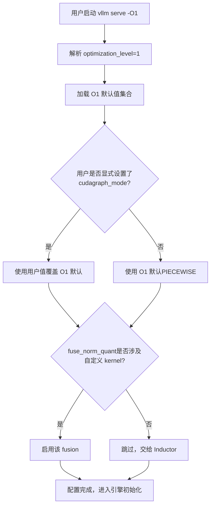
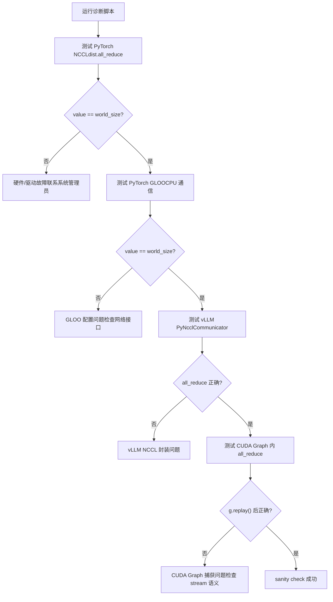
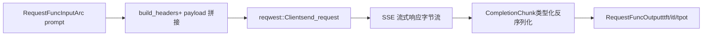

# Capítulo 14: Trade-offs arquiteturais, armadilhas em produção e evolução futura

No capítulo anterior, dissecamos o mecanismo de extensão por plugins do vLLM e vimos como plugins de plataforma, de IO processor e de endpoint permitem que o motor se adapte a novos hardwares, novas modalidades e novas APIs sem modificar o código central. Essa extensibilidade permite que o vLLM abrace mudanças rapidamente, mas quanto mais pontos de extensão, mais complexos se tornam os caminhos de interação em produção. Quando problemas reais como fragmentação de VRAM, falha no handshake do NCCL, invalidação de cache de compilação e instabilidade de rede ocorrem simultaneamente, os mecanismos apresentados nos treze capítulos anteriores entram em conflito, expondo tensões que não apareciam em ambientes ideais. Este capítulo não introduz novos mecanismos centrais; em vez disso, coloca esses mecanismos lado a lado, usando a documentação oficial de troubleshooting como âncora e combinando com o design da ferramenta de bench do frontend Rust, para examinar os trade-offs entre desempenho e operabilidade e oferecer um caminho de diagnóstico acionável.

# I. Níveis de otimização: contrato explícito entre tempo de inicialização e desempenho em execução

## Modelo intuitivo

Os níveis de otimização são como os "modos de cena" de uma câmera: o modo automático (`-O2`) serve para a maioria dos cenários, mas quando você precisa de um disparo rápido (depuração), mudar para o modo manual (`-O0`) responde imediatamente, ao custo de pior qualidade de imagem (desempenho). O vLLM transforma esse trade-off em um contrato explícito de quatro níveis, em vez de escondê-lo em dezenas de flags booleanas para o usuário montar sozinho.

## Layout de campos dos quatro níveis

O vLLM oferece`-O0`até`-O3`quatro níveis[FACT:docs/design/optimization_levels.md:5-5]. O princípio central de design é:**flags definidas explicitamente pelo usuário têm prioridade sobre os padrões do nível de otimização** [FACT:docs/design/optimization_levels.md:5-5]. Isso significa que o nível de otimização é apenas um conjunto de valores padrão, não uma restrição rígida.

`-O0`desativa tudo: sem autotuning, sem compilação, sem cudagraph[FACT:docs/design/optimization_levels.md:32-33]. Concretamente, isso se traduz em quatro chaves:`cudagraph_mode=NONE`、`mode=NONE`, todas as fusões desativadas,`enable_flashinfer_autotune=False` [FACT:docs/design/optimization_levels.md:37-40]。

`-O1`é o ponto de equilíbrio para cenários de desenvolvimento: habilita`PIECEWISE`cudagraph e`VLLM_COMPILE`modo[FACT:docs/design/optimization_levels.md:50-51]. Note um detalhe sutil:`fuse_norm_quant`e`fuse_act_quant`só são habilitados quando um dos operadores usa kernel customizado; caso contrário, a fusão automática do Inductor tem melhor efeito[FACT:docs/design/optimization_levels.md:61]. Essa é uma decisão de design típica de "não competir com o compilador".

`-O2`é o valor padrão, voltado para produção[FACT:docs/design/optimization_levels.md:66-67]. Sobre`-O1`, acrescenta`FULL_AND_PIECEWISE`cudagraph e`fuse_allreduce_rms` [FACT:docs/design/optimization_levels.md:72-73]。`-O3`atualmente equivale a`-O2`, reservando espaço para otimizações experimentais mais agressivas no futuro[FACT:docs/design/optimization_levels.md:80-81]。

## Fluxo de seleção orientado por cenário

Quando um usuário executa`vllm serve model -O1`, o que acontece internamente? O fluxograma abaixo mostra como os níveis de otimização interagem com as flags do usuário:

O ponto-chave desse fluxo está no ramo`check_user`: a configuração explícita do usuário sempre tem prioridade[FACT:docs/design/optimization_levels.md:5-5]. Isso evita problemas difíceis de diagnosticar, como "o nível de otimização sobrescreveu silenciosamente minha flag de depuração".

## Reflexões de design e armadilhas

A armadilha de produção mais comum dos níveis de otimização é**tempo de inicialização excessivo**. A documentação recomenda explicitamente: quando o tempo de inicialização estiver excessivo, use`-O0`ou`-O1` [FACT:docs/design/optimization_levels.md:87]. Mas há um custo oculto —`-O0`sem cudagraph, o overhead de lançamento de cada kernel na CPU fica exposto, e em cenários de alta concorrência a vazão pode cair várias vezes.

Outra armadilha é**erro de compilação**。`-O2`: o`FULL_AND_PIECEWISE`cudagraph faz suposições mais fortes sobre a estrutura do modelo; alguns modelos customizados falham na compilação em`-O2`mas funcionam em`-O1`. A documentação recomenda usar`debug_dump_path`para obter mais informações de depuração[FACT:docs/design/optimization_levels.md:88]. O caminho de diagnóstico deve ser: primeiro usar`-O0`para confirmar a correção funcional, depois subir gradualmente até`-O1`、`-O2`, localizando qual nível introduziu o problema.

> **[Design Inference & Architectural Trade-offs]**
> Essa abordagem de diagnóstico por "degradação em níveis" é, em essência, semelhante à do CUDA Graph`--enforce-eager`É a mesma metodologia: primeiro confirmar a correção com a configuração mais conservadora, depois habilitar otimizações gradualmente, isolando o problema na menor diferença de configuração possível.

---

# II. Lista de armadilhas em produção: caminho de diagnóstico de sintomas a causas raiz

## Modelo intuitivo

A solução de problemas em ambiente de produção é como triagem de emergência: você não pode fazer exames completos em todos os pacientes, deve primeiro reduzir rapidamente o escopo com base nos sintomas (OOM, hang, crash) e depois aprofundar de forma direcionada. A documentação de troubleshooting do vLLM é essencialmente um manual de triagem.

## Classificação de sintomas e ferramentas de diagnóstico

A documentação divide os problemas comuns em várias categorias principais; vamos organizá-los em ordem crescente de dificuldade de diagnóstico.

**Primeira categoria: download/carregamento do modelo travado.**O sintoma é ausência de resposta por longo tempo após a inicialização. A causa raiz geralmente é rede lenta ou sistema de arquivos compartilhado lento[FACT:docs/usage/troubleshooting.md:11-11]. O meio de diagnóstico é`--load-format dummy`pular o carregamento de pesos, isolando se é o download ou o carregamento que está lento[FACT:docs/usage/troubleshooting.md:23-23]. Esta é uma técnica típica de "isolamento por bisseção".

**Segunda categoria: OOM de memória de vídeo.**A documentação aponta diretamente para o documento de configuração conserving_memory[FACT:docs/usage/troubleshooting.md:23]. Mas o OOM em produção geralmente não é porque o modelo é grande demais, e sim fragmentação do KV cache ou número de requisições concorrentes acima do esperado.

**Terceira categoria: mudança na qualidade de geração.**Esta é uma armadilha facilmente ignorada. A v0.8.0 mudou a origem dos parâmetros de amostragem padrão: de valores neutros padrão do vLLM para os do autor do modelo`generation_config.json` [FACT:docs/usage/troubleshooting.md:23-23]. Na maioria dos casos isso melhora a qualidade, mas para certos modelos a configuração fica pior[FACT:docs/usage/troubleshooting.md:23-23]. O método de diagnóstico é reverter para`--generation-config vllm`comparar[FACT:docs/usage/troubleshooting.md:23-23]。

**Quarta categoria: travamento (hang).**Esta é a categoria mais difícil de diagnosticar. A documentação fornece um conjunto progressivo de variáveis de ambiente de depuração[FACT:docs/usage/troubleshooting.md:41-41]：

- `VLLM_LOGGING_LEVEL=DEBUG`: ativar logs detalhados
- `VLLM_LOG_STATS_INTERVAL=1.`: saída de alta frequência do estado da fila e de acertos de cache
- `CUDA_LAUNCH_BLOCKING=1`: localizar qual kernel CUDA está com problema
- `NCCL_DEBUG=TRACE`: ativar logs detalhados do NCCL
- `VLLM_TRACE_FUNCTION=1`: registrar todas as chamadas de função, mas desacelera mais de 100 vezes[FACT:docs/usage/troubleshooting.md:41]

Há uma disciplina operacional importante aqui: após a depuração, é obrigatório desativar essas variáveis de ambiente, ou abrir um novo shell diretamente, caso contrário a configuração de depuração residual continuará desacelerando o sistema[FACT:docs/usage/troubleshooting.md:11-11]。

## A armadilha da fronteira de processo na depuração com breakpoints

A arquitetura multiprocesso do vLLM faz com que breakpoints convencionais`pdb`percam efeito — se o breakpoint for executado em um subprocesso, lançará`BdbQuit` [FACT:docs/usage/troubleshooting.md:45-54]. Duas soluções: usar`forked-pdb` [FACT:docs/usage/troubleshooting.md:57-61], ou definir`VLLM_ENABLE_V1_MULTIPROCESSING=0`para manter o scheduler no mesmo processo[FACT:docs/usage/troubleshooting.md:63-68]。

> **[Design Inference & Architectural Trade-offs]**
> O segundo método, embora conveniente, altera o modelo de execução — no modo de processo único, o EngineCore e o API Server não se comunicam mais por fila, e certos bugs de concorrência podem não ser reproduzíveis. Portanto, ele serve para localizar erros de lógica, mas não para reproduzir problemas de concorrência.

## Diagnóstico de comunicação distribuída

Implantação distribuída tem documentação de diagnóstico dedicada. A recomendação central é:**definir variáveis de ambiente no momento da criação do cluster**, porque as variáveis se propagam para todos os nós; enquanto defini-las no shell afeta apenas o nó local[FACT:docs/serving/distributed_troubleshooting.md:16-16]。

Um problema frequente é`No available node types can fulfill resource request`, que ocorre mesmo quando o cluster tem GPUs suficientes[FACT:docs/serving/distributed_troubleshooting.md:16-16]. A causa raiz geralmente é que o nó tem múltiplos IPs e o vLLM escolheu o errado. A solução é usar`VLLM_HOST_IP`para especificar explicitamente, e`ray status`para validar[FACT:docs/serving/distributed_troubleshooting.md:16-16]。

## Script de diagnóstico de falha na inicialização do NCCL

A documentação fornece um script de diagnóstico completo, validando a pilha de comunicação camada por camada[FACT:docs/usage/troubleshooting.md:89-150]. Seu design é bem estratificado:

A sutileza deste script está em isolar camada por camada: primeiro validar o PyTorch NCCL mais baixo, depois o GLOO do lado da CPU, depois o encapsulamento PyNcclCommunicator do próprio vLLM, e por fim a comunicação dentro do CUDA Graph[FACT:docs/usage/troubleshooting.md:90-146]. Cada falha de camada aponta para uma causa raiz diferente.

Um detalhe notável no script:`pynccl.disabled = False`é para compatibilidade retroativa com 0.6.4 e versões anteriores[FACT:docs/usage/troubleshooting.md:121-125]. A partir da 0.6.5 vem habilitado por padrão, mas manter essa linha evita confusão para quem lê a documentação mais recente.

Em testes multinó, a documentação usa intencionalmente`--rdzv_backend=static`em vez de`c10d`, porque`c10d`em ambiente multinó falha por erro de resolução DNS[FACT:docs/usage/troubleshooting.md:168-168]. Esta é uma configuração típica de "só se sabe depois de pisar no buraco".

## Reflexões de design e armadilhas

**Falha na inicialização do NCCL**（`ncclCommInitRank`reporta unhandled system error) geralmente aponta para duas causas raiz: falta de`IPC_LOCK`capability ou`/dev/shm`não montado[FACT:docs/usage/troubleshooting.md:311-311]. Ambas são armadilhas clássicas de implantação em contêineres.

**Incompatibilidade da toolchain CUDA PTX**（`the provided PTX was compiled with an unsupported toolchain`) indica que o PTX dentro do wheel foi compilado com uma versão mais alta do CUDA toolkit[FACT:docs/usage/troubleshooting.md:325-327]. A solução é habilitar a compatibilidade futura do CUDA: no Docker adicionar`-e VLLM_ENABLE_CUDA_COMPATIBILITY=1` [FACT:docs/usage/troubleshooting.md:325-327], em bare metal instalar o pacote`cuda-compat`e definir`VLLM_CUDA_COMPATIBILITY_PATH` [FACT:docs/usage/troubleshooting.md:325-327]。

**Problema conhecido de consumo de memória do NCCL**：vLLM `>= 0.4.3, <= 0.10.1.1`define`NCCL_CUMEM_ENABLE=0`para contornar um bug do NCCL; processos externos que se conectam ao vLLM também precisam definir essa variável, caso contrário ocorrerá hang ou crash[FACT:docs/usage/troubleshooting.md:375]. Após a correção no NCCL 2.22.3, versões novas removeram essa sobrescrita para permitir otimização de desempenho[FACT:docs/usage/troubleshooting.md:375]. Este caso mostra que:**o contrato de variáveis de ambiente entre processos é uma dependência implícita de sistemas distribuídos**, e deve ser sincronizado em atualizações.

---

# III. Frontend Rust: a filosofia de design zero-copy da ferramenta bench

## Modelo intuitivo

Se o frontend Python é um canivete suíço "completo em funcionalidades, mas pesado", a ferramenta bench em Rust é um bisturi "feito apenas para teste de carga". Seu objetivo de design não é cobertura de funcionalidades, mas minimizar a sobrecarga do próprio cliente sob alta concorrência, fazendo com que os números medidos reflitam de forma real o desempenho do servidor.

## Estruturas de dados e layout de memória

A estrutura de dados central da ferramenta bench é`RequestFuncInput` [FACT:rust/src/bench/src/backends/mod.rs:59-89]. Ela faz uso extensivo de`Arc<str>`e`Arc<[u32]>`em vez de`String`/`Vec`, o que é o núcleo do design de zero-copy.

Vejamos alguns campos-chave:`prompt: Arc<str>` [FACT:rust/src/bench/src/backends/mod.rs:50-52]——múltiplas requisições concorrentes podem compartilhar a mesma string de prompt, evitando que cada requisição clone uma cópia.`prompt_token_ids: Option<Arc<[u32]>>` [FACT:rust/src/bench/src/backends/mod.rs:77]——IDs de token pré-computados são enviados diretamente ao servidor, pulando a tokenização do lado do servidor[FACT:rust/src/bench/src/backends/mod.rs:74-76]。

O mais engenhoso é`multi_modal_content: Option<Arc<[Arc<str>]>>` [FACT:rust/src/bench/src/backends/mod.rs:81]. O comentário explica: conteúdo multimodal como fragmentos JSON pré-serializados, o chat backend os concatena diretamente no fluxo de bytes do payload, evitando qualquer parsing ou deep copy dos dados de imagem em base64[FACT:rust/src/bench/src/backends/mod.rs:78-80]. Esta é uma estrutura de`Arc`em duas camadas: a camada externa`Arc<[...]>`compartilha todo o array, a camada interna`Arc<str>`compartilha um único fragmento.

`chat_messages_json: Option<Arc<str>>`tem a prioridade mais alta, sendo concatenado diretamente no payload sem alterações[FACT:rust/src/bench/src/backends/mod.rs:82-85]。

## Desserialização sem alocação

A análise de respostas em streaming SSE é outro ponto crítico de desempenho. O comentário aponta explicitamente: usar desserialização tipada para evitar construir a árvore completa de`serde_json::Value`, extraindo apenas os campos necessários[FACT:rust/src/bench/src/backends/mod.rs:20-24]。

`CompletionChunk`mantém apenas os dois campos`choices`e`usage`[FACT:rust/src/bench/src/backends/mod.rs:20-24]，`ChatChunk`Da mesma forma[FACT:rust/src/bench/src/backends/mod.rs:33-37]。`#[serde(default)]`faz com que o campo`choices`ausente tenha como padrão um array vazio[FACT:rust/src/bench/src/backends/mod.rs:20-24], que é a situação comum em respostas de streaming.

## Fluxo de requisições orientado a cenários

Quando uma requisição de teste de carga é enviada, como os dados fluem? O diagrama de fluxo de dados abaixo mostra a transformação da entrada para a saída:

`Backend`A enumeração usa despacho estático para evitar o problema de async trait object[FACT:rust/src/bench/src/backends/mod.rs:150-154]。`send_request`Através de`match`despacha para a implementação concreta[FACT:rust/src/bench/src/backends/mod.rs:158-168]。`get_backend`Com base em`BackendKind`retorna o backend correspondente[FACT:rust/src/bench/src/backends/mod.rs:172-181]。

Um detalhe:`API_KEY`usa`OnceLock`para cache, evitando fazer uma syscall de variável de ambiente a cada requisição[FACT:rust/src/bench/src/backends/mod.rs:186-188]。`build_headers`Insere sequencialmente Content-Type, Authorization, extra headers, request-id[FACT:rust/src/bench/src/backends/mod.rs:191-215]。

## Reflexões de design e armadilhas

> **[Design Inference & Architectural Trade-offs]**
> O design de zero-copy da ferramenta bench em Rust reflete um julgamento importante:**o overhead do cliente da ferramenta de teste de carga se torna uma fonte de erro de medição**. Se cada requisição clona o prompt, faz parsing completo do JSON e deep copy de imagens base64, então a latência medida inclui o overhead do cliente, não refletindo com precisão o desempenho do servidor. Usar`Arc`para compartilhar dados imutáveis e desserialização tipada para pular campos irrelevantes é, essencialmente, reduzir o overhead do cliente a quase zero.

`RequestFuncOutput`O design dos campos de`ttft`（time to first token）、`itl`também merece atenção:`tpot`（time per output token）[FACT:rust/src/bench/src/backends/mod.rs:93-105](array de inter-token latency),

---

# . Essas três métricas correspondem a diferentes dimensões de desempenho: TTFT reflete prefill e latência de fila, ITL reflete a estabilidade do decode, TPOT reflete a vazão geral. Se no teste de carga olharmos apenas a latência média, a variação do ITL será mascarada.

Reflexão de design: a lógica subjacente dos trade-offs arquiteturais

> **[Design Inference & Architectural Trade-offs]**
> **〔Inferência de design e trade-offs arquiteturais〕**Continuous batching vs fragmentação de memória de vídeo.

**O continuous batching permite que o lote seja reorganizado a cada passo, aumentando muito a vazão, mas ao custo de alocação e liberação extremamente frequentes do KV cache. O mecanismo de block table do PagedAttention existe justamente para lidar com essa alocação de alta frequência — blocos de tamanho fixo eliminam a fragmentação externa, mas introduzem o overhead de indireção da block table e fragmentação interna (o último bloco pode não estar cheio). Este é um trade-off típico de "trocar taxa de fragmentação por uma camada de indireção", a mesma ideia da paginação de memória virtual dos sistemas operacionais.**CUDA Graph vs formas dinâmicas.`PIECEWISE`CUDA Graph exige formas estáticas, mas o tamanho do lote do continuous batching muda a cada passo. A solução do vLLM é`FULL_AND_PIECEWISE`e[FACT:docs/design/optimization_levels.md:50,72]modo`-O0`——capturar como grafo a parte que pode ser estaticizada, mantendo a parte dinâmica em eager.`-O2`desligar completamente o cudagraph é para depuração,`-O1`totalmente ligado é para produção, o

**no meio é o meio-termo.**Implantação separada vs overhead de rede.`IPC_LOCK`、`/dev/shm`）[FACT:docs/usage/troubleshooting.md:311-311]O KV Connector permite separar prefill e decode em instâncias diferentes, mas a transferência de KV cache entre instâncias introduz latência de rede. Os requisitos de configuração do GPUDirect RDMA na documentação (

**) indicam que esse caminho tem exigências rígidas de infraestrutura. A variação da rede pode causar timeout na transferência de KV, disparando retentativas ou degradação.**Operabilidade vs desempenho.`VLLM_TRACE_FUNCTION=1`Níveis de otimização, variáveis de ambiente de depuração, scripts de diagnóstico, tudo isso é o custo pago pela operabilidade.[FACT:docs/usage/troubleshooting.md:41]pode deixar 100 vezes mais lento

---

# , mas é o último recurso para localizar problemas de hang. Um motor maduro deve fornecer essas ferramentas "lentas mas que permitem enxergar".

Resumo deste capítulo

Este capítulo encerra o livro, reexaminando os mecanismos dos treze capítulos anteriores sob a perspectiva de produção.`-O0`Níveis de otimização (`-O3`até[FACT:docs/design/optimization_levels.md:5-5]) são um contrato explícito entre tempo de inicialização e desempenho em execução, e as flags do usuário sempre têm prioridade sobre os valores padrão do nível`Arc`. A lista de armadilhas de produção cobre o caminho completo de diagnóstico, desde carregamento de modelo, OOM de memória de vídeo, mudanças na qualidade de geração até falhas de comunicação distribuída, com a metodologia central de "isolamento por bisseção" e "verificação camada por camada". A ferramenta bench em Rust usa

Três linhas centrais de trade-offs permeiam todo o livro: batching contínuo versus fragmentação de memória de vídeo, CUDA Graph versus formas dinâmicas, implantação desagregada versus sobrecarga de rede. Compreender essas tensões é mais importante do que memorizar qualquer mecanismo individual — porque cada ajuste em ambiente de produção é, essencialmente, encontrar um ponto de equilíbrio entre essas tensões.

# Reflexões e autoavaliação deste capítulo

Q1: Se alterarmos o`-O2`do`FULL_AND_PIECEWISE`cudagraph para o`-O1`do`PIECEWISE`, em quais cenários ocorreria regressão de desempenho? Por quê?

**Análise de referência**：`-O2`Com base no`-O1`, adiciona-se o`FULL_AND_PIECEWISE`modo cudagraph[FACT:docs/design/optimization_levels.md:72]。`FULL`O modo captura toda a propagação direta em um único grafo, enquanto o`PIECEWISE`captura apenas os fragmentos que podem ser estatizados. Em cenários de produção com formas de lote estáveis,`FULL`o modo elimina mais sobrecarga de lançamento de kernels, proporcionando maior throughput. Porém, se o modelo contiver fluxo de controle dinâmico (como o roteamento de tokens do MoE),`FULL`o modo pode não conseguir capturar ou apresentar comportamento anômalo após a captura; nesse caso, o`PIECEWISE`é mais estável. A regressão de desempenho ocorrerá quando: mudanças frequentes no tamanho do lote impedirem o`FULL`grafo de ser acionado, ou quando a estrutura do modelo disparar o caminho de fallback do`FULL`modo. O método de diagnóstico é primeiro usar o`-O1`para confirmar a linha de base, depois escalar para o`-O2`para comparação, e usar o`VLLM_LOG_STATS_INTERVAL=1.`para observar o estado da fila[FACT:docs/usage/troubleshooting.md:41-41]。

Q2: No script de diagnóstico, por que é necessário testar o PyTorch GLOO antes de testar o vLLM PyNcclCommunicator? Se pularmos o teste GLOO e formos direto para o PyNccl, o que deixaríamos de detectar?

**Análise de referência**: A ordem de execução do script é PyTorch NCCL → PyTorch GLOO → vLLM PyNccl → CUDA Graph[FACT:docs/usage/troubleshooting.md:90-146]. O GLOO testa a comunicação do lado da CPU[FACT:docs/usage/troubleshooting.md:106-112], enquanto o`PyNcclCommunicator`do vLLM precisa de um grupo GLOO como bootstrap[FACT:docs/usage/troubleshooting.md:120]. Se pularmos o teste GLOO, quando a inicialização do PyNccl falhar, não será possível distinguir se o problema é do próprio NCCL ou do bootstrap GLOO. O GLOO depende da configuração da interface de rede (`GLOO_SOCKET_IFNAME`）[FACT:docs/usage/troubleshooting.md:81-81], que em ambientes de rede complexos é um ponto de falha frequente. O valor do teste camada por camada está em isolar a falha na menor diferença de configuração possível.

Q3: A ferramenta de bench em Rust usa`Arc<str>`para compartilhar o prompt. Se o cenário de teste de carga exigir que cada requisição envie um prompt diferente, esse design se torna inválido? Por quê?

**Análise de referência**：`Arc<str>`O objetivo do design do[FACT:rust/src/bench/src/backends/mod.rs:50-52]é permitir que múltiplas requisições concorrentes compartilhem a mesma string imutável`Arc`. Se o prompt de cada requisição for diferente,`Arc<str>`a vantagem de compartilhamento do`Arc<str>`de fato desaparece — cada requisição precisa construir seu próprio`String`. Mas o design não se torna inválido:`prompt_token_ids: Option<Arc<[u32]>>` [FACT:rust/src/bench/src/backends/mod.rs:77]em comparação com o`Arc`ainda evita múltiplas clonagens durante o fluxo da requisição (como da fila de entrada para o backend e depois para a construção do payload). A verdadeira otimização de zero-copy está no`Arc<str>`— mesmo que o texto do prompt seja diferente, o array pré-computado de token IDs ainda pode ser compartilhado através do`Arc<[u32]>`durante o ciclo de vida da requisição, evitando alocações repetidas. A premissa de design da ferramenta de teste de carga é "mesmo prompt com alta concorrência" ou "token IDs pré-computados"; para o primeiro, usa-se o

---

para compartilhar o texto, para o segundo, usa-se o

para compartilhar a sequência de tokens.
