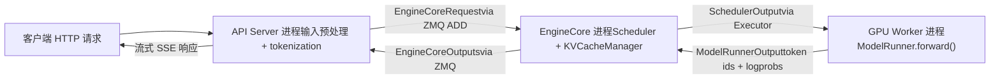
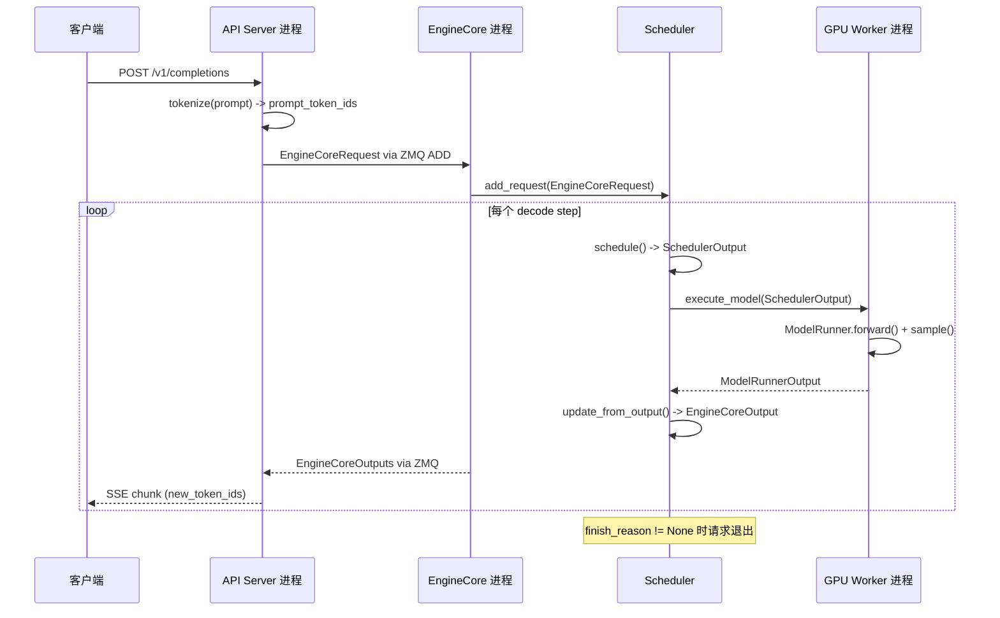

# Глава 1: Философия дизайна vLLM и общий обзор архитектуры

Предположим, у вас есть A100, и вы хотите предоставлять онлайн-сервис инференса с помощью LLaMA-7B. Самый простой подход: приходит запрос — запускаем model.generate() — возвращаем результат. Это решение мгновенно рухнет при росте конкурентности — не потому, что не хватает вычислительной мощности GPU, а по двум причинам. Во-первых, видеопамять съедается фрагментацией. Авторегрессионная генерация требует кэширования тензоров Key/Value каждого слоя (KV Cache). Если для каждого запроса предварительно выделять целый непрерывный блок видеопамяти размером max_model_len, то запрос на 4096 токенов займёт десятки МБ, тогда как реально сгенерированная последовательность может содержать всего 200 токенов. Хуже того, запросы разной длины входят и выходят поочерёдно, непрерывные блоки видеопамяти дробятся на куски, и в итоге, хотя суммарного объёма достаточно, не находится достаточно большой непрерывный участок — это классическая проблема фрагментации видеопамяти. Во-вторых, низкая эффективность батчевой обработки. Традиционная статическая батчевая обработка требует, чтобы все запросы в одном батче начинались и заканчивались одновременно. Но длина вывода генеративных задач по своей природе непредсказуема: один запрос может остановиться на 10 токенах, другому нужно сгенерировать 2000. После завершения короткого запроса его слот в батче может только простаивать в ожидании завершения длинного запроса, и загрузка GPU обваливается. Два краеугольных камня дизайна vLLM как раз нацелены на эти две болевые точки: PagedAttention устраняет фрагментацию видеопамяти с помощью механизма страничной адресации, Continuous Batching устраняет простой батчевой обработки с помощью планирования на уровне итераций. В этой главе мы не углубляемся в детали реализации этих двух механизмов (это темы глав 2 и 4), а сначала строим глобальную карту: как выглядит процессная архитектура vLLM v1, как разделены обязанности между слоями, через какие компоненты проходит запрос от входа в систему до выдачи токена. Понимание этой карты даёт опору для разбора исходного кода в каждой последующей главе.

# Процессная архитектура: почему vLLM — не однопроцессная программа

## Интуитивная модель

Представьте vLLM как ресторан. Ресепшн (API Server) принимает гостей и записывает заказы; ядро кухни (EngineCore) решает, какое блюдо готовить первым и на какой плите; каждой плитой (GPU Worker) управляет один повар единолично. Если заставить одного человека и принимать гостей, и готовить, в час пик неизбежно будет суматоха — вот почему vLLM разделяет эти роли на независимые процессы.

> **[Design Inference & Architectural Trade-offs]**
> Ключевая мотивация такого многопроцессного разделения —**разделение ответственности**: разбор HTTP, токенизация, загрузка мультимодальных данных — это операции, интенсивно использующие CPU и способные блокироваться, тогда как прямой проход модели интенсивно использует GPU. Если поместить их в один процесс, GIL в Python заставит их тормозить друг друга. После разделения на независимые процессы API Server может непрерывно принимать новые запросы, EngineCore — непрерывно планировать, GPU Worker — непрерывно вычислять, а все три развязываются через очередь сообщений ZMQ.

## Топология процессов и количественные соотношения

Процессную архитектуру vLLM v1 можно обобщить одной формулой. Для развёртывания с`N`GPU, степенью тензорного параллелизма`TP`, степенью конвейерного параллелизма`PP`, степенью параллелизма данных`DP`, количеством API Server`A`:

| Тип процесса | Количество | Обязанности |
| --- | --- | --- |
| API Server | `A`(по умолчанию равно`DP`） | Обработка HTTP-запросов, предобработка входных данных, потоковый возврат результатов |
| EngineCore | `DP`(по умолчанию 1) | Планирование, управление KV Cache, координация GPU Worker |
| GPU Worker | `N`（= `DP × PP × TP`） | Загрузка весов, выполнение прямого прохода, управление видеопамятью |
| DP Coordinator | `DP > 1`равно 1, иначе 0 | Балансировка нагрузки между рангами DP и координация волн MoE |

[FACT:docs/design/arch_overview.md:113-113]даёт авторитетное определение этой таблицы. Типичное развёртывание на одной машине с 4 GPU (`vllm serve -tp=4`) создаёт 1 API Server + 1 EngineCore + 4 GPU Worker = 6 процессов[FACT:docs/design/arch_overview.md:115-115]. А развёртывание с 8 GPU при TP=2/DP=4 раздувается до 4 + 4 + 8 + 1 = 17 процессов[FACT:docs/design/arch_overview.md:123-123]。

Здесь есть одна легко упускаемая деталь:**Количество API Server по умолчанию следует за размером DP**. Когда`--data-parallel-size 4`, автоматически запускаются 4 API Server, каждый из которых через ZMQ соединяется по топологии «многие ко многим» со всеми EngineCore[FACT:docs/design/arch_overview.md:73-73]. Это означает, что любой API Server может маршрутизировать запрос к любому EngineCore, избегая единой точки отказа.

## Поток данных

Приведённая ниже схема показывает полный путь прохождения одного запроса между процессами. Обратите внимание, что на каждом узле указаны реальные имена классов и структур данных:



Ключевой момент этой схемы в том, что:**Между API Server и EngineCore — асинхронная передача сообщений**, а не вызов функций. Запрос сериализуется в`EngineCoreRequest`структуру (один`msgspec.Struct`, см.[FACT:vllm/v1/engine/__init__.py:109-113]), отправляется через ZMQ с типом сообщения`ADD`[FACT:vllm/v1/engine/__init__.py:287-299]. После обработки EngineCore упаковывает результат в`EngineCoreOutputs`и возвращает[FACT:vllm/v1/engine/__init__.py:256-260]。

> **[Design Inference & Architectural Trade-offs]**
> Выбор ZMQ вместо gRPC или разделяемой памяти обусловлен тем, что ZMQ обеспечивает крайне низкую задержку (микросекундного уровня) в сценариях межпроцессного взаимодействия и естественно поддерживает топологию «многие ко многим» и семантику очередей сообщений. Для сценариев инференс-сервиса, чувствительных к задержке первого токена, накладные расходы на коммуникацию должны быть как можно меньше.

## Размышление о дизайне: почему EngineCore — отдельный процесс, а не поток

Естественный вопрос: раз EngineCore и API Server находятся на одной машине, почему бы не поместить их в один процесс и не общаться через потоки?

Ответ кроется в режиме работы EngineCore. EngineCore выполняет**busy loop**(цикл занятости), непрерывно планируя запросы и распределяя работу между GPU Worker[FACT:docs/design/arch_overview.md:73-73]. Этот цикл нельзя прерывать — как только он блокируется на разборе HTTP или токенизации, во всём конвейере инференса появляются пузыри. Отдельный процесс гарантирует, что квант времени CPU EngineCore не будет вытеснен фронтенд-логикой.

Кроме того, отдельный процесс обеспечивает**изоляцию отказов**: если API Server падает из-за какого-то некорректного запроса, EngineCore и GPU Worker не затрагиваются и могут продолжать обслуживать запросы, перенаправленные от других API Server.

# Многоуровневая ментальная модель: границы ответственности от входа до GPU

## Интуитивная модель

Если процессная архитектура — это «кто где работает», то многоуровневая модель — это «какой уровень за какие решения отвечает». Организация кода vLLM следует чёткому принципу слоистости:**верхний уровень решает, что делать, нижний — как делать**. Уровень входа решает, какие запросы принимать, ядро движка решает, кого обрабатывать первым, уровень исполнителя решает, какую стратегию параллелизма использовать, уровень Worker решает, как получить результат на конкретном оборудовании.

## Четырёхуровневая структура

**Уровень входа (Entrypoints)**предоставляет два способа взаимодействия: класс`LLM`для офлайн-инференса и команду`vllm serve`для онлайн-сервиса[FACT:docs/design/arch_overview.md:16-16][FACT:docs/design/arch_overview.md:56-56]. Основная задача этого уровня — предобработка входа: токенизация, загрузка мультимодальных данных, разбор параметров сэмплирования — а также обратная токенизация выхода и потоковая отдача. Он не заботится о стратегии планирования и не трогает GPU.

**Ядро движка (EngineCore)**— это мозг всей системы. Оно содержит Scheduler (решает, какие запросы обрабатывать на каждом шаге декодирования) и KV Cache Manager (управляет страничной видеопамятью), взаимодействует с GPU Worker через абстракцию Executor[FACT:docs/design/arch_overview.md:79-85]. Ключевой дизайн этого уровня —**разделение планирования и исполнения**: Scheduler выдаёт только решение «какие токены запускать на этом шаге» (`SchedulerOutput`), а как именно запускать на GPU — дело Worker.

**Уровень исполнителя (Executor)**— это мост между EngineCore и Worker. Он инкапсулирует стратегии распределённого исполнения — для одного процесса используется`UniProcExecutor`, для многопроцессных —`MultiprocExecutor`, для кластера Ray —`RayDistributedExecutor`. Абстрактный интерфейс Executor позволяет EngineCore не знать, что под ним — одна карта или 8 карт TP.

**Уровень Worker**— по одному процессу Worker на каждый GPU, внутри которого находятся ModelRunner и реальный объект модели`torch.nn.Module`[FACT:docs/design/arch_overview.md:171-191]. ModelRunner отвечает за подготовку входных тензоров, захват CUDA Graph, выполнение прямого прохода. Этот уровень — единственное место, где напрямую работают с видеопамятью GPU и потоками CUDA.

## Объект конфигурации: глобальное состояние, пронизывающее все уровни

Чем передаётся информация между четырьмя уровнями? Ответ —`VllmConfig`— гигантский dataclass, содержащий всю конфигурацию[FACT:vllm/config/vllm.py:357-357]。

```python
@config(config=ConfigDict(arbitrary_types_allowed=True))
class VllmConfig:
    """Dataclass which contains all vllm-related configuration."""
    model_config: ModelConfig = None
    cache_config: CacheConfig = Field(default_factory=CacheConfig)
    parallel_config: ParallelConfig = Field(default_factory=ParallelConfig)
    scheduler_config: SchedulerConfig = Field(default_factory=SchedulerConfig.default_factory)
    # ... 还有 20+ 个子配置
```

[FACT:vllm/config/vllm.py:363-371]показывает ключевые поля. Логику, стоящую за этим проектным выбором, стоит раскрыть.

> **[Design Inference & Architectural Trade-offs]**
> В документации явно объясняется, почему используется один большой объект конфигурации вместо разрозненной передачи параметров:**Расширяемость**. Предположим, нужно добавить новую функцию, влияющую только на ModelRunner — достаточно добавить одно поле в`VllmConfig`, и ModelRunner просто прочитает его, не требуется изменять сигнатуры конструкторов Engine, Worker, Model[FACT:docs/design/arch_overview.md:203-203]. В быстро развивающемся фреймворке для инференса такая способность «добавлять поля без изменения интерфейсов» значительно снижает трение при разработке.

Цена — это то, что`VllmConfig`становится чрезвычайно громоздким — из[FACT:vllm/config/vllm.py:356-3509]видно, что этот класс занимает более 3000 строк кода, содержит десятки полей и методов валидации.`__post_init__`Метод[FACT:vllm/config/vllm.py:1405-2317]занимает более 900 строк и отвечает за всю кросс-конфигурационную валидацию и вывод значений по умолчанию.

## Хеширование и кэширование конфигурации

`VllmConfig`Есть ещё одна легко упускаемая, но очень важная возможность:`compute_hash()` [FACT:vllm/config/vllm.py:464-580]. Он генерирует короткий хеш для всех конфигурационных параметров, влияющих на структуру вычислительного графа.

```python
def compute_hash(self, include_version: bool = True) -> str:
    factors: list[Any] = []
    vllm_factors: list[Any] = []
    if include_version:
        from vllm import __version__
        vllm_factors.append(__version__)
    if self.model_config:
        vllm_factors.append(self.model_config.compute_hash())
    # ... 逐个追加各子配置的哈希
    hash_str = safe_hash(str(factors).encode(), usedforsecurity=False).hexdigest()[:10]
    return hash_str
```

[FACT:vllm/config/vllm.py:479-580]демонстрирует полный процесс вычисления хеша. Обратите внимание на предупреждение в комментарии: «Whenever a new field is added to this config, ensure that it is included in the factors list if it affects the computation graph»[FACT:vllm/config/vllm.py:465-467]。

> **[Design Inference & Architectural Trade-offs]**
> Назначение этого хеша —**ключ кэша torch.compile**. vLLM использует`torch.compile`для компиляции графа прямого прохода модели, результат компиляции кэшируется на диск. При следующем запуске, если хеш конфигурации совпадает, можно напрямую переиспользовать кэш компиляции, пропустив трудоёмкий процесс компиляции. Если какой-либо конфигурационный параметр, влияющий на вычислительный граф, не включён в хеш, это приведёт к ошибочному попаданию в кэш — граф, скомпилированный со старой конфигурацией, будет использоваться для новой конфигурации, что приведёт к тихим ошибкам. Именно поэтому в комментариях неоднократно подчёркивается: «поля, влияющие на вычислительный граф, должны быть включены в хеш».

# Обход жизненного цикла запроса: от HTTP до токена

## Постановка сценария

Предположим, клиент отправляет на`vllm serve`запущенный сервис OpenAI-совместимый`/v1/completions`запрос с промптом "The capital of France is" и требованием сгенерировать 16 токенов. Проследим полный путь этого запроса по исходному коду.

## Шаг 1: API Server принимает и выполняет предобработку

После получения HTTP-запроса процесс API Server выполняет токенизацию и разбор параметров сэмплирования, затем конструирует`EngineCoreRequest`：

```python
class EngineCoreRequest(
    msgspec.Struct,
    array_like=True,
    omit_defaults=True,
    gc=False,
):
    request_id: str
    prompt_token_ids: list[int] | None
    mm_features: list[MultiModalFeatureSpec] | None
    sampling_params: SamplingParams | None
    pooling_params: PoolingParams | None
    arrival_time: float
    lora_request: LoRARequest | None
    cache_salt: str | None
    data_parallel_rank: int | None
    prompt_embeds: torch.Tensor | None = None
    # ... 更多字段
```

[FACT:vllm/v1/engine/__init__.py:109-124]определяет核心 структуру запроса. Обратите внимание на`msgspec.Struct`в сочетании с`array_like=True`и`omit_defaults=True`комбинацию[FACT:vllm/v1/engine/__init__.py:109-113]— это сделано для**производительности сериализации**。`array_like`чтобы msgspec использовал позиционные массивы вместо словарей для кодирования,`omit_defaults`пропуская поля со значениями по умолчанию — вместе это значительно уменьшает размер ZMQ-сообщений.

> **[Design Inference & Architectural Trade-offs]**
> `gc=False`же указывает msgspec не генерировать код отслеживания GC для этой структуры[FACT:vllm/v1/engine/__init__.py:109-113]. Для часто создаваемых/уничтожаемых объектов сообщений отключение отслеживания GC снижает нагрузку на сборщик мусора Python, что является необходимой оптимизацией в сценариях обработки тысяч запросов в секунду.

## Шаг 2: Планирование в EngineCore

После получения запроса EngineCore, Scheduler помещает его в очередь ожидания. На каждом шаге планирования Scheduler решает, включать ли этот запрос в текущий батч. Если включается, KV Cache Manager выделяет для него физические блоки (ключевая операция PagedAttention, подробнее в главе 2).

Результат планирования инкапсулируется в`SchedulerOutput`и через Executor отправляется GPU Worker.

## Шаг 3: GPU Worker выполняет прямой проход

ModelRunner в Worker получает`SchedulerOutput`, подготавливает входные тензоры (включая block table, slot mapping и другие attention metadata), выполняет прямой проход модели, сэмплирует следующий токен.

## Шаг 4: Возврат результата

Токен, произведённый Worker, инкапсулируется в`EngineCoreOutput`：

```python
class EngineCoreOutput(
    msgspec.Struct,
    array_like=True,
    omit_defaults=True,
    gc=False,
):
    request_id: str
    new_token_ids: list[int]
    new_logprobs: LogprobsLists | None = None
    finish_reason: FinishReason | None = None
    stop_reason: int | str | None = None
    # ...
```

[FACT:vllm/v1/engine/__init__.py:199-217]определяет структуру вывода.`finish_reason`является`IntEnum`, возможные значения включают`STOP`、`LENGTH`、`ABORT`、`ERROR`、`REPETITION` [FACT:vllm/v1/engine/__init__.py:68-69]. Комментарий объясняет, почему используется`Int`вместо`Str`：「Int rather than Str for more compact serialization」[FACT:vllm/v1/engine/__init__.py:56-57]— снова оптимизация размера сериализации.

Несколько`EngineCoreOutput`упаковываются в`EngineCoreOutputs`и через ZMQ возвращаются API Server[FACT:vllm/v1/engine/__init__.py:256-260]。

## Шаг 5: Потоковый возврат от API Server

После получения`EngineCoreOutputs`API Server выполняет де-токенизацию каждого`EngineCoreOutput`, затем потоково отправляет клиенту через SSE (Server-Sent Events).

## Полная временная диаграмма

Приведённая ниже диаграмма последовательности показывает полное межпроцессное взаимодействие с указанием реальных имён функций и структур данных на каждом шаге:



Ключевая информация этой диаграммы:**Каждый decode step порождает одну`EngineCoreOutputs`обратную передачу**, а не ожидание завершения генерации всей последовательности. Именно в этом проявляется Continuous Batching — завершённые последовательности немедленно выходят, новые запросы немедленно добавляются, вывод потоково возвращается клиенту.

# Проектные размышления и подводные камни в продакшене

## Паттерн «пост-инициализации» валидации конфигурации

`VllmConfig.__post_init__`является ядром всей системы конфигурации. Это не простое присваивание значений полям, а**многоэтапный конвейер валидации**：

1. Сначала анализируется режим мультимодального энкодера[FACT:vllm/config/vllm.py:1416-1416]

2. Затем вызывается`try_verify_and_update_config()`, чтобы специфичные для модели хуки конфигурации могли изменить конфигурацию[FACT:vllm/config/vllm.py:1434-1434]

3. Далее проверяется согласованность между параллельной конфигурацией, конфигурацией квантования и конфигурацией LoRA[FACT:vllm/config/vllm.py:1442-1444]

4. Наконец, выполняется проверка совместимости таких runtime-функций, как асинхронное планирование, CUDA Graph, KV Transfer[FACT:vllm/config/vllm.py:1544-1635]

> **[Design Inference & Architectural Trade-offs]**
> Этот паттерн «пост-инициализации» решает фундаментальное противоречие:**между элементами конфигурации существуют зависимости, но пользователь может задавать их в произвольном порядке**. Например,`async_scheduling`включён ли , зависит от типа метода speculative_config, поддержки со стороны бэкенда executor, использования pipeline parallelism и многих других условий[FACT:vllm/config/vllm.py:1544-1575]. Если поместить эту логику в`__set__`поля, возникнут сложные циклические зависимости. Если же централизованно обрабатывать её в`__post_init__`в определённом порядке, логика остаётся ясной и легко отлаживаемой.

## Подводный камень: конфликт между KV Connector и expandable_segments

[FACT:vllm/config/vllm.py:1219-1260]в`_verify_kv_transfer_compat`раскрывает очень скрытую производственную ловушку.

При использовании KV Connector (например, NIXL, Mooncake) для развёртывания с разделением PD эти коннекторы через`ibv_reg_mr`и другие механизмы**закрепляют (pin) физические страницы памяти KV cache**. Но если одновременно задан`PYTORCH_CUDA_ALLOC_CONF=expandable_segments:True`, аллокатор CUDA VMM в PyTorch может во время выполнения переназначить один и тот же виртуальный адрес на другие физические страницы[FACT:vllm/config/vllm.py:1227-1233]。

Каковы последствия? Область памяти RDMA, зарегистрированная коннектором, указывает на уже недействительные физические страницы. При первой же межузловой передаче KV возникнет ошибка`IBV_WC_REM_ACCESS_ERR`или`NIXL_ERR_REMOTE_DISCONNECT` [FACT:vllm/config/vllm.py:1232-1233]。

Стратегия vLLM —**консервативный отказ**: как только обнаружено`expandable_segments:True`и настроен любой KV connector, сразу выбрасывается исключение[FACT:vllm/config/vllm.py:1249-1260]. Единственное исключение — включён`enable_cumem_allocator`, потому что аллокатор CuMem отключает`expandable_segments` [FACT:vllm/config/vllm.py:1238-1241]。

> **[Design Inference & Architectural Trade-offs]**
> 〔Проектные выводы и архитектурные компромиссы〕**Урок этого случая таков:**регистрация памяти RDMA и переотображение виртуальной памяти семантически несовместимы`PYTORCH_CUDA_ALLOC_CONF`。

## . Любая функция, связанная с pin-ning памяти GPU (передача KV, регистрация буферов NCCL и т. д.), должна гарантировать, что базовые физические страницы не будут незаметно перемещены аллокатором. При диагностике подобных проблем, если передача RDMA падает при первой межузловой коммуникации, первая реакция должна быть — проверить

`__post_init__`Подводный камень: цепочка автоматической деградации асинхронного планирования`async_scheduling`в[FACT:vllm/config/vllm.py:1544-1635]логика обработки**демонстрирует тщательно продуманную**。

цепочку автоматической деградации`async_scheduling`Когда пользователь явно не задал`None`(значение

- ), vLLM попытается автоматически включить его, но для этого необходимо последовательно проверить ряд условий несовместимости:[FACT:vllm/config/vllm.py:1578-1587]
- Если это pooling-модель, отключить[FACT:vllm/config/vllm.py:1588-1601]
- Если speculative-метод отсутствует в списке поддерживаемых, отключить`disable_padded_drafter_batch=True`Если[FACT:vllm/config/vllm.py:1602-1610]
- , отключить[FACT:vllm/config/vllm.py:1611-1617]
- Если бэкенд executor не поддерживает, отключить[FACT:vllm/config/vllm.py:1618-1624]
- Если это ROCm DeepEP high-throughput DBO, отключить[FACT:vllm/config/vllm.py:1625-1633]

Если PP > 1 и используется V1 Model Runner, отключить[FACT:vllm/config/vllm.py:1639-1640]。

> **[Design Inference & Architectural Trade-offs]**
> 〔Проектные выводы и архитектурные компромиссы〕**Философия дизайна этой цепочки деградации такова:**по умолчанию включать оптимальную конфигурацию, при несовместимости — тихо деградировать и записывать предупреждение

# . Это гораздо дружелюбнее, чем требовать от пользователя вручную настраивать каждый переключатель совместимости. Но цена такова: когда производительность ниже ожидаемой, пользователю приходится просматривать логи, чтобы обнаружить, что асинхронное планирование было автоматически отключено. В производственной среде при обнаружении аномальной пропускной способности рекомендуется проверить, есть ли в логах запуска предупреждение "Async scheduling will be disabled".

Резюме главы

1. **В этой главе построена глобальная ментальная модель vLLM v1, ключевые моменты:**Две фундаментальные проблемы, которые решает vLLM

2. **: фрагментация видеопамяти (постраничное управление PagedAttention) и простой при батчинге (планирование на уровне итераций Continuous Batching).**Многопроцессная архитектура`A + DP + N`: три уровня процессов API Server (вход) → EngineCore (планирование) → GPU Worker (исполнение), асинхронная коммуникация через ZMQ. Количество процессов следует формуле

3. **.**Четырёхуровневая модель

4. **: уровень входа отвечает за предобработку, уровень ядра движка — за решения о планировании, уровень исполнителя — за распределённую стратегию, уровень Worker — за вычисления на GPU.**VllmConfig — это глобальное состояние, пронизывающее все уровни`compute_hash()`, через`__post_init__`поддерживается кэш компиляции, через

5. **реализуется валидация между элементами конфигурации и вывод значений по умолчанию.**：HTTP → tokenize → `EngineCoreRequest` → Scheduler → Worker forward → `EngineCoreOutput`Жизненный цикл запроса

# → потоковый возврат SSE.

Вопросы для размышления и самопроверки к этой главе`EngineCoreRequest`Q1: Если изменить`msgspec.Struct`параметр`array_like=True, omit_defaults=True`с`array_like=False, omit_defaults=False`на значение по умолчанию (то есть[FACT:vllm/v1/engine/__init__.py:109-113]), в каких сценариях это приведёт к проблемам с производительностью? Проанализируйте с учётом[FACT:vllm/v1/engine/__init__.py:256-260]и

**Справочный разбор**：`array_like=True`заставляет msgspec кодировать структуры с помощью позиционных массивов вместо словарей,`omit_defaults=True`пропускает поля со значениями по умолчанию. При конфигурации по умолчанию каждый`EngineCoreRequest`会被编码为包含所有字段名的字典结构，体积可能膨胀 2-3 倍。在高并发场景下（每秒数千请求），API Server 和 EngineCore 之间的 ZMQ 消息量会显著增加，导致序列化/反序列化 CPU 开销上升和网络带宽浪费。`EngineCoreOutputs`同样使用了这两个参数[FACT:vllm/v1/engine/__init__.py:256-260]，而它每个 decode step 都会产生，影响更大。此外`gc=False`关闭 GC 跟踪，对于高频短生命周期对象能减轻 Python GC 压力。

Q2: 在`VllmConfig.__post_init__`中，`async_scheduling`的自动启用逻辑（[FACT:vllm/config/vllm.py:1576-1635]）采用了「依次检查不兼容条件，全部通过才启用」的策略。如果新增一个与异步调度不兼容的特性，但开发者忘记在这个检查链中添加对应的分支，会导致什么问题？请从系统行为角度分析。

**参考解析**：如果忘记添加检查分支，异步调度会被错误地启用。异步调度的核心假设是「当前 step 的调度决策不依赖上一步的输出」，它允许 EngineCore 在上一步 GPU 计算尚未完成时就调度下一步。如果新特性违反了这一假设（例如某个需要读取上一步 logits 的后处理逻辑），异步调度会导致数据竞争或结果错误。更隐蔽的是，这类 bug 可能只在特定并发时序下触发，难以复现。这正是为什么[FACT:vllm/config/vllm.py:1549-1552]中显式启用路径采用「hard fail」策略——用户主动开启时直接报错而非静默降级，迫使开发者面对兼容性问题。

Q3: `VllmConfig.compute_hash()`的注释警告「影响计算图的字段必须加入 factors 列表」（[FACT:vllm/config/vllm.py:465-467]）。假设某个新字段`attention_sink_tokens`会影响 attention 计算逻辑但被遗漏在哈希中，在生产环境中会触发什么类型的故障？为什么这类故障特别危险？

**参考解析**：`compute_hash()`的输出被用作 torch.compile 编译缓存的键。如果`attention_sink_tokens`影响计算图结构但未纳入哈希，那么当用户从`attention_sink_tokens=0`改为`attention_sink_tokens=4`时，哈希值不变，vLLM 会复用之前编译的图（不含 sink token 逻辑）。结果是模型静默地产生错误输出——不报错、不崩溃，只是结果不对。这类故障特别危险的原因在于：(1) 它不会触发任何异常或日志警告；(2) 输出仍然是「看起来合理」的文本，只是质量下降或行为异常；(3) 排查时需要对比编译缓存命中情况和实际配置差异，定位成本极高。这就是为什么注释中反复强调新字段必须评估是否影响计算图。

本章从一次朴素推理请求的崩溃现场出发，揭示了 vLLM 必须解决的两个根本矛盾：显存碎片与批处理空转，并给出了 PagedAttention 与 Continuous Batching 这两把钥匙。我们随后鸟瞰了 vLLM v1 的整体架构，理清了进程模型、组件分层以及请求的完整生命周期。有了这张全局地图，下一章将深入 vLLM 最核心的数据结构——Request、Sequence 和 KV Cache 的 block 管理机制，揭示 PagedAttention 如何在代码层面实现「逻辑连续、物理离散」的显存映射。
