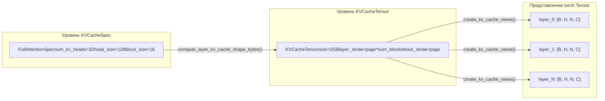

# Глава 2: Базовые абстракции и структуры данных: Request, Sequence и KV Cache

В предыдущей главе мы построили многоуровневую ментальную модель vLLM v1 и знаем, что запрос начинается с API Server, проходит через EngineCore и в конечном итоге достигает Worker для выполнения. Но как строка JSON из тела HTTP-запроса превращается в объект внутри движка, который можно планировать, отслеживать и прерывать? Именно на этот вопрос призван ответить класс Request.

# Система спецификаций KV Cache: от KVCacheSpec до реестра

Request решает вопрос «кто должен вычислять», а`KVCacheSpec`решает вопрос «где вычислять». В мире PagedAttention каждый слой модели требует точного описания KV cache: сколько у него голов, каков размер каждой головы, сколько токенов может хранить один блок, нужна ли квантизация. Эта информация закодирована в`KVCacheSpec`иерархии наследования.

## Интуитивная модель: KVCacheSpec — это «план этажа» видеопамяти

> **[Design Inference & Architectural Trade-offs]**
> Если представить видеопамять GPU как участок земли под застройку,`KVCacheSpec`— это планировка каждого здания (каждой cache group): она определяет, сколько комнат (head slot) на каждом этаже (в каждом блоке), какова площадь каждой комнаты (head_size), сколько человек может проживать (block_size токенов). А`KVCacheConfig`— это план застройки всего микрорайона: сколько всего зданий, сколько земли занимает каждое здание, какие здания используют один и тот же фундамент (block table).

Без этой системы спецификаций распределение KV cache могло бы опираться только на жёстко закодированные предположения и не смогло бы поддерживать разнообразные требования моделей — от стандартного MHA до MLA, от полного внимания до скользящего окна, от FP16 до FP8-квантования.

## Структура данных: дерево наследования KVCacheSpec и ключевые поля

`KVCacheSpec`является базовым классом всех спецификаций, это`@dataclass(frozen=True)` [FACT:vllm/v1/kv_cache_interface.py:150-152]. frozen означает, что объект спецификации после создания неизменяем — это гарантирует, что несколько компонентов (планировщик, Worker, KV Cache Manager) видят одну и ту же спецификацию и не возникает несогласованности из-за изменения где-либо.

Базовый класс определяет три абстрактных свойства, которые должны быть реализованы подклассами:`num_heads`、`tokens_per_state`、`state_content_size_bytes` [FACT:vllm/v1/kv_cache_interface.py:182-183]. Эти три свойства совместно определяют`page_size_bytes`— то есть количество байтов, занимаемых одним block.

`AttentionSpec`является наиболее важным подклассом, он вводит`num_kv_heads`、`head_size`、`dtype`、`kv_quant_mode`и другие поля[FACT:vllm/v1/kv_cache_interface.py:485-498]. Особенно изящно спроектировано поле`tokens_per_state`: значение по умолчанию — 1, что означает, что одно state соответствует одному token; но оно может быть задано целым числом больше 1 (например, разреженный MLA в DeepSeek-V4 сжимает несколько token в один state) или дробью меньше 1 (например, block pooling в Whisper использует`Fraction(1, block_pool_size)`для обозначения того, что один token соответствует нескольким state)[FACT:vllm/v1/kv_cache_interface.py:501-501]。

`FullAttentionSpec`На основе`AttentionSpec`добавляет`sliding_window`и`attention_chunk_size` [FACT:vllm/v1/kv_cache_interface.py:566-566]. Обратите внимание, что его docstring объясняет важное проектное решение: когда смешанный аллокатор отключён, слой скользящего окна внимания в KV Cache Manager обрабатывается как полное внимание (block выделяется для всех token), но во время выполнения модели по-прежнему вычисляется как скользящее окно[FACT:vllm/v1/kv_cache_interface.py:540-545]. Это**консервативное распределение, точное вычисление**— такая стратегия.

`MLAAttentionSpec`является ключевой спецификацией для моделей серии DeepSeek. Она устанавливает`head_size_v`по умолчанию в 0[FACT:vllm/v1/kv_cache_interface.py:670], поскольку MLA хранит только один latent vector и не имеет отдельного V.`alignment`Поле используется для выравнивания страниц[FACT:vllm/v1/kv_cache_interface.py:646-652], что критически важно для бэкендов вроде FlashMLA, требующих определённого выравнивания.

`MambaSpec`же вообще не идёт по пути attention. Он использует`shapes`и`dtypes`кортежи для описания формы тензора состояния[FACT:vllm/v1/kv_cache_interface.py:1027-1028]，`state_content_size_bytes`— это сумма размеров всех тензоров состояния[FACT:vllm/v1/kv_cache_interface.py:1048-1052]. У Mamba`max_memory_usage_bytes`в зависимости от`mamba_cache_mode`имеет три различных способа вычисления[FACT:vllm/v1/kv_cache_interface.py:1073-1084], что отражает сложность управления состоянием Mamba — оно не растёт линейно, как attention, а имеет фиксированный размер состояния.

## Сценарии в действии: преобразование спецификаций в раскладку видеопамяти

При запуске движка необходимо преобразовать`KVCacheSpec`всех слоёв в фактическую раскладку видеопамяти. Этот процесс выполняется`KVCacheTensor`и`create_kv_cache_views`.

`KVCacheTensor`описывает положение группы слоёв одинаковой формы в распределении KV cache[FACT:vllm/v1/kv_cache_interface.py:1406-1427]. Его ключевые поля —`layer_stride`и`block_stride`: первое — это байтовое расстояние между соседними слоями, второе — байтовое расстояние между соседними block. Docstring подробно объясняет два режима раскладки: layer-outermost даёт каждому слою непрерывную область, block-outermost позволяет каждому block содержать page всех слоёв[FACT:vllm/v1/kv_cache_interface.py:1416-1416]。

`create_kv_cache_views`Функция является ядром этого процесса[FACT:vllm/v1/kv_cache_interface.py:353-417]. Она принимает плоский int8 buffer и через`torch.as_strided`создаёт 4D-представление для каждого слоя`[B, H, N, C]`. Ключевой параметр —`strides`, который вычисляется из`compute_layout_strides`[FACT:vllm/v1/kv_cache_interface.py:314-350]. Эта функция в порядке размерностей, заданном`layout.stride_order`, вычисляет байтовый шаг каждой размерности в обратном порядке начиная с самой внутренней размерности.

Здесь есть заслуживающая внимания проверка границ: когда kernel_block_size меньше spec.block_size (то есть один manager block разбивается на несколько kernel block), код проверяет, равен ли block_stride dense_page_size[FACT:vllm/v1/kv_cache_interface.py:381-382]. Если не равен, это означает наличие padding в раскладке и невозможность равномерного разбиения; в этом случае выбрасывается ValueError с чёткой рекомендацией по исправлению.

## Проектные соображения: паттерн реестра и расширяемость

`KVCacheSpecRegistry`является ключевым элементом дизайна расширяемости vLLM[FACT:vllm/v1/kv_cache_spec_registry.py:39-40]. Он поддерживает два глобальных словаря:`_REGISTRY_KVCACHESPEC_LIST`хранит отображение классов spec на метаданные,`_REGISTRY_ROLE_MANAGERS`хранит отображение ролей на менеджеры[FACT:vllm/v1/kv_cache_spec_registry.py:35-36]。

`get_manager_class`Метод демонстрирует основную логику поиска в реестре: он идёт вверх по MRO (порядку разрешения методов) класса spec и находит первый зарегистрированный базовый класс[FACT:vllm/v1/kv_cache_spec_registry.py:129-130]. Это означает, что пользовательский`CustomFullAttentionSpec`, если он не зарегистрирован отдельно, автоматически наследует менеджер`FullAttentionSpec`. Такой**поиск на основе наследования**позволяет при добавлении нового типа spec регистрировать только различия.

`check_kv_cache_spec_registry`Метод при запуске проверяет, что spec всех слоёв зарегистрированы[FACT:vllm/v1/kv_cache_spec_registry.py:165-174]. Обратите внимание, что он использует`raise ValueError`, а не`assert`, и комментарий явно указывает, что это сделано для того, чтобы работало и в production-среде[FACT:vllm/v1/kv_cache_spec_registry.py:165-174]. Это важное инженерное решение: флаг Python`-O`удаляет assert, но ошибки конфигурации в production должны выявляться при запуске, а не приводить к падению во время выполнения.

> **[Design Inference & Architectural Trade-offs]**
> Дизайн ленивой инициализации реестра (`_ensure_registered`) решает проблему циклической зависимости:`kv_cache_interface.py`требуется ссылаться на реестр для проверки типа spec, а реестру нужно импортировать`single_type_kv_cache_manager`для получения класса менеджера, который, в свою очередь, зависит от`kv_cache_interface`. За счёт откладывания фактической регистрации до момента первого запроса этот цикл разрывается.

# Краткое содержание главы

В этой главе были проанализированы две ключевые структуры данных vLLM v1.`Request`— это носитель жизненного цикла запроса внутри движка; через двойной список токенов, асинхронный счётчик планирования и механизм block hash он поддерживает две ключевые функции: непрерывную пакетную обработку и кэширование префиксов.`KVCacheSpec`и его иерархия наследования определяют спецификацию размещения видеопамяти для KV cache, от стандартного`FullAttentionSpec`до`MLAAttentionSpec`、`MambaSpec`, охватывая потребности разнообразных архитектур моделей. Шаблон реестра позволяет добавлять новые типы spec без изменения ядра кода, обеспечивая расширяемость системы.

На данный момент мы уже увидели, как Request преобразуется из EngineCoreRequest и как он через счётчики состояний, block hash и другие механизмы поддерживает решения планировщика. Но как именно внешний запрос проходит через API Server, chat template и мультимодальную обработку, в конечном итоге превращаясь в EngineCoreRequest? В следующей главе мы перейдём на уровень входной точки запросов и полностью проследим этот путь от HTTP/CLI до EngineCore.
