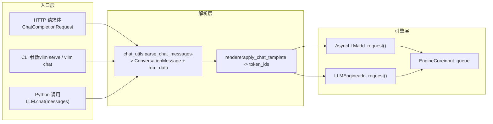

# Глава 3: Входная точка запросов: полный путь от HTTP/CLI до EngineCore

В предыдущей главе мы проанализировали две ключевые структуры данных внутри движка — Request и KVCacheSpec — и поняли, как логическая последовательность отделяется от физических блоков видеопамяти. Но как именно тело HTTP-запроса или строка Python проходит через API Server, chat template и мультимодальную обработку, в конечном итоге превращаясь в EngineCoreRequest? В этой главе мы полностью проследим этот путь и покажем, как три входных пути — синхронный CLI, асинхронный API и офлайн-класс LLM — сходятся к одному ядру движка.

# 3.1 Точка сходимости трёх входных путей: AsyncLLMEngine и LLMEngine

Прежде чем углубляться в разбор запросов, необходимо сначала ясно увидеть топологию трёх входных путей. vLLM предоставляет три способа использования:`vllm serve`запускаемый OpenAI-совместимый HTTP-сервис, инструмент командной строки`vllm`, а также прямое создание экземпляра класса`LLM`в Python для офлайн-инференса. На первый взгляд они независимы, но фактически используют одно и то же ядро движка.

Сначала рассмотрим механизм псевдонимов для асинхронного API-пути.

[FACT:vllm/engine/async_llm_engine.py:7-7]

Этот файл настолько короткий, что почти не похож на модуль — он делает только одно: направляет псевдоним`AsyncLLMEngine`на`vllm.v1.engine.async_llm.AsyncLLM`. Это типичный след архитектурной миграции. Во времена vLLM v0`AsyncLLMEngine`был огромным и сложным классом; после переписывания архитектуры v1 новый`AsyncLLM`взял на себя те же обязанности. Чтобы не ломать существующий пользовательский код, vLLM сохранил старый путь модуля как слой совместимости.

> **[Design Inference & Architectural Trade-offs]**
> Такой шаблон «старый путь-псевдоним указывает на новую реализацию» неоднократно встречается в vLLM (например, deprecation warning в`api_server.py`), что говорит о том, что проект при переходе от v0 к v1 выбрал постепенную стратегию: новый код использует новые пути, старый код не выдаёт ошибку, но получает предупреждение, давая пользователям достаточное окно для миграции.

Теперь рассмотрим входную точку офлайн-пути.

[FACT:vllm/entrypoints/llm.py:344-346]

`LLM.__init__`в конечном итоге вызывает`LLMEngine.from_engine_args`, передавая`UsageContext.LLM_CLASS`. Этот enum`UsageContext`является ключом к различению входных путей — он позволяет движку понимать, работает ли он в режиме офлайн-пакетной обработки или в режиме онлайн-обслуживания, и соответственно настраивать логирование, метрики и стратегию управления ресурсами.

[FACT:vllm/entrypoints/llm.py:357-359]

Обратите внимание на присваивание здесь`self.renderer = self.llm_engine.renderer`и`self.input_processor = self.llm_engine.input_processor`. Офлайн-класс`LLM`не реализует рендеринг chat template самостоятельно, а повторно использует внутренний`renderer`движка. Это означает, что логика разбора chat template в офлайн- и онлайн-путях — один и тот же код, различается только момент вызова.

Отношения сходимости трёх путей можно представить следующей диаграммой потоков данных.

Эта диаграмма раскрывает ключевой проектный принцип: независимо от того, приходит ли запрос из HTTP, CLI или Python,`chat_utils`является единственной входной точкой для мультимодальной обработки и обработки chat template. Он унифицирует разнородные форматы ввода в список`ConversationMessage`плюс`MultiModalDataDict`, а затем передаёт renderer для генерации последовательности токенов.

# 3.2 chat_utils: от разнородных сообщений к единой структуре диалога

`chat_utils.py`— самый сложный модуль во всём входном слое запросов: 2264 строки кода обрабатывают OpenAI-совместимый формат, пользовательские расширения, мультимодальные встраивания, вызовы инструментов и все остальные формы ввода. Его основную задачу можно сформулировать одной фразой: нормализовать произвольный список сообщений, переданный пользователем, в список`ConversationMessage`, понятный chat template, одновременно извлекая мультимодальные данные в отдельный`MultiModalDataDict`.

## Интуитивная модель: переводчик и сортировщик багажа

Представьте`chat_utils`как переводчика и одновременно сортировщика багажа в аэропорту. Пассажиры (пользователи) приезжают из разных стран (формат OpenAI, пользовательский формат, формат Harmony) и говорят на разных языках. Переводчик сначала переводит слова всех на единый рабочий язык (`ConversationMessage`), одновременно сортируя зарегистрированный багаж пассажира (изображения, аудио, видео) на отдельные конвейерные ленты (`MultiModalDataDict`), наклеивая метки (UUID), и наконец отправляя людей и багаж на один и тот же самолёт (движок).

Без этого слоя движку пришлось бы понимать детали каждого входного формата, логика извлечения мультимодальных данных была бы разбросана по всем точкам входа, и добавление любого нового формата требовало бы изменения ядра движка.

## Структура данных: двойное взаимодействие классов трекера и парсера

`chat_utils`Ядром  является взаимодействие двух групп классов:`BaseMultiModalItemTracker`и его подклассы отвечают за «отслеживание» мультимодальных элементов,`BaseMultiModalContentParser`и его подклассы отвечают за «разбор» содержимого.

Сначала рассмотрим структуру полей трекера.

[FACT:vllm/entrypoints/chat_utils.py:598-601]

`_items_by_modality`является`defaultdict[str, list[_T]]`, хранящим ожидающие обработки элементы, сгруппированные по модальности (image, audio, video и т. д.).`_modality_order`же специально для`vision_chunk`модальности записывает исходную модальность каждого chunk (image или video), поскольку унифицированная модель визуального chunk отображает обе на`vision_chunk`, но последующая обработка должна знать исходный тип.

[FACT:vllm/entrypoints/chat_utils.py:613-615]

`use_unified_vision_chunk_modality`является`cached_property`, читаемым из конфигурации HuggingFace флагом`use_unified_vision_chunk`. Используется`cached_property`вместо обычного атрибута, потому что эта проверка срабатывает при каждом вызове`add`, и кэширование позволяет избежать повторных затрат на`getattr`.

Метод`add`трекера является основной точкой входа.

[FACT:vllm/entrypoints/chat_utils.py:656-684]

`add`Метод  сначала вызывает`_validate_add`для валидации, затем в зависимости от того, используется ли унифицированная модальность визуального chunk, сохраняет элементы под разными ключами. Обратите внимание на`prompt_embeds`особую обработку: он напрямую добавляется к`_items_by_modality["prompt_embeds"]`и возвращает`None`, поскольку предвычисленные эмбеддинги не проходят через HF processor и не имеют строки-заполнителя.

`_validate_add`Логика валидации в  заслуживает подробного рассмотрения.

[FACT:vllm/entrypoints/chat_utils.py:686-721]

Здесь есть тонкая ветвь: когда`enable_mm_embeds=True`и лимит на каждый prompt для этой модальности равен 0, и исходная модальность заканчивается на`_embeds`, проверка количества пропускается. Это сделано для того, чтобы позволить эмбеддинг-входу обойти ограничение количества исходной модальности — эмбеддинги предвычислены и не занимают ресурсы обработки исходной модальности.

## Сценарий: как разбирается один chat-запрос с изображением

Предположим, пользователь отправляет chat-запрос, содержащий URL изображения и текст.`parse_chat_messages`является точкой входа синхронного пути.

[FACT:vllm/entrypoints/chat_utils.py:2161-2197]

`parse_chat_messages`создаёт`MultiModalItemTracker`, перебирает каждое сообщение, вызывая`_parse_chat_message_content`, в конце вызывает`_postprocess_messages`для обработки параметров вызова инструментов, затем через`mm_tracker.resolve_items()`материализует мультимодальные данные.

`_parse_chat_message_content`отвечает за разбор одного сообщения.

[FACT:vllm/entrypoints/chat_utils.py:2007-2029]

Сначала он нормализует content:`None`превращается в пустой список, строка — в единственную текстовую часть. Затем вызывается`_parse_chat_message_content_parts`, где параметр`wrap_dicts`определяется`content_format == "openai"`— это определяет, будет ли вывод структурированным списком словарей или объединённой строкой.

`_parse_chat_message_content_parts`перебирает каждую часть.

[FACT:vllm/entrypoints/chat_utils.py:1814-1853]

Каждая часть обрабатывается`_parse_chat_message_content_part`. Если`wrap_dicts=False`, в итоге текст и заполнители объединяются в одну строку; если`wrap_dicts=True`, возвращается структурированный список словарей.

`_parse_chat_message_content_part`является ядром диспетчеризации.

[FACT:vllm/entrypoints/chat_utils.py:1875-1884]

Для чисто текстовой части сначала выполняется проверка сохранения заполнителей, затем в зависимости от`wrap_dicts`определяется формат возврата. Для структурированной части вызывается`_parse_chat_message_content_mm_part`для извлечения типа и содержимого.

[FACT:vllm/entrypoints/chat_utils.py:1690-1723]

`_parse_chat_message_content_mm_part`через`MM_PARSER_MAP`находит соответствующую функцию разбора. Обратите внимание на условие`uuid is None`— если пользователь предоставил UUID, это означает, что медиаданные могут отсутствовать в теле запроса (загружены другим способом), и тогда выполняется ветвь прямого извлечения поля URL ниже.

[FACT:vllm/entrypoints/chat_utils.py:1731-1733]

Когда`part_type is None`или`uuid is not None`, код пытается напрямую извлечь поле URL из part. Этот «мягкий разбор» предназначен для совместимости с клиентами, не строго следующими формату OpenAI.

Возвращаясь к`_parse_chat_message_content_part`, части медиатипа направляются в соответствующий`mm_parser`метод.

[FACT:vllm/entrypoints/chat_utils.py:1923-1968]

Каждый медиатип вызывает соответствующий`parse_*`метод, который внутри вызывает`tracker.add`для добавления элемента в трекер и возвращает строку-заполнитель. В конце в зависимости от`interleave_strings`решается, возвращать заполнитель или`None`。

[FACT:vllm/entrypoints/chat_utils.py:1984-1999]

`prompt_embeds`обрабатывается особым образом: независимо от`interleave_strings`, всегда возвращается`PROMPT_EMBEDS_PLACEHOLDER_TOKEN`. Комментарий объясняет причину — prompt_embeds конкатенируются по смещению токенов, позиция важна, и если пойти по`missing_placeholders`логике предварительного заполнения, порядок будет нарушен.

## Различия асинхронного пути

Асинхронный путь использует`AsyncMultiModalItemTracker`и`AsyncMultiModalContentParser`. Основное различие в`resolve_items`。

[FACT:vllm/entrypoints/chat_utils.py:906-952]

Асинхронная версия использует`asyncio.gather`для параллельного ожидания всех модальных элементов. Комментарий явно указывает: каждый элемент трекинга уже является независимым awaitable, асинхронный коннектор выгружает блокирующую работу декодирования в пул потоков, поэтому последовательное ожидание одной модальности за другой лишь без необходимости увеличивает задержку.`return_exceptions=True`позволяет всем задачам завершиться или завершиться с ошибкой, а затем единообразно выбросить исключение, избегая отказа от всё ещё выполняющихся сетевых запросов при первой же ошибке.

## Размышления о дизайне: почему трекер и парсер разделены

> **[Design Inference & Architectural Trade-offs]**
> Разделение трекера и парсера — это дизайн, достойный размышления. Трекер отвечает за «управление состоянием» — запись количества элементов каждой модальности, проверку ограничений количества, поддержание исходного порядка модальностей vision_chunk. Парсер отвечает за «извлечение содержимого» — получение изображений по URL, декодирование эмбеддингов из base64, обработку преобразования аудиоформатов. Это разделение позволяет синхронному и асинхронному путям совместно использовать логику трекинга (`BaseMultiModalItemTracker`является абстрактным базовым классом), разветвляясь только на уровне парсера. Если объединить в один класс, различия между синхронным и асинхронным путями проникли бы в логику трекинга, что привело бы к дублированию кода и усложнению управления состоянием.

# 3.3 От сообщения к токену: передача между renderer и EngineCore

`chat_utils`производит`ConversationMessage`список и`MultiModalDataDict`ещё должны пройти рендеринг через chat template, чтобы превратиться в последовательность токенов. Этот шаг выполняется renderer, после чего запрос действительно попадает в движок.

## Сценарий: рендеринг chat template и отправка запроса

`parse_chat_messages`После возврата вызывающая сторона (например,`OpenAIServingChat`) передаст`conversation`и`mm_data`в renderer. Renderer применяет chat template, преобразует список`ConversationMessage`в текст, а затем токенизирует его в последовательность token ID. Мультимодальные заполнители (например,`<##IMAGE##>`) после токенизации заменяются на специфичные для модели токены-заполнители.

После завершения рендеринга запрос инкапсулируется в`EngineCoreRequest`и через`AsyncLLM.add_request()`или`LLMEngine.add_request()`отправляется во входную очередь EngineCore.

[FACT:vllm/entrypoints/llm.py:420-484]

Офлайн-метод`LLM.generate`демонстрирует эту цепочку: сначала он проверяет`runner_type`, получает параметры сэмплирования по умолчанию, затем вызывает`_run_completion`。`_run_completion`, внутри которого вызывается renderer для рендеринга prompt, а затем через`llm_engine`отправляется запрос.

[FACT:vllm/entrypoints/llm.py:615-708]

`LLM.chat`Метод`messages`демонстрирует путь chat: он принимает список`_run_chat`, вызывает`parse_chat_messages`, который внутри вызывает

## Проектное размышление: почему renderer находится внутри движка

> **[Design Inference & Architectural Trade-offs]**
> `LLM.__init__`В`self.renderer = self.llm_engine.renderer`строка`self.renderer.warmup(ChatParams(...))`раскрывает важное проектное решение: renderer принадлежит движку, а не слою входа. Это означает, что загрузка, кэширование и прогрев chat template (`LLM`) выполняются при инициализации движка, а слой входа является лишь вызывающей стороной. Преимущество такого подхода: офлайн-`AsyncLLM`и онлайн-

## используют одну и ту же реализацию renderer и кэш, что позволяет избежать повторной загрузки tokenizer и chat template. Кроме того, прогрев renderer может быть выполнен при запуске движка, что позволяет избежать задержки холодного старта первого запроса.

`_postprocess_messages`Обработка ошибок и подводные камни в production

[FACT:vllm/entrypoints/chat_utils.py:2118-2158]

Обработка параметров вызова инструментов в`tool_calls`— типичная ловушка production-среды.`arguments`Когда сообщение assistant содержит`arguments`, поле

может быть JSON-строкой, словарём или невалидным JSON. Код пытается распарсить JSON-строку, и если это не удаётся, записывает предупреждение и принудительно преобразует в пустой объект. Комментарий объясняет причину: некорректно отформатированный

[FACT:vllm/entrypoints/chat_utils.py:1856-1872]

присутствует в истории диалога, и если здесь запрос завершится ошибкой, то каждый последующий раунд также будет завершаться ошибкой, и диалог невозможно будет восстановить. Это продуманный дизайн отказоустойчивости — лучше позволить модели увидеть пустые параметры инструмента, чем заблокировать весь диалог.`enable_prompt_embeds`Ещё одна ловушка — защита от инъекции зарезервированного заполнителя.`PROMPT_EMBEDS_PLACEHOLDER_TOKEN`Когда`_reject_reserved_placeholder_in_text`включён,

[FACT:vllm/entrypoints/chat_utils.py:1889-1892]

регистрируется как неделимый специальный токен. Если пользовательский текст случайно содержит эту буквальную последовательность, tokenizer закодирует её в тот же token ID, и renderer ошибочно решит, что это точка склейки, что позволит вызывающей стороне через обычный текстовый контент перемещать или внедрять позицию склейки.`isinstance(part, str)`При разборе текстовой части

# отклоняет такой ввод, закрывая эту уязвимость.

Обратите внимание, что эта проверка вызывается как в ветке`LLM`, так и в ветке структурированного текста, что гарантирует прохождение всех текстовых путей через защиту.`chat_utils`Резюме главы`BaseMultiModalItemTracker`В этой главе прослежен первый участок цепочки попадания запроса в систему извне. Три входных пути — HTTP API, CLI и офлайн-класс`BaseMultiModalContentParser`— в конечном итоге сходятся к слою мультимодального разбора`parse_chat_messages`.`ConversationMessage`отвечает за управление состоянием,`MultiModalDataDict`отвечает за извлечение содержимого; их разделение позволяет синхронному и асинхронному путям совместно использовать логику трассировки.`EngineCoreRequest`нормализует разнородные сообщения в список

# и

, а затем передаёт их внутреннему renderer движка для выполнения рендеринга chat template и токенизации. В итоге запрос инкапсулируется в`_parse_chat_message_content_mm_part`и отправляется во входную очередь EngineCore.`uuid is None`Вопросы для размышления и самопроверки по главе`if isinstance(part_type, str) and part_type in MM_PARSER_MAP:`Q1: В

**, если убрать условие**：`uuid is None`(то есть заменить на`MM_PARSER_MAP[part_type](part)`), в каких сценариях это приведёт к проблемам?`image_url`Эталонный разбор`None`Условие`parse_image(None, uuid)`существует для обработки сценария «пользователь предоставил UUID, но медиаданные отсутствуют в теле запроса». Когда пользователь предоставляет UUID, медиаданные могли быть загружены другим способом (например, предварительно загружены в медиакэш), и тогда part в теле запроса может содержать только UUID без фактического URL или данных. Если убрать это условие, код попытается выполнить разбор через`_connector.fetch_image(None)`, но в part может не быть соответствующего поля данных (например,`uuid is not None`пуст), что приведёт к разбору[FACT:vllm/entrypoints/chat_utils.py:1713-1723]содержимого. Что ещё серьёзнее, последующий[FACT:vllm/entrypoints/chat_utils.py:1731-1733]。

Q2: `AsyncMultiModalItemTracker.resolve_items`вызовет`asyncio.gather(..., return_exceptions=True)`, что может вызвать ненужные сетевые запросы или исключения.`return_exceptions=False`Ветка`False`идёт по пути прямого извлечения полей и корректно обрабатывает случай «есть UUID, нет данных». См.

**и**：`return_exceptions=False`Используется`asyncio.gather`вместо стандартного`return_exceptions=True`Заставляем все задачи завершиться или провалиться, а затем выполняем единую проверку, чтобы гарантировать, что ни одна задача не осталась брошенной. Комментарий явно поясняет это: «Gathering with return_exceptions=True lets every task finish (or itself fail) before we raise, instead of abandoning still-in-flight fetches (real network/thread-pool work) the moment the first one fails.» См.[FACT:vllm/entrypoints/chat_utils.py:924-931]。

Q3: `_postprocess_messages`, когда`arguments`является недействительным JSON, код выбирает принудительное преобразование в пустой объект вместо выброса исключения. Если изменить на выброс исключения, в каких производственных сценариях это приведёт к невосстановимому состоянию диалога?

**Справочный анализ**：`arguments`Поле существует в истории диалога (в сообщении assistant`tool_calls`). Если в каком-либо раунде диалога модель сгенерировала некорректно отформатированный`arguments`, эта ошибка сохранится в истории диалога. Если`_postprocess_messages`при разборе истории выбрасывает исключение, то каждый последующий раунд запроса будет завершаться неудачей из-за этой ошибки в истории — даже если входные данные текущего раунда полностью корректны. Пользователь не сможет продолжить этот диалог и будет вынужден abandon всю сессию и начать заново. Принудительное преобразование в пустой объект позволяет диалогу продолжиться, и модель, увидев пустые аргументы инструмента, сгенерирует корректный вызов заново. Комментарий объясняет это: «A malformed arguments string lives in conversation history, so failing the request here would fail every subsequent turn too and leave the conversation unrecoverable.» См.[FACT:vllm/entrypoints/chat_utils.py:2124-2139]。

Следующая глава перейдёт к планировщику, чтобы посмотреть, как EngineCore организует эти запросы с помощью непрерывной батчевой обработки и стратегии с учётом видеопамяти.

На этом запрос завершил нормализованное преобразование из внешнего ввода в EngineCoreRequest и достиг входа в ядро движка. Но после входа запрос не выполняется немедленно — движку нужно решить, какие запросы обрабатывать на каждом шаге и как распределять ограниченные ресурсы видеопамяти. Следующая глава углубится в цикл планирования EngineCore, проанализирует, как Scheduler балансирует пропускную способность и задержку в непрерывной батчевой обработке, а также как chunked prefill, prefix caching и распределение KV block работают совместно.
