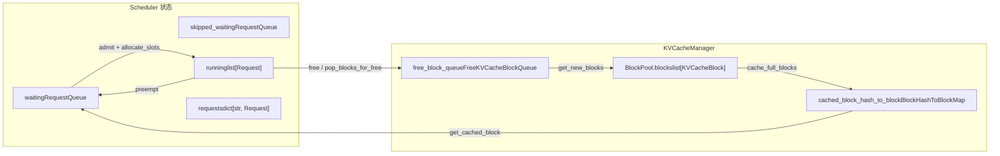
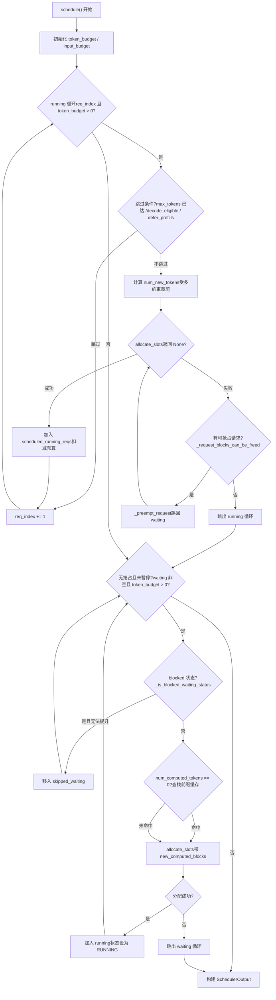

# Глава 4: Планировщик: непрерывная батчевая обработка и организация запросов с учётом видеопамяти

После входа запроса во входную очередь EngineCore он не выполняется немедленно. Какие запросы обрабатывать на каждом шаге, сколько token-бюджета выделять каждому запросу, кого в первую очередь принести в жертву при нехватке видеопамяти — все эти решения сосредоточены в методе`Scheduler.schedule()`. Эта глава начинается со структур данных планировщика и отслеживает, как один вызов`schedule()`организует очередь waiting, список running и пул KV cache в исполняемый батч.

# 4.1 Структуры данных планировщика: три очереди и один пул видеопамяти

Ключевой вопрос, на который должен ответить планировщик:**При ограниченном token-бюджете и бюджете KV block, какие запросы должны продвинуться на сколько token на этом шаге?**Чтобы понять это, сначала нужно увидеть, какими состояниями он располагает.

Планировщик поддерживает три типа контейнеров запросов.`self.requests`— это глобальный словарь,`req_id -> Request`, единственный источник истины для всех активных запросов[FACT:vllm/v1/core/sched/scheduler.py:208-209]。`self.waiting`и`self.skipped_waiting`— это две очереди с приоритетами: первая содержит запросы, нормально ожидающие планирования, вторая — запросы, временно не подлежащие планированию из-за асинхронных зависимостей или ограничений (например, ожидание удалённого KV, ожидание компиляции грамматики структурированного вывода)[FACT:vllm/v1/core/sched/scheduler.py:208-209]。`self.running`— это обычный список, содержащий запросы, уже перешедшие в рабочее состояние и удерживающие KV block[FACT:vllm/v1/core/sched/scheduler.py:208-209]。

Здесь есть легко упускаемый из виду дизайн:`max_num_running_reqs`и`max_num_active_reqs`— это два разных верхних предела. Первый происходит из`max_num_seqs`, определяет количество слотов model runner; второй происходит из`max_num_active_seqs`, ограничивает только число запросов, которые могут войти в RUNNING, по умолчанию равен первому[FACT:vllm/v1/core/sched/scheduler.py:123-131]. Это разделение позволяет снизить фактический размер батча параллельного декодирования без уменьшения ёмкости захвата CUDA graph.

Со стороны видеопамяти всем управляет`KVCacheManager`, внутри него содержится`BlockPool`。`BlockPool`Ядро`self.blocks`— это`KVCacheBlock`(список всех`free_block_queue`) и[FACT:vllm/v1/core/block_pool.py:171-177](двусвязный список свободных блоков, упорядоченный по порядку вытеснения)`null_block`. Обратите внимание на наличие`is_null=True`: это первый блок, извлекаемый из головы очереди свободных,[FACT:vllm/v1/core/block_pool.py:183-187], счётчик ссылок не участвует в обычном обслуживании и используется специально как заполнитель

. Когда для какой-либо позиции token запроса не требуется реальный KV block (например, позиция, пропущенная скользящим окном), в block table подставляется этот null block.`BlockHashToBlockMap`Структура индекса префиксного кэша —`BlockHashWithGroupId`, она отображает`KVCacheBlock`в`{block_id: KVCacheBlock}`или в словарь[FACT:vllm/v1/core/block_pool.py:56-59]. Почему используется объединённый тип? Комментарий даёт ответ: большинство хешей соответствуют только одному блоку, использование словаря создаёт ненужные накладные расходы на сборку мусора; повышение до словаря происходит только тогда, когда один и тот же хеш совместно используется несколькими блоками[FACT:vllm/v1/core/block_pool.py:56-59]. Это типичный компромисс между сложностью типов и накладными расходами во время выполнения.

`KVCacheBlocks`— это объект интерфейса между планировщиком и менеджером KV cache, который скрывает внутренние структуры данных. Его`blocks`поле — это`tuple[Sequence[KVCacheBlock], ...]`, внешняя размерность — KV cache group, внутренняя — последовательность блоков[FACT:vllm/v1/core/kv_cache_manager.py:41-54]. Комментарий явно объясняет, почему блоки не используются в качестве внешней размерности: это предполагало бы, что все группы имеют одинаковое количество блоков, тогда как в будущем разным группам может быть настроен разный размер блока[FACT:vllm/v1/core/kv_cache_manager.py:43-48]。



Этот рисунок фиксирует поток данных между планировщиком и пулом видеопамяти: запросы из очереди waiting через`allocate_slots`переходят в running, вытесненные запросы из running возвращаются в waiting, освобождённые блоки возвращаются в очередь свободных, а хеш-таблица префиксного кеша является точкой входа для попадания запросов из waiting в кеш.

# 4.2 Основной поток schedule(): приоритет running, дополнение waiting, вытеснение как крайняя мера

`schedule()`— это основной метод всего планировщика, он возвращает`SchedulerOutput`, описывающий, что нужно выполнить на этом шаге. Комментарий в начале метода определяет философию дизайна: в планировщике нет разделения на «фазу декодирования» и «фазу предзаполнения», у каждого запроса есть только`num_computed_tokens`и`num_tokens_with_spec`, и задача планировщика — позволить первому догнать второе[FACT:vllm/v1/core/sched/scheduler.py:559-568]. Этот унифицированный взгляд является основой для сосуществования chunked prefill, prefix caching и спекулятивного декодирования.

## 4.2.1 Инициализация бюджета и вычисление порогов

Перед входом в основной цикл планировщик сначала устанавливает два бюджета:`token_budget`инициализируется как`max_num_scheduled_tokens`，`input_budget`инициализируется как`max_num_batched_tokens` [FACT:vllm/v1/core/sched/scheduler.py:577-580]. Обычно они равны, но когда модель может добавлять токены в пакете (например, при спекулятивном декодировании),`max_num_scheduled_tokens`будет меньше`max_num_batched_tokens`, и разница — это пространство, оставленное для draft token.

`long_prefill_token_threshold`Обработка[FACT:vllm/v1/core/sched/scheduler.py:606-616]заслуживает отдельного рассмотрения. Её назначение — предотвратить голодание других запросов из-за одного длинного prefill, но если в данный момент есть только один запрос, то никто не будет голодать, поэтому порог устанавливается в ноль`adaptive_long_prefill_threshold`. Когда`input_budget // num_eligible_reqs`включён, порог также поднимается до[FACT:vllm/v1/core/sched/scheduler.py:617-622]。

## , чтобы гарантировать, что бюджет отдельного запроса не будет снижен ниже справедливой доли

4.2.2 Цикл планирования запросов running`self.running`Основной цикл начинает обход с головы`req_index`,[FACT:vllm/v1/core/sched/scheduler.py:624-627]— это курсор

- . Для каждого запроса сначала выполняется ряд проверок пропуска:`max_tokens`При асинхронном планировании, если плейсхолдер вывода запроса показывает, что он уже достиг[FACT:vllm/v1/core/sched/scheduler.py:631-645]。
- , пропустить, чтобы избежать лишнего шага`next_decode_eligible_step`В сценарии V2 + PP + асинхронный, если текущий шаг ещё не достиг[FACT:vllm/v1/core/sched/scheduler.py:647-651]。
- , пропустить, чтобы соответствовать ритму широковещательной рассылки токенов выборки на стороне worker[FACT:vllm/v1/core/sched/scheduler.py:653-657]。

При включённой балансировке DP prefill, prefill chunk на шагах, не выровненных по ритму, откладывается

```
num_new_tokens = request.num_tokens_with_spec
               + request.num_output_placeholders
               - request.num_computed_tokens
```

Копировать`long_prefill_token_threshold`、`token_budget`、`input_budget - draft_slots`Затем последовательно ограничивается`max_model_len`и[FACT:vllm/v1/core/sched/scheduler.py:670-688]. Если запрос содержит вход энкодера, он также корректируется через`_try_schedule_encoder_inputs`Далее — самый критичный шаг: выделение KV block.[FACT:vllm/v1/core/sched/scheduler.py:700-712]。

обёрнут в цикл`allocate_slots`. Если возвращается`while True`, это означает нехватку видеопамяти, и планировщик начинает вытеснение: по стратегии выбирается жертва (стратегия PRIORITY выбирает с наименьшим приоритетом, стратегия FCFS выбирает из конца списка running)[FACT:vllm/v1/core/sched/scheduler.py:742-747], вызывается`None`для возврата её в очередь waiting, затем выделение повторяется[FACT:vllm/v1/core/sched/scheduler.py:761-767]. Если жертвой оказывается сам текущий запрос, это означает, что объектов для вытеснения больше нет, цикл прерывается, и текущий запрос также не может быть запланирован`_preempt_request`В логике вытеснения есть тонкая деталь: при стратегии PRIORITY, если вытесняемый запрос уже находится в[FACT:vllm/v1/core/sched/scheduler.py:801-806](то есть на этом шаге для него уже были выделены ресурсы), необходимо вернуть его бюджет токенов, блоки, спекулятивные токены и бюджет энкодера[FACT:vllm/v1/core/sched/scheduler.py:807-813]。

. Это обеспечивает согласованность учёта бюджета.`scheduled_running_reqs`После успешного выделения запрос добавляется в[FACT:vllm/v1/core/sched/scheduler.py:779-797], записываются блоки и количество токенов, вычитается бюджет

. Токены, связанные со спекулятивным декодированием, здесь обрезаются и записываются`scheduled_running_reqs`4.2.3 Допуск запросов waiting[FACT:vllm/v1/core/sched/scheduler.py:815-823]После завершения цикла running, если на этом шаге не произошло вытеснения и планировщик не приостановлен, начинается обработка очереди waiting[FACT:vllm/v1/core/sched/scheduler.py:825-841]。

## . Перед допуском проверяются два верхних предела:

и[FACT:vllm/v1/core/sched/scheduler.py:868-872]Планирование запросов waiting отличается от running наличием шага поиска в префиксном кеше. Когда`max_num_active_reqs`, вызывается`input_budget` [FACT:vllm/v1/core/sched/scheduler.py:873-879]。

для поиска попадания в локальный кеш`request.num_computed_tokens == 0`. Если настроен KV connector, также выполняется запрос попадания в удалённый кеш`_get_local_prefix_cache_hit`Здесь есть тонкая логика обработки конфликта между локальным и удалённым попаданием. Локальное попадание может быть не выровнено по блокам ([FACT:vllm/v1/core/sched/scheduler.py:932-939]), и если удалённое попадание строго превышает локальное полное попадание, хвост локального подблока отбрасывается, чтобы удалённая загрузка перекрыла его, избегая копирования при записи[FACT:vllm/v1/core/sched/scheduler.py:942-954]。

. В противном случае локальный хвост сохраняется, внешняя загрузка не выполняется`partial_tail`После успешного допуска запрос извлекается из очереди waiting, состояние устанавливается в RUNNING, он добавляется в список running[FACT:vllm/v1/core/sched/scheduler.py:977-988]. Если после этого шага он всё ещё находится в prefill ([FACT:vllm/v1/core/sched/scheduler.py:989-995]。

), он добавляется в множество[FACT:vllm/v1/core/sched/scheduler.py:1263-1319]Копировать`num_computed_tokens + num_new_tokens < request.num_tokens`Этот граф потока управления охватывает`_inflight_prefills`два основных цикла и ветвь вытеснения. Обратите внимание на путь повторной попытки вытеснения после неудачи[FACT:vllm/v1/core/sched/scheduler.py:1326-1328]。



这张控制流图覆盖了 `schedule()` 的两大循环和抢占分支。注意 running 循环中 `allocate_slots` 失败后的抢占重试路径，以及 waiting 循环中 blocked 状态请求被移入 `skipped_waiting`обход.

# 4.3 Ядро учёта видеопамяти: allocate_slots и вытеснение

`allocate_slots`— это шлюз между планировщиком и видеопамятью. Сам список его параметров представляет собой учётную книгу видеопамяти:`num_new_tokens`— количество токенов, которые нужно вычислить заново,`num_new_computed_tokens`— количество токенов, попавших в кэш префиксов,`num_external_computed_tokens`— количество внешних попаданий, предоставленных connector,`num_lookahead_tokens`— зарезервированные слоты для спекулятивного декодирования[FACT:vllm/v1/core/kv_cache_manager.py:371-383]。

Комментарий в начале метода с помощью ASCII-схемы точно описывает раскладку блоков[FACT:vllm/v1/core/kv_cache_manager.py:417-438]：

```
|  |  |   |   |  |
                                          |        |
                        |                       |
```

`comp`— уже вычисленные токены,`new_comp`— попадания в кэш префиксов,`ext_comp`— внешние попадания,`new`— вычисляемые на этом шаге,`lookahead`— спекулятивный резерв. Выделение делится на три этапа: сначала освобождаются ненужные блоки и проверяется, достаточно ли свободных блоков, затем обрабатываются токены префикса, и наконец выделяются блоки для новых вычисляемых токенов[FACT:vllm/v1/core/kv_cache_manager.py:458-461]。

## 4.3.1 Порог и контроль допуска

`allocate_slots`содержит два шлюза допуска. Первый —`full_sequence_must_fit`: когда он включён, сначала проверяется, поместится ли вся последовательность запроса (а не только первый chunk), и если не помещается, сразу возвращается`None` [FACT:vllm/v1/core/kv_cache_manager.py:515-531]. Это предотвращает избыточный допуск при chunked prefill, который приводит к колебаниям KV cache.

Второй — порог.`watermark_blocks`действует только тогда, когда состояние запроса — WAITING или PREEMPTED и уже есть запланированные запросы[FACT:vllm/v1/core/kv_cache_manager.py:506-513]. Он требует после выделения сохранять как минимум определённую долю свободных блоков, чтобы избежать частого вытеснения и преемпции.`reserved_blocks`же используется в сценариях асинхронной загрузки KV, чтобы гарантировать, что зарезервированные блоки для prefill в полёте не будут съедены новыми запросами[FACT:vllm/v1/core/kv_cache_manager.py:564-570]。

## 4.3.2 Цена преемпции и восстановление

> **[Design Inference & Architectural Trade-offs]**
> `_preempt_request`делает вещь, которая выглядит грубой, но необходимой: сбрасывает`num_computed_tokens`запроса в 0[FACT:vllm/v1/core/sched/scheduler.py:1560-1561]. Это означает, что вытесненный запрос при следующем планировании должен заново выполнить prefill с начала. Почему так спроектировано? Потому что KV block в vLLM является приватным для запроса, при преемпции необходимо освободить все блоки, а после освобождения нельзя гарантировать, что при повторном выделении будут получены те же блоки, поэтому приходится вычислять с начала. Наличие кэша префиксов частично компенсирует эту цену: если префикс вытесненного запроса уже закэширован, при повторном планировании произойдёт попадание в кэш и не придётся реально пересчитывать.

Преемпция также решает проблему «устаревшего вывода» при асинхронном планировании.`num_stale_output_tokens`устанавливается в`num_in_flight_tokens`, помечая все выводы в полёте как устаревшие[FACT:vllm/v1/core/sched/scheduler.py:1571-1574]. Эти токены всё равно будут доставлены (их отбрасывание нарушило бы коэффициент принятия спекулятивного декодирования), но не будут изменять сброшенные счётчики.`drop_stale_output`Флаг определяет, отбрасывать или доставлять[FACT:vllm/v1/core/sched/scheduler.py:1539-1547]。

## 4.3.3 Отложенное освобождение: риск read-after-write у асинхронных connector'ов

Когда используется KV connector и имеется несколько批次 в полёте,`defer_block_free`устанавливается в`True` [FACT:vllm/v1/core/sched/scheduler.py:175-181]. Причина: один шаг может всё ещё записывать KV-блоки уже освобождённого запроса, а consumer connector может через загрузку, не упорядоченную относительно этой записи, повторно выделить и заполнить эти блоки.

Отложенное освобождение реализуется через`deferred_frees`двустороннюю очередь, каждый элемент которой —`(fence_seq, blocks)` [FACT:vllm/v1/core/sched/scheduler.py:388-390]。`_free_request_blocks`проверяет`_request_blocks_can_be_freed`, и если последний шаг планирования запроса ещё не обработан, помещает блоки в очередь отложенного освобождения[FACT:vllm/v1/core/sched/scheduler.py:2679-2688]。`_drain_deferred_frees`продвигается в`update_from_output`и вызывается после`processed_step_seq`, освобождая блоки, для которых fence уже выполнен[FACT:vllm/v1/core/sched/scheduler.py:2701-2706]。

# 4.4 Определение попадания в кэш префиксов и жизненный цикл блоков

Точка входа для поиска в кэше префиксов —`KVCacheManager.get_computed_blocks`. Сначала проверяется, включён ли кэш и не помечен ли запрос как пропускающий чтение[FACT:vllm/v1/core/kv_cache_manager.py:286-287]. Затем вызывается`coordinator.find_longest_cache_hit`, передавая`request.block_hashes`и`max_cache_hit_length = request.num_tokens - 1` [FACT:vllm/v1/core/kv_cache_manager.py:295-300]。

Почему`num_tokens - 1`? Комментарий объясняет: когда все токены попадают в кэш, необходимо пересчитать последний токен, чтобы получить logits[FACT:vllm/v1/core/kv_cache_manager.py:289-294]. Это легко упускаемая граница: даже при полном попадании префикса нужно вычислить хотя бы один токен.

Жизненный цикл блока управляется`BlockPool`.`get_new_blocks`извлекает блок из головы очереди свободных, и если кэш включён, сначала вызывает`_maybe_evict_cached_block`для очистки метаданных хэша, затем увеличивает счётчик ссылок[FACT:vllm/v1/core/block_pool.py:683-702]。`free_blocks`же в зависимости от наличия хэша у блока решает, вернуть его в голову или хвост очереди: блоки без хэша переиспользуются LIFO (лучшая локальность GPU), блоки с хэшем — FIFO (поведение вытеснения LRU)[FACT:vllm/v1/core/block_pool.py:785-805]。

`cache_full_blocks`— это момент, когда блок записывается в хэш-таблицу кэша префиксов. Он обходит новые заполненные блоки, пропускает null-блоки и замаскированные блоки, вычисляет хэш для каждого блока и вставляет в`cached_block_hash_to_block` [FACT:vllm/v1/core/block_pool.py:272-300]. Если у блока уже есть хэш (сценарий повышения частичного блока до полного), сначала удаляется старый хэш, затем вставляется новый[FACT:vllm/v1/core/block_pool.py:285-293]。

`touch`Метод обрабатывает счётчик ссылок при попадании в кэш: если блок находится в очереди свободных (`ref_cnt == 0`), сначала удаляет его из очереди, затем увеличивает счётчик ссылок[FACT:vllm/v1/core/block_pool.py:754-770]. Это гарантирует, что блок, в который произошло попадание, не будет вытеснен.

# Размышления о дизайне

> **[Design Inference & Architectural Trade-offs]**
> **Почему преемпция выбирает «пересчёт с начала», а не «частичное сохранение»?**Частичное сохранение требует записи физического расположения блоков каждого запроса на момент преемпции и попытки восстановить отображение при повторном планировании. Но пул блоков является глобально общим, и другие запросы могли уже занять эти блоки. Сложность и накладные расходы памяти на поддержание такого отображения превышают цену пересчёта, особенно когда кэш префиксов может покрыть большую часть префикса.

> **[Design Inference & Architectural Trade-offs]**
> **Почему порог по умолчанию равен 0?**Порог — это страховка от частой преемпции, но она достигается ценой снижения утилизации видеопамяти. Отключение по умолчанию означает, что vLLM в первую очередь стремится к пропускной способности, а не к стабильности, и пользователю нужно включать его самостоятельно в зависимости от характеристик нагрузки.

> **[Design Inference & Architectural Trade-offs]**
> **`skipped_waiting`Смысл существования очереди.**Без этой очереди заблокированные запросы постоянно занимали бы голову очереди waiting, из-за чего последующие запросы не могли бы быть запланированы (при стратегии FCFS). Выделив их отдельно, планировщик может пропускать заблокированные запросы и продолжать обработку последующих, сохраняя при этом состояние заблокированных запросов для последующего повышения.

# Резюме главы

Ядро планировщика — это`schedule()`два цикла в методе: цикл running в первую очередь обеспечивает продвижение уже запущенных запросов, цикл waiting при наличии бюджета допускает новые запросы. При нехватке видеопамяти пространство освобождается путём вытеснения запроса с наименьшим приоритетом из списка running; у вытесненного запроса`num_computed_tokens`сбрасывается в 0, но префиксный кэш компенсирует часть затрат на пересчёт.`allocate_slots`является шлюзом видеопамяти, посредством`full_sequence_must_fit`, уровня воды и`reserved_blocks`трёхуровневого контроля допуска предотвращает избыточное выделение. Префиксный кэш обеспечивает совместное использование между запросами через индекс по хэшу блоков, а определение попадания ограничено`num_tokens - 1`сверху, чтобы гарантировать вычисление хотя бы одного token для получения logits.

# Вопросы для размышления и самопроверки по главе

Q1: В`schedule()`цикле running, если`allocate_slots`возвращает`None`и`_request_blocks_can_be_freed`для жертвы возвращает`False`, код`break`выходит из цикла. Если убрать эту проверку и напрямую вызвать`_preempt_request`, в каком сценарии это приведёт к несогласованности состояния?

**Справочный разбор**：`_request_blocks_can_be_freed`Проверка`request.last_sched_seq <= self.processed_step_seq` [FACT:vllm/v1/core/sched/scheduler.py:2672-2677]. Когда`defer_block_free`включён, если последний шаг планирования жертвы ещё не обработан, её блоки могут всё ещё записываться GPU-шагами в полёте. Прямое вытеснение вызовет`_free_request_blocks`, а последний при`_request_blocks_can_be_freed`равном`False`поместит блоки в`deferred_frees`вместо немедленного освобождения[FACT:vllm/v1/core/sched/scheduler.py:2679-2688]. Но семантика вытеснения — «немедленно освободить блоки для текущего запроса», отложенное освобождение не может удовлетворить эту потребность,`allocate_slots`снова потерпит неудачу, образуя бесконечный цикл. Что ещё серьёзнее, если блоки жертвы после отложенного освобождения будут выделены текущему запросу, а GPU всё ещё записывает в блоки жертвы, возникнет гонка данных.

Q2: `get_computed_blocks`В`max_cache_hit_length = request.num_tokens - 1`. Если изменить на`request.num_tokens`, в каких случаях это приведёт к ошибке вывода?

**Справочный разбор**: когда все token запроса попадают в кэш,`num_computed_tokens`будет равно`num_tokens`. В этот момент планировщик считает, что не нужно вычислять ни одного нового token, но для сэмплирования logits требуется скрытое состояние последней позиции, а скрытое состояние получается из прямого прохода. Если ни один token не вычислен, logits для сэмплирования отсутствуют, запрос зависнет или выдаст ошибочный результат. Комментарий явно указывает на это[FACT:vllm/v1/core/kv_cache_manager.py:289-294]. Кроме того,`allocate_slots`требует, чтобы`num_computed_tokens`было выровнено по размеру блока; пересчёт последнего token может вызвать пересчёт всего блока — это известное ограничение текущей реализации.

Q3: `_preempt_request`сбрасывает`num_computed_tokens`в 0, но сохраняет`request.num_tokens`(prompt + сгенерированные token). Если при повторном планировании вытесненного запроса префиксный кэш не попал, сколько token нужно пересчитать? А если попал, сколько удастся сэкономить?

**Справочный разбор**：`num_computed_tokens = 0`означает, что при повторном планировании вычисление начинается с первого token[FACT:vllm/v1/core/sched/scheduler.py:1561]。`request.num_tokens`остаётся неизменным, включая исходный prompt и уже сгенерированные выходные token. Если префиксный кэш не попал, нужно пересчитать prefill для всех`num_tokens`token. Если попал,`get_computed_blocks`вернёт попавшие блоки,`num_computed_tokens`начиная с позиции попадания[FACT:vllm/v1/core/kv_cache_manager.py:296-300]. Заметьте, что выходные token вытесненного запроса также находятся в`num_tokens`, их префиксные хэши были закэшированы при генерации (если это включено), поэтому при повторном планировании префиксы этих выходных token тоже могут попасть. Но`max_cache_hit_length = num_tokens - 1`означает, что последний token всегда пересчитывается.

Выход планировщика`SchedulerOutput`явно определяет содержание выполнения этого шага: ID блоков новых запросов, количество token кэшированных запросов, спекулятивные token, входы энкодера и т. д. В следующей главе будет прослежено, как этот выход потребляется ModelRunner, от`SchedulerOutput`вплоть до прямого прохода на GPU.
