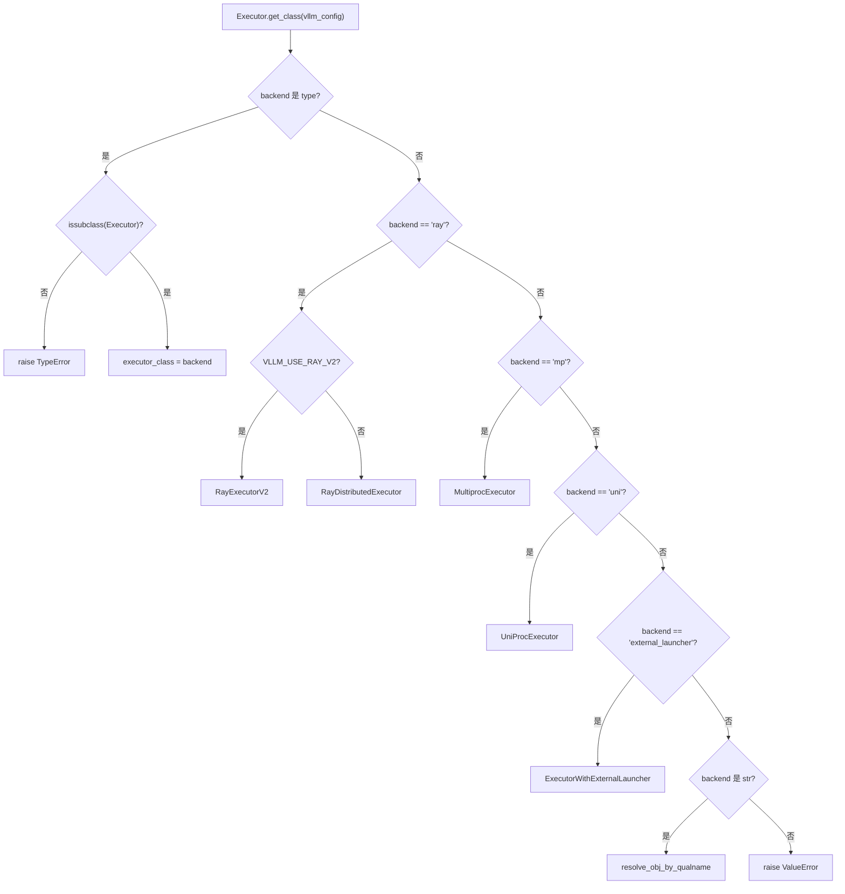
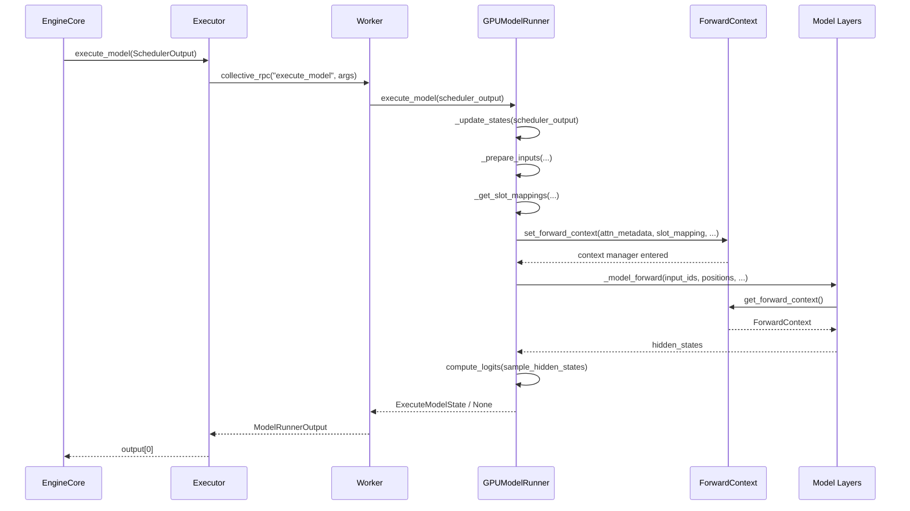

# Глава 5: Основной ствол выполнения модели: от SchedulerOutput до прямого прохода на GPU

В предыдущей главе мы видели, как Scheduler на каждом шаге цикла планирования решает, какие запросы попадут в очередь running, какие будут вытеснены, какие будут ждать из-за нехватки видеопамяти, и в итоге формирует SchedulerOutput — он описывает, что нужно вычислить на этом шаге: какие запросы, сколько token для каждого, какие KV block использовать. Но этот список — лишь логическое намерение, а GPU нужны физические тензоры. В этой главе прослеживается, как SchedulerOutput распределяется Executor'ом по Worker'ам, затем GPUModelRunner переводит его в исполняемые на GPU входы, такие как input_ids, positions, slot_mapping и block table, и в конечном счёте через forward_context описание батча, разделяемое между слоями, внедряется в каждый слой модели, завершая переход от решения планировщика к прямому проходу.

# 5.1 Executor: доставка результата планирования на каждую карту

## Интуитивная модель

`Executor`— это «глашатай» между EngineCore и GPU Worker. Без него EngineCore пришлось бы самому знать, сколько карт в кластере, в каком процессе находится каждая карта, как`SchedulerOutput`Сериализация прошлого — логика планирования переплетается с распределённой топологией.`Executor`Выделим эту ответственность: EngineCore только вызывает`execute_model(scheduler_output)`, а всё остальное — «кому отправить, как отправить, сколько результатов получить» — решает Executor.

## Иерархия классов и поля

`Executor`— это абстрактный базовый класс, поля уровня класса которого напрямую кодируют возможности бэкенда[FACT:vllm/v1/executor/abstract.py:48-49]：

```python
uses_ray: bool = False  # whether the executor uses Ray for orchestration.
supports_pp: bool = False  # whether the executor supports PP
```

Эти два флага не декоративны — код верхнего уровня читает их, чтобы решить, включать ли определённые пути оптимизации.`__init__`В`sleeping_tags`、`kv_output_aggregator`、`ec_output_aggregator`инициализируются[FACT:vllm/v1/executor/abstract.py:119-120]три поля состояния

## , соответственно для отслеживания метки режима сна, агрегации вывода KV-коннектора и агрегации вывода коннектора энкодера.`get_class`Выбор бэкенда:

`get_class`маршрутизация ветвлений`distributed_executor_backend`— это статическая фабрика, которая по[FACT:vllm/v1/executor/abstract.py:51-96]конфигурации возвращает конкретный класс Executor

- . Её структура ветвлений заслуживает внимательного рассмотрения:`type`Если сама конфигурация является`Executor`, проверить, является ли она подклассом[FACT:vllm/v1/executor/abstract.py:52-61]；
- `"ray"`, и затем напрямую использовать`VLLM_USE_RAY_V2_EXECUTOR_BACKEND`В ветке`RayExecutorV2`есть ещё вторичное ветвление:`RayDistributedExecutor` [FACT:vllm/v1/executor/abstract.py:64-72]；
- `"mp"`Если`MultiprocExecutor`，`"uni"`истинно, использовать`UniProcExecutor` [FACT:vllm/v1/executor/abstract.py:73-80]；
- , иначе использовать`resolve_obj_by_qualname`отображается на[FACT:vllm/v1/executor/abstract.py:85-90]。



## Пользовательский бэкенд в виде строки динамически разрешается через`execute_model`Копировать

Пошагово: поток вызова одного`SchedulerOutput`Подставим сценарий: EngineCore завершает шаг планирования, получает`executor.execute_model(scheduler_output)`。

`Executor.execute_model`, вызывает[FACT:vllm/v1/executor/abstract.py:237-238]：

```python
def execute_model(
    self, scheduler_output: SchedulerOutput, non_block: bool = False
) -> ModelRunnerOutput | None | Future[ModelRunnerOutput | None]:
    output = self.collective_rpc(
        "execute_model", args=(scheduler_output,), non_block=non_block
    )
    return output[0]
```

> **[Design Inference & Architectural Trade-offs]**
> 〔Проектные выводы и архитектурные компромиссы〕`collective_rpc`Ключ в`output[0]`— он транслирует имя метода и аргументы всем Worker, собирает список возвращаемых значений каждого Worker, а затем`output[0]`берёт только первый. Почему только первый? Потому что при тензорном параллелизме все Worker выполняют один и тот же логический forward, и выходы семантически эквивалентны; результат сэмплирования определяется последней стадией PP или rank 0, и взятие`collective_rpc`позволяет избежать повторной агрегации.[FACT:vllm/v1/executor/abstract.py:220-221]Документация`SchedulerOutput`явно рекомендует «передавать только управляющие сообщения, а коммуникацию плоскости данных устанавливать отдельно»

`sample_tokens`, и именно в этом заключается позиционирование[FACT:vllm/v1/executor/abstract.py:257-258]— это управляющее сообщение, а реальные данные токенов передаются внутри Worker через GPU-тензоры.`None`идёт по той же схеме`execute_model`, но тип возвращаемого значения не содержит`None`— сэмплирование обязательно даёт результат. Разделение этих двух методов соответствует дизайну vLLM v1 «разделение выполнения и сэмплирования»:`ExecuteModelState`может вернуть

## (означая, что forward отправлен, но сэмплирование отложено), и в этом случае состояние временно сохраняется в

`collective_rpc`.`@abstractmethod` [FACT:vllm/v1/executor/abstract.py:186-192]Проектные соображения`MultiprocExecutor`объявлен как`RayDistributedExecutor`, что означает, что разные бэкенды должны сами реализовать «как отправить RPC к Worker».`UniProcExecutor`использует очереди разделяемой памяти,

использует вызовы Ray actor,`supported_tasks`напрямую локальные вызовы. Такая абстракция позволяет коду верхнего уровня полностью не заботиться о деталях распределённости.`@cached_property` [FACT:vllm/v1/executor/abstract.py:306-309]Одна легко упускаемая деталь:`get_supported_tasks`помечен как

# , и комментарий прямо говорит «избегать ненужных RPC-вызовов». Поскольку

## требует межпроцессного взаимодействия, а список задач не меняется в течение жизненного цикла модели, кэширование является корректной и необходимой оптимизацией.

`GPUModelRunner`5.2 GPUModelRunner: от SchedulerOutput к входным тензорам`SchedulerOutput`Интуитивная модель

## — это «переводчик»: он переводит логическое описание в

`GPUModelRunner`(ID запроса, число токенов, ID блоков) в физические тензоры, которые GPU может напрямую потреблять. Без него уровень модели должен был бы сам разбираться с вопросами вроде «в каком KV-слоте находится 7-й токен 3-го запроса» — это катастрофическая утечка ответственности.[FACT:vllm/v1/worker/gpu_model_runner.py:479-480]：`LoRAModelRunnerMixin`、`KVConnectorModelRunnerMixin`、`ECConnectorModelRunnerMixin`Ключевое состояние и раскладка памяти

`__init__`наследуется от трёх Mixin[FACT:vllm/v1/worker/gpu_model_runner.py:488-498], которые соответственно предоставляют возможности адаптации LoRA, KV-коннектора и коннектора энкодера.

- `check_ep_fault`В[FACT:vllm/v1/worker/gpu_model_runner.py:507-509]；
- `is_pooling_model`кэшируются все объекты конфигурации`runner_type == "pooling"`, и инициализируются несколько ключевых флагов:[FACT:vllm/v1/worker/gpu_model_runner.py:515]；
- `enable_prompt_embeds`: только когда data parallel > 1 и модель является MoE, запрашивается у менеджера EP all2all, поддерживает ли он отказоустойчивость[FACT:vllm/v1/worker/gpu_model_runner.py:516]。

`ExecuteModelState`: определяется`NamedTuple`: включён ли ввод prompt embedding`execute_model()`— это`sample_tokens()`, несущий временное состояние между[FACT:vllm/v1/worker/gpu_model_runner.py:463-476]и`logits`、`hidden_states`、`sample_hidden_states`. Дизайн его полей раскрывает суть разделения выполнения и сэмплирования:`spec_decode_metadata`、`slot_mappings`— это продукт forward,[FACT:vllm/v1/worker/gpu_model_runner.py:464-464]。

## Step-by-Step：`_update_states`— метаданные, всё ещё необходимые на этапе сэмплирования. Комментарий явно говорит, что это «временное кэшированное состояние, передаваемое после того, как execute_model() возвращает None»

Как синхронизируется кэшированное состояние

**Подставим сценарий: планировщик решает, что на этом шаге обрабатываются запрос A (новый запрос), B (продолжение decode с предыдущего шага), C (восстановление после вытеснения), и при этом запрос D уже завершён.**Первый шаг: очистка завершённых запросов.`finished_req_ids`Обходится`self.requests`, из словаря`input_batch`извлекается состояние, из[FACT:vllm/v1/worker/gpu_model_runner.py:1202-1217]удаляется`finished_req_ids`. Обратите внимание на граничный случай, указанный в комментарии:`scheduled_req_ids`и[FACT:vllm/v1/worker/gpu_model_runner.py:1211-1215]。

**могут пересекаться — когда запрос был прерван, а затем повторно отправлен с тем же ID, они рассматриваются как два разных запроса**Второй шаг: обнуление вновь выделенных KV-блоков.`new_block_ids_to_zero`Если`_zero_block_ids`не пусто, вызывается[FACT:vllm/v1/worker/gpu_model_runner.py:1219-1222]для обнуления видеопамяти, чтобы предотвратить загрязнение вычислений attention или SSM устаревшими NaN

**. Это обязательное условие безопасности повторного использования блоков PagedAttention.**Третий шаг: вычисление множества не запланированных запросов.[FACT:vllm/v1/worker/gpu_model_runner.py:1238-1247]：

```python
scheduled_req_ids = scheduler_output.num_scheduled_tokens.keys()
cached_req_ids = self.input_batch.req_id_to_index.keys()
resumed_req_ids = scheduler_output.scheduled_cached_reqs.resumed_req_ids
unscheduled_req_ids = cached_req_ids - (scheduled_req_ids - resumed_req_ids)
```

Копировать`scheduled_req_ids - resumed_req_ids`Комментарий объясняет, почему используется`scheduled_req_ids`, а не напрямую`cached_req_ids`: обычно`resumed_req_ids`и`reset_prefix_cache`не пересекаются, но в сценарии принудительного вытеснения, вызванного[FACT:vllm/v1/worker/gpu_model_runner.py:1241-1246]。

**, восстановленные запросы должны сначала быть удалены из постоянного батча, а затем добавлены заново**Четвёртый шаг: обработка новых запросов.`scheduled_new_reqs`Для каждого`CachedRequestState` [FACT:vllm/v1/worker/gpu_model_runner.py:1295-1308]конструируется`RANDOM_SEED`. Если тип сэмплирования —`torch.Generator` [FACT:vllm/v1/worker/gpu_model_runner.py:1277-1284], создаётся`_init_mrope_positions`с seed. Если модель использует M-RoPE, вызывается[FACT:vllm/v1/worker/gpu_model_runner.py:1319-1321]。

**для предварительного вычисления позиций**Пятый шаг: обновление выполняющихся запросов.`scheduled_cached_reqs`Для каждого`num_computed_tokens` [FACT:vllm/v1/worker/gpu_model_runner.py:1402]обновляется[FACT:vllm/v1/worker/gpu_model_runner.py:1437-1448], обрабатывается добавление или замена ID блоков`req_index is None`. Если запрос отсутствует в постоянном батче (`reqs_to_add` [FACT:vllm/v1/worker/gpu_model_runner.py:1450-1465]。

**), он добавляется в** `condense()`Заполнение пустот, оставленных запросами на удаление[FACT:vllm/v1/worker/gpu_model_runner.py:1511-1512]，`_may_reorder_batch`Переупорядочивание бэкенда внимания по требованию[FACT:vllm/v1/worker/gpu_model_runner.py:1513-1514]，`refresh_metadata()`Обновление метаданных батча[FACT:vllm/v1/worker/gpu_model_runner.py:1515-1516]。

## Подготовка входных тензоров:`_prepare_input_ids`асинхронный быстрый путь

`_prepare_input_ids`Обработка тонкой проблемы: при асинхронном планировании семплированный токен предыдущего шага всё ещё находится на GPU, а текущий шаг`input_ids`требует их заполнения[FACT:vllm/v1/worker/gpu_model_runner.py:1767-1772]。

Обычный путь (`prev_sampled_token_ids is None`) напрямую копирует CPU-тензоры на GPU[FACT:vllm/v1/worker/gpu_model_runner.py:1788-1794]. Асинхронный путь перебирает запросы, вычисляя индекс последнего токена каждого запроса в плоском`input_ids`[FACT:vllm/v1/worker/gpu_model_runner.py:1809-1836]. В комментариях приведён конкретный пример:`cu_num_tokens = [2, 5, 8]`、`draft_tokens = [1, 2, 2]`при`sample_flattened_indices = [0, 2, 5]`，`spec_flattened_indices = [1, 3, 4, 6, 7]` [FACT:vllm/v1/worker/gpu_model_runner.py:1820-1822]。

имеется ключевая оптимизация[FACT:vllm/v1/worker/gpu_model_runner.py:1859-1868]：

```python
if common_indices_match and max_flattened_index == (num_common_tokens - 1):
    self.input_ids.gpu[:num_common_tokens].copy_(
        self.input_batch.prev_sampled_token_ids[:num_common_tokens, 0],
        non_blocking=True,
    )
    return
```

Когда батч не изменился и нет переупорядочивания, индексы представляют собой`0..N-1`ту же перестановку, можно напрямую использовать одну операцию среза, избегая накладных расходов scatter. Это прямое проявление оптимизации постоянного батча.

## `slot_mapping`и block table

`_get_slot_mappings`возвращает два формата[FACT:vllm/v1/worker/gpu_model_runner.py:4078-4078]: индексированный по KV cache group`dict[int, torch.Tensor]`для использования в метаданных внимания, индексированный по имени слоя`dict[str, torch.Tensor]`для`ForwardContext`использования. Для encoder-only KV cache group slot mapping — это полностью нулевой тензор[FACT:vllm/v1/worker/gpu_model_runner.py:4096-4115]; иначе срез из`block_table.slot_mapping.gpu`[FACT:vllm/v1/worker/gpu_model_runner.py:4107-4109]. Неиспользуемый хвостовой padding`-1`, в комментариях указано, что это`reshape_and_cache`требуется в режиме полного CUDA graph[FACT:vllm/v1/worker/gpu_model_runner.py:4118-4122]。

`_get_block_table`получение device-тензора для каждой KV cache group[FACT:vllm/v1/worker/gpu_model_runner.py:2319-2335], и заполнение строк CUDAGraph padding с помощью`NULL_BLOCK_ID`— блок 0 зарезервирован для padding[FACT:vllm/v1/worker/gpu_model_runner.py:2332-2334]。

# 5.3 forward_context: описание батча, разделяемое между слоями

## Интуитивная модель

`forward_context`— это «единая доска объявлений», висящая перед классом: каждый слой модели, подняв голову, видит рассадку на текущем экзамене (attention metadata) и правила (slot mapping), не нужно спрашивать у каждого отдельно. Без неё каждый слой внимания должен был бы получать эту информацию из параметров — а сигнатура`forward`слоя модели фиксирована, невозможно передавать параметры отдельно для каждого слоя.

## Структура данных

`ForwardContext`— это`@dataclass` [FACT:vllm/forward_context.py:141-202], ключевые поля:

- `no_compile_layers`: копируется из`static_forward_context`, помечает слои, не участвующие в компиляции[FACT:vllm/forward_context.py:132-137]；
- `attn_metadata`: отображение имени слоя в метаданные внимания, в режиме DBO это список длиной 2 (по одному на microbatch)[FACT:vllm/forward_context.py:144-152]；
- `slot_mapping`: отображение имени слоя в тензор slot mapping[FACT:vllm/forward_context.py:145]；
- `cudagraph_runtime_mode`: режим CUDA graph во время выполнения, по умолчанию`NONE` [FACT:vllm/forward_context.py:155-157]；
- `batch_descriptor`: дескриптор батча, используется для диспетчеризации CUDA graph[FACT:vllm/forward_context.py:158]；
- `is_padding`: булева маска по оси токенов,`True`обозначает строки padding[FACT:vllm/forward_context.py:162-165]。

`BatchDescriptor`— это ещё один`@dataclass(frozen=True)` [FACT:vllm/forward_context.py:30-57], дизайн полей следует принципу «минимизации описательных элементов»:`num_tokens`、`num_reqs`(в режиме PIECEWISE может быть None),`uniform`(все запросы имеют одинаковое число токенов),`has_lora`、`num_active_loras`. В комментариях объясняется причина существования`num_active_loras`: когда`cudagraph_specialize_lora_count`включён, каждое значение количества LoRA захватывает независимый CUDA graph, поскольку grid size таких ядер, как`fused_moe_lora`, зависит от этого значения[FACT:vllm/forward_context.py:60-64]。

## Глобальный синглтон и управление контекстом

`_forward_context`— это модульная глобальная переменная[FACT:vllm/forward_context.py:199-201], через контекстный менеджер`override_forward_context`сохраняет старое значение при входе и восстанавливает при выходе[FACT:vllm/forward_context.py:263-274]。`set_forward_context`— это обёртка более высокого уровня[FACT:vllm/forward_context.py:277-394], она дополнительно обрабатывает построение метаданных DP, автоматическое создание batch descriptor, внедрение платформенно-специфичных kwargs.

## Step-by-Step: от`execute_model`к прямому проходу модели

Подставим сценарий:`GPUModelRunner.execute_model`все входные тензоры готовы, предстоит вызов модели.

В`execute_model`,`set_forward_context`вызывается[FACT:vllm/v1/worker/gpu_model_runner.py:4408-4420]：

```python
with (
    set_forward_context(
        attn_metadata,
        self.vllm_config,
        num_tokens=num_tokens_padded,
        num_tokens_across_dp=num_tokens_across_dp,
        cudagraph_runtime_mode=cudagraph_mode,
        batch_descriptor=batch_desc,
        ubatch_slices=ubatch_slices_padded,
        slot_mapping=slot_mappings,
        skip_compiled=has_encoder_input,
        is_padding=is_padding,
    ),
    ...
):
    model_output = self._model_forward(...)
```

`set_forward_context`внутри сначала конструирует`DPMetadata`(если включён DP или sequence parallel MoE)[FACT:vllm/forward_context.py:299-328], затем вызывает`create_forward_context`для конструирования экземпляра`ForwardContext`, наконец через[FACT:vllm/forward_context.py:347-358]устанавливает глобальную переменную`override_forward_context`Слой модели через[FACT:vllm/forward_context.py:361-362]。

читает`get_forward_context()`. Если не установлено, утверждение не проходит и предлагается использовать[FACT:vllm/forward_context.py:208-214]копирование`set_forward_context`。



## Размышления о дизайне

> **[Design Inference & Architectural Trade-offs]**
> Почему глобальная переменная, а не явная передача параметров? Потому что сигнатура`forward`слоя модели фиксирована соглашением HuggingFace, невозможно внедрить дополнительные параметры для каждого слоя. Глобальная переменная + контекстный менеджер — единственное решение, позволяющее реализовать межслойное внедрение без изменения кода модели. Цена — неявная зависимость:`get_forward_context()`вызывающий должен убедиться, что находится в области действия`set_forward_context`.

`is_padding`дизайн поля заслуживает внимания[FACT:vllm/forward_context.py:162-165]: в комментариях сказано «потребители могут использовать это для пропуска работы с padding token». Это оптимизация в сценарии CUDA graph — строки padding участвуют в захвате графа, но не должны производить фактических вычислений.

`all_moe_layers`и`moe_layer_index`— это пара остроумных workaround'ов[FACT:vllm/forward_context.py:170-195]. В комментариях подробно объясняется проблема:`vllm.moe_forward`пользовательские операторы жёстко кодируют строку имени слоя в граф, что приводит к чрезмерно долгому холодному старту torch.compile. Решение — хранить список имён слоёв в`ForwardContext`, пользовательские операторы по порядку извлекают строки и инкрементируют счётчик. В комментариях также честно признаётся, что это зависит от предположения «пользовательские операторы выполняются по порядку и torch.compile не переупорядочивает»[FACT:vllm/forward_context.py:182-184]。

# Размышления о дизайне и подводные камни в продакшене

**Согласованность состояния при асинхронном планировании.** `_update_states`при асинхронном спекулятивном декодировании использует стратегию «оптимистичного предположения»: предполагается, что все draft token предыдущего шага приняты, сначала расширяется`output_token_ids`, затем регистрируется функция отложенной коррекции[FACT:vllm/v1/worker/gpu_model_runner.py:1376-1384]. Функция коррекции вызывается после запуска прямого прохода модели[FACT:vllm/v1/worker/gpu_model_runner.py:1509-1510], считывает фактическое число принятых с GPU и откатывает`num_computed_tokens` [FACT:vllm/v1/worker/gpu_model_runner.py:1547-1558]. Изящество этого дизайна в том, что коррекция происходит после «запуска батча», не блокирует прямой проход, сохраняя непрерывность асинхронного конвейера.

**`_may_reorder_batch`условие срабатывания.**этот метод сначала проверяет`kv_cache_groups`пуст ли[FACT:vllm/v1/worker/gpu_model_runner.py:1131-1132]. В комментариях объясняется, почему нельзя просто проверить`is_attention_free`：Модель Mamba также не использует attention, но она хранит внутреннее состояние с помощью KV cache[FACT:vllm/v1/worker/gpu_model_runner.py:1116-1139]. Только модели, у которых действительно нет KV cache group, пропускают переупорядочивание.

**`_prepare_input_ids`ловушка вычисления индексов.**Когда в батче есть как decode-запросы с предыдущего шага, так и новые запросы,`num_common_tokens < total_without_spec`, необходимо сначала скопировать тензор CPU, а затем выполнить scatter[FACT:vllm/v1/worker/gpu_model_runner.py:1849-1854]. Если`num_common_tokens == 0`, это означает, что ни один запрос не пересекается с предыдущим шагом, и нужно сразу вернуть[FACT:vllm/v1/worker/gpu_model_runner.py:1855-1858]. Различение этих двух ветвей критически важно — пропуск любой из них приведёт к тому, что`input_ids`частично останется неинициализированным.

**`AsyncGPUModelRunnerOutput`синхронизация потоков.**Копирование вывода выполняется в отдельном CUDA stream[FACT:vllm/v1/worker/gpu_model_runner.py:308-328], используя`blocking=True`Event, чтобы избежать занятого опроса блокировки драйвера CUDA[FACT:vllm/v1/worker/gpu_model_runner.py:296-298]。`get_output()`сначала synchronize, затем освобождение ссылки на тензор устройства[FACT:vllm/v1/worker/gpu_model_runner.py:336-340], порядок нельзя менять — иначе тензор может быть освобождён до завершения копирования.

# Итоги главы

В этой главе прослежен`SchedulerOutput`полный путь от EngineCore до прямого прохода на GPU.`Executor`С помощью`collective_rpc`результаты планирования транслируются всем Worker'ам,`GPUModelRunner`с помощью`_update_states`синхронизируется состояние кэша,`_prepare_inputs`конструируются входные тензоры,`_get_slot_mappings`генерируется отображение KV-слотов, и наконец`set_forward_context`описание батча внедряется в глобальный контекст для использования всеми слоями модели. Путь асинхронного планирования поддерживает непрерывность конвейера через оптимистичное предположение + отложенную коррекцию, а`ForwardContext`глобальный синглтон-дизайн решает противоречие между фиксированной сигнатурой слоёв модели и внедрением кросс-слойных метаданных.

# Вопросы для размышления и самопроверки

Q1: `_update_states`В`unscheduled_req_ids = cached_req_ids - (scheduled_req_ids - resumed_req_ids)`это выражение, если убрать`resumed_req_ids`из вычитания, превратив в`cached_req_ids - scheduled_req_ids`, в каких сценариях это приведёт к несогласованности состояния?

**Эталонный разбор**: В комментарии явно указано, что[FACT:vllm/v1/worker/gpu_model_runner.py:1241-1246]，`cached_req_ids`и`resumed_req_ids`обычно не пересекаются, но в сценарии принудительного вытеснения, вызванного`reset_prefix_cache`, один запрос может одновременно находиться в`cached_req_ids`и`resumed_req_ids`. В этом случае`scheduled_req_ids - resumed_req_ids`исключит этот запрос из множества «запланированных», так что он попадёт в`unscheduled_req_ids`, тем самым сначала будет удалён из постоянного батча, а затем заново добавлен через обычный путь resumed. Если убрать`resumed_req_ids`, этот запрос будет считаться «запланированным» и останется в батче, но его block ID уже заменён (`req_state.block_ids = new_block_ids` [FACT:vllm/v1/worker/gpu_model_runner.py:1448]), что приведёт к несоответствию старой строки в block table и нового block ID, и вычисление attention будет читать неправильные позиции KV.

Q2: `_prepare_input_ids`Быстрый путь[FACT:vllm/v1/worker/gpu_model_runner.py:1859-1868]использует`common_indices_match and max_flattened_index == (num_common_tokens - 1)`в качестве условия. Если порядок запросов в батче изменился (например, бэкенд attention переупорядочил батч), но`common_indices_match`по-прежнему True, что произойдёт?

**Эталонный разбор**：`common_indices_match`В цикле через`prev_index == flattened_index`накапливается[FACT:vllm/v1/worker/gpu_model_runner.py:1835]。`prev_index`из`prev_positions`, отображая текущую позицию в батче на позицию в батче предыдущего шага;`flattened_index`— это плоский индекс последнего токена этого запроса в текущем батче. Если батч переупорядочен, соответствие между`prev_index`и`flattened_index`изменится,`common_indices_match`станет False, и быстрый путь не сработает. Но если переупорядочивание случайно таково, что`prev_index == flattened_index`выполняется для всех запросов (например, поменяли местами два запроса с одинаковым числом токенов), быстрый путь ошибочно выполнит прямое копирование срезом по`prev_sampled_token_ids[:num_common_tokens, 0]`— это запишет сэмплированный токен запроса A на позицию запроса B.`max_flattened_index == num_common_tokens - 1`Это дополнительное условие как раз и предназначено для предотвращения такой вырожденной ситуации: оно требует, чтобы плоские индексы были в точности перестановкой`0..N-1`, исключая любое нетривиальное переупорядочивание.

Q3: `ForwardContext`Использует модульную глобальную переменную`_forward_context`, а не thread-local переменную. При асинхронном планировании, когда`execute_model`и`sample_tokens`разделены, если`sample_tokens`будет вызван до завершения прямого прохода,`get_forward_context()`что вернёт? К каким проблемам это приведёт?

**Эталонный разбор**：`set_forward_context`— это контекстный менеджер[FACT:vllm/forward_context.py:278-288], который при выходе из блока`with`через`override_forward_context`восстанавливает старое значение`finally`. В[FACT:vllm/forward_context.py:263-274],`execute_model`блок`set_forward_context`оборачивает только вызов`with`, и после возврата прямого прохода контекст восстанавливается. Если`_model_forward`вызвать после завершения прямого прохода,[FACT:vllm/v1/worker/gpu_model_runner.py:4408-4433]произойдёт ошибка утверждения`sample_tokens`, потому что`get_forward_context()`уже сброшен в[FACT:vllm/forward_context.py:208-214](или внешнее значение). Именно для этого существует`_forward_context`: состояние, необходимое для сэмплирования (`None`), явно сохраняется в NamedTuple, а не полагается на неявную передачу через`ExecuteModelState`. Если ошибочно считать, что[FACT:vllm/v1/worker/gpu_model_runner.py:463-476]всё ещё доступен в`logits`、`hidden_states`、`slot_mappings`, это вызовет ошибку утверждения или чтение неправильных метаданных.`ForwardContext`На этом мы завершили полный путь от SchedulerOutput до прямого прохода на GPU: Executor выполняет диспетчеризацию, Worker — исполнение, GPUModelRunner переводит логический список в физические тензоры и через forward_context внедряет описание батча в каждый слой. Однако самая затратная по времени часть прямого прохода модели — вычисление attention — ещё не раскрыта. В следующей главе мы углубимся в бэкенды attention, рассмотрим, как block table и slot mapping из attn_metadata потребляются ядром PagedAttention, и как различные бэкенды — FlashAttention, FlashInfer, Triton и другие — выбираются и планируются через единый интерфейс.`ForwardContext`← Предыдущая глава: Глава 4`sample_tokens`Вернуться наверх ↑

Следующая глава: Глава 6 →
