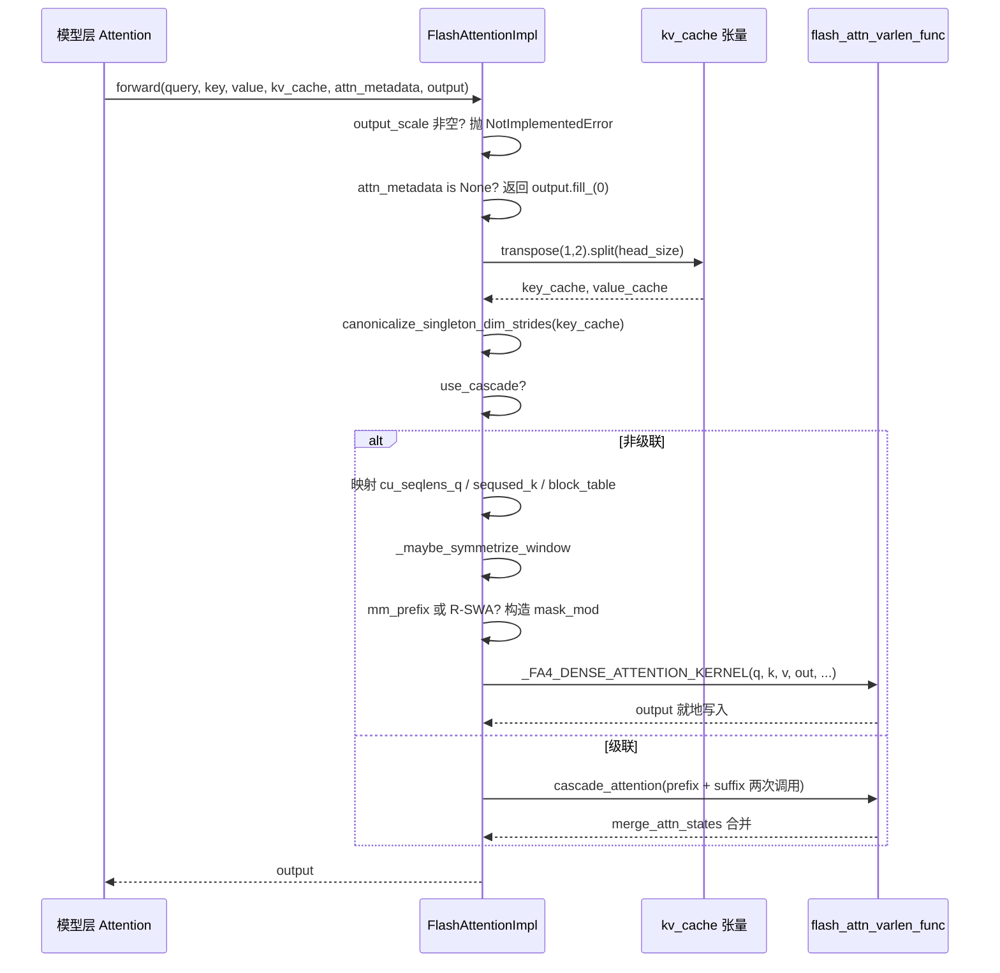

# Статус проверки: строки FACT реально привязаны

В предыдущей главе мы увидели, как GPUModelRunner преобразует результаты планирования в физические тензоры, такие как input_ids, slot_mapping и block_table, и внедряет их в каждый слой через forward_context. Но основная часть, потребляющая время GPU — вычисление внимания — всё ещё остаётся нераскрытой. Кто именно потребляет те тензоры в attn_metadata? Почему реализации FlashAttention, FlashInfer и Triton могут быть взаимозаменяемы в одном и том же коде модели? Ответ кроется в слое абстракции AttentionBackend. Он разделяет «как вычисляется внимание» и «как его вызывает модель»: слой модели хранит только ссылку на AttentionImpl и вызывает унифицированный forward(query, key, value, kv_cache, attn_metadata, output); а конкретный бэкенд отвечает за преобразование block_table, slot_mapping, seq_lens в параметры, которые может принимать его собственное ядро. В этой главе основное внимание уделяется FlashAttentionBackend, поскольку он охватывает наиболее богатый набор ветвей: семантику gather в PagedAttention, совместимость с CUDA Graph, каскадное внимание, распределённый контекст DCP и другие. Разобравшись в нём, вы поймёте, что остальные бэкенды — лишь вариации отображения параметров. Мотивация дизайна «регистрация бэкендов + унифицированный интерфейс» вполне очевидна: ядра внимания развиваются чрезвычайно быстро (FA2→FA3→FA4, итерации FlashInfer, собственные разработки на Triton), и если бы слой модели напрямую зависел от конкретного ядра, при каждом обновлении ядра приходилось бы менять код модели. Слой абстракции изолирует изменения за единственным фабричным методом get_impl_cls().

# Выбор бэкенда: объявление возможностей и построение метаданных

## Интуитивная модель

Представьте`AttentionBackend`как объявление о вакансии: он не выполняет работу, а лишь заявляет, «какие dtype, какие head_size, какие форматы квантования KV cache, какие типы attention я могу обрабатывать». Планировщик сопоставляет конфигурацию модели с этим объявлением, и при неудаче переходит к следующему кандидату. Без этого слоя объявлений система обнаружила бы «это ядро не поддерживает данный head_size» только во время выполнения и сразу бы упала.

## Матрица возможностей: поля как контракт

`FlashAttentionBackend`Атрибуты класса`supported_dtypes`и есть границы его возможностей.[FACT:vllm/v1/attention/backends/flash_attn.py:287-287]；`supported_kv_cache_dtypes`Ограничивает fp16/bf16[FACT:vllm/v1/attention/backends/flash_attn.py:298-299]Дополнительно допускает серию fp8`supports_kv_cache_dtype`. Но «заявленная поддержка» не означает «безусловная поддержка» —`flash_attn_supports_kv_cache_dtype`Для квантованного KV дополнительно делегирует[FACT:vllm/v1/attention/backends/flash_attn.py:431-438]。

для принятия решения, зависящего от устройства`supports_combination`Ещё более тонким является`None`: он принимает целый набор комбинированных параметров, таких как head_size, dtype, block_size, use_mla, has_sink, и возвращает[FACT:vllm/v1/attention/backends/flash_attn.py:454-507]означающее доступность, или строку с причиной отказа[FACT:vllm/v1/attention/backends/flash_attn.py:467-468]. Например, sink отклоняется на вычислительных возможностях < 9.0[FACT:vllm/v1/attention/backends/flash_attn.py:472-472], а на SM90 FP8 KV с mm_prefix обязан идти через Triton

. Такой дизайн с «возвратом строки причины» позволяет верхнему уровню выдавать диагностируемые ошибки, а не молчаливый откат.`MultipleOf(16)`Выбор block_size также определяется возможностями. По умолчанию возвращается[FACT:vllm/v1/attention/backends/flash_attn.py:297-324], но на SM90 FP8-KV принудительно 64`FA4_HD256_PAGE_SIZE` [FACT:vllm/v1/attention/backends/flash_attn.py:326-352], а ядро FA4 с head_size=256 принудительно

## . Это объясняет, почему размер блока KV cache не задаётся произвольно — он обратно ограничен размером TMA tile ядра.

`FlashAttentionMetadata`Структура метаданных: расположение полей FlashAttentionMetadata[FACT:vllm/v1/attention/backends/flash_attn.py:511-566]：

Это dataclass, поля разделены на четыре группы`num_actual_tokens`Первая группа — базовое описание батча:`max_query_len`、`query_start_loc`(реальное число токенов без padding),`seq_lens`、`block_table`、`slot_mapping` [FACT:vllm/v1/attention/backends/flash_attn.py:520-526](префиксные суммы, используемые ядрами varlen для определения начала и конца каждой последовательности),[FACT:vllm/v1/attention/backends/flash_attn.py:512-518]. Обратите внимание на ASCII-диаграмму в комментариях исходного кода`context_len`, она точно различает`query_len`(исторический KV),`seq_len`(добавленный в этот раз),

(их сумму) — это ключ к пониманию параметров ядер varlen.`use_cascade`、`common_prefix_len`、`cu_prefix_query_lens`Вторая группа — поля каскадного внимания:[FACT:vllm/v1/attention/backends/flash_attn.py:528-533]。

и т.д.`max_dcp_context_kv_len`、`dcp_context_kv_lens`Третья группа — поля DCP (Decode Context Parallel):[FACT:vllm/v1/attention/backends/flash_attn.py:535-544]。

, а также счётчики, различающие число запросов decode/prefill`scheduler_metadata`Четвёртая группа — опциональное планирование и специальные маски:`causal`(для планирования FA3 AOT),`mm_prefix_query_range_tensor`(может быть bool или тензором, поддерживает по-последовательный causal),[FACT:vllm/v1/attention/backends/flash_attn.py:546-566]。

> **[Design Inference & Architectural Trade-offs]**
> `causal`〔Проектные выводы и архитектурные компромиссы〕`bool | torch.Tensor`Тип поля`dynamic_causal`, а не чистый bool, — это сделано для поддержки сценариев, когда «в одном батче часть последовательностей causal, а часть — нет» (например, PrefixLM). Когда это тензор, параметр[FACT:vllm/v1/attention/backends/flash_attn.py:1429-1433]。

## FA4 берёт управление на себя, а FA2/FA3 сразу выбрасывают NotImplementedError

Пошаговое выполнение build()

Сценарий: смешанный батч, 3 последовательности decode + 2 последовательности prefill, без каскада, без DCP.`common_attn_metadata`Шаг первый: из[FACT:vllm/v1/attention/backends/flash_attn.py:824-832]. Второй шаг — решить, включать ли AOT-планирование:`aot_schedule = self.aot_schedule and not fast_build and not envs.VLLM_BATCH_INVARIANT` [FACT:vllm/v1/attention/backends/flash_attn.py:836-838]。`self.aot_schedule`В`__init__`определяется`get_flash_attn_version() == 3`решает[FACT:vllm/v1/attention/backends/flash_attn.py:709-709]— только FA3 поддерживает предварительно вычисленные метаданные планирования. Третий шаг — при первой сборке лениво заполнить`aot_sliding_window`: обойти все`FlashAttentionImpl`слоёв и собрать конфигурации скользящего окна; если конфигурация единственная — принять её, если больше одной — отключить AOT[FACT:vllm/v1/attention/backends/flash_attn.py:848-851]。

Четвёртый шаг — вычислить`max_num_splits`. По умолчанию 0 (чтобы FA3 использовал эвристику); устанавливается в`self.max_num_splits` [FACT:vllm/v1/attention/backends/flash_attn.py:856-866]только когда включён full CUDA graph и число токенов попадает в диапазон захвата. Комментарий объясняет причину:`num_splits > 1`выделяет`[num_splits, num_heads, num_tokens, head_size]`промежуточный буфер, что дорого по видеопамяти, и оправдано только в сценарии CUDA graph[FACT:vllm/v1/attention/backends/flash_attn.py:862-865]。

Пятый шаг — пойти по ветке не-каскадного и не-DCP, вызвать`_get_scheduler_metadata`для генерации метаданных планирования FA3[FACT:vllm/v1/attention/backends/flash_attn.py:976-986]. Шестой шаг —`_store_scheduler_metadata`обрабатывает сценарий CUDA graph: копирует новые метаданные в предварительно выделенный буфер и обнуляет оставшуюся часть[FACT:vllm/v1/attention/backends/flash_attn.py:671-684]. Этот шаг обнуления критически важен — комментарий прямо указывает, что иначе некоторые thread block прочитают недействительные метаданные и перезапишут выходной буфер[FACT:vllm/v1/attention/backends/flash_attn.py:671-672]。

Седьмой шаг — сконструировать`FlashAttentionMetadata`и вернуть[FACT:vllm/v1/attention/backends/flash_attn.py:992-1015]。

```mermaid
flowchart TD
    start["build(common_prefix_len, common_attn_metadata)"] --> unpack["解包 query_start_loc / seq_lens / block_table / slot_mapping"]
    unpack --> aot{"aot_schedule 且非 fast_build 且非 BATCH_INVARIANT?"}
    aot -->|是| sw_check{"aot_sliding_window 已初始化?"}
    aot -->|否| maxsplit
    sw_check -->|否, 首次| collect["_get_sliding_window_configs 收集层滑窗"]
    collect --> sw_unique{"配置数量 == 1?"}
    sw_unique -->|是| set_sw["设置 aot_sliding_window"]
    sw_unique -->|否, >1| disable_aot["self.aot_schedule = False"]
    set_sw --> maxsplit
    disable_aot --> maxsplit
    sw_check -->|是| maxsplit["计算 max_num_splits"]
    maxsplit --> cg_check{"use_full_cuda_graph 且 tokens |是| set_splits["max_num_splits = self.max_num_splits"]
    cg_check -->|否| zero_splits["max_num_splits = 0"]
    set_splits --> branch
    zero_splits --> branch
    branch{"dcp_world_size > 1?"}
    branch -->|是| dcp_path["计算 dcp_context_kv_lens, 可能 skip"]
    branch -->|否| cascade_check{"common_prefix_len > 0?"}
    cascade_check -->|是| cascade_path["构造 prefix/suffix 双份 scheduler_metadata"]
    cascade_check -->|否| normal_path["_get_scheduler_metadata 单份"]
    dcp_path --> store
    cascade_path --> store
    normal_path --> store
    store["_store_scheduler_metadata: CUDA graph 时拷入预分配缓冲并清零尾部"] --> build_meta["构造 FlashAttentionMetadata"]
    build_meta --> mm_check{"mm_req_doc_ranges 非空?"}
    mm_check -->|是| fill_mm["fill_mm_prefix_query_ranges + 拷贝到 GPU"]
    mm_check -->|否| rswa_check
    fill_mm --> rswa_check{"rswa_window 非空?"}
    rswa_check -->|是| copy_rswa["拷贝 prefix_lens 到持久缓冲"]
    rswa_check -->|否| done
    copy_rswa --> done["返回 attn_metadata"]
```

---

# forward(): полная цепочка от метаданных до вызова ядра

## Интуитивная модель

`forward()`— это «сборочный цех» бэкенда: он получает вычисленные на уровне модели Q/K/V, тензоры KV cache и построенные на предыдущем шаге метаданные, приводит физическую раскладку KV cache к форме, ожидаемой ядром, а затем диспетчеризует на конкретное ядро. Без этого шага ядро прочитает неверную раскладку памяти и выдаст тихую ошибку — её сложнее отладить, чем падение.

## Преобразование раскладки памяти KV cache

Физическая форма KV cache в vLLM — это`[num_blocks, num_kv_heads, block_size, 2 * head_size]`— K и V объединены в последнем измерении[FACT:vllm/v1/attention/backends/flash_attn.py:1246-1247]. Но ядра FlashAttention ожидают K и V раздельно, с раскладкой`[num_blocks, block_size, num_kv_heads, head_size]`。

Преобразование происходит в начале`forward()`:`kv_cache.transpose(1, 2).split(self.head_size, dim=-1)` [FACT:vllm/v1/attention/backends/flash_attn.py:1310-1310]。`transpose(1,2)`превращает`[blocks, heads, block_size, 2D]`в`[blocks, block_size, heads, 2D]`，`split`разрезая по последнему измерению на K и V. Заметьте, что`transpose`меняет только stride, не перемещая данные, поэтому последующие ядра обязаны поддерживать неконтигуозный доступ.

Сразу за этим идёт`canonicalize_singleton_dim_strides` [FACT:vllm/v1/attention/backends/flash_attn.py:1310-1310]. Комментарий проясняет мотивацию: когда`num_kv_heads=1`(часто в сценариях TP), stride размерности размера 1 вырожден, а FA3/FA4 на H100+ используют TMA, требующий выравнивания stride минимум на 16 байт[FACT:vllm/v1/attention/backends/flash_attn.py:1310-1310]. Это типичная ловушка «логически эквивалентно, физически недопустимо».

## Передача параметров в не-каскадном пути

После входа в ветку`if not attn_metadata.use_cascade`параметры отображаются по одному[FACT:vllm/v1/attention/backends/flash_attn.py:1326-1342]：`cu_seqlens_q = query_start_loc`，`seqused_k = seq_lens`，`block_table = attn_metadata.block_table`。`descale_shape`берёт`(batch_size, num_kv_heads)`, используется для broadcast scale при FP8-квантизации — комментарий поясняет, что flash-attn ожидает форму descale`(num_sequences, num_kv_heads)`, а`.expand()`применяется, чтобы избежать копирования[FACT:vllm/v1/attention/backends/flash_attn.py:1258-1258]。

Затем — симметризация скользящего окна.`_maybe_symmetrize_window`логика: причинное скользящее окно`(w, 0)`в не-причинном сценарии должно стать`(w, w)`, чтобы двунаправленный query мог смотреть в обе стороны[FACT:vllm/v1/attention/backends/flash_attn.py:587-589]. Комментарий также подчёркивает, что «собственное окно слоя имеет приоритет над окном группы», поскольку одна группа KV cache может одновременно содержать оконные и глобальные слои (например, в Gemma-3 при отключённом hybrid KV cache manager)[FACT:vllm/v1/attention/backends/flash_attn.py:1362-1365]。

## Ветка маски: mm_prefix и R-SWA

Когда`mm_prefix_query_ranges`непусто и выполнены условия FA4 + статической причинности, код конструирует CuTE-DSL`mask_mod` [FACT:vllm/v1/attention/backends/flash_attn.py:1374-1407]. Ключевые действия —`causal = False`и`sliding_window_size = None` [FACT:vllm/v1/attention/backends/flash_attn.py:1406-1407]. Комментарий объясняет причину: семантика mm_prefix — это`(causal ∧ window) ∨ bidirectional-range`, а не подмножество causal; после FA #155 установка mask_mod больше не очищает автоматически causal/local, и вызывающая сторона должна явно отключить их, иначе встроенный causal-путь замкнёт mask_mod накоротко[FACT:vllm/v1/attention/backends/flash_attn.py:1402-1405]。

`_make_mm_prefix_mask_mod`использует`functools.cache`для кэширования[FACT:vllm/v1/attention/backends/flash_attn.py:1793-1802]. Комментарий даёт вескую причину:`hash_callable`в FA4 подмешивает`repr()`замыкающей ячейки в ключ компиляции, а вложенный`_load_q_range`при каждом вызове имеет разный адрес, что приводит к полной JIT-перекомпиляции на каждом forward[FACT:vllm/v1/attention/backends/flash_attn.py:1793-1802]. Это типичный образец ловушки производительности в продакшене.

Внутри маски есть деталь преобразования координат: FA4 передаёт локальный`q_idx`(0-based внутри текущего prefill chunk), тогда как`kv_idx`— абсолютная позиция. Код использует`q_abs = q_idx + seqlen_k - seqlen_q`для восстановления абсолютной позиции[FACT:vllm/v1/attention/backends/flash_attn.py:1859-1865]。`__vec_size__ = 1`настройка также имеет тонкость:`_load_q_range`читает lane 0, один вызов не может пересекать строку query[FACT:vllm/v1/attention/backends/flash_attn.py:1897-1897]。

mask_mod у R-SWA аналогичен, но семантика —`causal & (in_prefix | in_window)` [FACT:vllm/v1/attention/backends/flash_attn.py:1945-1948], и`use_fast_sampling = True`заставляет FA4 пропускать полностью замаскированные KV-блоки, не загружая их данные[FACT:vllm/v1/attention/backends/flash_attn.py:1950-1950]。

## Особая обработка FA4 hd256

Когда`self.fa4_hd256`истинно, код принудительно выравнивает страницы:`num_pages = cdiv(max_seqlen_k, FA4_HD256_PAGE_SIZE)`，`max_seqlen_k`округляется вверх до границы страницы,`block_table`усекается до точного числа страниц,`num_splits = 1` [FACT:vllm/v1/attention/backends/flash_attn.py:1442-1448]. Комментарий поясняет, что ядро hd256 требует выровненной по страницам длины, точной ширины block table и не поддерживает SplitKV.

Финальный вызов`_FA4_DENSE_ATTENTION_KERNEL(...)`передаёт q, k, v, out, cu_seqlens_q, seqused_k, block_table, softcap, mask_mod, aux_tensors и т. д. в[FACT:vllm/v1/attention/backends/flash_attn.py:1450-1475]。

## Запись в KV cache: do_kv_cache_update

`forward()`только читает KV cache, запись выполняет`do_kv_cache_update`. Он вызывает`reshape_and_cache_flash`, используя`slot_mapping`для scatter-записи только что вычисленных K/V в cache[FACT:vllm/v1/attention/backends/flash_attn.py:1532-1541]. Комментарий отмечает:`key`/`value`является padded, а`slot_mapping`Нет, но ручное разбиение на срезы не требуется, поскольку op использует`slot_mapping`форму  для определения фактического числа токенов[FACT:vllm/v1/attention/backends/flash_attn.py:1527-1531]. Здесь нормализация stride не выполняется, так как ядро TMA не участвует[FACT:vllm/v1/attention/backends/flash_attn.py:1520-1521]。



---

# Проектные размышления: почему написано именно так

> **[Design Inference & Architectural Trade-offs]**
> **Разделение объявления возможностей и реализации**。`supports_combination`Возвращает строку причины, а не bool — это сделано для того, чтобы верхний уровень при откате к другим бэкендам мог зафиксировать, «почему не использовался FA», что значительно снижает стоимость диагностики в production. По сравнению с молчаливым откатом такой дизайн делает основание для решения явным.

**Совместимость с CUDA Graph — неявное ограничение дизайна метаданных**。`_store_scheduler_metadata`Режим «копирование внутрь + обнуление хвоста»[FACT:vllm/v1/attention/backends/flash_attn.py:671-684]неоднократно встречается в持久ном буфере R-SWA[FACT:vllm/v1/attention/backends/flash_attn.py:787-798]и временной области mm_prefix[FACT:vllm/v1/attention/backends/flash_attn.py:800-813]. Общий паттерн: в`__init__`предварительно выделяется持久ный буфер максимального размера,`build()`выполняет только копирование, без выделения. Причина указана в комментарии — во время захвата CUDA graph не должно быть операций выделения[FACT:vllm/v1/attention/backends/flash_attn.py:1044-1046]。

**Взаимоисключение DCP и fused draft decode**。`supports_draft_decode_metadata_update = self.dcp_world_size == 1` [FACT:vllm/v1/attention/backends/flash_attn.py:742-742]. В комментарии объясняется: fused draft decode повторно использует захваченные объекты метаданных между шагами draft, но решения DCP на стороне хоста во время сборки (например,`skip_dcp_context_attention()`) изменяют форму метаданных, и эти поля Python не обновляются на месте между replay графа[FACT:vllm/v1/attention/backends/flash_attn.py:736-741]. Это типичный компромисс «при конфликте производительности и корректности выбирается корректность».

**Эвристический порог каскадного внимания**。`use_cascade_attention`использует ряд пороговых фильтров: common_prefix_len < 256 — немедленный отказ[FACT:vllm/v1/attention/backends/flash_attn.py:1967-1967], alibi/sliding_window/local_attention не поддерживаются[FACT:vllm/v1/attention/backends/flash_attn.py:1978-1979], число запросов < 8 — отказ[FACT:vllm/v1/attention/backends/flash_attn.py:1982-1984], в сценариях DCP отключено[FACT:vllm/v1/attention/backends/flash_attn.py:1985-1987]. После прохождения проверок ещё требуется с помощью грубой модели производительности сравнить число CTA и число wave для cascade и FlashDecoding[FACT:vllm/v1/attention/backends/flash_attn.py:2011-2029]. В комментарии честно признаётся, что эта модель «very rough»[FACT:vllm/v1/attention/backends/flash_attn.py:2009-2010]。

**Подводные камни в production**：`forward()`содержит заметный комментарий, предупреждающий, что при piece-wise CUDA graph этот метод выполняется в eager-режиме,`view`/`slice`и другие методы, выглядящие как не содержащие операций на GPU, на самом деле очень медленные, изменения обязательно нужно бенчмаркать[FACT:vllm/v1/attention/backends/flash_attn.py:1277-1284]. Это объясняет, почему в коде массово используются`[:num_actual_tokens]`срезы вместо более «элегантного» написания — каждое место является результатом компромисса по производительности.

---

# Итоги главы

Эта глава прошла по`FlashAttentionBackend`полный жизненный цикл бэкенда внимания: объявление возможностей (`supports_*`серия) → построение метаданных (`build()`переводит`CommonAttentionMetadata`в`FlashAttentionMetadata`) → вызов ядра (`forward()`преобразует布局 KV cache, строит маску, выполняет диспетчеризацию в ядро FA). Ключевые механизмы включают: преобразование`transpose+split`布局 KV cache, нормализацию вырожденного stride, режим持久ного буфера под CUDA graph, построение маски CuTE-DSL для mm_prefix/R-SWA, а также эвристические решения каскадного внимания.

Ключевые проектные принципы: разделение объявления возможностей и реализации, предварительное выделение метаданных, обусловленное совместимостью с CUDA graph, приоритет корректности при конфликте производительности и корректности (DCP отключает fused draft decode).

Следующая глава перейдёт к сэмплированию и выводу:`logits`как через цепочку процессоров (температура, top-p, штрафы) получается token, как структурированный вывод ограничивает декодирование и как потоковый возврат взаимодействует с планировщиком.

# Вопросы для размышления и самопроверки в этой главе

Q1: Если удалить`_store_scheduler_metadata`в`self.scheduler_metadata[n:] = 0`операцию обнуления, в каких сценариях это приведёт к ошибкам вывода? Почему в комментарии это особо подчёркивается?

**Разбор ответа**：`_store_scheduler_metadata`в сценарии CUDA graph копирует новые метаданные в первые n позиций предварительно выделенного буфера[FACT:vllm/v1/attention/backends/flash_attn.py:671-684]. Если не обнулить хвост, остаточные метаданные планировщика от предыдущей сборки будут прочитаны текущим ядром. В комментарии явно указано: «some thread blocks may use the invalid scheduler metadata and overwrite the output buffer»[FACT:vllm/v1/attention/backends/flash_attn.py:671-672]. Сценарий срабатывания: размер батча уменьшается с большого до малого (например, с 8 последовательностей до 3), первые 3 позиции буфера содержат новые данные, но позиции с 4 по 8 всё ещё содержат данные старого батча. Метаданные планировщика FA3 включают информацию о распределении tile; если при чтении по batch_size в вычислении batch_size есть отклонение или ядро сканирует с фиксированным stride, оно прочитает грязные данные и испортит вывод. Это классическая ловушка повторного использования буфера в CUDA graph: жизненный цикл буфера охватывает несколько replay, и его необходимо явно очищать.

Q2: `_make_mm_prefix_mask_mod`использует`functools.cache`кэш; в комментарии сказано, что иначе это «force a full JIT recompile every forward». Насколько деградирует производительность, если убрать этот декоратор кэширования? Почему ключ компиляции FA4 зависит от адреса замыкания?

**Разбор ответа**: в комментарии объясняется, что`hash_callable`FA4 включает`repr()`ячейки замыкания в ключ компиляции[FACT:vllm/v1/attention/backends/flash_attn.py:1793-1802]。`_make_mm_prefix_mask_mod`внутри определена вложенная функция`_load_q_range`, каждый вызов фабричной функции создаёт новый объект функции, и его`repr()`Содержит адрес памяти, адрес каждый раз разный → ключ компиляции каждый раз разный → FA4 считает, что требуется повторная JIT-компиляция. После кэширования — одинаковый`(sliding_window, sliding_window_left)`Параметры повторно используют один и тот же объект функции, ключ компиляции стабилен. Степень деградации производительности зависит от времени компиляции FA4, но можно утверждать, что «полная компиляция запускается на каждом forward», в цикле decode компиляция выполняется на каждом шаге, и задержка деградирует с миллисекунд до секунд. Это типичный случай инвалидации JIT-кэша, вызванной «кажущимся безобидным Python-замыканием».

Q3: `supports_draft_decode_metadata_update = self.dcp_world_size == 1`Эта строка кода в сценарии DCP отключает fused draft decode. Предположим, вы принудительно измените её на`True`— какая конкретная ошибка возникнет при комбинации спекулятивного декодирования и DCP?

**Справочный разбор**: комментарий поясняет, что fused draft decode повторно использует захваченный объект метаданных между шагами draft, а решения на стороне хоста во время сборки DCP (например,`skip_dcp_context_attention()`) изменяют форму метаданных/путь управления, например`max_dcp_context_kv_len` [FACT:vllm/v1/attention/backends/flash_attn.py:736-741]. Эти Python-поля не обновляются на месте между replay CUDA graph. Конкретная ошибка: между шагами draft длина последовательности растёт,`skip_dcp_context_attention`условие может измениться с True на False (или наоборот), но повторно используемый объект метаданных всё ещё хранит старое значение. Если старое значение —`max_dcp_context_kv_len = 0`, ядро пойдёт по пути «без DCP context»[FACT:vllm/v1/attention/backends/flash_attn.py:1565-1589], пропустив context-внимание между rank, что приведёт к отсутствию контекстной информации в выводе — тихая ошибка, без падения. Именно это воплощает принцип «при конфликте производительности и корректности выбирать корректность».

На этом полная цепочка от абстрактного интерфейса до реализации ядра для бэкенда внимания уже пройдена: уровень модели единообразно вызывает через AttentionImpl, бэкенд отвечает за преобразование таких метаданных, как block_table, slot_mapping, в конкретные параметры ядра, а реализация PagedAttention в FlashAttentionBackend демонстрирует семантику gather при страничном KV Cache и стратегию совместимости с CUDA Graph. Но вычисление внимания производит лишь скрытые состояния, а модель в конечном итоге должна выдать следующий token. Как эти скрытые состояния превращаются в logits, как logits проходят через сэмплирование и постобработку и в итоге возвращаются клиенту в виде потокового текста? В следующей главе мы проследим эту последнюю милю.
