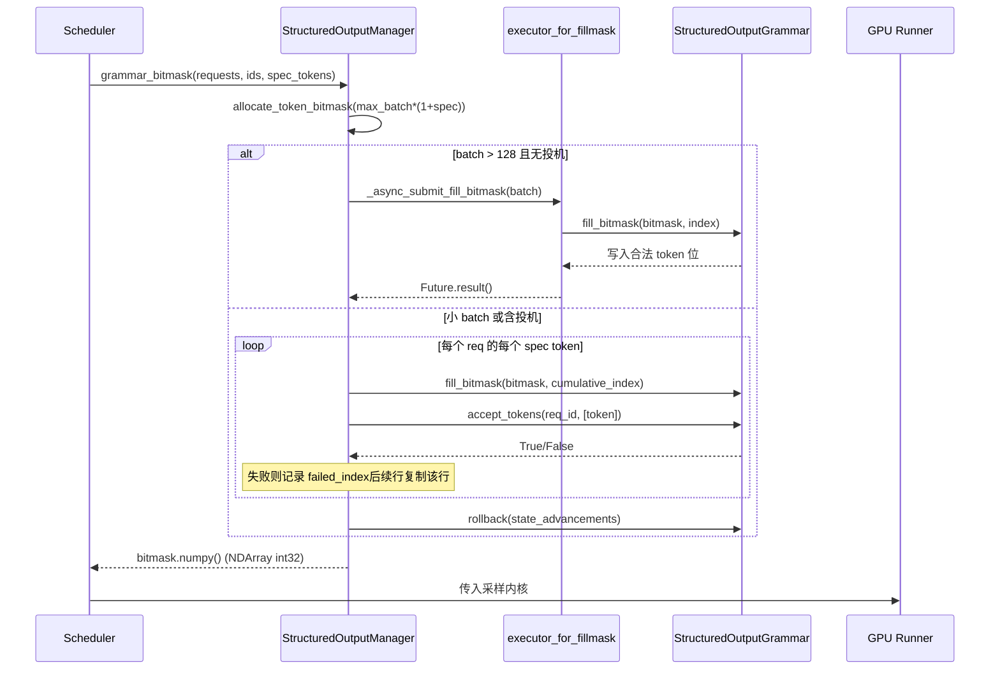

# Глава 7: Сэмплирование и вывод: обработка Logits, структурированный вывод и потоковый возврат

В предыдущей главе мы проследили, как бэкенд внимания преобразует block table в параметры ядра и выполняет gather-вычисление внимания на несмежной видеопамяти. Но внимание производит лишь скрытые состояния — модель на самом деле должна доставить пользователю текст следующего token. В этой главе мы проследим эту последнюю милю: как скрытые состояния после проекции через lm_head в logits проходят через тщательно упорядоченную цепочку процессоров (температура, штрафы, top-k/top-p, структурные ограничения), сэмплируются в token id, затем через detokenizer восстанавливаются в текст и отправляются потоком. Любой сбой порядка или утечка состояния на этом пути приведут к тихой деградации качества вывода.

# Sampler: порядок цепочки процессоров — это и есть корректность

**Интуитивная модель**: Sampler подобен сборочному конвейеру, logits — это заготовка, подлежащая обработке. Каждая станция (processor) на конвейере изменяет заготовку, и порядок станций напрямую определяет готовое изделие — сначала обточить, потом отшлифовать и сначала отшлифовать, потом обточить дают две разные вещи. Без этой цепочки модель могла бы выдавать только исходное распределение вероятностей, и пользователь получал бы «голое сэмплирование» без возможности управлять температурой, подавлять повторы или ограничивать формат.

## Структуры данных и layout памяти

Сам Sampler —`nn.Module`, но его ключевое состояние крайне тонкое: он хранит только подмодуль`topk_topp_sampler`, флаги`logprobs_mode`и`use_fp64_gumbel`[FACT:vllm/v1/sample/sampler.py:61-64]. Всё настоящее состояние уровня батча инкапсулировано в`SamplingMetadata`и передаётся через параметры forward. Такой дизайн «Sampler без состояния + внешние метаданные» намеренный: экземпляр Sampler создаётся только один раз за жизненный цикл движка, а состав батча на каждом шаге decode меняется, и вынесение состояния наружу позволяет безопасно воспроизводить Sampler после захвата CUDA Graph.

Ключевая константа —`_SAMPLING_EPS = 1e-5` [FACT:vllm/v1/sample/sampler.py:18]. Она одновременно несёт две семантики: температура ниже этого значения считается жадной, а также`apply_temperature`служит запасным вариантом для предотвращения деления на ноль.

## Step-by-Step Walkthrough

Сценарий: в одном batch смешаны жадные запросы и запросы со случайным сэмплированием, часть запросов также включает logprobs.

**Первый шаг — снимок исходных logprobs.**До применения любых штрафов или температуры, если запросу нужны logprobs, сначала по`logprobs_mode`определяется содержимое снимка[FACT:vllm/v1/sample/sampler.py:84-93]. Обратите внимание, что комментарий явно указывает на отличие от V0: V1 использует**исходные logits**(до штрафов и температуры) для вычисления top-k logprobs[FACT:vllm/v1/sample/sampler.py:72-77]. Это семантический контракт — logprob, который видит пользователь, должен отражать истинное распределение модели, а не распределение, искажённое после применения штрафов.

**Второй шаг — приведение к float32.** [FACT:vllm/v1/sample/sampler.py:95-96]Независимо от того, является ли вход bf16 или fp16, выполняется повышение до float32. Причина в том, что последующие log_softmax, top-k и накопление вероятностей при низкой точности накапливают ошибку, особенно при размере словаря до 150 тысяч.

**Третий шаг — цепочка обработчиков, не изменяющих argmax.** `apply_logits_processors`Последовательно применяются: маска белого списка allowed token, исключение bad words,`non_argmax_invariant`обработчики, штрафные члены[FACT:vllm/v1/sample/sampler.py:391-404]. Классификация здесь — ключевой элемент дизайна —`non_argmax_invariant`обозначает те**, которые изменяют результат жадного выбора**обработчики (такие как min_tokens, logit_bias), они должны применяться до жадной выборки; а`argmax_invariant`обработчики (такие как min_p) не изменяют argmax и могут быть отложены до применения температуры.

**Четвёртый шаг — выборка.** `sample`Метод сначала определяет, является ли выборка полностью случайной[FACT:vllm/v1/sample/sampler.py:256-271]: если`all_greedy`, сразу возвращается argmax; иначе сначала вычисляется жадный результат для последующего использования, затем применяются температура, обработчики, не изменяющие argmax, top-k/top-p[FACT:vllm/v1/sample/sampler.py:275-291]. В конце с помощью`torch.where`по порогу температуры выбирается между жадным и случайным результатами[FACT:vllm/v1/sample/sampler.py:305-306], и переиспользуется`greedy_sampled`тензор в качестве выходного буфера, чтобы избежать дополнительного выделения памяти.

**Пятый шаг — сбор logprobs и упаковка вывода.**По`num_logprobs`различаются три случая: None возвращает только logprobs указанных токенов; -1 возвращает полный неотсортированный набор logprobs; иначе top-k[FACT:vllm/v1/sample/sampler.py:120-131]. В итоге token id преобразуется в int32 для сжатия объёма и расширяется до`[num_requests, 1]`двумерного тензора[FACT:vllm/v1/sample/sampler.py:138-148]。

```mermaid
flowchart TD
    in_logits["logits (bf16/fp16)"] --> snap{"需要 logprobs?"}
    snap -->|是| raw["compute_logprobs / cloneraw_logprobs 快照"]
    snap -->|否| f32
    raw --> f32["logits.to(float32)"]
    f32 --> proc["apply_logits_processors"]
    proc --> mask{"allowed_token_ids_mask?"}
    mask -->|是| fill["masked_fill_(-inf)"]
    mask -->|否| bad
    fill --> bad{"bad_words_token_ids?"}
    bad -->|是| apply_bad["apply_bad_words"]
    bad -->|否| noninv
    apply_bad --> noninv["non_argmax_invariant 处理器"]
    noninv --> pen["apply_penalties"]
    pen --> sample["sample()"]
    sample --> allg{"all_greedy?"}
    allg -->|是| greedy["greedy_sample (argmax)"]
    allg -->|否| temp["apply_temperature"]
    temp --> arginv["argmax_invariant 处理器"]
    arginv --> topp["topk_topp_sampler"]
    topp --> where["torch.where(temp  out
    where --> out["SamplerOutputsampled_token_ids"]
```

## Размышления о дизайне и подводные камни

**Почему штрафные члены должны применяться до температуры?**Температура — это масштабирование распределения, штраф — это добавление или вычитание баллов для конкретных токенов. Если сначала масштабировать, а потом штрафовать, абсолютная величина штрафа будет увеличена или уменьшена температурой, что приведёт к несогласованному поведению одного и того же набора параметров штрафа при разных температурах. В V1 штраф зафиксирован до температуры, что обеспечивает стабильность семантики параметров.

**`mark_unbacked`Ловушка компиляции**В`gather_logprobs`,`batched_count_greater_than`компилируется, а при изменении размерности batch с 1 на ≥2 срабатывает специализированная перекомпиляция dynamo для 0/1[FACT:vllm/v1/sample/sampler.py:345-348]。`mark_unbacked`помечает эту размерность как полностью символьную, избегая этой перекомпиляции. Если в production после первого запроса decode внезапно возникает однократная задержка, скорее всего, это именно такая перекомпиляция.

**`gpu_sync_allowed`Граница синхронизации** `batched_count_greater_than`внутри может вызывать синхронизацию GPU, vLLM использует`gpu_sync_allowed(first_only=True)`контекст, явно объявляя «здесь синхронизация разрешена, но только в первый раз»[FACT:vllm/v1/sample/sampler.py:345-348]. Если синхронизация случайно происходит внутри области захвата CUDA Graph, это приведёт к сбою захвата — это ключевая подсказка при диагностике проблем захвата графа.

# Структурированный вывод: двухдорожечный конечный автомат битовых масок и грамматики

**Интуитивная модель**: структурированный вывод — это как надеть на сэмплер «грамматические очки» — на каждом шаге видны только токены, соответствующие JSON schema или грамматике. Без этого модель может генерировать синтаксически некорректный JSON, и нижестоящий парсер просто упадёт. Суть реализации в vLLM в том, что конечный автомат грамматики продвигается на стороне CPU, а ограничения передаются на сторону GPU для выборки в виде битовой маски.

## Структуры данных и раскладка памяти

`StructuredOutputManager`— это синглтон уровня движка, содержащий`backend`(один из xgrammar/guidance/outlines/lm-format-enforcer),`reasoner_cls`и два пула потоков[FACT:vllm/v1/structured_output/__init__.py:39-98]。

Битовая маска — ключевая структура данных:`_grammar_bitmask`— это тензор int32 формы`[max_batch_size * (1 + max_num_spec_tokens), vocab_size/32]`[FACT:vllm/v1/structured_output/__init__.py:327-336]. Каждый бит соответствует допустимости одного токена.`_full_mask = torch.tensor(-1, dtype=torch.int32)`означает «все единицы» — все токены допустимы[FACT:vllm/v1/structured_output/__init__.py:59]。

Два пула потоков имеют чёткое разделение обязанностей:`executor`отвечает за компиляцию грамматики (CPU-интенсивная задача, число worker'ов равно половине числа CPU)[FACT:vllm/v1/structured_output/__init__.py:71-78]；`executor_for_fillmask`отвечает за параллельное заполнение битовых масок для больших batch, включается только при batch больше 128[FACT:vllm/v1/structured_output/__init__.py:62-69]。

## Step-by-Step Walkthrough

**Инициализация грамматики.**При первом поступлении запроса`grammar_init`вызывается[FACT:vllm/v1/structured_output/__init__.py:115-176]. Если backend не инициализирован, реализация выбирается согласно конфигурации[FACT:vllm/v1/structured_output/__init__.py:130-165]. Затем отправляется задача компиляции: по умолчанию используется асинхронный`executor.submit`, но в режиме`external_launcher`обязательна синхронная[FACT:vllm/v1/structured_output/__init__.py:167-176]。

**Генерация битовой маски.**На каждом шаге decode`grammar_bitmask`генерирует маски для всех структурированных запросов в batch[FACT:vllm/v1/structured_output/__init__.py:314-442]. Большой batch идёт по параллельному пути: отправка в пул потоков группами по 16[FACT:vllm/v1/structured_output/__init__.py:346-373]. Малый batch идёт по последовательному пути, продвигая состояние грамматики токен за токеном[FACT:vllm/v1/structured_output/__init__.py:374-433]。

**Выравнивание масок при спекулятивном декодировании.**Это самая изящная часть. При наличии draft token каждому запросу требуется`1 + max_num_spec_tokens`строк масок. Последовательный путь обрабатывает токен за токеном: если некоторый draft token отклоняется грамматикой, записывается`failed_index`, а последующие строки просто копируют маску этой строки[FACT:vllm/v1/structured_output/__init__.py:396-418]. Это гарантирует, что «после отклонения draft состояние ограничений для последующих позиций откатывается к точке отклонения».

**Откат состояния.**В процессе заполнения битовой маски состояние грамматики продвинулось на`state_advancements`шагов, но draft token ещё не был реально принят, поэтому необходимо`grammar.rollback(state_advancements)`откатить[FACT:vllm/v1/structured_output/__init__.py:422-430]. Реальное принятие происходит в`accept_tokens` [FACT:vllm/v1/structured_output/__init__.py:444-466]。



## Размышления о дизайне и подводные камни

**Почему external_launcher требует синхронной компиляции?**Комментарий даёт точную причину: асинхронная компиляция приводит к тому, что переходы состояния`WAITING_FOR_STRUCTURED_OUTPUT_GRAMMAR → WAITING`происходят в разные моменты на разных TP rank, нарушая предположение о детерминизме, на которое опирается external_launcher[FACT:vllm/v1/structured_output/__init__.py:47-56]. Это типичный случай конфликта между распределённой детерминированностью и асинхронной оптимизацией.

**Ограничение начальной точки в推理-моделях.** `_get_constraint_start`Определяет, с какого токена начинать применение синтаксических ограничений[FACT:vllm/v1/structured_output/__init__.py:220-292]. Для моделей с цепочкой рассуждений этап reasoning не должен ограничиваться JSON, ограничения включаются только после завершения reasoning.`enable_in_reasoning`При значении True сразу возвращается 0 (ограничения на всём протяжении)[FACT:vllm/v1/structured_output/__init__.py:235-236]. Если reasoner поддерживает`find_reasoning_end_offset`, использовать его для точного определения[FACT:vllm/v1/structured_output/__init__.py:261-267]; иначе откатиться к пошаговому поиску с возвратом[FACT:vllm/v1/structured_output/__init__.py:287-291]。

**`validate_tokens`семантика префикса.**При спекулятивном декодировании draft-токены могут нарушать грамматику,`validate_tokens`возвращается "наидлиннейший допустимый префикс"[FACT:vllm/v1/structured_output/__init__.py:294-312]. Обратите внимание: сначала удаляется спекулятивное заполнение (-1), затем вычисляется начальная точка ограничений, и только после этого выполняется синтаксическая проверка токенов в интервале ограничений.

# Detokenizer: инкрементальное декодирование и пограничная игра со stop string

**Интуитивная модель**: detokenizer подобен переписчику, копирующему символ за символом, переводя token id в читаемый человеком текст. Сложность в том, что токены и символы не соответствуют взаимно однозначно (один токен может соответствовать лишь половине UTF-8 символа), и stop string может охватывать несколько токенов. Без инкрементального декодирования на каждом шаге пришлось бы декодировать всю последовательность с нуля, и затраты O(n²) обрушили бы пропускную способность.

## Структуры данных и размещение в памяти

`IncrementalDetokenizer`Базовый класс содержит только`token_ids`список[FACT:vllm/v1/engine/detokenizer.py:32-33]。`BaseIncrementalDetokenizer`добавлены поля, связанные со stop:`stop`список,`min_tokens`、`include_stop_str_in_output`、`stop_buffer_length`и`_last_output_text_offset` [FACT:vllm/v1/engine/detokenizer.py:70-94]。

`stop_buffer_length`являются ключевыми: когда stop string не содержится в выводе, это значение равно длине самого длинного stop string минус один[FACT:vllm/v1/engine/detokenizer.py:87-90]. Этот "буфер отката" гарантирует, что потоковый вывод не выдаст преждевременно символы, которые могут быть префиксом stop string.

Два пути реализации:`FastIncrementalDetokenizer`использовать`DecodeStream` [FACT:vllm/v1/engine/detokenizer.py:166-246]；`SlowIncrementalDetokenizer`библиотеки tokenizers, использовать`detokenize_incrementally` [FACT:vllm/v1/engine/detokenizer.py:249-305]на стороне Python. Критерий выбора — версия tokenizers ≥ 0.22.0 и совпадение типа tokenizer[FACT:vllm/v1/engine/detokenizer.py:32-33][FACT:vllm/v1/engine/detokenizer.py:61-63]。

## Step-by-Step Walkthrough

**инкрементальное декодирование.** `update`принимает новые token ids и флаг`stop_terminated`Если stop завершает и не содержит stop string, последний токен исключается из декодирования[FACT:vllm/v1/engine/detokenizer.py:96-142]. Затем для каждого токена вызывается[FACT:vllm/v1/engine/detokenizer.py:107-111]накопление текста`decode_next`обнаружение stop string.[FACT:vllm/v1/engine/detokenizer.py:117-122]。

**поиск ведётся только в диапазоне новых символов** `check_stop_strings`. Начальная точка поиска —[FACT:vllm/v1/engine/detokenizer.py:308-360], это смещение гарантирует, что stop string, пересекающие границы токенов, также будут обнаружены. При одновременном совпадении нескольких stop string выбирается`1 - new_char_count - stop_string_len` [FACT:vllm/v1/engine/detokenizer.py:338]завершившийся раньше всех****срез потокового вывода.[FACT:vllm/v1/engine/detokenizer.py:342-347]。

**в соответствии с параметром** `get_next_output_text`определяется, возвращать полный объём или приращение`delta`. При незавершённости сохраняются[FACT:vllm/v1/engine/detokenizer.py:148-163]символов, не выдаваемых наружу`stop_buffer_length`, с помощью[FACT:vllm/v1/engine/detokenizer.py:145-146]фиксируется отправленная позиция`_last_output_text_offset`восстановление после исключений.[FACT:vllm/v1/engine/detokenizer.py:148-163]。

**Обрабатываются два типа исключений: OverflowError/TypeError логируются и возвращается None** `FastIncrementalDetokenizer._protected_step`; при ошибке "Invalid prefix" выполняется[FACT:vllm/v1/engine/detokenizer.py:225-229]пересоздание DecodeStream**и повторная попытка**. Последнее应对 граничные случаи, когда tokenizer порождает немонотонный вывод UTF-8.[FACT:vllm/v1/engine/detokenizer.py:222-246]Размышления о дизайне и подводные камни

## Компромисс по stop_buffer_length.

**Чем длиннее буфер, тем больше задержка потоковой передачи (пользователь видит текст позже), но тем меньше вероятность пропустить stop string, охватывающий несколько токенов. Значение "длина самого длинного stop string минус один" является точной нижней границей: любой префикс stop string имеет длину не более этой.**min_tokens и stop_check_offset.

**Когда число выходных токенов не достигает**,`min_tokens`продолжает сдвигаться к концу текста`stop_check_offset`,这意味着 этот текст не будет проверяться на stop. Это предотвращает ситуацию, когда модель в самом начале натыкается на stop string и выдаёт пустой вывод.[FACT:vllm/v1/engine/detokenizer.py:120-122]Кэш added_token_ids быстрого пути.

**Когда**равно False, необходимо подавлять пробелы между специальными токенами`spaces_between_special_tokens`. Код кэширует[FACT:vllm/v1/engine/detokenizer.py:192-207]в объекте tokenizer`added_token_ids`, избегая пересоздания словаря при каждом decode.[FACT:vllm/v1/engine/detokenizer.py:195-200]Размышления о дизайне

# Три модуля разделяют одну философию дизайна:

разделение продвижения состояния и проверки ограничений, чтобы сторона GPU выполняла только тензорные операции без состояния**. Sampler не имеет состояния, состояние находится в**; конечный автомат грамматики продвигается на стороне CPU, GPU лишь потребляет битовую маску;`SamplingMetadata`detokenizer — единственный потоковый курсор. Такое разделение позволяет каждому компоненту на стороне GPU быть захваченным CUDA Graph.`_last_output_text_offset`Другая основная линия —

порядок и есть семантика**. Порядок цепочки обработчиков Sampler, начальная точка ограничений структурированного вывода, смещение обнаружения stop в detokenizer — любая ошибка в порядке не приведёт к краху, а лишь к молчаливому неверному результату — именно это делает такой код наиболее сложным для отладки.**Резюме главы

# Цепочка обработчиков Sampler строго упорядочена: снимок исходных logprobs → float32 → белый список/bad words → non-argmax-invariant → штрафы → температура → argmax-invariant → top-k/top-p.

- Sampler 的处理器链严格排序：原始 logprobs 快照 → float32 → 白名单/bad words → non-argmax-invariant → 惩罚 → 温度 → argmax-invariant → top-k/top-p。
- Структурированный вывод использует битовую маску для передачи состояния синтаксиса со стороны CPU на GPU, а при спекулятивном декодировании через`failed_index`копирование и`rollback`обеспечивается согласованность состояния.
- Detokenizer использует`stop_buffer_length`буфер отката для балансировки задержки потоковой передачи и обнаружения stop string через границы токенов; быстрый путь зависит от tokenizers ≥ 0.22.0`DecodeStream`。

# Вопросы для размышления и самопроверки к этой главе

Q1: Если перенести`apply_logits_processors`штрафной член (`apply_penalties`) после температуры, какие конкретные отклонения возникнут в сценарии высокотемпературной выборки при temperature=2.0? Почему?

**Справочный разбор**: температура — это масштабирование всего вектора logits (`logits.div_(temp)`）[FACT:vllm/v1/sample/sampler.py:241-242]. Штрафной член (например, repetition penalty) — это мультипликативная/аддитивная корректировка конкретных токенов. Если сначала масштабировать, а потом штрафовать, абсолютная величина штрафа будет усилена температурой в 2 раза, из-за чего одна и та же группа`repetition_penalty`параметров при высокой температуре подавляет гораздо сильнее, чем при низкой, и семантика параметров дрейфует вместе с температурой. V1 фиксирует штраф перед температурой[FACT:vllm/v1/sample/sampler.py:403-404], обеспечивая развязку амплитуды штрафа и температуры. Кроме того, штраф относится к категории`non_argmax_invariant`(влияет на результат жадной стратегии), а жадный путь возвращается ещё до температуры[FACT:vllm/v1/sample/sampler.py:261-271]; если перенести его после температуры, жадные запросы полностью обойдут штраф, что приведёт к несогласованному поведению.

Q2: В`grammar_bitmask`последовательном пути, если удалить строку`grammar.rollback(state_advancements)` [FACT:vllm/v1/structured_output/__init__.py:422-430], что произойдёт при комбинации спекулятивного декодирования и структурированного вывода? Проанализируйте с учётом момента вызова`accept_tokens`.

**Справочный разбор**: при заполнении битовой маски код для каждого draft token вызывает`grammar.accept_tokens`для продвижения состояния синтаксиса с целью генерации маски следующей позиции[FACT:vllm/v1/structured_output/__init__.py:396-418], но это лишь «пробное продвижение» — draft token ещё не подтверждён целевой моделью. Если удалить`rollback`, состояние синтаксиса навсегда останется в позиции «все draft приняты». Когда целевая модель фактически отклоняет часть draft token, реально принятая последовательность токенов не соответствует состоянию синтаксиса:`accept_tokens` [FACT:vllm/v1/structured_output/__init__.py:444-466]будет проверяться на основе ошибочного состояния синтаксиса, что приведёт к отклонению допустимых токенов или пропуску недопустимых. В результате JSON-вывод молча повреждается: без падения, но с ошибкой парсинга на стороне потребителя.

Q3: `check_stop_strings`Начальная точка поиска в`1 - new_char_count - stop_string_len` [FACT:vllm/v1/engine/detokenizer.py:338]— это

**. Если изменить на полный поиск с 0, будет ли это функционально корректно? Какие проблемы производительности это вызовет в сценарии потоковой передачи длинных последовательностей?**Справочный разбор`output_text`: функционально корректно — поиск с 0 найдёт все совпадения, включая пересекающие границы токенов. Но по производительности на каждом шаге выполняется`find`для всего**, сложность деградирует с O(new_char_count) до O(total_length), а на длинных последовательностях — до O(n²). Что ещё серьёзнее, поиск с 0 может совпасть с**подстрокой stop string в историческом тексте, уже отправленном пользователю`1 - new_char_count - stop_string_len`, что приведёт к повторному срабатыванию stop или ошибочному усечению. Исходное смещение

точно покрывает минимально необходимый диапазон «новые символы + возможный пересекающий границу префикс stop string», гарантируя отсутствие пропусков и избегая ложных совпадений с историей.
